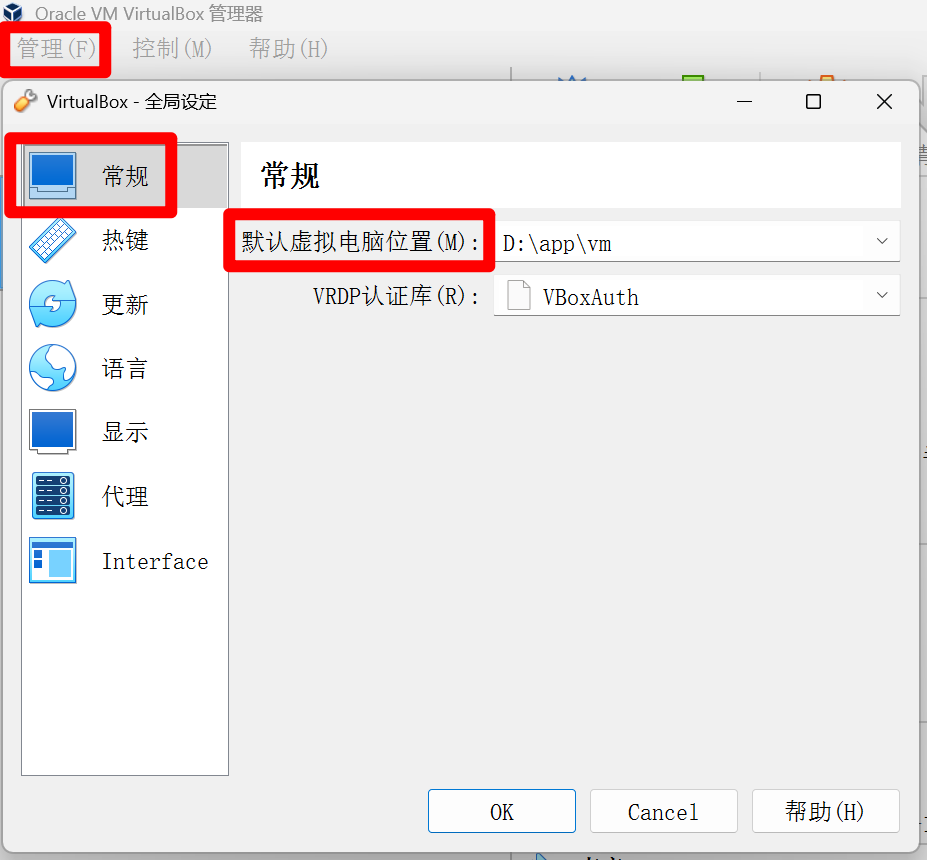
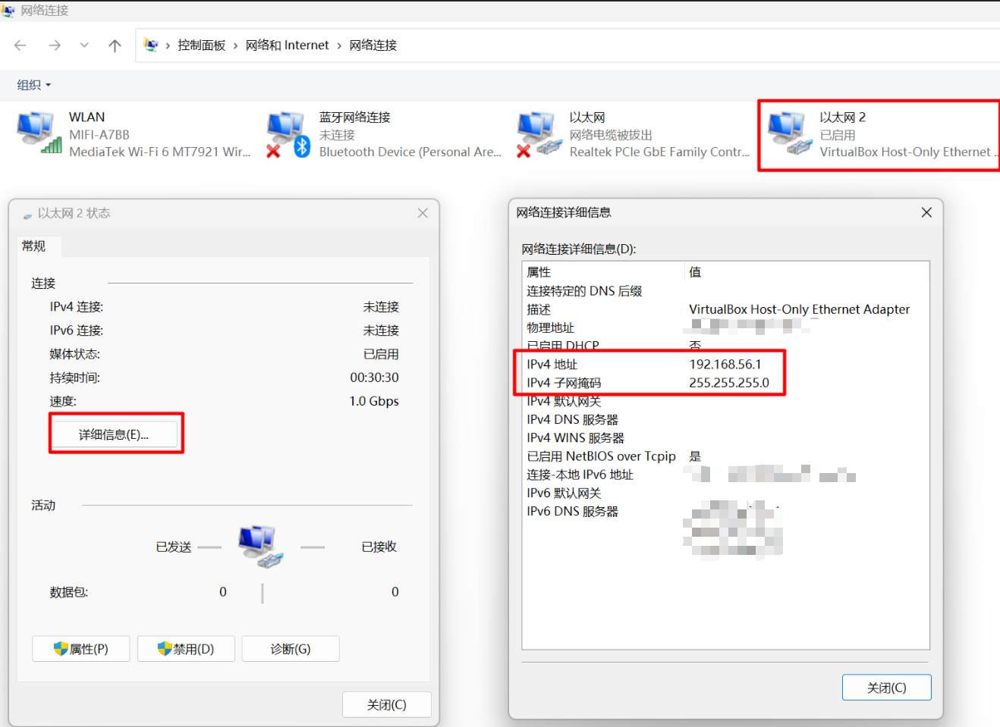

**版本说明**：

```bash
VirtualBox版本：VirtualBox-7.0.6-155176-Win.exe
# Vagrant通过一个名为Vagrantfile的配置文件来管理虚拟机，这让环境搭建变得非常简便
vagrant版本：   vagrant_2.4.9_windows_amd64.msi
```

VirtualBox 和 vagrant安装完成之后，为了避免虚拟机文件占用过多 C 盘空间，可以**修改 VirtualBox 默认虚拟机位置**，打开 VirtualBox，依次点击 **管理** -> **全局设定** -> **常规**，修改“默认虚拟电脑位置” 




**初始化与配置**

- 创建新文件夹`D:\abcd\vagrant_centos7`，然后在此文件夹中打开命令行窗口

- 执行初始化命令

  ```bash
  # 执行初始化命令，会在当前目录生成 Vagrantfile配置文件
  vagrant init centos/7
  ```

- 查看VirtualBox主机网络适配器的IP
    - 打开 Windows 的 **控制面板** > **网络和 Internet** > **网络和共享中心**。在左侧点击 **“更改适配器设置”**
      。在网络连接列表中，找到名为 **“VirtualBox Host-Only Ethernet Adapter”** 的连接，并双击它。在弹出的状态窗口中，点击
      **“详细信息”** 按钮。在“网络连接详细信息”列表里，找到 **“IPv4 地址”** 这一行。其对应的值（例如 `192.168.56.1`
      ）就是宿主机的虚拟网卡 IP。需要在 Vagrantfile 中设置的 IP 地址（如 `192.168.56.10`）必须与此 IP 在同一个网段（即前三位相同）




- 打开 `Vagrantfile`，进行关键配置

  ```bash
  Vagrant.configure("2") do |config|
    config.vm.box = "centos/7"
    # 设置私有网络IP，便于宿主机访问虚拟机。IP前三位需与VirtualBox主机网络适配器的IP一致，例如192.168.56.x
    config.vm.network "private_network", ip: "192.168.56.10"
    # (可选)配置共享文件夹，将宿主机的当前目录映射到虚拟机的/vagrant目录
    config.vm.synced_folder ".", "/vagrant"
    # 使用provider配置来自定义VirtualBox虚拟机的硬件
    config.vm.provider "virtualbox" do |vb|
      # 设置虚拟机的名称
      vb.name = "CentOS-7-VM-4vCPU-8GB"
      # 分配内存大小，建议至少1GB（1024MB）
      vb.memory = "8192"
      # 分配CPU核心数
      vb.cpus = 4
    end
    # (可选)安装vbguest插件以避免每次启动时重复安装Guest Additions
    # config.vbguest.auto_update = false
  end
  ```

**启动与连接**

- 在命令行中运行以下命令，Vagrant将自动完成虚拟机的创建和启动：

  ```bash
  vagrant up
  ```

- 启动完成后，使用以下命令通过SSH登录到虚拟机：

  ```bash
  vagrant ssh
  ```

- 默认使用 `vagrant` 用户登录，该用户具有sudo权限。root用户的默认密码也是 `vagrant`

**常用命令与实用技巧**

| 命令                | 说明                                              |
|:------------------|:------------------------------------------------|
| `vagrant up`      | 启动虚拟机                                           |
| `vagrant ssh`     | 通过SSH登录到虚拟机                                     |
| `vagrant halt`    | 关闭虚拟机                                           |
| `vagrant reload`  | 重启虚拟机（相当于先`halt`再`up`），修改Vagrantfile后常用此命令使配置生效 |
| `vagrant suspend` | 暂停虚拟机（类似休眠，恢复快）                                 |
| `vagrant destroy` | **销毁虚拟机**，删除所有数据，释放磁盘空间                         |
| `vagrant status`  | 查看当前虚拟机的状态                                      |

**安装增强功能（Guest Additions）**

- 显著提升虚拟机的性能，特别是共享文件夹和显示性能。可以安装 `vagrant-vbguest` 插件来自动管理

```bash
vagrant plugin install vagrant-vbguest
vagrant reload
```

**使用Xshell、Termius等第三方SSH工具连接**

- Windows自带的命令行可能不支持 `vagrant ssh`。可以使用Xshell等工具连接。首先，在虚拟机内启用密码登录并设置root密码，然后使用分配的私有IP（如
  `192.168.56.10`）和端口`22`进行连接
- Termius连接虚拟机：

| 解决方案                    | 核心思路                                | 关键检查点/命令                                                                                                                       |
|:------------------------|:------------------------------------|:-------------------------------------------------------------------------------------------------------------------------------|
| **① 配置 Termius 使用密钥登录** | 让 Termius 使用 Vagrant 自动生成的私钥进行认证    | 在 Termius 的 “Identity” 设置中，选择路径 `[Vagrantfile所在目录]/.vagrant/machines/default/virtualbox/private_key` 下的私钥文件                    |
| **② 启用虚拟机内的密码认证**       | 修改虚拟机内 SSH 服务配置，允许使用 `vagrant` 密码登录 | 1. 通过 `vagrant ssh` 登录。 2. 编辑 `/etc/ssh/sshd_config` 文件，确保包含 `PasswordAuthentication yes`。 3. 执行 `sudo systemctl restart sshd` |
| **③ 检查网络与基础连接**         | 确认虚拟机已启动且网络设置正确，特别是端口转发规则           | 1. 在项目目录下执行 `vagrant status`。 2. 在 VirtualBox 中检查虚拟机的“网络”设置，确保端口转发规则正确配置                                                       |

```bash
# 在win11的命令行窗口或者Termius的TERMINAL下进行连接
C:\Users\12345> ssh -i "D:\abcd\vagrant_centos7\.vagrant\machines\default\virtualbox\private_key" vagrant@192.168.56.10
```

`scp`文件传递命令：

```bash
# 从 Windows本地 上传文件到 Linux 服务器 
scp -i "D:\app\centos7\.vagrant\machines\default\virtualbox\private_key" "E:\dljd-kafka\ruanjian\kafka-eagle-bin-3.0.1.tar.gz" vagrant@192.168.56.10:/home/vagrant/

# 从 Linux 服务器下载文件到 Windows 本地
scp -i "D:\app\centos7\.vagrant\machines\default\virtualbox\private_key" vagrant@192.168.56.10:/home/vagrant/kafka-eagle-bin-3.0.1.tar.gz "D:\in-action-aws"
```

