## 1.设计模式概述

**软件设计模式的产生背景**：

- "设计模式"最初并不是出现在软件设计中，而是被用于建筑领域的设计中
- 1977年美国著名建筑大师、加利福尼亚大学伯克利分校环境结构中心主任 `克里斯托夫·亚历山大(christopheralexander)`在他的著作《建筑模式语言：城镇、建筑、构造》中描述了一些常见的建筑设计问题，并提出了 253 种关于对城镇、邻里、住宅、花园和房间等进行设计的基本模式
- 1990年软件工程界开始研讨设计模式的话题，后来召开了多次关于设计模式的研讨会。直到1995年，`艾瑞克·伽马(grichGamma)`、`理査德·海尔姆(Richard Helm)`、`拉尔夫·约翰森(Ralph Johnson)`、`约翰·威利斯迪斯(John vlissides)`等4 位作者合作出版了《设计模式：可复用面向对象软件的基础》一书，在此书中收录了 23 个设计模式，这是设计模式领域里程碑的事件，导致了软件设计模式的突破。这 4位作者在软件开发领域里也以他们的“四人组”(Gang of Four，SoE)著称

**软件设计模式的概念**：

- 软件设计模式(software Design pattern)，又称设计模式，是一套被反复使用、多数人知晓的、经过分类编目的、代码设计经验的总结。它描述了在软件设计过程中的一些不断重复发生的问题，以及该问题的解决方案。也就是说，它是解决特定问题的一系列套路是前辈们的代码设计经验的总结，具有一定的普遍性，可以反复使用

**学习设计模式的必要性**：

- 设计模式的本质是面向对象设计原则的实际运用，是对类的封装性、继承性和多态性以及类的关联关系和组合关系的充分理解
- 正确使用设计模式具有以下优点
  - 可以提高程序员的思维能力、编程能力和设计能力
  - 使程序设计更加标准化、代码编制更加工程化，使软件开发效率大大提高，从而缩短软件的开发周期
  - 使设计的代码可重用性高、可读性强、可靠性高、灵活性好、可维护性强

**设计模式分类**：

- 创建型模式：用于描述“怎样创建对象”，它的主要特点是“将对象的创建与使用分离"。GoF 中提供了单例、原型、工厂方法、抽象工厂、建造者等5种创建型模式
- 结构型模式：用于描述如何将类或对象按某种布局组成更大的结构，GoF (四人组)书中提供了代理、适配器、桥接、装饰、外观、享元、组合等7 种结构型模式
- 行为型模式：用于描述类或对象之间怎样相互协作共同完成单个对象无法单独完成的任务，以及怎样分配职责。GoF(四人组)书中提供了模板方法、策略、命令、职责链、状态、观察者、中介者、迭代器、访问者、备忘录、解释器等 11 种行为型模式

## 2.`UML`图

### 2.1 `UML`图简介

**`UML`图**：统一建模语言(Unified Modeling Language，UML)是用来设计软件的可视化建模语言。它的特点是简单、统一、图形化、能表达软件设计中的动态与静态信息。UML从目标系统的不同角度出发，定义了用例图、类图、对象图、状态图、活动图、时序图、协作图、构件图、部署图等 9种图

**类图概述**：类图(Class diagram)是显示了模型的静态结构，特别是模型中存在的类、类的内部结构以及它们与其他类的关系等。类图不显示暂时性的信息。类图是面向对象建模的主要组成部分

**类图的作用**：在软件工程中，类图是一种静态的结构图，描述了系统的类的集合，类的属性和类之间的关系，可以简化了人们对系统的理解。类图是系统分析和设计阶段的重要产物，是系统编码和测试的重要模型

### 2.2 类图表示法

#### 2.2.1 类的表示方式

- 在`UML`类图中，类使用包含类名、属性(field)和方法(method)且带有分割线的矩形来表示，比如下图表示一个Employee类，它包含name，age和address这3个属性，以及work()方法

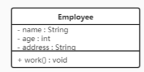

- 属性/方法名称前加的加号和减号表示了这个属性/方法的可见性，`UML`类图中表示可见性的符号有三种：
  - +：表示public
  - -：表示private
  - #：表示protected
- 属性的完整表示方式是：可见性  名称：类型 [ =  缺省值 ]
- 方法的完整表示方式是：可见性 名称(参数列表) [ : 返回类型]

- 注意：
  - 中括号中的内容表示是可选的
  - 也有将类型放在变量名前面，返回值类型放在方法名前面
- 举个栗子：
  - method()方法：修饰符为public，没有参数，没有返回值
  - method1()方法：修饰符为private，没有参数，返回值类型为string
  - method2()方法：修饰符为protected，接收两个参数，第一个参数类型为int，第二个参数类型为string，返回值类型是int

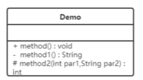

#### 2.2.2 类与类之间关系的表示方式

##### 2.2.2.1 关联关系

关联关系：

- 关联关系是对象之间的一种引用关系，用于表示一类对象与另一类对象之间的联系，如老师和学生、师傅和徒弟、丈夫和妻子等。关联关系是类与类之间最常用的一种关系，分为一般关联关系、聚合关系和组合关系
- 一般关联又可以分为单向关联，双向关联，自关联

1.单向关联

- 在UML类图中单向关联用一个带箭头的实线表示。下图表示每个顾客都有一个地址，这通过让customer类持有一个类型为Address的成员变量来实现

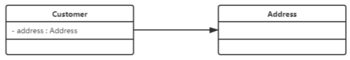

2.双向关联

- 从下图很容易看出，所谓的双向关联就是双方各自持有对方类型的成员变量

- 在`UML`类图中，双向关联用一个不带箭头的直线表示。上图中在customer类中维护一个`List<product>`，表示一个顾客可以购买多个商品

- 在product类中维护一个customer类型的成员变量表示这个产品被哪个顾客所购买

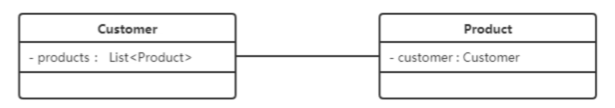

3.自关联

- 自关联在`UML`类图中用一个带有箭头且指向自身的线表示。上图的意思就是node类包含类型为Node的成员变量，也就是"自己包含自己”

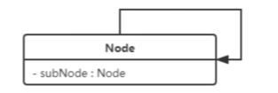

##### 2.2.2.2 聚合关系

聚合关系是关联关系的一种，是强关联关系，是整体和部分之间的关系

聚合关系也是通过成员对象来实现的，其中成员对象是整体对象的一部分，但是成员对象可以脱离整体对象而独立存在。例如，学校与老师的关系，学校包含老师，但如果学校停办了，老师依然存在

在 `UML` 类图中，聚合关系可以用带空心菱形的实线来表示，萎形指向整体。下图所示是大学和教师的关系图：

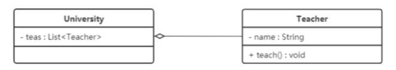

##### 2.2.2.3 组合关系

组合关系表示类之间的整体与部分的关系，但它是一种更强烈的聚合关系

在组合关系中，整体对象可以控制部分对象的生命周期，一旦整体对象不存在，部分对象也将不存在，部分对象不能脱离整体对象而存在。例如，头和嘴的关系，没有了头，也就不存在了

在 `UML` 类图中，组合关系用带实心菱形的实线来表示，菱形指向整体。下图所示是头和嘴的关系图：

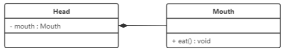

##### 2.2.2.4 依赖关系

依赖关系是一种使用关系，它是对象之间耦合度最弱的一种关联方式，是临时性的关联。在代码中，某个类的方法通过局部变量、方法的参数或者对静态方法的调用来访问另一个类(被依赖类)中的某些方法来完成一些职责

在 `UML` 类图中，依赖关系使用带節头的虚线来表示，節头从使用类指向被依赖的类。下图所示是司机和汽车的关系图，司机驾驶汽车：

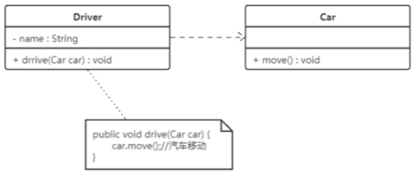

##### 2.2.2.5 继承关系

继承关系是对象之间耦合度最大的一种关系，表示一般与特殊的关系，是父类与子类之间的关系，是一种继承关系

在 `UML` 类图中，泛化关系用带空心三角箭头的实线来表示，箭头从子类指向父类。在代码实现时，使用面向对象的继承机制来实现泛化关系。例如，Student 类和 Teacher 类都是 Person 类的子类，其类图如下图所示：

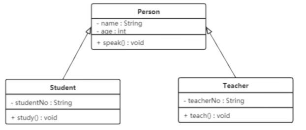


##### 2.2.2.6 实现关系

实现关系是接口与实现类之间的关系。在这种关系中，类实现了接口，类中的操作实现了接口中所声明的所有的抽象操作

在 `UML` 类图中，实现关系使用带空心三角箭头的虚线来表示，箭头从实现类指向接口。例如，汽车和船实现了交通工具


## 3.软件设计原则

在软件开发中，为了提高软件系统的可维护性和可复用性，增加软件的可扩展性和灵活性，程序员要尽量根据6条原则来开发程序，从而提高软件开发效率、节约软件开发成本和维护成本

### 3.1 开闭原则

开闭原则：**对扩展开放，对修改关闭**。在程序需要进行拓展的时候，不能去修改原有的代码，实现一个热插拔的效果。简言之，是为了使程序的扩展性好，易于维护和升级

想要达到这样的效果，需要使用接口和抽象类

因为抽象灵活性好，适应性广，只要抽象的合理，可以基本保持软件架构的稳定，而软件中易变的细节可以从抽象派生来的实现类来进行扩展，当软件需要发生变化时，只需要根据需求重新派生一个实现类来扩展就可以了

> 下面以 `搜狗输入法`的皮肤为例介绍开闭原则的应用
>
> 【例】搜狗输入法 的皮肤设计
>
> 分析: 搜狗输入法的皮肤是输入法背景图片、窗口颜色和声音等元素的组合。用户可以根据自己的喜爱更换自己的输入法的皮肤，也可以从网上下载新的皮肤。这些皮肤有共同的特点，可以为其定义一个抽象类(Abstractskin)，而每个具体的皮肤(Defaultspecificskin和Heimaspecificskin)是其子类。用户窗体可以根据需要选择或者增加新的主题，而不需要修改原代码，所以它是满足开闭原则的

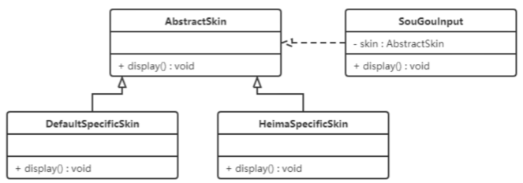

`AbstractSkin`：抽象皮肤类

```java
/**
 * @ClassName: AbstractSkin
 * @Description: 抽象皮肤类
 */
public abstract class AbstractSkin {
    //显示的方法
    public abstract void display();
}
```

`DefaultSkin`：默认皮肤类

```java
/**
 * @ClassName: DefaultSkin
 * @Description: 默认皮肤类
 */
public class DefaultSkin extends AbstractSkin {

    public void display() {
        System.out.println("默认皮肤");
    }
}
```

`HeimaSkin`：黑马皮肤

```java
/**
 * @ClassName: HeimaSkin
 * @Description: 黑马皮肤
 */
public class HeimaSkin extends AbstractSkin {
    public void display() {
        System.out.println("黑马皮肤");
    }
}
```

`SougouInput`：搜狗输入法

```java
/**
 * @ClassName: SougouInput
 * @Description: 搜狗输入法
 */
public class SougouInput {

    private AbstractSkin skin;  // 聚合关系

    public void setSkin(AbstractSkin skin) {
        this.skin = skin;
    }

    public void display() {
        skin.display();
    }
}
```

`Client`：使用搜狗输入法

```java
/**
 * @ClassName: Client
 */
public class Client {
    public static void main(String[] args) {
        //1,创建搜狗输入法对象
        SougouInput input = new SougouInput();
        // 2.1 创建皮肤对象
        //DefaultSkin skin = new DefaultSkin();
        // 2.2 创建黑马皮肤
        HeimaSkin skin = new HeimaSkin();
        //3,将皮肤设置到输入法中
        input.setSkin(skin);

        //4,显示皮肤
        input.display();
    }
}
```

### 3.2 里氏代换原则

里氏代换原则是面向对象设计的基本原则之一

里氏代换原则：任何基类可以出现的地方，子类一定可以出现。通俗理解：子类可以扩展父类的功能，但不能改变父类原有的功能。换句话说，子类继承父类时，除添加新的方法完成新增功能外，尽量不要重写父类的方法。如果通过重写父类的方法来完成新的功能，这样写起来虽然简单，但是整个继承体系的可复用性会比较差，特别是运用多态比较频繁时程序运行出错的概率会非常大

> 下面看一个里氏替换原则中经典的一个例子
>
> 【例】正方形不是长方形
>
> 在数学领域里，正方形毫无疑问是长方形，它是一个长宽相等的长方形。所以，我们开发的一个与几何图形相关的软件系统，就可以顺理成章的让正方形继承自长方形


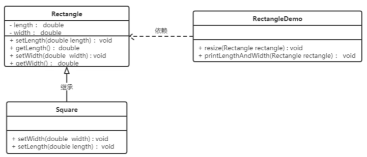


`Rectangle`：长方形类

```java
/**
 * @ClassName: Rectangle
 * @Description: 长方形类
 */
public class Rectangle {
    private double length;
    private double width;

    public double getLength() {
        return length;
    }

    public void setLength(double length) {
        this.length = length;
    }

    public double getWidth() {
        return width;
    }

    public void setWidth(double width) {
        this.width = width;
    }
}
```

`Square`：正方形类

```java
/**
 * @ClassName: Square
 * @Description: 正方形类
 * 由于正方形的长和宽相同，所以在方法setLength和setWidth中，对长度和宽度都需要赋相同值
 */
public class Square extends Rectangle {

    @Override
    public void setLength(double length) {
        super.setLength(length);
        super.setWidth(length);
    }

    @Override
    public void setWidth(double width) {
        super.setLength(width);
        super.setWidth(width);
    }
}
```

`RectangleDemo`：类RectangleDemo是软件系统中的一个组件，它有一个resize方法依赖基类Rectangle，resize方法是RectandleDemo类中的一个方法，用来实现宽度逐渐增长的效果

```java
public class RectangleDemo {
    
    public static void resize(Rectangle rectangle) {
        while (rectangle.getWidth() <= rectangle.getLength()) {
            rectangle.setWidth(rectangle.getWidth() + 1);
        }
    }

    //打印长方形的长和宽
    public static void printLengthAndWidth(Rectangle rectangle) {
        System.out.println(rectangle.getLength());
        System.out.println(rectangle.getWidth());
    }

    public static void main(String[] args) {
        Rectangle rectangle = new Rectangle();
        rectangle.setLength(20);
        rectangle.setWidth(10);
        resize(rectangle);
        printLengthAndWidth(rectangle);

        System.out.println("============");

        Rectangle rectangle1 = new Square();
        rectangle1.setLength(10);
        resize(rectangle1);
        printLengthAndWidth(rectangle1);
    }
}
```

运行一下这段代码就会发现，假如把一个普通长方形作为参数传入resize方法，就会看到长方形宽度逐渐增长的效果，当宽度大于长度，代码就会停止，这种行为的结果符合预期；假如再把一个正方形作为参数传入resize方法后，就会看到正方形的宽度和长度都在不断增长，代码会一直运行下去，直至系统产生溢出错误。所以，普通的长方形是适合这段代码的，正方形不适合

得出结论：在resize方法中，Rectangle类型的参数是不能被Square类型的参数所代替，如果进行了替换就得不到预期结果。因此，Square类和Rectangle类之间的继承关系违反了里氏代换原则，它们之间的继承关系不成立，正方形不是长方形

如何改进呢？此时需要重新设计他们之间的关系。抽象出来一个四边形接口(Quadrilateral)，让Rectangle类和Square类实现Quadrilateral接口

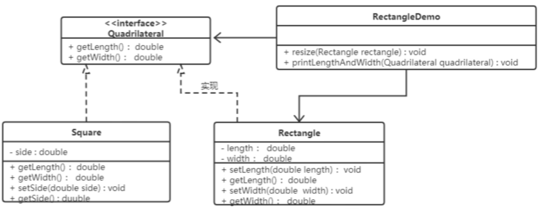

`Quadrilateral`：四边形接口

```java
/**
 * @ClassName: Quadrilateral
 * @Description: 四边形接口
 */
public interface Quadrilateral {

    //获取长
    double getLength();

    //获取宽
    double getWidth();
}
```

`Rectangle`：长方形类

```java
/**
 * @ClassName: Rectangle
 * @Description: 长方形类
 */
public class Rectangle implements Quadrilateral {

    private double length;
    private double width;

    public void setLength(double length) {
        this.length = length;
    }

    public void setWidth(double width) {
        this.width = width;
    }

    public double getLength() {
        return length;
    }

    public double getWidth() {
        return width;
    }
}
```

`Square`：正方形

```java
/**
 * @ClassName: Square
 * @Description: 正方形
 */
public class Square implements Quadrilateral {

    private double side;

    public double getSide() {
        return side;
    }

    public void setSide(double side) {
        this.side = side;
    }

    public double getLength() {
        return side;
    }

    public double getWidth() {
        return side;
    }
}
```

`RectangleDemo`：

```java
public class RectangleDemo {
    public static void main(String[] args) {
        //创建长方形对象
        Rectangle r = new Rectangle();
        r.setLength(20);
        r.setWidth(10);
        //调用方法进行扩宽操作
        resize(r);

        printLengthAndWidth(r);
    }

    //扩宽的方法
    public static void resize(Rectangle rectangle) {
        //判断宽如果比长小，进行扩宽的操作
        while(rectangle.getWidth() <= rectangle.getLength()) {
            rectangle.setWidth(rectangle.getWidth() + 1);
        }
    }

    //打印长和宽
    public static void printLengthAndWidth(Quadrilateral quadrilateral) {
        System.out.println(quadrilateral.getLength());
        System.out.println(quadrilateral.getWidth());
    }
}
```

### 3.3 依赖倒转原则

依赖倒转原则：高层模块不应该依赖低层模块，两者都应该依赖其抽象；抽象不应该依赖细节，细节应该依赖抽象。简单的说就是要求对抽象进行编程，不要对实现进行编程，这样就降低了客户与实现模块间的耦合

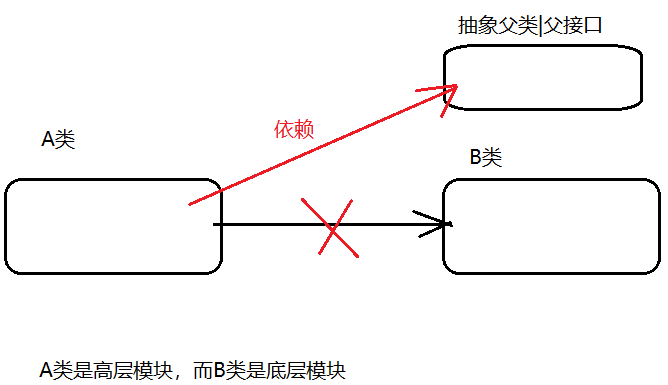

> 下面看一个例子来理解依赖倒转原则
>
> 【例】组装电脑
>
> 现要组装一台电脑，需要配件gpu，硬盘，内存条。只有这些配置都有了，计算机才能正常的运行。选择cpu有很多选择，如Intel，AMD等，硬盘可以选择希捷，西数等，内存条可以选择金士顿，海盗船等。类图如下：

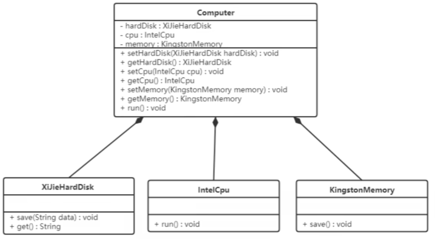

`XiJieHardDisk`：希捷硬盘

```java
/**
 * @ClassName: XiJieHardDisk
 * @Description: 希捷硬盘
 */
public class XiJieHardDisk {

    //存储数据的方法
    public void save(String data) {
        System.out.println("使用希捷硬盘存储数据为：" + data);
    }

    //获取数据的方法
    public String get() {
        System.out.println("使用希捷希捷硬盘取数据");
        return "数据";
    }
}
```

`IntelCpu`：IntelCpu

```java
/**
 * @ClassName: IntelCpu
 */
public class IntelCpu {

    public void run() {
        System.out.println("使用Intel处理器");
    }
}
```

`KingstonMemory`：金士顿内存条类

```java
/**
 * @Description: 金士顿内存条类
 */
public class KingstonMemory {

    public void save() {
        System.out.println("使用金士顿内存条");
    }
}
```

`Computer`：Computer

```java
/**
 * @ClassName: Computer
 */
public class Computer {

    private XiJieHardDisk hardDisk;
    private IntelCpu cpu;
    private KingstonMemory memory;

    public XiJieHardDisk getHardDisk() {
        return hardDisk;
    }

    public void setHardDisk(XiJieHardDisk hardDisk) {
        this.hardDisk = hardDisk;
    }

    public IntelCpu getCpu() {
        return cpu;
    }

    public void setCpu(IntelCpu cpu) {
        this.cpu = cpu;
    }

    public KingstonMemory getMemory() {
        return memory;
    }

    public void setMemory(KingstonMemory memory) {
        this.memory = memory;
    }

    public void run() {
        System.out.println("运行计算机");
        String data = hardDisk.get();
        System.out.println("从硬盘上获取的数据是：" + data);
        cpu.run();
        memory.save();
    }
}
```

`ComputerDemo`：

```java
/**
 * @ClassName: ComputerDemo
 */
public class ComputerDemo {
    public static void main(String[] args) {
        //创建组件对象
        XiJieHardDisk hardDisk = new XiJieHardDisk();
        IntelCpu cpu = new IntelCpu();
        KingstonMemory memory = new KingstonMemory();

        //创建计算机对象
        Computer c = new Computer();
        //组装计算机
        c.setCpu(cpu);
        c.setHardDisk(hardDisk);
        c.setMemory(memory);

        //运行计算机
        c.run();
        /*
            运行计算机
            使用希捷希捷硬盘取数据
            从硬盘上获取的数据是：数据
            使用Intel处理器
            使用金士顿内存条
         */
    }
}
```

上面代码可以看到已经组装了一台电脑，但是似乎组装的电脑的cpu只能是Intel的，内存条只能是金士顿的，硬盘只能是希捷的，这对用户肯定是不友好的，用户有了机箱肯定是想按照自己的喜好，选择自己喜欢的配件

根据依赖倒转原则进行改进：代码只需要修改computer类，让computer类依赖抽象(各个配件的接口)，而不是依赖于各个组件具体的实现类。改进后类图：

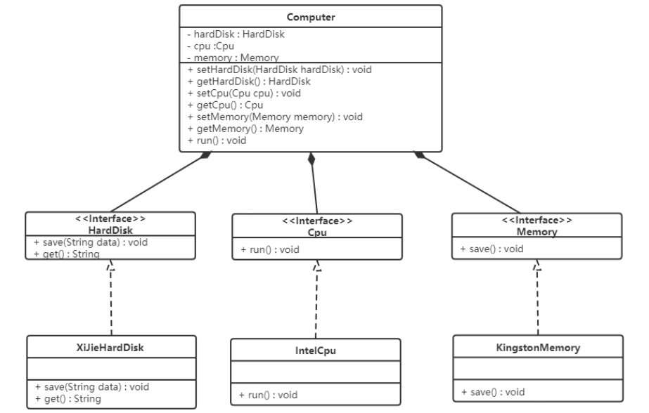


`HardDisk`：硬盘接口

```java
/**
 * @Description: 硬盘接口
 */
public interface HardDisk {

    //存储数据
    public void save(String data);

    //获取数据
    public String get();
}
```

`XiJieHardDisk`：希捷硬盘

```java
/**
 * @Description: 希捷硬盘
 */
public class XiJieHardDisk implements HardDisk {

    //存储数据的方法
    public void save(String data) {
        System.out.println("使用希捷硬盘存储数据为：" + data);
    }

    //获取数据的方法
    public String get() {
        System.out.println("使用希捷希捷硬盘取数据");
        return "数据";
    }
}
```

`Cpu`：cpu接口

```java
/**
 * @Description: cpu接口
 */
public interface Cpu {
    //运行cpu
    public void run();
}
```

`IntelCpu`：Intel cpu

```java
/**
 * @Description: Intel cpu
 */
public class IntelCpu implements Cpu {

    public void run() {
        System.out.println("使用Intel处理器");
    }
}
```

`Memory`：内存条接口

```java
/**
 * @Description: 内存条接口
 */
public interface Memory {

    public void save();
}
```

`KingstonMemory`：金士顿内存条类

```java
/**
 * @Description: 金士顿内存条类
 */
public class KingstonMemory implements Memory {

    public void save() {
        System.out.println("使用金士顿内存条");
    }
}
```

`Computer`：Computer

```java
/**
 * @ClassName: Computer
 */
public class Computer {

    private HardDisk hardDisk;
    private Cpu cpu;
    private Memory memory;

    public HardDisk getHardDisk() {
        return hardDisk;
    }

    public void setHardDisk(HardDisk hardDisk) {
        this.hardDisk = hardDisk;
    }

    public Cpu getCpu() {
        return cpu;
    }

    public void setCpu(Cpu cpu) {
        this.cpu = cpu;
    }

    public Memory getMemory() {
        return memory;
    }

    public void setMemory(Memory memory) {
        this.memory = memory;
    }

    //运行计算机
    public void run() {
        System.out.println("运行计算机");
        String data = hardDisk.get();
        System.out.println("从硬盘上获取的数据是：" + data);
        cpu.run();
        memory.save();
    }
}
```

`ComputerDemo`：ComputerDemo

```java
/**
 * @ClassName: ComputerDemo
 */
public class ComputerDemo {
    public static void main(String[] args) {

        //创建计算机的组件对象
        HardDisk hardDisk = new XiJieHardDisk();
        Cpu cpu = new IntelCpu();
        Memory memory = new KingstonMemory();

        //创建计算机对象
        Computer c = new Computer();
        //组装计算机
        c.setCpu(cpu);
        c.setHardDisk(hardDisk);
        c.setMemory(memory);

        //运行计算机
        c.run();
        /*
        运行计算机
        使用希捷希捷硬盘取数据
        从硬盘上获取的数据是：数据
        使用Intel处理器
        使用金士顿内存条
         */
    }
}
```

### 3.4 接口隔离原则

接口隔离原则：客户端不应该被迫依赖于它不使用的方法；一个类对另一个类的依赖应该建立在最小的接口上

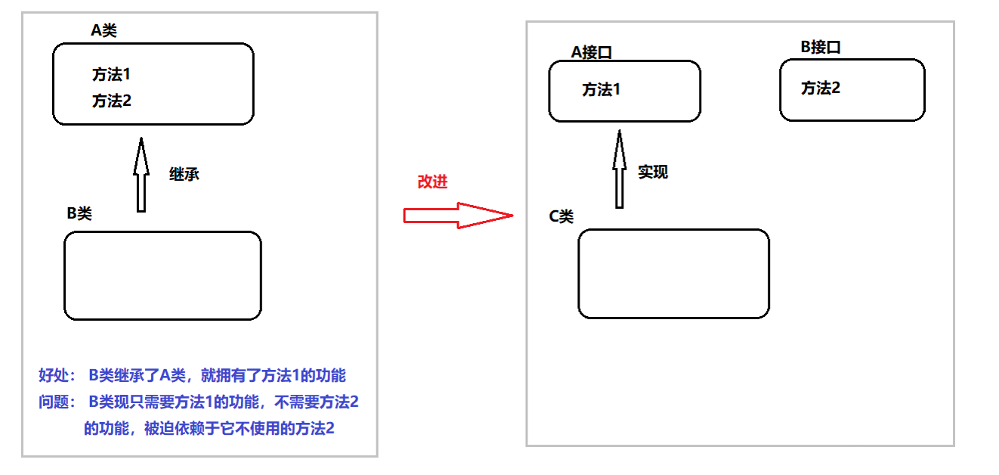


> 下面看一个例子来理解接口隔离原则
>
> 【例】安全门案例
>
> 创建一个 黑马 品牌的安全门，该安全门具有防火、防水、防盗的功能。可以将防火，防水，防盗功能提取成一个接口，形成一套规范。类图如下：

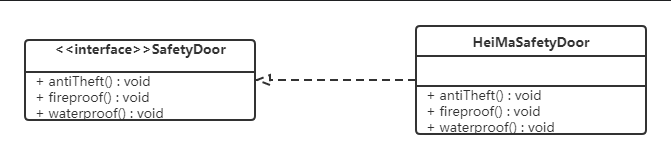

`SafetyDoor`：安全门接口

```java
/**
 * @Description: 安全门接口
 */
public interface SafetyDoor {

    //防盗
    void antiTheft();

    //防火
    void fireProof();

    //防水
    void waterProof();
}
```

`HeimaSafetyDoor`：黑马品牌安全门

```java
/**
 * @Description: 黑马品牌的安全门
 */
public class HeimaSafetyDoor implements SafetyDoor {
    public void antiTheft() {
        System.out.println("防盗");
    }

    public void fireProof() {
        System.out.println("防火");
    }

    public void waterProof() {
        System.out.println("防水");
    }
}
```

`Client`：测试

```java
public class Client {
    public static void main(String[] args) {
        HeimaSafetyDoor door = new HeimaSafetyDoor();
        door.antiTheft();
        door.fireProof();
        door.waterProof();
    }
}
```

上面的设计中存在问题，黑马品牌的安全门具有防盗，防水，防火的功能。现在如果还需要再创建一个传智品牌的安全门，而该安全门只具有防盗、防水功能呢？很显然如果实现SafetyDoor接口就违背了接口隔离原则，那么如何进行修改呢？看如下类图：

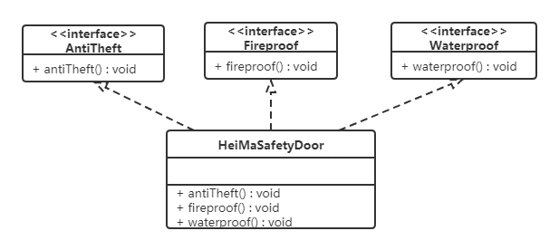

`AntiTheft`：防盗接口

```java
/**
 * @Description: 防盗接口
 */
public interface AntiTheft {
    void antiTheft();
}
```

`Fireproof`：防火接口

```java
/**
 * @Description: 防火接口
 */
public interface Fireproof {
    void fireproof();
}
```

`Waterproof`：防水接口

```java
/**
 * @Description: 防水接口
 */
public interface Waterproof {
    void waterproof();
}
```

`HeiMaSafetyDoor`：

```java
/**
 * @ClassName: HeiMaSafetyDoor
 */
public class HeiMaSafetyDoor implements AntiTheft,Fireproof,Waterproof {
    public void antiTheft() {
        System.out.println("防盗");
    }

    public void fireproof() {
        System.out.println("防火");
    }

    public void waterproof() {
        System.out.println("防水");
    }
}
```

`ItcastSafetyDoor`：传智安全门

```java
/**
 * @Description: 传智安全门
 */
public class ItcastSafetyDoor implements AntiTheft,Fireproof {
    public void antiTheft() {
        System.out.println("防盗");
    }

    public void fireproof() {
        System.out.println("防火");
    }
}
```

`Client`：测试

```java
public class Client {
    public static void main(String[] args) {
        //创建黑马安全门对象
        HeimaSafetyDoor door = new HeimaSafetyDoor();
        //调用功能
        door.antiTheft();
        door.fireProof();
        door.waterProof();

        System.out.println("============");
        //创建传智安全门对象
        ItcastSafetyDoor door1 = new ItcastSafetyDoor();
        //调用功能
        door1.antiTheft();
        door1.fireproof();
    }
}
```

### 3.5 迪米特法则

迪米特法则：迪米特法则又叫最少知识原则。只和你的直接朋友交谈，不跟“陌生人”说话（Talk only to your immediate friends and not to strangers）。其含义是：如果两个软件实体无须直接通信，那么就不应当发生直接的相互调用，可以通过第三方转发该调用。其目的是降低类之间的耦合度，提高模块的相对独立性

迪米特法则中的“朋友”是指：当前对象本身、当前对象的成员对象、当前对象所创建的对象、当前对象的方法参数等，这些对象同当前对象存在关联、聚合或组合关系，可以直接访问这些对象的方法。


> 下面看一个例子来理解迪米特法则
>
> 【例】明星与经纪人的关系实例
>
> 明星由于全身心投入艺术，所以许多日常事务由经纪人负责处理，如和粉丝的见面会，和媒体公司的业务洽淡等。这里的经纪人是明星的朋友，而粉丝和媒体公司是陌生人，所以适合使用迪米特法则。类图如下：

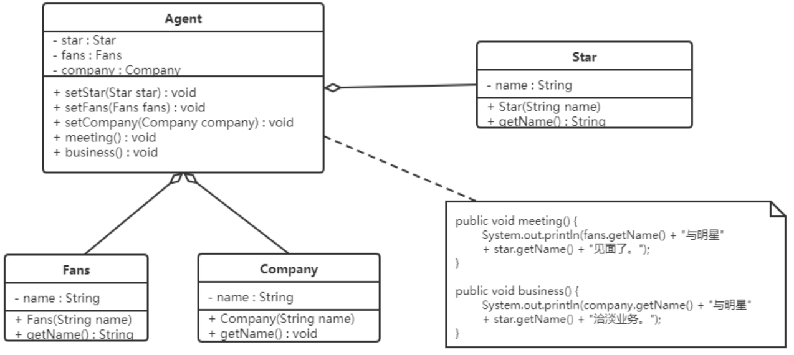

`Star`：明星类

```java
/**
 * @Description: 明星类
 */
public class Star {
    private String name;

    public Star(String name) {
        this.name = name;
    }

    public String getName() {
        return name;
    }
}
```

`Fans`：粉丝类

```java
/**
 * @Description: 粉丝类
 */
public class Fans {

    private String name;

    public String getName() {
        return name;
    }

    public Fans(String name) {
        this.name = name;
    }
}
```

`Company`：媒体公司类

```java
/**
 * @Description: 媒体公司类
 */
public class Company {
    private String name;

    public String getName() {
        return name;
    }

    public Company(String name) {
        this.name = name;
    }
}
```

`Agent`：经纪人类

```java
/**
 * @Description: 经纪人类
 */
public class Agent {

    private Star star;
    private Fans fans;
    private Company company;

    public void setStar(Star star) {
        this.star = star;
    }

    public void setFans(Fans fans) {
        this.fans = fans;
    }

    public void setCompany(Company company) {
        this.company = company;
    }

    //和粉丝见面的方法
    public void meeting() {
        System.out.println(star.getName() + "和粉丝" + fans.getName() + "见面");
    }

    //和媒体公司洽谈的方法
    public void business() {
        System.out.println(star.getName() + "和" + company.getName() + "洽谈");
    }
}
```

`Client`：测试

```java
/**
 * @ClassName: Client
 */
public class Client {
    public static void main(String[] args) {
        //创建经纪人类
        Agent agent = new Agent();
        //创建明星对象
        Star star = new Star("林青霞");
        agent.setStar(star);
        //创建粉丝对象
        Fans fans = new Fans("李四");
        agent.setFans(fans);
        //创建媒体公司对象
        Company company = new Company("黑马媒体公司");
        agent.setCompany(company);

        agent.meeting();//和粉丝见面
        agent.business();//和媒体公司洽谈业务
        /*
        林青霞和粉丝李四见面
        林青霞和黑马媒体公司洽谈
         */
    }
}
```

### 3.6 合成复用原则

合成复用原则：尽量先使用组合或者聚合等关联关系来实现，其次才考虑使用继承关系来实现。通常类的复用分为继承复用和合成复用两种。

继承复用虽然有简单和易实现的优点，但它也存在以下缺点：

1. 继承复用破坏了类的封装性。因为继承会将父类的实现细节暴露给子类，父类对子类是透明的，所以这种复用又称为“白箱”复用
2. 子类与父类的耦合度高。父类的实现的任何改变都会导致子类的实现发生变化，这不利于类的扩展与维护
3. 它限制了复用的灵活性。从父类继承而来的实现是静态的，在编译时已经定义，所以在运行时不可能发生变化


采用组合或聚合复用时，可以将已有对象纳入新对象中，使之成为新对象的一部分，新对象可以调用已有对象的功能，它有以下优点：

1. 它维持了类的封装性。因为成员对象的内部细节是新对象看不见的，所以这种复用又称为“黑箱”复用。
2. 对象间的耦合度低。可以在类的成员位置声明抽象。
3. 复用的灵活性高。这种复用可以在运行时动态进行，新对象可以动态地引用与成分对象类型相同的对象。

> 下面看一个例子来理解合成复用原则
>
> 【例】汽车分类管理程序
>
> 汽车按“动力源”划分可分为汽油汽车、电动汽车等；按“颜色”划分可分为白色汽车、黑色汽车和红色汽车等。如果同时考虑这两种分类，其组合就很多。类图如下（属于继承复用）： 

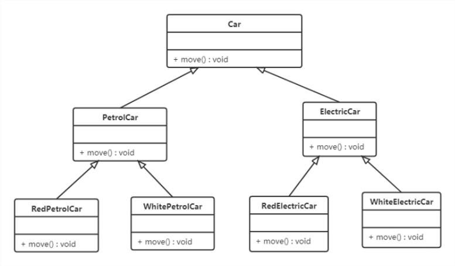

从上面类图可以看到使用继承复用产生了很多子类，如果现在又有新的动力源或者新的颜色的话，就需要再定义新的类。我们试着将继承复用改为聚合复用看一下：

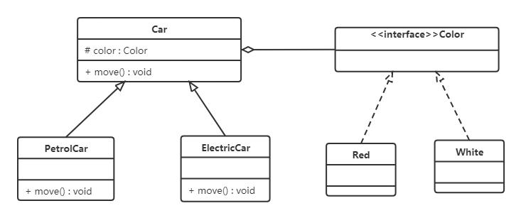

## 4.创建者模式

创建型模式的主要关注点是“怎样创建对象?"，它的主要特点是“将对象的创建与使用分离”。这样可以降低系统的耦合度，使用者不需要关注对象的创建细节

创建型模式分为：

- 单例模式
- 工厂方法模式
- 抽象工程模式
- 原型模式
- 建造者模式

### 4.1 单例设计模式

#### 4.1.1 单例模式简介

单例模式：

- 单例模式（Singleton Pattern）是 Java 中最简单的设计模式之一。这种类型的设计模式属于创建型模式，它提供了一种创建对象的最佳方式。单例模式涉及到一个单一的类，该类负责创建自己的对象，同时确保只有单个对象被创建。这个类提供了一种访问其唯一的对象的方式，可以直接访问，不需要实例化该类的对象

- 单例模式的结构：
  - 单例模式的主要有以下角色
    - 单例类。只能创建一个实例的类
    - 访问类。使用单例类

#### 4.1.2 单例模式的实现

单例设计模式分类两种：

> 		饿汉式：类加载就会导致该单实例对象被创建。饿汉式又分为静态变量方式、静态代码块方式	
> 														
> 		懒汉式：类加载不会导致该单实例对象被创建，而是首次使用该对象时才会创建

##### 4.1.2.1 饿汉式

1.饿汉式（静态变量方式）

```java
/**
 * @ClassName: Singleton
 * @Description:
 *      饿汉式： 静态成员变量
 */
public class Singleton {

    //1，私有构造方法
    private Singleton() {}

    //2，在本类中创建本类对象
    private static Singleton instance = new Singleton();

    //3，提供一个公共的访问方式，让外界获取该对象
    public static Singleton getInstance() {
        return instance;
    }
}

// 说明: 
// 该方式在成员位置声明Singleton类型的静态变量，并创建Singleton类的对象instance
// instance对象是随着类的加载而创建的。如果该对象足够大的话，而一直没有使用就会造成内存的浪费
```

`Client`：测试

```java
public class Client {
    public static void main(String[] args) {
        //创建Singletion类的对象
        Singleton instance = Singleton.getInstance();

        Singleton instance1 = Singleton.getInstance();

        //判断获取到的两个是否是同一个对象
        System.out.println(instance == instance1); // true
    }
}
```

2.饿汉式（静态代码块方式）

```java
/**
 *      饿汉式 ： 静态代码块
 */
public class Singleton {

    //私有构造方法
    private Singleton() {}

    //声明Singleton类型的变量
    private static Singleton instance; //null

    //在静态代码块中进行赋值
    static {
        instance = new Singleton();
    }

    //对外提供获取该类对象的方法
    public static Singleton getInstance() {
        return instance;
    }
}


// 说明：
// 该方式在成员位置声明Singleton类型的静态变量，而对象的创建是在静态代码块中，也是对着类的加载而创建
// 所以和饿汉式的方式1基本上一样，当然该方式也存在内存浪费问题。


// 为什么要使用私有的构造方法？
// 1.使用私有构造方法主要是为了防止外部代码直接创建该类的多个实例
// 2.通过将构造方法设为私有，就限制了其他类通过常规的方式（如使用 new 关键字）来创建该类的新对象
```

`Client`：测试

```java
public class Client {
    public static void main(String[] args) {
        Singleton instance = Singleton.getInstance();

        Singleton instance1 = Singleton.getInstance();

        //判断两次获取到的Singleton对象是否是同一个对象
        System.out.println(instance == instance1); // true
    }
}
```

##### 4.1.2.2 懒汉式

1.懒汉式（线程不安全）

`Singleton`：懒汉式（线程不安全）

```java
/**
 * 懒汉式（线程不安全）
 */
public class Singleton {

   public class Singleton {
       //私有构造方法
       private Singleton() {}
   
       //在成员位置创建该类的对象
       private static Singleton instance;
   
       //对外提供静态方法获取该对象
       public static Singleton getInstance() {
   
           if(instance == null) {
               instance = new Singleton();
           }
           return instance;
       }
   }
}
// 从上面代码可以看出该方式在成员位置声明Singleton类型的静态变量，并没有进行对象的赋值操作，那么什么时候赋值的呢？
// 当调用getInstance()方法获取Singleton类的对象的时候才创建Singleton类的对象，这样就实现了懒加载的效果。但是，如果是多线程环境，会出现线程安全问题。
```

`Client`：测试类

```java
public class Client {
    public static void main(String[] args) {
        Singleton instance = Singleton.getInstance();
        Singleton instance1 = Singleton.getInstance();
        //判断两次获取到的Singleton对象是否是同一个对象
        System.out.println(instance == instance1); // true
    }
}
```

2.懒汉式（线程安全）

```java
/**
 * 懒汉式（线程安全）
 */
public class Singleton {

    //私有构造方法
    private Singleton() {}

    //声明Singleton类型的变量instance
    private static Singleton instance; //只是声明一个该类型的变量，并没有进行赋值

    //对外提供访问方式
    public static synchronized Singleton getInstance() {
        //判断instance是否为null，如果为null，说明还没有创建Singleton类的对象
        //如果没有，创建一个并返回，如果有，直接返回
        if(instance == null) {
            //线程1等待，线程2获取到cpu的执行权，也会进入到该判断里面
            instance = new Singleton();
        }
        return instance;
    }
}
// 说明：
// 该方式也实现了懒加载效果，同时又解决了线程安全问题。但是在getInstance()方法上添加了synchronized关键字，导致该方法的执行效果特别低
// 从上面代码我们可以看出，其实就是在初始化instance的时候才会出现线程安全问题，一旦初始化完成就不存在了
```

3.懒汉式（双重检查锁）

- 再来讨论一下懒汉模式中加锁的问题，对于 `getInstance()` 方法来说，绝大部分的操作都是读操作，读操作是线程安全的，所以没必让每个线程必须持有锁才能调用该方法，需要调整加锁的时机。由此也产生了一种新的实现模式：双重检查锁模式

```java
/**
 * @Description: 懒汉式——双重检查锁方式
 */
public class Singleton { 

   //私有构造方法
   private Singleton() {}

   private static Singleton instance;

  //对外提供静态方法获取该对象
   public static Singleton getInstance() {
    //第一次判断，如果instance不为null，不进入抢锁阶段，直接返回实例
       if(instance == null) {
           synchronized (Singleton.class) {
               //抢到锁之后再次判断是否为null
               if(instance == null) {
                   instance = new Singleton();
               }
           }
       }
       return instance;
   }
}
```

- 双重检查锁模式是一种非常好的单例实现模式，解决了单例、性能、线程安全问题，上面的双重检测锁模式看上去完美无缺，其实是存在问题，在多线程的情况下，可能会出现空指针问题，出现问题的原因是JVM在实例化对象的时候会进行优化和指令重排序操作。要解决双重检查锁模式带来空指针异常的问题，只需要使用 `volatile` 关键字, `volatile` 关键字可以保证可见性和有序性
- 添加 `volatile` 关键字之后的双重检查锁模式是一种比较好的单例实现模式，能够保证在多线程的情况下线程安全也不会有性能问题

```java
/**
 * @Description: 懒汉式——双重检查锁方式
 */
public class Singleton {

    //私有构造方法
    private Singleton() {}

    //声明Singleton类型的变量
    private static volatile Singleton instance;

    //对外提供公共的访问方式
    public static Singleton getInstance() {
        //第一次判断，如果instance的值不为null，不需要抢占锁，直接返回对象
        if(instance == null) {
            synchronized (Singleton.class) {
                //第二次判断
                if(instance == null) {
                    instance = new Singleton();
                }
            }
        }

        return instance;
    }
}
```

4.懒汉式（静态内部类方式）

- 静态内部类单例模式中实例由内部类创建，由于 JVM 在加载外部类的过程中, 是不会加载静态内部类的, 只有内部类的属性/方法被调用时才会被加载, 并初始化其静态属性。静态属性由于被 `static` 修饰，保证只被实例化一次，并且严格保证实例化顺序

```java
/**
 * @Description: 静态内部类方式
 */
public class Singleton {

    //私有构造方法
    private Singleton() {}

    //定义一个静态内部类
    private static class SingletonHolder {
        //在内部类中声明并初始化外部类的对象
        private static final Singleton INSTANCE = new Singleton();
    }

    //提供公共的访问方式
    public static Singleton getInstance() {
        return SingletonHolder.INSTANCE;
    }
}

// 说明：
// 1.第一次加载Singleton类时不会去初始化INSTANCE，只有第一次调用getInstance，虚拟机加载SingletonHolder，并初始化INSTANCE，这样不仅能确保线程安全，也能保证 Singleton 类的唯一性
// 2.静态内部类单例模式是一种优秀的单例模式，是开源项目中比较常用的一种单例模式。在没有加任何锁的情况下，保证了多线程下的安全，并且没有任何性能影响和空间的浪费
```

`Client`：测试

```java
public class Client {
    public static void main(String[] args) {
        Singleton instance = Singleton.getInstance();
        Singleton instance1 = Singleton.getInstance();

        System.out.println(instance == instance1); // true
    }
}
```

##### 4.1.2.3 枚举方式

枚举方式：枚举类实现单例模式是极力推荐的单例实现模式，因为枚举类型是线程安全的，并且只会装载一次，设计者充分的利用了枚举的这个特性来实现单例模式，枚举的写法非常简单，而且枚举类型是所用单例实现中唯一一种不会被破坏的单例实现模式

```java
/**
 * 枚举方式
 */
public enum Singleton {
    INSTANCE;
}
```

> 说明：枚举方式属于恶汉式方式

`Client`：测试

```java
public class Client {
    public static void main(String[] args) {
        Singleton instance = Singleton.INSTANCE;
        Singleton instance1 = Singleton.INSTANCE;
        System.out.println(instance == instance1); // true
    }
}
```

#### 4.1.3 存在的问题：破坏单例模式

破坏单例模式：有两种方式破坏单例模式，分别是序列化和反射。序列化和反射可以使得上面定义的单例类（Singleton）可以创建多个对象，枚举方式除外

##### 4.1.3.1 序列化破坏单例模式

`Singleton`：静态内部类方式实现单例模式

```java
/**
 * @Description: 静态内部类方式
 */
public class Singleton implements Serializable {

    //私有构造方法
    private Singleton() {}

    //定义一个静态内部类
    private static class SingletonHolder {
        //在内部类中声明并初始化外部类的对象
        private static final Singleton INSTANCE = new Singleton();
    }

    //提供公共的访问方式
    public static Singleton getInstance() {
        return SingletonHolder.INSTANCE;
    }

    //当进行反序列化时，会自动调用该方法，将该方法的返回值直接返回
    public Object readResolve() {
        return SingletonHolder.INSTANCE;
    }

}
```

`Client`：测试使用序列化破坏单例模式

```java
import java.io.FileInputStream;
import java.io.FileOutputStream;
import java.io.ObjectInputStream;
import java.io.ObjectOutputStream;
/**
 *      测试使用序列化破坏单例模式
 *      桌面路径： C:\Users\22418\Desktop
 */
public class Client {
      public static void main(String[] args) throws Exception {
          //往文件中写对象
          //writeObject2File();
          //从文件中读取对象
          Singleton s1 = readObjectFromFile();
          Singleton s2 = readObjectFromFile();
  
          //判断两个反序列化后的对象是否是同一个对象
          System.out.println(s1 == s2); //false
      }
  
      private static Singleton readObjectFromFile() throws Exception {
          //创建对象输入流对象
          ObjectInputStream ois = new ObjectInputStream(new FileInputStream("C:\\Users\\Think\\Desktop\\a.txt"));
          //第一个读取Singleton对象
          Singleton instance = (Singleton) ois.readObject();
  
          return instance;
      }
  
      public static void writeObject2File() throws Exception {
          //获取Singleton类的对象
          Singleton instance = Singleton.getInstance();
          //创建对象输出流
          ObjectOutputStream oos = new ObjectOutputStream(new FileOutputStream("C:\\Users\\Think\\Desktop\\a.txt"));
          //将instance对象写出到文件中
          oos.writeObject(instance);
      }
}

// 上面代码运行结果是`false`，表明序列化和反序列化已经破坏了单例设计模式。
```

##### 4.1.3.2 反射破坏单例模式

`Singleton`：单例对象

```java
public class Singleton {

  //私有构造方法
  private Singleton() {}
  
  private static volatile Singleton instance;

  //对外提供静态方法获取该对象
  public static Singleton getInstance() {

	  if(instance != null) {
		  return instance;
	  }

	  synchronized (Singleton.class) {
		  if(instance != null) {
			  return instance;
		  }
		  instance = new Singleton();
		  return instance;
	  }
  }
}
```

`Client`：测试使用反射破坏单例模式

```java
/**
 * @Description:
 *      测试使用反射破坏单例模式
 */
public class Client {
  public static void main(String[] args) throws Exception {
	  //获取Singleton类的字节码对象
	  Class clazz = Singleton.class;
	  //获取Singleton类的私有无参构造方法对象
	  Constructor constructor = clazz.getDeclaredConstructor();
	  //取消访问检查
	  constructor.setAccessible(true);

	  //创建Singleton类的对象s1
	  Singleton s1 = (Singleton) constructor.newInstance();
	  //创建Singleton类的对象s2
	  Singleton s2 = (Singleton) constructor.newInstance();

	  //判断通过反射创建的两个Singleton对象是否是同一个对象
	  System.out.println(s1 == s2);
  }
}

// 上面代码运行结果是false，表明反射已经破坏了单例设计模式
// 注意：枚举方式不会出现这两个问题
```

#### 4.1.4 破坏单例模式的解决方法

1.序列化、反序列化方式破坏单例模式的解决方法

- 在Singleton类中添加`readResolve()`方法，在反序列化时被反射调用，如果定义了这个方法，就返回这个方法的值，如果没有定义，则返回新new出来的对象

`Singleton`：

```java
import java.io.Serializable;
/**
 * @Description: 静态内部类方式
 */
public class Singleton implements Serializable {

    //私有构造方法
    private Singleton() {}

    //定义一个静态内部类
    private static class SingletonHolder {
        //在内部类中声明并初始化外部类的对象
        private static final Singleton INSTANCE = new Singleton();
    }

    //提供公共的访问方式
    public static Singleton getInstance() {
        return SingletonHolder.INSTANCE;
    }

    //当进行反序列化时，会自动调用该方法，将该方法的返回值直接返回
    public Object readResolve() {
        return SingletonHolder.INSTANCE;
    }

}
```

`Client`：

```java
import java.io.FileInputStream;
import java.io.FileOutputStream;
import java.io.ObjectInputStream;
import java.io.ObjectOutputStream;
/**
 *      测试使用序列化破坏单例模式
 *      桌面路径： C:\Users\22418\Desktop
 */
public class Client {
    public static void main(String[] args) throws Exception {
//        writeObject2File();
        readObjectFromFile();
        readObjectFromFile();
        /*
        com.itheima.pattern.singleton.demo7.Singleton@566776ad
        com.itheima.pattern.singleton.demo7.Singleton@566776ad
         */
    }

    //从文件读取数据（读取对象）
    public static void readObjectFromFile() throws Exception {
        //1,创建对象输入流对象
        ObjectInputStream ois = new ObjectInputStream(new FileInputStream("C:\\Users\\22418\\Desktop\\a.txt"));
        //2,读取对象
        Singleton instance = (Singleton) ois.readObject();

        System.out.println(instance);

        //释放资源
        ois.close();
    }

    //向文件中写数据（写对象）
    public static void writeObject2File() throws Exception {
        //1,获取Singleton对象
        Singleton instance = Singleton.getInstance();
        //2,创建对象输出流对象
        ObjectOutputStream oos = new ObjectOutputStream(new FileOutputStream("C:\\Users\\22418\\Desktop\\a.txt"));
        //3,写对象
        oos.writeObject(instance);
        //4,释放资源
        oos.close();
    }
}
```

为什么实现上述readResolve就能防止单例模式被破坏？

- ObjectInputStream类源码解析：


```java
public final Object readObject() throws IOException, ClassNotFoundException{
  ...
  // if nested read, passHandle contains handle of enclosing object
  int outerHandle = passHandle;
  try {
	  Object obj = readObject0(false);//重点查看readObject0方法
  .....
}
  
private Object readObject0(boolean unshared) throws IOException {
...
  try {
	switch (tc) {
		...
		case TC_OBJECT:
			return checkResolve(readOrdinaryObject(unshared));//重点查看readOrdinaryObject方法
		...
	  }
  } finally {
	  depth--;
	  bin.setBlockDataMode(oldMode);
  }    
}
  
private Object readOrdinaryObject(boolean unshared) throws IOException {
...
//isInstantiable 返回true，执行 desc.newInstance()，通过反射创建新的单例类，
  obj = desc.isInstantiable() ? desc.newInstance() : null; 
  ...
  // 在Singleton类中添加 readResolve 方法后 desc.hasReadResolveMethod() 方法执行结果为true
  if (obj != null && handles.lookupException(passHandle) == null && desc.hasReadResolveMethod()) {
	// 通过反射调用 Singleton 类中的 readResolve 方法，将返回值赋值给rep变量
	// 这样多次调用ObjectInputStream类中的readObject方法，继而就会调用我们定义的readResolve方法，所以返回的是同一个对象。
	Object rep = desc.invokeReadResolve(obj);
	...
  }
  return obj;
}
```

2.反射方式破解单例的解决方法

`Singleton`：

```java
/**
 * @Description: 静态内部类方式
 */
public class Singleton {

    private static boolean flag = false;

    //私有构造方法
    private Singleton() {
        synchronized (Singleton.class) {

            //判断flag的值是否是true，如果是true，说明非第一次访问，直接抛一个异常，如果是false的话，说明第一次访问
            if (flag) {
                throw new RuntimeException("不能创建多个对象");
            }
            //将flag的值设置为true
            flag = true;
        }
    }

    //定义一个静态内部类
    private static class SingletonHolder {
        //在内部类中声明并初始化外部类的对象
        private static final Singleton INSTANCE = new Singleton();
    }

    //提供公共的访问方式
    public static Singleton getInstance() {
        return SingletonHolder.INSTANCE;
    }
}
```

`Client`：

```java
import java.lang.reflect.Constructor;
/**
 * @Description:
 *      测试使用反射破坏单例模式
 */
public class Client {
    public static void main(String[] args) throws Exception {
        //1,获取Singleton的字节码对象
        Class clazz = Singleton.class;
        //2,获取无参构造方法对象
        Constructor cons = clazz.getDeclaredConstructor();
        //3,取消访问检查
        cons.setAccessible(true);
        //4,创建Singleton对象
        Singleton s1 = (Singleton) cons.newInstance();
        Singleton s2 = (Singleton) cons.newInstance();

        System.out.println(s1 == s2); //如果返回的是true，说明并没有破坏单例模式，如果是false，说明破坏了单例模式
/*
Exception in thread "main" java.lang.reflect.InvocationTargetException
    at sun.reflect.NativeConstructorAccessorImpl.newInstance0(Native Method)
    at sun.reflect.NativeConstructorAccessorImpl.newInstance(NativeConstructorAccessorImpl.java:62)
    at sun.reflect.DelegatingConstructorAccessorImpl.newInstance(DelegatingConstructorAccessorImpl.java:45)
    at java.lang.reflect.Constructor.newInstance(Constructor.java:423)
    at com.itheima.pattern.singleton.demo8.Client.main(Client.java:19)
Caused by: java.lang.RuntimeException: 不能创建多个对象
    at com.itheima.pattern.singleton.demo8.Singleton.<init>(Singleton.java:17)
    ... 5 more
 */
    }
}

// 这种方式比较好理解。当通过反射方式调用构造方法进行创建创建时，直接抛异常。不运行此种操作
```

#### 4.1.5 JDK源码解析-Runtime类

Runtime类就是使用的单例设计模式。JDK源码解析-Runtime类

1.通过源代码查看使用的是哪儿种单例模式

```java
public class Runtime {
   private static Runtime currentRuntime = new Runtime();

   /**
	* Returns the runtime object associated with the current Java application.
	* Most of the methods of class <code>Runtime</code> are instance
	* methods and must be invoked with respect to the current runtime object.
	*
	* @return  the <code>Runtime</code> object associated with the current
	*          Java application.
	*/
   public static Runtime getRuntime() {
	   return currentRuntime;
   }

   /** Don't let anyone else instantiate this class */
   private Runtime() {}
   ...
}
```

从上面源代码中可以看出Runtime类使用的是恶汉式（静态属性）方式来实现单例模式的。

2.使用Runtime类中的方法

```java
public class RuntimeDemo {
   public static void main(String[] args) throws IOException {
	   //获取Runtime类对象
	   Runtime runtime = Runtime.getRuntime();

	   //返回 Java 虚拟机中的内存总量。
	   System.out.println(runtime.totalMemory());
	   //返回 Java 虚拟机试图使用的最大内存量。
	   System.out.println(runtime.maxMemory());

	   //创建一个新的进程执行指定的字符串命令，返回进程对象
	   Process process = runtime.exec("ipconfig");
	   //获取命令执行后的结果，通过输入流获取
	   InputStream inputStream = process.getInputStream();
	   byte[] arr = new byte[1024 * 1024* 100];
	   int b = inputStream.read(arr);
	   System.out.println(new String(arr,0,b,"gbk"));
/*
Windows IP 配置
无线局域网适配器 本地连接* 1:
   媒体状态  . . . . . . . . . . . . : 媒体已断开连接
   连接特定的 DNS 后缀 . . . . . . . :

无线局域网适配器 本地连接* 2:

   媒体状态  . . . . . . . . . . . . : 媒体已断开连接
   连接特定的 DNS 后缀 . . . . . . . :

无线局域网适配器 WLAN:

   连接特定的 DNS 后缀 . . . . . . . :
   本地链接 IPv6 地址. . . . . . . . : xx
   IPv4 地址 . . . . . . . . . . . . : xx
   子网掩码  . . . . . . . . . . . . : xx
   默认网关. . . . . . . . . . . . . : xx

以太网适配器 蓝牙网络连接:

   媒体状态  . . . . . . . . . . . . : 媒体已断开连接
   连接特定的 DNS 后缀 . . . . . . . :

以太网适配器 以太网:

   媒体状态  . . . . . . . . . . . . : 媒体已断开连接
   连接特定的 DNS 后缀 . . . . . . . :
 */
   }
}
```

### 4.2 工厂模式

本教程中会介绍三种工厂的使用

* 简单工厂模式（不属于GOF的23种经典设计模式）
* 工厂方法模式
* 抽象工厂模式

##### 4.2.1 工厂模式概述

> 需求：设计一个咖啡店点餐系统。  
>
> 设计一个咖啡类（Coffee），并定义其两个子类（美式咖啡【AmericanCoffee】和拿铁咖啡【LatteCoffee】）；再设计一个咖啡店类（CoffeeStore），咖啡店具有点咖啡的功能。
>
> 具体类的设计如下：

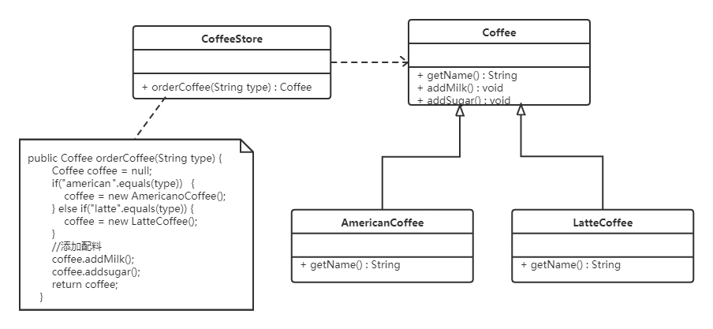

`Coffee`：咖啡类

```java
/**
 * @ClassName: Coffee
 * @Description: 咖啡类
 */
public abstract class Coffee {

    public abstract String getName();

    //加糖
    public void addsugar() {
        System.out.println("加糖");
    }

    //加奶
    public void addMilk() {
        System.out.println("加奶");
    }
}
```

`AmericanCoffee`：美式咖啡

```java
/**
 * @ClassName: AmericanCoffee
 * @Description: 美式咖啡
 */
public class AmericanCoffee extends Coffee {

    public String getName() {
        return "美式咖啡";
    }
}
```

`LatteCoffee`：拿铁咖啡

```java
/**
 * @ClassName: LatteCoffee
 * @Description: 拿铁咖啡
 */
public class LatteCoffee extends Coffee {

    public String getName() {
        return "拿铁咖啡";
    }
}
```

`CoffeeStore`：咖啡店

```java
public class CoffeeStore {

    public Coffee orderCoffee(String type) {
        //声明Coffee类型的变量，根据不同类型创建不同的coffee子类对象
        Coffee coffee = null;
        if("american".equals(type)) {
            coffee = new AmericanCoffee();
        } else if("latte".equals(type)) {
            coffee = new LatteCoffee();
        } else {
            throw new RuntimeException("对不起，您所点的咖啡没有");
        }
        //加配料
        coffee.addMilk();
        coffee.addsugar();

        return coffee;
    }
}
```

`Client`：

```java
public class Client {
    public static void main(String[] args) {
        //1,创建咖啡店类
        CoffeeStore store = new CoffeeStore();
        //2,点咖啡
        Coffee coffee = store.orderCoffee("american");

        System.out.println(coffee.getName());
    }
}
```

在java中，万物皆对象，这些对象都需要创建，如果创建的时候直接new该对象，就会对该对象耦合严重，假如要更换对象，所有new对象的地方都需要修改一遍，这显然违背了软件设计的开闭原则。如果使用工厂来生产对象，就只和工厂打交道就可以了，彻底和对象解耦，如果要更换对象，直接在工厂里更换该对象即可，达到了与对象解耦的目的；所以说，工厂模式最大的优点就是：**解耦**

##### 4.2.2 简单工厂模式

简单工厂模式：

- 简单工厂不是一种设计模式，反而比较像是一种编程习惯

- 简单工厂包含如下角色（简单工厂结构）：

  * 抽象产品 ：定义了产品的规范，描述了产品的主要特性和功能

  * 具体产品 ：实现或者继承抽象产品的子类

  * 具体工厂 ：提供了创建产品的方法，调用者通过该方法来获取产品

现在使用简单工厂对上面案例进行改进，类图如下（解除了咖啡和咖啡店的耦合）：

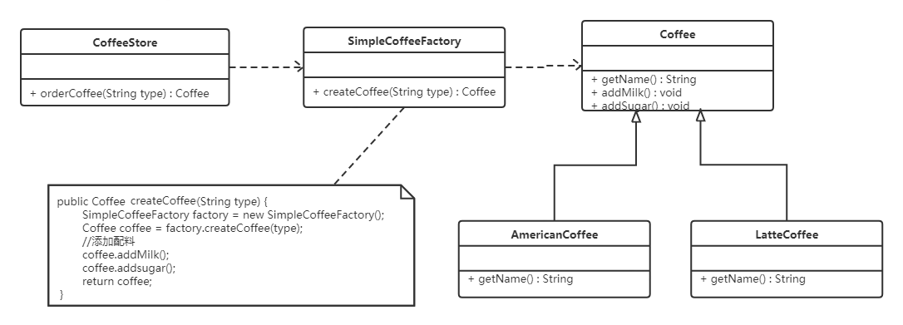

`Coffee`：咖啡类

```java
/**
 * @ClassName: Coffee
 * @Description: 咖啡类
 */
public abstract class Coffee {

    public abstract String getName();

    //加糖
    public void addsugar() {
        System.out.println("加糖");
    }

    //加奶
    public void addMilk() {
        System.out.println("加奶");
    }
}
```

`LatteCoffee`：拿铁咖啡

```java
/**
 * @ClassName: LatteCoffee
 * @Description: 拿铁咖啡
 */
public class LatteCoffee extends Coffee {

    public String getName() {
        return "拿铁咖啡";
    }
}
```

`AmericanCoffee`：美式咖啡

```java
/**
 * @ClassName: AmericanCoffee
 * @Description: 美式咖啡
 */
public class AmericanCoffee extends Coffee {

    public String getName() {
        return "美式咖啡";
    }
}
```

`SimpleCoffeeFactory`：简单咖啡工厂类，用来生产咖啡

```java
/**
 * @Description: 简单咖啡工厂类，用来生产咖啡
 */
public class SimpleCoffeeFactory {

    public Coffee createCoffee(String type) {
        //声明Coffee类型的变量，根据不同类型创建不同的coffee子类对象
        Coffee coffee = null;
        if("american".equals(type)) {
            coffee = new AmericanCoffee();
        } else if("latte".equals(type)) {
            coffee = new LatteCoffee();
        } else {
            throw new RuntimeException("对不起，您所点的咖啡没有");
        }

        return coffee;
    }
}
```

`CoffeeStore`：咖啡店

```java
public class CoffeeStore {

    public Coffee orderCoffee(String type) {

        SimpleCoffeeFactory factory = new SimpleCoffeeFactory();
        //调用生产咖啡的方法
        Coffee coffee = factory.createCoffee(type);

        //加配料
        coffee.addMilk();
        coffee.addsugar();

        return coffee;
    }
}
```

`Client`：

```java
public class Client {
    public static void main(String[] args) {
        //创建咖啡店类对象
        CoffeeStore store = new CoffeeStore();
        Coffee coffee = store.orderCoffee("latte");

        System.out.println(coffee.getName());
    }
}
```

简单工厂（factory）处理创建对象的细节：

- 一旦有了SimpleCoffeeFactory，CoffeeStore类中的orderCoffee()就变成此对象的客户，后期如果需要Coffee对象，直接从工厂中获取即可。这样也就解除了和Coffee实现类的耦合，同时又产生了新的耦合，CoffeeStore对象和SimpleCoffeeFactory工厂对象的耦合，工厂对象和商品对象的耦合
- 后期如果再加新品种的咖啡，势必要需求修改SimpleCoffeeFactory的代码，违反了开闭原则。工厂类的客户端可能有很多，比如创建美团外卖等，这样只需要修改工厂类的代码，省去其他的修改操作

简单工厂（factory）优缺点：

- 优点：封装了创建对象的过程，可以通过参数直接获取对象。把对象的创建和业务逻辑层分开，这样以后就避免了修改客户代码，如果要实现新产品直接修改工厂类，而不需要在原代码中修改，这样就降低了客户代码修改的可能性，更加容易扩展
- 缺点：增加新产品时还是需要修改工厂类的代码，违背了“开闭原则”

简单工厂（factory）扩展：

- 静态工厂：在开发中也有一部分人将工厂类中的创建对象的功能定义为静态的，这个就是静态工厂模式，它也不是23种设计模式中的。代码如下：

`SimpleCoffeeFactory`：静态工厂

```java
public class SimpleCoffeeFactory {

    public static Coffee createCoffee(String type) {
        Coffee coffee = null;
        if("americano".equals(type)) {
            coffee = new AmericanoCoffee();
        } else if("latte".equals(type)) {
            coffee = new LatteCoffee();
        }
        return coffe;
    }
}
```

`CoffeeStore`：

```java
public class CoffeeStore {

    public Coffee orderCoffee(String type) {

        /*SimpleCoffeeFactory factory = new SimpleCoffeeFactory();
        //调用生产咖啡的方法
        Coffee coffee = factory.createCoffee(type);*/
        Coffee coffee = SimpleCoffeeFactory.createCoffee(type);

        //加配料
        coffee.addMilk();
        coffee.addsugar();

        return coffee;
    }
}
```

##### 4.2.3 工厂方法模式

针对上例中的缺点，使用工厂方法模式就可以完美的解决，完全遵循开闭原则

工厂方法模式：

- 工厂方法模式：定义一个用于创建对象的接口，让子类决定实例化哪个产品类对象。工厂方法使一个产品类的实例化延迟到其工厂的子类

- 结构（工厂方法模式的主要角色）：

  * 抽象工厂（Abstract Factory）：提供了创建产品的接口，调用者通过它访问具体工厂的工厂方法来创建产品

  * 具体工厂（ConcreteFactory）：主要是实现抽象工厂中的抽象方法，完成具体产品的创建

  * 抽象产品（Product）：定义了产品的规范，描述了产品的主要特性和功能

  * 具体产品（ConcreteProduct）：实现了抽象产品角色所定义的接口，由具体工厂来创建，它同具体工厂之间一一对应

工厂方法模式实现：

- 使用工厂方法模式对上例进行改进，类图如下：

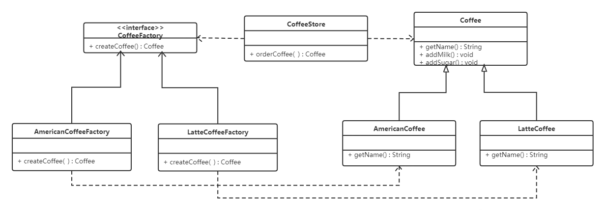

`Coffee`：咖啡类

```java
/**
 * @Description: 咖啡类
 */
public abstract class Coffee {

    public abstract String getName();

    //加糖
    public void addsugar() {
        System.out.println("加糖");
    }

    //加奶
    public void addMilk() {
        System.out.println("加奶");
    }
}
```

`AmericanCoffee`：美式咖啡

```java
public class AmericanCoffee extends Coffee {

    public String getName() {
        return "美式咖啡";
    }
}
```

`LatteCoffee`：拿铁咖啡

```java
/**
 * @Description: 拿铁咖啡
 */
public class LatteCoffee extends Coffee {

    public String getName() {
        return "拿铁咖啡";
    }
}
```

`CoffeeFactory`： 抽象工厂

```java
/**
 * @Description: CoffeeFactory ： 抽象工厂
 */
public interface CoffeeFactory {

    //创建咖啡对象的方法
    Coffee createCoffee();
}
```

`AmericanCoffeeFactory`：美式咖啡工厂对象，专门用来生产美式咖啡

```java
/**
 * @ClassName: AmericanCoffeeFactory
 * @Description: 美式咖啡工厂对象，专门用来生产美式咖啡
 */
public class AmericanCoffeeFactory implements CoffeeFactory {

    public Coffee createCoffee() {
        return new AmericanCoffee();
    }
}
```

`LatteCoffeeFactory`：拿铁咖啡工厂，专门用来生产拿铁咖啡

```java
/**
 * @ClassName: LatteCoffeeFactory
 * @Description: 拿铁咖啡工厂，专门用来生产拿铁咖啡
 */
public class LatteCoffeeFactory implements CoffeeFactory {

    public Coffee createCoffee() {
        return new LatteCoffee();
    }
}
```

`CoffeeStore`：咖啡店

```java
public class CoffeeStore {

    private CoffeeFactory factory;

    public void setFactory(CoffeeFactory factory) {
        this.factory = factory;
    }

    //点咖啡功能
    public Coffee orderCoffee() {
        Coffee coffee = factory.createCoffee();
        //加配料
        coffee.addMilk();
        coffee.addsugar();
        return coffee;
    }
}
```

`Client`：测试

```java
public class Client {
    public static void main(String[] args) {
        //创建咖啡店对象
        CoffeeStore store = new CoffeeStore();
        //创建对象
        //CoffeeFactory factory = new AmericanCoffeeFactory();
        CoffeeFactory factory = new LatteCoffeeFactory();
        store.setFactory(factory);

        //点咖啡
        Coffee coffee = store.orderCoffee();

        System.out.println(coffee.getName());
    }
}
```

工厂方法模式总结：

- 从以上的编写的代码可以看到，要增加产品类时也要相应地增加工厂类，不需要修改工厂类的代码了，这样就解决了简单工厂模式的缺点。工厂方法模式是简单工厂模式的进一步抽象。由于使用了多态性，工厂方法模式保持了简单工厂模式的优点，而且克服了它的缺点


工厂方法模式优缺点：

- 优点：

  - 用户只需要知道具体工厂的名称就可得到所要的产品，无须知道产品的具体创建过程

  - 在系统增加新的产品时只需要添加具体产品类和对应的具体工厂类，无须对原工厂进行任何修改，满足开闭原则

- 缺点：

  * 每增加一个产品就要增加一个具体产品类和一个对应的具体工厂类，这增加了系统的复杂度

##### 4.2.4 抽象工厂模式

前面介绍的工厂方法模式中考虑的是一类产品的生产，如畜牧场只养动物、电视机厂只生产电视机、传智播客只培养计算机软件专业的学生等

这些工厂只生产同种类产品，同种类产品称为同等级产品，也就是说：工厂方法模式只考虑生产同等级的产品，但是在现实生活中许多工厂是综合型的工厂，能生产多等级（种类） 的产品，如电器厂既生产电视机又生产洗衣机或空调，大学既有软件专业又有生物专业等

本节要介绍的抽象工厂模式将考虑多等级产品的生产，将同一个具体工厂所生产的位于不同等级的一组产品称为一个产品族，下图所示横轴是产品等级，也就是同一类产品；纵轴是产品族，也就是同一品牌的产品，同一品牌的产品产自同一个工厂

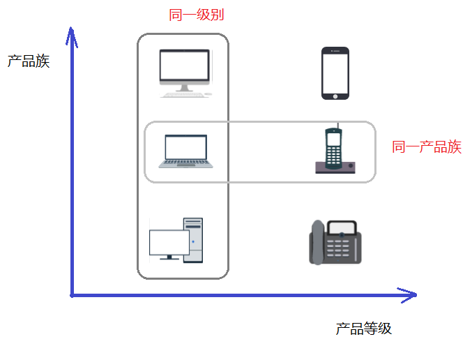

抽象工厂模式概念：

- 抽象工厂模式：是一种为访问类提供一个创建一组相关或相互依赖对象的接口，且访问类无须指定所要产品的具体类就能得到同族的不同等级的产品的模式结构
- 抽象工厂模式是工厂方法模式的升级版本，工厂方法模式只生产一个等级的产品，而抽象工厂模式可生产多个等级的产品

抽象工厂模式结构：

* 抽象工厂（Abstract Factory）：提供了创建产品的接口，它包含多个创建产品的方法，可以创建多个不同等级的产品
* 具体工厂（Concrete Factory）：主要是实现抽象工厂中的多个抽象方法，完成具体产品的创建
* 抽象产品（Product）：定义了产品的规范，描述了产品的主要特性和功能，抽象工厂模式有多个抽象产品
* 具体产品（ConcreteProduct）：实现了抽象产品角色所定义的接口，由具体工厂来创建，它 同具体工厂之间是多对一的关系

抽象工厂模式实现：

- 现咖啡店业务发生改变，不仅要生产咖啡还要生产甜点，如提拉米苏、抹茶慕斯等，要是按照工厂方法模式，需要定义提拉米苏类、抹茶慕斯类、提拉米苏工厂、抹茶慕斯工厂、甜点工厂类，很容易发生类爆炸情况。其中拿铁咖啡、美式咖啡是一个产品等级，都是咖啡；提拉米苏、抹茶慕斯也是一个产品等级；拿铁咖啡和提拉米苏是同一产品族（也就是都属于意大利风味），美式咖啡和抹茶慕斯是同一产品族（也就是都属于美式风味）。所以这个案例可以使用抽象工厂模式实现。类图如下：

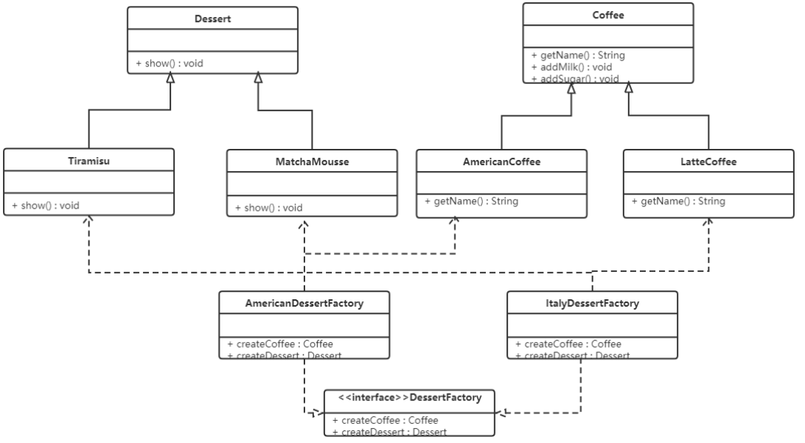

`Coffee`：咖啡抽象类

```java
/**
 * @Description: 咖啡类
 */
public abstract class Coffee {

    public abstract String getName();

    //加糖
    public void addsugar() {
        System.out.println("加糖");
    }

    //加奶
    public void addMilk() {
        System.out.println("加奶");
    }
}
```

`Dessert`：甜品抽象类

```java
/**
 * @Description: 甜品抽象类
 */
public abstract class Dessert {

    public abstract void show();
}
```

`Trimisu`：提拉米苏类

```java
/**
 * @Description: 提拉米苏类
 */
public class Trimisu extends Dessert {
    public void show() {
        System.out.println("提拉米苏");
    }
}
```

`MatchaMousse`：抹茶慕斯类

```java
/**
 * @Description: 抹茶慕斯类
 */
public class MatchaMousse extends Dessert {
    public void show() {
        System.out.println("抹茶慕斯");
    }
}
```

`AmericanCoffee`：美式咖啡

```java
/**
 * @Description: 美式咖啡
 */
public class AmericanCoffee extends Coffee {

    public String getName() {
        return "美式咖啡";
    }
}
```

`LatteCoffee`：拿铁咖啡

```java
/**
 * @Description: 拿铁咖啡
 */
public class LatteCoffee extends Coffee {

    public String getName() {
        return "拿铁咖啡";
    }
}
```

`DessertFactory`：甜品工厂

```java
public interface DessertFactory {

    //生产咖啡的功能
    Coffee createCoffee();

    //生产甜品的功能
    Dessert createDessert();
}
```

`AmericanDessertFactory`：美式风味的甜品工厂

```java
/**
 * @Description:
 *         美式风味的甜品工厂
 *             生产美式咖啡和抹茶慕斯
 */
public class AmericanDessertFactory implements DessertFactory {

    public Coffee createCoffee() {
        return new AmericanCoffee();
    }

    public Dessert createDessert() {
        return new MatchaMousse();
    }
}
```

`ItalyDessertFactory`：意大利风味甜品工厂

```java
/**
 * @Description:
 *
 *      意大利风味甜品工厂
 *          生产拿铁咖啡和提拉米苏甜品
 */
public class ItalyDessertFactory implements DessertFactory {

    public Coffee createCoffee() {
        return new LatteCoffee();
    }

    public Dessert createDessert() {
        return new Trimisu();
    }
}
```

`Client`：测试

```java
public class Client {
    public static void main(String[] args) {
        //创建的是意大利风味甜品工厂对象
        //ItalyDessertFactory factory = new ItalyDessertFactory();
        AmericanDessertFactory factory = new AmericanDessertFactory();
        //获取拿铁咖啡和提拉米苏甜品
        Coffee coffee = factory.createCoffee();
        Dessert dessert = factory.createDessert();

        System.out.println(coffee.getName());
        dessert.show();
    }
}
```

如果要加同一个产品族的话，只需要再加一个对应的工厂类即可，不需要修改其他的类


抽象工厂模式优缺点：

- 优点：当一个产品族中的多个对象被设计成一起工作时，它能保证客户端始终只使用同一个产品族中的对象
- 缺点：当产品族中需要增加一个新的产品时，所有的工厂类都需要进行修改


抽象工厂模式使用场景：

* 当需要创建的对象是一系列相互关联或相互依赖的产品族时，如电器工厂中的电视机、洗衣机、空调等

* 系统中有多个产品族，但每次只使用其中的某一族产品。如有人只喜欢穿某一个品牌的衣服和鞋

* 系统中提供了产品的类库，且所有产品的接口相同，客户端不依赖产品实例的创建细节和内部结构

* 如：输入法换皮肤，一整套一起换。生成不同操作系统的程序

##### 4.2.5 工厂模式应用

工厂模式应用：简单工厂+配置文件解除耦合

- 可以通过工厂模式+配置文件的方式解除工厂对象和产品对象的耦合。在工厂类中加载配置文件中的全类名，并创建对象进行存储，客户端如果需要对象，直接进行获取即可

第一步：定义配置文件

- 为了演示方便，使用properties文件作为配置文件，名称为bean.properties

```properties
american=com.itheima.pattern.factory.config_factory.AmericanCoffee
latte=com.itheima.pattern.factory.config_factory.LatteCoffee
```

第二步：定义相关的类

- `Coffee`：咖啡类

```java
/**
 * @Description: 咖啡类
 */
public abstract class Coffee {

    public abstract String getName();

    //加糖
    public void addsugar() {
        System.out.println("加糖");
    }

    //加奶
    public void addMilk() {
        System.out.println("加奶");
    }
}
```

`AmericanCoffee`：美式咖啡

```java
package com.itheima.pattern.factory.config_factory;
/**
 * @Description: 美式咖啡
 */
public class AmericanCoffee extends Coffee {

    public String getName() {
        return "美式咖啡";
    }
}
```

`LatteCoffee`：拿铁咖啡

```java
package com.itheima.pattern.factory.config_factory;
/**
 * @Description: 拿铁咖啡
 */
public class LatteCoffee extends Coffee {

    public String getName() {
        return "拿铁咖啡";
    }
}
```

第三步：改进工厂类

```java
import java.io.IOException;
import java.io.InputStream;
import java.util.HashMap;
import java.util.Properties;
import java.util.Set;
public class CoffeeFactory {

    //加载配置文件，获取配置文件中配置的全类名，并创建该类的对象进行存储
    //1,定义容器对象存储咖啡对象
    private static HashMap<String,Coffee> map = new HashMap<String, Coffee>();

    //2,加载配置文件， 只需要加载一次
    static {
        //2.1 创建Properties对象
        Properties p = new Properties();
        //2.2 调用p对象中的load方法进行配置文件的加载
        InputStream is = CoffeeFactory.class.getClassLoader().getResourceAsStream("bean.properties");
        try {
            p.load(is);
            //从p集合中获取全类名并创建对象
            Set<Object> keys = p.keySet();
            for (Object key : keys) {
                String className = p.getProperty((String) key);
                //通过反射技术创建对象
                Class clazz = Class.forName(className);
                Coffee coffee = (Coffee) clazz.newInstance();
                //将名称和对象存储到容器中
                map.put((String)key,coffee);
            }
        } catch (Exception e) {
            e.printStackTrace();
        }
    }


    //根据名称获取对象
    public static Coffee createCoffee(String name) {
        return map.get(name);
    }
}
```

第四步：测试

```java
public class Client {
    public static void main(String[] args) {
        Coffee coffee = CoffeeFactory.createCoffee("american");
        System.out.println(coffee.getName());

        System.out.println("=============");
        Coffee latte = CoffeeFactory.createCoffee("latte");
        System.out.println(latte.getName());
    }
}
```

静态成员变量用来存储创建的对象（键存储的是名称，值存储的是对应的对象），而读取配置文件以及创建对象写在静态代码块中，目的就是只需要执行一次

##### 4.2.6 JDK源码解析-Collection.iterator方法

```java
public class Demo {
    public static void main(String[] args) {
        List<String> list = new ArrayList<>();
        list.add("令狐冲");
        list.add("风清扬");
        list.add("任我行");

        //获取迭代器对象
        Iterator<String> it = list.iterator();
        //使用迭代器遍历
        while(it.hasNext()) {
            String ele = it.next();
            System.out.println(ele);
        }
    }
}
```

对上面的代码大家应该很熟，使用迭代器遍历集合，获取集合中的元素。而单列集合获取迭代器的方法就使用到了工厂方法模式。看通过类图看看结构：

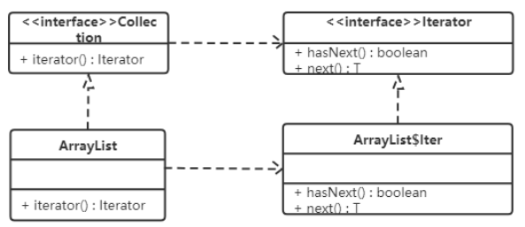

Collection接口是抽象工厂类，ArrayList是具体的工厂类；Iterator接口是抽象商品类，ArrayList类中的Iter内部类是具体的商品类。在具体的工厂类中iterator()方法创建具体的商品类的对象。

> 另：
>
> 	1,DateForamt类中的getInstance()方法使用的是工厂模式；
> 													
> 	2,Calendar类中的getInstance()方法使用的是工厂模式；

##### 4.2.7 `GPT`补充

工厂模式（Factory Pattern）：

- 是创建型设计模式的一种，用于处理对象创建过程中的复杂性。它提供了一种通过**工厂方法**来创建对象的方式，而不是直接通过 `new` 关键字实例化对象。工厂模式将对象的实例化与具体类的实现解耦，使得代码更灵活、易于扩展和维护

工厂模式主要包括三种形式：

1. 简单工厂模式（Simple Factory Pattern）
2. 工厂方法模式（Factory Method Pattern）
3. 抽象工厂模式（Abstract Factory Pattern）

简单工厂模式：

- 简单工厂模式通过定义一个工厂类，根据传入的参数创建不同类型的对象。它常用于当需要创建的对象类型不多时

- 结构：

  - 工厂类：负责对象的创建逻辑

  - 产品类：工厂类创建的具体对象

- 示例代码：

```java
// 产品接口
interface Product {
    void use();
}

// 具体产品类A
class ProductA implements Product {
    public void use() {
        System.out.println("Using Product A");
    }
}

// 具体产品类B
class ProductB implements Product {
    public void use() {
        System.out.println("Using Product B");
    }
}

// 简单工厂类
class SimpleFactory {
    public static Product createProduct(String type) {
        if (type.equals("A")) {
            return new ProductA();
        } else if (type.equals("B")) {
            return new ProductB();
        }
        throw new IllegalArgumentException("Unknown product type");
    }
}

public class FactoryPatternDemo {
    public static void main(String[] args) {
        Product productA = SimpleFactory.createProduct("A");
        productA.use(); // 输出: Using Product A

        Product productB = SimpleFactory.createProduct("B");
        productB.use(); // 输出: Using Product B
    }
}

优点：
    - 简单直观，适用于产品种类较少的场景
    - 客户端无需关心对象的创建逻辑

缺点：
    - 当产品种类增加时，工厂类的代码会变得复杂，违背了开闭原则（对扩展开放，对修改关闭）
    - 工厂类成为系统中唯一的实例创建点，容易引发类膨胀问题
```

工厂方法模式：

- 工厂方法模式通过定义一个抽象工厂类，将对象的创建延迟到具体子类中。每个子类都有一个用于生产特定产品的工厂方法，遵循开闭原则
  - 结构：
    - 抽象工厂类：定义创建产品对象的抽象方法
    - 具体工厂类：实现抽象工厂类，并创建具体的产品对象
    - 产品接口：定义产品的公共行为
    - 具体产品类：实现产品接口的不同类
- 示例代码：

```java
// 产品接口
interface Product {
    void use();
}

// 具体产品类A
class ProductA implements Product {
    public void use() {
        System.out.println("Using Product A");
    }
}

// 具体产品类B
class ProductB implements Product {
    public void use() {
        System.out.println("Using Product B");
    }
}

// 抽象工厂类
interface Factory {
    Product createProduct();
}

// 具体工厂类A
class FactoryA implements Factory {
    public Product createProduct() {
        return new ProductA();
    }
}

// 具体工厂类B
class FactoryB implements Factory {
    public Product createProduct() {
        return new ProductB();
    }
}

public class FactoryMethodPatternDemo {
    public static void main(String[] args) {
        Factory factoryA = new FactoryA();
        Product productA = factoryA.createProduct();
        productA.use(); // 输出: Using Product A

        Factory factoryB = new FactoryB();
        Product productB = factoryB.createProduct();
        productB.use(); // 输出: Using Product B
    }
}

优点：
    - 遵循开闭原则，扩展性强：新增产品时只需创建新的工厂类
    - 更加符合面向对象编程中的依赖倒置原则
缺点：
    - 当产品种类较多时，会增加大量的工厂类，导致代码结构复杂
```

抽象工厂模式

- 抽象工厂模式是工厂方法模式的扩展，它不仅提供创建单个产品的能力，还可以创建**一系列相关联的产品**。这种模式适合创建产品族的场景（即同一产品组中的不同种类产品）

- 结构：

  - 抽象工厂类：定义创建不同产品族的方法

  - 具体工厂类：实现抽象工厂类，提供不同产品族的产品创建

  - 抽象产品类：定义不同产品族中的产品

  - 具体产品类：不同的工厂实现对应的产品类

示例代码：

```java
// 抽象产品类A
interface ProductA {
    void use();
}

// 抽象产品类B
interface ProductB {
    void use();
}

// 具体产品类A1
class ProductA1 implements ProductA {
    public void use() {
        System.out.println("Using Product A1");
    }
}

// 具体产品类A2
class ProductA2 implements ProductA {
    public void use() {
        System.out.println("Using Product A2");
    }
}

// 具体产品类B1
class ProductB1 implements ProductB {
    public void use() {
        System.out.println("Using Product B1");
    }
}

// 具体产品类B2
class ProductB2 implements ProductB {
    public void use() {
        System.out.println("Using Product B2");
    }
}

// 抽象工厂类
interface AbstractFactory {
    ProductA createProductA();
    ProductB createProductB();
}

// 具体工厂类1
class Factory1 implements AbstractFactory {
    public ProductA createProductA() {
        return new ProductA1();
    }

    public ProductB createProductB() {
        return new ProductB1();
    }
}

// 具体工厂类2
class Factory2 implements AbstractFactory {
    public ProductA createProductA() {
        return new ProductA2();
    }

    public ProductB createProductB() {
        return new ProductB2();
    }
}

public class AbstractFactoryPatternDemo {
    public static void main(String[] args) {
        AbstractFactory factory1 = new Factory1();
        ProductA productA1 = factory1.createProductA();
        ProductB productB1 = factory1.createProductB();
        productA1.use(); // 输出: Using Product A1
        productB1.use(); // 输出: Using Product B1

        AbstractFactory factory2 = new Factory2();
        ProductA productA2 = factory2.createProductA();
        ProductB productB2 = factory2.createProductB();
        productA2.use(); // 输出: Using Product A2
        productB2.use(); // 输出: Using Product B2
    }
}

优点：

- 可以创建一系列相关的产品，保证产品族的一致性。
- 扩展性强，增加新产品族时只需添加新的工厂和产品类。

缺点：

- 结构复杂，新增产品种类时需要修改抽象工厂接口及所有具体工厂
```

总结：

- 简单工厂模式：适合产品种类较少的场景，工厂类统一管理产品的创建
- 工厂方法模式：遵循开闭原则，每种产品对应一个具体工厂，适合产品种类多的场景
- 抽象工厂模式：用于创建一组相关联的产品，适合需要生成产品族的场景


### 4.3 原型模式

##### 4.3.1 原型模式简介

原型模式：

- 原型模式：用一个已经创建的实例作为原型，通过复制该原型对象来创建一个和原型对象相同的新对象

- 原型模式结构

  * 抽象原型类：规定了具体原型对象必须实现的的 clone() 方法。

  * 具体原型类：实现抽象原型类的 clone() 方法，它是可被复制的对象。

  * 访问类：使用具体原型类中的 clone() 方法来复制新的对象。

- 原型模式类图如下：

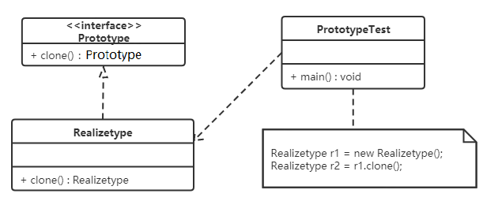


- 原型模式的克隆分为浅克隆和深克隆
  - 浅克隆：创建一个新对象，新对象的属性和原来对象完全相同，对于非基本类型属性，仍指向原有属性所指向的对象的内存地址
  - 深克隆：创建一个新对象，属性中引用的其他对象也会被克隆，不再指向原有对象地址

- 使用场景

  * 对象的创建非常复杂，可以使用原型模式快捷的创建对象

  * 性能和安全要求比较高

`Cloneable` 接口：Java中的Object类中提供了 `clone()` 方法来实现浅克隆。 `Cloneable` 接口是上面的类图中的抽象原型类，而实现了`Cloneable`接口的子实现类就是具体的原型类

- `Realizetype`：实现 `Cloneable` 接口并重写 `Object` 类的 `clone()` 方法

```java
public class Realizetype implements Cloneable {

    public Realizetype() {
        System.out.println("具体的原型对象创建完成！");
    }

    @Override
    public Realizetype clone() throws CloneNotSupportedException {
        System.out.println("具体原型复制成功！");

        return (Realizetype) super.clone();
    }
}
```

- `client`：测试

```java
public class client {
    public static void main(String[] args) throws CloneNotSupportedException {
        //创建一个原型类对象
        Realizetype realizetype = new Realizetype();

        //调用Realizetype类中的clone方法进行对象的克隆
        Realizetype clone = realizetype.clone();

        System.out.println("原型对象和克隆出来的是否是同一个对象？" + (realizetype == clone));
        /*
        具体的原型对象创建完成！
        具体原型复制成功！
        原型对象和克隆出来的是否是同一个对象？false
         */
    }
}
```

##### 4.3.2 原型模式案例

用原型模式生成“三好学生”奖状：同一学校的“三好学生”奖状除了获奖人姓名不同，其他都相同，可以使用原型模式复制多个“三好学生”奖状出来，然后在修改奖状上的名字即可。类图如下：

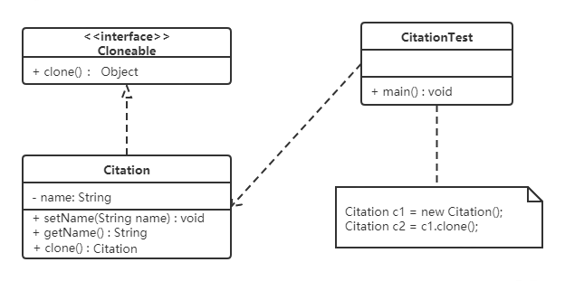

`Citation`：奖状类

```java
// 奖状类
public class Citation implements Cloneable {
    private String name;

    public void setName(String name) {
        this.name = name;
    }

    public String getName() {
        return (this.name);
    }

    public void show() {
        System.out.println(name + "同学：在2020学年第一学期中表现优秀，被评为三好学生。特发此状！");
    }

    @Override
    public Citation clone() throws CloneNotSupportedException {
        return (Citation) super.clone();
    }
}
```

`CitationTest`：测试类

```java
// 测试类
public class CitationTest {
    public static void main(String[] args) throws CloneNotSupportedException {
        Citation c1 = new Citation();
        c1.setName("张三");

        //复制奖状
        Citation c2 = c1.clone();
        //将奖状的名字修改李四
        c2.setName("李四");

        c1.show();
        c2.show();
        /*
        张三同学：在2020学年第一学期中表现优秀，被评为三好学生。特发此状！
        李四同学：在2020学年第一学期中表现优秀，被评为三好学生。特发此状！
         */
    }
}
```

##### 4.3.3 扩展（深克隆）

将上面的“三好学生”奖状的案例中Citation类的name属性修改为Student类型的属性。代码如下：

`Citation`：

```java
public class Citation implements Cloneable {

    private Student stu;

    public Student getStu() {
        return stu;
    }

    public void setStu(Student stu) {
        this.stu = stu;
    }

    @Override
    public Citation clone() throws CloneNotSupportedException {
        return (Citation) super.clone();
    }

    public void show() {
        System.out.println(stu.getName() + "同学：在2020学年第一学期中表现优秀，被评为三好学生。特发此状！");
    }
}
```

`Student`：

```java
public class Student {

    private String name;
    private String address;

    public Student(String name, String address) {
        this.name = name;
        this.address = address;
    }

    public Student() {
    }

    public String getName() {
        return name;
    }

    public void setName(String name) {
        this.name = name;
    }

    public String getAddress() {
        return address;
    }

    public void setAddress(String address) {
        this.address = address;
    }
}
```

`CitaionTest`：

```java
public class CitaionTest {
    public static void main(String[] args) throws CloneNotSupportedException {
        //1，创建原型对象
        Citation citation = new Citation();
        //创建张三学生对象
        Student stu = new Student("张三", "西安");
        citation.setStu(stu);

        //2,克隆奖状对象
        Citation citation1 = citation.clone();
        //获取c2奖状所属学生对象
        Student stu1 = citation1.getStu();
        stu1.setName("李四");

        //判断stu对象和stu1对象是否是同一个对象
        System.out.println("stu和stu1是同一个对象？" + (stu == stu1));

        //3,调用show方法展示
        citation.show();
        citation1.show();
        /*
            stu和stu1是同一个对象？true
            李四同学：在2020学年第一学期中表现优秀，被评为三好学生。特发此状！
            李四同学：在2020学年第一学期中表现优秀，被评为三好学生。特发此状！
         */
    }
}
```

stu对象和stu1对象是同一个对象，就会产生将stu1对象中name属性值改为“李四”，两个Citation（奖状）对象中显示的都是李四。这就是浅克隆的效果，对具体原型类（Citation）中的引用类型的属性进行引用的复制。这种情况需要使用深克隆，而进行深克隆需要使用对象流。代码如下：

`Citation`：

```java
import java.io.Serializable;
public class Citation implements Cloneable, Serializable {

    private Student stu;

    public Student getStu() {
        return stu;
    }

    public void setStu(Student stu) {
        this.stu = stu;
    }

    @Override
    public Citation clone() throws CloneNotSupportedException {
        return (Citation) super.clone();
    }

    public void show() {
        System.out.println(stu.getName() + "同学：在2020学年第一学期中表现优秀，被评为三好学生。特发此状！");
    }
}
```

`Student`：

```java
import java.io.Serializable;
public class Student implements Serializable {

    //学生的姓名
    private String name;

    public String getName() {
        return name;
    }

    public void setName(String name) {
        this.name = name;
    }

    @Override
    public String toString() {
        return "Student{" +
                "name='" + name + '\'' +
                '}';
    }
}
```

`CitaionTest`：

```java
import java.io.FileInputStream;
import java.io.FileOutputStream;
import java.io.ObjectInputStream;
import java.io.ObjectOutputStream;
public class CitaionTest {
    public static void main(String[] args) throws Exception {
        //1，创建原型对象
        Citation citation = new Citation();
        //创建张三学生对象
        Student stu = new Student();
        stu.setName("张三");
        citation.setStu(stu);

        //创建对象输出流对象
        ObjectOutputStream oos = new ObjectOutputStream(new FileOutputStream("d:/learn/a.txt"));
        //写对象
        oos.writeObject(citation);
        //释放资源
        oos.close();

        //创建对象输入流对象
        ObjectInputStream ois = new ObjectInputStream(new FileInputStream("d:/learn/a.txt"));
        //读取对象
        Citation citation1 = (Citation) ois.readObject();
        //释放资源
        ois.close();
        Student stu1 = citation1.getStu();
        stu1.setName("李四");

        citation.show();
        citation1.show();
        /*
        张三同学：在2020学年第一学期中表现优秀，被评为三好学生。特发此状！
        李四同学：在2020学年第一学期中表现优秀，被评为三好学生。特发此状！
         */
        
    }
}
```

**注意**：Citation类和Student类必须实现Serializable接口，否则会抛NotSerializableException异常

### 4.4 建造者模式

##### 4.4.1 简介

建造者模式：

- 作用：将一个复杂对象的构建与表示分离，使得同样的构建过程可以创建不同的表示

* 建造者模式分离了部件的构造(由Builder来负责)和装配(由Director负责)。 从而可以构造出复杂的对象。这个模式适用于：某个对象的构建过程复杂的情况
* 由于实现了构建和装配的解耦。不同的构建器，相同的装配，也可以做出不同的对象；相同的构建器，不同的装配顺序也可以做出不同的对象。也就是实现了构建算法、装配算法的解耦，实现了更好的复用
* 建造者模式可以将部件和其组装过程分开，一步一步创建一个复杂的对象。用户只需要指定复杂对象的类型就可以得到该对象，而无须知道其内部的具体构造细节

建造者（Builder）模式结构：

* 抽象建造者类（Builder）：规定要实现复杂对象的哪些部分的创建，并不涉及具体的部件对象的创建

* 具体建造者类（ConcreteBuilder）：实现 Builder 接口，完成复杂产品的各个部件的具体创建方法。在构造过程完成后，提供产品的实例

* 产品类（Product）：要创建的复杂对象

* 指挥者类（Director）：调用具体建造者来创建复杂对象的各个部分，在指导者中不涉及具体产品的信息，只负责保证对象各部分完整创建或按某种顺序创建

建造者（Builder）模式类图如下：


##### 4.4.2 案例

创建共享单车：

- 生产自行车是一个复杂的过程，它包含了车架，车座等组件的生产。而车架又有碳纤维，铝合金等材质的，车座有橡胶，真皮等材质。对于自行车的生产就可以使用建造者模式
- 这里Bike是产品，包含车架，车座等组件；Builder是抽象建造者，MobikeBuilder和OfoBuilder是具体的建造者；Director是指挥者。类图如下：

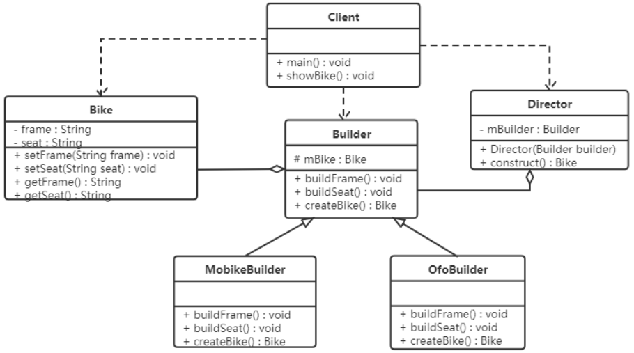

`Bike`：

```java
/**
 * @ClassName: Bike
 * @Description: 产品对象
 */
public class Bike {

    private String frame;//车架

    private String seat;//车座

    public String getFrame() {
        return frame;
    }

    public void setFrame(String frame) {
        this.frame = frame;
    }

    public String getSeat() {
        return seat;
    }

    public void setSeat(String seat) {
        this.seat = seat;
    }
}
```

`Builder`：

```java
public abstract class Builder {

    //声明Bike类型的变量，并进行赋值
    protected Bike bike = new Bike();

    public abstract void buildFrame();

    public abstract void buildSeat();

    //构建自行车的方法
    public abstract Bike createBike();
}
```

`MobileBuilder`：具体的构建者，用来构建摩拜单车对象

```java
/**
 * @Description: 具体的构建者，用来构建摩拜单车对象
 */
public class MobileBuilder extends Builder {

    public void buildFrame() {
        bike.setFrame("碳纤维车架");
    }

    public void buildSeat() {
        bike.setSeat("真皮车座");
    }

    public Bike createBike() {
        return bike;
    }
}
```

`OfoBuilder`：ofo单车构建者，用来构建ofo单车

```java
/**
 * @Description: ofo单车构建者，用来构建ofo单车
 */
public class OfoBuilder extends Builder {
    public void buildFrame() {
        bike.setFrame("铝合金车架");
    }

    public void buildSeat() {
        bike.setSeat("橡胶车座");
    }

    public Bike createBike() {
        return bike;
    }
}
```

`Director`：指挥者类

```java
/**
 * @ClassName: Director
 * @Description: 指挥者类
 */
public class Director {

    //声明builder类型的变量
    private Builder builder;

    public Director(Builder builder) {
        this.builder = builder;
    }

    //组装自行车的功能
    public Bike construct() {
        builder.buildFrame();
        builder.buildSeat();
        return builder.createBike();
    }
}
```

`Client`：测试

```java
public class Client {
    public static void main(String[] args) {
        //创建指挥者对象
        Director director = new Director(new MobileBuilder());
        //让指挥者只会组装自行车
        Bike bike = director.construct();

        System.out.println(bike.getFrame());
        System.out.println(bike.getSeat());
        /*
        碳纤维车架
        真皮车座
         */
    }
}
```


**注意**：上面示例是 Builder模式的常规用法，指挥者类 Director 在建造者模式中具有很重要的作用，它用于指导具体构建者如何构建产品，控制调用先后次序，并向调用者返回完整的产品类，但是有些情况下需要简化系统结构，可以把指挥者类和抽象建造者进行结合

```java
// 抽象 builder 类
public abstract class Builder {

    protected Bike mBike = new Bike();

    public abstract void buildFrame();
    public abstract void buildSeat();
    public abstract Bike createBike();
    
    public Bike construct() {
        this.buildFrame();
        this.BuildSeat();
        return this.createBike();
    }
}
```

**说明**：这样做确实简化了系统结构，但同时也加重了抽象建造者类的职责，也不是太符合单一职责原则，如果construct() 过于复杂，建议还是封装到 Director 中

##### 4.4.3 优缺点 & 使用场景

**优点**：

- 建造者模式的封装性很好。使用建造者模式可以有效的封装变化，在使用建造者模式的场景中，一般产品类和建造者类是比较稳定的，因此，将主要的业务逻辑封装在指挥者类中对整体而言可以取得比较好的稳定性
- 在建造者模式中，客户端不必知道产品内部组成的细节，将产品本身与产品的创建过程解耦，使得相同的创建过程可以创建不同的产品对象
- 可以更加精细地控制产品的创建过程 。将复杂产品的创建步骤分解在不同的方法中，使得创建过程更加清晰，也更方便使用程序来控制创建过程
- 建造者模式很容易进行扩展。如果有新的需求，通过实现一个新的建造者类就可以完成，基本上不用修改之前已经测试通过的代码，因此也就不会对原有功能引入风险。符合开闭原则

**缺点**：

- 造者模式所创建的产品一般具有较多的共同点，其组成部分相似，如果产品之间的差异性很大，则不适合使用建造者模式，因此其使用范围受到一定的限制

**使用场景**：

- 建造者（Builder）模式创建的是复杂对象，其产品的各个部分经常面临着剧烈的变化，但将它们组合在一起的算法却相对稳定，所以它通常在以下场合使用

  - 创建的对象较复杂，由多个部件构成，各部件面临着复杂的变化，但构件间的建造顺序是稳定的

  - 创建复杂对象的算法独立于该对象的组成部分以及它们的装配方式，即产品的构建过程和最终的表示是独立的

##### 4.4.4 使用

建造者模式除了上面的用途外，在开发中还有一个常用的使用方式，就是当一个类构造器需要传入很多参数时，如果创建这个类的实例，代码可读性会非常差，而且很容易引入错误，此时就可以利用建造者模式进行重构

重构前代码如下：

```java
public class Phone {
    private String cpu;
    private String screen;
    private String memory;
    private String mainboard;

    public Phone(String cpu, String screen, String memory, String mainboard) {
        this.cpu = cpu;
        this.screen = screen;
        this.memory = memory;
        this.mainboard = mainboard;
    }

    public String getCpu() {
        return cpu;
    }

    public void setCpu(String cpu) {
        this.cpu = cpu;
    }

    public String getScreen() {
        return screen;
    }

    public void setScreen(String screen) {
        this.screen = screen;
    }

    public String getMemory() {
        return memory;
    }

    public void setMemory(String memory) {
        this.memory = memory;
    }

    public String getMainboard() {
        return mainboard;
    }

    public void setMainboard(String mainboard) {
        this.mainboard = mainboard;
    }

    @Override
    public String toString() {
        return "Phone{" +
                "cpu='" + cpu + '\'' +
                ", screen='" + screen + '\'' +
                ", memory='" + memory + '\'' +
                ", mainboard='" + mainboard + '\'' +
                '}';
    }
}

public class Client {
    public static void main(String[] args) {
        //构建Phone对象
        Phone phone = new Phone("intel","三星屏幕","金士顿","华硕");
        System.out.println(phone);
    }
}
```

上面在客户端代码中构建Phone对象，传递了四个参数，如果参数更多呢？代码的可读性及使用的成本就是比较高。重构后代码：

`Phone`：

```java
/**
 * @Description: 手机类
 */
public class Phone {

    private String cpu;
    private String screen;
    private String memory;
    private String mainboard;

    //私有构造方法
    private Phone(Builder builder) {
        this.cpu = builder.cpu;
        this.screen = builder.screen;
        this.memory = builder.memory;
        this.mainboard = builder.mainboard;
    }

    @Override
    public String toString() {
        return "Phone{" +
                "cpu='" + cpu + '\'' +
                ", screen='" + screen + '\'' +
                ", memory='" + memory + '\'' +
                ", mainboard='" + mainboard + '\'' +
                '}';
    }

    public static final class Builder {
        private String cpu;
        private String screen;
        private String memory;
        private String mainboard;

        public Builder cpu(String cpu) {
            this.cpu = cpu;
            return this;
        }

        public Builder screen(String screen) {
            this.screen = screen;
            return this;
        }
        public Builder memory(String memory) {
            this.memory = memory;
            return this;
        }
        public Builder mainboard(String mainboard) {
            this.mainboard = mainboard;
            return this;
        }

        //使用构建者创建Phone对象
        public Phone build() {
            return new Phone(this);
        }
    }
}
```

`Client`：测试

```java
public class Client {
    public static void main(String[] args) {
        //创建手机对象   通过构建者对象获取手机对象
        Phone phone = new Phone.Builder()
                .cpu("intel")
                .screen("三星屏幕")
                .memory("金士顿内存条")
                .mainboard("华硕主板")
                .build();

        System.out.println(phone);
        // Phone{cpu='intel', screen='三星屏幕', memory='金士顿内存条', mainboard='华硕主板'}
    }
}
```

重构后的代码在使用起来更方便，某种程度上也可以提高开发效率。从软件设计上，对程序员的要求比较高

##### 4.4.5 GPT补充

建造者模式：

- 是一种创建型设计模式，用于将复杂对象的构建过程与其表示分离，使得相同的构建过程可以创建不同的表示。建造者模式通过一步步构建对象的各个部分，并最终得到一个完整的对象
- 与工厂模式不同，建造者模式更加关注**构建的过程**，而不是如何获取产品。它通过引入一个**建造者类**，使得客户端可以通过指定不同的构建步骤来创建不同的对象，避免了构造函数参数过多的问题

建造者模式的结构：

建造者模式一般包含以下几个核心角色：

1. 产品类（Product）：要创建的复杂对象，由多个部分组成
2. 抽象建造者（Builder）：定义了创建产品对象的各个部件的抽象接口
3. 具体建造者（Concrete Builder）：实现了抽象建造者接口，负责具体部件的创建
4. 指挥者（Director）：负责调用建造者对象的各个方法，按一定顺序建造产品对象
5. 客户端（Client）：负责与指挥者和建造者交互，最终获得所需的产品对象

建造者模式的优缺点：

- 优点：
  - 易于扩展：通过引入不同的建造者，可以创建不同的产品，遵循开闭原则
  - 简化对象创建：将对象的构建过程与表示分离，简化了对象的创建逻辑，特别是当对象有多个可选参数时
  - 清晰的构造步骤：通过指挥者，可以控制构建的顺序，保证创建复杂对象的步骤逻辑清晰
  - 灵活性：可以根据不同的需求定制不同的建造过程，而不影响产品的结构
- 缺点：
  - 对象创建步骤复杂：当产品的内部结构较为简单时，使用建造者模式可能会增加不必要的复杂性
  - 需要引入更多类：建造者模式通常需要增加额外的建造者类和指挥者类，可能导致代码膨胀

建造者模式的实现：

- 建造者模式常用于创建复杂的对象，这些对象通常包含多个属性，构造顺序有一定的要求。以下是一个简单的例子，使用建造者模式来创建一个复杂的 `House` 对象
- 示例代码：

```java
// 产品类
class House {
    private String foundation;
    private String structure;
    private String roof;
    private String interior;

    public void setFoundation(String foundation) {
        this.foundation = foundation;
    }

    public void setStructure(String structure) {
        this.structure = structure;
    }

    public void setRoof(String roof) {
        this.roof = roof;
    }

    public void setInterior(String interior) {
        this.interior = interior;
    }

    @Override
    public String toString() {
        return "House [Foundation=" + foundation + ", Structure=" + structure + 
               ", Roof=" + roof + ", Interior=" + interior + "]";
    }
}

// 抽象建造者类
abstract class HouseBuilder {
    protected House house;

    public void createNewHouse() {
        house = new House();
    }

    public House getHouse() {
        return house;
    }

    public abstract void buildFoundation();
    public abstract void buildStructure();
    public abstract void buildRoof();
    public abstract void buildInterior();
}

// 具体建造者类
class ConcreteHouseBuilder extends HouseBuilder {
    @Override
    public void buildFoundation() {
        house.setFoundation("Concrete Foundation");
        System.out.println("Building Concrete Foundation");
    }

    @Override
    public void buildStructure() {
        house.setStructure("Wood and Brick Structure");
        System.out.println("Building Structure with Wood and Brick");
    }

    @Override
    public void buildRoof() {
        house.setRoof("Shingle Roof");
        System.out.println("Building Shingle Roof");
    }

    @Override
    public void buildInterior() {
        house.setInterior("Modern Interior");
        System.out.println("Building Modern Interior");
    }
}

// 指挥者类
class Director {
    private HouseBuilder builder;

    public void setBuilder(HouseBuilder builder) {
        this.builder = builder;
    }

    public House constructHouse() {
        builder.createNewHouse();
        builder.buildFoundation();
        builder.buildStructure();
        builder.buildRoof();
        builder.buildInterior();
        return builder.getHouse();
    }
}

// 客户端代码
public class BuilderPatternDemo {
    public static void main(String[] args) {
        Director director = new Director();
        HouseBuilder builder = new ConcreteHouseBuilder();
        
        director.setBuilder(builder);
        House house = director.constructHouse();
        
        System.out.println(house);
    }
}
```

输出结果：

```
Building Concrete Foundation
Building Structure with Wood and Brick
Building Shingle Roof
Building Modern Interior
House [Foundation=Concrete Foundation, Structure=Wood and Brick Structure, Roof=Shingle Roof, Interior=Modern Interior]
```

建造者模式的应用场景：

1. 复杂对象的构建：当对象的创建过程涉及多个步骤，并且创建过程较为复杂时，建造者模式可以使得对象的构建逻辑更加清晰
2. 多个可选参数的对象：当对象有多个可选属性时，建造者模式可以通过灵活的构建步骤来逐步设置这些属性，而不需要使用长参数列表的构造函数
3. 产品的不同表现形式：通过引入不同的建造者，能够创建具有不同表示（或配置）的产品，而无需修改产品的内部结构

变种形式：链式调用的建造者模式

- Java 中常见的另一种建造者模式的实现形式是**链式调用**，通过将每一步构建方法返回 `this`，可以方便地连贯调用各个建造方法。这种方式非常流行，特别是在需要创建具有多个可选参数的对象时

链式调用的建造者模式示例：

```java
class House {
    private String foundation;
    private String structure;
    private String roof;
    private String interior;

    // 使用静态内部类实现建造者
    public static class Builder {
        private String foundation;
        private String structure;
        private String roof;
        private String interior;

        public Builder foundation(String foundation) {
            this.foundation = foundation;
            return this;
        }

        public Builder structure(String structure) {
            this.structure = structure;
            return this;
        }

        public Builder roof(String roof) {
            this.roof = roof;
            return this;
        }

        public Builder interior(String interior) {
            this.interior = interior;
            return this;
        }

        // 构建方法，返回最终产品
        public House build() {
            House house = new House();
            house.foundation = this.foundation;
            house.structure = this.structure;
            house.roof = this.roof;
            house.interior = this.interior;
            return house;
        }
    }

    @Override
    public String toString() {
        return "House [Foundation=" + foundation + ", Structure=" + structure +
               ", Roof=" + roof + ", Interior=" + interior + "]";
    }
}

public class BuilderPatternChainDemo {
    public static void main(String[] args) {
        // 通过链式调用构建对象
        House house = new House.Builder()
                .foundation("Concrete Foundation")
                .structure("Wood and Brick Structure")
                .roof("Shingle Roof")
                .interior("Modern Interior")
                .build();
        
        System.out.println(house);
    }
}
```

输出结果：

```
House [Foundation=Concrete Foundation, Structure=Wood and Brick Structure, Roof=Shingle Roof, Interior=Modern Interior]
```

总结：

- 建造者模式：用于创建复杂对象，分步骤进行构建，适合需要多个步骤构造的场景
- 指挥者（Director）：负责控制建造过程，确保构建步骤的正确顺序
- 链式调用变种：更简洁的方式，通过链式调用构建对象，适用于拥有多个可选参数的对象创建

### 4.5 创建者模式对比

##### 4.5.1 工厂方法模式 VS 建造者模式

工厂方法模式注重的是整体对象的创建方式；而建造者模式注重的是部件构建的过程，意在通过一步一步地精确构造创建出一个复杂的对象

我们举个简单例子来说明两者的差异，如要制造一个超人，如果使用工厂方法模式，直接产生出来的就是一个力大无穷、能够飞翔、内裤外穿的超人；而如果使用建造者模式，则需要组装手、头、脚、躯干等部分，然后再把内裤外穿，于是一个超人就诞生了

##### 4.5.2 抽象工厂模式 VS 建造者模式

抽象工厂模式实现对产品家族的创建，一个产品家族是这样的一系列产品：具有不同分类维度的产品组合，采用抽象工厂模式则是不需要关心构建过程，只关心什么产品由什么工厂生产即可

建造者模式则是要求按照指定的蓝图建造产品，它的主要目的是通过组装零配件而产生一个新产品

如果将抽象工厂模式看成汽车配件生产工厂，生产一个产品族的产品，那么建造者模式就是一个汽车组装工厂，通过对部件的组装可以返回一辆完整的汽车

## 5.结构型模式

结构型模式：描述如何将类或对象按某种布局组成更大的结构

结构型模式分为类结构型模式和对象结构型模式：

- 类结构型模式：采用继承机制来组织接口和类
- 对象结构型模式：釆用组合或聚合来组合对象
- 对比：由于组合关系或聚合关系比继承关系耦合度低，满足“合成复用原则”，所以对象结构型模式比类结构型模式具有更大的灵活性

结构型模式分为以下 7 种：

* 代理模式
* 适配器模式
* 装饰者模式
* 桥接模式
* 外观模式
* 组合模式
* 享元模式

### 5.1 代理模式

##### 5.1.1 简介

代理模式：

- 由于某些原因需要给某对象提供一个代理以控制对该对象的访问。这时，访问对象不适合或者不能直接引用目标对象，代理对象作为访问对象和目标对象之间的中介
- Java中的代理按照代理类生成时机不同又分为静态代理和动态代理。静态代理代理类在编译期就生成，而动态代理代理类则是在Java运行时动态生成。动态代理又有JDK代理和CGLib代理两种

代理（Proxy）模式中的三种角色：

* 抽象主题（Subject）类： 通过接口或抽象类声明真实主题和代理对象实现的业务方法
* 真实主题（Real Subject）类： 实现了抽象主题中的具体业务，是代理对象所代表的真实对象，是最终要引用的对象
* 代理（Proxy）类 ： 提供了与真实主题相同的接口，其内部含有对真实主题的引用，它可以访问、控制或扩展真实主题的功能

##### 5.1.2 静态代理

> **静态代理案例**
>
> 【例】火车站卖票
>
> 如果要买火车票的话，需要去火车站买票，坐车到火车站，排队等一系列的操作，显然比较麻烦。而火车站在多个地方都有代售点，去代售点买票就方便很多了。这个例子其实就是典型的代理模式，火车站是目标对象，代售点是代理对象。类图如下：


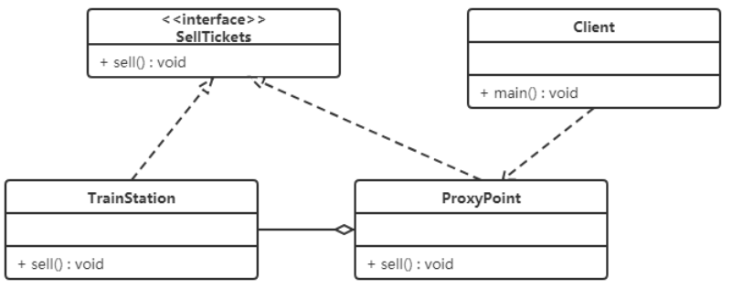

`SellTickets`：卖火车票的接口

```java
/**
 * 卖票接口
 * @Description: 卖火车票的接口
 */
public interface SellTickets {

    void sell();
}
```

`TrainStation`：火车站类

```java
/**
 * 火车站  火车站具有卖票功能，所以需要实现SellTickets接口
 * @Description: 火车站类
 */
public class TrainStation implements SellTickets {

    public void sell() {
        System.out.println("火车站卖票");
    }
}
```

`ProxyPoint`：代售点类

```java
/**
 * @Description: 代售点类
 */
public class ProxyPoint implements SellTickets {

    //声明火车站类对象
    private TrainStation trainStation  = new TrainStation();

    public void sell() {
        System.out.println("代售点收取一些服务费用");
        trainStation.sell();
    }

}
```

`Client`：

```java
public class Client {
    public static void main(String[] args) {
        //创建代售点类对象
        ProxyPoint proxyPoint = new ProxyPoint();
        //调用方法进行买票
        proxyPoint.sell();
        /*
        代售点收取一些服务费用
        火车站卖票
         */
    }
}
```

从上面代码中可以看出测试类直接访问的是ProxyPoint类对象，也就是说ProxyPoint作为访问对象和目标对象的中介。同时也对sell方法进行了增强（代理点收取一些服务费用）

**GPT补充**：

静态代理的概念：

- 静态代理是一种设计模式，它通过代理类控制对目标对象的访问。在静态代理模式中，代理类与目标类实现相同的接口，代理类在调用目标对象的方法之前或之后可以增加额外的逻辑，比如日志记录、权限验证、性能统计等

静态代理的特点：

1. 代理类和目标类需要实现相同的接口
2. 代理类在编译期间就确定，不是动态生成的
3. 可以在不修改目标类的前提下对目标对象的功能进行增强

静态代理的结构：

1. 接口（Subject）： 定义目标对象和代理对象都要实现的方法
2. 目标对象（RealSubject）： 实现了接口的类，是真正执行业务逻辑的对象
3. 代理对象（Proxy）： 实现了接口，用来代理目标对象的类，负责增强业务逻辑或控制对目标对象的访问

 静态代理示例：

1.定义一个接口 `Subject`

```java
// 定义接口
public interface Subject {
    void doSomething();
}
```

2.实现目标对象 `RealSubject`

```java
// 目标对象
public class RealSubject implements Subject {
    @Override
    public void doSomething() {
        System.out.println("RealSubject: 执行真正的业务逻辑...");
    }
}
```

3.创建代理对象 `Proxy`

```java
// 代理对象
public class Proxy implements Subject {
    private RealSubject realSubject;

    public Proxy(RealSubject realSubject) {
        this.realSubject = realSubject;
    }

    @Override
    public void doSomething() {
        // 增强逻辑
        System.out.println("Proxy: 在调用真实对象之前做一些事情...");
        
        // 调用真实对象的方法
        realSubject.doSomething();
        
        // 增强逻辑
        System.out.println("Proxy: 在调用真实对象之后做一些事情...");
    }
}
```

4.测试静态代理

```java
public class StaticProxyDemo {
    public static void main(String[] args) {
        // 创建目标对象
        RealSubject realSubject = new RealSubject();
        
        // 创建代理对象，传入目标对象
        Proxy proxy = new Proxy(realSubject);
        
        // 通过代理对象调用方法
        proxy.doSomething();
    }
}
```

5.运行结果

```plaintext
Proxy: 在调用真实对象之前做一些事情...
RealSubject: 执行真正的业务逻辑...
Proxy: 在调用真实对象之后做一些事情...
```

总结：

- 静态代理模式通过代理类在不修改目标对象的前提下，提供了灵活的扩展方式。它可以在方法调用的前后增加额外的功能，比如权限校验、日志记录、事务管理等。但其缺点是代理类需要和目标类实现相同的接口，增加了类的数量，当接口方法增多时，维护代理类的成本也会增加


##### 5.1.3 JDK动态代理

DK提供的动态代理：Java中提供了一个动态代理类Proxy，Proxy并不是上述所说的代理对象的类，而是提供了一个创建代理对象的静态方法（newProxyInstance方法）来获取代理对象。接下来使用动态代理实现上面案例，代码如下：

`SellTickets`：卖火车票的接口

```java
/**
 * @Description: 卖火车票的接口
 */
public interface SellTickets {

    void sell();
}
```

`TrainStation`：火车站类

```java
/**
 * @Description: 火车站类
 * 火车站具有卖票功能，所以需要实现SellTickets接口
 */
public class TrainStation implements SellTickets {

    public void sell() {
        System.out.println("火车站卖票");
    }
}
```

`ProxyFactory`：获取代理对象的工厂类

```java
import java.lang.reflect.InvocationHandler;
import java.lang.reflect.Method;
import java.lang.reflect.Proxy;

/**
 * @Description: 获取代理对象的工厂类
 * 代理工厂，用来创建代理对象
 * 代理类也实现了对应的接口
 */
public class ProxyFactory {

    //声明目标对象
    private TrainStation station = new TrainStation();

    // 获取代理对象的方法
    // 使用Proxy获取代理对象
    public SellTickets getProxyObject() {
        //返回代理对象
        /*
            ClassLoader loader : 类加载器，用于加载代理类。可以通过目标对象获取类加载器（类加载器，用于加载代理类，使用真实对象的类加载器即可）
            Class<?>[] interfaces ： 代理类实现的接口的字节码对象（真实对象所实现的接口，代理模式真实对象和代理对象实现相同的接口）
            InvocationHandler h ： 代理对象的调用处理程序
         */
        SellTickets proxyObject = (SellTickets)Proxy.newProxyInstance(
                station.getClass().getClassLoader(),
                station.getClass().getInterfaces(),
                new InvocationHandler() {

                    /*
                        Object proxy : 代理对象。和proxyObject对象是同一个对象，在invoke方法中基本不用
                        Method method ： 对接口中的方法进行封装的method对象（对应于在代理对象上调用的接口方法的 Method 实例）
                        Object[] args ： 调用方法的实际参数（代理对象调用接口方法时传递的实际参数）

                        返回值： 方法的返回值。
                     */
                    public Object invoke(Object proxy, Method method, Object[] args) throws Throwable {
                        //System.out.println("invoke方法执行了");
                        System.out.println("代售点收取一定的服务费用(jdk动态代理)");
                        //执行目标对象的方法
                        Object obj = method.invoke(station, args);
                        return obj;
                    }
                }
        );
        return proxyObject;
    }
}
```

`Client`：

```java
public class Client {
    public static void main(String[] args) {
        //获取代理对象
        //1,创建代理工厂对象
        ProxyFactory factory = new ProxyFactory();
        //2,使用factory对象的方法获取代理对象
        SellTickets proxyObject = factory.getProxyObject();
        //3,调用卖调用的方法
        proxyObject.sell();

        System.out.println(proxyObject.getClass());
        /*
        代售点收取一定的服务费用(jdk动态代理)
        火车站卖票
         */

        //让程序一直执行
        while(true) {}

    }
}
```

上述代码使用了动态代理，那`ProxyFactory`是代理类吗？

- `ProxyFactory`不是代理模式中所说的代理类，代理类是程序在运行过程中动态的在内存中生成的类
- 通过阿里巴巴开源的 Java 诊断工具（Arthas【阿尔萨斯】）查看代理类的结构：

```java
package com.sun.proxy;

import com.itheima.proxy.dynamic.jdk.SellTickets;
import java.lang.reflect.InvocationHandler;
import java.lang.reflect.Method;
import java.lang.reflect.Proxy;
import java.lang.reflect.UndeclaredThrowableException;

public final class $Proxy0 extends Proxy implements SellTickets {
  private static Method m1;
  private static Method m2;
  private static Method m3;
  private static Method m0;

  public $Proxy0(InvocationHandler invocationHandler) {
	  super(invocationHandler);
  }

  static {
	  try {
		  m1 = Class.forName("java.lang.Object").getMethod("equals", Class.forName("java.lang.Object"));
		  m2 = Class.forName("java.lang.Object").getMethod("toString", new Class[0]);
		  m3 = Class.forName("com.itheima.proxy.dynamic.jdk.SellTickets").getMethod("sell", new Class[0]);
		  m0 = Class.forName("java.lang.Object").getMethod("hashCode", new Class[0]);
		  return;
	  }
	  catch (NoSuchMethodException noSuchMethodException) {
		  throw new NoSuchMethodError(noSuchMethodException.getMessage());
	  }
	  catch (ClassNotFoundException classNotFoundException) {
		  throw new NoClassDefFoundError(classNotFoundException.getMessage());
	  }
  }

  public final boolean equals(Object object) {
	  try {
		  return (Boolean)this.h.invoke(this, m1, new Object[]{object});
	  }
	  catch (Error | RuntimeException throwable) {
		  throw throwable;
	  }
	  catch (Throwable throwable) {
		  throw new UndeclaredThrowableException(throwable);
	  }
  }

  public final String toString() {
	  try {
		  return (String)this.h.invoke(this, m2, null);
	  }
	  catch (Error | RuntimeException throwable) {
		  throw throwable;
	  }
	  catch (Throwable throwable) {
		  throw new UndeclaredThrowableException(throwable);
	  }
  }

  public final int hashCode() {
	  try {
		  return (Integer)this.h.invoke(this, m0, null);
	  }
	  catch (Error | RuntimeException throwable) {
		  throw throwable;
	  }
	  catch (Throwable throwable) {
		  throw new UndeclaredThrowableException(throwable);
	  }
  }

  public final void sell() {
	  try {
		  this.h.invoke(this, m3, null);
		  return;
	  }
	  catch (Error | RuntimeException throwable) {
		  throw throwable;
	  }
	  catch (Throwable throwable) {
		  throw new UndeclaredThrowableException(throwable);
	  }
  }
}
```

从上面的类中，可以看到以下几个信息：

* 代理类（$Proxy0）实现了SellTickets。这也就印证了之前说的真实类和代理类实现同样的接口。
* 代理类（$Proxy0）将我们提供了的匿名内部类对象传递给了父类。

* 动态代理的执行流程是什么样？

下面是摘取的重点代码：

```java
//程序运行过程中动态生成的代理类
public final class $Proxy0 extends Proxy implements SellTickets {
  private static Method m3;

  public $Proxy0(InvocationHandler invocationHandler) {
	  super(invocationHandler);
  }

  static {
	  m3 = Class.forName("com.itheima.proxy.dynamic.jdk.SellTickets").getMethod("sell", new Class[0]);
  }

  public final void sell() {
	  this.h.invoke(this, m3, null);
  }
}

//Java提供的动态代理相关类
public class Proxy implements java.io.Serializable {
protected InvocationHandler h;
 
protected Proxy(InvocationHandler h) {
	  this.h = h;
  }
}

//代理工厂类
public class ProxyFactory {

  private TrainStation station = new TrainStation();

  public SellTickets getProxyObject() {
	  SellTickets sellTickets = (SellTickets) Proxy.newProxyInstance(station.getClass().getClassLoader(),
			  station.getClass().getInterfaces(),
			  new InvocationHandler() {
				  
				  public Object invoke(Object proxy, Method method, Object[] args) throws Throwable {

					  System.out.println("代理点收取一些服务费用(JDK动态代理方式)");
					  Object result = method.invoke(station, args);
					  return result;
				  }
			  });
	  return sellTickets;
  }
}


//测试访问类
public class Client {
  public static void main(String[] args) {
	  //获取代理对象
	  ProxyFactory factory = new ProxyFactory();
	  SellTickets proxyObject = factory.getProxyObject();
	  proxyObject.sell();
  }
}
```


执行流程如下：

  1. 在测试类中通过代理对象调用sell()方法
  2. 根据多态的特性，执行的是代理类（$Proxy0）中的sell()方法
  3. 代理类（$Proxy0）中的sell()方法中又调用了InvocationHandler接口的子实现类对象的invoke方法
  4. invoke方法通过反射执行了真实对象所属类(TrainStation)中的sell()方法


**GPT补充**：

JDK动态代理简介：

- JDK动态代理是Java中的一种机制，它允许在运行时创建代理类，并通过代理对象来间接访问目标对象。JDK动态代理主要用于为接口生成代理对象，这些代理对象可以拦截对目标对象的方法调用，并在调用前后添加一些逻辑，比如日志记录、权限校验、事务处理等

主要特点：

- 接口驱动：JDK动态代理只能代理实现了接口的类，如果目标类没有实现任何接口，那么JDK动态代理无法使用
- InvocationHandler接口：核心接口，用于定义代理类方法调用时的行为
- Proxy类：JDK自带的工具类，用于创建代理对象

JDK动态代理的实现步骤：

1. 定义接口和实现类：定义要代理的接口及其实现类
2. 创建InvocationHandler的实现类：通过实现`InvocationHandler`接口，自定义代理逻辑
3. 通过Proxy生成代理对象：使用`Proxy.newProxyInstance()`方法生成代理对象
4. 通过代理对象调用方法：代理对象调用方法时，会自动触发`InvocationHandler`的`invoke()`方法

使用案例：

- 下面是一个简单的例子，展示如何使用JDK动态代理

1.定义接口及实现类

```java
// 定义接口
public interface Service {
    void performTask();
}

// 实现类
public class ServiceImpl implements Service {
    @Override
    public void performTask() {
        System.out.println("Executing task...");
    }
}
```

2.实现`InvocationHandler`

```java
import java.lang.reflect.InvocationHandler;
import java.lang.reflect.Method;

public class ServiceInvocationHandler implements InvocationHandler {
    private Object target;

    public ServiceInvocationHandler(Object target) {
        this.target = target;
    }

    @Override
    public Object invoke(Object proxy, Method method, Object[] args) throws Throwable {
        System.out.println("Before method execution...");
        Object result = method.invoke(target, args);
        System.out.println("After method execution...");
        return result;
    }
}
```

3.创建代理对象并调用方法

```java
import java.lang.reflect.Proxy;
public class Main {
    public static void main(String[] args) {
        // 创建实际对象
        Service realService = new ServiceImpl();

        // 创建代理对象
        Service proxyService = (Service) Proxy.newProxyInstance(
                realService.getClass().getClassLoader(),
                realService.getClass().getInterfaces(),
                new ServiceInvocationHandler(realService)
        );

        // 调用方法
        proxyService.performTask();
    }
}
```

4.输出结果

运行上述代码后，控制台会输出：

```mathematica
Before method execution...
Executing task...
After method execution...
```

解释：

- `ServiceInvocationHandler`实现了`InvocationHandler`接口，并在`invoke()`方法中添加了额外的逻辑，来处理方法调用前后需要执行的操作
- 通过`Proxy.newProxyInstance()`方法创建了一个代理对象`proxyService`，它在方法调用时会委托给`ServiceInvocationHandler`来处理

应用场景：

- JDK动态代理在许多Java框架中有广泛应用，比如Spring AOP（面向切面编程）中，用于实现方法拦截器、事务管理等功能


##### 5.1.4 `CGLIB`动态代理

`CGLIB`动态代理：CGLIB是一个功能强大，高性能的代码生成包。它为没有实现接口的类提供代理，为JDK的动态代理提供了很好的补充。对于上面的案例，如果没有定义SellTickets接口，只定义了TrainStation(火车站类)。很显然JDK代理是无法使用了，因为JDK动态代理要求必须定义接口，对接口进行代理

使用`CGLIB`代理实现上面的案例：

- CGLIB是第三方提供的包，所以需要引入jar包的坐标：


```xml
<dependency>
    <groupId>cglib</groupId>
    <artifactId>cglib</artifactId>
    <version>2.2.2</version>
</dependency>
```

`TrainStation`：火车站

```java
public class TrainStation {

    public void sell() {
        System.out.println("火车站卖票");
    }
}
```

`ProxyFactory`：代理对象工厂，用来获取代理对象

```java
import net.sf.cglib.proxy.Enhancer;
import net.sf.cglib.proxy.MethodInterceptor;
import net.sf.cglib.proxy.MethodProxy;
import java.lang.reflect.Method;
/**
 * @Description: 代理对象工厂，用来获取代理对象
 */
public class ProxyFactory implements MethodInterceptor {

    //声明火车站对象
    private TrainStation station = new TrainStation();

    public TrainStation getProxyObject() {
        //创建Enhancer对象，类似于JDK代理中的Proxy类
        Enhancer enhancer = new Enhancer();
        //设置父类的字节码对象。指定父类
        enhancer.setSuperclass(TrainStation.class);
        //设置回调函数
        enhancer.setCallback(this);
        //创建代理对象
        TrainStation proxyObject = (TrainStation) enhancer.create();
        return proxyObject;
    }

    public Object intercept(Object o, Method method, Object[] objects, MethodProxy methodProxy) throws Throwable {
        //System.out.println("方法执行了");
        System.out.println("代售点收取一定的服务费用(CGLib代理)");
        //要调用目标对象的方法
        Object obj = method.invoke(station, objects);
        return obj;
    }
}
```

`Client`：

```java
public class Client {
    public static void main(String[] args) {
        //创建代理工厂对象
        ProxyFactory factory = new ProxyFactory();
        //获取代理对象
        TrainStation proxyObject = factory.getProxyObject();
        //调用代理对象中的sell方法卖票
        proxyObject.sell();
        /**
         代售点收取一定的服务费用(CGLib代理)
         火车站卖票
         */
    }
}
```

**GPT补充**：

CGLIB 动态代理简介：

- CGLIB（Code Generation Library）是一个开源的 Java 字节码生成库，常用于在运行时动态生成类和代理对象。CGLIB 动态代理是 Spring 框架中的一种重要的代理机制，它与 JDK 动态代理有所不同，适用于代理没有实现接口的类

CGLIB 动态代理的工作原理：

- CGLIB 通过**继承目标类**并在运行时动态生成子类的方式来实现代理。这与 JDK 动态代理不同，JDK 动态代理要求目标类必须实现接口，而 CGLIB 则通过生成目标类的子类来增强功能。代理对象通过重写目标类中的方法，并在方法调用前后加入自定义逻辑来实现代理行为

工作流程：

1. 生成代理类：CGLIB 通过 ASM 字节码操作库动态生成目标类的子类
2. 重写方法：对于目标类中的所有非 `final`、`private` 方法，CGLIB 生成的代理类都会重写这些方法，以便在方法调用前后插入代理逻辑
3. 代理方法调用：代理类中重写的方法会先执行代理逻辑（如日志、权限校验等），然后再调用原有的目标方法

CGLIB 动态代理的优缺点：

- 优点：
  - 不需要接口：CGLIB 代理不依赖接口，适合没有实现接口的类
  - 性能较高：在某些场景下，CGLIB 动态代理的性能比 JDK 动态代理要好，尤其是在大量代理对象的情况下
  - 支持类代理：能够代理普通类，而不仅仅是接口
- 缺点：
  - 需要继承目标类：CGLIB 动态代理通过继承目标类实现代理，因此目标类的 `final` 方法无法被代理
  - 更高的复杂性：由于涉及到字节码生成，CGLIB 的实现复杂度较高，并且对 JVM 有更大的依赖
  - 内存消耗较高：因为每次代理都会生成新的子类，因此相比于 JDK 动态代理，CGLIB 在某些场景下的内存消耗更大

CGLIB 动态代理的使用：

- 使用 CGLIB 动态代理通常需要实现 `MethodInterceptor` 接口，并通过 `Enhancer` 类生成代理对象。`MethodInterceptor` 接口定义了 `intercept` 方法，用来控制代理逻辑的执行

示例代码：

```java
import net.sf.cglib.proxy.Enhancer;
import net.sf.cglib.proxy.MethodInterceptor;
import net.sf.cglib.proxy.MethodProxy;
import java.lang.reflect.Method;

class TargetClass {
    public void sayHello() {
        System.out.println("Hello, World!");
    }
}

class CglibProxy implements MethodInterceptor {
    private Object target;

    public CglibProxy(Object target) {
        this.target = target;
    }

    @Override
    public Object intercept(Object obj, Method method, Object[] args, MethodProxy proxy) throws Throwable {
        System.out.println("Before method call");
        Object result = proxy.invokeSuper(obj, args);  // 调用目标类的方法
        System.out.println("After method call");
        return result;
    }
}

public class CglibProxyDemo {
    public static void main(String[] args) {
        // 目标对象
        TargetClass target = new TargetClass();
        
        // 创建代理对象
        Enhancer enhancer = new Enhancer();
        enhancer.setSuperclass(TargetClass.class);  // 设置目标类为代理对象的父类
        enhancer.setCallback(new CglibProxy(target));
        
        // 生成代理对象
        TargetClass proxy = (TargetClass) enhancer.create();
        
        // 调用代理对象的方法
        proxy.sayHello();
    }
}
```

输出结果：

```
Before method call
Hello, World!
After method call
```

CGLIB 在 Spring 中的应用：

- 在 Spring 框架中，CGLIB 主要用于**AOP（面向切面编程）**。当 Spring 的 AOP 需要代理一个没有实现接口的类时，就会自动使用 CGLIB 来生成代理对象。在 Spring 中，可以通过配置来强制使用 CGLIB 代理，或者通过 `@Configuration` 注解的类默认就会使用 CGLIB

```java
@EnableAspectJAutoProxy(proxyTargetClass = true)  // 强制使用 CGLIB 代理
public class AppConfig {
    // 配置类
}
```

总结：

- CGLIB 动态代理通过生成目标类的子类来实现代理机制，适用于没有实现接口的类。虽然 CGLIB 的实现复杂且有内存开销，但它可以为 AOP 和其他动态代理场景提供强大的功能扩展


##### 5.1.5 总结

三种代理的对比：

* jdk代理和CGLIB代理

  - 使用CGLib实现动态代理，CGLib底层采用ASM字节码生成框架，使用字节码技术生成代理类，在JDK1.6之前比使用Java反射效率要高。唯一需要注意的是，CGLib不能对声明为final的类或者方法进行代理，因为CGLib原理是动态生成被代理类的子类。
  - 在JDK1.6、JDK1.7、JDK1.8逐步对JDK动态代理优化之后，在调用次数较少的情况下，JDK代理效率高于CGLib代理效率，只有当进行大量调用的时候，JDK1.6和JDK1.7比CGLib代理效率低一点，但是到JDK1.8的时候，JDK代理效率高于CGLib代理。所以如果有接口使用JDK动态代理，如果没有接口使用CGLIB代理。

* 动态代理和静态代理
* 动态代理与静态代理相比较，最大的好处是接口中声明的所有方法都被转移到调用处理器一个集中的方法中处理（InvocationHandler.invoke）。这样，在接口方法数量比较多的时候，我们可以进行灵活处理，而不需要像静态代理那样每一个方法进行中转
  * 如果接口增加一个方法，静态代理模式除了所有实现类需要实现这个方法外，所有代理类也需要实现此方法。增加了代码维护的复杂度。而动态代理不会出现该问题


优缺点：

- 优点：

  - 代理模式在客户端与目标对象之间起到一个中介作用和保护目标对象的作用

  - 代理对象可以扩展目标对象的功能

  - 代理模式能将客户端与目标对象分离，在一定程度上降低了系统的耦合度


- 缺点：

  * 增加了系统的复杂度


使用场景：

* 远程（Remote）代理：本地服务通过网络请求远程服务。为了实现本地到远程的通信，需要实现网络通信，处理其中可能的异常。为良好的代码设计和可维护性，将网络通信部分隐藏起来，只暴露给本地服务一个接口，通过该接口即可访问远程服务提供的功能，而不必过多关心通信部分的细节

* 防火墙（Firewall）代理：将浏览器配置成使用代理功能时，防火墙就将浏览器的请求转给互联网；当互联网返回响应时，代理服务器再把它转浏览器

* 保护（Protect or Access）代理：控制对一个对象的访问，如果需要，可以给不同的用户提供不同级别的使用权限


### 5.2 适配器模式

##### 5.2.1 简介

适配器：

- 欧洲使用的插座是欧洲标准，和国内使用的插头不同。国内的电器在国外不能直接充电，需要一个插座转换器，转换器第1面插入当地的插座，第2面供我们充电，这样使得插头在当地能使用。生活中这样的例子很多，手机充电器（将220v转换为5v的电压），读卡器等，其实就是使用到了适配器模式

适配器模式：

- 将一个类的接口转换成客户希望的另外一个接口，使得原本由于接口不兼容而不能一起工作的那些类能一起工作
- 适配器模式分为类适配器模式和对象适配器模式，前者类之间的耦合度比后者高，且要求程序员了解现有组件库中的相关组件的内部结构，所以应用相对较少些

适配器模式（Adapter）包含以下主要角色：

* 目标（Target）接口：当前系统业务所期待的接口，它可以是抽象类或接口
* 适配者（Adaptee）类：它是被访问和适配的现存组件库中的组件接口
* 适配器（Adapter）类：它是一个转换器，通过继承或引用适配者的对象，把适配者接口转换成目标接口，让客户按目标接口的格式访问适配者

应用场景：

* 以前开发的系统存在满足新系统功能需求的类，但其接口同新系统的接口不一致
* 使用第三方提供的组件，但组件接口定义和自己要求的接口定义不同

##### 5.2.2 类适配器模式

实现方式：定义一个适配器类来实现当前系统的业务接口，同时又继承现有组件库中已经存在的组件

> 案例：读卡器
>
> 现有一台电脑只能读取SD卡，而要读取TF卡中的内容的话就需要使用到适配器模式。创建一个读卡器，将TF卡中的内容读取出来
>
> 类图如下：

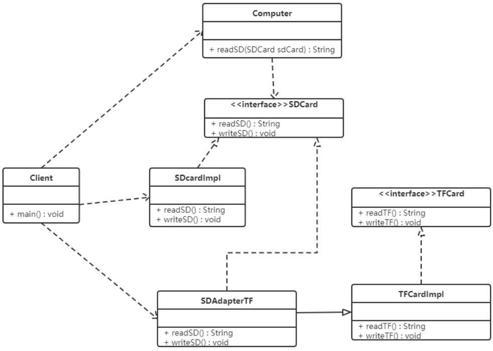

`TFCard`：适配者类的接口

```java
/**
 * @Description: 适配者类的接口
 */
public interface TFCard {

    //从TF卡中读取数据
    String readTF();
    //往TF卡中写数据
    void writeTF(String msg);
}
```

`TFCardImpl`：适配者类

```java
/**
 * @ClassName: TFCardImpl
 * @Description: 适配者类
 */
public class TFCardImpl implements TFCard {

    public String readTF() {
        String msg = "TFCard read msg ： hello word TFcard";
        return msg;
    }

    public void writeTF(String msg) {
        System.out.println("TFCard write msg :" + msg);
    }
}
```

`SDCard`：目标接口

```java
/**
 * @ClassName: SDCard
 * @Description: 目标接口
 */
public interface SDCard {

    //从SD卡中读取数据
    String readSD();
    
    //往SD卡中写数据
    void writeSD(String msg);
}
```

`SDCardImpl`：具体的SD卡

```java
/**
 * @Description: 具体的SD卡
 */
public class SDCardImpl implements SDCard {

    public String readSD() {
        String msg = "SDCard read msg ： hello word SD";
        return msg;
    }

    public void writeSD(String msg) {
        System.out.println("SDCard write msg ：" + msg);
    }
}
```

`Computer`：计算机类

```java
/**
 * @Description: 计算机类
 */
public class Computer {

    //从SD卡中读取数据
    public String readSD(SDCard sdCard) {
        if(sdCard == null) {
            throw  new NullPointerException("sd card is not null");
        }
        return sdCard.readSD();
    }
}
```

`SDAdapterTF`：适配器类

```java
/**
 * 定义适配器类（SD兼容TF）
 * @Description: 适配器类
 */
public class SDAdapterTF extends TFCardImpl implements SDCard {

    public String readSD() {
        System.out.println("adapter read tf card");
        return readTF();
    }

    public void writeSD(String msg) {
        System.out.println("adapter write tf card");
        writeTF(msg);
    }
}
```

`Client`：

```java
public class Client {
    public static void main(String[] args) {
        //创建计算机对象
        Computer computer = new Computer();
        //读取SD卡中的数据
        String msg = computer.readSD(new SDCardImpl());
        System.out.println(msg);

        System.out.println("===============");
        //使用该电脑读取TF卡中的数据
        //定义适配器类
        String msg1 = computer.readSD(new SDAdapterTF());
        System.out.println(msg1);
        /*
        SDCard read msg ： hello word SD
        ===============
        adapter read tf card
        TFCard read msg ： hello word TFcard
         */
    }
}
```

类适配器模式违背了合成复用原则。类适配器是客户类有一个接口规范的情况下可用，反之不可用

##### 5.2.3 对象适配器模式

实现方式：对象适配器模式可釆用将现有组件库中已经实现的组件引入适配器类中，该类同时实现当前系统的业务接口

> 【例】读卡器
>
> 使用对象适配器模式将读卡器的案例进行改写。类图如下：

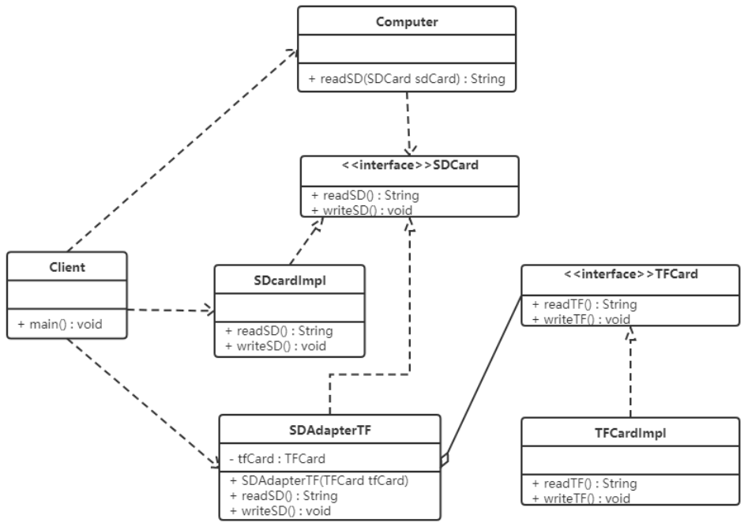

`SDCard`：目标接口

```java
/**
 * @Description: 目标接口
 */
public interface SDCard {

    //从SD卡中读取数据
    String readSD();
    //往SD卡中写数据
    void writeSD(String msg);
}
```

`SDCardImpl`：具体的SD卡

```java
/**
 * @Description: 具体的SD卡
 */
public class SDCardImpl implements SDCard {

    public String readSD() {
        String msg = "SDCard read msg ： hello word SD";
        return msg;
    }

    public void writeSD(String msg) {
        System.out.println("SDCard write msg ：" + msg);
    }
}
```

`TFCard`：适配者类的接口

```java
/**
 * @Description: 适配者类的接口
 */
public interface TFCard {

    //从TF卡中读取数据
    String readTF();
    //往TF卡中写数据
    void writeTF(String msg);
}
```

`TFCardImpl`：适配者类

```java
/**
 * @Description: 适配者类
 */
public class TFCardImpl implements TFCard {

    public String readTF() {
        String msg = "TFCard read msg ： hello word TFcard";
        return msg;
    }

    public void writeTF(String msg) {
        System.out.println("TFCard write msg :" + msg);
    }
}
```

`SDAdapterTF`：适配器类

```java
/**
 * @Description: 适配器类
 */
public class SDAdapterTF implements SDCard {

    //声明适配者类
    private TFCard tfCard;

    public SDAdapterTF(TFCard tfCard) {
        this.tfCard = tfCard;
    }

    public String readSD() {
        System.out.println("adapter read tf card");
        return tfCard.readTF();
    }

    public void writeSD(String msg) {
        System.out.println("adapter write tf card");
        tfCard.writeTF(msg);
    }
}
```

`Computer`：计算机类

```java
/**
 * @Description: 计算机类
 */
public class Computer {

    //从SD卡中读取数据
    public String readSD(SDCard sdCard) {
        if(sdCard == null) {
            throw  new NullPointerException("sd card is not null");
        }
        return sdCard.readSD();
    }
}
```

`Client`：测试

```java
public class Client {
    public static void main(String[] args) {
        //创建计算机对象
        Computer computer = new Computer();
        //读取SD卡中的数据
        String msg = computer.readSD(new SDCardImpl());
        System.out.println(msg);

        System.out.println("===============");
        //使用该电脑读取TF卡中的数据
        //创建适配器类对象
        SDAdapterTF sdAdapterTF = new SDAdapterTF(new TFCardImpl());
        String msg1 = computer.readSD(sdAdapterTF);
        System.out.println(msg1);
        /*
        SDCard read msg ： hello word SD
        ===============
        adapter read tf card
        TFCard read msg ： hello word TFcard
         */
    }
}
```


> 注意：还有一个适配器模式是接口适配器模式。当不希望实现一个接口中所有的方法时，可以创建一个抽象类Adapter ，实现所有方法。而此时只需要继承该抽象类即可


##### 5.2.4 `JDK`源码中的应用

Reader（字符流）、InputStream（字节流）的适配使用的是InputStreamReader。

InputStreamReader继承自java.io包中的Reader，对InputStreamReader中的抽象的未实现的方法给出实现。如：

```java
public int read() throws IOException {
    return sd.read();
}

public int read(char cbuf[], int offset, int length) throws IOException {
    return sd.read(cbuf, offset, length);
}
```

如上代码中的sd（StreamDecoder类对象），在Sun的JDK实现中，实际的方法实现是对sun.nio.cs.StreamDecoder类的同名方法的调用封装。类结构图如下：

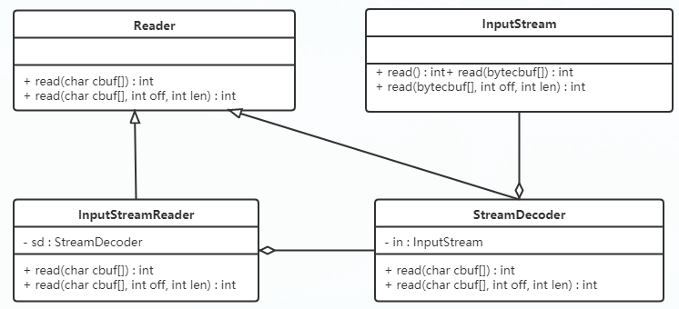

从上图可以看出：

* InputStreamReader是对同样实现了Reader的StreamDecoder的封装
* StreamDecoder不是Java SE API中的内容，是Sun  JDK给出的自身实现。但我们知道他们对构造方法中的字节流类（InputStream）进行封装，并通过该类进行了字节流和字符流之间的解码转换

从表层来看，InputStreamReader做了InputStream字节流类到Reader字符流之间的转换。而从如上Sun JDK中的实现类关系结构中可以看出，是StreamDecoder的设计实现在实际上采用了适配器模式

##### 5.2.5 `GPT`补充

适配器模式（Adapter Pattern）：

- 是一种结构型设计模式，它允许将一个类的接口转换为客户端希望的另一个接口。适配器模式使得原本由于接口不兼容而不能一起工作的类可以协同工作。适配器模式通过引入一个适配器类，提供新的接口或将现有接口进行转换，从而解决接口不兼容的问题
- 适配器模式的核心目标是：通过引入一个适配器，使得现有的类能兼容新的客户端接口，而无需修改原有代码

适配器模式主要分为两种：

1. 类适配器模式：通过继承来实现适配器，适配器继承自已有类并实现目标接口。这种方式在 Java 中由于单继承的限制，使用较少
2. 对象适配器模式：通过组合（持有已有类的对象）来实现适配器。适配器包含已有类的实例，并将调用委托给该实例。这种方式是使用更广泛的适配器模式

适配器模式的结构：

1. 目标接口（Target）：客户端需要的接口，定义了客户端期望的功能
2. 适配者（Adaptee）：现有的接口，它具有客户端不兼容的方法
3. 适配器（Adapter）：将适配者的接口转换为目标接口，使得适配者能够与目标接口兼容
4. 客户端（Client）：调用目标接口，与适配器协同工作

适配器模式的优缺点：

- 优点：
  1. 解耦：将不兼容的接口通过适配器进行解耦，使得类之间的依赖关系降低
  2. 增强代码复用性：现有的类可以在不修改其代码的前提下，通过适配器与新的系统进行集成
  3. 灵活性高：通过适配器可以动态地转换接口，灵活应对不同场景下的接口不兼容问题

- 缺点：
  1. 增加类的复杂性：引入适配器类可能会增加系统的复杂性，尤其当需要多个适配器时，管理起来可能比较繁琐
  2. 性能开销：由于适配器模式引入了额外的中间层，可能会对系统性能产生影响，尤其是在频繁调用的场景下

适配器模式的实现：

- 适配器模式通常用于现有接口与新接口不兼容的情况下。下面通过一个简单的例子展示适配器模式的实现
- 假设有一个老的 `VGA` 接口（适配者），现在需要让它适配到 `HDMI` 接口（目标接口），通过适配器类实现这种转换

类适配器模式示例：

```java
// 目标接口
interface HDMI {
    void displayHDMI();
}

// 适配者类
class VGA {
    public void displayVGA() {
        System.out.println("Displaying through VGA interface.");
    }
}

// 类适配器，通过继承实现
class VGAtoHDMIAdapter extends VGA implements HDMI {
    @Override
    public void displayHDMI() {
        // 调用适配者的VGA接口方法
        displayVGA();
    }
}

// 客户端代码
public class ClassAdapterPatternDemo {
    public static void main(String[] args) {
        // 使用适配器
        HDMI hdmiDisplay = new VGAtoHDMIAdapter();
        hdmiDisplay.displayHDMI();  // 输出: Displaying through VGA interface.
    }
}
```

对象适配器模式示例：

```java
// 目标接口
interface HDMI {
    void displayHDMI();
}

// 适配者类
class VGA {
    public void displayVGA() {
        System.out.println("Displaying through VGA interface.");
    }
}

// 对象适配器，通过组合实现
class VGAtoHDMIAdapter implements HDMI {
    private VGA vga;

    // 通过构造函数接收适配者对象
    public VGAtoHDMIAdapter(VGA vga) {
        this.vga = vga;
    }

    @Override
    public void displayHDMI() {
        // 调用适配者的VGA接口方法
        vga.displayVGA();
    }
}

// 客户端代码
public class ObjectAdapterPatternDemo {
    public static void main(String[] args) {
        // 使用适配器
        VGA vga = new VGA();
        HDMI hdmiDisplay = new VGAtoHDMIAdapter(vga);
        hdmiDisplay.displayHDMI();  // 输出: Displaying through VGA interface.
    }
}
```

适配器模式的应用场景：

1. 系统需要使用现有类，但这些类的接口与系统需求不兼容。可以通过适配器模式将已有类与新系统兼容，而不需要修改已有类的源码
2. 希望创建一个可以复用的类，而该类可能与其他类接口不兼容。通过适配器模式，可以让一个类与多个接口兼容，从而提升类的可复用性
3. 引入第三方库：在引入第三方库时，如果其接口不符合当前系统的需求，可以通过适配器进行转换，而不需要对第三方库进行修改

适配器模式的变种：双向适配器

- 双向适配器 是适配器模式的一个变种，它可以在两种接口之间进行转换，既可以将一个接口适配为另一个接口，也可以将另一个接口适配为第一个接口

双向适配器示例：

```java
// HDMI接口
interface HDMI {
    void displayHDMI();
}

// VGA接口
interface VGA {
    void displayVGA();
}

// 双向适配器，既适配HDMI到VGA，也适配VGA到HDMI
class BidirectionalAdapter implements HDMI, VGA {
    private HDMI hdmi;
    private VGA vga;

    public BidirectionalAdapter(HDMI hdmi) {
        this.hdmi = hdmi;
    }

    public BidirectionalAdapter(VGA vga) {
        this.vga = vga;
    }

    @Override
    public void displayVGA() {
        if (hdmi != null) {
            System.out.println("Converting HDMI to VGA...");
            hdmi.displayHDMI();
        }
    }

    @Override
    public void displayHDMI() {
        if (vga != null) {
            System.out.println("Converting VGA to HDMI...");
            vga.displayVGA();
        }
    }
}

// 客户端代码
public class BidirectionalAdapterDemo {
    public static void main(String[] args) {
        HDMI hdmiDevice = () -> System.out.println("Displaying through HDMI interface.");
        VGA vgaDevice = () -> System.out.println("Displaying through VGA interface.");

        // HDMI转VGA
        VGA adapter1 = new BidirectionalAdapter(hdmiDevice);
        adapter1.displayVGA();  // 输出: Converting HDMI to VGA... Displaying through HDMI interface.

        // VGA转HDMI
        HDMI adapter2 = new BidirectionalAdapter(vgaDevice);
        adapter2.displayHDMI();  // 输出: Converting VGA to HDMI... Displaying through VGA interface.
    }
}
```

总结：

- 适配器模式：通过引入适配器，使得不兼容的接口能够协同工作，避免修改原有代码
- 类适配器：通过继承实现接口转换，适合在需要适配的类数量少且不受 Java 单继承限制时使用
- 对象适配器：通过组合实现接口转换，具有更好的灵活性，适合大多数场景
- 双向适配器：进一步增强了适配器的功能，能够在两种接口之间灵活转换
- 适配器模式在现代软件开发中非常常见，特别是在整合已有代码、第三方库和新系统时，能够有效地解决接口不兼容问题

### 5.3 装饰者模式

##### 5.3.1 简介

装饰者模式：

- 指在不改变现有对象结构的情况下，动态地给该对象增加一些职责（即增加其额外功能）的模式

装饰（Decorator）模式中的角色：

* 抽象构件（Component）角色 ：定义一个抽象接口以规范准备接收附加责任的对象
* 具体构件（Concrete  Component）角色 ：实现抽象构件，通过装饰角色为其添加一些职责
* 抽象装饰（Decorator）角色 ： 继承或实现抽象构件，并包含具体构件的实例，可以通过其子类扩展具体构件的功能
* 具体装饰（ConcreteDecorator）角色 ：实现抽象装饰的相关方法，并给具体构件对象添加附加的责任

好处：

* 装饰者模式可以带来比继承更加灵活性的扩展功能，使用更加方便，可以通过组合不同的装饰者对象来获取具有不同行为状态的多样化的结果。装饰者模式比继承更具良好的扩展性，完美的遵循开闭原则，继承是静态的附加责任，装饰者则是动态的附加责任

* 装饰类和被装饰类可以独立发展，不会相互耦合，装饰模式是继承的一个替代模式，装饰模式可以动态扩展一个实现类的功能

使用场景：

* 当不能采用继承的方式对系统进行扩充或者采用继承不利于系统扩展和维护时。

  不能采用继承的情况主要有两类：

  * 第一类是系统中存在大量独立的扩展，为支持每一种组合将产生大量的子类，使得子类数目呈爆炸性增长；
  * 第二类是因为类定义不能继承（如final类）

* 在不影响其他对象的情况下，以动态、透明的方式给单个对象添加职责

* 当对象的功能要求可以动态地添加，也可以再动态地撤销时


静态代理和装饰者模式的区别：

* 相同点：
  * 都要实现与目标类相同的业务接口
  * 在两个类中都要声明目标对象
  * 都可以在不修改目标类的前提下增强目标方法
* 不同点：
  * 目的不同
    装饰者是为了增强目标对象
    静态代理是为了保护和隐藏目标对象
  * 获取目标对象构建的地方不同
    装饰者是由外界传递进来，可以通过构造方法传递
    静态代理是在代理类内部创建，以此来隐藏目标对象

##### 5.3.2 案例

一个快餐店的例子

> 快餐店有炒面、炒饭这些快餐，可以额外附加鸡蛋、火腿、培根这些配菜，当然加配菜需要额外加钱，每个配菜的价钱通常不太一样，那么计算总价就会显得比较麻烦

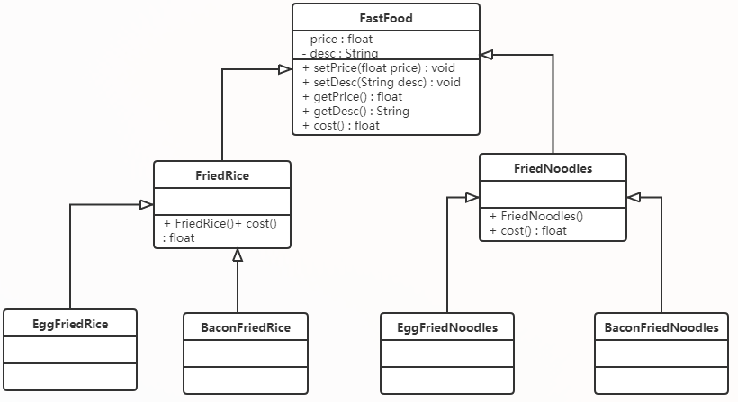

使用继承的方式存在的问题：

> - 扩展性不好：如果要再加一种配料（火腿肠），就会发现需要给FriedRice和FriedNoodles分别定义一个子类。如果要新增一个快餐品类（炒河粉）的话，就需要定义更多的子类
> - 产生过多的子类

改进：

> 使用装饰者模式对快餐店案例进行改进，体会装饰者模式的精髓。类图如下：

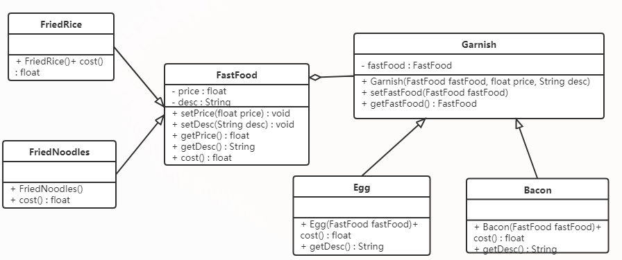

`FastFood`：快餐类(抽象构件角色)

```java
/**
 * @Description: 快餐类(抽象构件角色)
 */
public abstract class FastFood {

    private float price;//价格
    private String desc; //描述

    public float getPrice() {
        return price;
    }

    public void setPrice(float price) {
        this.price = price;
    }

    public String getDesc() {
        return desc;
    }

    public void setDesc(String desc) {
        this.desc = desc;
    }

    public FastFood(float price, String desc) {
        this.price = price;
        this.desc = desc;
    }

    public FastFood() {
    }

    public abstract float cost();
}
```

`FriedRice`：炒饭(具体构件角色)

```java
/**
 * @Description: 炒饭(具体构件角色)
 */
public class FriedRice extends FastFood {

    public FriedRice() {
        super(10,"炒饭");
    }

    public float cost() {
        return getPrice();
    }
}
```

`FriedNoodles`：炒面(具体的构件角色)

```java
/**
 * @Description: 炒面(具体的构件角色)
 */
public class FriedNoodles extends FastFood {

    public FriedNoodles() {
        super(12,"炒面");
    }

    public float cost() {
        return getPrice();
    }
}
```

`Garnish`：装饰者类(抽象装饰者角色)

```java
/**
 * @Description: 装饰者类(抽象装饰者角色)
 */
public abstract class Garnish extends FastFood {

    //声明快餐类的变量
    private FastFood fastFood;

    public FastFood getFastFood() {
        return fastFood;
    }

    public void setFastFood(FastFood fastFood) {
        this.fastFood = fastFood;
    }

    public Garnish(FastFood fastFood,float price, String desc) {
        super(price, desc);
        this.fastFood = fastFood;
    }
}
```

`Egg`：鸡蛋类(具体的装饰者角色)

```java
/**
 * @Description: 鸡蛋类(具体的装饰者角色)
 */
public class Egg extends Garnish {

    public Egg(FastFood fastFood) {
        super(fastFood,1,"鸡蛋");
    }

    public float cost() {
        //计算价格
        return getPrice() + getFastFood().cost();
    }

    @Override
    public String getDesc() {
        return super.getDesc() + getFastFood().getDesc();
    }
}
```

`Bacon`：培根类(具体的装饰者角色)

```java
/**
 * @Description: 培根类(具体的装饰者角色)
 */
public class Bacon extends Garnish {

    public Bacon(FastFood fastFood) {
        super(fastFood,2,"培根");
    }

    public float cost() {
        //计算价格
        return getPrice() + getFastFood().cost();
    }

    @Override
    public String getDesc() {
        return super.getDesc() + getFastFood().getDesc();
    }
}
```

`Client`：

```java
public class Client {
    public static void main(String[] args) {
        //点一份炒饭
        FastFood food = new FriedRice();

        System.out.println(food.getDesc() + "  " + food.cost() + "元");

        System.out.println("===============");

        //在上面的炒饭中加一个鸡蛋
        food = new Egg(food);
        System.out.println(food.getDesc() + "  " + food.cost() + "元");

        System.out.println("================");
        //再加一个鸡蛋
        food = new Egg(food);
        System.out.println(food.getDesc() + "  " + food.cost() + "元");

        System.out.println("================");
        food = new Bacon(food);
        System.out.println(food.getDesc() + "  " + food.cost() + "元");
        /*
        炒饭  10.0元
        ===============
        鸡蛋炒饭  11.0元
        ================
        鸡蛋鸡蛋炒饭  12.0元
        ================
        培根鸡蛋鸡蛋炒饭  14.0元
         */
    }
}
```

##### 5.3.3 `JDK`源码中的应用

IO流中的包装类使用到了装饰者模式。BufferedInputStream，BufferedOutputStream，BufferedReader，BufferedWriter。

以BufferedWriter举例来说明，先看看如何使用BufferedWriter

```java
public class Demo {
    public static void main(String[] args) throws Exception{
        //创建BufferedWriter对象
        //创建FileWriter对象
        FileWriter fw = new FileWriter("C:\\Users\\Think\\Desktop\\a.txt");
        BufferedWriter bw = new BufferedWriter(fw);

        //写数据
        bw.write("hello Buffered");

        bw.close();
    }
}
```

使用起来感觉确实像是装饰者模式，接下来看它们的结构：

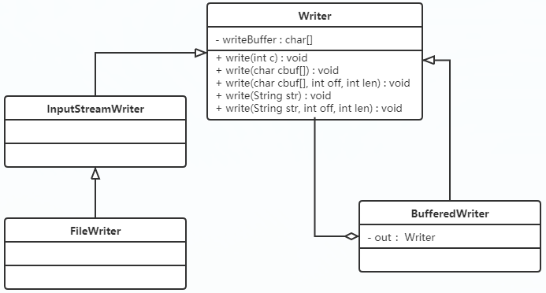


> 总结：BufferedWriter使用装饰者模式对Writer子实现类进行了增强，添加了缓冲区，提高了写数据的效率

##### 5.3.4 GPT补充

装饰者模式（Decorator Pattern）：

- 装饰者模式是一种结构型设计模式，它允许在不改变现有对象结构的前提下，通过动态地给对象添加新的行为或功能，增强对象的功能。装饰者模式通过将对象放入装饰类的实例中来实现，这样就可以对对象进行功能扩展，而不会影响其他对象

模式意图：

- 装饰者模式的核心思想是使用多个对象来组合出新的行为，而不是通过继承来扩展功能。它使得功能的扩展变得灵活，并且可以在运行时动态添加或移除功能

装饰者模式由以下几个关键角色组成：

- Component（组件/接口）： 定义对象的基本行为接口，可以是一个抽象类或接口
- ConcreteComponent（具体组件）： 实现 `Component` 的具体类，表示基本的对象
- Decorator（装饰者）： 持有一个 `Component` 对象引用，并实现该接口。其作用是通过组合的方式来动态地增强或改变被装饰对象的行为
- ConcreteDecorator（具体装饰者）： 继承自 `Decorator`，负责具体地扩展 `Component` 的功能

示例代码：

```java
// 基础组件接口
public interface Component {
    void operation();
}

// 具体组件实现
public class ConcreteComponent implements Component {
    @Override
    public void operation() {
        System.out.println("具体组件的操作");
    }
}

// 装饰者抽象类
public abstract class Decorator implements Component {
    protected Component component;

    public Decorator(Component component) {
        this.component = component;
    }

    @Override
    public void operation() {
        component.operation();
    }
}

// 具体装饰者 A
public class ConcreteDecoratorA extends Decorator {
    public ConcreteDecoratorA(Component component) {
        super(component);
    }

    @Override
    public void operation() {
        super.operation();
        System.out.println("装饰者 A 增强功能");
    }
}

// 具体装饰者 B
public class ConcreteDecoratorB extends Decorator {
    public ConcreteDecoratorB(Component component) {
        super(component);
    }

    @Override
    public void operation() {
        super.operation();
        System.out.println("装饰者 B 增强功能");
    }
}

// 测试类
public class DecoratorPatternTest {
    public static void main(String[] args) {
        Component component = new ConcreteComponent(); // 基本组件
        component = new ConcreteDecoratorA(component); // 添加装饰者A
        component = new ConcreteDecoratorB(component); // 添加装饰者B
        component.operation(); // 调用最终组件的操作
    }
}
```

输出结果：

```
具体组件的操作
装饰者 A 增强功能
装饰者 B 增强功能
```

### 5.4 桥接模式

##### 5.4.1 简介

现在有一个需求，需要创建不同的图形，并且每个图形都有可能会有不同的颜色。可以利用继承的方式来设计类的关系：

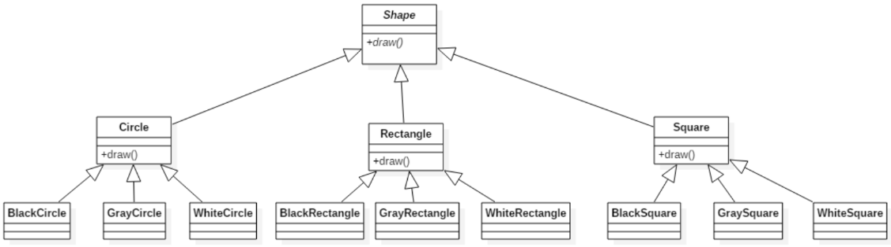

可以发现有很多的类，假如再增加一个形状或再增加一种颜色，就需要创建更多的类

试想，在一个有多种可能会变化的维度的系统中，用继承方式会造成类爆炸，扩展起来不灵活。每次在一个维度上新增一个具体实现都要增加多个子类。为了更加灵活的设计系统，此时可以考虑使用桥接模式

桥接模式定义：

- 将抽象与实现分离，使它们可以独立变化。它是用组合关系代替继承关系来实现，从而降低了抽象和实现这两个可变维度的耦合度

桥接（Bridge）模式包含以下主要角色：

* 抽象化（Abstraction）角色 ：定义抽象类，并包含一个对实现化对象的引用
* 扩展抽象化（Refined  Abstraction）角色 ：是抽象化角色的子类，实现父类中的业务方法，并通过组合关系调用实现化角色中的业务方法
* 实现化（Implementor）角色 ：定义实现化角色的接口，供扩展抽象化角色调用
* 具体实现化（Concrete Implementor）角色 ：给出实现化角色接口的具体实现

桥接模式好处：

* 桥接模式提高了系统的可扩充性，在两个变化维度中任意扩展一个维度，都不需要修改原有系统

  如：如果现在还有一种视频文件类型wmv，我们只需要再定义一个类实现VideoFile接口即可，其他类不需要发生变化

* 实现细节对客户透明

使用场景：

* 当一个类存在两个独立变化的维度，且这两个维度都需要进行扩展时
* 当一个系统不希望使用继承或因为多层次继承导致系统类的个数急剧增加时
* 当一个系统需要在构件的抽象化角色和具体化角色之间增加更多的灵活性时。避免在两个层次之间建立静态的继承联系，通过桥接模式可以使它们在抽象层建立一个关联关系

##### 5.4.2 案例

桥接模式案例：

> 【例】视频播放器
>
> 需要开发一个跨平台视频播放器，可以在不同操作系统平台（如Windows、Mac、Linux等）上播放多种格式的视频文件，常见的视频格式包括RMVB、AVI、WMV等。该播放器包含了两个维度，适合使用桥接模式
>
> 类图如下：

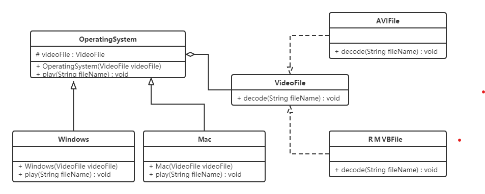

`VideoFile`：视频文件(实现化角色)

```java
/**
 * @Description: 视频文件(实现化角色)
 */
public interface VideoFile {

    //解码功能
    void decode(String fileName);
}
```

`AviFile`：avi视频文件（具体的实现化角色）

```java
/**
 * @Description: avi视频文件（具体的实现化角色）
 */
public class AviFile implements VideoFile {

    public void decode(String fileName) {
        System.out.println("avi视频文件 ：" + fileName);
    }
}
```

`RmvbFile`：rmvb视频文件（具体的实现化角色）

```java
/**
 * @Description: rmvb视频文件（具体的实现化角色）
 */
public class RmvbFile implements VideoFile {

    public void decode(String fileName) {
        System.out.println("rmvb视频文件 ：" + fileName);
    }
}
```

`OpratingSystem`：抽象的操作系统类(抽象化角色)

```java
/**
 * @Description: 抽象的操作系统类(抽象化角色)
 */
public abstract class OpratingSystem {

    //声明videFile变量
    protected VideoFile videoFile;

    public OpratingSystem(VideoFile videoFile) {
        this.videoFile = videoFile;
    }

    public abstract void play(String fileName);
}
```

`Windows`：扩展抽象化角色(windows操作系统)

```java
/**
 * @Description: 扩展抽象化角色(windows操作系统)
 */
public class Windows extends OpratingSystem {

    public Windows(VideoFile videoFile) {
        super(videoFile);
    }

    public void play(String fileName) {
        videoFile.decode(fileName);
    }
}
```

`Mac`：Mac操作系统(扩展抽象化角色)

```java
/**
 * @Description: Mac操作系统(扩展抽象化角色)
 */
public class Mac extends OpratingSystem {

    public Mac(VideoFile videoFile) {
        super(videoFile);
    }

    public void play(String fileName) {
        videoFile.decode(fileName);
    }
}
```

`Client`：测试

```java
public class Client {
    public static void main(String[] args) {
        //创建mac系统对象
        OpratingSystem system = new Mac(new AviFile());
        //使用操作系统播放视频文件
        system.play("战狼3");
    }
        /*
        avi视频文件 ：战狼3
         */
}
```

##### 5.4.3 GPT补充

桥接模式：

- 桥接模式（Bridge Pattern） 是一种结构型设计模式，旨在将抽象部分与它的实现部分分离，使它们可以独立变化。桥接模式通过引入一个桥接口，将抽象与实现分离，减少它们之间的耦合，使代码更灵活并易于维护和扩展

桥接模式的核心思想：

- 抽象与实现分离：抽象部分（Abstraction）定义了高层逻辑，而实现部分（Implementation）负责具体的操作。两者通过一个桥接接口（Bridge Interface）联系起来，互相独立
- 提高扩展性：通过将不同的抽象和实现进行组合，可以实现更灵活的代码结构。如果抽象或实现需要改变，互不影响

桥接模式通常包含以下几个角色：

- Abstraction（抽象类）：定义高层抽象接口，并持有实现部分（Implementor）的引用
- RefinedAbstraction（扩展抽象类）：扩展 Abstraction，给出具体的业务实现
- Implementor（实现接口）：定义具体的实现接口，抽象类依赖此接口实现具体的功能
- ConcreteImplementor（具体实现类）：实现 Implementor 接口中的方法，给出具体的实现

使用桥接模式实现不同颜色的形状：

- 假设有不同的形状（如圆形、正方形等）和不同的颜色（如红色、绿色等），我们希望使用桥接模式来实现它们的组合，使得形状和颜色可以独立变化


```java
// Implementor: 颜色接口
interface Color {
    void applyColor();
}

// ConcreteImplementor: 红色
class RedColor implements Color {
    @Override
    public void applyColor() {
        System.out.println("Applying red color.");
    }
}

// ConcreteImplementor: 绿色
class GreenColor implements Color {
    @Override
    public void applyColor() {
        System.out.println("Applying green color.");
    }
}

// Abstraction: 抽象形状类
abstract class Shape {
    protected Color color;

    // 通过构造函数桥接颜色
    protected Shape(Color color) {
        this.color = color;
    }

    // 抽象方法：绘制形状
    abstract void draw();
}

// RefinedAbstraction: 圆形
class Circle extends Shape {
    private int radius;

    public Circle(int radius, Color color) {
        super(color);
        this.radius = radius;
    }

    @Override
    public void draw() {
        System.out.println("Drawing Circle with radius " + radius);
        color.applyColor(); // 使用颜色
    }
}

// RefinedAbstraction: 正方形
class Square extends Shape {
    private int side;

    public Square(int side, Color color) {
        super(color);
        this.side = side;
    }

    @Override
    public void draw() {
        System.out.println("Drawing Square with side " + side);
        color.applyColor(); // 使用颜色
    }
}

// 客户端测试代码
public class BridgePatternDemo {
    public static void main(String[] args) {
        // 画一个红色的圆形
        Shape redCircle = new Circle(5, new RedColor());
        redCircle.draw();

        // 画一个绿色的正方形
        Shape greenSquare = new Square(10, new GreenColor());
        greenSquare.draw();
    }
}
```

运行结果：

```
Drawing Circle with radius 5
Applying red color.
Drawing Square with side 10
Applying green color.
```

案例说明：

1. `Color` 是实现部分的接口，定义了 `applyColor()` 方法，具体的颜色如 `RedColor` 和 `GreenColor` 分别实现了这个接口
2. `Shape` 是抽象类，持有 `Color` 的引用。通过 `draw()` 方法，具体的形状类（如 `Circle` 和 `Square`）依赖颜色来绘制形状
3. `BridgePatternDemo` 中，使用不同的颜色和形状组合，展示了桥接模式的灵活性

桥接模式的优点：

1. 分离抽象和实现：通过将形状与颜色解耦，桥接模式使得它们可以独立变化，增加了系统的灵活性和可扩展性
2. 提高代码复用性：通过将不同的实现部分组合在一起，避免了类爆炸现象。例如，一个形状可以搭配不同的颜色，而不需要创建大量的子类

桥接模式的应用场景：

- 当需要在多个维度上扩展类时（如形状与颜色），桥接模式特别适用
- 当希望通过组合的方式来实现复杂功能，而不是通过继承时，可以使用桥接模式

### 5.5 外观模式

##### 5.5.1 简介

引言：

- 有些人可能炒过股票，但其实大部分人都不太懂，这种没有足够了解证券知识的情况下做股票是很容易亏钱的，刚开始炒股肯定都会想，如果有个懂行的帮帮手就好，其实基金就是个好帮手，支付宝里就有许多的基金，它将投资者分散的资金集中起来，交由专业的经理人进行管理，投资于股票、债券、外汇等领域，而基金投资的收益归持有者所有，管理机构收取一定比例的托管管理费用


外观模式：

- 又名门面模式，是一种通过为多个复杂的子系统提供一个一致的接口，而使这些子系统更加容易被访问的模式。该模式对外有一个统一接口，外部应用程序不用关心内部子系统的具体的细节，这样会大大降低应用程序的复杂度，提高了程序的可维护性
- 外观（Facade）模式是“迪米特法则”的典型应用

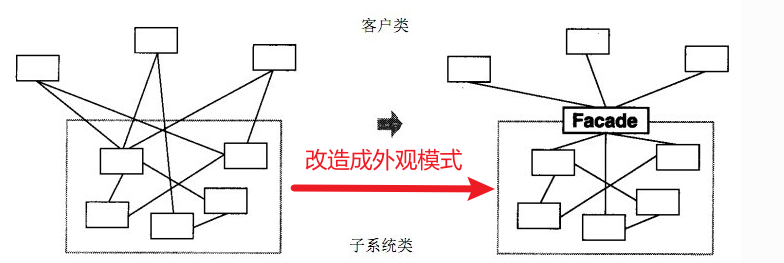

外观模式结构：

* 外观（Facade）角色：为多个子系统对外提供一个共同的接口
* 子系统（Sub System）角色：实现系统的部分功能，客户可以通过外观角色访问它

外观模式好处：

* 降低了子系统与客户端之间的耦合度，使得子系统的变化不会影响调用它的客户类
* 对客户屏蔽了子系统组件，减少了客户处理的对象数目，并使得子系统使用起来更加容易

外观模式缺点：

* 不符合开闭原则，修改很麻烦

使用场景：

* 对分层结构系统构建时，使用外观模式定义子系统中每层的入口点可以简化子系统之间的依赖关系
* 当一个复杂系统的子系统很多时，外观模式可以为系统设计一个简单的接口供外界访问
* 当客户端与多个子系统之间存在很大的联系时，引入外观模式可将它们分离，从而提高子系统的独立性和可移植性

##### 5.5.2 案例

【例】智能家电控制

>  小明的爷爷已经60岁了，一个人在家生活：每次都需要打开灯、打开电视、打开空调；睡觉时关闭灯、关闭电视、关闭空调；操作起来都比较麻烦。所以小明给爷爷买了智能音箱，可以通过语音直接控制这些智能家电的开启和关闭。类图如下：

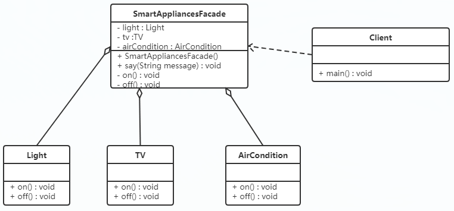

`Light`：电灯类

```java
/**
 * @Description: 电灯类
 */
public class Light {

    //开灯
    public void on() {
        System.out.println("打开电灯。。。。");
    }

    //关灯
    public void off() {
        System.out.println("关闭电灯。。。。");
    }
}
```

`TV`：

```java
public class TV {
    public void on() {
        System.out.println("打开电视机。。。。");
    }

    public void off() {
        System.out.println("关闭电视机。。。。");
    }
}
```

`AirCondition`：空调类

```java
/**
 * @Description: 空调类
 */
public class AirCondition {
    public void on() {
        System.out.println("打开空调。。。。");
    }

    public void off() {
        System.out.println("关闭空调。。。。");
    }
}
```

`SmartAppliancesFacade`：外观类，用户主要和该类对象进行交互

```java
/**
 * @Description: 外观类，用户主要和该类对象进行交互
 */
public class SmartAppliancesFacade {

    //聚合电灯对象，电视机对象，空调对象
    private Light light;
    private TV tv;
    private AirCondition airCondition;

    public SmartAppliancesFacade() {
        light = new Light();
        tv = new TV();
        airCondition = new AirCondition();
    }

    //通过语言控制
    public void say(String message) {
        if(message.contains("打开")) {
            on();
        } else if(message.contains("关闭")) {
            off();
        } else {
            System.out.println("我还听不懂你说的！！！");
        }
    }

    //一键打开功能
    private void on() {
        light.on();
        tv.on();
        airCondition.on();
    }

    //一键关闭功能
    private void off() {
        light.off();
        tv.off();
        airCondition.off();
    }
}
```

`Client`：测试

```java
public class Client {
    public static void main(String[] args) {
        //创建智能音箱对象
        SmartAppliancesFacade facade = new SmartAppliancesFacade();
        //控制家电
        facade.say("打开家电");

        System.out.println("==================");

        facade.say("关闭家电");
        /*
        打开电灯。。。。
        打开电视机。。。。
        打开空调。。。。
        ==================
        关闭电灯。。。。
        关闭电视机。。。。
        关闭空调。。。。
         */
    }
}
```

##### 5.5.3 `JDK`源码中的应用

使用tomcat作为web容器时，接收浏览器发送过来的请求，tomcat会将请求信息封装成ServletRequest对象，如下图①处对象。但是大家想想ServletRequest是一个接口，它还有一个子接口HttpServletRequest，而request对象肯定是一个HttpServletRequest对象的子实现类对象，到底是哪个类的对象呢？通过输出request对象，就会发现是一个名为RequestFacade的类的对象

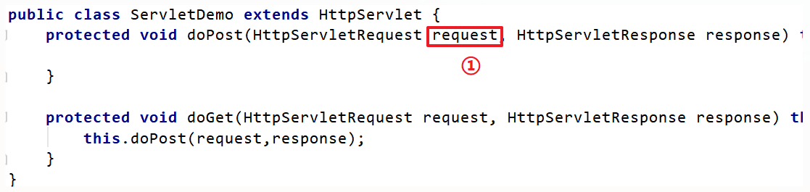

RequestFacade类就使用了外观模式。先看结构图：

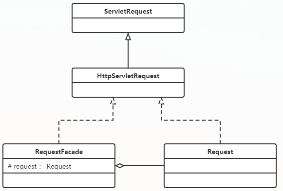

**为什么在此处使用外观模式呢？**

- 定义 RequestFacade 类，分别实现 ServletRequest ，同时定义私有成员变量 Request ，并且方法的实现调用 Request  的实现。然后，将 RequestFacade上转为 ServletRequest  传给 servlet 的 service 方法，这样即使在 servlet 中被下转为 RequestFacade ，也不能访问私有成员变量对象中的方法。既用了 Request ，又能防止其中方法被不合理的访问

##### 5.5.4 `GPT`补充

外观模式（Facade Pattern） ：

- 是一种结构型设计模式，它提供了一个统一的接口，用来访问子系统中的一群接口。外观模式定义了一个高层接口，使得子系统更容易使用

外观模式的优点：

- 简化了接口：提供一个统一的接口，简化了子系统的使用
- 减少了客户端和子系统之间的依赖：通过引入外观模式，可以将客户端和子系统之间的依赖减少到最低
- 提高子系统的灵活性：内部子系统的更改不会影响到外部的客户端，因为外部依赖的是外观类，而不是子系统本身

外观模式的缺点：

- 可能会造成新的抽象层的复杂性：如果不是特别必要，引入外观模式可能会增加系统的复杂性
- 不符合开闭原则：增加新的子系统可能需要修改外观类的接口

案例：

- 假设有一个家庭影院系统，包含多个子系统：DVD 播放器、投影仪、音响等。希望通过一个外观类来简化对这些子系统的操作

```java
// 子系统类：DVD播放器
class DVDPlayer {
    public void on() {
        System.out.println("DVD Player is ON.");
    }

    public void play() {
        System.out.println("DVD Player is playing.");
    }

    public void off() {
        System.out.println("DVD Player is OFF.");
    }
}

// 子系统类：投影仪
class Projector {
    public void on() {
        System.out.println("Projector is ON.");
    }

    public void wideScreenMode() {
        System.out.println("Projector is in wide screen mode.");
    }

    public void off() {
        System.out.println("Projector is OFF.");
    }
}

// 子系统类：音响
class SoundSystem {
    public void on() {
        System.out.println("Sound System is ON.");
    }

    public void setVolume(int level) {
        System.out.println("Sound System volume set to " + level);
    }

    public void off() {
        System.out.println("Sound System is OFF.");
    }
}

// 外观类：家庭影院外观
class HomeTheaterFacade {
    private DVDPlayer dvdPlayer;
    private Projector projector;
    private SoundSystem soundSystem;

    public HomeTheaterFacade(DVDPlayer dvd, Projector projector, SoundSystem soundSystem) {
        this.dvdPlayer = dvd;
        this.projector = projector;
        this.soundSystem = soundSystem;
    }

    public void watchMovie() {
        System.out.println("Get ready to watch a movie...");
        projector.on();
        projector.wideScreenMode();
        soundSystem.on();
        soundSystem.setVolume(5);
        dvdPlayer.on();
        dvdPlayer.play();
    }

    public void endMovie() {
        System.out.println("Shutting down the home theater...");
        dvdPlayer.off();
        projector.off();
        soundSystem.off();
    }
}

// 客户端代码
public class FacadePatternDemo {
    public static void main(String[] args) {
        // 创建子系统对象
        DVDPlayer dvd = new DVDPlayer();
        Projector projector = new Projector();
        SoundSystem soundSystem = new SoundSystem();

        // 创建外观对象
        HomeTheaterFacade homeTheater = new HomeTheaterFacade(dvd, projector, soundSystem);

        // 使用外观对象来操作子系统
        homeTheater.watchMovie(); // 准备看电影
        System.out.println(); // 分隔符
        homeTheater.endMovie(); // 结束电影
    }
}
```

代码解析：

- 子系统类：`DVDPlayer`、`Projector` 和 `SoundSystem` 分别代表家庭影院的不同子系统
- 外观类：`HomeTheaterFacade` 封装了这些子系统，并提供了一个简化的接口来控制它们
- 客户端代码：通过使用 `HomeTheaterFacade` 类，客户端可以轻松地启动和关闭家庭影院系统，而无需了解各个子系统的内部工作细节
- 这种设计大大简化了客户端代码，同时使子系统内部的更改不会影响到客户端的代码

### 5.6 组合模式

##### 5.6.1 简介

下图可以看做是一个文件系统，对于这样的结构称之为树形结构。在树形结构中可以通过调用某个方法来遍历整个树，当找到某个叶子节点后，就可以对叶子节点进行相关的操作。可以将这棵树理解成一个大的容器，容器里面包含很多的成员对象，这些成员对象即可是容器对象也可以是叶子对象。但是由于容器对象和叶子对象在功能上面的区别，使得在使用的过程中必须要区分容器对象和叶子对象，但是这样就会给客户带来不必要的麻烦，作为客户而已，它始终希望能够一致的对待容器对象和叶子对象


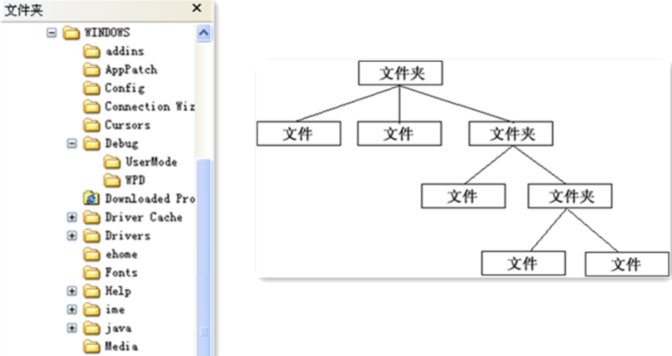

组合模式：

- 又名部分整体模式，是用于把一组相似的对象当作一个单一的对象。组合模式依据树形结构来组合对象，用来表示部分以及整体层次。这种类型的设计模式属于结构型模式，它创建了对象组的树形结构

组合模式结构：

* 抽象根节点（Component）：定义系统各层次对象的共有方法和属性，可以预先定义一些默认行为和属性
* 树枝节点（Composite）：定义树枝节点的行为，存储子节点，组合树枝节点和叶子节点形成一个树形结构
* 叶子节点（Leaf）：叶子节点对象，其下再无分支，是系统层次遍历的最小单位

##### 5.6.2 案例

【例】软件菜单

> 如下图，在访问别的一些管理系统时，经常可以看到类似的菜单。一个菜单可以包含菜单项（菜单项是指不再包含其他内容的菜单条目），也可以包含带有其他菜单项的菜单，因此使用组合模式描述菜单就很恰当，我们的需求是针对一个菜单，打印出其包含的所有菜单以及菜单项的名称

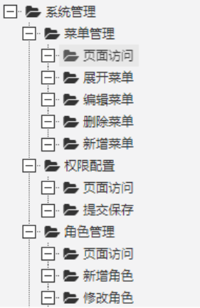


案例类图：

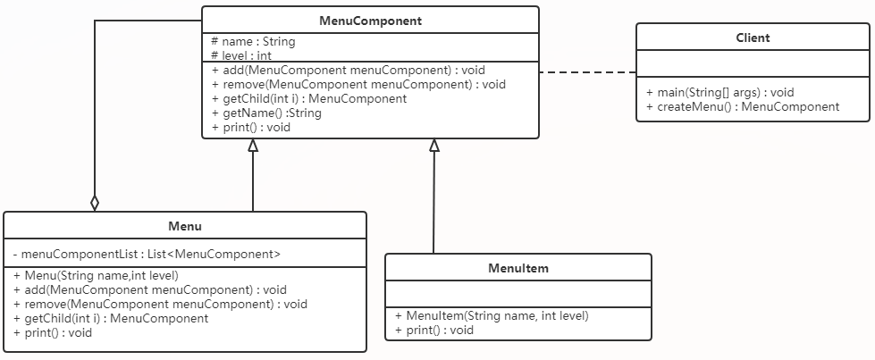

实现：

- 不管是菜单还是菜单项，都应该继承自统一的接口，这里姑且将这个统一的接口称为菜单组件

`MenuComponent`：菜单组件（属于抽象根节点）

```java
/**
 * @Description: 菜单组件 ： 属于抽象根节点
 */
public abstract class MenuComponent {
    //菜单组件的名称
    protected String name;
    //菜单组件的层级
    protected int level;

    //添加子菜单
    public void add(MenuComponent menuComponent) {
        throw new UnsupportedOperationException();
    }

    //移除子菜单
    public void remove(MenuComponent menuComponent) {
        throw new UnsupportedOperationException();
    }

    //获取指定的子菜单
    public MenuComponent getChild(int index) {
        throw new UnsupportedOperationException();
    }

    //获取菜单或者菜单项的名称
    public String getName() {
        return name;
    }

    //打印菜单名称的方法（包含子菜单和字菜单项）
    public abstract void print();
}
```

`Menu`：菜单类（属于树枝节点）

```java
import java.util.ArrayList;
import java.util.List;
/**
 * @Description: 菜单类  ： 属于树枝节点
 */
public class Menu extends MenuComponent {

    //菜单可以有多个子菜单或者子菜单项
    private List<MenuComponent> menuComponentList = new ArrayList<MenuComponent>();

    //构造方法
    public Menu(String name,int level) {
        this.name = name;
        this.level = level;
    }

    @Override
    public void add(MenuComponent menuComponent) {
        menuComponentList.add(menuComponent);
    }

    @Override
    public void remove(MenuComponent menuComponent) {
        menuComponentList.remove(menuComponent);
    }

    @Override
    public MenuComponent getChild(int index) {
        return menuComponentList.get(index);
    }

    @Override
    public void print() {
        //打印菜单名称
        for(int i = 0; i < level; i++) {
            System.out.print("--");
        }
        System.out.println(name);

        //打印子菜单或者子菜单项名称
        for (MenuComponent component : menuComponentList) {
            component.print();
        }
    }
}
```

`MenuItem`：菜单项类（属于叶子节点）

```java
/**
 * @Description: 菜单项类 ： 属于叶子节点
 */
public class MenuItem extends MenuComponent {

    public MenuItem(String name,int level) {
        this.name = name;
        this.level = level;
    }

    public void print() {
        //打印菜单项的名称
        for(int i = 0; i < level; i++) {
            System.out.print("--");
        }
        System.out.println(name);
    }
}
```

`Client`：测试

```java
public class Client {
    public static void main(String[] args) {
        //创建菜单树
        MenuComponent menu1 = new Menu("菜单管理",2);
        menu1.add(new MenuItem("页面访问",3));
        menu1.add(new MenuItem("展开菜单",3));
        menu1.add(new MenuItem("编辑菜单",3));
        menu1.add(new MenuItem("删除菜单",3));
        menu1.add(new MenuItem("新增菜单",3));

        MenuComponent menu2 = new Menu("权限管理",2);
        menu2.add(new MenuItem("页面访问",3));
        menu2.add(new MenuItem("提交保存",3));

        MenuComponent menu3 = new Menu("角色管理",2);
        menu3.add(new MenuItem("页面访问",3));
        menu3.add(new MenuItem("新增角色",3));
        menu3.add(new MenuItem("修改角色",3));

        //创建一级菜单
        MenuComponent component = new Menu("系统管理",1);
        //将二级菜单添加到一级菜单中
        component.add(menu1);
        component.add(menu2);
        component.add(menu3);


        //打印菜单名称(如果有子菜单一块打印)
        component.print();
        /*
        --系统管理
        ----菜单管理
        ------页面访问
        ------展开菜单
        ------编辑菜单
        ------删除菜单
        ------新增菜单
        ----权限管理
        ------页面访问
        ------提交保存
        ----角色管理
        ------页面访问
        ------新增角色
        ------修改角色
         */
    }
}
```

##### 5.6.3 总结

组合模式的分类：

- 在使用组合模式时，根据抽象构件类的定义形式，可将组合模式分为透明组合模式和安全组合模式两种形式


* 透明组合模式：透明组合模式中，抽象根节点角色中声明了所有用于管理成员对象的方法，比如在示例中 `MenuComponent` 声明了 `add`、`remove` 、`getChild` 方法，这样做的好处是确保所有的构件类都有相同的接口。透明组合模式也是组合模式的标准形式。透明组合模式的缺点是不够安全，因为叶子对象和容器对象在本质上是有区别的，叶子对象不可能有下一个层次的对象，即不可能包含成员对象，因此为其提供 add()、remove() 等方法是没有意义的，这在编译阶段不会出错，但在运行阶段如果调用这些方法可能会出错（如果没有提供相应的错误处理代码）

* 安全组合模式：在安全组合模式中，在抽象构件角色中没有声明任何用于管理成员对象的方法，而是在树枝节点 `Menu` 类中声明并实现这些方法。安全组合模式的缺点是不够透明，因为叶子构件和容器构件具有不同的方法，且容器构件中那些用于管理成员对象的方法没有在抽象构件类中定义，因此客户端不能完全针对抽象编程，必须有区别地对待叶子构件和容器构件

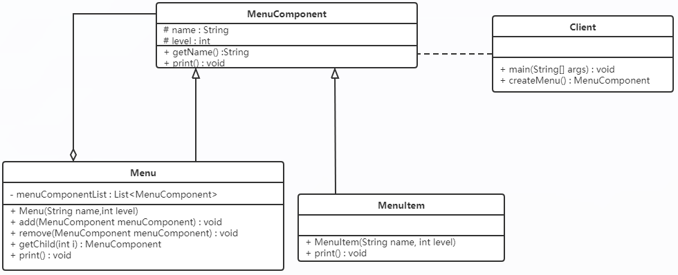

组合模式的优点：

* 组合模式可以清楚地定义分层次的复杂对象，表示对象的全部或部分层次，它让客户端忽略了层次的差异，方便对整个层次结构进行控制
* 客户端可以一致地使用一个组合结构或其中单个对象，不必关心处理的是单个对象还是整个组合结构，简化了客户端代码
* 在组合模式中增加新的树枝节点和叶子节点都很方便，无须对现有类库进行任何修改，符合“开闭原则”
* 组合模式为树形结构的面向对象实现提供了一种灵活的解决方案，通过叶子节点和树枝节点的递归组合，可以形成复杂的树形结构，但对树形结构的控制却非常简单

组合模式的使用场景：

- 组合模式正是应树形结构而生，所以组合模式的使用场景就是出现树形结构的地方。比如：文件目录显示，多级目录呈现等树形结构数据的操作

##### 5.6.4 `GPT`补充

组合模式：

- 组合模式（Composite Pattern）是一种结构型设计模式，它允许你将对象组合成树形结构来表示“部分-整体”的层次结构。组合模式使得用户可以以一致的方式对待单个对象和对象的组合

关键思想：

- 组合模式的关键思想是通过递归的组合关系来实现对象的层次结构。使用组合模式后，客户代码可以统一处理简单对象（叶子节点）和复杂的组合对象（容器），而不需要知道它们的具体类型

主要角色：

1. 组件（Component）：组件是组合对象和叶子对象的共同接口，定义了接口中常见的操作。可以是抽象类或接口
2. 叶子节点（Leaf）：叶子节点表示树的末端对象，不包含子对象。叶子节点实现组件接口中的操作
3. 容器（Composite）：容器对象包含子对象，并且定义了对其子对象的操作（如增加、删除）。它实现了组件接口，并且通常会在接口的方法中递归调用子对象的方法
4. 客户端（Client）：客户端通过组件接口与对象树进行交互。由于所有对象都实现了组件接口，客户端无需区分操作的是叶子节点还是组合节点

使用场景：

- 需要表示对象的部分-整体层次结构时，如文件系统、GUI窗口系统等
- 希望客户端可以忽略组合对象和单个对象的差异，统一处理它们时

举例：

- 考虑一个文件系统，其中有文件和文件夹。文件是叶子节点，文件夹可以包含文件或其他文件夹。通过组合模式，客户端可以统一操作文件和文件夹，而无需关注它们的具体类型

```java
// 组件接口
interface FileSystemComponent {
    void display();
}

// 叶子节点：文件
class File implements FileSystemComponent {
    private String name;

    public File(String name) {
        this.name = name;
    }

    @Override
    public void display() {
        System.out.println(name);
    }
}

// 容器：文件夹
class Folder implements FileSystemComponent {
    private String name;
    private List<FileSystemComponent> components = new ArrayList<>();

    public Folder(String name) {
        this.name = name;
    }

    public void addComponent(FileSystemComponent component) {
        components.add(component);
    }

    @Override
    public void display() {
        System.out.println(name);
        for (FileSystemComponent component : components) {
            component.display();
        }
    }
}

// 客户端
public class Main {
    public static void main(String[] args) {
        FileSystemComponent file1 = new File("File1.txt");
        FileSystemComponent file2 = new File("File2.txt");

        Folder folder1 = new Folder("Folder1");
        folder1.addComponent(file1);

        Folder folder2 = new Folder("Folder2");
        folder2.addComponent(file2);
        folder2.addComponent(folder1);

        folder2.display();
    }
}
```

在这个例子中，`Folder`类可以包含其他`FileSystemComponent`对象（包括文件和文件夹），并且客户端可以通过调用`display()`方法来遍历整个文件系统，无需关心组件是文件还是文件夹

### 5.7 享元模式

##### 5.7.1 简介

享元模式：

- 运用共享技术来有效地支持大量细粒度对象的复用。它通过共享已经存在的对象来大幅度减少需要创建的对象数量、避免大量相似对象的开销，从而提高系统资源的利用率


享元模式结构：

- 享元（Flyweight ）模式中存在以下两种状态：

  1. 内部状态，即不会随着环境的改变而改变的可共享部分
  1. 外部状态，指随环境改变而改变的不可以共享的部分。享元模式的实现要领就是区分应用中的这两种状态，并将外部状态外部化


- 享元模式主要有以下角色：

  * 抽象享元角色（Flyweight）：通常是一个接口或抽象类，在抽象享元类中声明了具体享元类公共的方法，这些方法可以向外界提供享元对象的内部数据（内部状态），同时也可以通过这些方法来设置外部数据（外部状态）

  * 具体享元（Concrete Flyweight）角色 ：它实现了抽象享元类，称为享元对象；在具体享元类中为内部状态提供了存储空间。通常可以结合单例模式来设计具体享元类，为每一个具体享元类提供唯一的享元对象

  * 非享元（Unsharable Flyweight)角色 ：并不是所有的抽象享元类的子类都需要被共享，不能被共享的子类可设计为非共享具体享元类；当需要一个非共享具体享元类的对象时可以直接通过实例化创建

  * 享元工厂（Flyweight Factory）角色 ：负责创建和管理享元角色。当客户对象请求一个享元对象时，享元工厂检査系统中是否存在符合要求的享元对象，如果存在则提供给客户；如果不存在的话，则创建一个新的享元对象


享元模式优缺点：

- 优点：

  - 极大减少内存中相似或相同对象数量，节约系统资源，提供系统性能

  - 享元模式中的外部状态相对独立，且不影响内部状态


- 缺点：
  - 为了使对象可以共享，需要将享元对象的部分状态外部化，分离内部状态和外部状态，使程序逻辑复杂

使用场景：

- 一个系统有大量相同或者相似的对象，造成内存的大量耗费
- 对象的大部分状态都可以外部化，可以将这些外部状态传入对象中
- 在使用享元模式时需要维护一个存储享元对象的享元池，而这需要耗费一定的系统资源，因此，应当在需要多次重复使用享元对象时才值得使用享元模式

##### 5.7.2 案例

【例】俄罗斯方块

> 下面的图片是众所周知的俄罗斯方块中的一个个方块，如果在俄罗斯方块这个游戏中，每个不同的方块都是一个实例对象，这些对象就要占用很多的内存空间，下面利用享元模式进行实现。俄罗斯方块中一般有如下的几种图形，这几种图形在游戏中会重复出现，但是相同图形的颜色（外部状态）可能会发生变化

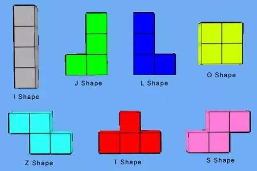

类图：

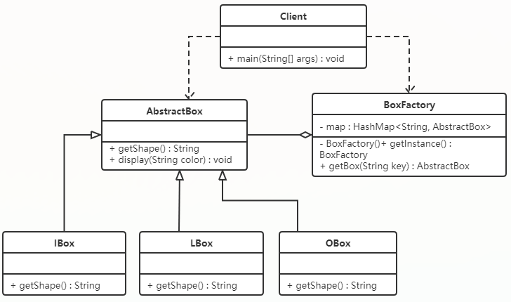

代码如下：

- 俄罗斯方块有不同的形状，可以对这些形状向上抽取出`AbstractBox`，用来定义共性的属性和行为

`AbstractBox`：抽象享元角色

```java
/**
 * @Description: 抽象享元角色
 * 俄罗斯方块有不同的形状，对这些形状向上抽取出AbstractBox，用来定义共性的属性和行为。
 */
public abstract class AbstractBox {

    //获取图形的方法
    public abstract String getShape();

    //显示图形及颜色
    public void display(String color) {
        System.out.println("方块形状：" + getShape() + ", 颜色：" + color);
    }
}
```

`IBox`：I图形类(具体享元角色)

```java
/**
 * @Description: I图形类(具体享元角色)
 */
public class IBox extends AbstractBox {

    public String getShape() {
        return "I";
    }
}
```

`LBox`： L图形类(具体享元角色)

```java
/**
 * @Description: L图形类(具体享元角色)
 */
public class LBox extends AbstractBox {

    public String getShape() {
        return "L";
    }
}
```

`OBox`：O图形类(具体享元角色)

```java
/**
 * @Description: O图形类(具体享元角色)
 */
public class OBox extends AbstractBox {

    public String getShape() {
        return "O";
    }
}
```

`BoxFactory`：工厂类，将该类设计为单例

```java
/**
 * 提供一个工厂类（BoxFactory），用来管理享元对象（也就是AbstractBox子类对象），该工厂类对象只需要一个，所以可以使用单例模式。并给工厂类提供一个获取形状的方法
 * @Description: 工厂类，将该类设计为单例
 */
public class BoxFactory {

    private HashMap<String,AbstractBox> map;

    //在构造方法中进行初始化操作
    private BoxFactory() {
        map = new HashMap<String, AbstractBox>();
        map.put("I",new IBox());
        map.put("L",new LBox());
        map.put("O",new OBox());
    }

    //提供一个方法获取该工厂类对象
    public static BoxFactory getInstance() {
        return factory;
    }

    private static BoxFactory factory = new BoxFactory();

    //根据名称获取图形对象
    public AbstractBox getShape(String name) {
        return map.get(name);
    }
}
```

`Client`：测试

```java
public class Client {
    public static void main(String[] args) {
        //获取I图形对象
        AbstractBox box1 = BoxFactory.getInstance().getShape("I");
        box1.display("灰色");

        //获取L图形对象
        AbstractBox box2 = BoxFactory.getInstance().getShape("L");
        box2.display("绿色");

        //获取O图形对象
        AbstractBox box3 = BoxFactory.getInstance().getShape("O");
        box3.display("灰色");

        //获取O图形对象
        AbstractBox box4 = BoxFactory.getInstance().getShape("O");
        box4.display("红色");

        System.out.println("两次获取到的O图形对象是否是同一个对象：" + (box3 == box4));
        /*
        方块形状：I, 颜色：灰色
        方块形状：L, 颜色：绿色
        方块形状：O, 颜色：灰色
        方块形状：O, 颜色：红色
        两次获取到的O图形对象是否是同一个对象：true
         */
    }
}
```

##### 5.7.3  `JDK`源码中的应用

Integer类使用了享元模式。先看下面的例子：

```java
public class Demo {
    public static void main(String[] args) {
        Integer i1 = 127;
        Integer i2 = 127;

        System.out.println("i1和i2对象是否是同一个对象？" + (i1 == i2));

        Integer i3 = 128;
        Integer i4 = 128;

        System.out.println("i3和i4对象是否是同一个对象？" + (i3 == i4));
    }
}
```

运行上面代码，结果如下：

```
i1和i2对象是否是同一个对象？true
i3和i4对象是否是同一个对象？false
```

为什么第一个输出语句输出的是true，第二个输出语句输出的是false？通过反编译软件进行反编译，代码如下：

```java
public class Demo {
    public static void main(String[] args) {
        Integer i1 = Integer.valueOf((int)127);
        Integer i2 Integer.valueOf((int)127);
        System.out.println((String)new StringBuilder().append((String)"i1\u548ci2\u5bf9\u8c61\u662f\u5426\u662f\u540c\u4e00\u4e2a\u5bf9\u8c61\uff1f").append((boolean)(i1 == i2)).toString());
        Integer i3 = Integer.valueOf((int)128);
        Integer i4 = Integer.valueOf((int)128);
        System.out.println((String)new StringBuilder().append((String)"i3\u548ci4\u5bf9\u8c61\u662f\u5426\u662f\u540c\u4e00\u4e2a\u5bf9\u8c61\uff1f").append((boolean)(i3 == i4)).toString());
    }
}
```

上面代码可以看到，直接给Integer类型的变量赋值基本数据类型数据的操作底层使用的是 `valueOf()` ，所以只需要看该方法即可

```java
public final class Integer extends Number implements Comparable<Integer> {
    
	public static Integer valueOf(int i) {
        if (i >= IntegerCache.low && i <= IntegerCache.high)
            return IntegerCache.cache[i + (-IntegerCache.low)];
        return new Integer(i);
    }
    
    private static class IntegerCache {
        static final int low = -128;
        static final int high;
        static final Integer cache[];

        static {
            int h = 127;
            String integerCacheHighPropValue =
                sun.misc.VM.getSavedProperty("java.lang.Integer.IntegerCache.high");
            if (integerCacheHighPropValue != null) {
                try {
                    int i = parseInt(integerCacheHighPropValue);
                    i = Math.max(i, 127);
                    // Maximum array size is Integer.MAX_VALUE
                    h = Math.min(i, Integer.MAX_VALUE - (-low) -1);
                } catch( NumberFormatException nfe) {
                }
            }
            high = h;
            cache = new Integer[(high - low) + 1];
            int j = low;
            for(int k = 0; k < cache.length; k++)
                cache[k] = new Integer(j++);
            // range [-128, 127] must be interned (JLS7 5.1.7)
            assert IntegerCache.high >= 127;
        }

        private IntegerCache() {}
    }
}
```

可以看到 `Integer` 默认先创建并缓存 `-128 ~ 127` 之间数的 `Integer` 对象，当调用 `valueOf` 时如果参数在 `-128 ~ 127` 之间则计算下标并从缓存中返回，否则创建一个新的 `Integer` 对象

##### 5.7.4 `GPT`补充

享元模式：

- 一种结构型设计模式，它通过共享对象来减少内存的消耗。该模式运用共享技术有效地支持大量细粒度的对象。特别是在系统中需要大量相似对象时，使用享元模式可以显著减少内存的使用，提高性能

享元模式的主要思想：

- 两种状态：
  1. 内部状态（Intrinsic State）：不随环境改变的共享部分
  2. 外部状态（Extrinsic State）：随环境变化而变化，不可以共享的部分

- 享元模式通过将外部状态从对象中剥离，使得同样的对象可以在不同的环境下复用，而不需要每次都创建新的对象。这样就达到了节省内存的目的

享元模式的优点：

- 减少内存消耗
- 提高性能，适合用于需要大量相似对象的场景

享元模式的缺点：

- 使得系统更加复杂
- 使得对象的维护变得更加困难，尤其是当外部状态变得复杂时

示例：

- 模拟一个绘制不同颜色和形状的圆圈对象

 `Shape`：享元接口

```java
// Shape.java
public interface Shape {
    void draw();
}
```

`Circle`：创建实现该接口的具体类

```java
// Circle.java
// 在 Circle 类中，color 是共享的内部状态，而 `x`、`y` 和 `radius` 是外部状态，它们是随着对象的使用而变化的
public class Circle implements Shape {
    private String color;
    private int x;
    private int y;
    private int radius;

    public Circle(String color) {
        this.color = color;
    }

    public void setX(int x) {
        this.x = x;
    }

    public void setY(int y) {
        this.y = y;
    }

    public void setRadius(int radius) {
        this.radius = radius;
    }

    @Override
    public void draw() {
        System.out.println("Circle: Draw() [Color : " + color + ", x : " + x + ", y :" + y + ", radius :" + radius);
    }
}
```

`ShapeFactory`：工厂类，用于创建和管理享元对象

```java
// ShapeFactory.java
// `ShapeFactory` 类通过管理现有的 `Circle` 对象，确保相同颜色的 `Circle` 对象只被创建一次
import java.util.HashMap;

public class ShapeFactory {
    private static final HashMap<String, Shape> circleMap = new HashMap<>();

    public static Shape getCircle(String color) {
        Circle circle = (Circle) circleMap.get(color);

        if (circle == null) {
            circle = new Circle(color);
            circleMap.put(color, circle);
            System.out.println("Creating circle of color : " + color);
        }
        return circle;
    }
}
```

`FlyweightPatternDemo`：使用工厂类来获取对象并设置外部状态

```java
// FlyweightPatternDemo.java
// 工厂类会输出它创建的颜色对象，而相同颜色的 `Circle` 对象不会被重复创建
// 通过共享相同颜色的 `Circle` 对象，避免了重复创建相同对象，从而节省了内存
public class FlyweightPatternDemo {
    private static final String[] colors = {"Red", "Green", "Blue", "White", "Black"};

    public static void main(String[] args) {
        for (int i = 0; i < 20; ++i) {
            Circle circle = (Circle) ShapeFactory.getCircle(getRandomColor());
            circle.setX(getRandomX());
            circle.setY(getRandomY());
            circle.setRadius(100);
            circle.draw();
        }
    }

    private static String getRandomColor() {
        return colors[(int)(Math.random() * colors.length)];
    }

    private static int getRandomX() {
        return (int)(Math.random() * 100);
    }

    private static int getRandomY() {
        return (int)(Math.random() * 100);
    }
}
```

输出结果：

```
Creating circle of color : Red
Circle: Draw() [Color : Red, x : 50, y :70, radius :100]
Creating circle of color : Green
Circle: Draw() [Color : Green, x : 60, y :80, radius :100]
Circle: Draw() [Color : Red, x : 20, y :90, radius :100]
...
```

总结：

- 享元模式通过共享相似对象来减少内存消耗，特别适用于需要大量相似对象的场景
- 使用享元模式时，需要区分内部状态（共享）和外部状态（非共享），并通过工厂类来管理共享对象的创建与复用

## 6.行为型模式

行为型模式用于描述程序在运行时复杂的流程控制，即描述多个类或对象之间怎样相互协作共同完成单个对象都无法单独完成的任务，它涉及算法与对象间职责的分配

行为型模式分为类行为模式和对象行为模式，前者采用继承机制来在类间分派行为，后者采用组合或聚合在对象间分配行为。由于组合关系或聚合关系比继承关系耦合度低，满足“合成复用原则”，所以对象行为模式比类行为模式具有更大的灵活性

行为型模式分为：

* 模板方法模式
* 策略模式
* 命令模式
* 职责链模式
* 状态模式
* 观察者模式
* 中介者模式
* 迭代器模式
* 访问者模式
* 备忘录模式
* 解释器模式

以上 11 种行为型模式，除了模板方法模式和解释器模式是类行为型模式，其他的全部属于对象行为型模式

### 6.1 模板方法模式

##### 6.1.1 简介

introduce：

- 在面向对象程序设计过程中，程序员常常会遇到这种情况：设计一个系统时知道了算法所需的关键步骤，而且确定了这些步骤的执行顺序，但某些步骤的具体实现还未知，或者说某些步骤的实现与具体的环境相关
- 例如，去银行办理业务一般要经过以下4个流程：取号、排队、办理具体业务、对银行工作人员进行评分等，其中取号、排队和对银行工作人员进行评分的业务对每个客户是一样的，可以在父类中实现，但是办理具体业务却因人而异，它可能是存款、取款或者转账等，可以延迟到子类中实现

模板方法（Template Method）模式：

- 定义一个操作中的算法骨架，而将算法的一些步骤延迟到子类中，使得子类可以不改变该算法结构的情况下重定义该算法的某些特定步骤


模板方法模式包含以下主要角色：

* 抽象类（Abstract Class）：负责给出一个算法的轮廓和骨架。由一个模板方法和若干个基本方法构成

  * 模板方法：定义了算法的骨架，按某种顺序调用其包含的基本方法

  * 基本方法：是实现算法各个步骤的方法，是模板方法的组成部分。基本方法又可以分为三种：

    * 抽象方法(Abstract Method) ：一个抽象方法由抽象类声明、由其具体子类实现

    * 具体方法(Concrete Method) ：一个具体方法由一个抽象类或具体类声明并实现，其子类可以进行覆盖也可以直接继承

    * 钩子方法(Hook Method) ：在抽象类中已经实现，包括用于判断的逻辑方法和需要子类重写的空方法两种。一般钩子方法是用于判断的逻辑方法，这类方法名一般为isXxx，返回值类型为boolean类型

* 具体子类（Concrete Class）：实现抽象类中所定义的抽象方法和钩子方法，它们是一个顶级逻辑的组成步骤

优缺点：

- 优点：

  * 提高代码复用性：将相同部分的代码放在抽象的父类中，而将不同的代码放入不同的子类中

  * 实现了反向控制：通过一个父类调用其子类的操作，通过对子类的具体实现扩展不同的行为，实现了反向控制 ，并符合“开闭原则”

- 缺点：

  * 对每个不同的实现都需要定义一个子类，这会导致类的个数增加，系统更加庞大，设计也更加抽象

  * 父类中的抽象方法由子类实现，子类执行的结果会影响父类的结果，这导致一种反向的控制结构，它提高了代码阅读的难度


适用场景：

* 算法的整体步骤很固定，但其中个别部分易变时，这时候可以使用模板方法模式，将容易变的部分抽象出来，供子类实现
* 需要通过子类来决定父类算法中某个步骤是否执行，实现子类对父类的反向控制


##### 6.1.2 案例

【例】炒菜

> 炒菜的步骤是固定的，分为倒油、热油、倒蔬菜、倒调料品、翻炒等步骤。现通过模板方法模式来用代码模拟。类图如下：

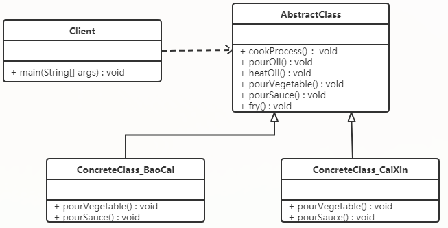

`AbstractClass`：抽象类（定义模板方法和基本方法）

```java
/**
 * @Description: 抽象类（定义模板方法和基本方法）
 */
public abstract class AbstractClass {

    //模板方法定义（利用final修饰，子类不能重写）
    public final void cookProcess() {
        pourOil();
        heatOil();
        pourVegetable();
        pourSauce();
        fry();
    }

    public void pourOil() {
        System.out.println("倒油");
    }

    //第二步：热油是一样的，所以直接实现
    public void heatOil() {
        System.out.println("热油");
    }

    //第三步：倒蔬菜是不一样的（一个下包菜，一个是下菜心）
    public abstract void pourVegetable();

    //第四步：倒调味料是不一样
    public abstract void pourSauce();


    //第五步：翻炒是一样的，所以直接实现
    public void fry(){
        System.out.println("炒啊炒啊炒到熟啊");
    }
}
```

`ConcreteClass_BaoCai`：炒包菜类

```java
/**
 * @Description: 炒包菜类
 */
public class ConcreteClass_BaoCai extends AbstractClass {

    public void pourVegetable() {
        System.out.println("下锅的蔬菜是包菜");
    }

    public void pourSauce() {
        System.out.println("下锅的酱料是辣椒");
    }
}
```

`ConcreteClass_CaiXin`：炒菜心类

```java
/**
 * @Description: 炒菜心类
 */
public class ConcreteClass_CaiXin extends AbstractClass {

    public void pourVegetable() {
        System.out.println("下锅的蔬菜是菜心");
    }

    public void pourSauce() {
        System.out.println("下锅的酱料是蒜蓉");
    }
}
```

`Client`：测试

```java
public class Client {
    public static void main(String[] args) {
        //炒包菜
        //创建对象
        ConcreteClass_BaoCai baoCai = new ConcreteClass_BaoCai();
        //调用炒菜的功能
        baoCai.cookProcess();
        /*
        倒油
        热油
        下锅的蔬菜是包菜
        下锅的酱料是辣椒
        炒啊炒啊炒到熟啊
         */
    }
}
```

注意：为防止恶意操作，一般模板方法都加上 final 关键词

##### 6.1.3 `JDK`源码中的应用

InputStream类使用了模板方法模式。在InputStream类中定义了多个 `read()` 方法（重载方法），如下：

```java
public abstract class InputStream implements Closeable {
    //抽象方法，要求子类必须重写
    public abstract int read() throws IOException;

    public int read(byte b[]) throws IOException {
        return read(b, 0, b.length);
    }

    public int read(byte b[], int off, int len) throws IOException {
        if (b == null) {
            throw new NullPointerException();
        } else if (off < 0 || len < 0 || len > b.length - off) {
            throw new IndexOutOfBoundsException();
        } else if (len == 0) {
            return 0;
        }

        int c = read(); //调用了无参的read方法，该方法是每次读取一个字节数据
        if (c == -1) {
            return -1;
        }
        b[off] = (byte)c;

        int i = 1;
        try {
            for (; i < len ; i++) {
                c = read();
                if (c == -1) {
                    break;
                }
                b[off + i] = (byte)c;
            }
        } catch (IOException ee) {
        }
        return i;
    }
}
```

从上面代码可以看到，无参的 `read()` 方法是抽象方法，要求子类必须实现。而 `read(byte b[])` 方法调用了 `read(byte b[], int off, int len)` 方法，所以在此处重点看的方法是带三个参数的方法

在该方法中第18行、27行，可以看到调用了无参的抽象的 `read()` 方法

总结： 在InputStream父类中已经定义好了读取一个字节数组数据的方法是每次读取一个字节，并将其存储到数组的第一个索引位置，读取len个字节数据。具体如何读取一个字节数据呢？由子类实现

##### 6.1.4 `GPT`补充

模板方法模式（Template Method Pattern）：

- 是一种行为型设计模式，它定义了一个操作的算法框架，并允许子类在不改变算法结构的情况下重新定义该算法的某些步骤。模板方法模式鼓励代码复用，减少代码重复，同时保持代码结构的灵活性

模板方法模式的主要结构：

1. 抽象类（Abstract Class）：包含一个模板方法（通常是final的），模板方法定义了算法的骨架。算法的一些步骤可以是抽象的，这些抽象步骤由子类来实现
2. 具体子类（Concrete Class）：实现抽象类中定义的抽象步骤。每个子类可以有不同的实现，但整体的算法框架保持不变

优点：

- 代码复用：模板方法模式通过将通用逻辑放在抽象类中实现代码复用，而特定逻辑则由子类实现
- 扩展性好：通过继承抽象类并重写特定方法，可以很容易地扩展或改变算法的某些步骤
- 符合开闭原则：算法结构对于扩展是开放的，而对于修改是封闭的

案例：

- 假设要制作一个简单的“制作咖啡和茶”的程序。制作饮品的步骤是一样的，只是某些具体步骤不同（比如加入不同的饮料、加不加糖等）。可以使用模板方法模式来实现这个需求

抽象类 `Beverage`：

```java
abstract class Beverage {
    
    // 模板方法，定义了算法的框架
    public final void prepareRecipe() {
        boilWater();
        brew();
        pourInCup();
        if (customerWantsCondiments()) {  // 钩子方法
            addCondiments();
        }
    }
    
    // 通用方法
    private void boilWater() {
        System.out.println("Boiling water");
    }

    private void pourInCup() {
        System.out.println("Pouring into cup");
    }
    
    // 抽象方法，由子类实现
    protected abstract void brew();
    
    protected abstract void addCondiments();
    
    // 钩子方法，子类可以重写，也可以选择不重写
    protected boolean customerWantsCondiments() {
        return true;
    }
}
```

具体类 `Tea`：

```java
class Tea extends Beverage {
    
    @Override
    protected void brew() {
        System.out.println("Steeping the tea");
    }

    @Override
    protected void addCondiments() {
        System.out.println("Adding Lemon");
    }
}
```

具体类 `Coffee`：

```java
class Coffee extends Beverage {
    
    @Override
    protected void brew() {
        System.out.println("Dripping Coffee through filter");
    }

    @Override
    protected void addCondiments() {
        System.out.println("Adding Sugar and Milk");
    }
    
    // 重写钩子方法
    @Override
    protected boolean customerWantsCondiments() {
        return true;  // 这里可以根据实际情况动态决定是否添加调料
    }
}
```

测试类：

```java
public class BeverageTest {
    public static void main(String[] args) {
        Beverage tea = new Tea();
        Beverage coffee = new Coffee();
        
        System.out.println("Making tea...");
        tea.prepareRecipe();
        
        System.out.println("\nMaking coffee...");
        coffee.prepareRecipe();
    }
}
```

运行结果：

```
Making tea...
Boiling water
Steeping the tea
Pouring into cup
Adding Lemon

Making coffee...
Boiling water
Dripping Coffee through filter
Pouring into cup
Adding Sugar and Milk
```


### 6.2 策略模式

##### 6.2.1 简介

`introduce`：

- 旅游的出行模式有很多种，可以骑自行车、可以坐汽车、可以坐火车、可以坐飞机
- 作为一个程序猿，开发需要选择一款开发工具，当然可以进行代码开发的工具有很多，可以选择Idea进行开发，也可以使用eclipse进行开发，也可以使用其他的一些开发工具

策略模式：

- 该模式定义了一系列算法，并将每个算法封装起来，使它们可以相互替换，且算法的变化不会影响使用算法的客户。策略模式属于对象行为模式，它通过对算法进行封装，把使用算法的责任和算法的实现分割开来，并委派给不同的对象对这些算法进行管理

策略模式结构：

* 抽象策略（Strategy）类：这是一个抽象角色，通常由一个接口或抽象类实现。此角色给出所有的具体策略类所需的接口
* 具体策略（Concrete Strategy）类：实现了抽象策略定义的接口，提供具体的算法实现或行为
* 环境（Context）类：持有一个策略类的引用，最终给客户端调用

优缺点：

- 优点：

  * 策略类之间可以自由切换：由于策略类都实现同一个接口，所以使它们之间可以自由切换


  * 易于扩展：增加一个新的策略只需要添加一个具体的策略类即可，基本不需要改变原有的代码，符合“开闭原则“


  * 避免使用多重条件选择语句（if else），充分体现面向对象设计思想


- 缺点：

  * 客户端必须知道所有的策略类，并自行决定使用哪一个策略类

  * 策略模式将造成产生很多策略类，可以通过使用享元模式在一定程度上减少对象的数量

使用场景

* 一个系统需要动态地在几种算法中选择一种时，可将每个算法封装到策略类中
* 一个类定义了多种行为，并且这些行为在这个类的操作中以多个条件语句的形式出现，可将每个条件分支移入它们各自的策略类中以代替这些条件语句
* 系统中各算法彼此完全独立，且要求对客户隐藏具体算法的实现细节时
* 系统要求使用算法的客户不应该知道其操作的数据时，可使用策略模式来隐藏与算法相关的数据结构
* 多个类只区别在表现行为不同，可以使用策略模式，在运行时动态选择具体要执行的行为


##### 6.2.2 案例

【例】促销活动

> 一家百货公司在定年度的促销活动。针对不同的节日（春节、中秋节、圣诞节）推出不同的促销活动，由促销员将促销活动展示给客户。类图如下：

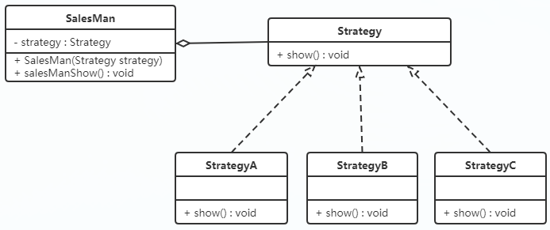

`Strategy`：抽象策略类

```java
/**
 * @Description: 抽象策略类
 * 定义百货公司所有促销活动的共同接口
 */
public interface Strategy {

    void show();
}
```

`StrategyA`：具体策略类，封装算法

```java
/**
 * @Description: 具体策略类，封装算法
 */
public class StrategyA implements Strategy {

    public void show() {
        System.out.println("买一送一");
    }
}
```

`StrategyB`：具体策略类，封装算法

```java
/**
 * @Description: 具体策略类，封装算法
 */
public class StrategyB implements Strategy {

    public void show() {
        System.out.println("满200元减50元");
    }
}
```

`StrategyC`：具体策略类，封装算法

```java
/**
 * @Description: 具体策略类，封装算法
 */
public class StrategyC implements Strategy {

    public void show() {
        System.out.println("满1000元加一元换购任意200元以下商品");
    }
}
```

`SalesMan`：促销员(环境类)

```java
/**
 * @Description: 促销员(环境类)
 */
public class SalesMan {

    //聚合策略类对象
    private Strategy strategy;

    public SalesMan(Strategy strategy) {
        this.strategy = strategy;
    }

    public Strategy getStrategy() {
        return strategy;
    }

    public void setStrategy(Strategy strategy) {
        this.strategy = strategy;
    }

    //由促销员展示促销活动给用户
    public void salesManShow() {
        strategy.show();
    }
}
```

`Client`：

```java
public class Client {
    public static void main(String[] args) {
        //春节来了，使用春节促销活动
        SalesMan salesMan = new SalesMan(new StrategyA());
        //展示促销活动
        salesMan.salesManShow();

        System.out.println("==============");
        //中秋节到了，使用中秋节的促销活动
        salesMan.setStrategy(new StrategyB());
        //展示促销活动
        salesMan.salesManShow();

        System.out.println("==============");
        //圣诞节到了，使用圣诞节的促销活动
        salesMan.setStrategy(new StrategyC());
        //展示促销活动
        salesMan.salesManShow();
        /*
        买一送一
        ==============
        满200元减50元
        ==============
        满1000元加一元换购任意200元以下商品
         */
    }
}
```

##### 6.2.3 `JDK`源码|框架源码中的应用

一、`Comparator` 

- `Comparator` 接口允许定义排序规则，并且可以根据不同的策略对对象进行排序，而不需要修改对象本身的类定义。`Comparator` 中的策略模式。在Arrays类中有一个 `sort()` 方法，如下：

```java
public class Arrays{
    public static <T> void sort(T[] a, Comparator<? super T> c) {
        if (c == null) {
            sort(a);
        } else {
            if (LegacyMergeSort.userRequested)
                legacyMergeSort(a, c);
            else
                TimSort.sort(a, 0, a.length, c, null, 0, 0);
        }
    }
}
```

- Arrays就是一个环境角色类，这个sort方法可以传一个新策略让Arrays根据这个策略来进行排序。就比如下面的测试类


- ```java
  public class demo {
      public static void main(String[] args) {
  
          Integer[] data = {12, 2, 3, 2, 4, 5, 1};
          // 实现降序排序
          Arrays.sort(data, new Comparator<Integer>() {
              public int compare(Integer o1, Integer o2) {
                  return o2 - o1;
              }
          });
          System.out.println(Arrays.toString(data)); //[12, 5, 4, 3, 2, 2, 1]
      }
  }
  ```


- 调用Arrays的sort方法时，第二个参数传递的是Comparator接口的子实现类对象。所以Comparator充当的是抽象策略角色，而具体的子实现类充当的是具体策略角色。环境角色类（Arrays）应该持有抽象策略的引用来调用。那么，Arrays类的sort方法到底有没有使用Comparator子实现类中的 `compare()` 方法吗？继续查看TimSort类的 `sort()` 方法，代码如下：


```java
class TimSort<T> {
    static <T> void sort(T[] a, int lo, int hi, Comparator<? super T> c,
                         T[] work, int workBase, int workLen) {
        assert c != null && a != null && lo >= 0 && lo <= hi && hi <= a.length;

        int nRemaining  = hi - lo;
        if (nRemaining < 2)
            return;  // Arrays of size 0 and 1 are always sorted

        // If array is small, do a "mini-TimSort" with no merges
        if (nRemaining < MIN_MERGE) {
            int initRunLen = countRunAndMakeAscending(a, lo, hi, c);
            binarySort(a, lo, hi, lo + initRunLen, c);
            return;
        }
        ...
    }   
        
    private static <T> int countRunAndMakeAscending(T[] a, int lo, int hi,Comparator<? super T> c) {
        assert lo < hi;
        int runHi = lo + 1;
        if (runHi == hi)
            return 1;

        // Find end of run, and reverse range if descending
        if (c.compare(a[runHi++], a[lo]) < 0) { // Descending
            while (runHi < hi && c.compare(a[runHi], a[runHi - 1]) < 0)
                runHi++;
            reverseRange(a, lo, runHi);
        } else {                              // Ascending
            while (runHi < hi && c.compare(a[runHi], a[runHi - 1]) >= 0)
                runHi++;
        }

        return runHi - lo;
    }
}
```

- 上面的代码中最终会跑到 `countRunAndMakeAscending()` 这个方法中。可以看见，只用了compare方法，所以在调用Arrays.sort方法只传具体compare重写方法的类对象就行，这也是Comparator接口中必须要子类实现的一个方法


二、 `Runnable` 和 `Thread` 类

- `Runnable` 接口也是策略模式的经典案例。`Thread` 类使用 `Runnable` 接口作为策略，使得可以根据不同的需求提供不同的线程行为

```java
public class RunnableStrategyExample {
    public static void main(String[] args) {
        // 使用不同的策略运行线程
        Thread thread1 = new Thread(new PrintTask());
        Thread thread2 = new Thread(new SumTask());

        thread1.start();
        thread2.start();
    }
}

class PrintTask implements Runnable {
    @Override
    public void run() {
        System.out.println("Print Task is running");
    }
}

class SumTask implements Runnable {
    @Override
    public void run() {
        int sum = 0;
        for (int i = 0; i < 10; i++) {
            sum += i;
        }
        System.out.println("Sum Task: Sum is " + sum);
    }
}
输出结果：
    Print Task is running
    Sum Task: Sum is 45

分析：
    - Runnable 是策略接口，定义了线程的行为
    - Thread 是上下文类，通过持有 Runnable 的引用，调用具体的策略
    - 可以根据不同的需求实现不同的 Runnable 行为
```


三、Spring 框架中的策略模式：`Resource` 和 `ResourceLoader`

- Spring 框架中大量使用了策略模式，特别是在设计一些灵活的接口和配置时。Spring 中的 `Resource` 接口是策略模式的一个例子，它用来封装不同的资源访问策略，例如从文件系统、类路径、URL 等不同位置加载资源

```java
Resource resource = new ClassPathResource("data.txt");
Resource fileResource = new FileSystemResource("/data.txt");
```

- `Resource` 是策略接口，定义了访问资源的行为
- `ClassPathResource`、`FileSystemResource` 等具体实现类是具体策略
- `ResourceLoader` 是上下文，负责根据不同的策略加载资源


四、`ApplicationContext` 和 `BeanFactoryPostProcessor`

- Spring 框架允许通过策略模式自定义 `BeanFactoryPostProcessor`，以修改 Spring 容器的配置元数据。`BeanFactoryPostProcessor` 是一个回调接口，它允许在 Spring 容器实例化之前对 bean 的定义进行调整

```java
@Configuration
public class CustomPostProcessor implements BeanFactoryPostProcessor {
    @Override
    public void postProcessBeanFactory(ConfigurableListableBeanFactory beanFactory) throws BeansException {
        System.out.println("Custom BeanFactoryPostProcessor invoked!");
    }
}
```

- `BeanFactoryPostProcessor` 是策略接口
- 自定义的 `CustomPostProcessor` 是具体策略，可以修改 bean 定义
- `ApplicationContext` 是上下文，它在启动时应用策略


##### 6.2.4 `GPT`补充

策略模式：

- 策略模式（Strategy Pattern） 是一种行为设计模式，旨在定义一系列算法，并将每个算法封装起来，使它们可以相互替换。策略模式使算法可以在不影响客户端的情况下发生变化。该模式通常用于需要在运行时选择算法的情况

在策略模式中，主要有以下三个角色：

1. 策略接口（Strategy Interface）：定义一组可供选择的算法或操作
2. 具体策略类（Concrete Strategy Class）：实现策略接口的不同算法或操作
3. 上下文类（Context Class）：负责持有一个策略接口的引用，并在客户端需要时调用策略接口的方法

策略模式的优势：

- 解耦算法选择和实现：算法可以在不影响客户端代码的情况下自由切换
- 提高灵活性和可维护性：可以轻松添加新策略而无需修改现有代码

策略模式案例：

假设有一个支付系统，用户可以选择使用不同的支付方式（如信用卡支付、PayPal 支付、微信支付等）。可以使用策略模式来实现不同支付方式之间的切换

`PaymentStrategy`：定义策略接口

```java
// 定义策略接口，所有支付方式都需要实现这个接口
public interface PaymentStrategy {
    void pay(double amount);
}
```

`CreditCardPayment`：具体策略实现

```java
// 实现信用卡支付策略
public class CreditCardPayment implements PaymentStrategy {
    private String cardNumber;

    public CreditCardPayment(String cardNumber) {
        this.cardNumber = cardNumber;
    }

    @Override
    public void pay(double amount) {
        System.out.println("Paid " + amount + " using Credit Card. Card Number: " + cardNumber);
    }
}

// 实现 PayPal 支付策略
public class PayPalPayment implements PaymentStrategy {
    private String email;

    public PayPalPayment(String email) {
        this.email = email;
    }

    @Override
    public void pay(double amount) {
        System.out.println("Paid " + amount + " using PayPal. Email: " + email);
    }
}

// 实现微信支付策略
public class WeChatPayment implements PaymentStrategy {
    private String weChatId;

    public WeChatPayment(String weChatId) {
        this.weChatId = weChatId;
    }

    @Override
    public void pay(double amount) {
        System.out.println("Paid " + amount + " using WeChat. WeChat ID: " + weChatId);
    }
}
```

`PaymentContext`：定义上下文类

```java
// 上下文类，用于选择不同的支付策略
public class PaymentContext {
    private PaymentStrategy paymentStrategy;

    // 通过构造函数设置支付策略
    public PaymentContext(PaymentStrategy paymentStrategy) {
        this.paymentStrategy = paymentStrategy;
    }

    // 设置或更换支付策略
    public void setPaymentStrategy(PaymentStrategy paymentStrategy) {
        this.paymentStrategy = paymentStrategy;
    }

    // 调用具体支付策略的方法
    public void pay(double amount) {
        paymentStrategy.pay(amount);
    }
}
```

`StrategyPatternExample`：客户端使用

```java
public class StrategyPatternExample {
    public static void main(String[] args) {
        // 选择使用信用卡支付
        PaymentContext context = new PaymentContext(new CreditCardPayment("1234-5678-9012-3456"));
        context.pay(100.0);

        // 切换为 PayPal 支付
        context.setPaymentStrategy(new PayPalPayment("example@paypal.com"));
        context.pay(200.0);

        // 切换为微信支付
        context.setPaymentStrategy(new WeChatPayment("WeChat-12345"));
        context.pay(300.0);
    }
}
/*
Paid 100.0 using Credit Card. Card Number: 1234-5678-9012-3456
Paid 200.0 using PayPal. Email: example@paypal.com
Paid 300.0 using WeChat. WeChat ID: WeChat-12345
*/
总结
    1.通过策略模式，支付系统可以灵活地切换支付方式，而不需要修改客户端代码
    2.这种设计提高了代码的可扩展性，符合开闭原则（Open-Closed Principle）：对扩展开放，对修改关闭
    3.如果以后需要添加新的支付方式，只需实现 `PaymentStrategy` 接口即可，无需更改现有代码
```


### 6.3 命令模式

##### 6.3.1 简介

introduce：

- 日常生活中，出去吃饭都会遇到下面的场景


命令模式：

- 将一个请求封装为一个对象，使发出请求的责任和执行请求的责任分割开。这样两者之间通过命令对象进行沟通，这样方便将命令对象进行存储、传递、调用、增加与管理

命令模式包含以下主要角色：

* 抽象命令类（Command）角色： 定义命令的接口，声明执行的方法
* 具体命令（Concrete  Command）角色：具体的命令，实现命令接口；通常会持有接收者，并调用接收者的功能来完成命令要执行的操作
* 实现者/接收者（Receiver）角色： 接收者，真正执行命令的对象。任何类都可能成为一个接收者，只要它能够实现命令要求实现的相应功能
* 调用者/请求者（Invoker）角色： 要求命令对象执行请求，通常会持有命令对象，可以持有很多的命令对象。这个是客户端真正触发命令并要求命令执行相应操作的地方，也就是说相当于使用命令对象的入口

命令模式优缺点：

- 优点：

  * 降低系统的耦合度。命令模式能将调用操作的对象与实现该操作的对象解耦

  * 增加或删除命令非常方便。采用命令模式增加与删除命令不会影响其他类，它满足“开闭原则”，对扩展比较灵活

  * 可以实现宏命令。命令模式可以与组合模式结合，将多个命令装配成一个组合命令，即宏命令

  * 方便实现 Undo 和 Redo 操作。命令模式可以与后面介绍的备忘录模式结合，实现命令的撤销与恢复

- 缺点：

  * 使用命令模式可能会导致某些系统有过多的具体命令类

  * 系统结构更加复杂


使用场景：

* 系统需要将请求调用者和请求接收者解耦，使得调用者和接收者不直接交互
* 系统需要在不同的时间指定请求、将请求排队和执行请求
* 系统需要支持命令的撤销(Undo)操作和恢复(Redo)操作

##### 6.3.2 案例

将上面的案例用代码实现，那就需要分析命令模式的角色在该案例中由谁来充当

- 服务员： 就是调用者角色，由她来发起命令
- 资深大厨： 就是接收者角色，真正命令执行的对象
- 订单： 命令中包含订单

类图如下：

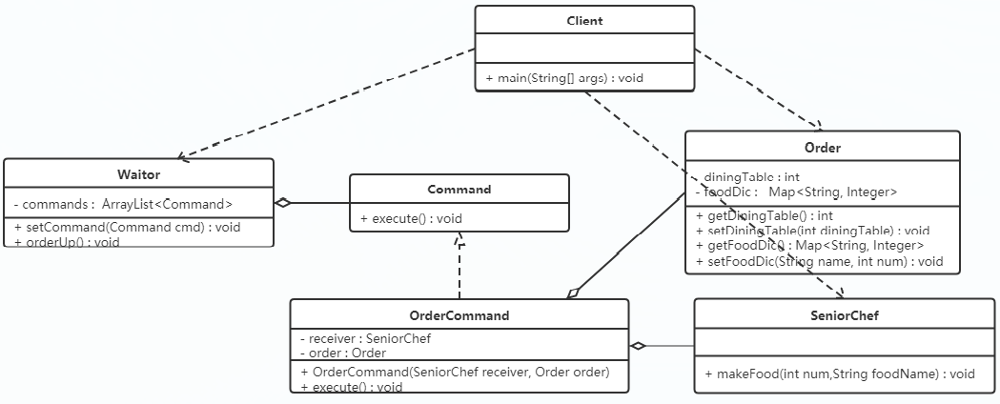

代码如下：

`Order`：订单类

```java
import java.util.HashMap;
import java.util.Map;
/**
 * @Description: 订单类
 */
public class Order {
    //餐桌号码
    private int diningTable;

    //所下的餐品及份数
    private Map<String,Integer> foodDir = new HashMap<String, Integer>();

    public int getDiningTable() {
        return diningTable;
    }

    public void setDiningTable(int diningTable) {
        this.diningTable = diningTable;
    }

    public Map<String, Integer> getFoodDir() {
        return foodDir;
    }

    public void setFood(String name,int num) {
        foodDir.put(name,num);
    }
}
```

`SeniorChef`：厨师类

```java
/**
 * @Description: 厨师类
 */
public class SeniorChef {

    public void makeFood(String name,int num) {
        System.out.println(num + "份" + name);
    }
}
```

`Command`：抽象命令类

```java
/**
 * @Description: 抽象命令类
 */
public interface Command {

    void execute();
}
```

`OrderCommand`：具体的命令类

```java
import java.util.Map;
import java.util.Set;
/**
 * @Description: 具体的命令类
 */
public class OrderCommand implements Command {

    //持有接收者对象
    private SeniorChef receiver;
    private Order order;

    public OrderCommand(SeniorChef receiver, Order order) {
        this.receiver = receiver;
        this.order = order;
    }

    public void execute() {
        System.out.println(order.getDiningTable() + "桌的订单：");
        Map<String, Integer> foodDir = order.getFoodDir();
        //遍历map集合
        Set<String> keys = foodDir.keySet();
        for (String foodName : keys) {
            receiver.makeFood(foodName, foodDir.get(foodName));
        }

        System.out.println(order.getDiningTable() + "桌的饭准备完毕！！！");
    }
}
```

`Waitor`：服务员类（属于请求者角色）

```java
import java.util.ArrayList;
import java.util.List;
/**
 * @Description: 服务员类（属于请求者角色）
 */
public class Waitor {

    //持有多个命令对象
    private List<Command> commands = new ArrayList<Command>();

    public void setCommand(Command cmd) {
        //将cmd对象存储到list集合中
        commands.add(cmd);
    }

    //发起命令功能  喊 订单来了
    public void orderUp() {
        System.out.println("美女服务员：大厨，新订单来了。。。。");
        //遍历list集合
        for (Command command : commands) {
           if(command != null) {
               command.execute();
           }
        }
    }
}
```

`Client`：测试

```java
public class Client {
    public static void main(String[] args) {
        //创建第一个订单对象
        Order order1 = new Order();
        order1.setDiningTable(1);
        order1.setFood("西红柿鸡蛋面",1);
        order1.setFood("小杯可乐",2);

        //创建第二个订单对象
        Order order2 = new Order();
        order2.setDiningTable(2);
        order2.setFood("尖椒肉丝盖饭",1);
        order2.setFood("小杯雪碧",1);

        //创建厨师对象
        SeniorChef receiver = new SeniorChef();
        //创建命令对象
        OrderCommand cmd1 = new OrderCommand(receiver,order1);
        OrderCommand cmd2 = new OrderCommand(receiver,order2);

        //创建调用者（服务员对象）
        Waitor invoke = new Waitor();
        invoke.setCommand(cmd1);
        invoke.setCommand(cmd2);

        //让服务员发起命令
        invoke.orderUp();
        /*
        美女服务员：大厨，新订单来了。。。。
        1桌的订单：
        1份西红柿鸡蛋面
        2份小杯可乐
        1桌的饭准备完毕！！！
        2桌的订单：
        1份尖椒肉丝盖饭
        1份小杯雪碧
        2桌的饭准备完毕！！！
         */
    }
}
```

##### 6.3.3 `JDK`源码|框架源码中的应用

一、`Runable`是一个典型命令模式

- Runnable担当命令的角色，Thread充当的是调用者，start方法就是其执行方法

```java
//命令接口(抽象命令角色)
public interface Runnable {
	public abstract void run();
}

//调用者
public class Thread implements Runnable {
    private Runnable target;
    
    public synchronized void start() {
        if (threadStatus != 0)
            throw new IllegalThreadStateException();

        group.add(this);

        boolean started = false;
        try {
            start0();
            started = true;
        } finally {
            try {
                if (!started) {
                    group.threadStartFailed(this);
                }
            } catch (Throwable ignore) {
            }
        }
    }
    
    private native void start0();
}
```

- 会调用一个native方法start0(),调用系统方法，开启一个线程。而接收者是对程序员开放的，可以自己定义接收者


```java
/**
 * jdk Runnable 命令模式
 *		TurnOffThread ： 属于具体
 */
public class TurnOffThread implements Runnable{
     private Receiver receiver;
    
     public TurnOffThread(Receiver receiver) {
     	this.receiver = receiver;
     }
     public void run() {
     	receiver.turnOFF();
     }
}
```

```java
/**
 * 测试类
 */
public class Demo {
     public static void main(String[] args) {
         Receiver receiver = new Receiver();
         TurnOffThread turnOffThread = new TurnOffThread(receiver);
         Thread thread = new Thread(turnOffThread);
         thread.start();
     }
}
```


二、命令模式在Spring 中的应用：

- Spring 中的 `org.springframework.transaction.PlatformTransactionManager`
- Spring 事务管理中，命令模式用于控制事务的提交和回滚。`TransactionTemplate` 类就是一个典型的命令模式的实现，使用 `execute` 方法来执行具体的事务操作

```java
public class TransactionTemplate {
    public <T> T execute(TransactionCallback<T> action) throws TransactionException {
        // 执行事务逻辑
    }
}
```

- `TransactionCallback` 是命令接口，定义了 `doInTransaction` 方法
- 具体实现类负责实现 `doInTransaction` 方法，执行具体的业务逻辑
- `TransactionTemplate` 是调用者，负责执行命令并管理事务的提交和回滚

```java
TransactionTemplate transactionTemplate = new TransactionTemplate(transactionManager);

transactionTemplate.execute(status -> {
    // Transactional code
    return null;
});
```


三、MyBatis 中的 `Executor`

- 在 `MyBatis` 中，`Executor` 执行器负责执行数据库的 CRUD 操作，其中的执行操作可以看作命令模式的应用
- 在 `Executor` 中，`MappedStatement` 包含了 SQL 操作的相关信息，可以视作命令对象，而 `Executor` 则是命令的执行者，负责调用数据库进行实际操作

```java
public interface Executor {
    int update(MappedStatement ms, Object parameter) throws SQLException;
    <E> List<E> query(MappedStatement ms, Object parameter, RowBounds rowBounds, ResultHandler resultHandler) throws SQLException;
}
```


### 6.4 责任链模式

##### 6.4.1 简介

introduce：

- 在现实生活中，常常会出现这样的事例：一个请求有多个对象可以处理，但每个对象的处理条件或权限不同。例如，公司员工请假，可批假的领导有部门负责人、副总经理、总经理等，但每个领导能批准的天数不同，员工必须根据自己要请假的天数去找不同的领导签名，也就是说员工必须记住每个领导的姓名、电话和地址等信息，这增加了难度。这样的例子还有很多，如找领导出差报销、生活中的“击鼓传花”游戏等


责任链模式：

- 又名职责链模式，为了避免请求发送者与多个请求处理者耦合在一起，将所有请求的处理者通过前一对象记住其下一个对象的引用而连成一条链；当有请求发生时，可将请求沿着这条链传递，直到有对象处理它为止


责任链模式结构：

* 抽象处理者（Handler）角色：定义一个处理请求的接口，包含抽象处理方法和一个后继连接
* 具体处理者（Concrete Handler）角色：实现抽象处理者的处理方法，判断能否处理本次请求，如果可以处理请求则处理，否则将该请求转给它的后继者
* 客户类（Client）角色：创建处理链，并向链头的具体处理者对象提交请求，它不关心处理细节和请求的传递过程

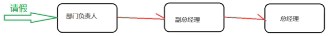

责任链模式优缺点：

- 优点：

  * 降低了对象之间的耦合度。该模式降低了请求发送者和接收者的耦合度


  * 增强了系统的可扩展性。可以根据需要增加新的请求处理类，满足开闭原则


  * 增强了给对象指派职责的灵活性。当工作流程发生变化，可以动态地改变链内的成员或者修改它们的次序，也可动态地新增或者删除责任


  * 责任链简化了对象之间的连接。一个对象只需保持一个指向其后继者的引用，不需保持其他所有处理者的引用，这避免了使用众多的 if 或者 if···else 语句


  * 责任分担。每个类只需要处理自己该处理的工作，不能处理的传递给下一个对象完成，明确各类的责任范围，符合类的单一职责原则

- 缺点：

  * 不能保证每个请求一定被处理。由于一个请求没有明确的接收者，所以不能保证它一定会被处理，该请求可能一直传到链的末端都得不到处理

  * 对比较长的职责链，请求的处理可能涉及多个处理对象，系统性能将受到一定影响

  * 职责链建立的合理性要靠客户端来保证，增加了客户端的复杂性，可能会由于职责链的错误设置而导致系统出错，如可能会造成循环调用

##### 6.4.2 案例

请假流程控制：

> 现需要开发一个请假流程控制系统。请假一天以下的假只需要小组长同意即可；请假1天到3天的假还需要部门经理同意；请求3天到7天还需要总经理同意才行

类图如下：

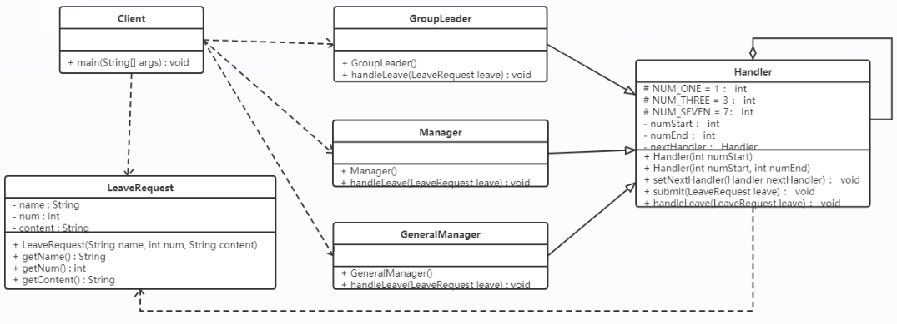

代码如下：

`LeaveRequest`：请假条类

```java
/**
 * @Description: 请假条类
 */
public class LeaveRequest {
    //姓名
    private String name;

    //请假天数
    private int num;

    //请假内容
    private String content;

    public LeaveRequest(String name, int num, String content) {
        this.name = name;
        this.num = num;
        this.content = content;
    }

    public String getName() {
        return name;
    }

    public int getNum() {
        return num;
    }

    public String getContent() {
        return content;
    }
}
```

`Handler`：抽象处理者类

```java
/**
 * @Description: 抽象处理者类
 */
public abstract class Handler {

    protected final static int NUM_ONE = 1;
    protected final static int NUM_THREE = 3;
    protected final static int NUM_SEVEN = 7;

    //该领导处理的请求天数区间
    private int numStart;
    private int numEnd;

    //声明后续者（声明后继者，也就是本案例中的上级领导）
    private Handler nextHandler;

    public Handler(int numStart) {
        this.numStart = numStart;
    }

    public Handler(int numStart, int numEnd) {
        this.numStart = numStart;
        this.numEnd = numEnd;
    }

    //设置上级领导对象（设置后继者）
    public void setNextHandler(Handler nextHandler) {
        this.nextHandler = nextHandler;
    }

    //各级领导处理请求条的方法
    protected abstract void handleLeave(LeaveRequest leave);

    //提交请求条
    public final void submit(LeaveRequest leave) {
        //该领导进行审批
        this.handleLeave(leave);
        if(this.nextHandler != null && leave.getNum() > this.numEnd) {
            //提交给上级领导进行审批
            this.nextHandler.submit(leave);
        } else {
            System.out.println("流程结束！");
        }
    }
}
```

`GroupLeader`：小组长类（具体的处理者）

```java
/**
 * @Description: 小组长类（具体的处理者）
 */
public class GroupLeader extends Handler {

    public GroupLeader() {
        super(0,Handler.NUM_ONE);
    }

    protected void handleLeave(LeaveRequest leave) {
        System.out.println(leave.getName() + "请假" + leave.getNum() + "天，" + leave.getContent() + "。");
        System.out.println("小组长审批：同意");
    }
}
```

`Manager`：部门经理类（具体的处理者）

```java
/**
 * @Description: 部门经理类（具体的处理者）
 */
public class Manager extends Handler {

    public Manager() {
        super(Handler.NUM_ONE,Handler.NUM_THREE);
    }

    protected void handleLeave(LeaveRequest leave) {
        System.out.println(leave.getName() + "请假" + leave.getNum() + "天，" + leave.getContent() + "。");
        System.out.println("部门经理审批：同意");
    }
}
```

`GeneralManager`：总经理类（具体的处理者）

```java
/**
 * @Description: 总经理类（具体的处理者）
 */
public class GeneralManager extends Handler {

    public GeneralManager() {
        super(Handler.NUM_THREE,Handler.NUM_SEVEN);
    }

    protected void handleLeave(LeaveRequest leave) {
        System.out.println(leave.getName() + "请假" + leave.getNum() + "天，" + leave.getContent() + "。");
        System.out.println("总经理审批：同意");
    }
}
```

`Client`：测试

```java
public class Client {
    public static void main(String[] args) {
        //创建一个请假条对象
        LeaveRequest leave = new LeaveRequest("小明",1,"身体不适");

        //创建各级领导对象
        GroupLeader groupLeader = new GroupLeader();
        Manager manager = new Manager();
        GeneralManager generalManager = new GeneralManager();

        //设置处理者链
        groupLeader.setNextHandler(manager);
        manager.setNextHandler(generalManager);
        
        //小明提交请假申请
        groupLeader.submit(leave);
        /*
        小明请假1天，身体不适。
        小组长审批：同意
        流程结束！
         */
    }
}
```

##### 6.4.3 `Servlet`中Filter的模拟实现

一、在javaWeb应用开发中，FilterChain是职责链（过滤器）模式的典型应用，以下是Filter的模拟实现分析：

* 模拟web请求Request以及web响应Response

```java
public interface Request{
 
}

public interface Response{
 
}
```

* 模拟web过滤器Filter

```java
public interface Filter {
 	public void doFilter(Request req,Response res,FilterChain c);
 }
```

* 模拟实现具体过滤器  

```java
public class FirstFilter implements Filter {
    @Override
    public void doFilter(Request request, Response response, FilterChain chain) {

        System.out.println("过滤器1 前置处理");

        // 先执行所有request再倒序执行所有response
        chain.doFilter(request, response);

        System.out.println("过滤器1 后置处理");
    }
}

public class SecondFilter  implements Filter {
    @Override
    public void doFilter(Request request, Response response, FilterChain chain) {

        System.out.println("过滤器2 前置处理");

        // 先执行所有request再倒序执行所有response
        chain.doFilter(request, response);

        System.out.println("过滤器2 后置处理");
    }
}
```

* 模拟实现过滤器链FilterChain  

```java
public class FilterChain {

    private List<Filter> filters = new ArrayList<Filter>();

    private int index = 0;

    // 链式调用
    public FilterChain addFilter(Filter filter) {
        this.filters.add(filter);
        return this;
    }

    public void doFilter(Request request, Response response) {
        if (index == filters.size()) {
            return;
        }
        Filter filter = filters.get(index);
        index++;
        filter.doFilter(request, response, this);
    }
}
```

* 测试类

```java
public class Client {
    public static void main(String[] args) {
        Request  req = null;
        Response res = null ;

        FilterChain filterChain = new FilterChain();
        filterChain.addFilter(new FirstFilter()).addFilter(new SecondFilter());
        filterChain.doFilter(req,res);
        /*
        过滤器1 前置处理
        过滤器2 前置处理
        过滤器2 后置处理
        过滤器1 后置处理
         */
    }
}
```

##### 6.4.4 `JDK`源码|框架源码中的应用

一、Java的 `javax.servlet.Filter` 机制

- Servlet中的Filter链是责任链模式的一个典型应用。在Servlet请求处理过程中，多个过滤器（Filter）会按顺序处理请求。具体处理步骤如下：

  - 请求到达第一个Filter时，Filter会决定是否进行处理，如果处理，则可对请求做预处理

  - 如果第一个Filter不处理，则将请求传递给下一个Filter，依次类推

  - 最终，Filter链上的某个Filter处理了请求，或者请求传递到目标资源（例如Servlet）

- Filter链的核心代码就是责任链模式的体现。`javax.servlet.FilterChain`接口定义了`doFilter()`方法，逐个调用责任链中的Filter

```java
public interface FilterChain {
    void doFilter(ServletRequest request, ServletResponse response)
        throws IOException, ServletException;
}
```


二、`java.util.logging.Logger`

- 在Java的日志框架中，`Logger`对象负责处理日志记录，并且可以设置父子关系。每个`Logger`可以有一个父`Logger`，如果当前`Logger`无法处理日志记录请求（例如：日志级别不足），则将请求传递给父`Logger`。这也是责任链模式的应用：

```java
// `logger`处理不了的日志请求，会自动传递给`parentLogger`，形成了责任链
Logger logger = Logger.getLogger("com.example");
logger.setLevel(Level.INFO);
Logger parentLogger = Logger.getLogger("com");
logger.setParent(parentLogger);
```


三、`java.nio.channels.Channel` 中的 `Pipeline` 设计

- 在Java NIO中，`Channel`中有一个`Pipeline`的设计，它将多个处理步骤按顺序排列，数据通过这些步骤逐步处理，每个步骤负责处理一部分逻辑，类似于责任链的模式。每个处理步骤可以决定是否传递到下一个步骤


四、Spring Security的Filter Chain

- Spring Security的过滤器链是责任链模式的一个典型应用。多个安全过滤器（Filter）依次处理用户的请求，典型过滤器包括：

  - `UsernamePasswordAuthenticationFilter`：用于处理用户名密码验证

  - `BasicAuthenticationFilter`：处理HTTP基本身份验证

  - `ExceptionTranslationFilter`：处理异常

- 这些过滤器按顺序组成一条责任链，当请求到来时，依次通过每个过滤器，直到某个过滤器决定处理请求，或者最终请求被处理完毕

- 在Spring Security中，`FilterChainProxy`是具体的责任链实现类，它会依次调用每个过滤器的`doFilter()`方法

```java
@Override
protected void configure(HttpSecurity http) throws Exception {
    http
        .addFilterBefore(new CustomFilter(), UsernamePasswordAuthenticationFilter.class)
        .addFilterAfter(new AnotherFilter(), BasicAuthenticationFilter.class);
}
```


五、Spring AOP的责任链模式

- Spring AOP中的拦截器链也可以看作责任链模式的一种应用。在方法调用过程中，多个切面可以按顺序对目标方法进行增强，形成了调用链。例如，事务管理、权限检查、日志记录等切面都可以通过AOP在方法调用前后进行处理

### 6.5 状态模式

##### 6.5.1 introduce

【例】通过按钮来控制一个电梯的状态，一个电梯有开门状态，关门状态，停止状态，运行状态。每一种状态改变，都有可能要根据其他状态来更新处理。例如，如果电梯门现在处于运行时状态，就不能进行开门操作，而如果电梯门是停止状态，就可以执行开门操作

类图如下：

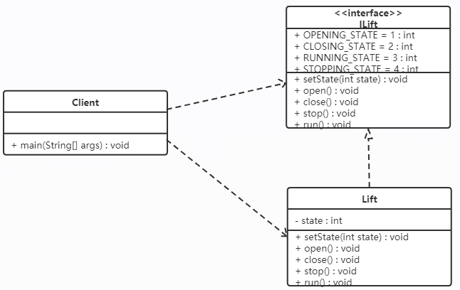

`ILift`：电梯接口

```java
/**
 * @Description: 电梯接口
 */
public interface ILift {

    //定义四个电梯状态的常量
    int OPENING_STATE = 1;
    int CLOSING_STATE = 2;
    int RUNNING_STATE = 3;
    int STOPPING_STATE = 4;

    //设置电梯状态的功能
    void setState(int state);

    //电梯操作功能
    void open();

    void close();

    void run();

    void stop();
}
```

`Lift`：电梯类(ILift的子实现类)

```java
/**
 * @Description: 电梯类(ILift的子实现类)
 */
public class Lift implements ILift {

    //声明一个记录当前电梯的状态
    private int state;

    public void setState(int state) {
        this.state = state;
    }

    public void open() {
        switch (state) { //当前电梯状态
            case OPENING_STATE :
                //什么事都不做
                break;
            case CLOSING_STATE :
                System.out.println("电梯打开了...");
                //设置当前电梯状态为开启状态
                setState(OPENING_STATE);
                break;
            case STOPPING_STATE :
                System.out.println("电梯打开了...");
                //设置当前电梯状态为开启状态
                setState(OPENING_STATE);
                break;
            case RUNNING_STATE :
                //什么事都不做
                break;
        }
    }

    public void close() {
        switch (this.state) {
            case OPENING_STATE:
                System.out.println("电梯关门了。。。");//只有开门状态可以关闭电梯门，可以对应电梯状态表来看
                this.setState(CLOSING_STATE);//关门之后电梯就是关闭状态了
                break;
            case CLOSING_STATE:
                //do nothing //已经是关门状态，不能关门
                break;
            case RUNNING_STATE:
                //do nothing //运行时电梯门是关着的，不能关门
                break;
            case STOPPING_STATE:
                //do nothing //停止时电梯也是关着的，不能关门
                break;
        }
    }

    public void run() {
        switch (this.state) {
            case OPENING_STATE://电梯不能开着门就走
                //do nothing
                break;
            case CLOSING_STATE://门关了，可以运行了
                System.out.println("电梯开始运行了。。。");
                this.setState(RUNNING_STATE);//现在是运行状态
                break;
            case RUNNING_STATE:
                //do nothing 已经是运行状态了
                break;
            case STOPPING_STATE:
                System.out.println("电梯开始运行了。。。");
                this.setState(RUNNING_STATE);
                break;
        }
    }

    public void stop() {
        switch (this.state) {
            case OPENING_STATE: //开门的电梯已经是是停止的了(正常情况下)
                //do nothing
                break;
            case CLOSING_STATE://关门时才可以停止
                System.out.println("电梯停止了。。。");
                this.setState(STOPPING_STATE);
                break;
            case RUNNING_STATE://运行时当然可以停止了
                System.out.println("电梯停止了。。。");
                this.setState(STOPPING_STATE);
                break;
            case STOPPING_STATE:
                //do nothing
                break;
        }
    }
}
```

`Client`：测试

```java
public class Client {
    public static void main(String[] args) {
        //创建电梯对象
        Lift lift = new Lift();

        //设置当前电梯的状态
        lift.setState(ILift.RUNNING_STATE);

        //打开
        lift.open();
        lift.close();
        lift.run();
        lift.stop();
        /*
        电梯停止了。。。
         */
    }
}
```

问题分析：

* 使用了大量的switch…case这样的判断（if…else也是一样)，使程序的可阅读性变差
* 扩展性很差。如果新加了断电的状态，需要修改上面判断逻辑

##### 6.5.2 简介

状态模式：

- 对有状态的对象，把复杂的“判断逻辑”提取到不同的状态对象中，允许状态对象在其内部状态发生改变时改变其行为


状态模式结构：

* 环境（Context）角色：也称为上下文，它定义了客户程序需要的接口，维护一个当前状态，并将与状态相关的操作委托给当前状态对象来处理
* 抽象状态（State）角色：定义一个接口，用以封装环境对象中的特定状态所对应的行为
* 具体状态（Concrete  State）角色：实现抽象状态所对应的行为

状态模式优缺点：

- 优点：

  * 将所有与某个状态有关的行为放到一个类中，并且可以方便地增加新的状态，只需要改变对象状态即可改变对象的行为

  * 允许状态转换逻辑与状态对象合成一体，而不是某一个巨大的条件语句块

- 缺点：

  * 状态模式的使用必然会增加系统类和对象的个数（有多少状态就有多少个类）

  * 状态模式的结构与实现都较为复杂，如果使用不当将导致程序结构和代码的混乱

  * 状态模式对"开闭原则"的支持并不太好


 使用场景：

- 当一个对象的行为取决于它的状态，并且它必须在运行时根据状态改变它的行为时，就可以考虑使用状态模式
- 一个操作中含有庞大的分支结构，并且这些分支决定于对象的状态时


##### 6.5.3 案例

对上述电梯的案例使用状态模式进行改进。类图如下：

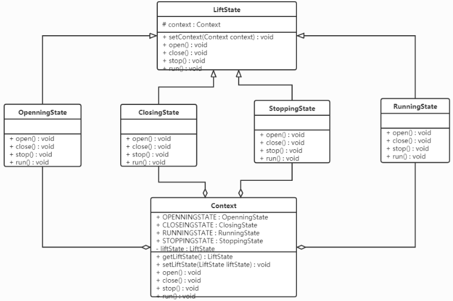


`LiftState`：抽象状态类

```java
/**
 * @Description: 抽象状态类
 */
public abstract class LiftState {

    //声明环境角色类变量
    protected Context context;

    public void setContext(Context context) {
        this.context = context;
    }

    //电梯开启操作
    public abstract void open();

    //电梯关闭操作
    public abstract void close();

    //电梯运行操作
    public abstract void run();

    //电梯停止操作
    public abstract void stop();
}
```

`OpeningState`：电梯开启状态类

```java
/**
 * @Description: 电梯开启状态类
 */
public class OpeningState extends LiftState {
    //当前状态要执行的方法
    public void open() {
        System.out.println("电梯开启。。。");
    }

    public void close() {
        //修改状态
        super.context.setLiftState(Context.CLOSING_STATE);
        //调用当前状态中的context中的close方法
        super.context.close();
    }

    public void run() {
        //什么都不做
    }

    public void stop() {
        //什么都不做
    }
}
```

`RunningState`：电梯运行状态类

```java
/**
 * @Description: 电梯运行状态类
 */
public class RunningState extends LiftState {
    //运行的时候开电梯门？你疯了！电梯不会给你开的
    @Override
    public void open() {
        //do nothing
    }

    //电梯门关闭？这是肯定了
    @Override
    public void close() {//虽然可以关门，但这个动作不归我执行
        //do nothing
    }

    //这是在运行状态下要实现的方法
    @Override
    public void run() {
        System.out.println("电梯正在运行...");
    }

    //这个事绝对是合理的，光运行不停止还有谁敢做这个电梯？！估计只有上帝了
    @Override
    public void stop() {
        super.context.setLiftState(Context.STOPPING_STATE);
        super.context.stop();
    }
}
```

`ClosingState`：电梯关闭状态类

```java
/**
 * @Description: 电梯关闭状态类
 */
public class ClosingState extends LiftState {
    @Override
    //电梯门关闭，这是关闭状态要实现的动作
    public void close() {
        System.out.println("电梯门关闭...");
    }

    //电梯门关了再打开，逗你玩呢，那这个允许呀
    @Override
    public void open() {
        super.context.setLiftState(Context.OPENING_STATE);
        super.context.open();
    }


    //电梯门关了就跑，这是再正常不过了
    @Override
    public void run() {
        super.context.setLiftState(Context.RUNNING_STATE);
        super.context.run();
    }

    //电梯门关着，我就不按楼层
    @Override
    public void stop() {
        super.context.setLiftState(Context.STOPPING_STATE);
        super.context.stop();
    }
}
```

`StoppingState`：电梯停止状态类

```java
/**
 * @Description: 电梯停止状态类
 */
public class StoppingState extends LiftState {
    //停止状态，开门，那是要的！
    @Override
    public void open() {
        //状态修改
        super.context.setLiftState(Context.OPENING_STATE);
        //动作委托为CloseState来执行，也就是委托给了ClosingState子类执行这个动作
        super.context.getLiftState().open();
    }

    @Override
    public void close() {//虽然可以关门，但这个动作不归我执行
        //状态修改
        super.context.setLiftState(Context.CLOSING_STATE);
        //动作委托为CloseState来执行，也就是委托给了ClosingState子类执行这个动作
        super.context.getLiftState().close();
    }

    //停止状态再跑起来，正常的很
    @Override
    public void run() {
        //状态修改
        super.context.setLiftState(Context.RUNNING_STATE);
        //动作委托为CloseState来执行，也就是委托给了ClosingState子类执行这个动作
        super.context.getLiftState().run();
    }

    //停止状态是怎么发生的呢？当然是停止方法执行了
    @Override
    public void stop() {
        System.out.println("电梯停止了...");
    }
}
```

`Context`：环境角色类

```java
/**
 * @Description: 环境角色类
 */
public class Context {

    //定义对应状态对象的常量
    public final static OpeningState OPENING_STATE = new OpeningState();
    public final static ClosingState CLOSING_STATE = new ClosingState();
    public final static RunningState RUNNING_STATE = new RunningState();
    public final static StoppingState STOPPING_STATE = new StoppingState();

    //定义一个当前电梯状态变量
    private LiftState liftState;

    public LiftState getLiftState() {
        return liftState;
    }

    //设置当前状态对象
    public void setLiftState(LiftState liftState) {
        this.liftState = liftState;
        //设置当前状态对象中的Context对象
        this.liftState.setContext(this);
    }

    public void open() {
        this.liftState.open();
    }

    public void close() {
        this.liftState.close();
    }

    public void run() {
        this.liftState.run();
    }

    public void stop() {
        this.liftState.stop();
    }
}
```

`Client`：测试

```java
public class Client {
    public static void main(String[] args) {
        //创建环境角色对象
        Context context = new Context();
        //设置当前电梯装填
        context.setLiftState(new ClosingState());

        context.open();
        context.run();
        context.close();
        context.stop();
        /*
        电梯开启。。。
        电梯门关闭...
        电梯停止了...
         */
    }
}
```

##### 6.5.4 `JDK`源码|框架源码中的应用

1.`java.nio.channels.Selector`类

- 在NIO中，`Selector`用于检测一组`Channel`的状态，比如是否可以读、写或连接等。`Selector`中的状态机机制可以根据`Channel`的不同状态进行不同的处理

- Selector中的每个`Channel`都有不同的状态，可能是`OP_READ`、`OP_WRITE`等
- 通过状态模式，`Selector`会根据当前`Channel`的状态执行相应的操作，而不需要在一个巨大而复杂的`if-else`或`switch-case`中判断状态

 2.`Thread`类的生命周期状态

- Java的`Thread`类也使用了状态模式来管理线程的不同状态，如`NEW`、`RUNNABLE`、`BLOCKED`、`WAITING`、`TIMED_WAITING`、`TERMINATED`等

- `Thread`在不同的状态下，会有不同的行为表现。例如，当线程处于`RUNNABLE`状态时，线程可以运行；当线程进入`BLOCKED`状态时，它需要等待其他线程释放锁
- 在`Thread.State`枚举中，每个状态代表一个具体的行为，并通过状态切换使线程的生命周期管理更具可扩展性和灵活性

3.`Spring State Machine`

- `Spring State Machine`框架是Spring生态中专门处理状态转换的框架，它提供了强大的状态管理机制，利用状态模式来管理状态机的转换逻辑

- 在这个框架中，状态和事件之间的关系可以灵活定义，通过触发事件可以切换状态并执行特定的业务逻辑
- `Spring State Machine`非常适合用于复杂的业务流程管理和状态转换，比如订单系统、工作流等

4.`Servlet`中的状态管理

- 在`Servlet`规范中，`HttpServlet`也可以被视为一种状态模式的应用。`HttpServlet`有不同的生命周期方法，比如`init()`、`service()`、`destroy()`等，它们代表不同的状态

- 当服务器启动时，`HttpServlet`实例进入`init()`状态
- 每次接收到请求时，进入`service()`状态处理请求
- 当服务器关闭或销毁`Servlet`实例时，进入`destroy()`状态

- 这实际上是将不同状态下的`Servlet`行为进行了封装，避免了复杂的条件分支判断


##### 6.5.5 `GPT`补充

状态模式：

- 状态模式（State Pattern）是一种行为型设计模式，它允许一个对象在内部状态改变时改变其行为。状态模式将对象的行为分布在不同的状态类中，使得状态的切换和状态相关的行为变化独立于对象本身

状态模式的结构：

1. Context（上下文）： 它定义了客户程序感兴趣的接口，并且维护一个具体状态类的实例，该实例表示当前状态
2. State（抽象状态类）： 定义一个接口，用于封装与Context的一个特定状态相关的行为
3. `ConcreteState`（具体状态类）： 实现State接口，每个类对应Context的一个具体状态

状态模式的优点：

- 将状态和行为的变化分离，使得代码的可读性和可维护性增强
- 避免了使用大量的`if-else`或`switch-case`语句，使得代码更加符合开闭原则
- 更容易扩展新的状态和行为，而不影响现有代码

状态模式的示例：

```java
// State接口，定义不同状态的行为
interface State {
    void handle();
}

// 具体状态类A
class ConcreteStateA implements State {
    @Override
    public void handle() {
        System.out.println("State A is handling the request.");
    }
}

// 具体状态类B
class ConcreteStateB implements State {
    @Override
    public void handle() {
        System.out.println("State B is handling the request.");
    }
}

// 上下文类，维护当前状态并在状态改变时切换行为
class Context {
    private State state;

    public Context(State state) {
        this.state = state;
    }

    public void setState(State state) {
        this.state = state;
    }

    public void request() {
        state.handle();
    }
}

// 客户端代码
public class StatePatternDemo {
    public static void main(String[] args) {
        Context context = new Context(new ConcreteStateA());
        context.request();  // Output: State A is handling the request.

        context.setState(new ConcreteStateB());
        context.request();  // Output: State B is handling the request.
    }
}
```

### 6.6 观察者模式

##### 6.6.1 简介

观察者模式：

- 又称为发布-订阅（Publish/Subscribe）模式，它定义了一种一对多的依赖关系，让多个观察者对象同时监听某一个主题对象。这个主题对象在状态变化时，会通知所有的观察者对象，使他们能够自动更新自己

观察者模式结构：

* Subject：抽象主题（抽象被观察者），抽象主题角色把所有观察者对象保存在一个集合里，每个主题都可以有任意数量的观察者，抽象主题提供一个接口，可以增加和删除观察者对象
* ConcreteSubject：具体主题（具体被观察者），该角色将有关状态存入具体观察者对象，在具体主题的内部状态发生改变时，给所有注册过的观察者发送通知
* Observer：抽象观察者，是观察者的抽象类，它定义了一个更新接口，使得在得到主题更改通知时更新自己
* ConcrereObserver：具体观察者，实现抽象观察者定义的更新接口，以便在得到主题更改通知时更新自身的状态

观察者模式优缺点：

- 优点：

  * 降低了目标与观察者之间的耦合关系，两者之间是抽象耦合关系

  * 被观察者发送通知，所有注册的观察者都会收到信息【可以实现广播机制】

- 缺点：

  * 如果观察者非常多的话，那么所有的观察者收到被观察者发送的通知会耗时

  * 如果被观察者有循环依赖的话，那么被观察者发送通知会使观察者循环调用，会导致系统崩溃


使用场景：

* 对象间存在一对多关系，一个对象的状态发生改变会影响其他对象
* 当一个抽象模型有两个方面，其中一个方面依赖于另一方面时


##### 6.6.2 案例

【例】微信公众号

> 在使用微信公众号时，大家都会有这样的体验，当你关注的公众号中有新内容更新的话，它就会推送给关注公众号的微信用户端。使用观察者模式来模拟这样的场景，微信用户就是观察者，微信公众号是被观察者，有多个的微信用户关注了程序猿这个公众号

类图如下：

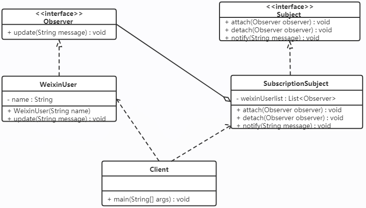


`Subject`：抽象主题角色类

```java
/**
 * @Description: 抽象主题角色类
 */
public interface Subject {

    //添加订阅者（添加观察者对象）
    void attach(Observer observer);

    //删除订阅者
    void detach(Observer observer);

    //通知订阅者更新消息
    void notify(String message);
}
```

`Observer`：抽象观察者类

```java
/**
 * @Description: 抽象观察者类
 */
public interface Observer {

    void update(String message);
}
```

`SubscriptionSubject`：具体主题角色类

```java
import java.util.ArrayList;
import java.util.List;
/**
 * @Description: 具体主题角色类
 * 微信公众号是具体主题（具体被观察者），里面存储了订阅该公众号的微信用户，并实现了抽象主题中的方法
 */
public class SubscriptionSubject implements Subject {

    //定义一个集合，用来存储多个观察者对象
    private List<Observer> weiXinUserList = new ArrayList<Observer>();

    public void attach(Observer observer) {
        weiXinUserList.add(observer);
    }

    public void detach(Observer observer) {
        weiXinUserList.remove(observer);
    }

    public void notify(String message) {
        //遍历集合
        for (Observer observer : weiXinUserList) {
            //调用观察者对象中的update方法
            observer.update(message);
        }
    }
}
```

`WeiXinUser`：具体的观察者角色类

```java
/**
 * @Description: 具体的观察者角色类
 * 定义具体观察者类，微信用户是观察者，里面实现了更新的方法
 */
public class WeiXinUser implements Observer {

    private String name;

    public WeiXinUser(String name) {
        this.name = name;
    }

    public void update(String message) {
        System.out.println(name + "-" + message);
    }
}
```

`Client`：测试

```java
public class Client {
    public static void main(String[] args) {
        //1,创建公众号对象
        SubscriptionSubject subject = new SubscriptionSubject();

        //2,订阅公众号
        subject.attach(new WeiXinUser("孙悟空"));
        subject.attach(new WeiXinUser("猪悟能"));
        subject.attach(new WeiXinUser("沙悟净"));

        //3,码农公众号更新，发出消息给订阅者（观察者对象）
        subject.notify("码农公众号的专栏更新了！");
        /*
        孙悟空-码农公众号的专栏更新了！
        猪悟能-码农公众号的专栏更新了！
        沙悟净-码农公众号的专栏更新了！
         */
    }
}
```

##### 6.6.3 `JDK`中提供的实现

在 Java 中，通过 java.util.Observable 类和 java.util.Observer 接口定义了观察者模式，只要实现它们的子类就可以编写观察者模式实例。

1.**Observable类**

Observable 类是抽象目标类（被观察者），它有一个 Vector 集合成员变量，用于保存所有要通知的观察者对象，下面介绍它最重要的 3 个方法

* void addObserver(Observer o) 方法：用于将新的观察者对象添加到集合中

* void notifyObservers(Object arg) 方法：调用集合中的所有观察者对象的 update方法，通知它们数据发生改变。通常越晚加入集合的观察者越先得到通知

* void setChange() 方法：用来设置一个 boolean 类型的内部标志，注明目标对象发生了变化。当它为true时，notifyObservers() 才会通知观察者

2.**Observer 接口**

Observer 接口是抽象观察者，它监视目标对象的变化，当目标对象发生变化时，观察者得到通知，并调用 update 方法，进行相应的工作

3.**案例**

【例】警察抓小偷

> 警察抓小偷也可以使用观察者模式来实现，警察是观察者，小偷是被观察者。代码如下：

小偷是一个被观察者，所以需要继承Observable类

```java
public class Thief extends Observable {

    private String name;

    public Thief(String name) {
        this.name = name;
    }
    
    public void setName(String name) {
        this.name = name;
    }

    public String getName() {
        return name;
    }

    public void steal() {
        System.out.println("小偷：我偷东西了，有没有人来抓我！！！");
        super.setChanged(); //changed  = true
        super.notifyObservers();
    }
}

```

警察是一个观察者，所以需要让其实现Observer接口

```java
public class Policemen implements Observer {

    private String name;

    public Policemen(String name) {
        this.name = name;
    }
    public void setName(String name) {
        this.name = name;
    }

    public String getName() {
        return name;
    }

    @Override
    public void update(Observable o, Object arg) {
        System.out.println("警察：" + ((Thief) o).getName() + "，我已经盯你很久了，你可以保持沉默，但你所说的将成为呈堂证供！！！");
    }
}
```

客户端代码

```java
public class Client {
    public static void main(String[] args) {
        //创建小偷对象
        Thief t = new Thief("隔壁老王");
        //创建警察对象
        Policemen p = new Policemen("小李");
        //让警察盯着小偷
        t.addObserver(p);
        //小偷偷东西
        t.steal();
    }
}
```

##### 6.6.4 `GPT`补充

观察者模式（Observer Pattern）：

- 观察者模式是一种行为设计模式，它定义了一种一对多的依赖关系，使得一个对象状态发生改变时，所有依赖它的对象都会得到通知并自动更新。观察者模式主要用于事件驱动的场景，如GUI框架、事件监听器、消息订阅等

观察者模式角色组成：

1. Subject（主题/被观察者）：持有观察者的列表，可以添加、删除观察者，当自身状态发生变化时，通知所有观察者
2. Observer（观察者）：定义一个更新接口，当主题状态发生变化时，调用该接口更新自身状态
3. `ConcreteSubject`（具体主题）：具体的主题类，维护一个状态，当状态变化时，会通知所有注册的观察者
4. `ConcreteObserver`（具体观察者）：具体的观察者实现，当被通知时进行相应的更新

观察者模式的优点和缺点：

- 优点：

  - 解耦：观察者和被观察者之间是抽象耦合的，增加新的观察者不需要改变被观察者的代码

  - 可扩展性好：可以在不修改被观察者的情况下增加新的观察者类

  - 符合开闭原则：对扩展开放，对修改关闭

- 缺点：

  - 如果观察者很多，通知所有观察者的开销可能会比较大

  - 如果存在循环依赖，可能导致程序崩溃


JDK源码中的使用——`java.util.Observer`和`java.util.Observable`：

- Java标准库中的`java.util.Observer`接口和`java.util.Observable`类提供了对观察者模式的支持

- Observable：是一个被观察者类，具有以下关键方法：
  - `addObserver(Observer o)`：添加一个观察者
  - `deleteObserver(Observer o)`：删除一个观察者
  - `notifyObservers()`：通知所有观察者
  - `setChanged()`：标记对象已发生变化
- `Observer`接口定义了一个`update(Observable o, Object arg)`方法，当被观察对象的状态发生变化时会调用此方法
- 注意：`java.util.Observer`和`java.util.Observable`在Java 9之后已被标记为过时（deprecated），因为其设计不够灵活（例如，不支持泛型），建议使用`java.beans`包下的`PropertyChangeListener`或其他事件模型来实现观察者模式

- 示例代码：

```java
import java.util.Observable;
import java.util.Observer;

class Subject extends Observable {
    private String state;

    public void setState(String state) {
        this.state = state;
        setChanged(); // 标记状态已改变
        notifyObservers(state); // 通知所有观察者
    }
}

class ConcreteObserver implements Observer {
    private String name;

    public ConcreteObserver(String name) {
        this.name = name;
    }

    @Override
    public void update(Observable o, Object arg) {
        System.out.println(name + " received update: " + arg);
    }
}

public class ObserverPatternDemo {
    public static void main(String[] args) {
        Subject subject = new Subject();
        ConcreteObserver observer1 = new ConcreteObserver("Observer 1");
        ConcreteObserver observer2 = new ConcreteObserver("Observer 2");

        subject.addObserver(observer1);
        subject.addObserver(observer2);

        subject.setState("New State");
    }
}

运行结果：
        Observer 1 received update: New State
        Observer 2 received update: New State
```

框架源码中的使用——Spring中的观察者模式：

- 在Java的各种框架中，Spring是观察者模式的典型应用之一。Spring的事件驱动模型基于观察者模式，允许开发者在Spring容器中实现事件的发布和监听
- Spring的事件驱动模型：
  - 事件（Event）：事件类通常继承自`ApplicationEvent`，表示在Spring容器中发生的特定事件
  - 事件监听器（Listener）：实现`ApplicationListener`接口，定义具体的事件处理逻辑。可以通过注解（如`@EventListener`）来声明一个方法为事件监听方法
  - 事件发布者（Publisher）：通过调用`ApplicationEventPublisher`的`publishEvent()`方法来发布事件

示例代码：

```java
import org.springframework.context.ApplicationEvent;
import org.springframework.context.ApplicationListener;
import org.springframework.context.event.ContextRefreshedEvent;
import org.springframework.stereotype.Component;
import org.springframework.context.ApplicationEventPublisher;
import org.springframework.context.ApplicationEventPublisherAware;
import org.springframework.context.annotation.AnnotationConfigApplicationContext;

// 自定义事件
class CustomEvent extends ApplicationEvent {
    public CustomEvent(Object source) {
        super(source);
    }

    @Override
    public String toString() {
        return "Custom Event Occurred";
    }
}

// 事件监听器
@Component
class CustomEventListener implements ApplicationListener<CustomEvent> {
    @Override
    public void onApplicationEvent(CustomEvent event) {
        System.out.println("Received: " + event);
    }
}

// 事件发布者
@Component
class CustomEventPublisher implements ApplicationEventPublisherAware {
    private ApplicationEventPublisher publisher;

    @Override
    public void setApplicationEventPublisher(ApplicationEventPublisher publisher) {
        this.publisher = publisher;
    }

    public void publish() {
        CustomEvent event = new CustomEvent(this);
        publisher.publishEvent(event);
    }
}

public class SpringObserverPatternDemo {
    public static void main(String[] args) {
        AnnotationConfigApplicationContext context = new AnnotationConfigApplicationContext(SpringObserverPatternDemo.class.getPackage().getName());
        CustomEventPublisher publisher = context.getBean(CustomEventPublisher.class);
        publisher.publish();
        context.close();
    }
}
// 运行结果：
// Received: Custom Event Occurred
```

在这个示例中，`CustomEventListener`是观察者，`CustomEventPublisher`是被观察者（事件发布者），`CustomEvent`是事件对象。Spring使用`ApplicationContext`来管理事件的注册和通知过程，从而实现观察者模式的功能

### 6.7 中介者模式

##### 6.7.1 简介

introduce：

- 一般来说，同事类之间的关系是比较复杂的，多个同事类之间互相关联时，他们之间的关系会呈现为复杂的网状结构，这是一种过度耦合的架构，即不利于类的复用，也不稳定。例如在下左图中，有六个同事类对象，假如对象1发生变化，那么将会有4个对象受到影响。如果对象2发生变化，那么将会有5个对象受到影响。也就是说，同事类之间直接关联的设计是不好的


- 如果引入中介者模式，那么同事类之间的关系将变为星型结构，从下右图中可以看到，任何一个类的变动，只会影响的类本身，以及中介者，这样就减小了系统的耦合。一个好的设计，必定不会把所有的对象关系处理逻辑封装在本类中，而是使用一个专门的类来管理那些不属于自己的行为

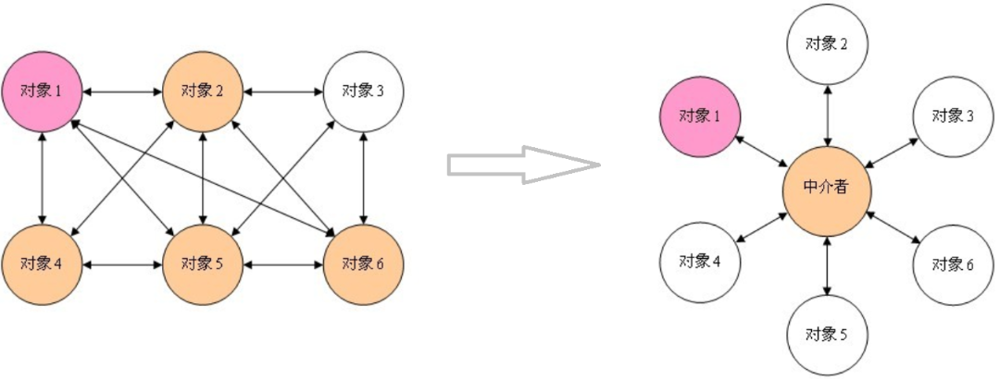

中介者模式：

- 又叫调停模式，定义一个中介角色来封装一系列对象之间的交互，使原有对象之间的耦合松散，且可以独立地改变它们之间的交互


中介者模式包含以下主要角色：

* 抽象中介者（Mediator）角色：它是中介者的接口，提供了同事对象注册与转发同事对象信息的抽象方法

* 具体中介者（ConcreteMediator）角色：实现中介者接口，定义一个 List 来管理同事对象，协调各个同事角色之间的交互关系，因此它依赖于同事角色
* 抽象同事类（Colleague）角色：定义同事类的接口，保存中介者对象，提供同事对象交互的抽象方法，实现所有相互影响的同事类的公共功能
* 具体同事类（Concrete Colleague）角色：是抽象同事类的实现者，当需要与其他同事对象交互时，由中介者对象负责后续的交互

中介者模式优缺点：

- 优点：

  * 松散耦合：中介者模式通过把多个同事对象之间的交互封装到中介者对象里面，从而使得同事对象之间松散耦合，基本上可以做到互补依赖。这样一来，同事对象就可以独立地变化和复用，而不再像以前那样“牵一处而动全身”了


  * 集中控制交互：多个同事对象的交互，被封装在中介者对象里面集中管理，使得这些交互行为发生变化的时候，只需要修改中介者对象就可以了，当然如果是已经做好的系统，那么就扩展中介者对象，而各个同事类不需要做修改


  * 一对多关联转变为一对一的关联：没有使用中介者模式的时候，同事对象之间的关系通常是一对多的，引入中介者对象以后，中介者对象和同事对象的关系通常变成双向的一对一，这会让对象的关系更容易理解和实现

- 缺点：

  - 当同事类太多时，中介者的职责将很大，它会变得复杂而庞大，以至于系统难以维护

使用场景：

* 系统中对象之间存在复杂的引用关系，系统结构混乱且难以理解
* 当想创建一个运行于多个类之间的对象，又不想生成新的子类时

##### 6.7.2 案例

【例】租房

> 现在租房基本都是通过房屋中介，房主将房屋托管给房屋中介，而租房者从房屋中介获取房屋信息。房屋中介充当租房者与房屋所有者之间的中介者

类图如下：

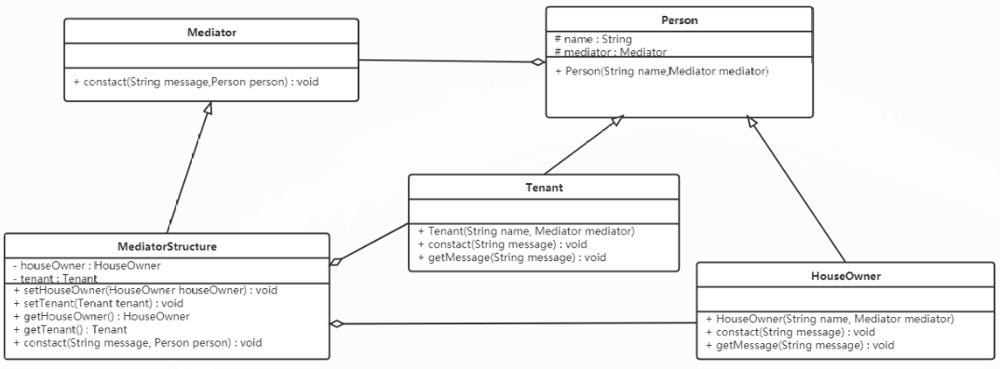

`Mediator`：抽象中介者类

```java
/**
 * @Description: 抽象中介者类
 */
public abstract class Mediator {

    public abstract void constact(String message,Person person);
}
```

`Person`：抽象同事类

```java
/**
 * @Description: 抽象同事类
 */
public abstract class Person {

    protected String name;
    protected Mediator mediator;

    public Person(String name, Mediator mediator) {
        this.name = name;
        this.mediator = mediator;
    }
}
```

`Tenant`：具体的同事角色类

```java
/**
 * @Description: 具体的同事角色类
 */
public class Tenant extends Person {
    public Tenant(String name, Mediator mediator) {
        super(name, mediator);
    }

    //和中介联系（沟通）
    public void constact(String message) {
        mediator.constact(message,this);
    }

    //获取信息
    public void getMessage(String message) {
        System.out.println("租房者" + name + "获取到的信息是：" + message);
    }
}
```

`HouseOwner`：具体的同事角色类

```java
/**
 * @Description: 具体的同事角色类
 */
public class HouseOwner extends Person {

    public HouseOwner(String name, Mediator mediator) {
        super(name, mediator);
    }

    //和中介联系（沟通）
    public void constact(String message) {
        mediator.constact(message,this);
    }

    //获取信息
    public void getMessage(String message) {
        System.out.println("房主" + name + "获取到的信息是：" + message);
    }
}
```

`MediatorStructure`：具体的中介者角色类

```java
/**
 * @Description: 具体的中介者角色类
 */
public class MediatorStructure extends Mediator {

    //聚合房主和租房者对象
    private HouseOwner houseOwner;
    private Tenant tenant;

    public HouseOwner getHouseOwner() {
        return houseOwner;
    }

    public void setHouseOwner(HouseOwner houseOwner) {
        this.houseOwner = houseOwner;
    }

    public Tenant getTenant() {
        return tenant;
    }

    public void setTenant(Tenant tenant) {
        this.tenant = tenant;
    }

    public void constact(String message, Person person) {
        if(person == houseOwner) {
            tenant.getMessage(message);
        } else {
            houseOwner.getMessage(message);
        }
    }
}
```

`Client`：测试

```java
public class Client {
    public static void main(String[] args) {
        //创建中介者对象
        MediatorStructure mediator = new MediatorStructure();

        //创建租房者对象
        Tenant tenant = new Tenant("李四",mediator);
        //创建房主对象
        HouseOwner houseOwner = new HouseOwner("张三",mediator);

        //中介者要知道具体的房主和租房者
        mediator.setTenant(tenant);
        mediator.setHouseOwner(houseOwner);

        tenant.constact("我要租三室的房子！！！");
        houseOwner.constact("我这里有三室的房子，你要租吗？");
        /*
        房主张三获取到的信息是：我要租三室的房子！！！
        租房者李四获取到的信息是：我这里有三室的房子，你要租吗？
         */
    }
}
```

##### 6.7.3 `JDK`源码|框架源码中的应用

1.`java.util.Timer` 

- `java.util.Timer` 类通过中介者模式来协调 `TimerTask` 对象之间的关系。在 `Timer` 中，有多个定时任务 `TimerTask`，这些任务由 `Timer` 负责调度。`Timer` 作为中介者，管理和协调这些定时任务的执行，避免定时任务之间的相互依赖，控制任务的调度过程

2.`java.util.concurrent.Executor`

-  `Executor` 接口也应用了中介者模式。线程池管理不同的任务，通过中介者模式，由 `Executor` 来调度和协调任务的执行，而每个任务之间并不直接相互依赖。任务提交到线程池后，由线程池内部负责任务的调度、线程的分配等

3.`Spring MVC 中的 DispatcherServlet`

- 在 Spring MVC 中，`DispatcherServlet` 就是一个典型的中介者模式的例子。`DispatcherServlet` 作为中央控制器，负责接收请求，并将其分发给相应的处理器（如控制器、视图解析器等）。在整个请求处理过程中，控制器、视图解析器、异常处理器等对象不直接交互，而是通过 `DispatcherServlet` 进行调度和管理

```java
public class DispatcherServlet extends FrameworkServlet {
    protected void doDispatch(HttpServletRequest request, HttpServletResponse response) throws Exception {
        // 中介者模式的体现：控制整个请求的流程调度
    }
}
```


##### 6.7.4 `GPT`补充

中介者模式：

- 中介者模式（Mediator Pattern）是一种行为设计模式，它定义了一个中介对象来封装对象之间的交互。通过使用中介者，系统中各个对象之间的复杂耦合关系得以简化，多个对象的交互变成通过中介者进行，避免了对象之间的直接依赖，从而提高了代码的灵活性和可维护性

优点：

1. 减少了类与类之间的依赖关系，使得系统结构更加松耦合
2. 中介者集中管理了对象的交互行为，可以更容易的扩展和维护
3. 简化了对象间的通信方式，避免了网状依赖结构

缺点：

1. 如果中介者对象变得过于复杂，它将演变成一个“上帝对象”，系统的维护难度将大大增加


中介者模式的结构：

- Mediator（中介者接口）：定义各同事类之间交互的接口
- `ConcreteMediator`（具体中介者）：实现中介者接口，协调各同事类之间的交互
- Colleague（同事类）：各个具体的交互类，这些类通过中介者进行通信


案例：

- 实现一个简单的聊天室程序，多个用户通过中介者（聊天室）进行通信，而不是直接互相发送消息

1.定义中介者接口

```java
// 中介者接口
public interface ChatMediator {
    void sendMessage(String message, User user);
    void addUser(User user);
}
```

2.实现具体的中介者

```java
// 具体中介者类
import java.util.ArrayList;
import java.util.List;

public class ChatMediatorImpl implements ChatMediator {
    private List<User> users;

    public ChatMediatorImpl() {
        this.users = new ArrayList<>();
    }

    @Override
    public void addUser(User user) {
        this.users.add(user);
    }

    @Override
    public void sendMessage(String message, User user) {
        for (User u : this.users) {
            // 消息不会发送给消息的发送者自己
            if (u != user) {
                u.receive(message);
            }
        }
    }
}
```

3.定义用户类（同事类）

```java
// 用户抽象类
public abstract class User {
    protected ChatMediator mediator;
    protected String name;

    public User(ChatMediator mediator, String name) {
        this.mediator = mediator;
        this.name = name;
    }

    public abstract void send(String message);
    public abstract void receive(String message);
}
```

4.实现具体用户类

```java
// 具体的用户类
public class UserImpl extends User {

    public UserImpl(ChatMediator mediator, String name) {
        super(mediator, name);
    }

    @Override
    public void send(String message) {
        System.out.println(this.name + " 发送消息: " + message);
        mediator.sendMessage(message, this);
    }

    @Override
    public void receive(String message) {
        System.out.println(this.name + " 接收到消息: " + message);
    }
}
```

5. 客户端代码

```java
public class MediatorPatternDemo {
    public static void main(String[] args) {
        ChatMediator chatMediator = new ChatMediatorImpl();

        User user1 = new UserImpl(chatMediator, "Alice");
        User user2 = new UserImpl(chatMediator, "Bob");
        User user3 = new UserImpl(chatMediator, "Charlie");
        User user4 = new UserImpl(chatMediator, "David");

        chatMediator.addUser(user1);
        chatMediator.addUser(user2);
        chatMediator.addUser(user3);
        chatMediator.addUser(user4);

        user1.send("大家好！");
        user2.send("你好，Alice！");
    }
}
            /*
            运行结果
            Alice 发送消息: 大家好！
            Bob 接收到消息: 大家好！
            Charlie 接收到消息: 大家好！
            David 接收到消息: 大家好！
            Bob 发送消息: 你好，Alice！
            Alice 接收到消息: 你好，Alice！
            Charlie 接收到消息: 你好，Alice！
            David 接收到消息: 你好，Alice！
            */
```


### 6.8 迭代器模式

##### 6.8.1 简介

迭代器模式：

- 提供一个对象来顺序访问聚合对象中的一系列数据，而不暴露聚合对象的内部表示 


迭代器模式结构：

* 抽象聚合（Aggregate）角色：定义存储、添加、删除聚合元素以及创建迭代器对象的接口

* 具体聚合（ConcreteAggregate）角色：实现抽象聚合类，返回一个具体迭代器的实例
* 抽象迭代器（Iterator）角色：定义访问和遍历聚合元素的接口，通常包含 hasNext()、next() 等方法
* 具体迭代器（Concretelterator）角色：实现抽象迭代器接口中所定义的方法，完成对聚合对象的遍历，记录遍历的当前位置


迭代器模式优缺点：

- 优点：

  * 它支持以不同的方式遍历一个聚合对象，在同一个聚合对象上可以定义多种遍历方式。在迭代器模式中只需要用一个不同的迭代器来替换原有迭代器即可改变遍历算法，也可以自己定义迭代器的子类以支持新的遍历方式

  * 迭代器简化了聚合类。由于引入了迭代器，在原有的聚合对象中不需要再自行提供数据遍历等方法，这样可以简化聚合类的设计

  * 在迭代器模式中，由于引入了抽象层，增加新的聚合类和迭代器类都很方便，无须修改原有代码，满足 “开闭原则” 的要求


- 缺点：
  - 增加了类的个数，这在一定程度上增加了系统的复杂性


使用场景：

* 当需要为聚合对象提供多种遍历方式时。
* 当需要为遍历不同的聚合结构提供一个统一的接口时。
* 当访问一个聚合对象的内容而无须暴露其内部细节的表示时。


##### 6.8.2 案例

【例】定义一个可以存储学生对象的容器对象，将遍历该容器的功能交由迭代器实现，涉及到的类如下：

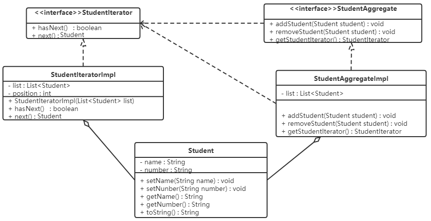

`Student`：学生类

```java
public class Student {
    private String name;
    private String number;

    @Override
    public String toString() {
        return "Student{" +
                "name='" + name + '\'' +
                ", number='" + number + '\'' +
                '}';
    }

    public String getName() {
        return name;
    }

    public void setName(String name) {
        this.name = name;
    }

    public String getNumber() {
        return number;
    }

    public void setNumber(String number) {
        this.number = number;
    }

    public Student(String name, String number) {
        this.name = name;
        this.number = number;
    }

    public Student() {
    }
}
```

`StudentIterator`：抽象迭代器角色接口

```java
/**
 * @Description: 抽象迭代器角色接口
 * 定义迭代器接口，声明hasNext、next方法
 */
public interface StudentIterator {

    //判断是否还有元素
    boolean hasNext();

    //获取下一个元素
    Student next();
}
```

`StudentIteratorImpl`：具体迭代器角色类

```java
import java.util.List;
/**
 * @Description: 具体迭代器角色类
 * 定义具体的迭代器类，重写所有的抽象方法
 */
public class StudentIteratorImpl implements StudentIterator {

    private List<Student> list;
    private int position = 0;//用来记录遍历时的位置

    public StudentIteratorImpl(List<Student> list) {
        this.list = list;
    }

    public boolean hasNext() {
        return position < list.size();
    }

    public Student next() {
        //从集合中获取指定位置的元素
        Student currentStudent = list.get(position);
        position++;
        return currentStudent;
    }
}
```

`StudentAggregate`：抽象聚合角色接口

```java
/**
 * @Description: 抽象聚合角色接口
 * 定义抽象容器类，包含添加元素，删除元素，获取迭代器对象的方法
 */
public interface StudentAggregate {

    //添加学生功能
    void addStudent(Student stu);

    //删除学生功能
    void removeStudent(Student stu);

    //获取迭代器对象功能
    StudentIterator getStudentIterator();
}
```

`StudentAggregateImpl`：定义具体的容器类，重写所有的方法

```java
// 定义具体的容器类，重写所有的方法
import java.util.ArrayList;
import java.util.List;
public class StudentAggregateImpl implements StudentAggregate {

    private List<Student> list = new ArrayList<Student>();

    public void addStudent(Student stu) {
        list.add(stu);
    }

    public void removeStudent(Student stu) {
        list.remove(stu);
    }

    //获取迭代器对象
    public StudentIterator getStudentIterator() {
        return new StudentIteratorImpl(list);
    }
}
```

`Client`：测试

```java
public class Client {
    public static void main(String[] args) {
        //创建聚合对象
        StudentAggregateImpl aggregate = new StudentAggregateImpl();
        //添加元素
        aggregate.addStudent(new Student("张三","001"));
        aggregate.addStudent(new Student("李四","002"));
        aggregate.addStudent(new Student("王五","003"));
        aggregate.addStudent(new Student("赵六","004"));

        //遍历聚合对象

        //1,获取迭代器对象
        StudentIterator iterator = aggregate.getStudentIterator();
        //2,遍历
        while(iterator.hasNext()) {
            //3,获取元素
            Student student = iterator.next();
            System.out.println(student.toString());
        }
        /*
        Student{name='张三', number='001'}
        Student{name='李四', number='002'}
        Student{name='王五', number='003'}
        Student{name='赵六', number='004'}
         */
    }
}
```

##### 6.8.3 `JDK`源码中的应用

迭代器模式在JAVA的很多集合类中被广泛应用，接下来看看JAVA源码中是如何使用迭代器模式的

```java
List<String> list = new ArrayList<>();
Iterator<String> iterator = list.iterator(); //list.iterator()方法返回的肯定是Iterator接口的子实现类对象
while (iterator.hasNext()) {
    System.out.println(iterator.next());
}
```

看完这段代码是不是很熟悉，与上面代码基本类似。单列集合都使用到了迭代器，以ArrayList举例来说明

- List：抽象聚合类
- ArrayList：具体的聚合类
- Iterator：抽象迭代器
- list.iterator()：返回的是实现了 `Iterator` 接口的具体迭代器对象

具体的来看看 ArrayList的代码实现

```java
public class ArrayList<E> extends AbstractList<E>
        implements List<E>, RandomAccess, Cloneable, java.io.Serializable {
    
    public Iterator<E> iterator() {
        return new Itr();
    }
    
    private class Itr implements Iterator<E> {
        int cursor;       // 下一个要返回元素的索引
        int lastRet = -1; // 上一个返回元素的索引
        int expectedModCount = modCount;

        Itr() {}
		
        //判断是否还有元素
        public boolean hasNext() {
            return cursor != size;
        }

        //获取下一个元素
        public E next() {
            checkForComodification();
            int i = cursor;
            if (i >= size)
                throw new NoSuchElementException();
            Object[] elementData = ArrayList.this.elementData;
            if (i >= elementData.length)
                throw new ConcurrentModificationException();
            cursor = i + 1;
            return (E) elementData[lastRet = i];
        }
        ...
}
```

这部分代码还是比较简单，大致就是在 `iterator` 方法中返回了一个实例化的 `Iterator` 对象。Itr是一个内部类，它实现了 `Iterator` 接口并重写了其中的抽象方法

> 注意： 在开发中，想使用迭代器模式的话，只要让自己定义的容器类实现`java.util.Iterable`并实现其中的iterator()方法使其返回一个 `java.util.Iterator` 的实现类就可以了


##### 6.8.4 `GPT`补充

迭代器模式：

- 迭代器模式（Iterator Pattern）是一种行为设计模式，提供了一种方法顺序访问聚合对象中的各个元素，而又不暴露其内部的表示。在不暴露对象内部结构的情况下，让外部代码能够透明地遍历对象的内部数据

迭代器模式的组成部分：

1. 迭代器接口（Iterator Interface）：定义了遍历元素的方法，如 `next()` 和 `hasNext()`
2. 具体迭代器（Concrete Iterator）：实现迭代器接口，负责遍历集合中的元素
3. 聚合接口（Aggregate Interface）：定义创建迭代器的方法
4. 具体聚合（Concrete Aggregate）：实现聚合接口，返回一个具体迭代器的实例


案例：

- 自定义一个集合类 `NameRepository`，其中存储了一组名称。要为这个集合创建一个迭代器，使得可以顺序访问这些名称


1.定义迭代器接口

```java
interface Iterator {
    boolean hasNext();
    Object next();
}
```

2.定义聚合接口

```java
interface Container {
    Iterator getIterator();
}
```

4.实现具体聚合类

```java
class NameRepository implements Container {
    public String names[] = {"John", "Jane", "Michael", "Sarah"};

    @Override
    public Iterator getIterator() {
        return new NameIterator();
    }

    // 内部类实现具体迭代器
    private class NameIterator implements Iterator {
        int index;

        @Override
        public boolean hasNext() {
            return index < names.length;
        }

        @Override
        public Object next() {
            if (this.hasNext()) {
                return names[index++];
            }
            return null;
        }
    }
}
```

4.使用迭代器模式

```java
public class IteratorPatternDemo {
    public static void main(String[] args) {
        NameRepository nameRepository = new NameRepository();

        for (Iterator iter = nameRepository.getIterator(); iter.hasNext(); ) {
            String name = (String) iter.next();
            System.out.println("Name : " + name);
        }
    }
}
```


### 6.9 访问者模式

##### 6.9.1 简介

访问者模式：

- 封装一些作用于某种数据结构中的各元素的操作，它可以在不改变这个数据结构的前提下定义作用于这些元素的新的操作


访问者模式结构：

* 抽象访问者（Visitor）角色：定义了对每一个元素`（Element）`访问的行为，它的参数就是可以访问的元素，它的方法个数理论上来讲与元素类个数（Element的实现类个数）是一样的，从这点不难看出，访问者模式要求元素类的个数不能改变
* 具体访问者（ConcreteVisitor）角色：给出对每一个元素类访问时所产生的具体行为
* 抽象元素（Element）角色：定义了一个接受访问者的方法（`accept`），其意义是指，每一个元素都要可以被访问者访问
* 具体元素（ConcreteElement）角色： 提供接受访问方法的具体实现，而这个具体的实现，通常情况下是使用访问者提供的访问该元素类的方法
* 对象结构（Object Structure）角色：定义当中所提到的对象结构，对象结构是一个抽象表述，具体点可以理解为一个具有容器性质或者复合对象特性的类，它会含有一组元素（`Element`），并且可以迭代这些元素，供访问者访问

访问者模式优缺点：

- 优点：

  * 扩展性好：在不修改对象结构中的元素的情况下，为对象结构中的元素添加新的功能


  * 复用性好：通过访问者来定义整个对象结构通用的功能，从而提高复用程度


  * 分离无关行为：通过访问者来分离无关的行为，把相关的行为封装在一起，构成一个访问者，这样每一个访问者的功能都比较单一

- 缺点：

  * 对象结构变化很困难：在访问者模式中，每增加一个新的元素类，都要在每一个具体访问者类中增加相应的具体操作，这违背了“开闭原则”


  * 违反了依赖倒置原则：访问者模式依赖了具体类，而没有依赖抽象类


使用场景：

* 对象结构相对稳定，但其操作算法经常变化的程序

* 对象结构中的对象需要提供多种不同且不相关的操作，而且要避免让这些操作的变化影响对象的结构

##### 6.9.2 案例

【例】给宠物喂食

> 现在养宠物的人特别多，就以这个为例，当然宠物还分为狗，猫等，要给宠物喂食的话，主人可以喂，其他人也可以喂食
>
> - 访问者角色：给宠物喂食的人
> - 具体访问者角色：主人、其他人
> - 抽象元素角色：动物抽象类
> - 具体元素角色：宠物狗、宠物猫
> - 结构对象角色：主人家

类图如下：

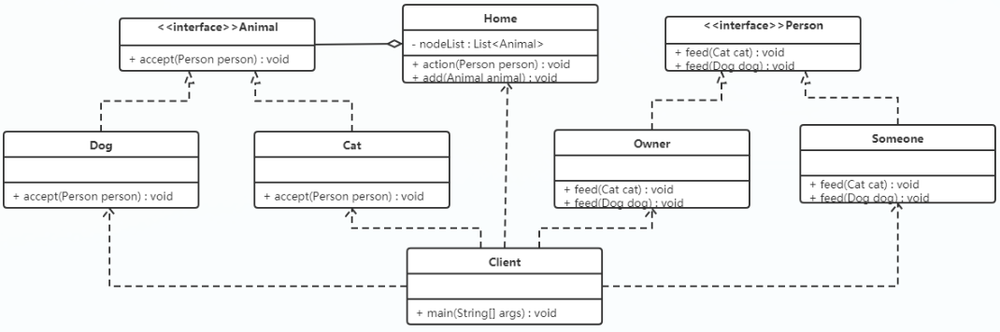

`Person`：抽象访问者角色类

```java
/**
 * @Description: 抽象访问者角色类
 */
public interface Person {

    //喂食宠物狗
    void feed(Cat cat);
    //喂食宠物猫
    void feed(Dog dog);
}
```

`Animal`：抽象元素角色类

```java
/**
 * @Description: 抽象元素角色类
 */
public interface Animal {

    //接受访问者访问的功能
    void accept(Person person);
}
```

`Cat`：具体元素角色类（宠物猫）

```java
/**
 * @Description: 具体元素角色类（宠物猫）
 */
public class Cat implements Animal {

    public void accept(Person person) {
        person.feed(this); //访问者给宠物猫喂食
        System.out.println("好好吃，喵喵喵。。。");
    }
}
```

`Dog`：具体元素角色类（宠物狗）

```java
/**
 * @Description: 具体元素角色类（宠物狗）
 */
public class Dog implements Animal {

    public void accept(Person person) {
        person.feed(this); //访问者给宠物猫喂食
        System.out.println("好好吃，汪汪汪。。。");
    }
}
```

`Owner`：具体访问者角色类(自己)

```java
/**
 * @Description: 具体访问者角色类(自己)
 */
public class Owner implements Person {

    public void feed(Cat cat) {
        System.out.println("主人喂食猫");
    }

    public void feed(Dog dog) {
        System.out.println("主人喂食狗");
    }
}
```

`Someone`：具体访问者角色类(其他人)

```java
/**
 * @Description: 具体访问者角色类(其他人)
 */
public class Someone implements Person {

    public void feed(Cat cat) {
        System.out.println("其他人喂食猫");
    }

    public void feed(Dog dog) {
        System.out.println("其他人喂食狗");
    }
}
```

`Home`：对象结构类

```java
import java.util.ArrayList;
import java.util.List;
/**
 * @Description: 对象结构类
 */
public class Home {

    //声明一个集合对象，用来存储元素对象
    private List<Animal> nodeList = new ArrayList<Animal>();

    //添加元素功能
    public void add(Animal animal) {
        nodeList.add(animal);
    }

    public void action(Person person) {
        //遍历集合，获取每一个元素，让访问者访问每一个元素
        for (Animal animal : nodeList) {
            animal.accept(person);
        }
    }
}
```

`Client`：测试

```java
public class Client {
    public static void main(String[] args) {
        //创建Home对象
        Home home = new Home();
        //添加元素到Home对象中
        home.add(new Dog());
        home.add(new Cat());

        //创建主人对象
        Owner owner = new Owner();
        //让主人喂食所有的宠物
        home.action(owner);
        /*
        主人喂食狗
        好好吃，汪汪汪。。。
        主人喂食猫
        好好吃，喵喵喵。。。
         */
    }
}
```

##### 6.9.3 扩展

访问者模式用到了一种双分派的技术


分派：

- 变量被声明时的类型叫做变量的静态类型，有些人又把静态类型叫做明显类型；而变量所引用的对象的真实类型又叫做变量的实际类型。比如 `Map map = new HashMap()` ，map变量的静态类型是 `Map` ，实际类型是 `HashMap` 。根据对象的类型而对方法进行的选择，就是分派(Dispatch)，分派(Dispatch)又分为两种，即静态分派和动态分派
- **静态分派(Static Dispatch)** 发生在编译时期，分派根据静态类型信息发生。静态分派对于我们来说并不陌生，方法重载就是静态分派
- **动态分派(Dynamic Dispatch)** 发生在运行时期，动态分派动态地置换掉某个方法。Java通过方法的重写支持动态分派


动态分派：

- 通过方法的重写支持动态分派


```java
public class Animal {
    public void execute() {
        System.out.println("Animal");
    }
}

public class Dog extends Animal {
    @Override
    public void execute() {
        System.out.println("dog");
    }
}

public class Cat extends Animal {
     @Override
    public void execute() {
        System.out.println("cat");
    }
}

public class Client {
   	public static void main(String[] args) {
        Animal a = new Dog();
        a.execute();
        
        Animal a1 = new Cat();
        a1.execute();
    }
}
```

上面代码的结果大家应该直接可以说出来，这不就是多态吗！运行执行的是子类中的方法（编译看左边，运行看右边）

Java编译器在编译时期并不总是知道哪些代码会被执行，因为编译器仅仅知道对象的静态类型，而不知道对象的真实类型；而方法的调用则是根据对象的真实类型，而不是静态类型


静态分派：

- 通过方法重载支持静态分派


```java
public class Animal {
}

public class Dog extends Animal {
}

public class Cat extends Animal {
}

public class Execute {
    public void execute(Animal a) {
        System.out.println("Animal");
    }

    public void execute(Dog d) {
        System.out.println("dog");
    }

    public void execute(Cat c) {
        System.out.println("cat");
    }
}

public class Client {
    public static void main(String[] args) {
        Animal a = new Animal();
        Animal a1 = new Dog();
        Animal a2 = new Cat();

        Execute exe = new Execute();
        exe.execute(a);
        exe.execute(a1);
        exe.execute(a2);
    }
}
/*运行结果
            Animal
            Animal
            Animal
*/
```

运行结果可能出乎一些人的意料了，为什么呢？

- **重载方法的分派是根据静态类型进行的，这个分派过程在编译时期就完成了**


双分派：

- 所谓双分派技术就是在选择一个方法的时候，不仅仅要根据消息接收者（receiver）的运行时区别，还要根据参数的运行时区别


```java
public class Animal {
    public void accept(Execute exe) {
        exe.execute(this);
    }
}

public class Dog extends Animal {
    public void accept(Execute exe) {
        exe.execute(this);
    }
}

public class Cat extends Animal {
    public void accept(Execute exe) {
        exe.execute(this);
    }
}

public class Execute {
    public void execute(Animal a) {
        System.out.println("animal");
    }

    public void execute(Dog d) {
        System.out.println("dog");
    }

    public void execute(Cat c) {
        System.out.println("cat");
    }
}

public class Client {
    public static void main(String[] args) {
        Animal a = new Animal();
        Animal d = new Dog();
        Animal c = new Cat();

        Execute exe = new Execute();
        a.accept(exe);
        d.accept(exe);
        c.accept(exe);
    }
}
        /*运行结果
            animal
            dog
            cat
        */
```

在上面代码中，客户端将Execute对象做为参数传递给Animal类型的变量调用的方法，这里完成第一次分派，这里是方法重写，所以是动态分派，也就是执行实际类型中的方法，同时也`将自己this作为参数传递进去，这里就完成了第二次分派`，这里的Execute类中有多个重载的方法，而传递进行的是this，就是具体的实际类型的对象

说到这里，已经明白双分派是怎么回事了，但是它有什么效果呢？就是可以实现方法的动态绑定

**双分派实现动态绑定的本质，就是在重载方法委派的前面加上了继承体系中覆盖的环节，由于覆盖是动态的，所以重载就是动态的**

##### 6.9.4 `GPT`补充

访问者模式：

- 访问者模式是一种行为型设计模式，允许在不修改对象结构的情况下定义作用于这些对象的新操作。通过将操作封装到访问者中，可以实现操作和对象结构的分离。它主要用于数据结构相对稳定，而操作经常变化的场景

访问者模式的主要角色：

1. 抽象访问者（Visitor）：定义一个访问者接口，声明一组用于访问元素的方法
2. 具体访问者（ConcreteVisitor）：实现抽象访问者，定义每个元素对应的访问操作
3. 抽象元素（Element）：定义一个接口，声明接受访问者的方法（`accept`），使得访问者能够访问其数据
4. 具体元素（ConcreteElement）：实现抽象元素，定义如何接收访问者（`accept`）的访问
5. 对象结构（ObjectStructure）：表示包含不同类型元素的对象集合，它能够迭代这些元素，并且允许访问者访问这些元素

访问者模式的优缺点：

- 优点：
  - 符合单一职责原则：将不同的操作分离到访问者中，避免元素类臃肿
  - 符合开闭原则：如果需要增加新的操作，直接增加新的访问者，而不需要修改已有元素类
- 缺点：
  - 元素类的修改较为困难：当需要增加新的元素类时，需要在所有访问者中添加新的访问方法
  - 增加系统复杂性：每增加一种新的访问者，元素类和访问者类都会相应增加代码复杂度


访问者模式示例：

1.访问者接口（Visitor）

```java
// 抽象访问者
interface Visitor {
    void visit(Book book);
    void visit(Fruit fruit);
}
```

2.具体访问者（ConcreteVisitor）

```java
// 具体访问者：用于计算商品的价格
class PriceVisitor implements Visitor {
    @Override
    public void visit(Book book) {
        System.out.println("Book Price: " + book.getPrice());
    }

    @Override
    public void visit(Fruit fruit) {
        System.out.println("Fruit Price: " + fruit.getPrice());
    }
}

// 具体访问者：用于统计商品的税额
class TaxVisitor implements Visitor {
    @Override
    public void visit(Book book) {
        System.out.println("Book Tax: " + book.getPrice() * 0.1);  // 假设税率10%
    }

    @Override
    public void visit(Fruit fruit) {
        System.out.println("Fruit Tax: " + fruit.getPrice() * 0.05);  // 假设税率5%
    }
}
```

3.元素接口（Element）

```java
// 抽象元素
interface ItemElement {
    void accept(Visitor visitor);
}
```

4.具体元素（ConcreteElement）

```java
// 具体元素：书籍
class Book implements ItemElement {
    private double price;
    private String isbn;

    public Book(double price, String isbn) {
        this.price = price;
        this.isbn = isbn;
    }

    public double getPrice() {
        return price;
    }

    public String getIsbn() {
        return isbn;
    }

    @Override
    public void accept(Visitor visitor) {
        visitor.visit(this);
    }
}

// 具体元素：水果
class Fruit implements ItemElement {
    private double price;
    private double weight;
    private String name;

    public Fruit(double price, double weight, String name) {
        this.price = price;
        this.weight = weight;
        this.name = name;
    }

    public double getPrice() {
        return price;
    }

    public double getWeight() {
        return weight;
    }

    public String getName() {
        return name;
    }

    @Override
    public void accept(Visitor visitor) {
        visitor.visit(this);
    }
}
```

5.对象结构（ObjectStructure）

```java
// 对象结构，包含不同的商品
class ShoppingCart {
    private List<ItemElement> items = new ArrayList<>();

    public void addItem(ItemElement item) {
        items.add(item);
    }

    public void applyVisitor(Visitor visitor) {
        for (ItemElement item : items) {
            item.accept(visitor);
        }
    }
}
```

6.客户端代码

```java
public class VisitorPatternDemo {
    public static void main(String[] args) {
        ShoppingCart cart = new ShoppingCart();

        // 添加商品
        cart.addItem(new Book(100, "12345"));
        cart.addItem(new Fruit(10, 2, "Apple"));

        // 使用 PriceVisitor 计算价格
        PriceVisitor priceVisitor = new PriceVisitor();
        System.out.println("Calculating Prices:");
        cart.applyVisitor(priceVisitor);

        // 使用 TaxVisitor 计算税
        TaxVisitor taxVisitor = new TaxVisitor();
        System.out.println("\nCalculating Taxes:");
        cart.applyVisitor(taxVisitor);
    }
}
    /*输出结果
                Calculating Prices:
                Book Price: 100.0
                Fruit Price: 10.0

                Calculating Taxes:
                Book Tax: 10.0
                Fruit Tax: 0.5
    */
```

总结：访问者模式将数据结构与操作解耦，能够灵活添加新的操作。但是在需要频繁添加新的元素类的场景下，访问者模式会显得不太灵活

### 6.10 备忘录模式

##### 6.10.1 简介

备忘录模式：

- 又叫快照模式，在不破坏封装性的前提下，捕获一个对象的内部状态，并在该对象之外保存这个状态，以便以后当需要时能将该对象恢复到原先保存的状态
- 备忘录模式提供了一种状态恢复的实现机制，使得用户可以方便地回到一个特定的历史步骤，当新的状态无效或者存在问题时，可以使用暂时存储起来的备忘录将状态复原，很多软件都提供了撤销（Undo）操作，如 Word、记事本、Photoshop、IDEA等软件在编辑时按 Ctrl+Z 组合键时能撤销当前操作，使文档恢复到之前的状态；还有在 浏览器 中的后退键、数据库事务管理中的回滚操作、玩游戏时的中间结果存档功能、数据库与操作系统的备份操作、棋类游戏中的悔棋功能等都属于这类

备忘录模式结构：

* 发起人（Originator）角色：记录当前时刻的内部状态信息，提供创建备忘录和恢复备忘录数据的功能，实现其他业务功能，它可以访问备忘录里的所有信息
* 备忘录（Memento）角色：负责存储发起人的内部状态，在需要的时候提供这些内部状态给发起人
* 管理者（Caretaker）角色：对备忘录进行管理，提供保存与获取备忘录的功能，但其不能对备忘录的内容进行访问与修改

> 备忘录有两个等效的接口：
>
> * **窄接口**：管理者(Caretaker)对象（和其他发起人对象之外的任何对象）看到的是备忘录的窄接口(narror Interface)，这个窄接口只允许他把备忘录对象传给其他的对象
> * **宽接口**：与管理者看到的窄接口相反，发起人对象可以看到一个宽接口(wide Interface)，这个宽接口允许它读取所有的数据，以便根据这些数据恢复这个发起人对象的内部状态


备忘录模式优缺点：

- 优点：

  - 提供了一种可以恢复状态的机制。当用户需要时能够比较方便地将数据恢复到某个历史的状态

  - 实现了内部状态的封装。除了创建它的发起人之外，其他对象都不能够访问这些状态信息

  - 简化了发起人类。发起人不需要管理和保存其内部状态的各个备份，所有状态信息都保存在备忘录中，并由管理者进行管理，这符合单一职责原则

- 缺点：

  * 资源消耗大。如果要保存的内部状态信息过多或者特别频繁，将会占用比较大的内存资源


使用场景：

* 需要保存与恢复数据的场景，如玩游戏时的中间结果的存档功能

* 需要提供一个可回滚操作的场景，如 Word、记事本、Photoshop，idea等软件在编辑时按 Ctrl+Z 组合键，还有数据库中事务操作


##### 6.10.2 案例

【例】游戏挑战BOSS

> 游戏中的某个场景，一游戏角色有生命力、攻击力、防御力等数据，在打Boss前和后一定会不一样的，允许玩家如果感觉与Boss决斗的效果不理想可以让游戏恢复到决斗之前的状态

要实现上述案例，有两种方式：

>“白箱”备忘录模式
>
>“黑箱”备忘录模式


###### 6.10.2.1 “白箱”备忘录模式

备忘录角色对任何对象都提供一个接口，即宽接口，备忘录角色的内部所存储的状态就对所有对象公开。类图如下：

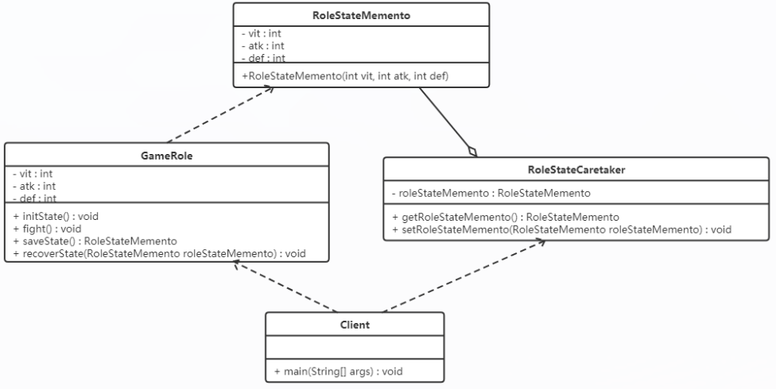

`GameRole`：游戏角色类(属于发起人角色)

```java
/**
 * @Description: 游戏角色类(属于发起人角色)
 */
public class GameRole {

    private int vit; //生命力
    private int atk; //攻击力
    private int def; //防御力

    //初始化内部状态
    public void initState() {
        this.vit = 100;
        this.atk = 100;
        this.def = 100;
    }

    //战斗
    public void fight() {
        this.vit = 0;
        this.atk = 0;
        this.def = 0;
    }

    //保存角色状态功能
    public RoleStateMemento saveState() {
        return new RoleStateMemento(vit,atk,def);
    }

    //恢复角色状态
    public void recoverState(RoleStateMemento roleStateMemento) {
        //将备忘录对象中存储的状态赋值给当前对象的成员
        this.vit = roleStateMemento.getVit();
        this.atk = roleStateMemento.getAtk();
        this.def = roleStateMemento.getDef();
    }

    //展示状态功能
    public void stateDisplay() {
        System.out.println("角色生命力：" + vit);
        System.out.println("角色攻击力：" + atk);
        System.out.println("角色防御力：" + def);
    }

    public int getVit() {
        return vit;
    }

    public void setVit(int vit) {
        this.vit = vit;
    }

    public int getAtk() {
        return atk;
    }

    public void setAtk(int atk) {
        this.atk = atk;
    }

    public int getDef() {
        return def;
    }

    public void setDef(int def) {
        this.def = def;
    }
}
```

`RoleStateMemento`：备忘录角色类

```java
/**
 * @Description: 备忘录角色类
 */
public class RoleStateMemento {

    private int vit; //生命力
    private int atk; //攻击力
    private int def; //防御力

    public RoleStateMemento(int vit, int atk, int def) {
        this.vit = vit;
        this.atk = atk;
        this.def = def;
    }

    public RoleStateMemento() {
    }

    public int getVit() {
        return vit;
    }

    public void setVit(int vit) {
        this.vit = vit;
    }

    public int getAtk() {
        return atk;
    }

    public void setAtk(int atk) {
        this.atk = atk;
    }

    public int getDef() {
        return def;
    }

    public void setDef(int def) {
        this.def = def;
    }
}
```

`RoleStateCaretaker`：备忘录对象管理对象

```java
/**
 * @Description: 备忘录对象管理对象
 */
public class RoleStateCaretaker {

    //声明RoleStateMemento类型的变量
    private RoleStateMemento roleStateMemento;

    public RoleStateMemento getRoleStateMemento() {
        return roleStateMemento;
    }

    public void setRoleStateMemento(RoleStateMemento roleStateMemento) {
        this.roleStateMemento = roleStateMemento;
    }
}
```

`Client`：测试

```java
public class Client {
    public static void main(String[] args) {
        System.out.println("---------------大战boos前-----------------");
        //创建游戏角色对象
        GameRole gameRole = new GameRole();
        gameRole.initState();//初始化状态操作
        gameRole.stateDisplay();

        //将该游戏角色内部状态进行备份
        //创建管理者对象
        RoleStateCaretaker roleStateCaretaker = new RoleStateCaretaker();
        roleStateCaretaker.setRoleStateMemento(gameRole.saveState());

        System.out.println("---------------大战boos后-----------------");
        //损耗严重
        gameRole.fight();
        gameRole.stateDisplay();

        System.out.println("---------------恢复之前的状态-----------------");
        gameRole.recoverState(roleStateCaretaker.getRoleStateMemento());
        gameRole.stateDisplay();
    }
        /*
        ---------------大战boos前-----------------
        角色生命力：100
        角色攻击力：100
        角色防御力：100
        ---------------大战boos后-----------------
        角色生命力：0
        角色攻击力：0
        角色防御力：0
        ---------------恢复之前的状态-----------------
        角色生命力：100
        角色攻击力：100
        角色防御力：100
         */
}
```

分析：白箱备忘录模式是破坏封装性的。但是通过程序员自律，同样可以在一定程度上实现模式的大部分用意

###### 6.10.2.2 “黑箱”备忘录模式

备忘录角色对发起人对象提供一个宽接口，而为其他对象提供一个窄接口。在Java语言中，实现双重接口的办法就是将**备忘录类**设计成**发起人类**的内部成员类

将 `RoleStateMemento` 设为 `GameRole` 的内部类，从而将 `RoleStateMemento` 对象封装在 `GameRole` 里面；在外面提供一个标识接口 `Memento` 给 `RoleStateCaretaker` 及其他对象使用。这样 `GameRole` 类看到的是 `RoleStateMemento` 所有的接口，而`RoleStateCaretaker`  及其他对象看到的仅仅是标识接口 `Memento` 所暴露出来的接口，从而维护了封装型。类图如下：

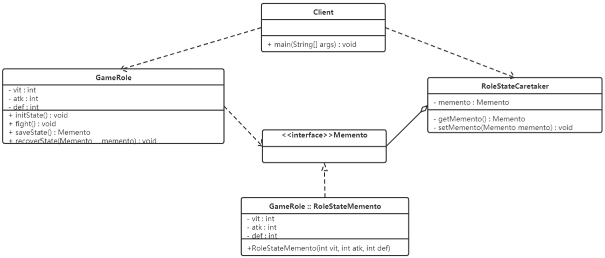


代码如下：

- 窄接口`Memento`，这是一个标识接口，因此没有定义出任何的方法


`Memento`：备忘录接口，对外提供窄接口

```java
/**
 * @Description:  备忘录接口，对外提供窄接口
 */
public interface Memento {
}
```

`RoleStateCaretaker`：备忘录对象管理对象

```java
/**
 * @Description: 备忘录对象管理对象
 */
public class RoleStateCaretaker {

    //声明RoleStateMemento类型的变量
    private Memento memento;

    public Memento getMemento() {
        return memento;
    }

    public void setMemento(Memento memento) {
        this.memento = memento;
    }
}
```

`GameRole`：游戏角色类(属于发起人角色)

```java
/**
 * @Description: 游戏角色类(属于发起人角色)
 */
public class GameRole {

    private int vit; //生命力
    private int atk; //攻击力
    private int def; //防御力

    //初始化内部状态
    public void initState() {
        this.vit = 100;
        this.atk = 100;
        this.def = 100;
    }

    //战斗
    public void fight() {
        this.vit = 0;
        this.atk = 0;
        this.def = 0;
    }

    //保存角色状态功能
    public Memento saveState() {
        return new RoleStateMemento(vit,atk,def);
    }

    //恢复角色状态
    public void recoverState(Memento memento) {
        RoleStateMemento roleStateMemento = (RoleStateMemento) memento;
        //将备忘录对象中存储的状态赋值给当前对象的成员
        this.vit = roleStateMemento.getVit();
        this.atk = roleStateMemento.getAtk();
        this.def = roleStateMemento.getDef();
    }

    //展示状态功能
    public void stateDisplay() {
        System.out.println("角色生命力：" + vit);
        System.out.println("角色攻击力：" + atk);
        System.out.println("角色防御力：" + def);
    }

    public int getVit() {
        return vit;
    }

    public void setVit(int vit) {
        this.vit = vit;
    }

    public int getAtk() {
        return atk;
    }

    public void setAtk(int atk) {
        this.atk = atk;
    }

    public int getDef() {
        return def;
    }

    public void setDef(int def) {
        this.def = def;
    }

    private class RoleStateMemento implements Memento {
        private int vit; //生命力
        private int atk; //攻击力
        private int def; //防御力

        public RoleStateMemento(int vit, int atk, int def) {
            this.vit = vit;
            this.atk = atk;
            this.def = def;
        }

        public RoleStateMemento() {
        }

        public int getVit() {
            return vit;
        }

        public void setVit(int vit) {
            this.vit = vit;
        }

        public int getAtk() {
            return atk;
        }

        public void setAtk(int atk) {
            this.atk = atk;
        }

        public int getDef() {
            return def;
        }

        public void setDef(int def) {
            this.def = def;
        }
    }
}
```

`Client`：测试

```java
public class Client {
    public static void main(String[] args) {
        System.out.println("---------------大战boos前-----------------");
        //创建游戏角色对象
        GameRole gameRole = new GameRole();
        gameRole.initState();//初始化状态操作
        gameRole.stateDisplay();

        //将该游戏角色内部状态进行备份
        //创建管理者对象
        RoleStateCaretaker roleStateCaretaker = new RoleStateCaretaker();
        roleStateCaretaker.setMemento(gameRole.saveState());

        System.out.println("---------------大战boos后-----------------");
        //损耗严重
        gameRole.fight();
        gameRole.stateDisplay();

        System.out.println("---------------恢复之前的状态-----------------");
        gameRole.recoverState(roleStateCaretaker.getMemento());
        gameRole.stateDisplay();
            /*
            ---------------大战boos前-----------------
            角色生命力：100
            角色攻击力：100
            角色防御力：100
            ---------------大战boos后-----------------
            角色生命力：0
            角色攻击力：0
            角色防御力：0
            ---------------恢复之前的状态-----------------
            角色生命力：100
            角色攻击力：100
            角色防御力：100
             */
    }
}
```

##### 6.10.3 `GPT`补充

备忘录模式（Memento Pattern）：

- 备忘录模式是一种行为设计模式，允许在不暴露对象内部细节的情况下保存和恢复对象的状态。该模式通过提供一个“备忘录”，存储对象的状态，使得对象可以在某个时间点被恢复到先前的状态

备忘录模式主要包含以下三个角色：

- Originator（发起者）：负责创建一个备忘录，记录当前对象的内部状态，并根据备忘录恢复状态。它是状态的真正持有者
- Memento（备忘录）：存储发起者的内部状态。备忘录一般是个不可变对象，只暴露给外部读取和设置状态的方法，而不暴露内部实现细节
- Caretaker（管理者）：管理备忘录，但不操作或查看备忘录的内容，通常是负责保存和恢复备忘录的角色

工作原理：

- 发起者创建一个备忘录对象，并将其内部状态存储在备忘录中
- 管理者负责保存备忘录（通常是栈或列表结构，可以记录多个备忘录以支持多次撤销操作）
- 需要恢复时，管理者将备忘录传递回发起者，发起者使用备忘录恢复到之前的状态

示例代码：

- 以一个简单的文本编辑器的撤销功能为例，说明备忘录模式的实现：

```java
// 发起者
class TextEditor {
    private String text;

    public void setText(String text) {
        this.text = text;
    }

    public String getText() {
        return text;
    }

    public Memento save() {
        return new Memento(text);
    }

    public void restore(Memento memento) {
        this.text = memento.getText();
    }

    // 备忘录
    public static class Memento {
        private final String text;

        private Memento(String text) {
            this.text = text;
        }

        private String getText() {
            return text;
        }
    }
}

// 管理者
class Caretaker {
    private List<TextEditor.Memento> history = new ArrayList<>();

    public void save(TextEditor editor) {
        history.add(editor.save());
    }

    public void undo(TextEditor editor) {
        if (!history.isEmpty()) {
            TextEditor.Memento memento = history.remove(history.size() - 1);
            editor.restore(memento);
        }
    }
}

// 测试
public class Main {
    public static void main(String[] args) {
        TextEditor editor = new TextEditor();
        Caretaker caretaker = new Caretaker();

        editor.setText("First Version");
        caretaker.save(editor);  // 保存状态

        editor.setText("Second Version");
        caretaker.save(editor);  // 保存状态

        System.out.println("Current text: " + editor.getText());  // 输出 Second Version

        caretaker.undo(editor);
        System.out.println("After undo: " + editor.getText());  // 输出 First Version
    }
}
```

备忘录模式在框架源码中的使用：

- Spring的事务管理（Transaction Management）
- Spring 框架的事务管理中，也运用了备忘录模式的思想。Spring 事务管理机制会在执行操作之前保存当前事务的状态（类似于备忘录），并在事务失败时回滚到之前保存的状态。这种事务的保存和恢复机制，在底层与备忘录模式的思想是相似的
- 在 Spring 的事务管理中，`TransactionStatus` 类扮演着类似备忘录的角色，保存了当前事务的状态。当发生异常或需要回滚时，事务管理器会使用之前保存的状态来进行回滚


### 6.11 解释器模式

##### 6.11.1 简介

introduce：

- 如下图，设计一个软件用来进行加减计算。第一想法就是使用工具类，提供对应的加法和减法的工具方法

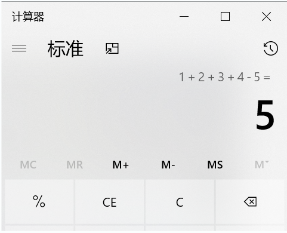


```java
//用于两个整数相加
public static int add(int a,int b){
    return a + b;
}

//用于两个整数相加
public static int add(int a,int b,int c){
    return a + b + c;
}

//用于n个整数相加
public static int add(Integer ... arr) {
    int sum = 0;
    for (Integer i : arr) {
        sum += i;
    }
    return sum;
}
```

- 上面的形式比较单一、有限，如果形式变化非常多，这就不符合要求，因为加法和减法运算，两个运算符与数值可以有无限种组合方式。比如 1+2+3+4+5、1+2+3-4等等   
- 显然，现在需要一种翻译识别机器，能够解析由数字以及 + - 符号构成的合法的运算序列。如果把运算符和数字都看作节点的话，能够逐个节点的进行读取解析运算，这就是解释器模式的思维


解释器模式：

- 给定一个语言，定义它的文法表示，并定义一个解释器，这个解释器使用该标识来解释语言中的句子
- 在解释器模式中，需要将待解决的问题，提取出规则，抽象为一种“语言”。比如加减法运算，规则为：由数值和+-符号组成的合法序列，“1+3-2” 就是这种语言的句子

文法（语法）规则：

- 解释器就是要解析出来语句的含义。但是如何描述规则呢？
- 文法是用于描述语言的语法结构的形式规则

```
expression ::= value | plus | minus
plus ::= expression ‘+’ expression   
minus ::= expression ‘-’ expression  
value ::= integer
```

- 注意： 这里的符号“::=”表示“定义为”的意思，竖线 | 表示或，左右的其中一个，引号内为字符本身，引号外为语法

- 上面规则描述为 ：表达式可以是一个值，也可以是plus或者minus运算，而plus和minus又是由表达式结合运算符构成，值的类型为整型数


抽象语法树：

- 在计算机科学中，抽象语法树（AbstractSyntaxTree，AST），或简称语法树（Syntax tree），是源代码语法结构的一种抽象表示。它以树状的形式表现编程语言的语法结构，树上的每个节点都表示源代码中的一种结构
- 用树形来表示符合文法规则的句子

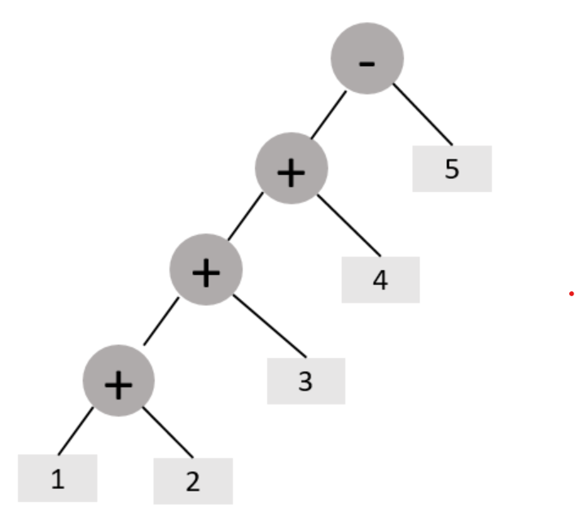


解释器模式结构：

* 抽象表达式（Abstract Expression）角色：定义解释器的接口，约定解释器的解释操作，主要包含解释方法 interpret()

* 终结符表达式（Terminal  Expression）角色：是抽象表达式的子类，用来实现文法中与终结符相关的操作，文法中的每一个终结符都有一个具体终结表达式与之相对应
* 非终结符表达式（Nonterminal Expression）角色：也是抽象表达式的子类，用来实现文法中与非终结符相关的操作，文法中的每条规则都对应于一个非终结符表达式
* 环境（Context）角色：通常包含各个解释器需要的数据或是公共的功能，一般用来传递被所有解释器共享的数据，后面的解释器可以从这里获取这些值
* 客户端（Client）：主要任务是将需要分析的句子或表达式转换成使用解释器对象描述的抽象语法树，然后调用解释器的解释方法，当然也可以通过环境角色间接访问解释器的解释方法


解释器模式优缺点：

- 优点：

  * 易于改变和扩展文法。由于在解释器模式中使用类来表示语言的文法规则，因此可以通过继承等机制来改变或扩展文法。每一条文法规则都可以表示为一个类，因此可以方便地实现一个简单的语言


  * 实现文法较为容易。在抽象语法树中每一个表达式节点类的实现方式都是相似的，这些类的代码编写都不会特别复杂


  * 增加新的解释表达式较为方便。如果用户需要增加新的解释表达式只需要对应增加一个新的终结符表达式或非终结符表达式类，原有表达式类代码无须修改，符合 "开闭原则"

- 缺点：

  - 对于复杂文法难以维护。在解释器模式中，每一条规则至少需要定义一个类，因此如果一个语言包含太多文法规则，类的个数将会急剧增加，导致系统难以管理和维护


  * 执行效率较低。由于在解释器模式中使用了大量的循环和递归调用，因此在解释较为复杂的句子时其速度很慢，而且代码的调试过程也比较麻烦


使用场景：

* 当语言的文法较为简单，且执行效率不是关键问题时

* 当问题重复出现，且可以用一种简单的语言来进行表达时

* 当一个语言需要解释执行，并且语言中的句子可以表示为一个抽象语法树的时候


##### 6.11.2 案例

【例】设计实现加减法的软件

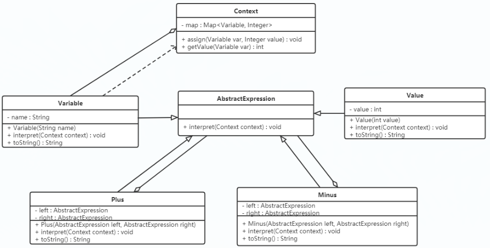

代码如下：

`AbstractExpression`：抽象表达式类

```java
/**
 * @Description: 抽象表达式类
 */
public abstract class AbstractExpression {

    public abstract int interpret(Context context);
}
```

`Context`：环境角色类

```java
import java.util.HashMap;
import java.util.Map;
/**
 * @Description: 环境角色类
 */
public class Context {

    //定义一个map集合，用来存储变量及对应的值
    private Map<Variable,Integer> map = new HashMap<Variable, Integer>();

    //添加变量的功能
    public void assign(Variable var, Integer value) {
        map.put(var,value);
    }

    //根据变量获取对应的值
    public int getValue(Variable var) {
        return map.get(var);
    }
}
```

`Variable`：封装变量的类

```java
/**
 * @Description: 封装变量的类
 */
public class Variable extends AbstractExpression {

    //声明存储变量名的成员变量
    private String name;

    public Variable(String name) {
        this.name = name;
    }

    public int interpret(Context context) {
        //直接返回变量的值
        return context.getValue(this);
    }

    @Override
    public String toString() {
        return name;
    }
}
```

`Plus`：加法表达式类

```java
/**
 * @Description: 加法表达式类
 */
public class Plus extends AbstractExpression {

    //+号左边的表达式
    private AbstractExpression left;
    //+号右边的表达式
    private AbstractExpression right;

    public Plus(AbstractExpression left, AbstractExpression right) {
        this.left = left;
        this.right = right;
    }

    public int interpret(Context context) {
        //将左边表达式的结果和右边表达式的结果进行相加
        return left.interpret(context) + right.interpret(context);
    }

    @Override
    public String toString() {
        return "(" + left.toString() + " + " + right.toString() + ")";
    }
}
```

`Minus`：减法表达式类

```java
/**
 * @Description: 减法表达式类
 */
public class Minus extends AbstractExpression {

    //-号左边的表达式
    private AbstractExpression left;
    //-号右边的表达式
    private AbstractExpression right;

    public Minus(AbstractExpression left, AbstractExpression right) {
        this.left = left;
        this.right = right;
    }

    public int interpret(Context context) {
        //将左边表达式的结果和右边表达式的结果进行相减
        return left.interpret(context) - right.interpret(context);
    }

    @Override
    public String toString() {
        return "(" + left.toString() + " - " + right.toString() + ")";
    }
}
```

`Client`：测试

```java
public class Client {
    public static void main(String[] args) {
        //创建环境对象
        Context context = new Context();

        //创建多个变量对象
        Variable a = new Variable("a");
        Variable b = new Variable("b");
        Variable c = new Variable("c");
        Variable d = new Variable("d");

        //将变量存储到环境对象中
        context.assign(a,1);
        context.assign(b,2);
        context.assign(c,3);
        context.assign(d,4);

        //获取抽象语法树    a + b - c + d
        AbstractExpression expression = new Minus(a,new Minus(new Minus(b,c),d));

        //解释（计算）
        int result = expression.interpret(context);

        System.out.println(expression + " = " + result);
        // (a - ((b - c) - d)) = 6

        //创建环境对象
        Context context1 = new Context();
        //将变量存储到环境对象中
        context1.assign(a,1);
        context1.assign(b,2);
        context1.assign(c,3);
        context1.assign(d,4);
        // 获取抽象语法树
        // a + b - c + d
        AbstractExpression expression1 = new Minus(a,new Plus(new Minus(b,c),d));
        //解释（计算）
        int result1 = expression1.interpret(context);

        System.out.println(expression1 + " = " + result1);
        //(a - ((b - c) + d)) = -2
    }
}
```


## 7.自定义Spring框架

### 7.1 spring使用回顾

自定义spring框架前，先回顾一下spring框架的使用，从而分析spring的核心，并对核心功能进行模拟

1.引入spring依赖

```xml
    <dependencies>
        <dependency>
            <groupId>org.springframework</groupId>
            <artifactId>spring-context</artifactId>
            <version>5.2.0.RELEASE</version>
        </dependency>
        
<!--        <dependency>
            <groupId>com.itheima</groupId>
            <artifactId>itheima_spring</artifactId>
            <version>1.0-SNAPSHOT</version>
        </dependency>-->

    </dependencies>
```

2.数据访问层。定义UserDao接口及其子实现类

```java
public interface UserDao {
  public void add();
}

public class UserDaoImpl implements UserDao {

  public void add() {
	  System.out.println("userDaoImpl ....");
  }
}
```

3.业务逻辑层。定义UserService接口及其子实现类

```java
public interface UserService {
  public void add();
}

public class UserServiceImpl implements UserService {

  private UserDao userDao;

  public void setUserDao(UserDao userDao) {
	  this.userDao = userDao;
  }

  public void add() {
	  System.out.println("userServiceImpl ...");
	  userDao.add();
  }
}
```

4.编写配置文件。在类路径下编写一个名为ApplicationContext.xml的配置文件

```java
<?xml version="1.0" encoding="UTF-8"?>
<beans xmlns:xsi="http://www.w3.org/2001/XMLSchema-instance"
	 xmlns="http://www.springframework.org/schema/beans"
	 xmlns:context="http://www.springframework.org/schema/context"
	 xsi:schemaLocation="http://www.springframework.org/schema/beans
	  http://www.springframework.org/schema/beans/spring-beans.xsd
	  http://www.springframework.org/schema/context
	  http://www.springframework.org/schema/context/spring-context.xsd">

  <bean id="userService" class="com.itheima.service.impl.UserServiceImpl">
	  <property name="userDao" ref="userDao"></property>
  </bean>

  <bean id="userDao" class="com.itheima.dao.impl.UserDaoImpl"></bean>

</beans>
```

5.定义UserController类，使用main方法模拟controller层

```java
import com.itheima.service.UserService;
import org.springframework.context.ApplicationContext;
import org.springframework.context.support.ClassPathXmlApplicationContext;
public class UserController {
    public static void main(String[] args) throws Exception {
        //1,创建spring的容器对象
        ApplicationContext applicationContext = new ClassPathXmlApplicationContext("applicationContext.xml");
        //BeanFactory beanFactory = new XmlBeanFactory(new ClassPathResource("applicationContext.xml"));
        //2,从容器对象中获取userService对象
        UserService userService = applicationContext.getBean("userService", UserService.class);
        //3,调用userService方法进行业务逻辑处理
        userService.add();
        /*
            userService被创建了
            userDao被创建了
            UserService ...
            UserDao ...null==null
         */
    }
}
```

通过上面代码及结果可以看出：

* userService对象是从applicationContext容器对象获取到的，也就是userService对象交由spring进行管理
* 上面结果可以看到调用了UserDao对象中的add方法，也就是说UserDao子实现类对象也交由spring管理了
* UserService中的userDao变量我们并没有进行赋值，但是可以正常使用，说明spring已经将UserDao对象赋值给了userDao变量

上面三点体现了Spring框架的IOC（Inversion of Control）和DI（Dependency Injection, DI）

### 7.2 spring核心功能

##### 7.2.1 spring简介

Spring大约有20个模块，由1300多个不同的文件构成。这些模块可以分为：

核心容器、AOP和设备支持、数据访问与集成、Web组件、通信报文和集成测试等，下面是 Spring 框架的总体架构图：

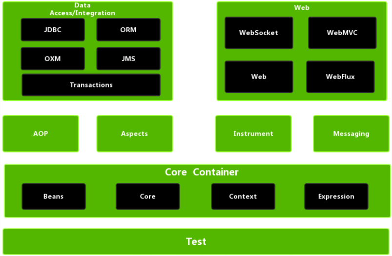

核心容器由 beans、core、context 和 expression（Spring Expression Language，SpEL）4个模块组成

* spring-beans和spring-core模块是Spring框架的核心模块，包含了控制反转（Inversion of Control，IOC）和依赖注入（Dependency Injection，DI）。BeanFactory使用控制反转对应用程序的配置和依赖性规范与实际的应用程序代码进行了分离。BeanFactory属于延时加载，也就是说在实例化容器对象后并不会自动实例化Bean，只有当Bean被使用时，BeanFactory才会对该 Bean 进行实例化与依赖关系的装配。
* spring-context模块构架于核心模块之上，扩展了BeanFactory，为它添加了Bean生命周期控制、框架事件体系及资源加载透明化等功能。此外，该模块还提供了许多企业级支持，如邮件访问、远程访问、任务调度等，ApplicationContext 是该模块的核心接口，它的超类是 BeanFactory。与BeanFactory不同，ApplicationContext实例化后会自动对所有的单实例Bean进行实例化与依赖关系的装配，使之处于待用状态
* spring-context-support模块是对Spring IoC容器及IoC子容器的扩展支持
* spring-context-indexer模块是Spring的类管理组件和Classpath扫描组件
* spring-expression 模块是统一表达式语言（EL）的扩展模块，可以查询、管理运行中的对象，同时也可以方便地调用对象方法，以及操作数组、集合等。它的语法类似于传统EL，但提供了额外的功能，最出色的要数函数调用和简单字符串的模板函数。EL的特性是基于Spring产品的需求而设计的，可以非常方便地同Spring IoC进行交互

##### 7.2.2 bean概述

Spring 就是面向 `Bean` 的编程（BOP,Bean Oriented Programming），Bean 在 Spring 中处于核心地位。Bean对于Spring的意义就像Object对于OOP的意义一样，Spring中没有Bean也就没有Spring存在的意义。Spring IoC容器通过配置文件或者注解的方式来管理bean对象之间的依赖关系。

spring中bean用于对一个类进行封装。如下面的配置：

```xml
<bean id="userService" class="com.itheima.service.impl.UserServiceImpl">
    <property name="userDao" ref="userDao"></property>
</bean>
<bean id="userDao" class="com.itheima.dao.impl.UserDaoImpl"></bean>
```

为什么Bean如此重要呢？

* spring 将bean对象交由一个叫IOC容器进行管理
* bean对象之间的依赖关系在配置文件中体现，并由spring完成

### 7.3 Spring IOC相关接口分析

##### 7.3.1 BeanFactory分析

Spring中Bean的创建是典型的工厂模式，这一系列的Bean工厂，即IoC容器，为开发者管理对象之间的依赖关系提供了很多便利和基础服务，在Spring中有许多IoC容器的实现供用户选择，其相互关系如下图所示

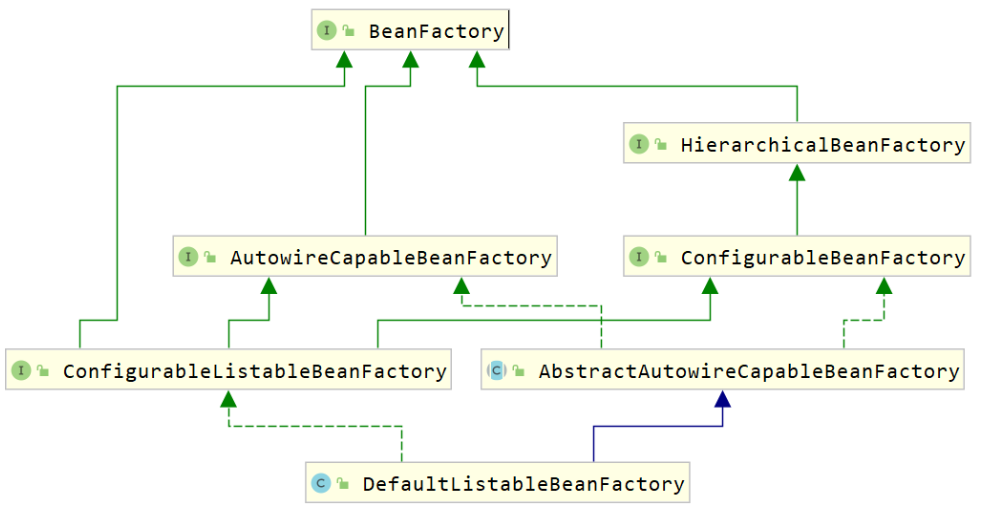

其中，BeanFactory作为最顶层的一个接口，定义了IoC容器的基本功能规范，BeanFactory有三个重要的子接口：ListableBeanFactory、HierarchicalBeanFactory和AutowireCapableBeanFactory。但是从类图中我们可以发现最终的默认实现类是DefaultListableBeanFactory，它实现了所有的接口。

那么为何要定义这么多层次的接口呢？

每个接口都有它的使用场合，主要是为了区分在Spring内部操作过程中对象的传递和转化，对对象的数据访问所做的限制。例如，

* ListableBeanFactory接口表示这些Bean可列表化。
* HierarchicalBeanFactory表示这些Bean 是有继承关系的，也就是每个 Bean 可能有父 Bean
* AutowireCapableBeanFactory 接口定义Bean的自动装配规则。

这三个接口共同定义了Bean的集合、Bean之间的关系及Bean行为。最基本的IoC容器接口是BeanFactory，来看一下它的源码：

```java
public interface BeanFactory {

	String FACTORY_BEAN_PREFIX = "&";

	//根据bean的名称获取IOC容器中的的bean对象
	Object getBean(String name) throws BeansException;
	//根据bean的名称获取IOC容器中的的bean对象，并指定获取到的bean对象的类型，这样我们使用时就不需要进行类型强转了
	<T> T getBean(String name, Class<T> requiredType) throws BeansException;
	Object getBean(String name, Object... args) throws BeansException;
	<T> T getBean(Class<T> requiredType) throws BeansException;
	<T> T getBean(Class<T> requiredType, Object... args) throws BeansException;
	
	<T> ObjectProvider<T> getBeanProvider(Class<T> requiredType);
	<T> ObjectProvider<T> getBeanProvider(ResolvableType requiredType);

	//判断容器中是否包含指定名称的bean对象
	boolean containsBean(String name);
	//根据bean的名称判断是否是单例
	boolean isSingleton(String name) throws NoSuchBeanDefinitionException;
	boolean isPrototype(String name) throws NoSuchBeanDefinitionException;
	boolean isTypeMatch(String name, ResolvableType typeToMatch) throws NoSuchBeanDefinitionException;
	boolean isTypeMatch(String name, Class<?> typeToMatch) throws NoSuchBeanDefinitionException;
	@Nullable
	Class<?> getType(String name) throws NoSuchBeanDefinitionException;
	String[] getAliases(String name);
}
```

在BeanFactory里只对IoC容器的基本行为做了定义，根本不关心你的Bean是如何定义及怎样加载的。正如我们只关心能从工厂里得到什么产品，不关心工厂是怎么生产这些产品的

BeanFactory有一个很重要的子接口，就是ApplicationContext接口，该接口主要来规范容器中的bean对象是非延时加载，即在创建容器对象的时候就对象bean进行初始化，并存储到一个容器中

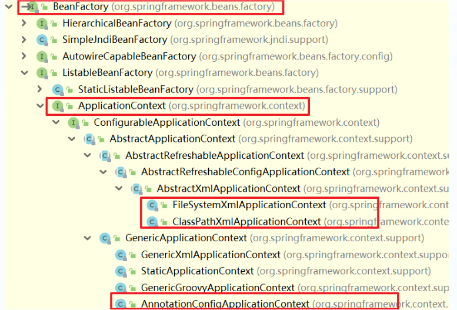

要知道工厂是如何产生对象的，我们需要看具体的IoC容器实现，Spring提供了许多IoC容器实现，比如：

* ClasspathXmlApplicationContext : 根据类路径加载xml配置文件，并创建IOC容器对象。
* FileSystemXmlApplicationContext ：根据系统路径加载xml配置文件，并创建IOC容器对象。
* AnnotationConfigApplicationContext ：加载注解类配置，并创建IOC容器。

##### 7.3.2 BeanDefinition分析

Spring IoC容器管理我们定义的各种Bean对象及其相互关系，而Bean对象在Spring实现中是以BeanDefinition来描述的，如下面配置文件

```xml
<bean id="userDao" class="com.itheima.dao.impl.UserDaoImpl"></bean>

bean标签还有很多属性：
	scope、init-method、destory-method等。
```

其继承体系如下图所示

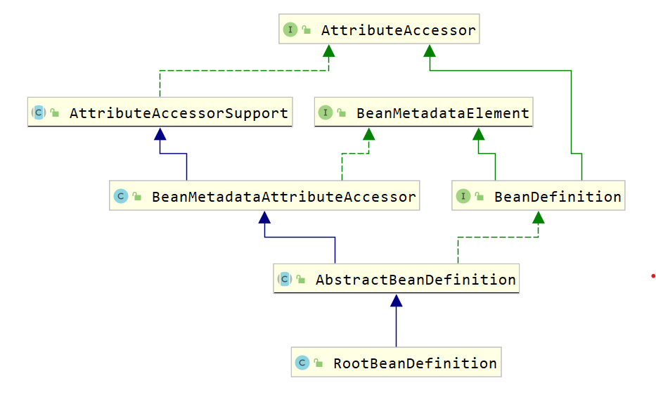

##### 7.3.3 BeanDefinitionReader分析

Bean的解析过程非常复杂，功能被分得很细，因为这里需要被扩展的地方很多，必须保证足够的灵活性，以应对可能的变化。Bean的解析主要就是对Spring配置文件的解析。这个解析过程主要通过BeanDefinitionReader来完成，看看Spring中BeanDefinitionReader的类结构图，如下图所示

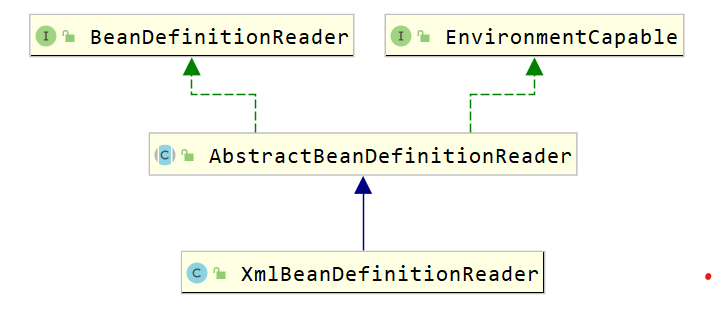

看看BeanDefinitionReader接口定义的功能来理解它具体的作用：

```java
public interface BeanDefinitionReader {

	//获取BeanDefinitionRegistry注册器对象
	BeanDefinitionRegistry getRegistry();

	@Nullable
	ResourceLoader getResourceLoader();

	@Nullable
	ClassLoader getBeanClassLoader();

	BeanNameGenerator getBeanNameGenerator();

	/*
		下面的loadBeanDefinitions都是加载bean定义，从指定的资源中
	*/
	int loadBeanDefinitions(Resource resource) throws BeanDefinitionStoreException;
	int loadBeanDefinitions(Resource... resources) throws BeanDefinitionStoreException;
	int loadBeanDefinitions(String location) throws BeanDefinitionStoreException;
	int loadBeanDefinitions(String... locations) throws BeanDefinitionStoreException;
}
```

##### 7.3.4 BeanDefinitionRegistry分析

BeanDefinitionReader用来解析bean定义，并封装BeanDefinition对象，而我们定义的配置文件中定义了很多bean标签，所以就有一个问题，解析的BeanDefinition对象存储到哪儿？答案就是BeanDefinition的注册中心，而该注册中心顶层接口就是BeanDefinitionRegistry

```java
public interface BeanDefinitionRegistry extends AliasRegistry {

	//往注册表中注册bean
	void registerBeanDefinition(String beanName, BeanDefinition beanDefinition)
			throws BeanDefinitionStoreException;

	//从注册表中删除指定名称的bean
	void removeBeanDefinition(String beanName) throws NoSuchBeanDefinitionException;

	//获取注册表中指定名称的bean
	BeanDefinition getBeanDefinition(String beanName) throws NoSuchBeanDefinitionException;
    
	//判断注册表中是否已经注册了指定名称的bean
	boolean containsBeanDefinition(String beanName);
    
	//获取注册表中所有的bean的名称
	String[] getBeanDefinitionNames();
    
	int getBeanDefinitionCount();
	boolean isBeanNameInUse(String beanName);
}
```

继承结构图如下：

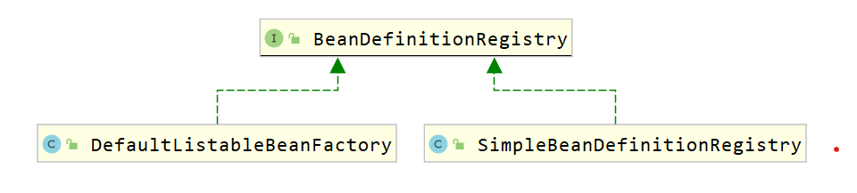

从上面类图可以看到BeanDefinitionRegistry接口的子实现类主要有以下几个：

* DefaultListableBeanFactory

  在该类中定义了如下代码，就是用来注册bean

  ```java
  private final Map<String, BeanDefinition> beanDefinitionMap = new ConcurrentHashMap<>(256);
  ```

* SimpleBeanDefinitionRegistry

  在该类中定义了如下代码，就是用来注册bean

  ```java
  private final Map<String, BeanDefinition> beanDefinitionMap = new ConcurrentHashMap<>(64);
  ```

##### 7.3.5 创建容器

ClassPathXmlApplicationContext对Bean配置资源的载入是从refresh（）方法开始的。refresh（）方法是一个模板方法，规定了 IoC 容器的启动流程，有些逻辑要交给其子类实现。它对 Bean 配置资源进行载入，ClassPathXmlApplicationContext通过调用其父类AbstractApplicationContext的refresh（）方法启动整个IoC容器对Bean定义的载入过程

### 7.4 自定义SpringIOC

现要对下面的配置文件进行解析，并自定义Spring框架的IOC对涉及到的对象进行管理

```xml
<?xml version="1.0" encoding="UTF-8"?>
<beans>
    <bean id="userService" class="com.itheima.service.impl.UserServiceImpl">
        <property name="userDao" ref="userDao"></property>
    </bean>
    <bean id="userDao" class="com.itheima.dao.impl.UserDaoImpl"></bean>
</beans>
```

#### 7.4.1 定义bean相关的pojo类

##### 7.4.1.1 PropertyValue类

用于封装bean的属性，体现到上面的配置文件就是封装bean标签的子标签property标签数据

```java
/**
 * @Description: 用来封装bean标签下的property标签的属性
 *              name属性
 *              ref属性
 *              value属性 ： 给基本数据类型及String类型数据赋的值
 */
public class PropertyValue {

    private String name;
    private String ref;
    private String value;

    public PropertyValue() {
    }

    public PropertyValue(String name, String ref, String value) {
        this.name = name;
        this.ref = ref;
        this.value = value;
    }

    public String getName() {
        return name;
    }

    public void setName(String name) {
        this.name = name;
    }

    public String getRef() {
        return ref;
    }

    public void setRef(String ref) {
        this.ref = ref;
    }

    public String getValue() {
        return value;
    }

    public void setValue(String value) {
        this.value = value;
    }
}
```


#####  7.4.1.2 MutablePropertyValues类

一个bean标签可以有多个property子标签，所以再定义一个MutablePropertyValues类，用来存储并管理多个PropertyValue对象

```java
import java.util.ArrayList;
import java.util.Iterator;
import java.util.List;
/**
 * @Description: 用户存储和管理多个PropertyValue对象
 * 用到了迭代器模式
 */
public class MutablePropertyValues implements Iterable<PropertyValue> {

    //定义list集合对象，用来存储PropertyValue对象
    private final List<PropertyValue> propertyValueList;

    public MutablePropertyValues() {
        this.propertyValueList = new ArrayList<PropertyValue>();
    }

    public MutablePropertyValues(List<PropertyValue> propertyValueList) {
        if(propertyValueList == null) {
            this.propertyValueList = new ArrayList<PropertyValue>();
        } else {
            this.propertyValueList = propertyValueList;
        }
    }

    //获取所有的PropertyValue对象，返回以数组的形式
    public PropertyValue[] getPropertyValues() {
        //将集合转换为数组并返回
        return propertyValueList.toArray(new PropertyValue[0]);
    }

    //根据name属性值获取PropertyValue对象
    public PropertyValue getPropertyValue(String propertyName) {
        //遍历集合对象
        for (PropertyValue propertyValue : propertyValueList) {
            if (propertyValue.getName().equals(propertyName)) {
                return propertyValue;
            }
        }
        return null;
    }

    //判断集合是否为空
    public boolean isEmpty() {
        return propertyValueList.isEmpty();
    }

    //添加PropertyValue对象
    public MutablePropertyValues addPropertyValue(PropertyValue pv) {
        //判断集合中存储的PropertyValue对象是否和传递进行的重复了，如果重复了，进行覆盖
        for (int i = 0; i < propertyValueList.size(); i++) {
            //获取集合中每一个PropertyValue对象
            PropertyValue currentPv = propertyValueList.get(i);
            if(currentPv.getName().equals(pv.getName())) {
                propertyValueList.set(i,pv);
                return this; //目的就是实现链式编程
            }
        }
        this.propertyValueList.add(pv);
        return this;//目的就是实现链式编程
    }

    //判断是否有指定name属性值的对象
    public boolean contains(String propertyName) {
        return getPropertyValue(propertyName) != null;
    }

    //获取迭代器对象
    public Iterator<PropertyValue> iterator() {
        return propertyValueList.iterator();
    }
}
```

##### 7.4.1.3 BeanDefinition类

BeanDefinition类用来封装bean信息的，主要包含id（即bean对象的名称）、class（需要交由spring管理的类的全类名）及子标签property数据

```java
/**
 * @Description: 用来封装bean标签数据
 *      id属性
 *      class属性
 *      property子标签的数据
 */
public class BeanDefinition {

    private String id;
    private String className;

    private MutablePropertyValues propertyValues;

    public BeanDefinition() {
        propertyValues = new MutablePropertyValues();
    }

    public String getId() {
        return id;
    }

    public void setId(String id) {
        this.id = id;
    }

    public String getClassName() {
        return className;
    }

    public void setClassName(String className) {
        this.className = className;
    }

    public MutablePropertyValues getPropertyValues() {
        return propertyValues;
    }

    public void setPropertyValues(MutablePropertyValues propertyValues) {
        this.propertyValues = propertyValues;
    }
}
```


```
第一章:设计模式相关内容介绍
        1，设计模式概述
        2，UML图
        3，软件设计原则
                 开闭原则
                 里氏代换原则
                 依赖倒转原则
                 迪米特法则
                 合成复用原则
第二章:创建者模式(5种)
                单例模式
                原型模式
                工厂方法模式
                抽象工厂模式
                建造者模式
第三章:结构型模式(7种)
                代理模式
                适配器模式
                桥接模式
                装饰者模式
                外观模式
                享元模式
                组合模式
第四章:行为型模式(11种)
                模板方法模式
                策略模式
                命令模式
                职责链模式
                状态模式
                观察者模式
                中介者模式
                迭代器模式
                访问者模式
                备忘录模式
                解释器模式

第五章:综合练习   自定义spring框架
                分析spring核心功能结构
                确定spring核心功能使用的设计模式
                功能实现 spring Ioc
```

#### 7.4.2 定义注册表相关类

##### 7.4.2.1 BeanDefinitionRegistry接口

BeanDefinitionRegistry接口定义了注册表的相关操作，定义如下功能：

* 注册BeanDefinition对象到注册表中
* 从注册表中删除指定名称的BeanDefinition对象
* 根据名称从注册表中获取BeanDefinition对象
* 判断注册表中是否包含指定名称的BeanDefinition对象
* 获取注册表中BeanDefinition对象的个数
* 获取注册表中所有的BeanDefinition的名称


```java
public interface BeanDefinitionRegistry {

    //注册BeanDefinition对象到注册表中
    void registerBeanDefinition(String beanName, BeanDefinition beanDefinition);

    //从注册表中删除指定名称的BeanDefinition对象
    void removeBeanDefinition(String beanName) throws Exception;

    //根据名称从注册表中获取BeanDefinition对象
    BeanDefinition getBeanDefinition(String beanName) throws Exception;

    boolean containsBeanDefinition(String beanName);

    int getBeanDefinitionCount();

    String[] getBeanDefinitionNames();
}
```

##### 7.4.2.2 SimpleBeanDefinitionRegistry类

该类实现了BeanDefinitionRegistry接口，定义了Map集合作为注册表容器。

```java
public class SimpleBeanDefinitionRegistry implements BeanDefinitionRegistry {

    private Map<String, BeanDefinition> beanDefinitionMap = new HashMap<String, BeanDefinition>();

    @Override
    public void registerBeanDefinition(String beanName, BeanDefinition beanDefinition) {
        beanDefinitionMap.put(beanName,beanDefinition);
    }

    @Override
    public void removeBeanDefinition(String beanName) throws Exception {
        beanDefinitionMap.remove(beanName);
    }

    @Override
    public BeanDefinition getBeanDefinition(String beanName) throws Exception {
        return beanDefinitionMap.get(beanName);
    }

    @Override
    public boolean containsBeanDefinition(String beanName) {
        return beanDefinitionMap.containsKey(beanName);
    }

    @Override
    public int getBeanDefinitionCount() {
        return beanDefinitionMap.size();
    }

    @Override
    public String[] getBeanDefinitionNames() {
        return beanDefinitionMap.keySet().toArray(new String[1]);
    }
}
```

#### 7.4.3 定义解析器相关类

##### 7.4.3.1 BeanDefinitionReader接口

BeanDefinitionReader是用来解析配置文件并在注册表中注册bean的信息。定义了两个规范：

* 获取注册表的功能，让外界可以通过该对象获取注册表对象。
* 加载配置文件，并注册bean数据。

```java
public interface BeanDefinitionReader {

	//获取注册表对象
    BeanDefinitionRegistry getRegistry();
	//加载配置文件并在注册表中进行注册
    void loadBeanDefinitions(String configLocation) throws Exception;
}
```

##### 7.4.3.2 XmlBeanDefinitionReader类

XmlBeanDefinitionReader类是专门用来解析xml配置文件的。该类实现BeanDefinitionReader接口并实现接口中的两个功能。

```java
public class XmlBeanDefinitionReader implements BeanDefinitionReader {

    private BeanDefinitionRegistry registry;

    public XmlBeanDefinitionReader() {
        this.registry = new SimpleBeanDefinitionRegistry();
    }

    @Override
    public BeanDefinitionRegistry getRegistry() {
        return registry;
    }

    @Override
    public void loadBeanDefinitions(String configLocation) throws Exception {

        InputStream is = this.getClass().getClassLoader().getResourceAsStream(configLocation);
        SAXReader reader = new SAXReader();
        Document document = reader.read(is);
        Element rootElement = document.getRootElement();
        //解析bean标签
        parseBean(rootElement);
    }

    private void parseBean(Element rootElement) {

        List<Element> elements = rootElement.elements();
        for (Element element : elements) {
            String id = element.attributeValue("id");
            String className = element.attributeValue("class");
            BeanDefinition beanDefinition = new BeanDefinition();
            beanDefinition.setId(id);
            beanDefinition.setClassName(className);
            List<Element> list = element.elements("property");
            MutablePropertyValues mutablePropertyValues = new MutablePropertyValues();
            for (Element element1 : list) {
                String name = element1.attributeValue("name");
                String ref = element1.attributeValue("ref");
                String value = element1.attributeValue("value");
                PropertyValue propertyValue = new PropertyValue(name,ref,value);
                mutablePropertyValues.addPropertyValue(propertyValue);
            }
            beanDefinition.setPropertyValues(mutablePropertyValues);

            registry.registerBeanDefinition(id,beanDefinition);
        }
    }
}
```

#### 7.4.4 IOC容器相关类

##### 7.4.4.1 BeanFactory接口

在该接口中定义IOC容器的统一规范即获取bean对象。

```java
public interface BeanFactory {
	//根据bean对象的名称获取bean对象
    Object getBean(String name) throws Exception;
	//根据bean对象的名称获取bean对象，并进行类型转换
    <T> T getBean(String name, Class<? extends T> clazz) throws Exception;
}
```

##### 7.4.4.2 ApplicationContext接口

该接口的所以的子实现类对bean对象的创建都是非延时的，所以在该接口中定义 `refresh()` 方法，该方法主要完成以下两个功能：

* 加载配置文件。
* 根据注册表中的BeanDefinition对象封装的数据进行bean对象的创建。

```java
public interface ApplicationContext extends BeanFactory {
	//进行配置文件加载并进行对象创建
    void refresh() throws IllegalStateException, Exception;
}
```

##### 7.4.4.3 AbstractApplicationContext类

* 作为ApplicationContext接口的子类，所以该类也是非延时加载，所以需要在该类中定义一个Map集合，作为bean对象存储的容器。

* 声明BeanDefinitionReader类型的变量，用来进行xml配置文件的解析，符合单一职责原则。

  BeanDefinitionReader类型的对象创建交由子类实现，因为只有子类明确到底创建BeanDefinitionReader哪儿个子实现类对象。

```java
public abstract class AbstractApplicationContext implements ApplicationContext {

    protected BeanDefinitionReader beanDefinitionReader;
    //用来存储bean对象的容器   key存储的是bean的id值，value存储的是bean对象
    protected Map<String, Object> singletonObjects = new HashMap<String, Object>();

    //存储配置文件的路径
    protected String configLocation;

    public void refresh() throws IllegalStateException, Exception {

        //加载BeanDefinition
        beanDefinitionReader.loadBeanDefinitions(configLocation);

        //初始化bean
        finishBeanInitialization();
    }

    //bean的初始化
    private void finishBeanInitialization() throws Exception {
        BeanDefinitionRegistry registry = beanDefinitionReader.getRegistry();
        String[] beanNames = registry.getBeanDefinitionNames();

        for (String beanName : beanNames) {
            BeanDefinition beanDefinition = registry.getBeanDefinition(beanName);
            getBean(beanName);
        }
    }
}
```

> 注意：该类finishBeanInitialization()方法中调用getBean()方法使用到了模板方法模式。

##### 7.4.4.4 ClassPathXmlApplicationContext类

该类主要是加载类路径下的配置文件，并进行bean对象的创建，主要完成以下功能：

* 在构造方法中，创建BeanDefinitionReader对象。
* 在构造方法中，调用refresh()方法，用于进行配置文件加载、创建bean对象并存储到容器中。
* 重写父接口中的getBean()方法，并实现依赖注入操作。

```java
public class ClassPathXmlApplicationContext extends AbstractApplicationContext{

    public ClassPathXmlApplicationContext(String configLocation) {
        this.configLocation = configLocation;
        //构建XmlBeanDefinitionReader对象
        beanDefinitionReader = new XmlBeanDefinitionReader();
        try {
            this.refresh();
        } catch (Exception e) {
        }
    }

    //根据bean的id属性值获取bean对象
    @Override
    public Object getBean(String name) throws Exception {

        //return singletonObjects.get(name);
        Object obj = singletonObjects.get(name);
        if(obj != null) {
            return obj;
        }

        BeanDefinitionRegistry registry = beanDefinitionReader.getRegistry();
        BeanDefinition beanDefinition = registry.getBeanDefinition(name);
        if(beanDefinition == null) {
            return null;
        }
        String className = beanDefinition.getClassName();
        Class<?> clazz = Class.forName(className);
        Object beanObj = clazz.newInstance();
        MutablePropertyValues propertyValues = beanDefinition.getPropertyValues();
        for (PropertyValue propertyValue : propertyValues) {
            String propertyName = propertyValue.getName();
            String value = propertyValue.getValue();
            String ref = propertyValue.getRef();
            if(ref != null && !"".equals(ref)) {

                Object bean = getBean(ref);
                String methodName = StringUtils.getSetterMethodNameByFieldName(propertyName);
                Method[] methods = clazz.getMethods();
                for (Method method : methods) {
                    if(method.getName().equals(methodName)) {
                        method.invoke(beanObj,bean);
                    }
                }
            }

            if(value != null && !"".equals(value)) {
                String methodName = StringUtils.getSetterMethodNameByFieldName(propertyName);
                Method method = clazz.getMethod(methodName, String.class);
                method.invoke(beanObj,value);
            }
        }
        singletonObjects.put(name,beanObj);
        return beanObj;
    }

    @Override
    public <T> T getBean(String name, Class<? extends T> clazz) throws Exception {

        Object bean = getBean(name);
        if(bean != null) {
            return clazz.cast(bean);
        }
        return null;
    }
}
```

#### 7.4.5 自定义Spring IOC总结

##### 7.4.5.1 使用到的设计模式

* 工厂模式。这个使用工厂模式 + 配置文件的方式。
* 单例模式。Spring IOC管理的bean对象都是单例的，此处的单例不是通过构造器进行单例的控制的，而是spring框架对每一个bean只创建了一个对象。
* 模板方法模式。AbstractApplicationContext类中的finishBeanInitialization()方法调用了子类的getBean()方法，因为getBean()的实现和环境息息相关。
* 迭代器模式。对于MutablePropertyValues类定义使用到了迭代器模式，因为此类存储并管理PropertyValue对象，也属于一个容器，所以给该容器提供一个遍历方式。

spring框架其实使用到了很多设计模式，如AOP使用到了代理模式，选择JDK代理或者CGLIB代理使用到了策略模式，还有适配器模式，装饰者模式，观察者模式等。

##### 7.4.5.2 符合大部分设计原则

##### 7.4.5.3 整个设计和Spring的设计还是有一定的出入

spring框架底层是很复杂的，进行了很深入的封装，并对外提供了很好的扩展性。而我们自定义SpringIOC有以下几个目的：

* 了解Spring底层对对象的大体管理机制。
* 了解设计模式在具体的开发中的使用。
* 以后学习spring源码，通过该案例的实现，可以降低spring学习的入门成本。


