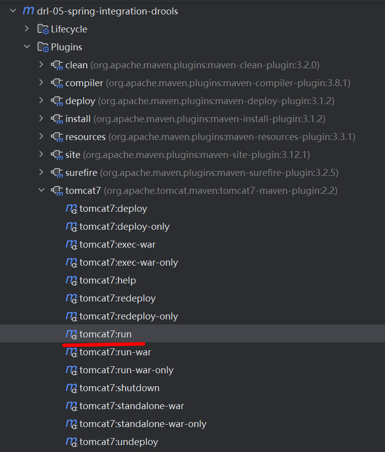

<!-- START doctoc generated TOC please keep comment here to allow auto update -->
<!-- DON'T EDIT THIS SECTION, INSTEAD RE-RUN doctoc TO UPDATE -->
**Table of Contents**  *generated with [DocToc](https://github.com/thlorenz/doctoc)*

- [1. Spring 整合 Drools 模块概述](#1-spring-%E6%95%B4%E5%90%88-drools-%E6%A8%A1%E5%9D%97%E6%A6%82%E8%BF%B0)
  - [1.1 本模块包含的两类用法](#11-%E6%9C%AC%E6%A8%A1%E5%9D%97%E5%8C%85%E5%90%AB%E7%9A%84%E4%B8%A4%E7%B1%BB%E7%94%A8%E6%B3%95)
  - [1.2 技术栈与运行说明](#12-%E6%8A%80%E6%9C%AF%E6%A0%88%E4%B8%8E%E8%BF%90%E8%A1%8C%E8%AF%B4%E6%98%8E)
- [2. 工程搭建](#2-%E5%B7%A5%E7%A8%8B%E6%90%AD%E5%BB%BA)
  - [2.1 配置 `pom.xml`](#21-%E9%85%8D%E7%BD%AE-pomxml)
- [3. 案例一：Spring 容器整合 Drools（`spring.xml` + `DroolsSpringTest`）](#3-%E6%A1%88%E4%BE%8B%E4%B8%80spring-%E5%AE%B9%E5%99%A8%E6%95%B4%E5%90%88-droolsspringxml--droolsspringtest)
  - [3.1 说明](#31-%E8%AF%B4%E6%98%8E)
  - [3.2 第一步：配置 `spring.xml`](#32-%E7%AC%AC%E4%B8%80%E6%AD%A5%E9%85%8D%E7%BD%AE-springxml)
  - [3.3 第二步：规则文件 `helloworld.drl`](#33-%E7%AC%AC%E4%BA%8C%E6%AD%A5%E8%A7%84%E5%88%99%E6%96%87%E4%BB%B6-helloworlddrl)
  - [3.4 第三步：JUnit 测试 `DroolsSpringTest.java`](#34-%E7%AC%AC%E4%B8%89%E6%AD%A5junit-%E6%B5%8B%E8%AF%95-droolsspringtestjava)
- [4. 案例二：Spring MVC + Drools Web（`web.xml` + `springmvc.xml` + Controller）](#4-%E6%A1%88%E4%BE%8B%E4%BA%8Cspring-mvc--drools-webwebxml--springmvcxml--controller)
  - [4.1 说明](#41-%E8%AF%B4%E6%98%8E)
  - [4.2 第一步：配置 `web.xml`](#42-%E7%AC%AC%E4%B8%80%E6%AD%A5%E9%85%8D%E7%BD%AE-webxml)
  - [4.3 第二步：配置 `springmvc.xml`](#43-%E7%AC%AC%E4%BA%8C%E6%AD%A5%E9%85%8D%E7%BD%AE-springmvcxml)
  - [4.4 第三步：`RuleService.java`](#44-%E7%AC%AC%E4%B8%89%E6%AD%A5ruleservicejava)
  - [4.5 第四步：`HelloController.java`](#45-%E7%AC%AC%E5%9B%9B%E6%AD%A5hellocontrollerjava)
  - [4.6 Web 访问说明](#46-web-%E8%AE%BF%E9%97%AE%E8%AF%B4%E6%98%8E)
- [5. 运行与注意事项](#5-%E8%BF%90%E8%A1%8C%E4%B8%8E%E6%B3%A8%E6%84%8F%E4%BA%8B%E9%A1%B9)
  - [5.1 单元测试（案例一）](#51-%E5%8D%95%E5%85%83%E6%B5%8B%E8%AF%95%E6%A1%88%E4%BE%8B%E4%B8%80)
  - [5.2 Web 启动（案例二）](#52-web-%E5%90%AF%E5%8A%A8%E6%A1%88%E4%BE%8B%E4%BA%8C)
  - [5.3 注意事项小结](#53-%E6%B3%A8%E6%84%8F%E4%BA%8B%E9%A1%B9%E5%B0%8F%E7%BB%93)

<!-- END doctoc generated TOC please keep comment here to allow auto update -->

## 1. Spring 整合 Drools 模块概述

模块 `drl-05-spring-integration-drools` 对应教程 **7.1 简单整合** 与 **7.2 Spring Web**：在 Spring 容器中通过 **kie-spring** 声明 `kmodule` / `kbase` / `ksession`，使用 **`@KBase`** 注入 `KieBase` 并创建 `KieSession` 执行规则；Web 场景下再叠加 **Spring MVC**（`DispatcherServlet`、`springmvc.xml`、Controller 调用 `RuleService`）。

### 1.1 本模块包含的两类用法

| 用法 | 配置文件 | 验证方式 |
| :--- | :--- | :--- |
| 仅 Spring 容器（无 Web） | `classpath:spring.xml` | JUnit：`DroolsSpringTest` |
| Spring MVC Web | `web.xml` + `classpath:springmvc.xml` | `tomcat7-maven-plugin` 启动后访问 `*.do` 映射 |

### 1.2 技术栈与运行说明

- **打包**：`war`；JDK **1.8**；**Drools 7.10.0.Final**；**Spring 5.0.5.RELEASE**。
- **单元测试**：模块根目录执行 `mvn test`（加载 `spring.xml`）。
- **Web 调试**：`mvn tomcat7:run`（默认端口 **8080**，`context path` 为 **`/`**）。
- **代码引用**：下文代码块与仓库源文件 **逐字一致**（含注释）。

---

## 2. 工程搭建

### 2.1 配置 `pom.xml`

```xml
<?xml version="1.0" encoding="UTF-8"?>
<project xmlns="http://maven.apache.org/POM/4.0.0"
         xmlns:xsi="http://www.w3.org/2001/XMLSchema-instance"
         xsi:schemaLocation="http://maven.apache.org/POM/4.0.0 http://maven.apache.org/xsd/maven-4.0.0.xsd">
    <modelVersion>4.0.0</modelVersion>

    <parent>
        <groupId>com.action.drools</groupId>
        <artifactId>drools</artifactId>
        <version>1.0-SNAPSHOT</version>
    </parent>

    <artifactId>drl-05-spring-integration-drools</artifactId>
    <version>0.0.1-SNAPSHOT</version>
    <packaging>war</packaging>
    <name>drl-05-spring-integration-drools</name>
    <description>Spring整合Drools：7.1 简单整合 + 7.2 Spring Web</description>
    <properties>
        <project.build.sourceEncoding>UTF-8</project.build.sourceEncoding>
        <maven.compiler.source>1.8</maven.compiler.source>
        <maven.compiler.target>1.8</maven.compiler.target>
        <drools.version>7.10.0.Final</drools.version>
        <spring.version>5.0.5.RELEASE</spring.version>
    </properties>
    <dependencies>
        <dependency>
            <groupId>org.drools</groupId>
            <artifactId>drools-compiler</artifactId>
            <version>${drools.version}</version>
        </dependency>
        <dependency>
            <groupId>junit</groupId>
            <artifactId>junit</artifactId>
            <version>4.12</version>
            <scope>test</scope>
        </dependency>
        <dependency>
            <groupId>org.kie</groupId>
            <artifactId>kie-spring</artifactId>
            <version>${drools.version}</version>
            <!--注意：此处必须排除传递过来的依赖，否则会跟我们自己导入的Spring jar包产生冲突-->
            <exclusions>
                <exclusion>
                    <groupId>org.springframework</groupId>
                    <artifactId>spring-tx</artifactId>
                </exclusion>
                <exclusion>
                    <groupId>org.springframework</groupId>
                    <artifactId>spring-beans</artifactId>
                </exclusion>
                <exclusion>
                    <groupId>org.springframework</groupId>
                    <artifactId>spring-core</artifactId>
                </exclusion>
                <exclusion>
                    <groupId>org.springframework</groupId>
                    <artifactId>spring-context</artifactId>
                </exclusion>
            </exclusions>
        </dependency>
        <dependency>
            <groupId>org.springframework</groupId>
            <artifactId>spring-context</artifactId>
            <version>${spring.version}</version>
        </dependency>
        <dependency>
            <groupId>org.springframework</groupId>
            <artifactId>spring-context-support</artifactId>
            <version>${spring.version}</version>
        </dependency>
        <dependency>
            <groupId>org.springframework</groupId>
            <artifactId>spring-test</artifactId>
            <version>${spring.version}</version>
            <scope>test</scope>
        </dependency>
        <dependency>
            <groupId>org.springframework</groupId>
            <artifactId>spring-tx</artifactId>
            <version>${spring.version}</version>
        </dependency>
        <dependency>
            <groupId>org.springframework</groupId>
            <artifactId>spring-web</artifactId>
            <version>${spring.version}</version>
        </dependency>
        <dependency>
            <groupId>org.springframework</groupId>
            <artifactId>spring-webmvc</artifactId>
            <version>${spring.version}</version>
        </dependency>
    </dependencies>
    <build>
        <plugins>
            <plugin>
                <groupId>org.apache.maven.plugins</groupId>
                <artifactId>maven-compiler-plugin</artifactId>
                <version>3.8.1</version>
                <configuration>
                    <source>1.8</source>
                    <target>1.8</target>
                </configuration>
            </plugin>
            <plugin>
                <groupId>org.apache.tomcat.maven</groupId>
                <artifactId>tomcat7-maven-plugin</artifactId>
                <version>2.2</version>
                <configuration>
                    <port>8080</port>
                    <path>/</path>
                </configuration>
            </plugin>
        </plugins>
    </build>
</project>
```

---

## 3. 案例一：Spring 容器整合 Drools（`spring.xml` + `DroolsSpringTest`）

### 3.1 说明

通过 **`kie-spring` 的 XML 命名空间** 在 Spring 中定义与 `kmodule.xml` 等价的 `kbase`（扫描 `rules` 包下 DRL），并注册 **`KModuleAnnotationPostProcessor`**，从而在测试或将来其它 Bean 中使用 **`@KBase("kbase")`** 注入 `KieBase`。本案例仅用 **`spring.xml`**，不启动 Web 容器。

### 3.2 第一步：配置 `spring.xml`

路径：`src/main/resources/spring.xml`。

```xml
<?xml version="1.0" encoding="UTF-8"?>
<beans xmlns="http://www.springframework.org/schema/beans"
       xmlns:xsi="http://www.w3.org/2001/XMLSchema-instance"
       xmlns:kie="http://drools.org/schema/kie-spring"
       xsi:schemaLocation="http://www.springframework.org/schema/beans
                            http://www.springframework.org/schema/beans/spring-beans.xsd
                            http://drools.org/schema/kie-spring
                            http://drools.org/schema/kie-spring.xsd">
    <kie:kmodule id="kmodule">
        <kie:kbase name="kbase" packages="rules">
            <kie:ksession name="ksession"></kie:ksession>
        </kie:kbase>
    </kie:kmodule>
    <bean class="org.kie.spring.annotations.KModuleAnnotationPostProcessor"></bean>
</beans>
```

### 3.3 第二步：规则文件 `helloworld.drl`

路径：`src/main/resources/rules/helloworld.drl`。

```java
package helloworld

rule "rule_helloworld"
    when
        eval(true)
    then
        System.out.println("规则：rule_helloworld触发...");
end
```

### 3.4 第三步：JUnit 测试 `DroolsSpringTest.java`

路径：`src/test/java/com/action/drools/DroolsSpringTest.java`。使用 **`@ContextConfiguration(locations = "classpath:spring.xml")`** 加载上述 Spring 配置，**`@KBase("kbase")`** 注入与 XML 中同名的 `KieBase`。

```java
package com.action.drools;

import org.junit.Test;
import org.junit.runner.RunWith;
import org.kie.api.KieBase;
import org.kie.api.cdi.KBase;
import org.kie.api.runtime.KieSession;
import org.springframework.test.context.ContextConfiguration;
import org.springframework.test.context.junit4.SpringJUnit4ClassRunner;

@RunWith(SpringJUnit4ClassRunner.class)
@ContextConfiguration(locations = "classpath:spring.xml")
public class DroolsSpringTest {
    @KBase("kbase")
    private KieBase kieBase;//注入KieBase对象

    @Test
    public void test1() {
        KieSession kieSession = kieBase.newKieSession();
        kieSession.fireAllRules();
        kieSession.dispose();
    }
}
```

---

## 4. 案例二：Spring MVC + Drools Web（`web.xml` + `springmvc.xml` + Controller）

### 4.1 说明

在案例一的基础上，通过 **`DispatcherServlet`** 加载 **`springmvc.xml`**：其中同样声明 **`kie:kmodule`** 与 **`KModuleAnnotationPostProcessor`**，并开启 **组件扫描** 与 **MVC 注解驱动**。**`RuleService`** 使用 **`@KBase("kbase")`** 注入 `KieBase`；**`HelloController`** 注入 `RuleService` 对外提供 HTTP 接口。

**注意**：`web.xml` 中 URL 映射为 **`*.do`**，因此浏览器访问路径需在 Controller 映射后加 **`.do`**（见 **4.6**）。

### 4.2 第一步：配置 `web.xml`

路径：`src/main/webapp/WEB-INF/web.xml`。

```xml
<!DOCTYPE web-app PUBLIC
 "-//Sun Microsystems, Inc.//DTD Web Application 2.3//EN"
 "http://java.sun.com/dtd/web-app_2_3.dtd" >
<web-app>
  <display-name>drl-05 Spring Integration Drools Web</display-name>
  <servlet>
    <servlet-name>springmvc</servlet-name>
    <servlet-class>org.springframework.web.servlet.DispatcherServlet</servlet-class>
    <!-- 指定加载的配置文件 ，通过参数contextConfigLocation加载 -->
    <init-param>
      <param-name>contextConfigLocation</param-name>
      <param-value>classpath:springmvc.xml</param-value>
    </init-param>
    <load-on-startup>1</load-on-startup>
  </servlet>
  <servlet-mapping>
    <servlet-name>springmvc</servlet-name>
    <url-pattern>*.do</url-pattern>
  </servlet-mapping>
</web-app>
```

### 4.3 第二步：配置 `springmvc.xml`

路径：`src/main/resources/springmvc.xml`。

```xml
<?xml version="1.0" encoding="UTF-8"?>
<beans xmlns="http://www.springframework.org/schema/beans"
       xmlns:xsi="http://www.w3.org/2001/XMLSchema-instance"
       xmlns:context="http://www.springframework.org/schema/context"
       xmlns:mvc="http://www.springframework.org/schema/mvc"
       xmlns:kie="http://drools.org/schema/kie-spring"
       xsi:schemaLocation="http://www.springframework.org/schema/beans
       http://www.springframework.org/schema/beans/spring-beans.xsd
       http://drools.org/schema/kie-spring
       http://drools.org/schema/kie-spring.xsd
       http://www.springframework.org/schema/mvc
       http://www.springframework.org/schema/mvc/spring-mvc.xsd
       http://www.springframework.org/schema/context
       http://www.springframework.org/schema/context/spring-context.xsd">

    <kie:kmodule id="kmodule">
        <kie:kbase name="kbase" packages="rules">
            <kie:ksession name="ksession"></kie:ksession>
        </kie:kbase>
    </kie:kmodule>

    <bean class="org.kie.spring.annotations.KModuleAnnotationPostProcessor"/>

    <!--spring批量扫描-->
    <context:component-scan base-package="com.action.drools" />
    <context:annotation-config/>
    <!--springMVC注解驱动-->
    <mvc:annotation-driven/>
</beans>
```

### 4.4 第三步：`RuleService.java`

路径：`src/main/java/com/action/drools/service/RuleService.java`。

```java
package com.action.drools.service;

import org.kie.api.KieBase;
import org.kie.api.cdi.KBase;
import org.kie.api.runtime.KieSession;
import org.springframework.stereotype.Service;

@Service
public class RuleService {
    @KBase("kbase")
    private KieBase kieBase;

    public void rule() {
        KieSession kieSession = kieBase.newKieSession();
        kieSession.fireAllRules();
        kieSession.dispose();
    }
}
```

### 4.5 第四步：`HelloController.java`

路径：`src/main/java/com/action/drools/controller/HelloController.java`。

```java
package com.action.drools.controller;

import com.action.drools.service.RuleService;
import org.springframework.beans.factory.annotation.Autowired;
import org.springframework.web.bind.annotation.RequestMapping;
import org.springframework.web.bind.annotation.RestController;

@RestController
@RequestMapping("/hello")
public class HelloController {
    @Autowired
    private RuleService ruleService;

    @RequestMapping("/rule")
    public String rule() {
        ruleService.rule();
        return "OK";
    }
}
```

### 4.6 Web 访问说明

1. 启动：`mvn tomcat7:run`（见第 5 节）。
2. 映射：`*.do` → 实际访问 **`http://localhost:8080/hello/rule.do`**。
3. 预期：服务端控制台输出 **`规则：rule_helloworld触发...`**，浏览器响应 **`OK`**。

---

## 5. 运行与注意事项

### 5.1 单元测试（案例一）

```text
mvn test
```

将运行 `DroolsSpringTest#test1`，加载 `classpath:spring.xml` 并触发 `helloworld.drl` 中的规则。

### 5.2 Web 启动（案例二）

```text
mvn tomcat7:run
```

使用 `pom.xml` 中 **tomcat7-maven-plugin**（端口 **8080**，上下文路径 **`/`**）。



### 5.3 注意事项小结

1. **`kie-spring` 与 Spring 版本**：`pom.xml` 中对 `kie-spring` 排除了其传递的 Spring 组件，再单独引入与工程统一的 **Spring 5.0.5**，避免类冲突；注释与工程一致，请勿随意去掉 `exclusions`。
2. **`@KBase` 名称**：须与 XML 中 **`<kie:kbase name="kbase">`** 一致（本模块为 **`kbase`**）。
3. **规则资源位置**：`packages="rules"` 对应 `src/main/resources/rules/` 下的 DRL（如 **`helloworld.drl`**）。
4. **WAR 工程**：若在外部 Tomcat 部署，请将构建产物部署到容器并保证 **`springmvc.xml` / `rules`** 等资源打入 **`WEB-INF/classes`**。
