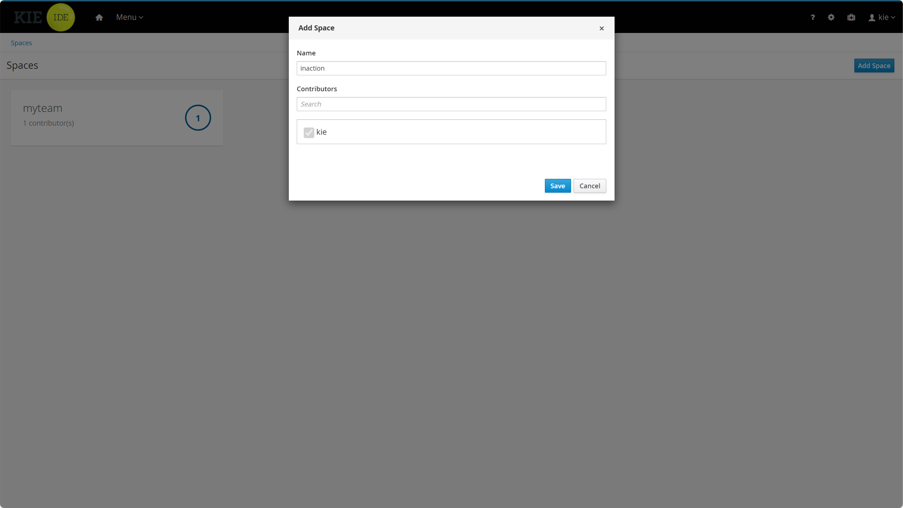
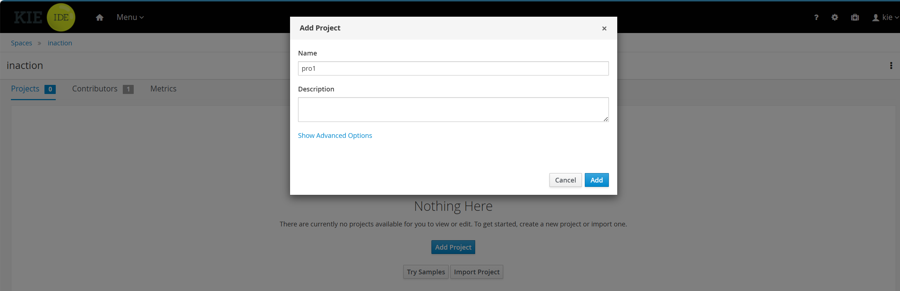
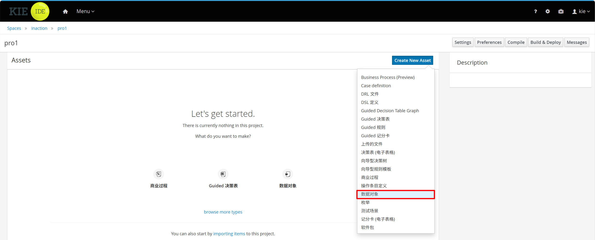
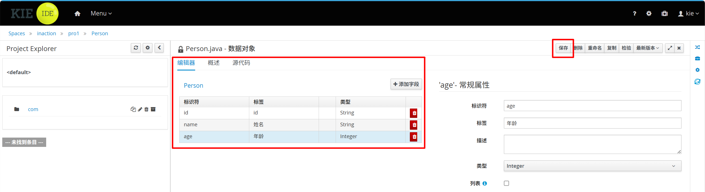
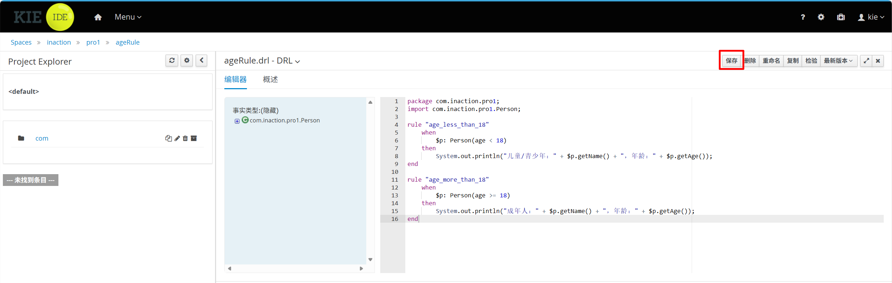
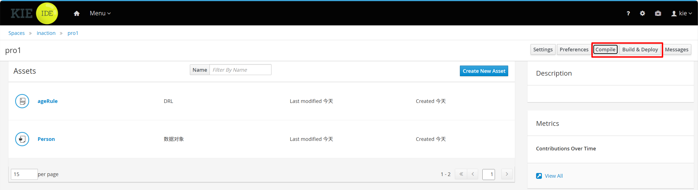

<!-- START doctoc generated TOC please keep comment here to allow auto update -->
<!-- DON'T EDIT THIS SECTION, INSTEAD RE-RUN doctoc TO UPDATE -->
**Table of Contents**  *generated with [DocToc](https://github.com/thlorenz/doctoc)*

- [1.前置准备](#1%E5%89%8D%E7%BD%AE%E5%87%86%E5%A4%87)
- [2.安装 Tomcat 8](#2%E5%AE%89%E8%A3%85-tomcat-8)
- [3.配置 WorkBench 依赖](#3%E9%85%8D%E7%BD%AE-workbench-%E4%BE%9D%E8%B5%96)
  - [3.1 创建 setenv.sh 文件](#31-%E5%88%9B%E5%BB%BA-setenvsh-%E6%96%87%E4%BB%B6)
  - [3.2 下载 WorkBench war 包并部署](#32-%E4%B8%8B%E8%BD%BD-workbench-war-%E5%8C%85%E5%B9%B6%E9%83%A8%E7%BD%B2)
  - [3.3 下载依赖 jar 包并放入 Tomcat lib 目录](#33-%E4%B8%8B%E8%BD%BD%E4%BE%9D%E8%B5%96-jar-%E5%8C%85%E5%B9%B6%E6%94%BE%E5%85%A5-tomcat-lib-%E7%9B%AE%E5%BD%95)
- [4.修改 Tomcat 配置文件](#4%E4%BF%AE%E6%94%B9-tomcat-%E9%85%8D%E7%BD%AE%E6%96%87%E4%BB%B6)
- [5.登录验证](#5%E7%99%BB%E5%BD%95%E9%AA%8C%E8%AF%81)
- [6.Drools WorkBench 可视化创建规则项目](#6drools-workbench-%E5%8F%AF%E8%A7%86%E5%8C%96%E5%88%9B%E5%BB%BA%E8%A7%84%E5%88%99%E9%A1%B9%E7%9B%AE)
- [7.在项目中使用部署的规则](#7%E5%9C%A8%E9%A1%B9%E7%9B%AE%E4%B8%AD%E4%BD%BF%E7%94%A8%E9%83%A8%E7%BD%B2%E7%9A%84%E8%A7%84%E5%88%99)

<!-- END doctoc generated TOC please keep comment here to allow auto update -->

## 1.前置准备

检查 / 安装 JDK（Tomcat 必需）

Tomcat 运行依赖 Java 环境，建议安装 JDK 8（适配你提供的 7.6.0.Final 版本 WorkBench）。

```bash
# 1. 检查是否已安装 JDK
java -version


[vagrant@server01 ~]$ java -version
java version "1.8.0_144"
Java(TM) SE Runtime Environment (build 1.8.0_144-b01)
Java HotSpot(TM) 64-Bit Server VM (build 25.144-b01, mixed mode)
```

创建目录

```bash
# 创建 /opt/module 目录（存放 WorkBench 压缩包）
mkdir -p /opt/module
# 赋予目录权限
chmod 755 /opt/module
```

## 2.安装 Tomcat 8

下载 Tomcat 8

```bash
# 下载 Tomcat 8.5.x（稳定版，适配 WorkBench）
wget https://archive.apache.org/dist/tomcat/tomcat-8/v8.5.93/bin/apache-tomcat-8.5.93.tar.gz

# 若 wget 下载慢，可手动下载后上传到 /opt 目录
```

解压 Tomcat

```bash
# 解压到 /opt/module 目录
tar -zxvf apache-tomcat-8.5.93.tar.gz -C /opt/module/

# 重命名目录（简化后续操作）
mv /opt/module/apache-tomcat-8.5.93 /opt/module/tomcat8
```

配置 Tomcat 权限

```bash
# 给 Tomcat 启动/停止脚本执行权限
chmod +x /opt/module/tomcat8/bin/*.sh

# 创建 Tomcat 运行用户（可选，增强安全性）
useradd -r -s /sbin/nologin tomcat
chown -R tomcat:tomcat /opt/module/tomcat8
```

配置 Tomcat 环境变量

```bash
# 编辑环境变量文件
vim /etc/profile

# 在文件末尾添加以下内容
export CATALINA_HOME=/opt/module/tomcat8
export PATH=$PATH:$CATALINA_HOME/bin

# 生效环境变量
source /etc/profile
```

赋予 Tomcat 执行权限

```bash
chmod +x $CATALINA_HOME/bin/*.sh
```

测试 Tomcat 启动

```bash
# 切换到 tomcat 用户启动（若创建了tomcat用户）
su - tomcat -c "/opt/module/tomcat8/bin/startup.sh"

# 若未创建 tomcat 用户，直接启动
/opt/module/tomcat8/bin/startup.sh

# 启动 Tomcat
$CATALINA_HOME/bin/startup.sh


# 查看启动日志（验证是否成功）
tail -f /opt/module/tomcat8/logs/catalina.out

# 访问测试（虚拟机IP替换为你的实际IP，如 192.168.1.100）
curl http://你的虚拟机IP:8080


# 看到 Tomcat 欢迎页即成功，停止 Tomcat 准备后续配置
$CATALINA_HOME/bin/shutdown.sh
```

- 若日志无报错、curl 返回 Tomcat 欢迎页 HTML，说明 Tomcat 安装成功。
- 停止 Tomcat 命令：`/opt/module/tomcat8/bin/shutdown.sh`

## 3.配置 WorkBench 依赖

### 3.1 创建 setenv.sh 文件

创建 setenv.sh 文件。Linux 下 Tomcat 启动会加载 `bin/setenv.sh`，需手动创建：

```bash
# 进入 Tomcat bin 目录
cd $CATALINA_HOME/bin

# 创建并编辑 setenv.sh
vim setenv.sh

# 写入以下内容（注意 Linux 换行符和路径格式）
CATALINA_OPTS="-Xmx512M \
    -Djava.security.auth.login.config=$CATALINA_HOME/webapps/kie-drools-wb/WEB-INF/classes/login.config \
    -Dorg.jboss.logging.provider=jdk \
    -Dorg.guvnor.m2repo.dir=$CATALINA_HOME/webapps/kie-drools-wb/maven2"

# 赋予执行权限
chmod +x setenv.sh
```

### 3.2 下载 WorkBench war 包并部署

```bash
# 进入 Tomcat webapps 目录
cd $CATALINA_HOME/webapps

# 下载 WorkBench war 包（7.6.0.Final 适配 Tomcat8）
wget https://download.jboss.org/drools/release/7.6.0.Final/kie-drools-wb-7.6.0.Final-tomcat8.war

# 重命名为 kie-drools-wb.war（和 Windows 一致）
mv kie-drools-wb-7.6.0.Final-tomcat8.war kie-drools-wb.war
```

### 3.3 下载依赖 jar 包并放入 Tomcat lib 目录

需要下载 3 个 jar 包到 `$CATALINA_HOME/lib` 目录

```bash
cd $CATALINA_HOME/lib

# 下载 kie-tomcat-integration-7.10.0.Final.jar
wget https://repo1.maven.org/maven2/org/kie/kie-tomcat-integration/7.10.0.Final/kie-tomcat-integration-7.10.0.Final.jar

# 下载 javax.security.jacc-api-1.5.jar
wget https://repo1.maven.org/maven2/javax/security/jacc/javax.security.jacc-api/1.5/javax.security.jacc-api-1.5.jar

# 下载 slf4j-api-1.7.25.jar
wget https://repo1.maven.org/maven2/org/slf4j/slf4j-api/1.7.25/slf4j-api-1.7.25.jar
```

## 4.修改 Tomcat 配置文件

配置 tomcat-users.xml（添加用户和角色）

```bash
# 编辑 tomcat-users.xml
vim $CATALINA_HOME/conf/tomcat-users.xml

# 替换原有内容为以下（和 Windows 一致，注意 XML 格式）
<?xml version='1.0' encoding='utf-8'?>
<tomcat-users xmlns="http://tomcat.apache.org/xml"
              xmlns:xsi="http://www.w3.org/2001/XMLSchema-instance"
              xsi:schemaLocation="http://tomcat.apache.org/xml tomcat-users.xsd"
              version="1.0">
  <!--定义admin角色-->
  <role rolename="admin"/>
  <!--定义用户：用户名kie，密码kie，角色admin-->
  <user username="kie" password="kie" roles="admin"/>
</tomcat-users>
```

配置 server.xml（添加 JACCValve 标签）

```bash
# 编辑 server.xml
vim $CATALINA_HOME/conf/server.xml

# 找到 <Engine> 标签（默认在 <Service> 内），在 <Engine> 标签内添加 Valve 标签：
# 示例（完整片段）：
<Engine name="Catalina" defaultHost="localhost">
  <!-- 添加这一行 -->
  <Valve className="org.kie.integration.tomcat.JACCValve"/>
  
  <Realm className="org.apache.catalina.realm.LockOutRealm">
    <Realm className="org.apache.catalina.realm.UserDatabaseRealm"
           resourceName="UserDatabase"/>
  </Realm>
  <Host name="localhost"  appBase="webapps"
        unpackWARs="true" autoDeploy="true">
    ...
  </Host>
</Engine>
```

启动 Tomcat 并验证 WorkBench

```bash
# 启动 Tomcat（建议前台启动，方便看日志）
$CATALINA_HOME/bin/startup.sh

# 查看启动日志（排查错误）
tail -f $CATALINA_HOME/logs/catalina.out


# 重启
/opt/module/tomcat8/bin/shutdown.sh
/opt/module/tomcat8/bin/startup.sh
```

访问 WorkBench

```bash
# 默认 8080 端口
http://你的CentOS服务器IP:8080/kie-drools-wb

# 如果修改了 Tomcat 端口为 80（需修改 server.xml 中 Connector 的 port="80"）
http://你的CentOS服务器IP/kie-drools-wb
```

## 5.登录验证

- 用户名：`kie`
- 密码：`kie`
- 登录成功后即可看到 WorkBench 首页

## 6.Drools WorkBench 可视化创建规则项目

1.创建空间



2.创建项目



3.创建实体类

> 进入项目 `pro1` → 点击 **Create New Asset**



> 添加字段



4.创建业务规则（DRL 规则）

> 回到项目页面 → **Create New Asset**。选择 **DRL file**。DRL File Name：`ageRule`。编写规则（示例：年龄判断）。点击右上角 **Save** 保存规则



```java
package com.inaction.pro1;
import com.inaction.pro1.Person;

rule "age_less_than_18"
    when
        $p: Person(age < 18)
    then
        System.out.println("儿童/青少年：" + $p.getName() + "，年龄：" + $p.getAge());
end

rule "age_more_than_18"
    when
        $p: Person(age >= 18)
    then
        System.out.println("成年人：" + $p.getName() + "，年龄：" + $p.getAge());
end
```

5.编译 & 打包规则为 Jar 包

> 回到项目主页面，点击右上角 **Build → Build & Deploy**。等待提示：**Build Successfully**。规则已自动打包为 Maven Jar 包，发布到 WorkBench 内置 Maven 仓库



6.Linux服务器查看jar包位置

```bash
[vagrant@server01 bin]$ find / -name "pro1-1.0.0.jar" 2>/dev/null
/home/vagrant/.m2/repository/com/inaction/pro1/1.0.0/pro1-1.0.0.jar
/opt/module/tomcat8/webapps/kie-drools-wb/maven2/com/inaction/pro1/1.0.0/pro1-1.0.0.jar
[vagrant@server01 bin]$
```

## 7.在项目中使用部署的规则

1.pom.xml依赖

```xml
<?xml version="1.0" encoding="UTF-8"?>
<project xmlns="http://maven.apache.org/POM/4.0.0" xmlns:xsi="http://www.w3.org/2001/XMLSchema-instance"
         xsi:schemaLocation="http://maven.apache.org/POM/4.0.0 http://maven.apache.org/xsd/maven-4.0.0.xsd">
    <modelVersion>4.0.0</modelVersion>

    <parent>
        <groupId>com.action.drools</groupId>
        <artifactId>drools</artifactId>
        <version>1.0-SNAPSHOT</version>
        <relativePath>../pom.xml</relativePath>
    </parent>

    <artifactId>drl-07-drools-workbench</artifactId>
    <version>0.0.1-SNAPSHOT</version>
    <packaging>jar</packaging>
    <name>drl-07-drools-workbench</name>
    <description>教程 8. WorkBench：安装说明与远程加载 WorkBench 部署的规则 jar</description>

    <properties>
        <project.build.sourceEncoding>UTF-8</project.build.sourceEncoding>
        <maven.compiler.source>1.8</maven.compiler.source>
        <maven.compiler.target>1.8</maven.compiler.target>
        <drools.version>7.10.0.Final</drools.version>
    </properties>

    <dependencies>
        <dependency>
            <groupId>org.drools</groupId>
            <artifactId>drools-compiler</artifactId>
            <version>${drools.version}</version>
        </dependency>
        <dependency>
            <groupId>junit</groupId>
            <artifactId>junit</artifactId>
            <version>4.12</version>
            <scope>test</scope>
        </dependency>
    </dependencies>

    <build>
        <plugins>
            <plugin>
                <groupId>org.apache.maven.plugins</groupId>
                <artifactId>maven-compiler-plugin</artifactId>
                <version>3.8.1</version>
                <configuration>
                    <source>1.8</source>
                    <target>1.8</target>
                </configuration>
            </plugin>
        </plugins>
    </build>
</project>
```

2.创建实体类

```java
package com.inaction.pro1;

public class Person implements java.io.Serializable {

    static final long serialVersionUID = 1L;

    private java.lang.String id;
    private java.lang.String name;
    private java.lang.Integer age;

    public Person() {
    }

    public java.lang.String getId() {
        return this.id;
    }

    public void setId(java.lang.String id) {
        this.id = id;
    }

    public java.lang.String getName() {
        return this.name;
    }

    public void setName(java.lang.String name) {
        this.name = name;
    }

    public java.lang.Integer getAge() {
        return this.age;
    }

    public void setAge(java.lang.Integer age) {
        this.age = age;
    }

    public Person(java.lang.String id, java.lang.String name, java.lang.Integer age) {
        this.id = id;
        this.name = name;
        this.age = age;
    }
}
```

3.测试类

```java
package com.action.drools;

import com.inaction.pro1.Person;
import org.drools.core.io.impl.UrlResource;
import org.junit.Test;
import org.kie.api.KieServices;
import org.kie.api.builder.KieModule;
import org.kie.api.builder.KieRepository;
import org.kie.api.runtime.KieContainer;
import org.kie.api.runtime.KieSession;

import java.io.InputStream;

public class WorkbenchRuleTest {

    private static final String JAR_URL =
            "http://192.168.56.11:8080/kie-drools-wb/maven2/com/inaction/pro1/1.0.0/pro1-1.0.0.jar";

    @Test
    public void test1() throws Exception {
        //通过此URL可以访问到maven仓库中的jar包
        //URL地址构成：http://ip地址:Tomcat端口号/WorkBench工程名/maven2/坐标/版本号/xxx.jar

        KieServices kieServices = KieServices.Factory.get();

        //通过Resource资源对象加载jar包
        UrlResource resource = (UrlResource) kieServices.getResources().newUrlResource(JAR_URL);
        //通过Workbench提供的服务来访问maven仓库中的jar包资源，需要先进行Workbench的认证
        resource.setUsername("kie");
        resource.setPassword("kie");
        resource.setBasicAuthentication("enabled");

        //将资源转换为输入流，通过此输入流可以读取jar包数据
        InputStream inputStream = resource.getInputStream();

        //创建仓库对象，仓库对象中保存Drools的规则信息
        KieRepository repository = kieServices.getRepository();

        //通过输入流读取maven仓库中的jar包数据，包装成KieModule模块添加到仓库中
        KieModule kieModule =
                repository.
                        addKieModule(kieServices.getResources().newInputStreamResource(inputStream));

        //基于KieModule模块创建容器对象，从容器中可以获取session会话
        KieContainer kieContainer = kieServices.newKieContainer(kieModule.getReleaseId());
        KieSession session = kieContainer.newKieSession();

        Person person = new Person();
        person.setAge(10);
        session.insert(person);

        session.fireAllRules();
        session.dispose();
    }
}
```

4.运行结果

```java
儿童/青少年：null，年龄：10
Disconnected from the target VM, address: '127.0.0.1:2759', transport: 'socket'
Process finished with exit code 0
```

5.修改规则，重新部署测试

```java
package com.inaction.pro1;
import com.inaction.pro1.Person;

rule "age_less_than_18"
    when
        $p: Person(age < 18)
    then
        System.out.println("【新版规则】未成年：" + $p.getName() + " 年龄：" + $p.getAge());
end

rule "age_more_than_18"
    when
        $p: Person(age >= 18)
    then
        System.out.println("【新版规则】已成年：" + $p.getName() + " 年龄：" + $p.getAge());
end

rule "age_baby"
    when
        $p: Person(age < 6)
    then
        System.out.println("【新版规则】婴幼儿：" + $p.getName() + " 年龄：" + $p.getAge());
end
```

6.本地代码拉取动态规则

```java
package com.action.drools;

import com.inaction.pro1.Person;
import org.drools.core.io.impl.UrlResource;
import org.junit.Test;
import org.kie.api.KieServices;
import org.kie.api.builder.KieModule;
import org.kie.api.builder.KieRepository;
import org.kie.api.runtime.KieContainer;
import org.kie.api.runtime.KieSession;

import java.io.InputStream;

/**
 * 对应教程 8.3.7：从 WorkBench 暴露的 Maven 仓库 URL 加载规则 jar 并执行。
 * <p>
 * 默认跳过（无需启动 Tomcat）。启用方式：
 * {@code mvn test -Dworkbench.remote.test=true}
 */
public class WorkbenchRemoteRulesTest {

    @Test
    public void test1() throws Exception {
        //通过此URL可以访问到maven仓库中的jar包
        //URL地址构成：http://ip地址:Tomcat端口号/WorkBench工程名/maven2/坐标/版本号/xxx.jar
        String url = "http://192.168.56.11:8080/kie-drools-wb/maven2/com/inaction/pro1/1.0.0/pro1-1.0.0.jar";

        KieServices kieServices = KieServices.Factory.get();

        //通过Resource资源对象加载jar包
        UrlResource resource = (UrlResource) kieServices.getResources().newUrlResource(url);
        //通过Workbench提供的服务来访问maven仓库中的jar包资源，需要先进行Workbench的认证
        resource.setUsername("kie");
        resource.setPassword("kie");
        resource.setBasicAuthentication("enabled");

        //将资源转换为输入流，通过此输入流可以读取jar包数据
        InputStream inputStream = resource.getInputStream();

        //创建仓库对象，仓库对象中保存Drools的规则信息
        KieRepository repository = kieServices.getRepository();

        //通过输入流读取maven仓库中的jar包数据，包装成KieModule模块添加到仓库中
        KieModule kieModule = repository.addKieModule(kieServices.getResources().newInputStreamResource(inputStream));

        //基于KieModule模块创建容器对象，从容器中可以获取session会话
        KieContainer kieContainer = kieServices.newKieContainer(kieModule.getReleaseId());
        KieSession session = kieContainer.newKieSession();

        Person person = new Person();
        person.setAge(6);
        session.insert(person);

        session.fireAllRules();
        session.dispose();
    }
}
```

运行结果：

> 【新版规则】未成年：null 年龄：6
