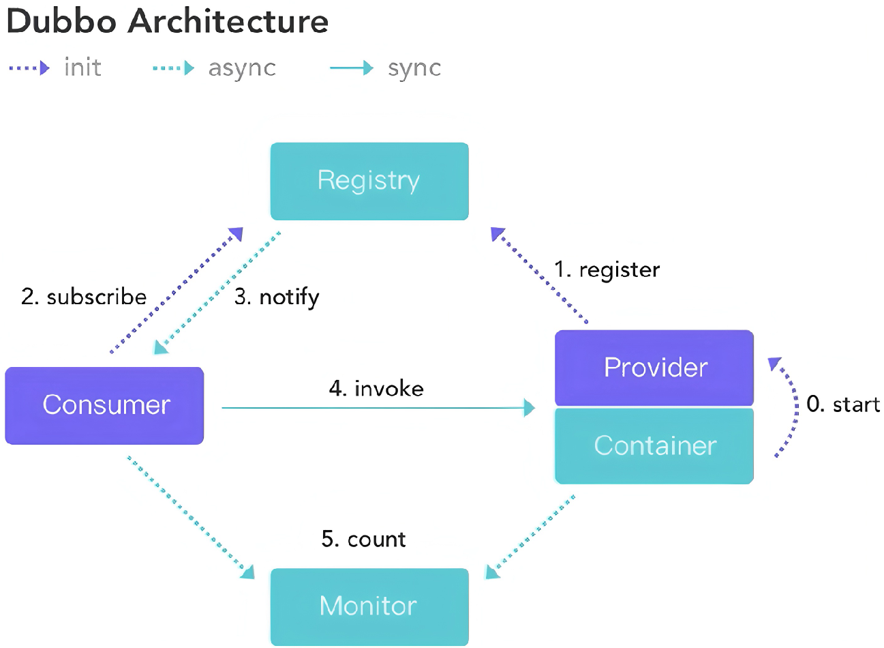

<!-- START doctoc generated TOC please keep comment here to allow auto update -->
<!-- DON'T EDIT THIS SECTION, INSTEAD RE-RUN doctoc TO UPDATE -->
**Table of Contents**  *generated with [DocToc](https://github.com/thlorenz/doctoc)*

- [1.架构演进](#1%E6%9E%B6%E6%9E%84%E6%BC%94%E8%BF%9B)
  - [1.1 单体架构](#11-%E5%8D%95%E4%BD%93%E6%9E%B6%E6%9E%84)
  - [1.2 垂直应⽤架构](#12-%E5%9E%82%E7%9B%B4%E5%BA%94%E2%BD%A4%E6%9E%B6%E6%9E%84)
  - [1.3 分布式应用架构阶段](#13-%E5%88%86%E5%B8%83%E5%BC%8F%E5%BA%94%E7%94%A8%E6%9E%B6%E6%9E%84%E9%98%B6%E6%AE%B5)
  - [1.4 微服务架构阶段](#14-%E5%BE%AE%E6%9C%8D%E5%8A%A1%E6%9E%B6%E6%9E%84%E9%98%B6%E6%AE%B5)
- [2.注册中心](#2%E6%B3%A8%E5%86%8C%E4%B8%AD%E5%BF%83)
  - [2.1 概述](#21-%E6%A6%82%E8%BF%B0)
  - [2.1 搭建`zookeeper`注册中心](#21-%E6%90%AD%E5%BB%BAzookeeper%E6%B3%A8%E5%86%8C%E4%B8%AD%E5%BF%83)
- [3.`RPC`](#3rpc)
  - [3.1 `RPC`简介](#31-rpc%E7%AE%80%E4%BB%8B)
  - [3.2 手写`RPC`项目](#32-%E6%89%8B%E5%86%99rpc%E9%A1%B9%E7%9B%AE)
    - [3.2.1 服务提供者的实现](#321-%E6%9C%8D%E5%8A%A1%E6%8F%90%E4%BE%9B%E8%80%85%E7%9A%84%E5%AE%9E%E7%8E%B0)
    - [3.2.2 服务消费者封装远程过程调用对象](#322-%E6%9C%8D%E5%8A%A1%E6%B6%88%E8%B4%B9%E8%80%85%E5%B0%81%E8%A3%85%E8%BF%9C%E7%A8%8B%E8%BF%87%E7%A8%8B%E8%B0%83%E7%94%A8%E5%AF%B9%E8%B1%A1)
    - [3.2.3 服务消费者调用服务提供者的逻辑](#323-%E6%9C%8D%E5%8A%A1%E6%B6%88%E8%B4%B9%E8%80%85%E8%B0%83%E7%94%A8%E6%9C%8D%E5%8A%A1%E6%8F%90%E4%BE%9B%E8%80%85%E7%9A%84%E9%80%BB%E8%BE%91)
    - [3.2.4 服务调用的完整过程](#324-%E6%9C%8D%E5%8A%A1%E8%B0%83%E7%94%A8%E7%9A%84%E5%AE%8C%E6%95%B4%E8%BF%87%E7%A8%8B)
    - [3.2.5 `RPC`远程调用项目总结（`DeepSeek`）](#325-rpc%E8%BF%9C%E7%A8%8B%E8%B0%83%E7%94%A8%E9%A1%B9%E7%9B%AE%E6%80%BB%E7%BB%93deepseek)
- [4.`dubbo`](#4dubbo)
  - [4.1 简介](#41-%E7%AE%80%E4%BB%8B)
  - [4.2 `dubbo` 架构](#42-dubbo-%E6%9E%B6%E6%9E%84)
  - [4.3 `dubbo`远程通信原理](#43-dubbo%E8%BF%9C%E7%A8%8B%E9%80%9A%E4%BF%A1%E5%8E%9F%E7%90%86)
  - [4.4 `Spring`整合`dubbo`](#44-spring%E6%95%B4%E5%90%88dubbo)
    - [4.4.1 定义服务接口](#441-%E5%AE%9A%E4%B9%89%E6%9C%8D%E5%8A%A1%E6%8E%A5%E5%8F%A3)
    - [4.4.2 服务提供者](#442-%E6%9C%8D%E5%8A%A1%E6%8F%90%E4%BE%9B%E8%80%85)
    - [4.4.3 服务消费者](#443-%E6%9C%8D%E5%8A%A1%E6%B6%88%E8%B4%B9%E8%80%85)
  - [4.5 `SpringBoot`整合`dubbo`](#45-springboot%E6%95%B4%E5%90%88dubbo)
    - [4.5.1 定义服务接口](#451-%E5%AE%9A%E4%B9%89%E6%9C%8D%E5%8A%A1%E6%8E%A5%E5%8F%A3)
    - [4.5.2 服务提供者](#452-%E6%9C%8D%E5%8A%A1%E6%8F%90%E4%BE%9B%E8%80%85)
    - [4.5.3 服务消费者](#453-%E6%9C%8D%E5%8A%A1%E6%B6%88%E8%B4%B9%E8%80%85)
  - [4.6 `dubbo`服务启动源码剖析](#46-dubbo%E6%9C%8D%E5%8A%A1%E5%90%AF%E5%8A%A8%E6%BA%90%E7%A0%81%E5%89%96%E6%9E%90)
- [5.`dubbo`用法示例](#5dubbo%E7%94%A8%E6%B3%95%E7%A4%BA%E4%BE%8B)
  - [5.1 `version`版本号](#51-version%E7%89%88%E6%9C%AC%E5%8F%B7)
  - [5.2 指定`protocol`协议](#52-%E6%8C%87%E5%AE%9Aprotocol%E5%8D%8F%E8%AE%AE)
  - [5.3 使用rest协议调用服务](#53-%E4%BD%BF%E7%94%A8rest%E5%8D%8F%E8%AE%AE%E8%B0%83%E7%94%A8%E6%9C%8D%E5%8A%A1)
  - [5.4 使用`url`指定服务提供者](#54-%E4%BD%BF%E7%94%A8url%E6%8C%87%E5%AE%9A%E6%9C%8D%E5%8A%A1%E6%8F%90%E4%BE%9B%E8%80%85)
  - [5.5 服务超时](#55-%E6%9C%8D%E5%8A%A1%E8%B6%85%E6%97%B6)
  - [5.6 集群容错](#56-%E9%9B%86%E7%BE%A4%E5%AE%B9%E9%94%99)
  - [5.7 服务降级](#57-%E6%9C%8D%E5%8A%A1%E9%99%8D%E7%BA%A7)
  - [5.8 本地存根](#58-%E6%9C%AC%E5%9C%B0%E5%AD%98%E6%A0%B9)
  - [5.9 参数回调](#59-%E5%8F%82%E6%95%B0%E5%9B%9E%E8%B0%83)
  - [5.10 异步调用](#510-%E5%BC%82%E6%AD%A5%E8%B0%83%E7%94%A8)
- [6.`dubbo`的负载均衡策略](#6dubbo%E7%9A%84%E8%B4%9F%E8%BD%BD%E5%9D%87%E8%A1%A1%E7%AD%96%E7%95%A5)
  - [6.1 负载均衡策略](#61-%E8%B4%9F%E8%BD%BD%E5%9D%87%E8%A1%A1%E7%AD%96%E7%95%A5)
  - [6.2 配置负载均衡策略](#62-%E9%85%8D%E7%BD%AE%E8%B4%9F%E8%BD%BD%E5%9D%87%E8%A1%A1%E7%AD%96%E7%95%A5)
  - [6.3 负载均衡策略①：一致性hash](#63-%E8%B4%9F%E8%BD%BD%E5%9D%87%E8%A1%A1%E7%AD%96%E7%95%A5%E2%91%A0%E4%B8%80%E8%87%B4%E6%80%A7hash)
      - [6.3.1 一致性hash概述](#631-%E4%B8%80%E8%87%B4%E6%80%A7hash%E6%A6%82%E8%BF%B0)
      - [6.3.2 一致性hash的特性](#632-%E4%B8%80%E8%87%B4%E6%80%A7hash%E7%9A%84%E7%89%B9%E6%80%A7)
      - [6.3.3 虚拟节点](#633-%E8%99%9A%E6%8B%9F%E8%8A%82%E7%82%B9)
      - [6.3.4 均匀一致性hash](#634-%E5%9D%87%E5%8C%80%E4%B8%80%E8%87%B4%E6%80%A7hash)
      - [6.3.5   配置一致性hash策略](#635---%E9%85%8D%E7%BD%AE%E4%B8%80%E8%87%B4%E6%80%A7hash%E7%AD%96%E7%95%A5)
  - [6.4 负载均衡策略②：最少活跃调用数的实现](#64-%E8%B4%9F%E8%BD%BD%E5%9D%87%E8%A1%A1%E7%AD%96%E7%95%A5%E2%91%A1%E6%9C%80%E5%B0%91%E6%B4%BB%E8%B7%83%E8%B0%83%E7%94%A8%E6%95%B0%E7%9A%84%E5%AE%9E%E7%8E%B0)
- [7.安装`Dubbo admin`监管平台](#7%E5%AE%89%E8%A3%85dubbo-admin%E7%9B%91%E7%AE%A1%E5%B9%B3%E5%8F%B0)
- [8.`SPI`可扩展机制](#8spi%E5%8F%AF%E6%89%A9%E5%B1%95%E6%9C%BA%E5%88%B6)
  - [8.1 `Java`的`SPI` 机制](#81-java%E7%9A%84spi-%E6%9C%BA%E5%88%B6)
      - [8.1.1 `JDBC`应用案例](#811-jdbc%E5%BA%94%E7%94%A8%E6%A1%88%E4%BE%8B)
      - [8.1.2 `Java SPI`机制演示——`deepseek`](#812-java-spi%E6%9C%BA%E5%88%B6%E6%BC%94%E7%A4%BAdeepseek)
      - [8.1.3 `Java`的`SPI` 机制——`deepseek`](#813-java%E7%9A%84spi-%E6%9C%BA%E5%88%B6deepseek)
      - [8.1.4 `Java SPI`机制缺点——`deepseek`](#814-java-spi%E6%9C%BA%E5%88%B6%E7%BC%BA%E7%82%B9deepseek)
  - [8.2 dubbo SPI机制](#82-dubbo-spi%E6%9C%BA%E5%88%B6)
      - [8.2.1 dubbo SPI机制演示](#821-dubbo-spi%E6%9C%BA%E5%88%B6%E6%BC%94%E7%A4%BA)
      - [8.2.2 dubbo SPI机制演示——`deepseek`](#822-dubbo-spi%E6%9C%BA%E5%88%B6%E6%BC%94%E7%A4%BAdeepseek)
- [9.`dubbo`源码剖析](#9dubbo%E6%BA%90%E7%A0%81%E5%89%96%E6%9E%90)
  - [9.1 `dubbo`服务调用过程](#91-dubbo%E6%9C%8D%E5%8A%A1%E8%B0%83%E7%94%A8%E8%BF%87%E7%A8%8B)
  - [9.2 关于dubbolnvoker的装饰](#92-%E5%85%B3%E4%BA%8Edubbolnvoker%E7%9A%84%E8%A3%85%E9%A5%B0)
  - [9.3 权重轮询算法](#93-%E6%9D%83%E9%87%8D%E8%BD%AE%E8%AF%A2%E7%AE%97%E6%B3%95)
  - [9.4 `Dubbo`服务调用过程——`deepseek`](#94-dubbo%E6%9C%8D%E5%8A%A1%E8%B0%83%E7%94%A8%E8%BF%87%E7%A8%8Bdeepseek)
- [10.总结——`deepseek`](#10%E6%80%BB%E7%BB%93deepseek)
  - [10.1 `dubbo` 架构&原理](#101-dubbo-%E6%9E%B6%E6%9E%84%E5%8E%9F%E7%90%86)

<!-- END doctoc generated TOC please keep comment here to allow auto update -->


`Apache Dubbo`提供六大核心能力：

- 面向接口代理的高性能RPC调用

- 智能容错和负载均衡

- 服务自动注册和发现

- 高度可扩展能力

- 运行期流量调度

- 可视化的服务治理与运维

## 1.架构演进

为什么现在的系统不⽤单体架构，⽽⽤微服务架构。

### 1.1 单体架构

单体架构：

- 特点：当网站流量很小时，只需一个应用，将所有功能都部署在一起，以减少部署节点和成本。此时，用于简化增删改查工作量的数据访问框架(ORM)是关键。
- 示例图：


单体架构优化：

- 为了提⾼系统的吞吐量，单体架构可以进行垂直升级和⽔平扩展

  - 垂直升级：4核16G => 8核64G

  - 水平扩展：一台服务器扩展成多台

- 垂直升级和⽔平扩展存在以下⼏个问题：

  - 提升的性能是有限的

  - 成本过⾼，没有办法针对某⼀个具体的模块做性能的提升，因为单体，所有模块都是在一起的。

  -  更新、维护成本⾮常⾼，对于系统中要修改或增加的功能，整个发布的流程⾮常麻烦。 某⼀个模块出现了bug，就会影响整个系统

`DeepSeek`：

> 在单体架构中，**垂直升级（Vertical Scaling）** 和 **水平扩展（Horizontal Scaling）** 是两种应对系统负载增长的核心策略。它们解决的问题相同（提升系统性能/容量），但实现方式和适用场景截然不同。
>
> **一、垂直升级（Scale Up）**
>
> - **定义**：通过提升**单个服务器**的硬件资源（CPU、内存、磁盘I/O、网络带宽等）来增强系统处理能力。
>   **核心思想**：**“更大更强”** —— 用更强大的机器替换旧机器。
>
> - **具体操作**：
>
>   - 升级CPU（更多核心/更高主频）
>
>   - 增加内存容量
>
>   - 使用更快的SSD替换HDD
>
>   - 升级网卡（如1Gbps → 10Gbps）
>
>   - 扩展数据库连接池或调整JVM堆大小
>
> **二、水平扩展（Scale Out）**
>
> - **定义**：通过**增加服务器数量**分担负载，通常配合负载均衡器分发请求。
>   **核心思想**：**“更多节点”** —— 用多台普通机器替代单台高端机器。
>
> - **具体操作**：
>
>   - **无状态服务扩展**：
>
>     - 部署多个应用实例
>
>     - 前置负载均衡器（如Nginx、HAProxy）
>
>       ```mermaid
>       graph LR
>       A[客户端] --> B[负载均衡器]
>       B --> C[实例1]
>       B --> D[实例2]
>       B --> E[实例3]
>       ```
>
>   - **数据库扩展**（更复杂）：
>
>     - 读写分离（主库写，从库读）
>     - 分库分表（如ShardingSphere）
>     - 使用分布式缓存（Redis/Memcached）

### 1.2 垂直应⽤架构

垂直应⽤架构：

- 当访问量逐渐增大，单一应用增加机器带来的加速度越来越小，提升效率的方法之一是将应用拆成互不相干的几个应用，以提升效率。此时，用于加速前端页面开发的Web框架(MVC)是关键。
- 根据业务的边界，对单体应⽤进⾏垂直拆分，将⼀个系统拆分成多个服务。⽐如⼀个管理系统，可以拆分成权限系统、业务系统、数据系统等。


- 垂直应⽤存在的问题： 

  - 每个独⽴部署的服务之间，公共的部分需要部署多份。那么对公共部分的修改、部署、更新 都需要重复的操作，带来⽐较⼤的成本

  - 为了解决这⼀问题，接下来就进⼊到分布式应⽤架构阶段

`DeepSeek`：

> 垂直应用架构（Vertical Application Architecture）是单体架构向分布式系统演进的关键过渡形态，核心思想是按业务功能纵向拆分应用。它诞生于互联网流量快速增长初期（约2000-2010年），用于解决单体架构的扩展性瓶颈，是微服务架构的前身。
>
> 1.单体架构痛点
>
> - 所有功能耦合在单一代码库中
> - 团队协作冲突（代码合并地狱）
> - 发布风险高（小修改需全量部署）
> - 垂直升级成本剧增：硬件升级无法支撑指数级流量增长
>
> 2.解决思路
>
> - 将大单体按业务线拆分为多个独立应用
>
>   ```mermaid
>   graph TD
>   A[单体电商系统] --> B[拆分策略]
>   B --> C1[用户系统]
>   B --> C2[订单系统]
>   B --> C3[商品系统]
>   B --> C4[支付系统]
>   ```
>
> 3.核心特征
>
> - 业务维度拆分
>
>   - 每个应用负责完整业务链（如订单应用包含下单、支付、物流跟踪）
>
>   - 拆分标准：业务功能耦合度 > 技术相似度
>
> - 技术栈独立
>
>   - 不同垂直应用可使用不同技术（如Java/Python）
>
>   - 独立数据库（分库但未分表）：
>
> - 轻量级交互
>
>   - 通过HTTP API/RPC通信（早期多使用SOAP）
>
>   - 前端可能整合为统一门户（Portal）

### 1.3 分布式应用架构阶段

分布式应⽤架构：

- 当垂直应用越来越多，应用之间交互不可避免，将公共业务抽取出来，作为独立的服务，逐渐形成稳定的服务中心，使前端应用能更快速的响应多变的市场需求。此时，用于提高业务复用及整合的分布式服务框架(RPC)是关键。

- 在这个阶段⾥，将服务内部公⽤的模块抽取出来，部署成⼀个独⽴的服务，那么需要解决服 务之间的⾼效通信问题。 

- 分布式应⽤架构阶段会存在新的问题：

  - 服务越来越多，这么多服务如何被发现？ 

  - 服务越来越多，服务如何被治理？ 

  - 服务之间如何实现⾼效通信？

- 图示：


`DeepSeek`：

> 分布式应用架构（Distributed Application Architecture）是通过网络将系统拆分为协同工作的独立组件的架构范式，核心目标是解决单机算力与存储瓶颈，并实现高可用、弹性扩展。
>
> 核心特征：
>
> - 物理分布，逻辑统一
>
>   - 组件部署在不同物理节点（服务器/容器）
>
>   - 通过通信协议对外暴露统一服务
>
> - 服务自治原则
>
>   - 每个服务独立开发、部署、伸缩（如用户服务用Java，推荐服务用Python）
>
>   - 私有数据存储（订单服务独占OrderDB）
>
> - 去中心化治理
>
>   ```mermaid
>   graph LR
>   A[服务A] -->|直接调用| B[服务B]
>   A -->|直接调用| C[服务C]
>   B -->|调用| C
>   ```
>
> - 故障隔离设计
>
>   - 熔断机制：服务B故障时，服务A自动降级
>   - 限流：防止雪崩效应（如Sentinel流控规则）

### 1.4 微服务架构阶段

微服务架构：

- 微服务架构是分布式架构的高阶形态，通过将应用拆分为松散耦合、独立部署的小型服务，每个服务围绕业务能力构建，并拥有独立数据存储。

- 微服务架构阶段主要解决的⼏个问题：

  - 服务的注册和发现：这么多服务如何注册。这么多服务如何被发现

  - 服务之间的⾼效调⽤：使⽤rpc或者http进⾏通信

  - 服务治理：服务权重、负载均衡、服务熔断、限流等等⼀些服务治理⽅⾯的问题


## 2.注册中心

### 2.1 概述

注册中⼼的选型： 

- ⾃研：redis

- zookeeper（dubbo的推荐）：zk是⼀个分布式服务组件中的⼀个⾮常重要的组件，⾥⾯ 涉及到很多优秀的分布式设计思想，堪称⿐祖地位。 
- nacos：既可以作为注册中⼼使⽤，也可以作为分布式配置中⼼使⽤
- eureka：是spring cloud netflix框架中著名的注册中⼼，⾥⾯的服务的续约、⼼跳等等的设计⾮常的经典


`DeepSeek`：

- 注册中心核心作用：解决分布式架构下服务的动态发现与治理问题，本质是服务目录的实时数据库

  ```mermaid
  graph LR
      Provider[服务提供者] -->|注册实例| Registry[注册中心]
      Consumer[服务消费者] -->|拉取实例列表| Registry
      Consumer -->|调用| Provider
  ```

- 主流注册中心对比

| **特性**         | **Nacos** (阿里)    | **Eureka** (Netflix)  | **Zookeeper** (Apache) | **Consul** (HashiCorp) |
| :--------------- | :------------------ | :-------------------- | :--------------------- | :--------------------- |
| **CAP模型**      | **AP/CP可切换**     | **AP**                | **CP**                 | **CP**                 |
| **健康检查**     | TCP/HTTP/MYSQL      | 客户端心跳            | 会话心跳               | TCP/HTTP+gRPC          |
| **配置管理**     | ✅ 内置              | ❌ 需配合Spring Config | ❌ 需独立部署           | ✅ 内置                 |
| **服务发现协议** | DNS/HTTP            | HTTP                  | ZK协议                 | DNS/HTTP               |
| **雪崩保护**     | ✅ 主动剔除+流量控制 | ✅ 自我保护模式        | ❌                      | ❌                      |
| **多数据中心**   | ✅                   | ❌                     | ❌                      | ✅                      |
| **适用场景**     | 云原生全场景        | Spring Cloud生态      | 强一致性场景           | 多云环境               |

### 2.1 搭建`zookeeper`注册中心

```sh
# 克隆⼀个虚拟机
# 安装jdk 解压zk的压缩包
# 进⼊到conf⽂件夹内，重命名：zoo_samples.cfg->zoo.cfg
# 进⼊到bin中，使⽤命令来操作zk
./zkServer.sh start # 启动zk
./zkServer.sh status # 查看zk状态，如果状态是：Mode: standalone 表示启动成功
./zkServer.sh stop # 关闭zk
```

`centos`服务器安装`zookeeper`：

```sh
# 1.安装 Java 环境，ZooKeeper 依赖Java(JDK 1.8+）
# 安装JDK 1.8+
# yum -y install java-1.8.0-openjdk-devel
[root@centos-aliyun ~]# yum -y install java-1.8.0-openjdk-devel
# 验证安装
[root@centos-aliyun ~]# java -version

# 防火墙配置
# 开放 ZooKeeper 的默认端口（2181）及集群通信端口（2888/3888）
# firewall-cmd --permanent --add-port={2181,2888,3888}/tcp
# firewall-cmd --reload

# 2.安装 ZooKeeper
# 使用稳定版本（推荐 3.6.x+）
[root@centos-aliyun local]# pwd
/usr/local
[root@centos-aliyun local]# sudo wget https://archive.apache.org/dist/zookeeper/zookeeper-3.8.0/apache-zookeeper-3.8.0-bin.tar.gz

[root@centos-aliyun local]# ls
apache-zookeeper-3.8.0-bin.tar.gz
# 解压安装
[root@centos-aliyun local]# sudo tar -zxvf apache-zookeeper-3.8.0-bin.tar.gz
[root@centos-aliyun local]# sudo mv apache-zookeeper-3.8.0-bin zookeeper

# 创建数据目录
[root@centos-aliyun local]# sudo mkdir -p /var/lib/zookeeper/data
[root@centos-aliyun local]# sudo mkdir -p /var/lib/zookeeper/logs

# 配置 ZooKeeper
[root@centos-aliyun local]# cd /usr/local/zookeeper/conf
[root@centos-aliyun conf]# sudo cp zoo_sample.cfg zoo.cfg
[root@centos-aliyun conf]# sudo vi zoo.cfg
# 修改以下关键参数
dataDir=/var/lib/zookeeper/data
dataLogDir=/var/lib/zookeeper/logs


# 3.启动 ZooKeeper
# 启动服务
[root@centos-aliyun conf]# sudo /usr/local/zookeeper/bin/zkServer.sh start
/bin/java
ZooKeeper JMX enabled by default
Using config: /usr/local/zookeeper/bin/../conf/zoo.cfg
Starting zookeeper ... STARTED

# 验证状态
# 应看到 "Mode: standalone"
[root@centos-aliyun conf]# sudo /usr/local/zookeeper/bin/zkServer.sh status
/bin/java
ZooKeeper JMX enabled by default
Using config: /usr/local/zookeeper/bin/../conf/zoo.cfg
Client port found: 2181. Client address: localhost. Client SSL: false.
Mode: standalone

# 测试连接
[root@centos-aliyun conf]# sudo /usr/local/zookeeper/bin/zkServer.sh status
# 执行命令后输入：
ls /
# 应看到 [zookeeper]
```

## 3.`RPC`

### 3.1 `RPC`简介

dubbo是⼀款⾼性能的rpc框架。什么是rpc呢？ 

rpc是⼀种协议：是⼀种远程过程调⽤（remote procudure call）协议

rpc协议是在应⽤层之上的协议，规定了通信双⽅进⾏通信的数据格式是什么样的，及数据如何传输，指明调⽤的类或接⼝指明调⽤的⽅法及参数


`DeepSeek`：

- `RPC` 核心概念：`RPC（Remote Procedure Call）` 是一种跨网络调用远程服务的技术，让开发者能够像调用本地函数一样调用远程服务，隐藏底层网络通信细节。
- 核心价值：
  - 位置透明性：调用者无需感知服务部署位置
  - 开发效率：避免手动处理Socket通信、序列化等底层细节
  - 语言无关：支持跨语言调用（如Java调用Go服务）

- 主流 `RPC` 框架对比：

| **框架**     | **发起方** | **协议**  | **序列化** | **特点**                   | **适用场景**   |
| :----------- | :--------- | :-------- | :--------- | :------------------------- | :------------- |
| **gRPC**     | Google     | HTTP/2    | Protobuf   | 多语言支持、流式处理       | 云原生/微服务  |
| **Dubbo**    | 阿里巴巴   | TCP自定义 | Hessian2   | 丰富治理功能、Java生态完善 | 企业级Java应用 |
| **Thrift**   | Facebook   | TCP/HTTP  | Binary     | 跨语言代码生成能力强       | 多语言混合架构 |
| **JSON-RPC** | 社区标准   | HTTP      | JSON       | 简单易用、无需IDL          | 轻量级Web服务  |

- RPC 与 HTTP 全面对比

| **维度**       | **RPC**                                | **HTTP (RESTful)**                  |
| :------------- | :------------------------------------- | :---------------------------------- |
| **设计目标**   | **高效服务间通信**                     | **通用资源传输**                    |
| **协议层**     | 传输层/应用层自定义协议（如Dubbo协议） | 纯应用层协议（HTTP/1.1，HTTP/2）    |
| **数据格式**   | 二进制编码（Protobuf/Thrift）          | 文本格式（JSON/XML）                |
| **连接方式**   | 长连接（TCP复用）                      | 短连接（HTTP/1.1）或流式（HTTP/2）  |
| **性能基准**   | ⭐⭐⭐⭐⭐（延迟0.1-1ms）                   | ⭐⭐（延迟5-100ms）                   |
| **服务治理**   | 内置负载均衡/熔断等                    | 需额外组件（如Spring Cloud）        |
| **调用方式**   | 函数式调用（参数+返回值）              | 动词操作资源（GET/POST/PUT/DELETE） |
| **跨语言支持** | 需IDL生成多语言代码                    | 天然支持（JSON标准）                |
| **防火墙穿透** | 需开放自定义端口                       | 80/443端口直接通行                  |
| **典型框架**   | gRPC, Dubbo, Thrift                    | Spring MVC, Express, Django REST    |

### 3.2 手写`RPC`项目

参考`dubbo-init-demo`项目

#### 3.2.1 服务提供者的实现

消费者：

```java
// 消费者调用服务提供者
// RPC：让开发者能够像调用本地函数一样调用远程服务
public class Consumer {
    public static void main(String[] args) {
        HelloService helloService = ProxyFactory.getProxy(HelloService.class);
        String name = helloService.hello("qf");
        System.out.println(name);
    }
}
```

本地方法定义：

```java
public interface HelloService {
    String hello(String name);
}
```

```java
public class HelloServiceImpl implements HelloService {
    @Override
    public String hello(String name) {
        return "hello:" + name;
    }
}
```

服务提供者：

```java
public class Provider {
    public static void main(String[] args) {
        URL url = new URL("localhost",8080);

        //模拟远程注册中心
        RemoteMapRegister.regist(HelloService.class.getName(), url);

        //指明服务的实现类
        LocalRegister.regist(HelloService.class.getName(), HelloServiceImpl.class);

        Protocol protocol = ProtocolFactory.getProtocol();
        protocol.start(url);
    }
}
```

模拟远程注册中心：

```java
import java.io.*;
import java.util.ArrayList;
import java.util.HashMap;
import java.util.List;
import java.util.Map;
/**
 * 模拟远程注册中心
 */
public class RemoteMapRegister {

    private static Map<String, List<URL>> REGISTER = new HashMap<>();


    public static void regist(String interfaceName, URL url){

        List<URL> list = REGISTER.get(interfaceName);
        if (list == null) {
            list = new ArrayList<>();

        }
        list.add(url);

        REGISTER.put(interfaceName, list);
        //saveFile实现REGISTER在provider和consumer之间共享
        saveFile();
    }

    public static List<URL> get(String interfaceName) {
        REGISTER = getFile();

        List<URL> list = REGISTER.get(interfaceName);
        return list;
    }


    private static void saveFile() {
        try {
            FileOutputStream fileOutputStream = new FileOutputStream("classpath:register.txt");
            ObjectOutputStream objectOutputStream = new ObjectOutputStream(fileOutputStream);
            objectOutputStream.writeObject(REGISTER);
        } catch (IOException e) {
            e.printStackTrace();
        }
    }

    private static Map<String, List<URL>> getFile() {
        try {
            FileInputStream fileInputStream = new FileInputStream("classpath:register.txt");
            ObjectInputStream objectInputStream = new ObjectInputStream(fileInputStream);
            return (Map<String, List<URL>>) objectInputStream.readObject();
        } catch (IOException | ClassNotFoundException e) {
            e.printStackTrace();
        }
        return null;
    }
}
```

指明服务的实现类：

```java
import java.util.HashMap;
import java.util.Map;
/**
 * 指明服务的实现类
 */
public class LocalRegister {

    private static Map<String, Class> map = new HashMap<>();

    public static void regist(String interfaceName, Class implClass) {
        map.put(interfaceName, implClass);
    }

    public static Class get(String interfaceName) {
        return map.get(interfaceName);
    }
}
```

协议工厂：

```java
public class ProtocolFactory {

    public static Protocol getProtocol() {

        //vm options：-DprotocolName=dubbo
        String name = System.getProperty("protocolName");
        if (name == null || name.equals("")) name = "http";
        switch (name) {
            case "http":
                return new HttpProtocol();
            case "dubbo":
                return new DubboProtocol();
            default:
                break;
        }
        return new HttpProtocol();

    }
}
```

http协议：

```java
public class HttpProtocol implements Protocol {

    @Override
    public void start(URL url) {
        HttpServer httpServer = new HttpServer();
        httpServer.start(url.getHostName(), url.getPort());//tomcat-》DispatcherServlet接收请求
    }

    @Override
    public String send(URL url, Invocation invocation) {
        HttpClient httpClient = new HttpClient();
        return httpClient.send(url.getHostName(), url.getPort(),invocation);
    }
}
```

dubbo协议：

```java
public class DubboProtocol implements Protocol {

    @Override
    public void start(URL url) {
       /* NettyServer nettyServer = new NettyServer();
        nettyServer.start(url.getHostname(), url.getPort());*/

    }

    @Override
    public String send(URL url, Invocation invocation) {
       /* NettyClient nettyClient = new NettyClient();
        return nettyClient.send(url.getHostname(),url.getPort(), invocation);*/
        return "";
    }
}
```

协议接口：

```java
public interface Protocol {

    void start(URL url);

    String send(URL url, Invocation invocation);
}
```

http协议服务：

```java
public class HttpServer {

    public void start(String hostname, Integer port) {


        Tomcat tomcat = new Tomcat();

        Server server = tomcat.getServer();
        Service service = server.findService("Tomcat");

        Connector connector = new Connector();
        connector.setPort(port);

        Engine engine = new StandardEngine();
        engine.setDefaultHost(hostname);

        Host host = new StandardHost();
        host.setName(hostname);

        String contextPath = "";
        Context context = new StandardContext();
        context.setPath(contextPath);
        context.addLifecycleListener(new Tomcat.FixContextListener());

        host.addChild(context);
        engine.addChild(host);

        service.setContainer(engine);
        service.addConnector(connector);

        tomcat.addServlet(contextPath, "dispatcher", new DispatcherServlet());
        context.addServletMappingDecoded("/*", "dispatcher");


        try {
            tomcat.start();
            tomcat.getServer().await();
        } catch (LifecycleException e) {
            e.printStackTrace();
        }
    }
}
```

`Invocation`：

```java
@Data
@AllArgsConstructor
public class Invocation implements Serializable {

    private String interfaceName;
    private String methodName;
    private Class[] paramTypes;
    private Object[] params;

}
```

`DispatcherServlet`：

```java
public class DispatcherServlet extends HttpServlet {

    @Override
    protected void service(HttpServletRequest req, HttpServletResponse resp) throws ServletException, IOException {
        new HttpServerHandler().handler(req, resp);
    }
}
```

`HttpServerHandler`：

```java
/**
 * 
 * 
 */
public class HttpServerHandler {

    public void handler(HttpServletRequest req, HttpServletResponse resp) {
        try {
            ObjectInputStream ois = new ObjectInputStream(req.getInputStream());
            Invocation invocation = (Invocation)ois.readObject();
            String interfaceName = invocation.getInterfaceName();//HelloService
            Class implClass = LocalRegister.get(interfaceName);//HelloServiceImpl.hello(String name)
            Method method = implClass.getMethod(invocation.getMethodName(), invocation.getParamTypes());
            String result = (String) method.invoke(implClass.newInstance(), invocation.getParams());//HelloServiceImpl.hello(String name)
            System.out.println("tomcat:" + result);
            IOUtils.write(result.getBytes(), resp.getOutputStream());//写回给服务的消费者
        } catch (Exception e) {
            e.printStackTrace();
        }
    }
}
```

#### 3.2.2 服务消费者封装远程过程调用对象

消费者：

```java
// 消费者调用服务提供者
// RPC：让开发者能够像调用本地函数一样调用远程服务
import com.qf.provider.api.HelloService;
import com.qf.provider.api.common.ProxyFactory;
/**
 * 
 *
 */
public class Consumer {
    public static void main(String[] args) {
        HelloService helloService = ProxyFactory.getProxy(HelloService.class);
        String name = helloService.hello("qf");
        System.out.println(name);
    }
}
```

`ProxyFactory`：

```java
import java.lang.reflect.InvocationHandler;
import java.lang.reflect.Method;
import java.lang.reflect.Proxy;
import java.util.List;
/**
 * 
 * 
 */
public class ProxyFactory<T> {

    @SuppressWarnings("unchecked")
    public static <T> T getProxy(final Class interfaceClass) {
        return (T)Proxy.newProxyInstance(interfaceClass.getClassLoader(), new Class[]{interfaceClass}, new InvocationHandler() {
            @Override
            public Object invoke(Object proxy, Method method, Object[] args) throws Throwable {
                //Invocation封装的是这一次远程过程调用所需要的所有的参数
                Invocation invocation = new Invocation(interfaceClass.getName(), method.getName(), method.getParameterTypes(), args);
                //去注册中心获得服务地址列表
                List<URL> urlList = RemoteMapRegister.get(interfaceClass.getName());
                //负载均衡
                URL url = LoadBalance.random(urlList);
                Protocol protocol = ProtocolFactory.getProtocol();
                String result = protocol.send(url, invocation);
                return result;
            }
        });
    }
}
```

#### 3.2.3 服务消费者调用服务提供者的逻辑

`ProxyFactory`：

```java
import java.lang.reflect.InvocationHandler;
import java.lang.reflect.Method;
import java.lang.reflect.Proxy;
import java.util.List;
/**
 * 
 * 
 */
public class ProxyFactory<T> {

    @SuppressWarnings("unchecked")
    public static <T> T getProxy(final Class interfaceClass) {
        return (T)Proxy.newProxyInstance(interfaceClass.getClassLoader(), new Class[]{interfaceClass}, new InvocationHandler() {
            @Override
            public Object invoke(Object proxy, Method method, Object[] args) throws Throwable {
                //Invocation封装的是这一次远程过程调用所需要的所有的参数
                Invocation invocation = new Invocation(interfaceClass.getName(), method.getName(), method.getParameterTypes(), args);
                //去注册中心获得服务地址列表
                List<URL> urlList = RemoteMapRegister.get(interfaceClass.getName());
                //负载均衡
                URL url = LoadBalance.random(urlList);
                Protocol protocol = ProtocolFactory.getProtocol();
                String result = protocol.send(url, invocation);
                return result;
            }
        });
    }
}
```

`RemoteMapRegister.get(interfaceClass.getName())`

`RemoteMapRegister`：

```java
import java.io.*;
import java.util.ArrayList;
import java.util.HashMap;
import java.util.List;
import java.util.Map;
/**
 * 模拟远程注册中心
 */
public class RemoteMapRegister {
    /**
     *
     */
    private static Map<String, List<URL>> REGISTER = new HashMap<>();


    public static void regist(String interfaceName, URL url){

        List<URL> list = REGISTER.get(interfaceName);
        if (list == null) {
            list = new ArrayList<>();

        }
        list.add(url);

        REGISTER.put(interfaceName, list);
        //saveFile实现REGISTER在provider和consumer之间共享
        saveFile();
    }

    public static List<URL> get(String interfaceName) {
        REGISTER = getFile();

        List<URL> list = REGISTER.get(interfaceName);
        return list;
    }


    private static void saveFile() {
        try {
            FileOutputStream fileOutputStream = new FileOutputStream("classpath:register.txt");
            ObjectOutputStream objectOutputStream = new ObjectOutputStream(fileOutputStream);
            objectOutputStream.writeObject(REGISTER);
        } catch (IOException e) {
            e.printStackTrace();
        }
    }

    private static Map<String, List<URL>> getFile() {
        try {
            FileInputStream fileInputStream = new FileInputStream("classpath:register.txt");
            ObjectInputStream objectInputStream = new ObjectInputStream(fileInputStream);
            return (Map<String, List<URL>>) objectInputStream.readObject();
        } catch (IOException | ClassNotFoundException e) {
            e.printStackTrace();
        }
        return null;
    }
}
```

`LoadBalance`：

```java
/**
 * 
 * 
 */
public class LoadBalance {

    public static URL random(List<URL> list) {
        Random random =new Random();
        int n = random.nextInt(list.size());
        return list.get(n);
    }
}
```

`Protocol`：

```java
public interface Protocol {

    void start(URL url);

    String send(URL url, Invocation invocation);
}
```

`HttpProtocol`：

```java
/**
 * 
 * 
 */
public class HttpProtocol implements Protocol {

    @Override
    public void start(URL url) {
        HttpServer httpServer = new HttpServer();
        httpServer.start(url.getHostName(), url.getPort());//tomcat-》DispatcherServlet接收请求
    }

    @Override
    public String send(URL url, Invocation invocation) {
        HttpClient httpClient = new HttpClient();
        return httpClient.send(url.getHostName(), url.getPort(),invocation);
    }
}
```

`HttpClient`：

```java
public class HttpClient {

    public String send(String hostname, Integer port, Invocation invocation) {

        try {
            URL url = new URL("http", hostname, port, "/");
            HttpURLConnection httpURLConnection = (HttpURLConnection) url.openConnection();

            httpURLConnection.setRequestMethod("POST");
            httpURLConnection.setDoOutput(true);

            OutputStream outputStream = httpURLConnection.getOutputStream();
            ObjectOutputStream oos = new ObjectOutputStream(outputStream);

            oos.writeObject(invocation);
            oos.flush();
            oos.close();

            InputStream inputStream = httpURLConnection.getInputStream();
            String result = IOUtils.toString(inputStream);
            return result;
        } catch (Exception e) {
            e.printStackTrace();
        }

        return null;

    }
}
```

#### 3.2.4 服务调用的完整过程

`HttpProtocol`：

```java
/**
 * 
 * 
 */
public class HttpProtocol implements Protocol {

    @Override
    public void start(URL url) {
        HttpServer httpServer = new HttpServer();
        httpServer.start(url.getHostName(), url.getPort());//tomcat-》DispatcherServlet接收请求
    }

    @Override
    public String send(URL url, Invocation invocation) {
        HttpClient httpClient = new HttpClient();
        return httpClient.send(url.getHostName(), url.getPort(),invocation);
    }
}
```

`HttpServer`：

```java
/**
 * 
 * 
 */
public class HttpServer {

    public void start(String hostname, Integer port) {


        Tomcat tomcat = new Tomcat();

        Server server = tomcat.getServer();
        Service service = server.findService("Tomcat");

        Connector connector = new Connector();
        connector.setPort(port);

        Engine engine = new StandardEngine();
        engine.setDefaultHost(hostname);

        Host host = new StandardHost();
        host.setName(hostname);

        String contextPath = "";
        Context context = new StandardContext();
        context.setPath(contextPath);
        context.addLifecycleListener(new Tomcat.FixContextListener());

        host.addChild(context);
        engine.addChild(host);

        service.setContainer(engine);
        service.addConnector(connector);

        tomcat.addServlet(contextPath, "dispatcher", new DispatcherServlet());
        context.addServletMappingDecoded("/*", "dispatcher");


        try {
            tomcat.start();
            tomcat.getServer().await();
        } catch (LifecycleException e) {
            e.printStackTrace();
        }


    }
}
```

`DispatcherServlet`：

```java
/**
 * 
 * 
 */
public class DispatcherServlet extends HttpServlet {

    @Override
    protected void service(HttpServletRequest req, HttpServletResponse resp) throws ServletException, IOException {
        new HttpServerHandler().handler(req, resp);
    }
}
```

`HttpServerHandler`：

```java
/**
 * 
 * 
 */
public class HttpServerHandler {

    public void handler(HttpServletRequest req, HttpServletResponse resp) {
        try {
            ObjectInputStream ois = new ObjectInputStream(req.getInputStream());
            Invocation invocation = (Invocation)ois.readObject();
            String interfaceName = invocation.getInterfaceName();//HelloService
            Class implClass = LocalRegister.get(interfaceName);//HelloServiceImpl.hello(String name)
            Method method = implClass.getMethod(invocation.getMethodName(), invocation.getParamTypes());
            String result = (String) method.invoke(implClass.newInstance(), invocation.getParams());//HelloServiceImpl.hello(String name)
            System.out.println("tomcat:" + result);
            IOUtils.write(result.getBytes(), resp.getOutputStream());//写回给服务的消费者
        } catch (Exception e) {
            e.printStackTrace();
        }
    }
}
```

`Invocation`：

```java
@Data
@AllArgsConstructor
public class Invocation implements Serializable {

    private String interfaceName;
    private String methodName;
    private Class[] paramTypes;
    private Object[] params;

}
```

#### 3.2.5 `RPC`远程调用项目总结（`DeepSeek`）

上述简易`RPC`远程调用，主要包含如下部分：

1. 服务消费者（Consumer）：通过代理调用远程服务。
2. 服务提供者（Provider）：发布服务，并启动服务端监听。
3. 注册中心（RemoteMapRegister）：服务注册与发现。
4. 本地注册表（LocalRegister）：存储服务接口与实现类的映射。
5. 协议（Protocol）：定义通信协议，如HTTP、Dubbo（示例中Dubbo未完全实现）。
6. 代理工厂（ProxyFactory）：生成服务接口的代理对象。
7. 负载均衡（LoadBalance）：从多个服务提供者中选择一个。
8. 通信模块：包括HttpServer（基于Tomcat）和HttpClient（基于HttpURLConnection）。

**流程梳理**：

- 服务提供者（Provider）启动：
  - 将服务接口名和URL（包含主机名和端口）注册到远程注册中心。（RemoteMapRegister）。
  - 在本地注册表（LocalRegister）中注册服务接口对应的实现类。
  - 通过协议（Protocol）启动服务（例如HttpProtocol会启动一个Tomcat服务器）。

- 服务消费者（Consumer）调用：
  - 通过ProxyFactory创建服务接口的代理对象。
  - 当调用代理对象的方法时，会封装一个Invocation对象（包含接口名、方法名、参数类型和参数值）。
  - 从远程注册中心获取该服务的URL列表。
  - 通过负载均衡（LoadBalance）选择一个URL。
  - 通过协议（例如HttpProtocol）发送Invocation对象到服务提供者。
- 服务提供者接收到请求（通过DispatcherServlet）：
  - 从请求中反序列化得到Invocation对象。
  - 根据接口名从本地注册表（LocalRegister）获取实现类。
  - 通过反射调用实现类的对应方法，得到结果。
  - 将结果写回给消费者。

- 注册中心共享：
  - 远程注册中心使用文件（register.txt）来共享注册信息（实际中应该是分布式注册中心，这里用文件模拟）。

**通信过程**：

- Consumer -> Proxy -> LoadBalance -> Protocol（Client）-> Network -> Protocol（Server）-> DispatcherServlet -> 反射调用 -> ServiceImpl -> 返回结果。

**核心组件架构图**：

```
+---------------------+       +---------------------+       +---------------------+
|     Consumer        |       |   Register Center   |       |     Provider        |
|                     |       | (RemoteMapRegister) |       |                     |
| +-----------------+ |       | +-----------------+ |       | +-----------------+ |
| |   ProxyFactory  | |       | | Service Registry | |       | | LocalRegister   | |
| |  (动态代理生成)   | |       | |  (register.txt)  | |       | |(接口-实现类映射)| |
| +--------+--------+ |       | +--------+--------+ |       | +--------+--------+ |
|          |          |       |          |          |       |          |          |
| +--------v--------+ |       | +--------v--------+ |       | +--------v--------+ |
| |  Invocation     | |       | |   LoadBalance   | |       | | Protocol Server | |
| |(封装调用信息)    | |       | | (随机负载均衡)   | |       | |  (HTTP/Dubbo)   | |
| +--------+--------+ |       | +--------+--------+ |       | +--------+--------+ |
|          |          |       |          |          |       |          |          |
| +--------v--------+ |       | +--------v--------+ |       | +--------v--------+ |
| |  HttpClient    |<----------->| Service Discovery|<----------->| DispatcherServlet| |
| |(发送网络请求)   | |       | |(获取服务地址列表)| |       | | (请求分发)      | |
| +-----------------+ |       | +-----------------+ |       | +--------+--------+ |
+---------------------+       +---------------------+       |          |          |
                                                           | +--------v--------+ |
                                                           | | Service Impl    | |
                                                           | | (业务逻辑实现)   | |
                                                           | +-----------------+ |
                                                           +---------------------+
```

**组件功能说明**：

1. Consumer (服务消费者)
   - 通过`ProxyFactory`生成服务接口的动态代理
   - 发起远程调用，感知不到网络通信细节
   - 示例：`Consumer.main()`调用HelloService
2. ProxyFactory (代理工厂)
   - 核心方法：`getProxy(Class interfaceClass)`
   - 使用JDK动态代理技术
   - 职责：
     - 封装调用信息为`Invocation`对象
     - 从注册中心获取服务地址
     - 执行负载均衡
     - 通过协议发送请求
3. Invocation (调用封装)
   - 包含调用元数据：
     - interfaceName: 服务接口名
     - methodName: 方法名
     - paramTypes: 参数类型数组
     - params: 参数值数组
   - 序列化后在网络间传输
4. RemoteMapRegister (注册中心)
   - 模拟服务注册发现
   - 数据结构：`Map<String, List<URL>>`
   - 关键功能：
     - `regist()`: 服务注册
     - `get()`: 服务发现
   - 通过文件(register.txt)共享数据
5. LoadBalance (负载均衡)
   - 当前实现：`random()`随机选择
   - 输入：服务地址列表
   - 输出：选择的服务URL
6. Protocol (通信协议)
   - 接口定义：`start()`和`send()`
   - 实现类：
     - `HttpProtocol`: 基于HTTP
     - `DubboProtocol`: 预留扩展
   - 协议工厂：`ProtocolFactory`支持动态切换
7. Provider (服务提供者)
   - 核心职责：
     - 注册服务到注册中心
     - 启动协议服务器
     - 维护本地服务映射
   - 关键组件：
     - `LocalRegister`: 接口-实现类映射
     - `HttpServer`: 内嵌Tomcat服务器
8. DispatcherServlet (请求分发)
   - 核心请求处理器
   - 处理流程：
     1. 反序列化请求为Invocation
     2. 从LocalRegister获取实现类
     3. 反射调用实际方法
     4. 返回结果给消费者

**服务注册流程（Provider端)**：


**服务发现流程(Consumer端）**：


**完整调用流程**：


## 4.`dubbo`

### 4.1 简介

`Apache Dubbo` 是⼀款⾼性能、轻量级的开源服务框架。

`Apache Dubbo` 提供了六⼤核⼼能⼒：⾯向接⼝代理的⾼性能`RPC`调⽤，智能容错 和负载均衡，服务⾃动注册和发现，⾼度可扩展能⼒，运⾏期流量调度，可视化的服务治理 与运维。

### 4.2 `dubbo` 架构

`dubbo`内部结构的通信流程：


 `dubbo` 架构解读：

- `dubbo`提供了⼀个容器⽤来存放服务提供者（初始化）
- 服务提供者将服务名、及具体的服务地址、端⼝等信息注册到注册中⼼上（初始化）
- 服务消费者订阅需要的服务（初始化）
- 注册中⼼异步通知服务的变更情况
- 服务消费者同步的调⽤到服务提供者的服务
- 监控中⼼实时监控和治理当前的服务

注意：

- 同步：好⽐打电话，双⽅必须在线，才能完成
- 异步：好⽐发微信语⾳，上游发完就结束了，不需要等待对⽅执⾏完。

### 4.3 `dubbo`远程通信原理

服务消费者去注册中心订阅到服务提供者的信息。然后通过`dubbo`进行远程调用。


### 4.4 `Spring`整合`dubbo`

参考`my-dubbo-demo`项目

官方案例：`https://cn.dubbo.apache.org/zh-cn/overview/mannual/java-sdk/quick-start/`

#### 4.4.1 定义服务接口

创建`my-dubbo-interfaces`项目

`pom.xml`：

```xml
<parent>
    <artifactId>my-dubbo-demo</artifactId>
    <groupId>com.qf</groupId>
    <version>1.0-SNAPSHOT</version>
</parent>
<modelVersion>4.0.0</modelVersion>
<artifactId>my-dubbo-interfaces</artifactId>

<properties>
    <maven.compiler.source>8</maven.compiler.source>
    <maven.compiler.target>8</maven.compiler.target>
</properties>
```

编写接口，接口中定义服务的内容：

```java
public interface SiteService {
    String getName(String name);
}
```

#### 4.4.2 服务提供者

创建`my-dubbo-service-provider`项目

`pom.xml`：引入依赖

```xml
<?xml version="1.0" encoding="UTF-8"?>
<project xmlns="http://maven.apache.org/POM/4.0.0"
         xmlns:xsi="http://www.w3.org/2001/XMLSchema-instance"
         xsi:schemaLocation="http://maven.apache.org/POM/4.0.0 http://maven.apache.org/xsd/maven-4.0.0.xsd">
    <parent>
        <artifactId>my-dubbo-demo</artifactId>
        <groupId>com.qf</groupId>
        <version>1.0-SNAPSHOT</version>
    </parent>
    <modelVersion>4.0.0</modelVersion>

    <artifactId>my-dubbo-service-provider</artifactId>

    <properties>
        <maven.compiler.source>8</maven.compiler.source>
        <maven.compiler.target>8</maven.compiler.target>
    </properties>

    <dependencies>
        <dependency>
            <groupId>com.qf</groupId>
            <artifactId>my-dubbo-interfaces</artifactId>
            <version>1.0-SNAPSHOT</version>
        </dependency>

        <dependency>
            <groupId>org.slf4j</groupId>
            <artifactId>slf4j-api</artifactId>
            <version>1.8.0-alpha2</version>
        </dependency>

        <!--dubbo-->
        <dependency>
            <groupId>org.apache.dubbo</groupId>
            <artifactId>dubbo</artifactId>
            <version>2.7.3</version>
        </dependency>
        <!--zk-->
        <dependency>
            <groupId>org.apache.curator</groupId>
            <artifactId>curator-framework</artifactId>
            <version>4.1.0</version>
        </dependency>
        <dependency>
            <groupId>org.apache.curator</groupId>
            <artifactId>curator-client</artifactId>
            <version>4.1.0</version>
        </dependency>
        <dependency>
            <groupId>org.apache.curator</groupId>
            <artifactId>curator-recipes</artifactId>
            <version>4.1.0</version>
        </dependency>
        <dependency>
            <groupId>org.apache.zookeeper</groupId>
            <artifactId>zookeeper</artifactId>
            <version>3.4.13</version>
        </dependency>
    </dependencies>
</project>
```

`SiteServiceImpl`：编写具体的提供服务的实现类

```java
package com.qf.service.impl;
import com.qf.api.SiteService;
// 要把这个服务交给dubbo容器-》在项目中整合dubbo
public class SiteServiceImpl implements SiteService {
    @Override
    public String getName(String name) {
        return "hello:" + name;
    }
}
```

`src/main/resources/provider.xml`：编写`bean`配置文件，将`dubbo`和`spring ioc`整合，把服务提供到`dubbo`中

```xml
<?xml version="1.0" encoding="UTF-8"?>
<beans xmlns="http://www.springframework.org/schema/beans"
       xmlns:xsi="http://www.w3.org/2001/XMLSchema-instance"
       xmlns:dubbo="http://dubbo.apache.org/schema/dubbo"
       xsi:schemaLocation="http://www.springframework.org/schema/beans        http://www.springframework.org/schema/beans/spring-beans-4.3.xsd        http://dubbo.apache.org/schema/dubbo        http://dubbo.apache.org/schema/dubbo/dubbo.xsd">

    <!--定义服务的名称-->
    <dubbo:application name="site-service-provider"/>
    <!--指明注册中心的地址-->
    <dubbo:registry address="zookeeper://172.16.253.55:2181" />
    <!--指明使用的协议-->
    <dubbo:protocol name="dubbo" port="20881" />
    <!--指明要暴露的服务-->
    <dubbo:service interface="com.qf.api.SiteService" ref="siteService" />
    <!--服务具体的实现bean-->
    <bean id="siteService" class="com.qf.service.impl.SiteServiceImpl" />
</beans>
```

启动ioc容器，关联bean配置文件

```java
import org.springframework.context.support.ClassPathXmlApplicationContext;
import java.io.IOException;
public class provider {
    public static void main(String[] args) {
        ClassPathXmlApplicationContext context = new ClassPathXmlApplicationContext(new String[]{"provider.xml"});
        context.start();
        try {
            System.in.read();  // 让当前服务⼀直在线，不会被关闭，按任意键退出
        } catch (IOException e) {
            e.printStackTrace();
        }
    }
}
```

启动服务提供者，在zk所在服务器查看`Dubbo`服务注册情况：

```sh
# 1.进入ZooKeeper命令行客户端
[root@centos-aliyun conf]# cd /usr/local/zookeeper/bin
[root@centos-aliyun bin]# ./zkCli.sh -server 127.0.0.1:2181

# 2.查看Dubbo的根节点(关键步骤）
# 查看所有顶级节点（Dubbo 通常使用 /dubbo 作为根路径）
[zk: 127.0.0.1:2181(CONNECTED) 0] ls /
[dubbo, zookeeper]
# 查看 Dubbo 注册中心根节点
[zk: 127.0.0.1:2181(CONNECTED) 1] ls /dubbo
[com.qf.api.SiteService]

# 3.查看具体服务注册信息
# 查看服务提供者
# ls /dubbo/com.qf.api.SiteService/providers
[zk: 127.0.0.1:2181(CONNECTED) 2] ls /dubbo/com.qf.api.SiteService/providers
[dubbo%3A%2F%2F10.10.1.218%3A20881%2Fcom.qf.api.SiteService%3Fanyhost%3Dtrue%26application%3Dsite-service-provider%26bean.name%3Dcom.qf.api.SiteService%26deprecated%3Dfalse%26dubbo%3D2.0.2%26dynamic%3Dtrue%26generic%3Dfalse%26interface%3Dcom.qf.api.SiteService%26methods%3DgetName%26pid%3D37176%26register%3Dtrue%26release%3D2.7.3%26side%3Dprovider%26timestamp%3D1750474240134]

# 查看配置信息
# ls /dubbo/com.qf.api.SiteService/configurators
[zk: 127.0.0.1:2181(CONNECTED) 3] ls /dubbo/com.qf.api.SiteService/configurators
[]
```

#### 4.4.3 服务消费者

创建`my-dubbo-service-consumer`项目

`pom.xml`：引⼊依赖

```xml
<?xml version="1.0" encoding="UTF-8"?>
<project xmlns="http://maven.apache.org/POM/4.0.0"
         xmlns:xsi="http://www.w3.org/2001/XMLSchema-instance"
         xsi:schemaLocation="http://maven.apache.org/POM/4.0.0 http://maven.apache.org/xsd/maven-4.0.0.xsd">
    <parent>
        <artifactId>my-dubbo-demo</artifactId>
        <groupId>com.qf</groupId>
        <version>1.0-SNAPSHOT</version>
    </parent>
    <modelVersion>4.0.0</modelVersion>

    <artifactId>my-dubbo-service-consumer</artifactId>

    <properties>
        <maven.compiler.source>8</maven.compiler.source>
        <maven.compiler.target>8</maven.compiler.target>
    </properties>

    <dependencies>
        <dependency>
            <groupId>com.qf</groupId>
            <artifactId>my-dubbo-interfaces</artifactId>
            <version>1.0-SNAPSHOT</version>
        </dependency>

        <dependency>
            <groupId>org.slf4j</groupId>
            <artifactId>slf4j-api</artifactId>
            <version>1.8.0-alpha2</version>
        </dependency>

        <!--dubbo-->
        <dependency>
            <groupId>org.apache.dubbo</groupId>
            <artifactId>dubbo</artifactId>
            <version>2.7.3</version>
        </dependency>
        <!--zk-->
        <dependency>
            <groupId>org.apache.curator</groupId>
            <artifactId>curator-framework</artifactId>
            <version>4.1.0</version>
        </dependency>
        <dependency>
            <groupId>org.apache.curator</groupId>
            <artifactId>curator-client</artifactId>
            <version>4.1.0</version>
        </dependency>
        <dependency>
            <groupId>org.apache.curator</groupId>
            <artifactId>curator-recipes</artifactId>
            <version>4.1.0</version>
        </dependency>
        <dependency>
            <groupId>org.apache.zookeeper</groupId>
            <artifactId>zookeeper</artifactId>
            <version>3.4.13</version>
        </dependency>
    </dependencies>
</project>
```

`src/main/resources/consumer.xml`：编写bean的配置文件

```xml
<?xml version="1.0" encoding="UTF-8"?>
<beans xmlns="http://www.springframework.org/schema/beans"
       xmlns:xsi="http://www.w3.org/2001/XMLSchema-instance"
       xmlns:dubbo="http://dubbo.apache.org/schema/dubbo"
       xsi:schemaLocation="http://www.springframework.org/schema/beans        http://www.springframework.org/schema/beans/spring-beans-4.3.xsd        http://dubbo.apache.org/schema/dubbo        http://dubbo.apache.org/schema/dubbo/dubbo.xsd">

    <!--定义应用名称-->
    <dubbo:application name="site-service-consumer"/>
    <!--定义注册中心的地址-->
    <dubbo:registry address="zookeeper://172.16.253.55:2181" />
    <!--生成一个当前SiteService的代理对象：当前这个SiteService的代理对象会注入到ioc容器中，要使用的话可以从ioc容器中拿出来-->
    <!--在消费者中，需要调⽤的dubbo中的哪个服务，siteService>com.qf.api.SiteService-->
    <dubbo:reference id="siteService" interface="com.qf.api.SiteService"/>
</beans>
```

启动消费者，调用服务提供者：

```java
import com.qf.api.SiteService;
import org.springframework.context.support.ClassPathXmlApplicationContext;
public class Consumer {
    public static void main(String[] args) {
        ClassPathXmlApplicationContext context = new ClassPathXmlApplicationContext(new String[]{"consumer.xml"});
        context.start();
        // 下⾯这⼀整个过程。都是在执⾏远程过程调⽤—— rpc remote produce call 服务框架
        // 获取⼀个代理，代理服务提供者内提供的bean
        // 从ioc容器中获得SiteService服务提供者的代理对象
        SiteService siteService = (SiteService) context.getBean("siteService");
        // 获取远程服务代理
        //调⽤代理对象的getName⽅法。通过代理对象调到服务提供者内的bean
        String qf = siteService.getName("qf");
        System.out.println(qf);

    }
}
```

服务代理的过程：


### 4.5 `SpringBoot`整合`dubbo`

参考`my-boot-dubbo-demo`项目

 `SpringBoot`整合`dubbo`也是一样需要建立接口层、服务提供者、服务消费者。

#### 4.5.1 定义服务接口

创建`my-boot-qf-interfaces`模块

`pom.xml`：引入依赖

```xml
<?xml version="1.0" encoding="UTF-8"?>
<project xmlns="http://maven.apache.org/POM/4.0.0"
         xmlns:xsi="http://www.w3.org/2001/XMLSchema-instance"
         xsi:schemaLocation="http://maven.apache.org/POM/4.0.0 http://maven.apache.org/xsd/maven-4.0.0.xsd">
    <parent>
        <artifactId>my-boot-dubbo-demo</artifactId>
        <groupId>com.qf</groupId>
        <version>1.0-SNAPSHOT</version>
    </parent>
    <modelVersion>4.0.0</modelVersion>
    <artifactId>my-boot-qf-interfaces</artifactId>
    <properties>
        <maven.compiler.source>8</maven.compiler.source>
        <maven.compiler.target>8</maven.compiler.target>
    </properties>
</project>
```

`SiteService`：接口定义

```java
public interface SiteService {
    String getName(String name);
}
```

#### 4.5.2 服务提供者

创建`my-boot-service-provider`模块

`pom.xml`：引入依赖

```xml
<?xml version="1.0" encoding="UTF-8"?>
<project xmlns="http://maven.apache.org/POM/4.0.0" xmlns:xsi="http://www.w3.org/2001/XMLSchema-instance"
         xsi:schemaLocation="http://maven.apache.org/POM/4.0.0 https://maven.apache.org/xsd/maven-4.0.0.xsd">
    <modelVersion>4.0.0</modelVersion>
    <groupId>com.qf</groupId>
    <artifactId>my-boot-service-provider</artifactId>
    <version>0.0.1-SNAPSHOT</version>
    <name>my-boot-service-provider</name>
    <description>Demo project for Spring Boot</description>
    <properties>
        <java.version>1.8</java.version>
        <project.build.sourceEncoding>UTF-8</project.build.sourceEncoding>
        <project.reporting.outputEncoding>UTF-8</project.reporting.outputEncoding>
        <spring-boot.version>2.3.7.RELEASE</spring-boot.version>
    </properties>

    <dependencies>
        <dependency>
            <groupId>com.qf</groupId>
            <artifactId>my-boot-qf-interfaces</artifactId>
            <version>1.0-SNAPSHOT</version>
        </dependency>
        <!-- Dubbo Spring Boot Starter -->
        <dependency>
            <groupId>org.apache.dubbo</groupId>
            <artifactId>dubbo-spring-boot-starter</artifactId>
            <version>2.7.3</version>
        </dependency>
        <dependency>
            <groupId>org.apache.dubbo</groupId>
            <artifactId>dubbo-registry-zookeeper</artifactId>
            <version>2.7.3</version>
            <exclusions>
                <exclusion>
                    <groupId>org.slf4j</groupId>
                    <artifactId>slf4j-log4j12</artifactId>
                </exclusion>
            </exclusions>
        </dependency>
        <dependency>
            <groupId>org.springframework.boot</groupId>
            <artifactId>spring-boot-starter-web</artifactId>
        </dependency>

        <dependency>
            <groupId>org.springframework.boot</groupId>
            <artifactId>spring-boot-starter-test</artifactId>
            <scope>test</scope>
            <exclusions>
                <exclusion>
                    <groupId>org.junit.vintage</groupId>
                    <artifactId>junit-vintage-engine</artifactId>
                </exclusion>
            </exclusions>
        </dependency>
    </dependencies>
    <dependencyManagement>
        <dependencies>
            <dependency>
                <groupId>org.springframework.boot</groupId>
                <artifactId>spring-boot-dependencies</artifactId>
                <version>${spring-boot.version}</version>
                <type>pom</type>
                <scope>import</scope>
            </dependency>
        </dependencies>
    </dependencyManagement>
    <build>
        <plugins>
            <plugin>
                <groupId>org.apache.maven.plugins</groupId>
                <artifactId>maven-compiler-plugin</artifactId>
                <version>3.8.1</version>
                <configuration>
                    <source>1.8</source>
                    <target>1.8</target>
                    <encoding>UTF-8</encoding>
                </configuration>
            </plugin>
            <plugin>
                <groupId>org.springframework.boot</groupId>
                <artifactId>spring-boot-maven-plugin</artifactId>
                <version>2.3.7.RELEASE</version>
                <configuration>
                    <mainClass>com.qf.my.boot.service.provider.MyBootServiceProviderApplication</mainClass>
                </configuration>
                <executions>
                    <execution>
                        <id>repackage</id>
                        <goals>
                            <goal>repackage</goal>
                        </goals>
                    </execution>
                </executions>
            </plugin>
        </plugins>
    </build>

</project>
```

`application.yml`：编写配置文件

```yaml
server:
  port: 9001
dubbo:
  application:
    name: site-service-boot-provider
  registry:
    address: zookeeper://172.16.253.55:2181
  protocol:
    name: dubbo
    port: 20882
```

`SiteServiceImpl`：服务提供者的实现类。服务提供者的实现类上添加来自于`dubbo`的`@Service`注解

```java
import com.qf.boot.api.SiteService;
import org.apache.dubbo.config.annotation.Service;
@Service
public class SiteServiceImpl implements SiteService {
    @Override
    public String getName(String name) {
        return "hello boot:" + name;
    }
}
```

`MyBootServiceProviderApplication`：启动类上添加`@EnableDubbo`注解

```java
import org.apache.dubbo.config.spring.context.annotation.EnableDubbo;
import org.springframework.boot.SpringApplication;
import org.springframework.boot.autoconfigure.SpringBootApplication;
@EnableDubbo
@SpringBootApplication
public class MyBootServiceProviderApplication {

    public static void main(String[] args) {
        SpringApplication.run(MyBootServiceProviderApplication.class, args);
    }

}
```

启动服务提供者，在zk所在服务器查看`Dubbo`服务注册情况：

```sh
# 1.进入ZooKeeper命令行客户端
[root@centos-aliyun conf]# cd /usr/local/zookeeper/bin
[root@centos-aliyun bin]# ./zkCli.sh -server 127.0.0.1:2181

# 2.查看Dubbo的根节点(关键步骤）
# 查看所有顶级节点（Dubbo 通常使用 /dubbo 作为根路径）
[zk: 127.0.0.1:2181(CONNECTED) 0] ls /
[dubbo, zookeeper]
# 查看 Dubbo 注册中心根节点
[zk: 127.0.0.1:2181(CONNECTED) 4] ls /dubbo
[com.qf.api.SiteService, com.qf.boot.api.SiteService]
[zk: 127.0.0.1:2181(CONNECTED) 5] 
```

#### 4.5.3 服务消费者

创建`my-boot-service-consumer`模块

`pom.xml`：引入依赖

```xml
<?xml version="1.0" encoding="UTF-8"?>
<project xmlns="http://maven.apache.org/POM/4.0.0" xmlns:xsi="http://www.w3.org/2001/XMLSchema-instance"
         xsi:schemaLocation="http://maven.apache.org/POM/4.0.0 https://maven.apache.org/xsd/maven-4.0.0.xsd">
    <modelVersion>4.0.0</modelVersion>
    <groupId>com.qf</groupId>
    <artifactId>my-boot-service-consumer</artifactId>
    <version>0.0.1-SNAPSHOT</version>
    <name>my-boot-service-consumer</name>
    <description>Demo project for Spring Boot</description>

    <properties>
        <java.version>1.8</java.version>
        <project.build.sourceEncoding>UTF-8</project.build.sourceEncoding>
        <project.reporting.outputEncoding>UTF-8</project.reporting.outputEncoding>
        <spring-boot.version>2.3.7.RELEASE</spring-boot.version>
    </properties>

    <dependencies>

        <dependency>
            <groupId>com.qf</groupId>
            <artifactId>my-boot-qf-interfaces</artifactId>
            <version>1.0-SNAPSHOT</version>
        </dependency>

        <!-- Dubbo Spring Boot Starter -->
        <dependency>
            <groupId>org.apache.dubbo</groupId>
            <artifactId>dubbo-spring-boot-starter</artifactId>
            <version>2.7.3</version>
        </dependency>
        <dependency>
            <groupId>org.apache.dubbo</groupId>
            <artifactId>dubbo-registry-zookeeper</artifactId>
            <version>2.7.3</version>
            <exclusions>
                <exclusion>
                    <groupId>org.slf4j</groupId>
                    <artifactId>slf4j-log4j12</artifactId>
                </exclusion>
            </exclusions>
        </dependency>

        <dependency>
            <groupId>org.springframework.boot</groupId>
            <artifactId>spring-boot-starter-web</artifactId>
        </dependency>

        <dependency>
            <groupId>org.springframework.boot</groupId>
            <artifactId>spring-boot-starter-test</artifactId>
            <scope>test</scope>
            <exclusions>
                <exclusion>
                    <groupId>org.junit.vintage</groupId>
                    <artifactId>junit-vintage-engine</artifactId>
                </exclusion>
            </exclusions>
        </dependency>
    </dependencies>

    <dependencyManagement>
        <dependencies>
            <dependency>
                <groupId>org.springframework.boot</groupId>
                <artifactId>spring-boot-dependencies</artifactId>
                <version>${spring-boot.version}</version>
                <type>pom</type>
                <scope>import</scope>
            </dependency>
        </dependencies>
    </dependencyManagement>

    <build>
        <plugins>
            <plugin>
                <groupId>org.apache.maven.plugins</groupId>
                <artifactId>maven-compiler-plugin</artifactId>
                <version>3.8.1</version>
                <configuration>
                    <source>1.8</source>
                    <target>1.8</target>
                    <encoding>UTF-8</encoding>
                </configuration>
            </plugin>
            <plugin>
                <groupId>org.springframework.boot</groupId>
                <artifactId>spring-boot-maven-plugin</artifactId>
                <version>2.3.7.RELEASE</version>
                <configuration>
                    <mainClass>com.qf.my.boot.service.consumer.MyBootServiceConsumerApplication</mainClass>
                </configuration>
                <executions>
                    <execution>
                        <id>repackage</id>
                        <goals>
                            <goal>repackage</goal>
                        </goals>
                    </execution>
                </executions>
            </plugin>
        </plugins>
    </build>
</project>
```

`application.yml`：编写配置文件

```yaml
server:
  port: 8001
dubbo:
  application:
    name: site-service-boot-consumer
  registry:
    address: zookeeper://172.16.253.55:2181
```

`SiteController`：调用消费者服务。使用`@Reference`注解订阅服务，注意这个注解来自于`dubbo`

```java
import com.qf.boot.api.SiteService;
import org.apache.dubbo.config.annotation.Reference;
import org.springframework.beans.factory.annotation.Autowired;
import org.springframework.web.bind.annotation.GetMapping;
import org.springframework.web.bind.annotation.RequestMapping;
import org.springframework.web.bind.annotation.RestController;
@RestController
@RequestMapping("/site")
public class SiteController {
    //<dubbo:reference : 两件事情：1.服务启动时向注册中心订阅SiteService服务地址列表 2.生成SiteService服务的代理对象
    @Reference
    private SiteService siteService;
    @GetMapping("/name")
    public String getName(String name){
        return siteService.getName(name);
    }
    
}
```

`MyBootServiceConsumerApplication`：启动类上添加`@EnableDubbo`注解

```java
import org.apache.dubbo.config.spring.context.annotation.EnableDubbo;
import org.springframework.boot.SpringApplication;
import org.springframework.boot.autoconfigure.SpringBootApplication;
@EnableDubbo
@SpringBootApplication
public class MyBootServiceConsumerApplication {
    public static void main(String[] args) {
        SpringApplication.run(MyBootServiceConsumerApplication.class, args);
    }
}
```

启动服务，访问接口：`http://localhost:8001/site/name`

### 4.6 `dubbo`服务启动源码剖析


`DeepSeek`：

- 正在使用`Dubbo Spring Boot Starter 2.7.3`版本。下面详细剖析`Dubbo`服务启动的源码流程
- 主要分为以下几个阶段：
  - Spring Boot启动时，Dubbo的自动配置如何生效
  - 服务暴露（Service Export）的流程
  - 注册服务到注册中心
  - 启动Netty服务器监听

- 自动配置
  - `Dubbo`通过`dubbo-spring-boot-starter`提供了Spring Boot的自动配置。在`META-INF/spring.factories`中，配置了`DubboAutoConfiguration`。
- 服务暴露流程
  - 当Spring容器启动时，会处理所有被`@Service`注解（Dubbo的@Service）标记的Bean。
  - 在Bean初始化完成后，会通过监听事件（ContextRefreshedEvent）来触发服务暴露。

- 源码剖析步骤
  - 步骤1：自动配置类
    - `DubboAutoConfiguration`：这个类中导入了`DubboRelaxedBindingAutoConfiguration`、`DubboServiceConfiguration`等配置。
    - 重点关注`DubboServiceConfiguration`，它配置了`ServiceAnnotationBeanPostProcessor`和`ReferenceAnnotationBeanPostProcessor`。
  - 步骤2：服务Bean的注册与后处理
    - `ServiceAnnotationBeanPostProcessor`：它是一个`BeanFactoryPostProcessor`，用于扫描指定包（通过`@DubboComponentScan`指定）下的Dubbo `@Service`注解，并将这些类注册为Spring Bean。
    - 同时，它还会注册一个`ServiceBean`（这是Dubbo服务暴露的核心Bean）到Spring容器。
  - 步骤3：服务暴露的时机
    - 在Spring容器刷新完成时（ContextRefreshedEvent事件），Dubbo会触发服务暴露。
    - `ServiceBean`实现了`ApplicationListener<ContextRefreshedEvent>`接口，因此当容器刷新完成时，会调用`ServiceBean`的`onApplicationEvent`方法。
  - 步骤4：服务暴露的具体过程
    - `ServiceBean`的`onApplicationEvent`方法会调用`export()`方法。
    - 在`export()`方法中，会调用父类`ServiceConfig`的`export()`方法。
  - 步骤5：ServiceConfig的export方法
    - 该方法会进行配置检查和初始化，然后调用`doExport()`。
    - `doExport()`方法会组装URL（Dubbo的统一配置模型），然后调用`doExportUrls()`。
  - 步骤6：多协议暴露
    - `doExportUrls()`方法会遍历所有配置的协议（protocols），为每个协议暴露服务。
    - 对于每个协议，调用`doExportUrlsFor1Protocol(protocolConfig, registryURLs)`。
  - 步骤7：组装URL和注册服务
    - 在`doExportUrlsFor1Protocol`中，将服务的配置（接口名、方法、版本、超时等）组装成URL。
    - 如果有注册中心，则将服务通过注册中心暴露（会先向注册中心注册，再在本地暴露服务）；如果没有，则直接本地暴露。
  - 步骤8：创建Invoker并暴露
    - 通过`proxyFactory.getInvoker`将服务实现对象转化为Invoker（这是Dubbo的核心模型，代表一个可执行的对象）。
    - 然后通过`protocol.export(invoker)`暴露服务。这里的protocol是自适应扩展点（通过SPI机制），默认是`DubboProtocol`。
  - 步骤9：启动Netty服务
    - 在`DubboProtocol`的`export`方法中，会调用`openServer`方法启动服务器。
    - `openServer`会创建`NettyServer`（默认使用Netty）并绑定到指定端口。
  - 步骤10：服务注册
    - 如果配置了注册中心，在`RegistryProtocol`的`export`方法中，会先将服务注册到注册中心（如Zookeeper）。
    - 注册中心会保存服务的元数据（接口、地址、端口等）。

- 核心源码跟踪（简化版）：

1. `ServiceBean`的`onApplicationEvent`方法：

```java

public void onApplicationEvent(ContextRefreshedEvent event) {

if (!isExported() && !isUnexported()) {

export();

}

}

```

2. `ServiceConfig`的`export`方法：

```java

public synchronized void export() {

// ... 检查与初始化

doExport();

}

```

3. `ServiceConfig`的`doExportUrls`：

```java

private void doExportUrls() {

List<URL> registryURLs = loadRegistries(true); // 加载注册中心地址

for (ProtocolConfig protocolConfig : protocols) {

doExportUrlsFor1Protocol(protocolConfig, registryURLs);

}

}

```

4. `ServiceConfig`的`doExportUrlsFor1Protocol`：

```java

private void doExportUrlsFor1Protocol(ProtocolConfig protocolConfig, List<URL> registryURLs) {

// ... 组装参数到map

URL url = new URL(name, host, port, contextPath, map);

// 如果有注册中心，则通过注册中心暴露

if (registryURLs != null && !registryURLs.isEmpty()) {

for (URL registryURL : registryURLs) {

// 每个注册中心，都进行暴露

Invoker<?> invoker = proxyFactory.getInvoker(ref, (Class) interfaceClass, registryURL.addParameterAndEncoded(EXPORT_KEY, url.toFullString()));

Exporter<?> exporter = protocol.export(invoker);

exporters.add(exporter);

}

} else {

// 直接暴露

Invoker<?> invoker = proxyFactory.getInvoker(ref, (Class) interfaceClass, url);

Exporter<?> exporter = protocol.export(invoker);

exporters.add(exporter);

}

}

```

5. 进入`RegistryProtocol`的`export`方法（因为上面传入了注册中心URL，所以会使用`RegistryProtocol`）：

```java

public <T> Exporter<T> export(final Invoker<T> originInvoker) throws RpcException {

// 1. 向注册中心注册服务

final Registry registry = getRegistry(originInvoker);

final URL registeredProviderUrl = getRegisteredProviderUrl(originInvoker);

registry.register(registeredProviderUrl);

// 2. 本地暴露服务（启动Netty服务器）

final ExporterChangeableWrapper<T> exporter = doLocalExport(originInvoker, providerUrl);

// ... 返回exporter

}

```

6. `doLocalExport`方法会调用`DubboProtocol`的`export`方法：

```java

private <T> ExporterChangeableWrapper<T> doLocalExport(final Invoker<T> originInvoker, URL providerUrl) {

// ...

String key = getCacheKey(originInvoker);

return (ExporterChangeableWrapper<T>) bounds.computeIfAbsent(key, s -> {

Invoker<?> invokerDelegete = new InvokerDelegate<>(originInvoker, providerUrl);

return new ExporterChangeableWrapper<>((Exporter<T>) protocol.export(invokerDelegete), originInvoker);

});

}

```

7. `DubboProtocol`的`export`方法：

```java

public <T> Exporter<T> export(Invoker<T> invoker) throws RpcException {

URL url = invoker.getUrl();

// 创建service key

String key = serviceKey(url);

// 创建DubboExporter

DubboExporter<T> exporter = new DubboExporter<T>(invoker, key, exporterMap);

exporterMap.put(key, exporter);

// 启动服务器

openServer(url);

return exporter;

}

```

8. `openServer`方法：

```java

private void openServer(URL url) {

String key = url.getAddress(); // 格式为 host:port

// 是否已有服务器

if (serverMap.containsKey(key)) {

return;

}

serverMap.put(key, createServer(url));

}

```

9. `createServer`方法会创建NettyServer：

```java

private ExchangeServer createServer(URL url) {

// ... 设置参数

ExchangeServer server = Exchangers.bind(url, requestHandler);

return server;

}

```

10. 在`Exchangers.bind`中，通过SPI机制找到`HeaderExchanger`，然后创建服务器：

```java

public ExchangeServer bind(URL url, ExchangeHandler handler) throws RemotingException {

return new HeaderExchangeServer(Transporters.bind(url, new DecodeHandler(new HeaderExchangeHandler(handler))));

}

```

11. `Transporters.bind`会创建`NettyServer`（默认使用Netty）：

```java

public static Server bind(URL url, ChannelHandler... handlers) throws RemotingException {

// ...

return getTransporter().bind(url, handler);

}

```

12. 默认的`Transporter`是`NettyTransporter`：

```java

public Server bind(URL url, ChannelHandler listener) throws RemotingException {

return new NettyServer(url, listener);

}

```

至此，Netty服务器启动，开始监听端口，等待消费者连接。

总结：`Dubbo`服务启动流程主要分为自动配置、服务Bean的注册、服务暴露（包括组装URL、创建Invoker、通过协议暴露）以及启动Netty服务器。同时，如果有注册中心，会向注册中心注册服务元数据。

## 5.`dubbo`用法示例

参考`dubbo-qf-demo`项目

### 5.1 `version`版本号

版本号用处是对于同一个接口，具有不同的服务实现。

服务提供者1

```java
@Service(version = "default")
 public class DefaultSiteServiceImpl implements SiteService {
 @Override
 public String siteName(String name) {
 return "default:"+name;
    }
 }
```

服务提供者2

```java
 @Service(version = "async")
 public class AsyncSiteServiceImpl implements SiteService {  
@Override
 public String siteName(String name) {
 return "async:" + name;
    }
 }
```

服务消费者

```java
 @Reference(id = "siteService",version = "async")
 private SiteService siteService;
```


`DeepSeek`：

- 在Dubbo中，版本号用于服务接口的版本控制，允许不同版本的服务接口并存，便于接口的不兼容升级。版本号（version）是一个核心的服务治理参数，用于实现服务的灰度发布、多版本共存和平滑升级。

- 版本号核心作用：

  - 多版本共存：同时部署多个接口实现版本
  - 灰度发布：逐步切换流量到新版本
  - A/B测试：对比不同版本的服务表现
  - 紧急回滚：快速切换回旧版本

- 用法示例：在服务提供者（Provider）和服务消费者（Consumer）两端同时配置相同的版本号，或者通过路由规则进行版本路由。

- 步骤：

  - 在服务提供者端，在@Service（`Dubbo`的@Service）或`@DubboService`注解中指定版本号。
  - 在服务消费者端，在@Reference或@DubboReference注解中指定相同的版本号。

- 示例代码：

  - 服务接口：

    ```java
    public interface HelloService {
        String sayHello(String name);
    }
    ```

  - 服务提供者（版本1.0.0）：

    ```java
    // 使用Spring Boot的Dubbo Starter
    import org.apache.dubbo.config.annotation.DubboService;
    @DubboService(version = "1.0.0")
    public class HelloServiceImpl implements HelloService {
        @Override
        public String sayHello(String name) {
        return "Hello, " + name;
        }
    }
    ```

  - 服务消费者：

    ```java
    import org.apache.dubbo.config.annotation.DubboReference;
    import org.springframework.stereotype.Component;
    @Component
    public class ConsumerComponent {
        // 指定版本号
        @DubboReference(version = "1.0.0")
        private HelloService helloService;
        public String doSayHello(String name) {
        return helloService.sayHello(name);
        }
    }
    ```

  - 高级用法：灰度发布

    - 如果需要上线新版本（2.0.0），并逐步将流量从1.0.0切换到2.0.0，可以同时部署两个版本的服务提供者，然后通过消费者端的版本号或者路由规则来控制调用哪个版本。

    - 例如，我们可以先让部分消费者调用新版本：

      ```java
      @DubboReference(version = "2.0.0")  // 部分消费者升级到2.0.0
      private HelloService helloService;
      ```

    - 或者通过`Dubbo`的配置中心动态调整版本路由规则。

  - 注意：

    - 版本号是字符串，可以任意定义，但建议使用数字和点号（如：1.0.0）的格式。

    - 如果不指定版本号，则默认匹配任意版本（即不区分版本），但建议显式指定版本号以避免冲突。

    - 在同一个服务接口的不同版本之间，接口的方法签名或返回值可能不同，Dubbo会根据版本号来区分调用。

    - 另外，Dubbo还支持分组（group）等配置，可以与版本号结合使用。

    - 示例：同时指定组和版本。这样，Dubbo会同时匹配group和version。

      ```java
      @DubboService(group = "groupA", version = "1.0.0")
      public class HelloServiceImpl implements HelloService {
      
      // ...
      
      }
      
      @DubboReference(group = "groupA", version = "1.0.0")
      private HelloService helloService;
      ```

      - 总结：版本号是`Dubbo`服务治理的重要特性，用于接口的版本控制，实现多版本并存和平滑升级。

### 5.2 指定`protocol`协议

`dubbo`框架可以对协议进⾏扩展，⽐如使⽤：

- `rest`

- `http`

- `dubbo`

- ⾃定义协议

在配置⽂件中配置协议：

```properties
# 应用名称
spring.application.name=my-dubbo-provider
# 应用服务 WEB 访问端口
server.port=8080

# Base packages to scan Dubbo Component: @org.apache.dubbo.config.annotation.Service==>@EnableDubbo
dubbo.scan.base-packages=com.qf.my.dubbo.provider
dubbo.application.name=${spring.application.name}


## Dubbo Registry
dubbo.registry.address=zookeeper://47.113.110.210:2181

# Dubbo Protocol
#dubbo.protocol.name=dubbo
#dubbo.protocol.port=20880

# @Path
#dubbo.protocol.name=rest
#dubbo.protocol.port=8083

dubbo.protocols.protocol1.id=dubbo1
dubbo.protocols.protocol1.name=dubbo
dubbo.protocols.protocol1.port=20881
dubbo.protocols.protocol1.host=0.0.0.0

dubbo.protocols.protocol2.id=dubbo2
dubbo.protocols.protocol2.name=dubbo
dubbo.protocols.protocol2.port=20882
dubbo.protocols.protocol2.host=0.0.0.0

dubbo.protocols.protocol3.id=dubbo3
dubbo.protocols.protocol3.name=dubbo
dubbo.protocols.protocol3.port=20883
dubbo.protocols.protocol3.host=0.0.0.0
```

在暴露服务时指明要使用的协议：

```java
 @Service(version = "default",protocol = "protocol2")
 public class DefaultSiteServiceImpl implements SiteService {
    @Override
    public String siteName(String name) {
        return "default:"+name;
    }
 }
```


`DeepSeek`：

- `Dubbo`支持多种通信协议，如`dubbo`（默认）、`tri（gRPC）`、`http`、`hessian`等。指定协议是优化性能和兼容性的关键手段。

- 协议指定方式（4种）：

  - 全局默认协议（配置文件）

    ```properties
    # application.properties
    dubbo.protocol.name=dubbo
    dubbo.protocol.port=20880
    ```

  - 服务级独立协议

    ```java
    @DubboService(protocol = "tri")  // 为该服务指定Triple协议
    public class OrderServiceImpl implements OrderService {...}
    ```

  - 方法级协议覆盖（高级场景）

    ```xml
    <dubbo:service interface="com.example.UserService" protocol="dubbo">
    <dubbo:method name="heavyOperation" protocol="hessian"/>
    </dubbo:service>
    ```

  - 多协议同时暴露

    ```java
    // 同时支持dubbo和tri协议
    @DubboService(protocol = {"dubbo", "tri"})
    public class PaymentServiceImpl implements PaymentService {...}
    ```

- 协议配置参数详解：

  | 参数            | 必填 | 默认值   | 说明                         |
  | --------------- | ---- | -------- | ---------------------------- |
  | `name`          | 是   | dubbo    | 协议名称（dubbo/tri/http等） |
  | `port`          | 否   | -1       | 端口号（-1表示自动分配）     |
  | `serialization` | 否   | hessian2 | 序列化方式                   |
  | `threadpool`    | 否   | fixed    | 线程池类型                   |
  | `threads`       | 否   | 200      | 工作线程数                   |
  | `payload`       | 否   | 8M       | 最大请求数据包大小           |

- 主流协议性能对比：

  | 协议           | 适用场景    | 性能特点     | 序列化        | 穿透性 |
  | -------------- | ----------- | ------------ | ------------- | ------ |
  | **dubbo**      | 常规RPC     | 高吞吐低延迟 | hessian2/kryo | 差     |
  | **tri** (gRPC) | 跨语言/流式 | 支持流式通信 | protobuf      | 极佳   |
  | **http**       | 兼容REST    | 通用性强     | JSON          | 极佳   |
  | **hessian**    | 多语言交互  | 兼容性好     | hessian2      | 良     |

- 协议选择决策树


- 源码控制点（Protocol层）

  - 协议加载入口

    ```java
    // Protocol自适应扩展点
    public class Protocol$Adaptive implements Protocol {
    public Exporter export(Invoker invoker) {
        // 从URL获取协议名
        String extName = invoker.getUrl().getProtocol();
        Protocol protocol = ExtensionLoader
        .getExtensionLoader(Protocol.class)
        .getExtension(extName); // 关键：加载对应协议实现
        return protocol.export(invoker);
        }
    }
    ```

  - 协议实现示例（DubboProtocol）

    ```java
    public class DubboProtocol extends AbstractProtocol {
    public <T> Exporter<T> export(Invoker<T> invoker) {
            // 创建服务暴露URL
            URL url = invoker.getUrl();
            // 创建DubboExporter
            DubboExporter<T> exporter = new DubboExporter<>(...);
            // 启动Netty服务（关键）
            openServer(url);
            return exporter;
            }
    }
    ```

- 特殊协议配置示例

  - Triple协议（gRPC）

    ```yaml
    dubbo:
      protocols:
        tri:
          name: tri
          port: 50051
          serialization: protobuf  # 推荐序列化方式
          core-threads: 200        # 核心线程数
          max-threads: 500         # 最大线程数
    ```

  - RESTful协议

    ```java
    @DubboService(protocol = {"rest", "dubbo"})
    @Path("/orders")
    public class OrderServiceImpl implements OrderService {
            @GET
            @Path("/{id}")
            @Produces(MediaType.APPLICATION_JSON)
            public Order getOrder(@PathParam("id") Long id) {...}
    }
    ```

- 常见问题解决方案

  - 端口冲突：`Address already in use`

  - 解决：

    ```properties
    # 方案1：指定不同端口
    dubbo.protocols.dubbo.port=20880
    dubbo.protocols.tri.port=50051
    # 方案2：使用随机端口（-1）
    dubbo.protocol.port=-1
    ```

  - 协议不匹配：

    - 现象：消费者调用时报`Unsupported protocol`

    - 解决：确保消费者协议与提供者一致

      ```java
      // 消费者指定tri协议
      @DubboReference(protocol = "tri")
      private OrderService orderService;
      ```

  - 序列化异常：

    - 现象：`SerializationException`

    - 解决：调整序列化方式

      ```properties
      # 使用kryo高性能序列化
      dubbo.protocol.serialization=kryo
      ```

- 多协议架构设计：

  - 架构图：

  ```mermaid
  graph LR
      A[服务提供者] --> B[协议1: dubbo1]
      A --> C[协议2: dubbo2]
      A --> D[协议3: dubbo3]
      A --> E[协议4: rest]
      
      B -->|20881| F[消费者组1]
      C -->|20882| G[消费者组2]
      D -->|20883| H[消费者组3]
      E -->|8083| I[外部系统]
  ```

  - 多协议配置：

    ```yaml
    dubbo:
      application:
        name: multi-protocol-provider
      registry:
        address: zookeeper://127.0.0.1:2181
      protocols:
        # 三个 Dubbo 协议实例
        dubbo1:
          name: dubbo
          port: 20881
          host: 0.0.0.0
          serialization: kryo
          threads: 500
          
        dubbo2:
          name: dubbo
          port: 20882
          host: 0.0.0.0
          serialization: hessian2
          threads: 300
          
        dubbo3:
          name: dubbo
          port: 20883
          host: 0.0.0.0
          serialization: fastjson
          threads: 200
        
        # REST 协议
        rest:
          name: rest
          port: 8083
          server: jetty
          contextpath: /api
    ```

- 协议选择：

  - 调用方语言：Java优先dubbo，跨语言选tri/http
  - 网络环境：高延迟网络用http，内网用dubbo
  - 数据特性：大文件传输用hessian，流数据用tri
  - 治理需求：需要精细流量控制时首选dubbo协议

### 5.3 使用rest协议调用服务

服务提供者暴露用rest协议制定的服务

```java
import com.qf.site.SiteService;
import org.apache.dubbo.config.annotation.Service;
 import org.apache.dubbo.rpc.protocol.rest.support.ContentType;
 import javax.ws.rs.GET;
 import javax.ws.rs.Path;
 import javax.ws.rs.Produces;
 import javax.ws.rs.QueryParam;
 @Service(version = "rest", protocol = "protocol1")
 @Path("site")
 public class RestSiteService implements SiteService {
    @Override
    @GET
    @Path("name")
    @Produces({ContentType.APPLICATION_JSON_UTF_8, 
ContentType.TEXT_PLAIN_UTF_8})
    public String siteName(@QueryParam("name") String name) {
        return "rest:" + name;
    }
 }
```

在浏览器中使用restful调用服务

```
http://localhost:8090/site/name?name=abc
```

### 5.4 使用`url`指定服务提供者

配置文件中声明三个`dubbo`协议

```properties
dubbo.protocols.protocol1.id=dubbo1
dubbo.protocols.protocol1.name=dubbo
dubbo.protocols.protocol1.port=20881
dubbo.protocols.protocol1.host=0.0.0.0

dubbo.protocols.protocol2.id=dubbo2
dubbo.protocols.protocol2.name=dubbo
dubbo.protocols.protocol2.port=20882
dubbo.protocols.protocol2.host=0.0.0.0

dubbo.protocols.protocol3.id=dubbo3
dubbo.protocols.protocol3.name=dubbo
dubbo.protocols.protocol3.port=20883
dubbo.protocols.protocol3.host=0.0.0.0
```

服务提供者暴露服务，未指定协议，则会暴露三个服务，每个协议对应一个服务

```java
 @Service(version = "default")
 public class DefaultSiteServiceImpl implements SiteService {
    @Override
    public String siteName(String name) {
        return "default:"+name;
    }
}
```

消费者端通过`url`指定某一个服务：

```java
 @Reference(id = "siteService",version = "default",url = 
"dubbo://127.0.0.1:20881/com.qf.site.SiteService:default")
private SiteService siteService;
```

`DeepSeek`：

> 通过 URL 直接指定服务提供者是一种绕过注册中心的高级用法，适用于测试、调试和特定生产场景。这种方式可以精确控制服务调用路径，避免注册中心故障影响。

核心使用场景：

- 本地开发调试：不依赖注册中心快速测试
- 紧急绕过：注册中心故障时的应急方案
- 定向测试：验证特定节点服务
- 灰度验证：将流量导向特定服务实例
- 跨环境调用：直接调用其他环境的服务

### 5.5 服务超时

服务提供者和服务消费者都可以配置服务超时时间（默认时间为1秒）

服务提供者的超时时间：执行该服务的超时时间。如果超时，则会打印超时日志(warn），但服务会正常执行完

```java
@Service(version = "timeout", timeout = 4000)
 public class TimeoutSiteServiceImpl implements SiteService {
    @Override
     public String siteName(String name) {
        try {
            Thread.sleep(5000);
        } catch (InterruptedException e) {
            e.printStackTrace();
        }
        System.out.println("serving...");
        return "timeout site service:"+name;
    }
}
```

服务消费者的超时时间：从发起服务调⽤到收到服务响应的整个过程的时间。如果超时， 则进⾏重试，重试失败抛异常

```java
 @EnableAutoConfiguration
 public class TimeoutDubboConsumer {
     
    @Reference(version = "timeout", timeout = 3000)
    private SiteService siteService;
     
    public static void main(String[] args) {
        ConfigurableApplicationContext context = 
SpringApplication.run(TimeoutDubboConsumer.class);
        SiteService siteService = (SiteService) 
context.getBean(SiteService.class);
        String name = siteService.siteName("q-face");
        System.out.println(name);
    }
     
 }
```

### 5.6 集群容错

官方文档：`https://cn.dubbo.apache.org/zh-cn/overview/mannual/java-sdk/tasks/framework/fault-tolerent-strategy/`

`dubbo`为集群调⽤提供了容错⽅案：

- `failover`：（默认，推荐）
  - 当出现失败时，会进⾏重试，默认重试2次，⼀共三次调⽤。但是会出现幂等性问题。
  - 虽然会出现幂等性问题，但是依然推荐使⽤这种容错机制，在业务层⾯解决幂等性问题：
    - ⽅案⼀：把数据的业务id作为数据库的联合主键，此时业务id不能重复。
    - ⽅案⼆（推荐）：使⽤分布式锁来解决重复消费问题。
- failfast：当出现失败时。⽴即报错，不进⾏重试。
- failsafe：失败不报错，记⼊⽇志。
- failback：失败就失败，开启定时任务 定时重发。
- forking：并⾏访问多个服务器，获取某⼀个结果既视为成功。

结论：如果使⽤`dubbo`，不推荐把重试关掉，⽽是在⾮幂等性操作的场景下，服务提供者⽅要做幂等性的解决⽅案（保证）

`deepseek`：

> Dubbo 的集群容错机制是其作为高性能 Java RPC 框架的核心能力之一，它确保了在分布式系统中，当某个服务提供者节点发生故障（如网络中断、服务崩溃、响应超时等）时，整个服务调用链路依然能够尽可能地保持可用性或优雅降级，而不是完全失败。这极大地提高了分布式系统的**鲁棒性**和**可用性**。
>
> 以下是对 Dubbo 集群容错的深度解读：
>
> ## 一、核心目标
>
> 1. **透明性：** 对服务消费者屏蔽服务提供者节点的故障细节，消费者通常无需感知后端具体哪个节点出了问题。
> 2. **可用性：** 尽可能保证服务调用成功，或在可接受的时间内返回结果。
> 3. **快速失败：** 当失败不可避免时，应快速返回失败结果，避免资源（如线程、连接）长时间阻塞。
> 4. **可配置性：** 提供多种容错策略，允许开发者根据业务场景（如读/写操作、幂等性要求、实时性要求）进行灵活选择和配置。
> 5. **可扩展性：** 支持自定义容错策略。
>
> ## 二、关键组件与协作
>
> Dubbo 的集群容错不是孤立实现的，它与以下核心组件紧密协作：
>
> 1. **`Cluster` 接口：**
>    - 这是容错策略的抽象入口点。
>    - 主要职责是将目录 (`Directory`) 中的多个服务提供者 `Invoker` 封装成一个 `Invoker`。这个封装过程就是应用容错策略的核心。
>    - `join(Directory directory)` 方法是关键，它接收一个包含多个提供者 `Invoker` 的目录，并返回一个代表集群视图的 `Invoker`。
>    - 不同的容错策略对应不同的 `Cluster` 实现类（如 `FailoverCluster`, `FailfastCluster`, `FailsafeCluster` 等）。
> 2. **`Directory` 接口：**
>    - 代表服务提供者的动态目录。
>    - 职责是监听注册中心（如 Zookeeper, Nacos），维护某个服务的所有可用提供者列表 (`List<Invoker>`)。当提供者节点上下线时，目录会动态更新。
>    - 为 `Cluster` 提供最新的、经过路由规则 (`Router`) 筛选后的可用 `Invoker` 列表。`StaticDirectory` 和 `RegistryDirectory` 是常见实现。
> 3. **`Router` 接口：**
>    - 路由规则。在 `Directory` 获取到原始提供者列表后，`Router` 负责根据配置的条件（如标签路由、条件路由）进一步过滤或调整调用顺序，决定哪些 `Invoker` 可以被本次调用使用。
>    - 路由结果是容错策略选择重试目标的基础。
> 4. **`LoadBalance` 接口：**
>    - 负载均衡策略。在 `Cluster` 内部（尤其是需要选择多个提供者时，如 Failover），负责从路由后的可用 `Invoker` 列表中选择一个或多个进行调用。
>    - 常见的策略有 Random, RoundRobin, LeastActive, ConsistentHash 等。容错策略通常依赖负载均衡来选择目标节点。
> 5. **`Invoker` 接口：**
>    - 这是 Dubbo 核心模型，代表一个可执行的对象（通常是一个服务提供者实例的远程调用代理）。
>    - `invoke(Invocation invocation)` 方法执行远程调用。
>    - `Cluster` 最终返回的是一个 `Invoker` 对象，这个 `Invoker` 的 `invoke` 方法封装了具体的容错逻辑（如重试、快速失败等）。
>
> ## 三、Dubbo 内置的容错策略
>
> Dubbo 提供了多种开箱即用的容错策略，通过 `<dubbo:service cluster="...">` 或 `<dubbo:reference cluster="...">` 配置项指定：
>
> 1. **`failover` (故障自动切换 / 失败重试 - 默认策略)**
>    - **原理：** 调用失败后（通常指抛出 `RpcException`），自动切换到另一个服务提供者节点进行重试。可以配置重试次数 (`retries=n`，默认 2 次，即最多调用 3 次)。
>    - **适用场景：** **幂等操作**（如查询、读取数据）。重试不会导致数据不一致或重复提交等副作用。
>    - **优点：** 提高调用成功率。
>    - **缺点：** 非幂等操作（如写操作）可能导致重复执行；重试会增加调用延迟；如果所有提供者都故障，最终仍会失败。
>    - **关键配置：** `retries`。
> 2. **`failfast` (快速失败)**
>    - **原理：** 只发起一次调用，失败后**立即抛出异常**，不进行任何重试。
>    - **适用场景：** **非幂等操作**（如写入、新增操作），避免因重试导致的数据不一致或重复创建；对实时性要求极高，无法容忍重试延迟的场景。
>    - **优点：** 响应快，避免非幂等操作的副作用。
>    - **缺点：** 调用成功率相对较低。
>    - **关键配置：** 无特殊配置（`retries=0` 隐含此策略）。
> 3. **`failsafe` (失败安全)**
>    - **原理：** 调用失败后，**忽略错误**，记录日志或发出警告，返回一个空结果（如 `null`）。
>    - **适用场景：** **非核心功能**、**日志记录**、**审计**等操作。即使这些操作失败，也不希望影响主业务流程。
>    - **优点：** 保证主流程不被非核心功能的失败阻塞。
>    - **缺点：** 错误被静默处理，可能导致数据丢失或不一致（调用方不知道失败）。
>    - **关键配置：** 无特殊配置。
> 4. **`failback` (失败自动恢复)**
>    - **原理：** 调用失败后，记录失败请求，并**在后台定时重发**（通常通过定时任务实现）。如果重发成功，则从队列中移除；如果重发多次仍失败，可能最终丢弃或记录。
>    - **适用场景：** **消息通知**、**最终一致性要求不高**的场景。适用于需要尽力保证请求最终会被处理，但对实时性要求不高的情况。
>    - **优点：** 尽力保证请求最终被处理。
>    - **缺点：** 实时性差；后台重试可能堆积；实现相对复杂（需要维护失败队列和定时任务）。
>    - **关键配置：** 通常需要配置定时重试的延迟和间隔（Dubbo 默认实现可能较简单）。
> 5. **`forking` (并行调用多个服务器)**
>    - **原理：** 同时并行调用**多个**服务提供者节点（通过 `forks` 参数指定数量），只要有一个节点成功返回结果，就立即返回该结果，并取消其他未完成的调用。
>    - **适用场景：** 对**实时性要求极高**且能容忍额外资源消耗的场景（如金融实时行情）。**读操作**为主。
>    - **优点：** 最大程度降低延迟（取最快响应）。
>    - **缺点：** **资源消耗大**（并发调用多个节点）；对提供者压力大；非幂等操作绝对不适用。
>    - **关键配置：** `forks` (并行调用的最大服务提供者数量)。
> 6. **`broadcast` (广播调用)**
>    - **原理：** 向注册中心查询到的**所有可用服务提供者**逐个发送调用请求。任意一个节点调用失败，则抛出异常（在全部调用结束后）。
>    - **适用场景：** **需要通知所有提供者**执行某个操作的场景（如刷新所有提供者的本地缓存、执行广播任务）。
>    - **优点：** 确保操作传播到所有节点。
>    - **缺点：** 资源消耗巨大；速度取决于最慢的节点；任一节点失败即视为整体失败。
>    - **关键配置：** 无特殊配置。
> 7. **`available` (可用即可调用)**
>    - **原理：** 简单遍历所有服务提供者，**调用第一个找到的可用提供者**（通常指连接已建立）。没有复杂的路由或负载均衡。
>    - **适用场景：** 简单的测试、调试场景，或服务提供者极少（如只有1-2个）且连接稳定的情况。**不推荐生产环境使用**。
>    - **优点：** 实现简单。
>    - **缺点：** 缺乏负载均衡和容错能力（如果第一个节点恰好挂了）；无法利用集群优势。
> 8. **`mergeable` (结果聚合)**
>    - **原理：** 严格来说，它更像是一种结果处理策略而非纯容错。它调用多个分组 (`group`) 的服务提供者，并将它们返回的结果进行**合并**。其容错性体现在调用分组内节点时，会应用该分组配置的容错策略（如 `failover`）。
>    - **适用场景：** 需要从多个数据源或服务分组**聚合结果**的场景（如从不同区域的数据中心获取配置并合并）。
>    - **关键配置：** `merger` (指定结果合并器)。
>
> ## 四、容错策略的选择要点
>
> 1. **幂等性：** 这是最重要的考量因素！非幂等操作**绝对避免**使用 `failover` 和 `forking`。优先考虑 `failfast`。
> 2. **实时性要求：** 要求极低延迟可选 `forking`；要求快速失败选 `failfast`；可接受延迟重试选 `failover` 或 `failback`。
> 3. **业务重要性：** 核心业务慎用 `failsafe`（会静默失败）；非核心业务可用 `failsafe` 保证主流程。
> 4. **资源消耗：** `forking` 和 `broadcast` 消耗资源巨大，谨慎使用。
> 5. **最终一致性：** `failback` 适合要求最终一致性的非实时场景。
> 6. **操作类型：** 读操作通常更灵活（可 `failover`, `forking`）；写操作要非常谨慎（通常 `failfast`）。
>
> ## 五、底层实现机制简述
>
> 1. **`AbstractClusterInvoker`:** 大多数容错策略实现类的基类。它封装了核心流程：
>    - 通过 `Directory.list()` 获取路由后的可用 `Invokers`。
>    - 调用 `LoadBalance.select()` 选择一个或多个 `Invoker`（具体选几个由子类策略决定）。
>    - 调用 `doInvoke(Invocation, List, LoadBalance)` 方法（由具体容错策略子类实现），执行真正的容错逻辑（如循环重试、并行调用等）。
>    - 处理调用结果或异常。
> 2. **SPI 扩展：** 所有容错策略 (`Cluster`)、负载均衡策略 (`LoadBalance`)、路由规则 (`Router`) 都通过 Dubbo 强大的 SPI (Service Provider Interface) 机制加载和扩展。开发者可以轻松实现自定义策略。
> 3. **与注册中心集成：** `Directory`（特别是 `RegistryDirectory`）负责监听注册中心，动态感知服务提供者的上线、下线、权重变化、路由规则变化，并实时更新可用 `Invoker` 列表，为容错提供最新的节点信息。这是容错能力动态性的基础。
> 4. **异常传播：** Dubbo 定义了丰富的异常类型（如 `RpcException` 及其子类 `TimeoutException`）。容错策略通常根据捕获到的特定异常类型来决定是否触发重试、快速失败等行为。
>
> ## 六、最佳实践与注意事项
>
> 1. **合理配置 `retries`：** 对于 `failover`，默认的 `retries=2`（总调用3次）通常可以接受，但要根据业务容忍度和服务提供者规模调整。**非幂等操作务必设置为0 (`retries=0`) 等同于 `failfast`**。高并发场景下过高的重试次数可能引发雪崩。
> 2. **设置超时时间 (`timeout`)：** 这是容错的基础！没有合理的超时，调用可能无限期阻塞，资源无法释放。超时异常是触发容错策略（如重试、快速失败）的重要信号。
> 3. **结合负载均衡：** 容错策略（尤其是 `failover`, `forking`) 与负载均衡策略紧密配合。选择合适的负载均衡策略（如 `LeastActive` 可以优先选择压力小的节点，降低失败概率）能有效提升容错效果。
> 4. **利用路由规则：** 使用条件路由、标签路由等，可以将流量引导到更健康的机房、机架或节点组，从源头上减少调用故障的可能性。
> 5. **服务降级：** 容错是处理节点故障的机制，而服务降级是更宏观的、在系统压力过大或部分功能不可用时，主动关闭非核心服务或返回兜底结果的策略。两者常结合使用（例如，调用失败后返回降级结果）。
> 6. **监控与告警：** 密切监控调用失败率、重试次数、节点健康状况。频繁的重试或节点失败是系统潜在问题的信号，需要及时告警和排查。
> 7. **理解非幂等性风险：** 这是使用 `failover` 等重试策略的最大陷阱！务必确保操作是幂等的，或者使用分布式事务、唯一请求ID等机制规避风险。
> 8. **测试：** 模拟提供者节点宕机、网络延迟、超时等故障场景，验证配置的容错策略是否按预期工作。
>
> ## 总结
>
> Dubbo 的集群容错机制是其分布式服务治理能力的关键支柱。它通过 `Cluster`, `Directory`, `Router`, `LoadBalance`, `Invoker` 等核心组件的协同工作，结合多种内置的、可配置的容错策略（`failover`, `failfast`, `failsafe`, `failback`, `forking`, `broadcast`, `available`, `mergeable`），为开发者提供了应对服务提供者节点故障的丰富手段。深入理解每种策略的原理、适用场景、优缺点以及底层协作机制，对于构建高可用、高可靠的分布式微服务系统至关重要。正确选择和配置容错策略，结合超时、重试、负载均衡、路由、服务降级等配套措施，是保障分布式系统稳定性的基本功。

### 5.7 服务降级

服务消费者通过Mock指定服务超时后执⾏的策略：

```java
 @EnableAutoConfiguration
 public class MockDubboConsumer {
     
         @Reference(version = "timeout", timeout = 1000, mock = "fail:return timeout")
         private SiteService siteService;

         public static void main(String[] args) {
         ConfigurableApplicationContext context = 
        SpringApplication.run(MockDubboConsumer.class);
               SiteService siteService = (SiteService) 
        context.getBean(SiteService.class);
                String name = siteService.siteName("q-face");
                System.out.println(name);
            }
            
 }
```

`mock=force:return+null` 表示消费⽅对该服务的⽅法调⽤都直接返回 null 值，不发起 远程调⽤。⽤来屏蔽不重要服务不可⽤时对调⽤⽅的影响。 

还可以改为 `mock=fail:return+null` 表示消费⽅对该服务的⽅法调⽤在失败后，再返回  null 值，不抛异常。⽤来容忍不重要服务不稳定时对调⽤⽅的影响。


`deepseek`：

> Dubbo 的服务降级（Service Degradation）是分布式系统在高并发、资源紧张或依赖服务不稳定时，**通过暂时牺牲非核心功能或降低服务质量，来保障系统核心功能可用性和整体稳定性**的关键容灾手段。它是对集群容错机制的重要补充，共同构建了 Dubbo 服务的高可用体系。
>
> 以下是对 Dubbo 服务降级的深度解读：
>
> ## 一、服务降级的核心目标与价值
>
> 1. **保障核心业务链路的可用性：** 当系统压力过大或依赖的下游服务出现严重故障时，主动关闭或简化非核心业务逻辑，释放资源（线程、连接、CPU、内存）给核心业务使用，避免系统整体崩溃。
> 2. **快速失败，防止雪崩：** 对已知的、不可用的下游服务进行降级，避免调用方持续发起注定失败的请求，消耗自身资源（如线程阻塞），并将故障向上蔓延（雪崩效应）。
> 3. **提供有损但可用的服务：** 在无法提供完整服务时，返回兜底数据（如缓存数据、默认值、友好提示）或简化流程，使用户体验不至于完全中断。
> 4. **资源隔离与优化：** 将有限的资源优先分配给高优先级、高价值的服务和请求。
> 5. **提升用户体验：** 相比直接抛出错误或页面无法访问，降级后的友好提示或简化功能能提供更平滑的体验。
>
> ## 二、Dubbo 服务降级的实现机制
>
> Dubbo 主要通过 **`Mock` 机制** 和 **与熔断器集成（如 Sentinel）** 来实现服务降级。
>
> ### 机制一：基于 Mock 的降级 (核心方式)
>
> 这是 Dubbo 原生支持且最常用的降级方式。
>
> 1. **原理：**
>
>    - 在服务消费者端配置降级规则。
>    - 当满足降级条件（如手动开关开启、调用失败达到阈值等）时，Dubbo 框架不会发起真正的 RPC 调用。
>    - 转而执行本地预设的“降级逻辑”（Mock 实现），并立即返回其结果给消费者。
>    - 这种降级逻辑通常运行在消费者应用的 JVM 内。
>
> 2. **Mock 实现类型 (通过 `mock` 属性配置)：**
>
>    - **`return [值]`：** **强制返回指定值。** 最简单直接。例如：`mock="return null"`, `mock="return true"`, `mock="return {‘name’: ‘dummy’, ‘age’: 0}"` (简单JSON)。
>    - **`throw [异常]`：** **强制抛出指定异常。** 模拟调用失败。例如：`mock="throw com.foo.BizException"`。
>    - **`force:[类名]`：** **强制调用指定的 Mock 实现类。** 无论真实调用是否失败，都直接执行这个类的逻辑。用于完全屏蔽对下游的调用。
>      - 类需实现被降级服务的接口。
>      - 类名需配置完整路径（如 `mock="force:com.example.UserServiceMock"`）。
>    - **`fail:[类名]`：** **失败后调用指定的 Mock 实现类。** 仅在真实 RPC 调用**失败**（抛出 `RpcException`）时，才执行该 Mock 类的逻辑。这是更符合“降级”本意的行为。
>      - 类需实现被降级服务的接口。
>      - 类名需配置完整路径（如 `mock="fail:com.example.UserServiceFallback"`）。
>    - **`[类名]` (默认)：** Dubbo 2.7.x 之前，直接写类名等同于 `fail:[类名]`。2.7.x 后推荐显式使用 `force:` 或 `fail:`。
>
> 3. **配置方式：**
>
>    - **服务引用方配置 (`<dubbo:reference>` 或 `@Reference`):**
>
>      ```xml
>      <dubbo:reference id="userService" interface="com.example.UserService"
>                       mock="true" /> <!-- 启用默认 Mock 行为 (通常等同于 fail: 或 force: 默认类名) -->
>      <dubbo:reference id="userService" interface="com.example.UserService"
>                       mock="return null" /> <!-- 强制返回 null -->
>      <dubbo:reference id="userService" interface="com.example.UserService"
>                       mock="fail:com.example.UserServiceFallbackImpl" /> <!-- 失败时调用降级类 -->
>      ```
>
>      ```java
>      @Reference(mock = "fail:com.example.UserServiceFallbackImpl")
>      private UserService userService;
>      ```
>
>    - **方法级配置：** 更细粒度控制，优先于接口级配置。
>
>      ```xml
>      <dubbo:reference id="userService" interface="com.example.UserService">
>          <dubbo:method name="getUserInfo" mock="return null" />
>          <dubbo:method name="updateUser" mock="force:com.example.UpdateUserMock" />
>      </dubbo:reference>
>      ```
>
> 4. **动态配置 (推荐)：**
>
>    - 通过 **Dubbo Admin 控制台**、**Zookeeper/Nacos/Apollo 等配置中心** 动态下发降级规则。
>
>    - 无需重启应用即可生效。
>
>    - 规则格式示例 (以 Dubbo Admin 或某些配置中心支持的格式)：
>
>      ```json
>      {
>        "service": "com.example.UserService",
>        "methods": [
>          {
>            "name": "getUserInfo",
>            "mock": "return {'id':-1, 'name':'降级用户'}"
>          },
>          {
>            "name": "updateUser",
>            "mock": "force:com.example.UpdateUserMock"
>          }
>        ]
>      }
>      ```
>
>    - **优势：** 快速响应线上故障，按需调整降级策略，运维友好。
>
> ### 机制二：与熔断器集成 (如 Sentinel)
>
> Dubbo 可以很好地集成第三方熔断降级框架，如 **Sentinel** 或 **Hystrix**。Sentinel 是目前 Dubbo 生态中更主流的集成选择。
>
> 1. **原理：**
>
>    - 熔断器（Circuit Breaker）在服务消费者端监控对某个提供者的调用。
>    - 当调用失败率（如慢调用比例、异常比例）或并发量超过预设阈值时，熔断器**自动打开（Open）**。
>    - 在熔断器打开期间，所有对该服务的请求都会被**短路（Short-Circuited）**，不再发起真实 RPC 调用。
>    - 熔断器会执行**降级逻辑（Fallback）**，直接返回预设的兜底结果或抛出特定异常。
>    - 经过一段时间（熔断恢复期）后，熔断器进入**半开（Half-Open）** 状态，允许少量请求试探调用。如果试探成功，则关闭熔断器，恢复正常调用；否则继续保持打开。
>
> 2. **Dubbo 集成 Sentinel：**
>
>    - **依赖：** 引入 `sentinel-apache-dubbo-adapter` 依赖。
>
>    - **配置规则：** 通过 Sentinel Dashboard 或代码 API 定义熔断降级规则 (DegradeRule)，指定：
>
>      - 资源名 (通常是 Dubbo 接口全限定名 + 方法名)。
>      - 熔断策略 (慢调用比例 RT、异常比例、异常数)。
>      - 阈值 (如 RT > 500ms, 异常比例 > 50%)。
>      - 熔断时长。
>      - 最小请求数 (触发熔断的最小调用量)。
>
>    - **定义 Fallback 方法：**
>
>      - 实现 `com.alibaba.csp.sentinel.slots.block.BlockException` 的处理逻辑。
>      - 可以使用 `@SentinelResource` 注解的 `fallback` 或 `blockHandler` 属性指定降级方法。
>
>      ```java
>      @Reference
>      private UserService userService;
>              
>      @SentinelResource(value = "com.example.UserService:getUserInfo",
>                        blockHandler = "handleBlockException",
>                        fallback = "handleFallback")
>      public User getUserInfoWrapper(Long id) {
>          return userService.getUserInfo(id);
>      }
>              
>      // BlockException 处理 (流控、熔断、系统保护)
>      public User handleBlockException(Long id, BlockException ex) {
>          return new User(-1L, "熔断降级用户");
>      }
>              
>      // 业务异常 Fallback (可选)
>      public User handleFallback(Long id, Throwable t) {
>          return new User(-1L, "业务异常降级");
>      }
>      ```
>
> 3. **优势：**
>
>    - **自动化：** 基于实时监控指标自动触发降级，无需人工干预。
>    - **细粒度：** 规则可以精确到方法级别。
>    - **丰富策略：** 支持多种熔断策略和阈值配置。
>    - **可视化：** Sentinel Dashboard 提供实时监控和规则管理界面。
>    - **生态整合：** Sentinel 还提供流量控制、系统负载保护等功能，与降级形成完整防护体系。
>
> ## 三、服务降级的关键策略与场景
>
> 1. **返回兜底数据：**
>    - **场景：** 查询类服务不可用（如推荐服务、商品详情辅助信息）。
>    - **实现：** `mock="return ..."`, 或在 Mock/Fallback 类中返回默认值、空集合、缓存数据（如本地缓存、Redis）、静态页面。
>    - **目标：** 保证页面能正常展示核心内容，避免空白或错误。
> 2. **空操作/静默处理：**
>    - **场景：** 非核心的写操作（如日志记录、埋点上报、非实时数据同步）。
>    - **实现：** `mock="return null"` (对于 void 方法，相当于什么都不做), 或在 Mock/Fallback 类中记录日志后直接返回。
>    - **目标：** 避免非关键操作失败阻塞主流程或消耗过多资源。
> 3. **抛出友好业务异常：**
>    - **场景：** 核心流程依赖的服务短暂不可用，且无法提供有效兜底数据（如支付服务、库存扣减）。
>    - **实现：** `mock="throw com.foo.ServiceDegradeException"`, 或在 Mock/Fallback 类中构造并抛出特定的、对用户友好的业务异常（如“系统繁忙，请稍后再试”）。
>    - **目标：** 明确告知用户或上游系统当前服务受限，引导其稍后重试或执行其他操作，比系统错误更友好。
> 4. **调用备用服务/简化流程：**
>    - **场景：** 存在功能相似但优先级较低或能力较弱的备用服务（如主支付通道失败切到备用通道），或可以省略某些非关键校验步骤。
>    - **实现：** 在复杂的 Mock/Fallback 类中编写逻辑，调用备用服务接口或跳过某些步骤。
>    - **目标：** 在能力受损的情况下，尽量完成核心业务目标。
> 5. **读写分离降级：**
>    - **场景：** 数据库/缓存主库压力过大或故障。
>    - **实现：** 将非实时的读请求降级到从库读取（可能数据稍旧）；将对数据实时性要求不高的写请求降级为记录日志后异步执行（最终一致性）。
>    - **目标：** 保护主库，保证核心的实时读写可用。
>
> ## 四、Dubbo 服务降级的最佳实践与注意事项
>
> 1. **区分核心与非核心：** 明确界定系统的核心功能和非核心功能是实施降级的前提。降级决策应优先保护核心链路。
> 2. **降级策略要简单可控：**
>    - Mock 逻辑或 Fallback 方法应**极其简单、快速、无依赖**（避免再调用其他可能不稳定的服务）。
>    - 避免在降级逻辑中执行复杂计算、IO 操作或发起网络请求（除非是预定义的、高度可靠的备用路径）。
> 3. **优先使用动态配置：** 利用 Dubbo Admin 或配置中心实现降级规则的热更新，确保故障时能**快速响应和恢复**。
> 4. **熔断降级结合使用：**
>    - Mock 降级：更灵活，适合手动控制、业务定制化强的场景。
>    - 熔断降级：更自动化，适合基于实时指标进行防护。
>    - 两者结合：例如，在 Sentinel 熔断触发后，执行配置好的 Dubbo Mock 逻辑作为 Fallback。
> 5. **清晰的日志与监控：**
>    - 在 Mock/Fallback 方法中记录**明确的降级日志**（包括触发原因、降级方法、关键参数），方便问题排查和审计。
>    - 监控**降级触发次数、比例、持续时间**等关键指标，评估降级影响和系统健康状况。Dubbo Metrics 和 Sentinel Dashboard 是重要工具。
> 6. **区分降级与容错：**
>    - **容错 (Cluster Fault Tolerance)：** 解决**单个服务提供者节点**故障问题（重试、切换节点），发生在 RPC 调用**过程中**。
>    - **降级 (Degradation)：** 解决**整个服务依赖**不稳定或系统资源不足问题（主动屏蔽、返回兜底），通常在 RPC 调用**发起前**或**失败后**执行特定策略。
>    - 两者目标一致（保可用），但触发条件和执行时机不同，常协同工作（如容错重试多次失败后触发降级）。
> 7. **测试：**
>    - **单元测试：** 确保 Mock 类或 Fallback 方法逻辑正确。
>    - **集成测试/演练：** 模拟下游服务故障、超时、高负载，验证降级规则是否按预期生效，观察系统行为和监控指标。定期进行“混沌工程”演练。
> 8. **用户体验考虑：** 对前端用户，降级应返回友好的提示信息或简化界面；对上游服务，应返回明确的业务异常码或状态。
> 9. **避免过度降级：** 降级是有损操作。在服务恢复后，应及时**撤销降级规则**，恢复正常服务能力。监控服务恢复状态至关重要。
>
> ## 五、总结
>
> Dubbo 的服务降级是构建高韧性分布式系统的核心能力。它通过 **Mock 机制**（提供灵活的手动/半自动降级）和**熔断器集成**（如 Sentinel，实现自动化的熔断降级）两大核心机制，赋予系统在面对压力或依赖故障时“断臂求生”的能力。理解其原理、配置方式（尤其是动态配置）、不同策略（返回兜底、空操作、抛异常等）的适用场景，并结合清晰的业务边界划分、完善的监控告警、充分的测试演练，才能有效运用服务降级这把“双刃剑”，在极端情况下最大限度地保障核心业务的连续性，提升系统的整体可用性和用户体验。服务降级不是目标，而是关键时刻保障核心业务存活的必要手段。


### 5.8 本地存根

官方文档：`https://cn.dubbo.apache.org/zh-cn/overview/mannual/java-sdk/tasks/framework/more/local-stub/`

远程服务后，客户端通常只剩下接⼝，⽽实现全在服务器端，但提供⽅有些时候想在客户端 也执⾏部分逻辑，⽐如：做 `ThreadLocal` 缓存，提前验证参数，调⽤失败后伪造容错数据等 等，此时就需要在 API 中带上 Stub，客户端⽣成 Proxy 实例，会把 Proxy 通过构造函数传给  Stub，然后把 Stub 暴露给⽤户，Stub 可以决定要不要去调 Proxy。

服务提供者的接口包下创建：

```java
 package com.qf.site;
 import com.qf.site.SiteService;
 public class SiteServiceStub implements SiteService {
    private final SiteService siteService;
    public SiteServiceStub(SiteService siteService) {
        this.siteService = siteService;
    }
    @Override
    public String siteName(String name) {
       try {
            return siteService.siteName(name);
        } catch (Exception e) {
            return "stub:"+name;
        }
    }
 }
```

服务消费者调用服务，开启本地存根

```java
 import com.qf.site.SiteService;
 import org.apache.dubbo.config.annotation.Reference;
 import org.springframework.boot.SpringApplication;
 import org.springframework.boot.autoconfigure.EnableAutoConfiguration;
 import org.springframework.context.ConfigurableApplicationContext;
 @EnableAutoConfiguration
 public class StubDubboConsumer {
     
    @Reference(version = "timeout", timeout = 1000, stub = "true")
    private SiteService siteService;
    public static void main(String[] args) {
        ConfigurableApplicationContext context = 
SpringApplication.run(StubDubboConsumer.class);
        SiteService siteService = (SiteService) 
context.getBean(SiteService.class);
        String name = siteService.siteName("q-face");
        System.out.println(name);
    }
     
 }
```


`deepseek`：

> Dubbo 的**本地存根（Local Stub）** 是一种强大的客户端扩展机制，它允许在服务消费者发起真正的远程调用（Remote Procedure Call, RPC）**之前**和**之后**插入自定义逻辑。这种机制为开发者提供了在代理层进行**请求预处理、响应后处理、以及本地模拟**的能力，是实现客户端业务逻辑与网络调用解耦、增强灵活性的关键设计。
>
> 以下是对 Dubbo 本地存根的深度解读：
>
> ------
>
> ## 一、核心概念与定位
>
> 1. **定义：**
>    本地存根是服务接口的一个**本地实现代理**。它运行在**服务消费者（Consumer）** 的 JVM 内，包裹在 Dubbo 生成的远程服务代理对象（`Invoker`）之外。
> 2. **目的：**
>    - **解耦业务逻辑与远程调用细节：** 将非核心的、与远程调用相关的通用逻辑（如参数校验、结果缓存、日志记录、Mock 测试等）从业务代码中剥离出来。
>    - **增强客户端控制力：** 在请求发出前和结果返回后，提供拦截点进行定制化处理。
>    - **实现“透明代理”：** 对业务代码透明，业务方调用接口方法时，感知不到存根的存在（就像调用本地方法一样），但存根逻辑会被自动执行。
> 3. **与集群容错、负载均衡的关系：**
>    - 存根执行发生在**远程调用之前（Pre-invoke）** 和**远程调用之后（Post-invoke）**。
>    - 集群容错（如 Failover）、负载均衡（如 Random）发生在存根的 `invoke` 方法内部，即存根逻辑执行**之后**才进行远程服务的选择和调用。
>    - 服务降级（Mock）可以看作是存根的一种特殊应用场景（`force:mock` 或 `fail:mock`），但 Dubbo 的 Mock 配置通常更直接，存根提供更通用的拦截能力。
> 4. **与 Filter 的区别：**
>    - **Filter：** 是 Dubbo **框架层面**的拦截器，作用于整个调用链（Consumer 和 Provider 端都有），更底层，处理的是 `Invocation` 和 `Result` 对象，与具体业务接口无关。常用于日志、监控、上下文传递、限流等**跨服务、通用**的功能。
>    - **本地存根：** 是**业务接口层面**的代理，只作用于特定的服务接口，运行在 Consumer 端。它处理的是业务方法的**参数和返回值**，更贴近业务逻辑。常用于**接口特定的**前置校验、后置处理、本地缓存、Mock 等。
>
> ------
>
> ## 二、工作原理与执行流程
>
> 当消费者通过 `@Reference` 或 `<dubbo:reference>` 注入一个服务代理对象时，Dubbo 会按以下顺序创建调用链：
>
> ```mermaid
> graph LR
>     A[Consumer Business Code] --> B[Local Stub Proxy]
>     B --> C[Dubbo Generated Proxy/Invoker]
>     C --> D[Cluster Invoker - 包含 LoadBalance & Cluster Fault Tolerance]
>     D --> E[Netty Client/Transport]
>     E --> F[Provider]
> ```
>
> 
>
> <svg role="graphics-document document" viewBox="0 0 1541.072998046875 118" class="flowchart mermaid-svg" xmlns="http://www.w3.org/2000/svg" width="100%" id="mermaid-svg-43" style="max-width: 1541.07px; transform-origin: 0px 0px; user-select: none; transform: translate(0px, 71.2135px) scale(1);"><g><marker orient="auto" markerHeight="8" markerWidth="8" markerUnits="userSpaceOnUse" refY="5" refX="5" viewBox="0 0 10 10" class="marker flowchart-v2" id="mermaid-svg-43_flowchart-v2-pointEnd"><path style="stroke-width: 1; stroke-dasharray: 1, 0;" class="arrowMarkerPath" d="M 0 0 L 10 5 L 0 10 z"></path></marker><marker orient="auto" markerHeight="8" markerWidth="8" markerUnits="userSpaceOnUse" refY="5" refX="4.5" viewBox="0 0 10 10" class="marker flowchart-v2" id="mermaid-svg-43_flowchart-v2-pointStart"><path style="stroke-width: 1; stroke-dasharray: 1, 0;" class="arrowMarkerPath" d="M 0 5 L 10 10 L 10 0 z"></path></marker><marker orient="auto" markerHeight="11" markerWidth="11" markerUnits="userSpaceOnUse" refY="5" refX="11" viewBox="0 0 10 10" class="marker flowchart-v2" id="mermaid-svg-43_flowchart-v2-circleEnd"><circle style="stroke-width: 1; stroke-dasharray: 1, 0;" class="arrowMarkerPath" r="5" cy="5" cx="5"></circle></marker><marker orient="auto" markerHeight="11" markerWidth="11" markerUnits="userSpaceOnUse" refY="5" refX="-1" viewBox="0 0 10 10" class="marker flowchart-v2" id="mermaid-svg-43_flowchart-v2-circleStart"><circle style="stroke-width: 1; stroke-dasharray: 1, 0;" class="arrowMarkerPath" r="5" cy="5" cx="5"></circle></marker><marker orient="auto" markerHeight="11" markerWidth="11" markerUnits="userSpaceOnUse" refY="5.2" refX="12" viewBox="0 0 11 11" class="marker cross flowchart-v2" id="mermaid-svg-43_flowchart-v2-crossEnd"><path style="stroke-width: 2; stroke-dasharray: 1, 0;" class="arrowMarkerPath" d="M 1,1 l 9,9 M 10,1 l -9,9"></path></marker><marker orient="auto" markerHeight="11" markerWidth="11" markerUnits="userSpaceOnUse" refY="5.2" refX="-1" viewBox="0 0 11 11" class="marker cross flowchart-v2" id="mermaid-svg-43_flowchart-v2-crossStart"><path style="stroke-width: 2; stroke-dasharray: 1, 0;" class="arrowMarkerPath" d="M 1,1 l 9,9 M 10,1 l -9,9"></path></marker><g class="root"><g class="clusters"></g><g class="edgePaths"><path marker-end="url(#mermaid-svg-43_flowchart-v2-pointEnd)" style="" class="edge-thickness-normal edge-pattern-solid edge-thickness-normal edge-pattern-solid flowchart-link" id="L_A_B_0" d="M243.042,59L247.208,59C251.375,59,259.708,59,267.375,59C275.042,59,282.042,59,285.542,59L289.042,59"></path><path marker-end="url(#mermaid-svg-43_flowchart-v2-pointEnd)" style="" class="edge-thickness-normal edge-pattern-solid edge-thickness-normal edge-pattern-solid flowchart-link" id="L_B_C_0" d="M471,59L475.167,59C479.333,59,487.667,59,495.333,59C503,59,510,59,513.5,59L517,59"></path><path marker-end="url(#mermaid-svg-43_flowchart-v2-pointEnd)" style="" class="edge-thickness-normal edge-pattern-solid edge-thickness-normal edge-pattern-solid flowchart-link" id="L_C_D_0" d="M781,59L785.167,59C789.333,59,797.667,59,805.333,59C813,59,820,59,823.5,59L827,59"></path><path marker-end="url(#mermaid-svg-43_flowchart-v2-pointEnd)" style="" class="edge-thickness-normal edge-pattern-solid edge-thickness-normal edge-pattern-solid flowchart-link" id="L_D_E_0" d="M1091,59L1095.167,59C1099.333,59,1107.667,59,1115.333,59C1123,59,1130,59,1133.5,59L1137,59"></path><path marker-end="url(#mermaid-svg-43_flowchart-v2-pointEnd)" style="" class="edge-thickness-normal edge-pattern-solid edge-thickness-normal edge-pattern-solid flowchart-link" id="L_E_F_0" d="M1363.833,59L1368,59C1372.167,59,1380.5,59,1388.167,59C1395.833,59,1402.833,59,1406.333,59L1409.833,59"></path></g><g class="edgeLabels"><g class="edgeLabel"><g transform="translate(0, 0)" class="label"><foreignObject height="0" width="0"><div class="labelBkg" xmlns="http://www.w3.org/1999/xhtml" style="background-color: rgba(232, 232, 232, 0.5); display: table-cell; white-space: nowrap; line-height: 1.5; max-width: 200px; text-align: center;"><span class="edgeLabel" style="fill: rgb(51, 51, 51); color: rgb(51, 51, 51); background-color: rgba(232, 232, 232, 0.8); text-align: center;"></span></div></foreignObject></g></g><g class="edgeLabel"><g transform="translate(0, 0)" class="label"><foreignObject height="0" width="0"><div class="labelBkg" xmlns="http://www.w3.org/1999/xhtml" style="background-color: rgba(232, 232, 232, 0.5); display: table-cell; white-space: nowrap; line-height: 1.5; max-width: 200px; text-align: center;"><span class="edgeLabel" style="fill: rgb(51, 51, 51); color: rgb(51, 51, 51); background-color: rgba(232, 232, 232, 0.8); text-align: center;"></span></div></foreignObject></g></g><g class="edgeLabel"><g transform="translate(0, 0)" class="label"><foreignObject height="0" width="0"><div class="labelBkg" xmlns="http://www.w3.org/1999/xhtml" style="background-color: rgba(232, 232, 232, 0.5); display: table-cell; white-space: nowrap; line-height: 1.5; max-width: 200px; text-align: center;"><span class="edgeLabel" style="fill: rgb(51, 51, 51); color: rgb(51, 51, 51); background-color: rgba(232, 232, 232, 0.8); text-align: center;"></span></div></foreignObject></g></g><g class="edgeLabel"><g transform="translate(0, 0)" class="label"><foreignObject height="0" width="0"><div class="labelBkg" xmlns="http://www.w3.org/1999/xhtml" style="background-color: rgba(232, 232, 232, 0.5); display: table-cell; white-space: nowrap; line-height: 1.5; max-width: 200px; text-align: center;"><span class="edgeLabel" style="fill: rgb(51, 51, 51); color: rgb(51, 51, 51); background-color: rgba(232, 232, 232, 0.8); text-align: center;"></span></div></foreignObject></g></g><g class="edgeLabel"><g transform="translate(0, 0)" class="label"><foreignObject height="0" width="0"><div class="labelBkg" xmlns="http://www.w3.org/1999/xhtml" style="background-color: rgba(232, 232, 232, 0.5); display: table-cell; white-space: nowrap; line-height: 1.5; max-width: 200px; text-align: center;"><span class="edgeLabel" style="fill: rgb(51, 51, 51); color: rgb(51, 51, 51); background-color: rgba(232, 232, 232, 0.8); text-align: center;"></span></div></foreignObject></g></g></g><g class="nodes"><g transform="translate(125.52083587646484, 59)" id="flowchart-A-0" class="node default"><rect height="54" width="235.0416717529297" y="-27" x="-117.52083587646484" style="" class="basic label-container"></rect><g transform="translate(-87.52083587646484, -12)" style="" class="label"><rect></rect><foreignObject height="24" width="175.0416717529297"><div xmlns="http://www.w3.org/1999/xhtml" style="display: table-cell; white-space: nowrap; line-height: 1.5; max-width: 200px; text-align: center;"><span class="nodeLabel" style="fill: rgb(51, 51, 51); color: rgb(51, 51, 51);"><p style="margin: 0px;">Consumer Business Code</p></span></div></foreignObject></g></g><g transform="translate(382.02083587646484, 59)" id="flowchart-B-1" class="node default"><rect height="54" width="177.95833587646484" y="-27" x="-88.97916793823242" style="" class="basic label-container"></rect><g transform="translate(-58.97916793823242, -12)" style="" class="label"><rect></rect><foreignObject height="24" width="117.95833587646484"><div xmlns="http://www.w3.org/1999/xhtml" style="display: table-cell; white-space: nowrap; line-height: 1.5; max-width: 200px; text-align: center;"><span class="nodeLabel" style="fill: rgb(51, 51, 51); color: rgb(51, 51, 51);"><p style="margin: 0px;">Local Stub Proxy</p></span></div></foreignObject></g></g><g transform="translate(651, 59)" id="flowchart-C-3" class="node default"><rect height="78" width="260" y="-39" x="-130" style="" class="basic label-container"></rect><g transform="translate(-100, -24)" style="" class="label"><rect></rect><foreignObject height="48" width="200"><div xmlns="http://www.w3.org/1999/xhtml" style="display: table; white-space: break-spaces; line-height: 1.5; max-width: 200px; text-align: center; width: 200px;"><span class="nodeLabel" style="fill: rgb(51, 51, 51); color: rgb(51, 51, 51);"><p style="margin: 0px;">Dubbo Generated Proxy/Invoker</p></span></div></foreignObject></g></g><g transform="translate(961, 59)" id="flowchart-D-5" class="node default"><rect height="102" width="260" y="-51" x="-130" style="" class="basic label-container"></rect><g transform="translate(-100, -36)" style="" class="label"><rect></rect><foreignObject height="72" width="200"><div xmlns="http://www.w3.org/1999/xhtml" style="display: table; white-space: break-spaces; line-height: 1.5; max-width: 200px; text-align: center; width: 200px;"><span class="nodeLabel" style="fill: rgb(51, 51, 51); color: rgb(51, 51, 51);"><p style="margin: 0px;">Cluster Invoker - 包含 LoadBalance &amp; Cluster Fault Tolerance</p></span></div></foreignObject></g></g><g transform="translate(1252.4166641235352, 59)" id="flowchart-E-7" class="node default"><rect height="54" width="222.83334350585938" y="-27" x="-111.41667175292969" style="" class="basic label-container"></rect><g transform="translate(-81.41667175292969, -12)" style="" class="label"><rect></rect><foreignObject height="24" width="162.83334350585938"><div xmlns="http://www.w3.org/1999/xhtml" style="display: table-cell; white-space: nowrap; line-height: 1.5; max-width: 200px; text-align: center;"><span class="nodeLabel" style="fill: rgb(51, 51, 51); color: rgb(51, 51, 51);"><p style="margin: 0px;">Netty Client/Transport</p></span></div></foreignObject></g></g><g transform="translate(1473.4531211853027, 59)" id="flowchart-F-9" class="node default"><rect height="54" width="119.23958587646484" y="-27" x="-59.61979293823242" style="" class="basic label-container"></rect><g transform="translate(-29.619792938232422, -12)" style="" class="label"><rect></rect><foreignObject height="24" width="59.239585876464844"><div xmlns="http://www.w3.org/1999/xhtml" style="display: table-cell; white-space: nowrap; line-height: 1.5; max-width: 200px; text-align: center;"><span class="nodeLabel" style="fill: rgb(51, 51, 51); color: rgb(51, 51, 51);"><p style="margin: 0px;">Provider</p></span></div></foreignObject></g></g></g></g></g></svg>
>
> 1. **调用入口：** 业务代码调用 `userService.getUser(id)`。
> 2. **进入存根：** 调用实际到达的是**本地存根代理对象**（如果配置了存根）。
> 3. **执行 `invoke` 方法：** 存根类必须实现一个关键的 `invoke` 方法（通常继承自 `Stub` 基类或实现特定接口，Dubbo 2.7+ 推荐实现接口的默认方法）。Dubbo 会自动调用这个方法。
> 4. **`invoke` 方法内部：**
>    - **Pre-Processing (Before RPC):** 在发起远程调用**之前**，存根可以对传入的参数 (`methodName`, `parameterTypes`, `args`) 进行处理：
>      - 参数校验 (Validation)
>      - 参数转换/增强 (Transformation/Enrichment)
>      - 读取本地缓存 (Local Cache Lookup)
>      - 记录调用日志/指标 (Logging/Metrics)
>      - 根据条件**决定是否发起远程调用**（如本地 Mock）
>    - **发起远程调用 (Optional):** 存根通过持有的**远程服务代理对象**（通常通过构造函数传入，Dubbo 自动注入）的 `$invoke` 方法或直接调用其方法，发起真正的 RPC 请求。这个 RPC 请求会经过 Dubbo 的集群容错、负载均衡、网络传输等层。
>    - **Post-Processing (After RPC):** 在收到远程调用的**结果**（或异常）**之后**，存根可以对结果进行处理：
>      - 结果转换/适配 (Transformation/Adaptation)
>      - 结果缓存 (Caching)
>      - 异常处理/转换 (Exception Handling/Translation)
>      - 记录结果日志/指标 (Logging/Metrics)
> 5. **返回结果：** 存根将最终处理后的结果（或抛出的异常）返回给业务调用方。
>
> ------
>
> ## 三、核心价值与应用场景
>
> 1. **参数校验与预处理：**
>    - **场景：** 在 RPC 请求发出前，进行必要的业务参数校验（非空、格式、范围等），避免无效请求占用网络资源和 Provider 计算资源。
>    - **存根实现：** 在 `invoke` 的 pre-process 阶段校验参数，不合法则直接抛出业务异常或返回错误结果，不发起 RPC。
>    - **优势：** 减少无效网络传输，提升整体效率，业务代码更简洁。
> 2. **本地结果缓存：**
>    - **场景：** 对读多写少、实时性要求不高的数据（如配置信息、静态数据），在客户端本地缓存结果，减少 RPC 调用。
>    - **存根实现：** Pre-process: 检查本地缓存 (如 Guava Cache, Caffeine)，命中则直接返回缓存结果。未命中则发起 RPC。Post-process: 将 RPC 返回的结果存入缓存（设置合理的 TTL）。
>    - **优势：** 大幅降低 Provider 负载，提升 Consumer 响应速度，增强系统抗压能力。需注意缓存一致性问题（缓存的更新/失效策略）。
> 3. **返回值适配与转换：**
>    - **场景：** Provider 返回的 DTO 结构不完全符合 Consumer 的期望，或需要将 RPC 返回的通用结果包装成特定业务对象/异常。
>    - **存根实现：** Post-process: 对 `Result` 中的返回值进行转换、封装，或根据返回状态码/异常类型构造特定的业务异常抛出。
>    - **优势：** 屏蔽底层 RPC 细节，为业务层提供更友好、更符合领域模型的对象和异常。
> 4. **客户端 Mock 与测试桩：**
>    - **场景：** 在 Provider 未就绪、测试环境隔离、或进行单元测试/集成测试时，需要模拟服务行为。
>    - **存根实现：** 根据配置（如环境变量、开关）或在 pre-process 阶段判断，如果启用 Mock，则不发起 RPC，直接根据方法名和参数返回预定义的 Mock 数据或抛出模拟异常。
>    - **优势：** 方便测试驱动开发 (TDD)，支持离线开发，提高测试效率和环境隔离性。**注意：** Dubbo 有专门的 `mock` 配置属性用于服务降级 Mock，存根 Mock 更灵活但需自行实现开关逻辑。
> 5. **调用日志记录与审计：**
>    - **场景：** 记录重要的客户端调用入参、结果、耗时、异常等信息，用于监控、审计、问题排查。
>    - **存根实现：** Pre-process: 记录方法名、入参、开始时间。Post-process: 记录结果/异常、结束时间、计算耗时。可结合 MDC 记录 TraceID。
>    - **优势：** 集中管理调用日志，避免业务代码污染，方便集成监控系统 (如 Prometheus + Grafana, ELK)。
> 6. **安全增强：**
>    - **场景：** 在 RPC 调用前添加签名、令牌 (Token) 等安全信息到 RPC 上下文 (`RpcContext`) 或隐式参数。
>    - **存根实现：** Pre-process: 生成签名或获取 Token，将其设置到 `RpcContext` 或作为隐式参数附加到请求中。
>    - **优势：** 透明化安全逻辑，对业务代码无侵入。
> 7. **灰度发布与路由前置决策：**
>    - **场景：** 根据客户端本地规则（如用户 ID、设备类型）决定调用哪个版本的服务或分组。
>    - **存根实现：** Pre-process: 根据规则计算目标版本/分组，将结果设置到 `RpcContext` 的 `attachment` 中。后续的 Dubbo 路由 (`Router`) 会读取该信息进行过滤。**注意：** 更推荐使用 Dubbo 的动态配置中心配置正式的路由规则，存根适合做非常定制化或临时的路由决策。
>
> ------
>
> ## 四、实现方式与配置
>
> ### 1. 编写存根类
>
> - 存根类必须实现**服务接口**。
> - **强烈推荐：** 在服务接口中定义一个**静态内部类** `Stub` (或 `LocalStub`)，并实现该接口。Dubbo 会自动识别并加载它。
> - 需要提供一个**构造函数**，接收一个远程服务代理对象（类型就是服务接口）作为参数。Dubbo 在创建存根实例时会自动注入这个远程代理。
>
> ```java
> // 服务接口定义 (api module)
> package com.example;
> 
> public interface UserService {
>     User getUserById(Long id);
> 
>     // Dubbo 推荐方式：在接口中定义 Stub 内部类
>     class UserServiceStub implements UserService {
>         // 持有远程代理对象，由 Dubbo 注入
>         private final UserService userServiceRemote;
> 
>         // 必须的构造函数
>         public UserServiceStub(UserService userServiceRemote) {
>             this.userServiceRemote = userServiceRemote;
>         }
> 
>         @Override
>         public User getUserById(Long id) {
>             // 1. Pre-Process: 参数校验
>             if (id == null || id <= 0) {
>                 throw new IllegalArgumentException("Invalid user id: " + id);
>             }
> 
>             // 2. (可选) 本地缓存查找
>             User cachedUser = LocalCache.get(id);
>             if (cachedUser != null) {
>                 return cachedUser;
>             }
> 
>             try {
>                 // 3. 发起真正的远程调用
>                 User user = userServiceRemote.getUserById(id);
> 
>                 // 4. Post-Process: 结果处理 & 缓存
>                 if (user != null) {
>                     LocalCache.put(id, user, 60); // 缓存 60 秒
>                 }
>                 return user;
>             } catch (Exception e) {
>                 // 5. Post-Process: 异常处理 (如转换、记录)
>                 log.error("RPC call failed for user id: {}", id, e);
>                 // 可以返回兜底数据或抛出自定义业务异常
>                 throw new ServiceUnavailableException("User service is temporarily unavailable", e);
>             }
>         }
>     }
> }
> ```
>
> ### 2. 配置消费者启用存根
>
> - 在服务消费者端的 **`@Reference` 注解**或 **`<dubbo:reference>` XML 配置**中，设置 `stub` 属性。
> - 属性值可以是：
>   - `true`: Dubbo 会自动查找服务接口中名为 `Stub` 的内部类 (如 `com.example.UserService$Stub`)。
>   - 具体的存根类全限定名：`stub="com.example.UserServiceStub"` (如果没按约定放在接口内部)。
>   - `false` (默认)：禁用存根。
>
> ```xml
> <!-- XML 配置 -->
> <dubbo:reference id="userService" interface="com.example.UserService" stub="true" />
> <!-- 或显式指定类名 -->
> <dubbo:reference id="userService" interface="com.example.UserService" stub="com.example.UserServiceStub" />
> ```
>
> ```java
> // Spring Boot + @Reference 注解
> @Reference(stub = "true") // 或 stub = "com.example.UserServiceStub"
> private UserService userService;
> ```
>
> ------
>
> ## 五、最佳实践与注意事项
>
> 1. **命名约定优先：** 尽量将存根类定义为服务接口的静态内部类 `Stub`。Dubbo 自动发现机制最方便。
> 2. **构造函数是必须的：** 确保存根类有一个接收远程服务代理对象（接口类型）的构造函数。Dubbo 依赖它进行注入。
> 3. **保持存根轻量高效：** 存根逻辑执行在 Consumer 的调用线程上。避免在存根中进行耗时操作（如复杂计算、同步网络 IO），以免阻塞业务线程，引发线程池耗尽。缓存操作要高效。
> 4. **谨慎处理异常：**
>    - 在存根中捕获 `RpcException` 和业务异常。
>    - 决定是直接抛出原始异常、转换为业务异常、还是返回兜底值。确保业务方得到可预期的反馈。
>    - 记录足够详细的错误日志和上下文信息。
> 5. **缓存一致性：** 实现本地缓存时，务必考虑**缓存失效策略**（TTL, TTI）和**更新机制**（如何感知 Provider 数据变更）。一致性要求高的场景慎用或使用更短 TTL。
> 6. **避免循环依赖：** 确保存根类及其依赖不反向引用被代理的服务接口，防止 Spring/Dubbo 初始化死锁。
> 7. **与 Filter 协同：** 理解存根与 Filter 的执行顺序（Filter 通常更早执行）和职责边界（通用功能用 Filter，接口特定功能用存根）。避免重复功能。
> 8. **测试：** 对存根本身进行充分的单元测试，模拟远程代理对象的行为（成功、失败、超时等）。在集成测试中验证存根逻辑是否按预期生效。
> 9. **动态性考虑：** 存根类本身是静态编译的。如果需要动态改变存根行为（如开关 Mock、调整缓存策略），需要在存根内部实现动态逻辑（如读取配置中心、环境变量），而不是重新部署存根类。
>
> ------
>
> ## 六、总结
>
> Dubbo 的本地存根机制是一种优雅的**客户端切面编程（AOP）** 方案。它通过在服务代理外层包裹一个本地实现的“壳”，为开发者提供了在 RPC 调用前后插入自定义逻辑的能力。这种机制有效地：
>
> - **解耦业务逻辑与 RPC 细节**，让业务代码更纯粹。
> - **增强客户端控制力**，实现参数校验、本地缓存、结果适配、Mock 测试、安全增强、日志审计等丰富功能。
> - **提升系统性能与健壮性**（如通过缓存减少调用、通过校验拦截无效请求）。
> - **改善代码可维护性与可测试性**。
>
> 正确理解其工作原理（尤其是 `invoke` 方法的执行流程和与远程代理的关系），遵循最佳实践（命名约定、构造函数、轻量高效、异常处理、缓存一致性），结合具体的业务场景灵活运用，能够显著提升 Dubbo 微服务开发的效率和系统质量。它是构建高性能、高可靠、易维护的分布式系统中不可或缺的高级特性之一。

### 5.9 参数回调

官方文档：`https://cn.dubbo.apache.org/zh-cn/docsv2.7/user/examples/callback-parameter/`

参数回调⽅式与调⽤本地 callback 或 listener 相同，只需要在 Spring 的配置⽂件中声明哪个参数是callback 类型即可。`Dubbo` 将基于⻓连接⽣成反向代理，这样就可以从服务器端调⽤ 客户端逻辑。 

简⽽⾔之，就是服务端可以调⽤客户端的逻辑。

接口层：

```java
public interface SiteService {
    // 同步调⽤⽅法
    String siteName(String name);
    // 回调⽅法
    default String siteName(String name, String key, SiteServiceListener siteServiceListener){
        return null;
    }
 }
```

服务提供者：

```java
 import com.qf.site.SiteService;
 import com.qf.site.SiteServiceListener;
 import org.apache.dubbo.config.annotation.Argument;
 import org.apache.dubbo.config.annotation.Method;
 import org.apache.dubbo.config.annotation.Service;
 @Service(version = "callback", methods = {@Method(name = "siteName", arguments = {@Argument(index = 2, callback = true)})}, callbacks = 3)
 public class CallbackSiteServiceImpl implements SiteService {
    @Override
    public String siteName(String name) {
        return null;
    }


    @Override
    public String siteName(String name, String key, SiteServiceListener siteServiceListener) {
     siteServiceListener.changed("provider data");
     return "callback:"+name;
        }
 }    
```

创建回调接口：

```java
 public interface SiteServiceListener {
       void changed(String data);
 }
```

创建回调接口的实现类：

```java
import com.qf.site.SiteServiceListener;
import java.io.Serializable;
public class SiteServiceListenerImpl implements SiteServiceListener, 
Serializable {
 @Override
 public void changed(String data) {
 System.out.println("changed:" + data);
    }
 }
```

创建服务消费者：

```java
import com.qf.site.SiteService;
import com.qf.site.SiteServiceListenerImpl;
import org.apache.dubbo.config.annotation.Reference;
import org.springframework.boot.SpringApplication;
import org.springframework.boot.autoconfigure.EnableAutoConfiguration;
import org.springframework.context.ConfigurableApplicationContext;
@EnableAutoConfiguration
public class CallbackDubboConsumer {
    
    @Reference(version = "callback")
    private SiteService siteService;
    
    public static void main(String[] args) {
        ConfigurableApplicationContext context = 
        SpringApplication.run(CallbackDubboConsumer.class);
        SiteService siteService = (SiteService) 
        context.getBean(SiteService.class);
        // key ⽬的是指明实现类在服务提供者和消费者之间保证是同⼀个
        System.out.println(siteService.siteName("q-face", "c1", new 
        SiteServiceListenerImpl()));
        System.out.println(siteService.siteName("q-face", "c2", new 
        SiteServiceListenerImpl()));
        System.out.println(siteService.siteName("q-face", "c3", new 
        SiteServiceListenerImpl()));
    }
}
```


`deepseek`：

> Dubbo 的 **参数回调（Parameter Callback）** 是一种特殊的 RPC 模式，它允许**服务提供者（Provider）** 在方法执行过程中，**反向调用**最初发起请求的**服务消费者（Consumer）** 上的方法。这种机制突破了传统 RPC 单向请求-响应的限制，实现了某种程度的“双向通信”，为特定场景（如异步通知、状态推送、分块处理）提供了优雅的解决方案。
>
> 以下是对 Dubbo 参数回调的深度解析：
>
> ------
>
> ## 一、核心概念与本质
>
> 1. **定义：**
>    在 Dubbo 的 RPC 调用中，Consumer 在调用 Provider 的方法时，可以将一个 **实现了特定接口的 Callback 对象** 作为参数传递给 Provider。Provider 在执行方法逻辑时，可以**持有并调用**这个 Callback 对象上的方法，从而将信息或状态**主动推送回**原始的 Consumer 进程。
>
> 2. **本质：**
>
>    - **Consumer 暴露服务：** 为了接收回调，Consumer 需要将自己的一部分能力（实现 Callback 接口的方法）临时暴露为一个“微服务”。
>    - **Provider 反向调用：** Provider 在收到包含 Callback 参数的请求后，获得了调用 Consumer 端服务的能力。
>    - **动态代理与网络通信：** Dubbo 在背后通过动态代理和网络传输，将 Consumer 端的 Callback 对象“伪装”成一个 Provider 可以调用的远程代理。Provider 对 Callback 方法的调用，实际上是通过网络发起了另一个从 Provider 到 Consumer 的 RPC 调用。
>
> 3. **与普通 RPC 的区别：**
>
>    | 特性              | 普通 RPC                   | 参数回调 (Callback)                                          |
>    | :---------------- | :------------------------- | :----------------------------------------------------------- |
>    | **调用方向**      | Consumer → Provider (单向) | Consumer → Provider (主调用) + **Provider → Consumer (回调)** |
>    | **通信模式**      | 请求-响应 (同步/异步)      | 主调用 + **反向通知/推送**                                   |
>    | **Consumer 角色** | 纯客户端                   | **同时是客户端和服务端**                                     |
>    | **Provider 角色** | 纯服务端                   | **同时是服务端和客户端**                                     |
>    | **连接要求**      | Provider 监听端口          | **Consumer 也需要监听端口** (接收回调)                       |
>
> ------
>
> ## 二、核心工作原理与流程
>
> ```mermaid
> sequenceDiagram
>     participant Consumer as Consumer (App A)
>     participant Provider as Provider (App B)
>     participant RegCenter as Registry Center
>     participant Proxy as Dubbo Proxy (Consumer Side)
> 
>     Note over Consumer: 1. 定义 Callback 接口 & 实现
>     Consumer->>+Provider: 2. 调用远程方法，传入 Callback 实例
>     Note over Provider: 3. 收到请求，保存 Callback 引用
>     Provider-->>Proxy: 4. 调用 callback.method(args) (以为在调本地)
>     Note over Proxy: 5. 动态代理: 将回调请求封装成 RPC
>     Proxy->>+Consumer: 6. 发起 RPC 回调请求 (Provider → Consumer)
>     Consumer-->>Proxy: 7. 执行本地 Callback 实现，返回结果
>     Proxy-->>Provider: 8. 返回回调结果 (模拟本地调用返回)
>     Provider-->>-Consumer: 9. 主调用方法返回结果 (可选)
> ```
>
> 1. **定义 Callback 接口 (共享)：**
>
>    - 定义一个普通的 Java 接口 (e.g., `NotifyListener`)，包含回调方法签名。该接口需存在于 **Consumer 和 Provider 共同依赖的 API 模块**中。
>
>    ```java
>    // api module (shared)
>    public interface NotifyListener {
>        void onNotify(String message); // 回调方法
>    }
>    ```
>
> 2. **Consumer 实现 Callback：**
>
>    - Consumer 应用实现 Callback 接口，编写具体的回调逻辑。
>
>    ```java
>    // consumer app
>    public class MyNotifyListener implements NotifyListener {
>        @Override
>        public void onNotify(String message) {
>            System.out.println("Received notification from provider: " + message);
>            // 处理回调逻辑
>        }
>    }
>    ```
>
> 3. **Consumer 发起主调用 (传递 Callback 实例)：**
>
>    - 调用 Provider 的服务方法时，将 `MyNotifyListener` 的实例作为参数传入。**关键：** Dubbo 不会直接传递这个实例对象本身，而是传递一个**动态生成的代理对象**。
>
>    ```java
>    // consumer app
>    @Reference
>    private DemoService demoService;
>    
>    public void callProvider() {
>        NotifyListener listener = new MyNotifyListener(); // 真实回调实现
>        String result = demoService.doSomething("param", listener); // 传入 Callback 参数
>        // ...
>    }
>    ```
>
> 4. **Dubbo 的动态代理 (Consumer 侧)：**
>
>    - 在 Consumer 侧，Dubbo 拦截到含有 Callback 接口类型参数的方法调用。
>    - **核心操作：**
>      - 为 `listener` 实例创建一个**动态代理对象** (`Proxy`)。这个代理对象实现了 `NotifyListener` 接口。
>      - 当 Provider 调用这个代理对象的任何方法 (如 `onNotify`) 时，代理对象**不会执行 Consumer 本地的 `MyNotifyListener.onNotify`**，而是将这次调用**封装成一个新的 RPC 请求**。
>      - 这个新请求的目标地址是**原始的 Consumer 自身**，调用的方法是 `MyNotifyListener.onNotify`，参数是 `message`。
>    - **网络监听：** 为了接收这个回调 RPC，Consumer 应用**必须启动一个 Dubbo 服务端端口** (配置 `dubbo.protocol.port`)。Dubbo 框架会自动处理该端口收到的回调请求。
>
> 5. **Provider 接收请求 & 执行：**
>
>    - Provider 收到 `doSomething("param", proxyListener)` 调用。
>    - 参数 `proxyListener` 是 Dubbo 在 Provider 侧生成的另一个**代理对象** (Stub)，它实现了 `NotifyListener` 接口。
>    - Provider 执行 `doSomething` 的业务逻辑。在需要时，它可以调用 `proxyListener.onNotify("some update")`。
>
>    ```java
>    // provider app
>    public class DemoServiceImpl implements DemoService {
>        @Override
>        public String doSomething(String param, NotifyListener listener) {
>            // ... 业务逻辑 ...
>            // 在某个时刻（如状态改变、事件发生），调用回调方法
>            listener.onNotify("Processing completed for " + param); // 调用的是代理对象
>            return "Main result";
>        }
>    }
>    ```
>
> 6. **Provider 发起回调调用 (实际是 RPC)：**
>
>    - 当 Provider 调用 `proxyListener.onNotify(...)` 时：
>      - 这个 `proxyListener` 是 Dubbo 在 Provider 侧创建的**本地存根**。
>      - 存根内部将这次调用**序列化**。
>      - 通过 Provider 的 Dubbo 客户端，**发起一个指向原始 Consumer 地址的 RPC 请求**。这个请求调用的是 Consumer 端暴露的 `NotifyListener` 服务上的 `onNotify` 方法。
>
> 7. **Consumer 执行真实回调：**
>
>    - Consumer 的 Dubbo 服务端收到这个回调 RPC 请求。
>    - Dubbo 框架**反序列化**请求，找到本地注册的 `NotifyListener` 服务的实现 (即 `MyNotifyListener`)。
>    - **真正执行** `MyNotifyListener.onNotify("some update")` 方法，Consumer 的业务逻辑得到通知。
>    - 回调方法的返回值 (如果是非 void) 会通过网络返回给 Provider 侧的存根。
>
> 8. **Provider 回调完成 & 主调用返回：**
>
>    - Provider 侧的存根收到回调 RPC 的响应 (结果或异常)，模拟本地方法调用返回。
>    - Provider 继续执行 `doSomething` 剩余逻辑 (如果有)，最终将主调用的结果 (`"Main result"`) 返回给 Consumer。
>
> ------
>
> ## 三、核心价值与应用场景
>
> 1. **异步通知与事件推送：**
>    - **场景：** Provider 执行一个耗时操作（如订单处理、文件转换），完成后需要立即通知 Consumer 结果或状态变更，而不想让 Consumer 轮询。
>    - **实现：** Consumer 传入 `OrderStatusListener`。Provider 在处理完成后调用 `listener.onOrderCompleted(orderId, status)`。
>    - **优势：** 实时性强，减少无效轮询，降低系统负载。
> 2. **分块处理与流式交互：**
>    - **场景：** Provider 处理大量数据（如大文件上传、流式计算），需要分批将处理结果或中间状态反馈给 Consumer。
>    - **实现：** Consumer 传入 `ChunkProcessor`。Provider 在处理每个数据块后调用 `processor.processChunk(chunkData)`。
>    - **优势：** 实现类流式交互，避免一次性传输海量结果导致内存溢出或超时。
> 3. **自定义扩展点回调：**
>    - **场景：** Dubbo SPI 扩展点（如 `Filter`, `Router`）在执行过程中，需要将特定信息（如路由决策原因、过滤日志）反馈回 Consumer 端进行定制化处理或审计。
>    - **实现：** 在调用上下文中设置 Callback 对象，SPI 扩展点可在适当时机回调。
> 4. **分布式事务协调 (简化场景)：**
>    - **场景：** 在 TCC 模式的 Confirm/Cancel 阶段，Provider (参与者) 执行完本地操作后，需要通知 Consumer (事务协调者) 结果。
>    - **实现 (简化)：** Consumer 传入 `TransactionCallback`。Provider 在完成 Try 操作后调用 `callback.confirm()` 或 `callback.cancel()` 通知协调者。**(注意：生产环境分布式事务需用成熟框架如 Seata)。**
> 5. **进度汇报：**
>    - **场景：** 长时间任务（如数据迁移、报表生成），Consumer 需要实时了解任务进度。
>    - **实现：** Consumer 传入 `ProgressReporter`。Provider 定期调用 `reporter.reportProgress(percent)`。
>
> ------
>
> ## 四、配置方式与注意事项
>
> ### 配置方式
>
> 1. **Consumer 端：**
>
>    - **暴露端口：** **必须** 在 Consumer 应用的 Dubbo 配置中指定服务暴露协议和端口。这是接收回调请求的基础。
>
>    ```xml
>    <!-- consumer app's dubbo config -->
>    <dubbo:protocol name="dubbo" port="20880" /> <!-- 选择一个可用端口 -->
>    ```
>
>    - **声明 Callback 实现：** 确保 Callback 接口的实现类是一个 Spring Bean (如果使用 Spring)，Dubbo 需要能发现并注册它作为服务。
>
>    ```xml
>    @Component
>    public class MyNotifyListener implements NotifyListener { ... }
>    ```
>
> 2. **Provider 端：**
>
>    - 无需特殊配置（除了正常暴露 `DemoService`）。Dubbo 框架会自动处理 Callback 参数的代理生成和序列化/反序列化。
>
> 3. **接口定义：**
>
>    - Callback 接口必须实现 `Serializable` 接口（或其参数/返回值可序列化）。
>
> ### 关键注意事项与陷阱
>
> 1. **Consumer 必须暴露端口：** 这是**最常见的问题根源**。如果 Consumer 没有配置 `<dubbo:protocol port="...">` 或端口配置错误/冲突，Provider 将无法回调，通常表现为 `RemotingException: connection refused` 或超时。
> 2. **网络可达性：**
>    - **NAT/防火墙：** Provider 需要能**直接访问到** Consumer 暴露的 IP 和端口。在云环境、容器化部署或存在 NAT 网关时，Consumer 的**真实 IP** 和**端口映射**必须配置正确，且防火墙规则允许 Provider 访问该端口。
>    - **回调地址传递：** Dubbo 通过隐式参数 (`path`, `group`, `version`, `dubbo` application name) 和 Consumer 在调用时传递的自身地址信息来定位回调目标。确保这些信息准确。
> 3. **生命周期管理：**
>    - **Callback 引用泄露：** Provider 持有了 Consumer 传入的 Callback 代理对象的引用。如果 Provider 长时间不释放这个引用（如存储在全局 Map 中），会导致 Consumer 端对应的服务无法被 GC 回收。**务必在 Provider 端设计好 Callback 的清理机制** (如超时清理、关联主调用结束时清理)。
>    - **Consumer 重启：** 如果 Consumer 应用在等待回调期间重启，它暴露的端口和服务会消失。Provider 后续调用 Callback 会失败。Provider 需要有处理回调失败的容错逻辑。
> 4. **序列化限制：** Callback 接口的方法参数和返回值必须能被 Dubbo 的序列化协议 (如 Hessian2) 正确处理。避免使用复杂、不可序列化的类型。
> 5. **循环依赖与死锁：**
>    - 如果回调方法内部又调用了 Provider 的服务，且调用链设计不当，可能导致 RPC 循环调用或分布式死锁。
>    - **设计原则：** 回调方法应尽量简单、快速、无阻塞，避免在回调中发起新的同步 RPC 调用回同一个 Provider。
> 6. **性能开销：**
>    - 每次回调都是一次完整的 RPC 调用，有网络 IO、序列化/反序列化开销。
>    - 高频、小数据量的回调可能成为性能瓶颈。考虑合并通知、使用本地事件总线或消息队列替代。
> 7. **超时控制：**
>    - **主调用超时 (`timeout`)：** 控制 Consumer 等待 `doSomething` 返回的时间。**注意：** 即使主调用超时返回了，Provider 侧可能仍在执行，后续的回调仍可能到达 Consumer。
>    - **回调调用超时：** Dubbo 对回调 RPC **没有单独的全局超时配置**。它通常复用 Consumer 端默认的或为 `NotifyListener` 服务配置的超时时间。确保合理设置。
> 8. **异步回调：**
>    - Provider 调用 Callback 方法通常是**同步阻塞**的（等待 Consumer 执行完成并返回）。
>    - 如果 Provider 不希望被 Consumer 的回调执行速度阻塞，可以在 Provider 端**异步执行**对 Callback 代理对象的调用（注意线程安全）。但本质上，网络请求还是同步的。
>
> ------
>
> ## 五、与相关模式的对比
>
> 1. **参数回调 vs 异步调用 (Future / CompletableFuture)：**
>    - **异步调用：** Consumer 发起请求后立即返回一个 Future，Provider 处理完成后将结果**填充**到 Future。Consumer **主动拉取**结果。适用于 Consumer 需要最终结果但不阻塞的场景。
>    - **参数回调：** Provider **主动推送**信息或事件到 Consumer。适用于 Provider 需要**主动通知**、**多次交互**或**推送中间状态**的场景。
>    - **结合：** 可以在 Callback 接口的方法中，使用异步调用返回 Future 给 Provider（不常见）。
> 2. **参数回调 vs 消息队列 (MQ)：**
>    - **消息队列：** 完全解耦 Producer (Provider) 和 Consumer。支持发布/订阅、持久化、削峰填谷、重试、死信队列等高级特性。架构更复杂。
>    - **参数回调：** 是**紧耦合**的点对点直接通信（绑定到特定的 Consumer 实例）。实现简单轻量，实时性好，但缺乏 MQ 的可靠性、解耦和扩展能力。
>    - **选择：** 对可靠性、解耦、广播、持久化要求高的场景选 MQ；对简单、实时、点对点通知且能容忍偶发失败（可结合重试）的场景可考虑参数回调。
>
> ------
>
> ## 六、最佳实践总结
>
> 1. **谨慎评估必要性：** 优先考虑更解耦、更健壮的方案（如 MQ、事件总线）。参数回调适合轻量、实时、点对点通知，且调用链路可控的场景。
> 2. **确保 Consumer 端口暴露：** 这是前提！配置 `<dubbo:protocol port="...">` 并保证端口可用。
> 3. **处理网络不可达：** 在 Provider 端做好回调失败的容错（记录日志、重试策略、清理引用）。Consumer 端处理 Provider 可能不再回调的情况。
> 4. **管理 Callback 生命周期：** Provider 务必及时清理不再需要的 Callback 引用，防止内存泄露和无效调用。设计清晰的 Callback 注册/注销机制。
> 5. **设计幂等的回调方法：** 网络可能重试，确保回调方法多次执行效果相同。
> 6. **保持回调方法轻量：** 避免在回调方法中执行耗时操作或发起嵌套 RPC。
> 7. **明确超时策略：** 合理配置主调用超时 (`timeout`)，理解回调 RPC 的超时行为（复用 Consumer 服务配置）。
> 8. **充分测试：** 覆盖正常回调、Provider 调用 Callback 时 Consumer 已下线、网络闪断、超时等异常场景。使用 WireMock 等工具模拟 Provider 回调行为。
> 9. **文档化：** 清晰记录哪些服务方法使用了 Callback 参数、Callback 接口的语义、Provider 在何时/何种条件下会回调、Consumer 需要如何实现和配置。
>
> ------
>
> ## 总结
>
> Dubbo 的参数回调是一项强大的特性，它通过在 RPC 参数中传递 Callback 接口的代理对象，巧妙地实现了服务提供者到原始消费者的反向调用。其核心价值在于支持**异步事件通知**、**分块处理反馈**和**定制化交互**。
>
> 然而，这项特性也引入了显著的复杂性：
>
> 1. **Consumer 需暴露端口**，带来部署和网络配置的挑战（NAT/防火墙）。
> 2. **紧密耦合**了 Consumer 和 Provider 的生命周期与网络可达性。
> 3. 需要谨慎管理 **Callback 引用**以避免内存泄露。
> 4. 增加了 **分布式调试** 和 **错误处理** 的难度。
>
> **适用准则：** 在评估是否使用参数回调时，务必权衡其带来的实时性与交互便利性，与引入的耦合性、运维复杂度及潜在风险。对于可靠性要求极高、需要广播、或希望完全解耦的场景，**消息队列通常是更优的选择**。参数回调最适合那些**调用链路短、实时性要求高、且能容忍一定回调失败**的点对点通知场景。正确理解其原理、陷阱和最佳实践，是规避风险、发挥其价值的关键。

### 5.10 异步调用

从 2.7.0 开始，Dubbo 的所有异步编程接⼝开始以 CompletableFuture 为基础

基于 NIO 的⾮阻塞实现并⾏调⽤，客户端不需要启动多线程即可完成并⾏调⽤多个远程服 务，相对多线程开销较⼩。


简⽽⾔之，消费者通过异步调⽤，不⽤等待服务提供者返回结果就⽴即完成任务，待有结果 后再执⾏之前设定好的监听逻辑。

接口层：

```java
 import java.util.concurrent.CompletableFuture;
 public interface SiteService {
    //同步调⽤⽅法
    String siteName(String name);
    //回调⽅法
    default String siteName(String name, String key, SiteServiceListener siteServiceListener){
        return null;
    }
    //异步调⽤⽅法
    default CompletableFuture<String> siteNameAsync(String name){
        return null;
    }
}
```

服务提供者：

```java
import com.qf.site.SiteService;
import org.apache.dubbo.config.annotation.Service;
import java.util.concurrent.CompletableFuture;

    @Service(version = "async")
    public class AsyncSiteServiceImpl implements SiteService {
            @Override
            public String siteName(String name) {
                return "async:" + name;
            }
    }


    @Override
    public CompletableFuture<String> siteNameAsync(String name) {
            System.out.println("异步调⽤：" + name);
            return CompletableFuture.supplyAsync(() -> {
            return siteName(name);});
    }
```

服务消费者：

```java
import com.qf.site.SiteService;
import org.apache.dubbo.config.annotation.Reference;
import org.springframework.boot.SpringApplication;
import org.springframework.boot.autoconfigure.EnableAutoConfiguration;
import org.springframework.context.ConfigurableApplicationContext;
import java.util.concurrent.CompletableFuture;

@EnableAutoConfiguration
public class AsyncDubboConsumer {
    
        @Reference(version = "async")
        private SiteService siteService;
    
        public static void main(String[] args) {
                ConfigurableApplicationContext context = 
                SpringApplication.run(AsyncDubboConsumer.class);
                SiteService siteService = (SiteService) 
                context.getBean(SiteService.class);
                //调⽤异步⽅法
                CompletableFuture<String> future = 
                siteService.siteNameAsync("q-face");
                //设置监听，⾮阻塞
                future.whenComplete((v, e) -> {
                if (e != null) {
                e.printStackTrace();
                } 
                else {
                System.out.println("result:" + v);
                }
                });
                System.out.println("异步调⽤结束");
        }
    
}
```

`deepseek`：

> Dubbo 的**异步调用**是其高性能 RPC 能力的核心特性之一，它通过**非阻塞**的通信模式，显著提升分布式系统的吞吐量、资源利用率和响应速度。以下从设计原理、实现机制、使用模式到最佳实践的深度解析：
>
> ------
>
> ### 一、异步调用的本质价值
>
> 1. **核心目标**
>
>    - **释放阻塞线程**：避免线程因等待远程响应而闲置，提升 CPU 利用率。
>    - **提高吞吐量**：单线程可并发处理多个 RPC 请求，支撑更高 QPS。
>    - **降低响应延迟**：对调用方表现为“伪异步”，可并行发起多个请求后再统一等待结果。
>    - **资源隔离**：防止慢提供者拖垮消费者线程池。
>
> 2. **与同步调用的对比**
>
>    | **维度**       | **同步调用**        | **异步调用**              |
>    | :------------- | :------------------ | :------------------------ |
>    | **线程模型**   | 1 请求 = 1 阻塞线程 | 1 线程可处理 N 个并发请求 |
>    | **资源占用**   | 高（线程阻塞等待）  | 低（线程复用）            |
>    | **吞吐量**     | 受限于线程数        | 仅受限于网络和 CPU        |
>    | **编程复杂度** | 简单（顺序执行）    | 较高（回调/Future 处理）  |
>
> ------
>
> ### 二、Dubbo 异步调用的核心实现机制
>
> #### 1. 底层通信模型
>
> ```mermaid
> sequenceDiagram
>     participant C as Consumer
>     participant P as Provider
>     C->>+P: 1. 发送异步请求（立即返回）
>     Note right of C: 释放业务线程
>     P-->>C: 2. 返回空响应（不携带结果）
>     P->>P: 3. 执行实际业务逻辑
>     P->>C: 4. 通过独立连接返回结果
>     C->>C: 5. 回调处理结果
> ```
>
> - **Netty 的 NIO 模型**：基于事件驱动的非阻塞 I/O，实现请求的“发后即忘”。
> - **双向通信通道**：使用同一个 TCP 连接发送请求，但通过独立的 **Response Channel** 返回结果。
> - **请求 ID 映射**：通过 `RequestID` 关联请求与响应，避免串扰。
>
> #### 2. 线程模型演进
>
> - **Dubbo 2.6.x 及之前**：
>
>   ```mermaid
>   graph LR
>     A[Business Thread] -->|async call| B[IO Thread]
>     B --> C[Netty Worker]
>     C --> D[Provider]
>     D --> E[IO Thread]
>     E -->|callback| F[Callback Executor]
>   ```
>
>   - 缺点：Callback 在 Dubbo 线程池执行，需注意线程上下文传递。
>
> - **Dubbo 2.7+ 的 CompletableFuture**：
>
>   ```mermaid
>   graph LR
>     A[Business Thread] -->|submit| B[IO Thread]
>     B --> C[Netty]
>     C --> D[Provider]
>     D --> E[Netty]
>     E -->|CF completion| A[Business Thread]
>   ```
>
>   - 优势：结果回调在**原始业务线程**执行，避免线程切换问题。
>
> ### 三、三种异步编程模式详解
>
> #### 1. 基于 `RpcContext` 的异步（兼容模式）
>
> ```java
> // 1. 发起异步调用（立即返回 null）
> demoService.sayHello("world");
> // 2. 获取 Future
> Future<String> future = RpcContext.getContext().getFuture();
> // 3. 阻塞获取结果（仍会阻塞线程）
> String result = future.get(); 
> 
> // 或注册回调（非阻塞）
> future.thenApply(r -> {
>     System.out.println("Result: " + r);
>     return r;
> });
> ```
>
> **缺点**：
>
> - `RpcContext` 依赖线程局部变量，在复杂线程场景易丢失上下文。
> - Future.get() 会导致线程阻塞，失去异步优势。
>
> #### 2. 基于 `CompletableFuture` 的声明式异步（推荐）
>
> **接口定义**：
>
> ```java
> public interface DemoService {
>     // 返回 CompletableFuture 声明异步契约
>     CompletableFuture<String> sayHelloAsync(String name);
> }
> ```
>
> **Consumer 调用**：
>
> ```java
> // 发起调用（非阻塞）
> CompletableFuture<String> future = demoService.sayHelloAsync("world");
> 
> // 链式处理结果（无阻塞）
> future.thenApply(result -> {
>         System.out.println("Result: " + result);
>         return result.toUpperCase();
>     })
>     .exceptionally(ex -> {
>         System.err.println("Error: " + ex.getMessage());
>         return "Fallback";
>     });
> ```
>
> **Provider 实现**：
>
> ```java
> public CompletableFuture<String> sayHelloAsync(String name) {
>     return CompletableFuture.supplyAsync(() -> {
>         // 模拟耗时操作
>         Thread.sleep(1000); 
>         return "Hello " + name;
>     }, businessExecutor); // 指定业务线程池
> }
> ```
>
> #### 3. 基于 **Reactive 编程**（如 RxJava/Reactor）
>
> ```java
> // 1. 开启响应式支持
> @Reference(interfaceClass = DemoService.class, reactive = true)
> private ReactiveDemoService reactiveService;
> 
> // 2. 调用返回 Mono/Flux
> Mono<String> mono = reactiveService.sayHelloReactive("world");
> 
> // 3. 响应式处理
> mono.doOnNext(result -> System.out.println("Result: " + result))
>     .subscribe();
> ```
>
> ### 四、异步调用的关键配置参数
>
> | **参数**     | **作用**             | **示例值**             |
> | :----------- | :------------------- | :--------------------- |
> | `async`      | 开启异步调用         | `true`                 |
> | `timeout`    | 异步调用超时时间     | `3000` (ms)            |
> | `executes`   | 服务端并发执行限制   | `200`                  |
> | `threadpool` | 服务端线程池类型     | `cached`/`fixed`       |
> | `threads`    | 服务端业务线程数     | `200`                  |
> | `queues`     | 服务端线程池队列大小 | `0` (SynchronousQueue) |
>
> **配置示例**：
>
> ```xml
> <dubbo:reference id="demoService" interface="com.example.DemoService">
>     <dubbo:method name="sayHello" async="true" timeout="5000"/>
> </dubbo:reference>
> ```
>
> ### 五、异步调用的陷阱与最佳实践
>
> #### ⚠️ 常见陷阱
>
> 1. **上下文丢失**
>    - 问题：异步回调中无法获取 `RpcContext` 的附加参数。
>    - 解决：使用 `AsyncContext` 或传递显式参数。
> 2. **线程池耗尽**
>    - 问题：Provider 异步执行时阻塞，导致业务线程池卡死。
>    - 解决：Provider 内部使用异步编程（如 `CompletableFuture.supplyAsync`）。
> 3. **Future.get() 滥用**
>    - 问题：在循环中同步等待，退化为伪异步。
>    - 解决：使用 `thenApply`/`thenAccept` 等回调链。
>
> #### ✅ 最佳实践
>
> 1.**服务定义返回 Future**
>
> ```java
> // 清晰声明异步语义
> CompletableFuture<String> queryData(String params);
> ```
>
> 2.**Provider 异步执行**
>
> ```java
> public CompletableFuture<String> queryData(String params) {
>     return CompletableFuture.supplyAsync(() -> {
>         // 耗时操作
>         return db.query(params);
>     }, dbExecutor); // 使用独立线程池
> }
> ```
>
> 3.**超时与熔断集成**
>
> ```java
> future.orTimeout(500, TimeUnit.MILLISECONDS)
>       .exceptionally(ex -> "Fallback Data");
> ```
>
> 4.**背压控制（响应式场景）**
>
> ```java
> Flux.from(service.streamData())
>     .onBackpressureBuffer(100) // 缓冲背压
>     .subscribe();
> ```
>
> 5.**全链路追踪**
>
> 透传 `TraceID` 到异步线程：
>
> ```java
> MDC.put("traceId", id);
> future.whenComplete((r, ex) -> {
>     MDC.put("traceId", id); // 恢复上下文
>     // ...
> });
> ```
>
> ### 总结：Dubbo 异步调用的核心要点
>
> 1. **架构价值**：通过 NIO 非阻塞模型解放线程资源，突破同步调用的吞吐量瓶颈。
> 2. **编程演进**：
>    - 从 `RpcContext + Future` → `CompletableFuture` → `Reactive Streams`
>    - 逐步解决上下文传递、链式编程、背压控制问题。
> 3. **关键实践**：
>    - Provider 端使用异步执行避免阻塞
>    - 使用 `CompletableFuture` 明确接口契约
>    - 结合线程池隔离与超时熔断
> 4. **适用场景**：
>    - 高并发聚合查询
>    - 延迟敏感型调用
>    - 流式数据处理
>    - 并行化任务编排
>
> **终极建议**：在新项目中优先使用 `CompletableFuture` 声明接口，结合 JDK11+ 的 `HttpClient` 或 `Project Loom` 的虚拟线程，可构建全栈异步化的高性能微服务体系。


## 6.`dubbo`的负载均衡策略

### 6.1 负载均衡策略

官方文档：`https://cn.dubbo.apache.org/zh-cn/overview/what/core-features/load-balance/`

dubbo的负载均衡是发⽣在服务提供者端，负载均衡策略⼀共有以下四种：

- 随机（默认的策略）: random 
- 轮询: roundrobin 
- 最⼩活跃调⽤数：leastactive
- ⼀致性hash: consistenthash


`deepseek`：

> Dubbo 提供了多种内置的负载均衡策略，用于在服务消费者调用拥有多个提供者实例的服务时，决定将请求分发到哪一个具体的提供者实例上。选择合适的负载均衡策略对于提高系统性能、资源利用率和容错能力至关重要。
>
> 以下是 Dubbo 支持的主要负载均衡策略：
>
> 1. **Random LoadBalance - 随机（默认策略）**
>    - **原理：** 基于权重进行随机选择。这是 Dubbo **默认**的负载均衡策略。
>    - **工作方式：**
>      - 如果所有提供者的权重相同，则完全随机选择一个。
>      - 如果提供者的权重不同，则权重越大的提供者被选中的概率越高。例如，ProviderA 权重为 200，ProviderB 权重为 100，则 ProviderA 被选中的概率是 ProviderB 的两倍。
>    - **优点：** 实现简单，请求分布相对均匀（尤其在权重相同或接近时），总体调用次数越多，分布越趋近于按权重比例分配。
>    - **缺点：** 在调用量较少时，可能会出现某个机器短时间内承担大量请求的情况（虽然概率上平均，但小样本下可能不均衡）。
>    - **适用场景：** 大多数场景下的通用选择，特别是提供者机器性能配置不均时，通过调整权重实现按能力分配流量。
> 2. **RoundRobin LoadBalance - 轮询**
>    - **原理：** 按公约后的权重设置轮询比率，进行请求轮询。
>    - **工作方式：**
>      - 如果所有提供者权重相同，则严格按顺序依次调用每个提供者。
>      - 如果提供者权重不同，则权重高的提供者会被轮询到更多次。例如，ProviderA 权重 200，ProviderB 权重 100，则在一个轮询周期内（比如 3 次调用），ProviderA 会被调用 2 次，ProviderB 被调用 1 次，然后循环。
>    - **优点：** 请求分配非常明确和规律，严格按权重比例执行。
>    - **缺点：** 存在响应慢的提供者会累积请求的问题（雪崩效应）。比如 ProviderB 响应很慢，但轮询到它时请求依然会发过去，导致请求在 ProviderB 上堆积，进而拖慢整个系统的响应速度。
>    - **适用场景：** 提供者性能相近且响应时间稳定的场景。**不推荐**在提供者性能差异大或响应时间不稳定的场景使用。
> 3. **LeastActive LoadBalance - 最少活跃调用数**
>    - **原理：** 优先选择当前正在处理的请求数（活跃数）最少的提供者。这是一种能动态感知提供者当前负载的策略。
>    - **工作方式：**
>      - 统计每个提供者当前正在处理的请求数（活跃数 `active`）。
>      - 选择活跃数最小的那个提供者。
>      - 如果存在多个活跃数相同的提供者，则在这些提供者内部再根据它们的权重进行随机选择（与 Random 策略相同）。
>    - **优点：** 能快速将新请求导向当前最空闲的机器，具有良好的实时负载均衡效果，能有效处理慢提供者问题（慢的提供者 active 会升高，新请求就不容易再发给它）。
>    - **缺点：** 实现相对复杂，需要维护和比较活跃数。在系统启动初期或流量陡增时，活跃数统计可能不够准确。
>    - **适用场景：** 提供者处理能力差异较大或请求处理时间长短不一的场景（如有的请求是长任务，有的是短任务）。**推荐**作为高性能场景的首选策略。
> 4. **ConsistentHash LoadBalance - 一致性哈希**
>    - **原理：** 根据请求的某些参数（默认或可配置）计算哈希值，将相同哈希值的请求总是路由到同一个提供者。
>    - **工作方式：**
>      - 为每个提供者节点生成多个虚拟节点（默认 160 个），并将其映射到一个哈希环上。
>      - 对请求的某个关键参数（如调用方法的参数中的某个值，默认取第一个参数）进行哈希计算，得到哈希值。
>      - 在哈希环上找到第一个大于或等于该请求哈希值的虚拟节点，该虚拟节点对应的真实提供者即为选中的提供者。
>      - 如果某个提供者宕机，原本路由到它的请求会根据哈希环重新路由到相邻的下一个提供者，避免全部重新哈希，影响范围相对较小。新增节点同理。
>    - **优点：**
>      - **稳定性：** 相同参数的请求总是发给同一个提供者，对有状态请求（如需要会话粘滞）或需要利用本地缓存的场景非常重要。
>      - **可伸缩性：** 节点宕机或新增时，只有部分请求的映射关系会改变，影响范围较小。
>    - **缺点：** 负载不一定完全均匀，依赖于哈希函数的分布性和虚拟节点数量。需要仔细选择哈希键（如用户 ID）。
>    - **适用场景：** **有状态服务调用**，需要确保相同用户或相同参数的请求总是落到同一个后端实例的场景（如购物车、会话管理、缓存利用）。
> 5. **ShortestResponse LoadBalance - 最短响应时间（Dubbo 2.7.7+ / 3.x）**
>    - **原理：** 动态估算每个提供者的请求平均响应时间，选择响应时间最短的提供者。
>    - **工作方式：**
>      - 计算每个提供者的成功请求的响应时间的一个移动加权平均值（EWMA）。
>      - 选择平均响应时间最短的那个提供者。
>      - 如果存在多个响应时间最短且相同的提供者，则根据它们的权重进行随机选择。
>    - **优点：** 目标明确，旨在将请求导向处理速度最快的提供者，从而降低整体调用延迟。
>    - **缺点：** 实现复杂，依赖于历史响应时间的统计，在流量变化或提供者性能波动时可能需要时间适应。容易受到异常慢请求（如网络抖动）的干扰。
>    - **适用场景：** 对**延迟敏感**的服务调用，追求最小化用户感知的响应时间。
>
> **配置方式：**
>
> 负载均衡策略可以在不同粒度上配置：
>
> 1. **服务提供者端配置 (默认权重=100):**
>
>    ```xml
>    <!-- 为某个服务接口的所有方法设置默认负载均衡策略 -->
>    <dubbo:service interface="..." loadbalance="leastactive" />
>    <!-- 为某个服务接口的特定方法设置负载均衡策略 -->
>    <dubbo:service interface="...">
>        <dubbo:method name="methodName" loadbalance="roundrobin" />
>    </dubbo:service>
>    ```
>
>    - 也可以在 `@Service` 注解中配置。
>
> 2. **服务消费者端配置 (优先级高于提供者端):**
>
>    ```xml
>    <!-- 为引用的某个服务接口的所有方法设置负载均衡策略 -->
>    <dubbo:reference interface="..." loadbalance="consistenthash" />
>    <!-- 为引用的某个服务接口的特定方法设置负载均衡策略 -->
>    <dubbo:reference interface="...">
>        <dubbo:method name="methodName" loadbalance="random" />
>    </dubbo:reference>
>    ```
>
>    - 也可以在 `@Reference` 注解中配置。
>
> 3. **应用级别配置 (Dubbo 2.7.x / 3.x):**
>
>    ```properties
>    # 设置整个消费者应用的默认负载均衡策略 (作用于所有未显式配置的引用)
>    dubbo.consumer.loadbalance=leastactive
>    # 设置整个提供者应用的默认负载均衡策略 (作用于所有未显式配置的服务)
>    dubbo.provider.loadbalance=roundrobin
>    ```
>
> **如何选择？**
>
> - **通用、性能均衡、需按机器能力分配流量：** `Random` (带权重) 或 `LeastActive`。**`LeastActive` 通常是追求高性能和动态负载均衡的首选。**
> - **提供者性能稳定且相近：** `RoundRobin` (带权重)。
> - **有状态请求、需要会话粘滞：** `ConsistentHash`。
> - **对延迟极度敏感：** `ShortestResponse` (Dubbo 2.7.7+/3.x)。
> - **避免慢提供者拖累：** `LeastActive` 或 `ShortestResponse` 通常比 `RoundRobin` 更优。
>
> **重要提示：**
>
> - **权重 (`weight`)**：除一致性哈希外，其他策略（随机、轮询、最少活跃数、最短响应时间）的效果都**强烈依赖**于正确设置提供者的权重。权重代表了提供者的相对处理能力（如 CPU 核数、内存大小、网络带宽等）。权重可以在提供者端配置 (`<dubbo:service weight="200">` 或 `@Service(weight = 200)`)。Dubbo Admin 等管理平台也支持动态调整权重。
> - **版本差异：** `ShortestResponse` 是 Dubbo 2.7.7 及以上版本或 3.x 版本引入的。早期版本可能没有此策略。一致性哈希的虚拟节点数、哈希参数等也可配置。`LeastActive` 在 Dubbo 3.x 中可能有一些优化。
> - **实际效果：** 负载均衡的实际效果还受网络状况、提供者处理能力、请求类型（CPU/IO 密集型）等因素影响。建议结合监控和压测选择最适合的策略。
>
> 总之，理解每种负载均衡策略的原理和适用场景，并结合实际的业务需求、服务状态和性能监控数据来选择和配置，是优化 Dubbo 服务调用性能和稳定性的关键一步。`LeastActive` 因其良好的动态适应性，通常是高性能场景的推荐选择。

### 6.2 配置负载均衡策略

服务提供者：

```java
@Service(version = "default",loadbalance = "roundrobin")
public class DefaultSiteServiceImpl implements SiteService {
        @Override
        public String siteName(String name) {
        return "default:"+name;
        }
}
```

服务消费者：如果两边都配置了负载均衡策略，则以消费者端为准

```java
@EnableAutoConfiguration
 public class DefaultDubboConsumer {
     
     @Reference(version = "default", loadbalance = "roundrobin")
     private SiteService siteService;
     
        public static void main(String[] args) {
                ConfigurableApplicationContext context = 
                SpringApplication.run(DefaultDubboConsumer.class);

                SiteService siteService = (SiteService) 
                context.getBean(SiteService.class);
                String name = siteService.siteName("q-face");
                System.out.println(name);
        }
}
```

### 6.3 负载均衡策略①：一致性hash

在解决分布式系统中负载均衡的问题时候可以使用Hash算法让固定的一部分请求落到同一台服务器上，这样每台服务器固定处理一部分请求（并维护这些请求的信息），起到负载均衡的作用。但是普通的余数hash(hash(比如用户id)%服务器机器数)算法伸缩性很差，当新增或者下线服务器机器时候，用户id与服务器的映射关系会大量失效。一致性hash则利用hash环对其进行了改进。

##### 6.3.1 一致性hash概述

为了能直观的理解一致性hash原理，这里结合一个简单的例子来讲解，假设有4台服务器，地址ip1、ip2、ip3、ip4。一致性hash是首先计算四个ip地址对应的hash值，hash(ip1)、hash(ip2)、hash(ip3)、hash(ip4)，计算出来的hash值是`[0,最大正整数]`之间的一个值，这四个值在一致性hash环上呈现如下图：


hash环上顺时针从整数0开始，一直到最大正整数，根据四个ip计算的hash值肯定会落到这个hash环上的某一个点，至此把服务器的四个ip映射到了一致性hash环

当用户在客户端进行请求时候，首先根据hash(用户id)计算路由规则(hash值)，然后看hash值落到了hash环的那个地方，根据hash值在hash环上的位置顺时针找距离最近的ip作为路由ip


如上图可知user1，user2的请求会落到服务器ip2进行处理，User3的请求会落到服务器ip3进行处理，user4的请求会落到服务器ip4进行处理，user5，user6的请求会落到服务器ip1进行处理。下面考虑当ip2的服务器挂了的时候会出现什么情况？当ip2的服务器挂了的时候，一致性hash环大致如下图：


根据顺时针规则可知user1，user2的请求会被服务器ip3进行处理，而其它用户的请求对应的处理服务器不变，也就是只有之前被ip2处理的一部分用户的映射关系被破坏了，并且其负责处理的请求被顺时针下一个节点委托处理。下面考虑当新增机器的时候会出现什么情况？当新增一个ip5的服务器后，一致性hash环大致如下图：


根据顺时针规则可知之前user5的请求应该被ip1服务器处理，现在被新增的ip5服务器处理，其他用户的请求处理服务器不变，也就是新增的服务器顺时针最近的服务器的一部分请求会被新增的服务器所替代。

##### 6.3.2 一致性hash的特性

**单调性(Monotonicity)**：单调性是指如果已经有一些请求通过哈希分派到了相应的服务器进行处理，又有新的服务器加入到系统中时候，应保证原有的请求可以被映射到原有的或者新的服务器中去，而不会被映射到原来的其它服务器上去。这个通过上面新增服务器ip5可以证明，新增ip5后，原来被ip1处理的user6现在还是被ip1处理，原来被ip1处理的user5现在被新增的ip5处理。

**分散性(Spread)**：分布式环境中，客户端请求时候可能不知道所有服务器的存在，可能只知道其中一部分服务器，在客户端看来他看到的部分服务器会形成一个完整的hash环。如果多个客户端都把部分服务器作为一个完整hash环，那么可能会导致，同一个用户的请求被路由到不同的服务器进行处理。这种情况显然是应该避免的，因为它不能保证同一个用户的请求落到同一个服务器。所谓分散性是指上述情况发生的严重程度。好的哈希算法应尽量避免尽量降低分散性。一致性hash具有很低的分散性

**平衡性(Balance)**：平衡性也就是说负载均衡，是指客户端hash后的请求应该能够分散到不同的服务器上去。一致性hash可以做到每个服务器都进行处理请求，但是不能保证每个服务器处理的请求的数量大致相同。如下图：


服务器ip1，ip2，ip3经过hash后落到了一致性hash环上，从图中hash值分布可知ip1会负责处理大概80%的请求，而ip2和ip3则只会负责处理大概20%的请求，虽然三个机器都在处理请求，但是明显每个机器的负载不均衡，这样称为一致性hash的倾斜，虚拟节点的出现就是为了解决这个问题。

##### 6.3.3 虚拟节点

当服务器节点比较少的时候会出现上节所说的一致性hash倾斜的问题，一个解决方法是多加机器，但是加机器是有成本的，那么就加虚拟节点，比如上面三个机器，每个机器引入1个虚拟节点后的一致性hash环的图如下：


其中ip1-1是ip1的虚拟节点，ip2-1是ip2的虚拟节点，ip3-1是ip3的虚拟节点。可知当物理机器数目为M，虚拟节点为N的时候，实际hash环上节点个数为M*N。比如当客户端计算的hash值处于ip2和ip3或者处于ip2-1和ip3-1之间时候使用ip3服务器进行处理。

##### 6.3.4 均匀一致性hash

上节使用虚拟节点后的图看起来比较均衡，但是如果生成虚拟节点的算法不够好很可能会得到下面的环：


可知每个服务节点引入1个虚拟节点后，情况相比没有引入前均衡性有所改善，但是并不均衡。均衡的一致性hash应该是如下图：


##### 6.3.5   配置一致性hash策略

`ConsistentHash`：

- **一致性 Hash**，相同参数的请求总是发到同一提供者。
- 当某一台提供者挂时，原本发往该提供者的请求，基于虚拟节点，平摊到其它提供者，不会引起剧烈变动。
- 算法参见：[Consistent Hashing | WIKIPEDIA](http://en.wikipedia.org/wiki/Consistent_hashing)
- 缺省只对第一个参数 Hash，如果要修改，请配置 `<dubbo:parameter key="hash.arguments" value="0,1" />`
- 缺省用 160 份虚拟节点，如果要修改，请配置 `<dubbo:parameter key="hash.nodes" value="320" />`

服务端的实现：

```java
@Service(version = "default",loadbalance = "roundrobin")
public class DefaultSiteServiceImpl implements SiteService {
        @Override
        public String siteName(String name) {
                URL url = RpcContext.getContext().getUrl();
                return String.format("%s：%s, Hello, %s", url.getProtocol(), url.getPort(), name);
        }
}
```

消费端的实现：

```java
@EnableAutoConfiguration
public class LoadBalanceDubboConsumer {
    
        @Reference(version = "default", loadbalance = "consistenthash")
        private SiteService siteService;

        public static void main(String[] args) {
            
                ConfigurableApplicationContext context = 
                SpringApplication.run(DefaultDubboConsumer.class);
                SiteService siteService = (SiteService) 
                context.getBean(SiteService.class);
            
                for (int i = 0; i < 100; i++) {
                String name = siteService.siteName("q-face"+i%6);
                System.out.println(name);
                }
            
        }
}
```

### 6.4 负载均衡策略②：最少活跃调用数的实现

最少活跃调⽤数：相同活跃数的随机，活跃数指调⽤前后计数差。使慢的提供者收到更少请
求，因为越慢的提供者的调⽤前后计数差会越⼤。

在服务消费者端记录当前服务器⽬前被调⽤的数量（消费者⾃⼰维护着这个数据）。具体的
执⾏过程如下：

- 消费者在本地缓存所有服务提供者
- 消费者在调⽤某⼀个服务时，会选择本地的所有服务提供者中，属性active值最⼩的那个
  服务提供者。
- 选定该服务提供者后，并对其active属性+1
- 开始调⽤该服务
- 完成调⽤后，对该服务提供者的active属性-1

整个过程，如果active的值越⼤，说明该服务提供者的响应性能越差，因此越少调⽤。

## 7.安装`Dubbo admin`监管平台

官方文档：`https://cn.dubbo.apache.org/zh/release/dubbo-admin/`

1.使用docker安装

```sh
docker run -d \
-p 8080:8080 \
-e dubbo.registry.address=zookeeper://172.16.253.55:2181 \
-e dubbo.admin.root.password=root \
-e dubbo.admin.guest.password=guest \
chenchuxin/dubbo-admin 
```

2.访问

```
http://127.0.0.1:8080
```

3.服务提供者界面


4.服务消费者界面


## 8.`SPI`可扩展机制

`SPI` ：`Service Provider Interface`

### 8.1 `Java`的`SPI` 机制

##### 8.1.1 `JDBC`应用案例

`Java SPI`机制在JDBC中的应用案例：Java中提供了`DriverManager`、`Connection`、`Statement`接⼝，来约定了JDBC规范。但针对于MySQL或Oracle数据库来说，需要指明具体的驱动包，⽐如MySQL的`mysql-connector-java-5.7.25.jar` 包中的`META-INF/services`下的`java.sql.Driver`⽂件，⽂件中指明了具体的驱动类`com.mysql.cj.jdbc.Driver`。这样Java会读取该jar包下的该⽂件，那java怎么找到该⽂件呢？因为java程序需要`java.sql.Driver`类，所以找⽂件名是`java.sql.Driver`的⽂件。——相当于是加载了Driver接⼝的具体的实现类

`Java SPI`机制的缺点：⽂件中的所有类都会被加载且被实例化。没有办法指定某⼀个类来加载和实⼒化。

##### 8.1.2 `Java SPI`机制演示——`deepseek`

参考`java-spi`项目

```java
java-spi/
├── spi-api/               // 服务接口模块
├── spi-provider-alipay/   // 服务实现模块1
├── spi-provider-wechat/   // 服务实现模块2
└── spi-consumer/          // 服务调用模块
```

1.**创建父工程(pom.xml)**

```xml
<project xmlns="http://maven.apache.org/POM/4.0.0" xmlns:xsi="http://www.w3.org/2001/XMLSchema-instance"
         xsi:schemaLocation="http://maven.apache.org/POM/4.0.0 http://maven.apache.org/xsd/maven-4.0.0.xsd">
    <modelVersion>4.0.0</modelVersion>
    <groupId>com.example</groupId>
    <artifactId>java-spi</artifactId>
    <version>1.0-SNAPSHOT</version>
    <packaging>pom</packaging>
    <modules>
        <module>spi-api</module>
        <module>spi-provider-alipay</module>
        <module>spi-provider-wechat</module>
        <module>spi-consumer</module>
    </modules>
</project>
```


2.**服务接口模块(spi-api)**

`pom.xml`：

```xml
<project xmlns="http://maven.apache.org/POM/4.0.0" xmlns:xsi="http://www.w3.org/2001/XMLSchema-instance"
         xsi:schemaLocation="http://maven.apache.org/POM/4.0.0 http://maven.apache.org/xsd/maven-4.0.0.xsd">
    <modelVersion>4.0.0</modelVersion>
    <parent>
        <groupId>com.example</groupId>
        <artifactId>java-spi</artifactId>
        <version>1.0-SNAPSHOT</version>
    </parent>
    <artifactId>spi-api</artifactId>
    <packaging>jar</packaging>
    <properties>
        <project.build.sourceEncoding>UTF-8</project.build.sourceEncoding>
        <maven.compiler.source>8</maven.compiler.source>
        <maven.compiler.target>8</maven.compiler.target>
    </properties>
</project>
```

`PaymentService.java`：

```java
package com.example.spi;
public interface PaymentService {
    void pay(double amount);

    String getProviderName();
}
```


3.**支付宝实现模块(spi-provider-alipay)**

`pom.xml`：

```java
<project xmlns="http://maven.apache.org/POM/4.0.0" xmlns:xsi="http://www.w3.org/2001/XMLSchema-instance"
         xsi:schemaLocation="http://maven.apache.org/POM/4.0.0 http://maven.apache.org/xsd/maven-4.0.0.xsd">
    <modelVersion>4.0.0</modelVersion>
    <parent>
        <groupId>com.example</groupId>
        <artifactId>java-spi</artifactId>
        <version>1.0-SNAPSHOT</version>
    </parent>
    <artifactId>spi-provider-alipay</artifactId>
    <packaging>jar</packaging>
    <name>spi-provider-alipay</name>
    <url>http://maven.apache.org</url>
    <properties>
        <project.build.sourceEncoding>UTF-8</project.build.sourceEncoding>
        <maven.compiler.source>8</maven.compiler.source>
        <maven.compiler.target>8</maven.compiler.target>
    </properties>
    <dependencies>
        <dependency>
            <groupId>com.example</groupId>
            <artifactId>spi-api</artifactId>
            <version>1.0-SNAPSHOT</version>
        </dependency>
    </dependencies>
</project>
```

`AlipayService.java`：

```java
package com.example.alipay;
import com.example.spi.PaymentService;
public class AlipayService implements PaymentService {
    @Override
    public void pay(double amount) {
        System.out.printf("[Alipay] 支付成功: ¥%.2f%n", amount);
    }

    @Override
    public String getProviderName() {
        return "Alipay";
    }
}
```

创建SPI配置文件`resources/META-INF/services/com.example.spi.PaymentService`：

```
com.example.alipay.AlipayService
```


4.**微信支付实现模块(spi-provider-wechat)**

`pom.xml`：

```java
<project xmlns="http://maven.apache.org/POM/4.0.0" xmlns:xsi="http://www.w3.org/2001/XMLSchema-instance"
         xsi:schemaLocation="http://maven.apache.org/POM/4.0.0 http://maven.apache.org/xsd/maven-4.0.0.xsd">
    <modelVersion>4.0.0</modelVersion>
    <parent>
        <groupId>com.example</groupId>
        <artifactId>java-spi</artifactId>
        <version>1.0-SNAPSHOT</version>
    </parent>
    <artifactId>spi-provider-wechat</artifactId>
    <packaging>jar</packaging>
    <name>spi-provider-wechat</name>
    <url>http://maven.apache.org</url>
    <properties>
        <project.build.sourceEncoding>UTF-8</project.build.sourceEncoding>
        <maven.compiler.source>8</maven.compiler.source>
        <maven.compiler.target>8</maven.compiler.target>
    </properties>
    <dependencies>
        <dependency>
            <groupId>com.example</groupId>
            <artifactId>spi-api</artifactId>
            <version>1.0-SNAPSHOT</version>
        </dependency>
    </dependencies>
</project>
```

`WechatPayService.java`：

```java
package com.example.wechat;
import com.example.spi.PaymentService;
public class WechatPayService implements PaymentService {
    @Override
    public void pay(double amount) {
        System.out.printf("[WeChat Pay] 付款完成: ¥%.2f%n", amount);
    }

    @Override
    public String getProviderName() {
        return "WeChat Pay";
    }
}
```

创建SPI配置文件`resources/META-INF/services/com.example.spi.PaymentService`：

```java
com.example.wechat.WechatPayService
```


5.**服务消费者模块(spi-consumer)**

`pom.xml`：

```java
<project xmlns="http://maven.apache.org/POM/4.0.0" xmlns:xsi="http://www.w3.org/2001/XMLSchema-instance"
         xsi:schemaLocation="http://maven.apache.org/POM/4.0.0 http://maven.apache.org/xsd/maven-4.0.0.xsd">
    <modelVersion>4.0.0</modelVersion>
    <parent>
        <groupId>com.example</groupId>
        <artifactId>java-spi</artifactId>
        <version>1.0-SNAPSHOT</version>
    </parent>
    <artifactId>spi-consumer</artifactId>
    <packaging>jar</packaging>
    <name>spi-consumer</name>
    <url>http://maven.apache.org</url>
    <properties>
        <project.build.sourceEncoding>UTF-8</project.build.sourceEncoding>
        <maven.compiler.source>8</maven.compiler.source>
        <maven.compiler.target>8</maven.compiler.target>
    </properties>
    <dependencies>
        <dependency>
            <groupId>com.example</groupId>
            <artifactId>spi-api</artifactId>
            <version>1.0-SNAPSHOT</version>
        </dependency>
        <dependency>
            <groupId>com.example</groupId>
            <artifactId>spi-provider-alipay</artifactId>
            <version>1.0-SNAPSHOT</version>
        </dependency>
        <dependency>
            <groupId>com.example</groupId>
            <artifactId>spi-provider-wechat</artifactId>
            <version>1.0-SNAPSHOT</version>
        </dependency>
    </dependencies>
</project>
```

`PaymentApp.java`：

```java
package com.example;
import com.example.spi.PaymentService;
import java.util.ServiceLoader;
public class PaymentApp {
    public static void main(String[] args) {
        ServiceLoader<PaymentService> services = ServiceLoader.load(PaymentService.class);

        System.out.println("===== 发现的服务提供者 =====");
        services.forEach(provider -> System.out.println("提供者: " + provider.getProviderName()));

        System.out.println("\n===== 执行支付操作 =====");
        services.forEach(provider -> provider.pay(199.99));

        // 动态选择实现
        System.out.println("\n===== 动态选择实现 =====");
        useService("Alipay");
        /*输出：
        ===== 发现的服务提供者 =====
        提供者: Alipay
        提供者: WeChat Pay
        
        ===== 执行支付操作 =====
        [Alipay] 支付成功: ¥199.99
        [WeChat Pay] 付款完成: ¥199.99
        
        ===== 动态选择实现 =====
        [Alipay] 支付成功: ¥88.88
         */
    }

    // 扩展演示：动态选择实现
    // 在PaymentApp中添加
    // 调用示例
    //    useService("Alipay");  // 指定使用支付宝
    public static void useService(String providerName) {
        ServiceLoader<PaymentService> services = ServiceLoader.load(PaymentService.class);
        for (PaymentService service : services) {
            if (service.getProviderName().equalsIgnoreCase(providerName)) {
                service.pay(88.88);
                return;
            }
        }
        throw new IllegalArgumentException("未找到服务: " + providerName);
    }

}
```

**总结**：

> **SPI机制关键点解析**：
>
> 1. **服务发现机制**
>
>    - 通过`META-INF/services`目录下的配置文件实现自动发现
>    - 文件名 = 接口全限定名
>    - 文件内容 = 实现类全限定名
>
> 2. **解耦设计**
>
>    - 消费者只依赖接口（spi-api）
>    - 新增实现无需修改消费者代码
>
> 3. **ServiceLoader工作流程**
>
>    ```java
>    ServiceLoader<PaymentService> loader = ServiceLoader.load(PaymentService.class);
>    // 1. 查找所有META-INF/services/com.example.spi.PaymentService文件
>    // 2. 读取文件中的实现类名
>    // 3. 动态加载并实例化实现类
>    ```
>
> 4. **应用场景**
>
>    - JDBC驱动加载（DriverManager）
>    - SLF4J日志门面
>    - Spring Boot自动配置
>    - Dubbo扩展点

##### 8.1.3 `Java`的`SPI` 机制——`deepseek`

`Java`的`SPI` 机制——`deepseek`

> Java SPI（Service Provider Interface）是一种**服务发现机制**，用于实现模块化架构中的**解耦**和**动态扩展**。它允许第三方提供接口的具体实现，并由Java核心库在运行时自动发现和加载这些实现。
>
> ### **核心机制**
>
> 1. **接口定义**
>    定义服务接口（如 `com.example.DatabaseDriver`）。
>
> 2. **服务提供者实现**
>    提供接口的实现类（如 `MySQLDriver`、`PostgreSQLDriver`）。
>
> 3. **配置文件注册**
>    在资源目录 `META-INF/services/` 下创建文件：
>
>    - 文件名：接口全限定名（如 `com.example.DatabaseDriver`）
>    - 内容：实现类的全限定名（如 `com.example.impl.MySQLDriver`）
>
> 4. **服务加载**
>    通过 `ServiceLoader` 动态加载实现类：
>
>    ```java
>    ServiceLoader<DatabaseDriver> drivers = ServiceLoader.load(DatabaseDriver.class);
>    for (DatabaseDriver driver : drivers) {
>        driver.connect();
>    }
>    ```
>
> ### **底层原理**
>
> - **懒加载机制**
>   `ServiceLoader` 通过迭代器按需加载实现类，避免一次性初始化所有服务。
> - **类加载器**
>   默认使用线程上下文类加载器（`Thread.currentThread().getContextClassLoader()`），可通过重载 `load()` 方法指定。
> - **配置文件解析**
>   在 `META-INF/services/` 目录下扫描文件，解析实现类名并实例化（通过反射调用无参构造器）。
>
> ### **SPI vs API**
>
> | **特性** | **SPI**                | **API**                   |
> | :------- | :--------------------- | :------------------------ |
> | 定义方   | 接口由**调用方**定义   | 接口由**提供方**定义      |
> | 实现方   | 第三方提供实现         | 提供方提供实现            |
> | 控制方向 | 调用方控制行为扩展     | 提供方控制功能            |
> | 典型场景 | JDBC驱动、日志框架扩展 | 调用他人提供的库（如JDK） |
>
> ### **应用场景**
>
> - **JDBC驱动加载**
>   `DriverManager` 通过 SPI 加载不同数据库的 `Driver` 实现。
>
> ```java
> // 传统方式（需显式注册）
> Class.forName("com.mysql.cj.jdbc.Driver");
> // SPI方式（自动发现）
> Connection conn = DriverManager.getConnection("jdbc:mysql://...");
> ```
>
> - **日志门面框架**
>   SLF4J 通过 SPI 加载 Logback、Log4j2 等具体日志实现。
> - **Spring Boot自动配置**
>   利用 `spring.factories`（SPI变体）加载自动配置类。
> - **Dubbo扩展点**
>   通过 SPI 支持协议、序列化等组件的扩展。
>
> ### **SPI的优缺点**
>
> **优点**：
>
> - **解耦性强**：服务接口与实现分离，符合开闭原则。
> - **扩展灵活**：新增实现无需修改调用方代码。
> - **标准化**：Java原生支持，无需额外依赖。
>
> **缺点**：
>
> - **配置敏感**：文件名或路径错误会导致服务加载失败。
> - **资源浪费**：遍历所有实现类，可能加载无用服务。
> - **线程安全问题**
>   `ServiceLoader` 非线程安全，需自行同步。
>
> ### **高级应用：自定义SPI增强**
>
> - **依赖注入支持**：结合DI框架（如Spring）注入SPI实现：
>
>   ```java
>   @Autowired
>   private List<DatabaseDriver> drivers; // 自动注入所有实现
>   ```
>
> - **条件化加载**：实现 `ServiceLoader.Provider` 接口，按条件筛选服务：
>
>   ```java
>   ServiceLoader.load(DatabaseDriver.class)
>       .stream()
>       .filter(provider -> provider.type().supports("mysql"))
>       .map(ServiceLoader.Provider::get)
>       .findFirst();
>   ```
>
> - **结合注解**：自定义注解标记实现类，通过注解处理器生成配置文件（Google AutoService 库可自动生成 `META-INF/services` 文件）：
>
>   ```java
>   @AutoService(DatabaseDriver.class)
>   public class MySQLDriver implements DatabaseDriver { ... }
>   ```
>
> ### **常见问题与解决方案**
>
> 1. **多模块冲突**
>    **问题**：多个JAR包含相同接口的配置文件。
>    **方案**：`ServiceLoader` 会合并所有文件中的实现类。
> 2. **无默认构造器**
>    **问题**：实现类缺少无参构造器导致实例化失败。
>    **方案**：自定义 `ServiceLoader.Provider` 实现自定义实例化逻辑。
> 3. **性能优化**
>    **问题**：频繁加载SPI影响性能。
>    **方案**：缓存 `ServiceLoader` 结果（注意类加载器生命周期）。
>
> ### **SPI在开源框架中的变体**
>
> | 框架            | 配置文件路径                | 特点                          |
> | :-------------- | :-------------------------- | :---------------------------- |
> | **Spring Boot** | `META-INF/spring.factories` | Key-Value格式，支持多值       |
> | **Dubbo**       | `META-INF/dubbo/`           | 支持自适应扩展、Wrapper类增强 |
> | **JDK 9+**      | 模块化 `provides...with`    | 通过模块声明替代配置文件      |
>
> ### **总结**
>
> Java SPI 是**微内核架构**的基石，通过标准化服务发现机制，实现了真正的**运行时动态扩展**。尽管在依赖管理、性能等方面存在局限，但结合现代框架（如Spring、Dubbo）的增强模式，它仍是构建高扩展性Java应用的**核心手段**。理解其原理与技巧，能显著提升系统设计的灵活性与可维护性。

##### 8.1.4 `Java SPI`机制缺点——`deepseek`

`Java SPI`机制缺点：

> Java SPI（Service Provider Interface）机制是 JDK 内置的服务发现机制，虽然它提供了**解耦**和**扩展性**的核心价值，但也存在一些明显的缺点：
>
> ### 主要缺点
>
> 1. **全量加载与性能开销**
>    - `ServiceLoader` 在加载服务实现时，会**遍历并实例化** `META-INF/services/` 目录下对应接口配置文件中的所有实现类。
>    - **问题**：如果接口有很多实现类（尤其在大型框架或应用中），或者某些实现类的初始化成本很高（如连接资源、加载大量配置），启动时或首次加载的**性能开销会很大**。即使你只需要其中一个实现，也会加载所有实现。
> 2. **无法按需加载/延迟加载**
>    - 与上一点紧密相关。SPI 机制本身没有提供内置的、细粒度的按需加载能力。`ServiceLoader.load()` 返回的是一个 `Iterator`，遍历 `Iterator` 的过程才会真正实例化每个实现。但获取 `Iterator` 本身就需要读取和解析所有配置文件，并加载所有实现类的 Class 对象（但不一定立即实例化）。
>    - **问题**：你无法在**不触发所有实现类的类加载**（可能导致静态块执行）的前提下，仅仅获取可用的实现列表。真正的实例化可以延迟到遍历时，但类加载和部分初始化（静态块）在获取 `Iterator` 时就可能发生了。
> 3. **缺乏服务选择/筛选机制**
>    - SPI 只负责找出**所有**实现了接口的 Provider。它没有提供内置的机制（如基于配置、条件、优先级）来**选择**其中一个特定的实现，或者**过滤**掉不需要的实现。
>    - **问题**：开发者需要自己在遍历 `Iterator` 时编写额外的逻辑来根据条件（如配置文件、注解、属性值）选择需要的实现。这增加了应用层代码的复杂性，且容易出错。
> 4. **资源浪费**
>    - 由于会加载和实例化所有实现类（即使后续未被使用），会导致**不必要的内存占用**和可能的**资源消耗**（如数据库连接池、线程池的初始化）。对于资源受限的环境（如移动端、嵌入式）尤其不利。
> 5. **配置脆弱性**
>    - 配置文件需要放在 `META-INF/services/` 目录下，且文件名必须是接口的**全限定名**。文件名拼写错误（大小写、包名错误）会导致服务加载失败且不易察觉。
>    - 如果多个 JAR 包中包含相同接口的配置文件，JDK 规范要求它们会被合并加载。但这可能导致：
>      - **冲突**：不同 JAR 中定义了相同实现类（全限定名相同），行为取决于类加载器和加载顺序，可能导致不可预期的结果或错误。
>      - **覆盖**：较早加载的配置文件可能会被后来加载的同名配置文件覆盖（取决于 `ClassLoader.getResources()` 的实现和 JAR 加载顺序），导致部分服务丢失。这种依赖加载顺序的行为是脆弱且难以调试的。
> 6. **缺乏高级特性**
>    - **单例支持**：SPI 本身不保证服务实例是单例。每次调用 `iterator()` 或重新 `load()` 都可能创建新的实例。需要 Provider 自身或应用层管理实例的生命周期（如自行实现单例）。
>    - **依赖注入**：原生的 SPI 不支持将依赖自动注入到服务实现类中。实现类需要自己管理依赖（如通过静态工厂、手动 new、或集成其他 DI 框架）。
>    - **命名/别名**：没有提供为服务实现定义别名或标识符的机制，只能通过类名或自定义注解等方式间接实现。
>    - **生命周期管理**：没有提供标准的初始化后 (`init`) 或销毁前 (`destroy`) 的回调钩子。
> 7. **线程安全**
>    - `ServiceLoader` 本身不是线程安全的。虽然 JDK 内部的实现（如 `LazyClassPathLookupIterator`）在加载过程中使用了同步机制来避免重复加载，但应用层并发调用 `load()` 和遍历 `iterator()` 时仍需注意线程安全问题。
> 8. **调试困难**
>    - 当服务加载失败或出现意外行为时（如找不到实现、加载了错误的实现），调试可能比较困难。需要检查多个 JAR 包的 `META-INF/services/` 目录、类路径顺序、类加载器层次结构等。
>
> ### 总结与替代方案
>
> Java SPI 是一个简单有效的服务发现基础机制，其**核心价值在于解耦接口定义与实现**。然而，它的**简单性也带来了上述缺点**，特别是在需要**高性能、按需加载、服务筛选、高级生命周期管理**等复杂场景下显得力不从心。
>
> **替代或增强方案：**
>
> 1. **Spring Framework `SpringFactoriesLoader`：**
>    - 原理类似 SPI，但配置文件是固定的 `META-INF/spring.factories`。
>    - 允许定义多种类型的工厂 (`key=InterfaceFullName, value=CommaSeparatedImplClassNames`)。
>    - 被 Spring Boot 广泛用于自动配置 (`@EnableAutoConfiguration`)。它本质上也是全量加载，但 Spring Boot 的自动配置类通常设计得比较轻量，并利用条件注解 (`@Conditional`) 实现了按需配置，**部分缓解了全量加载的问题**。Spring 容器本身提供了强大的依赖注入和生命周期管理。
> 2. **Dubbo SPI：**
>    - 对 Java SPI 进行了大幅增强。
>    - **核心改进**：
>      - 支持**按需加载**：只有真正被引用时才会加载和实例化。
>      - 支持**别名**：可以在配置文件中给实现类指定短名字。
>      - 支持**IoC/AOP**：可以通过 setter 方法自动注入依赖的其他扩展点。
>      - 支持**自适应扩展点**：在运行时动态选择实现 (`@Adaptive`)。
>      - 支持**自动包装**：类似装饰器模式 (`@Wrapper`)。
>      - 支持**自动激活**：根据条件激活一组扩展 (`@Activate`)。
>      - 配置文件组织更灵活。
>    - 是 Java SPI 在复杂微服务/RPC 框架场景下的强大替代品。
> 3. **Google Guice `Multibinder` / `MapBinder`：**
>    - 利用 Guice 的依赖注入容器，提供更类型安全、更灵活的多实现绑定和服务定位方式。
>    - 避免了类加载问题（由 Guice 管理实例化），支持按需注入。
> 4. **手动管理或自定义机制：**
>    - 对于简单场景，可以直接使用配置文件、系统属性、环境变量等配合 `Class.forName()` 和反射来手动加载和管理实现。
>    - 对于特定框架，可以设计更贴合自身需求的服务注册与发现机制。
>
> **选择建议：**
>
> - **简单扩展点、轻量级需求：** Java SPI 足够用，注意其缺点。
> - **Spring (Boot) 生态：** 优先使用 `SpringFactoriesLoader` 和 Spring 的条件注解、依赖注入机制。
> - **复杂插件化、微服务框架（尤其是 RPC）：** **Dubbo SPI** 是最成熟、功能最全面的增强方案。
> - **已使用 Guice：** 利用 Guice 的 `Multibinder` 等特性。
> - **对性能、资源、灵活性有极致要求：** 考虑设计自定义机制。
>
> 理解 Java SPI 的缺点有助于你在实际项目中做出更合适的技术选型，并在使用它时规避潜在问题。

### 8.2 dubbo SPI机制

dubbo实现了⼀套SPI机制来解决Java的SPI机制存在的问题。

dubbo源码中有很多的项⽬，每个项⽬被打成⼀个jar包。⽐如代码中通过@Service注解的属性protocol="c1"找到application.properties的c1协议是rest，那么就会去rest项⽬中找该项 ⽬中的META-INF中对应的⽂件，再找到指定的类来加载。

```
 rest=org.apache.dubbo.rpc.protocol.rest.RestProtocol
```

通过这种机制，在项⽬中新增⼀个协议也⾮常⽅便： 

- 项⽬中新增协议jar
- 在`application.properties`中加⼊协议名称
- 在新增的项⽬的`META-INF/services`⽂件中加⼊配置

##### 8.2.1 dubbo SPI机制演示

参考`dubbo-spi`项目

1.**dubbo的spi机制简单实现**

`Cat`：

```java
import org.apache.dubbo.common.extension.Adaptive;
import org.apache.dubbo.common.extension.SPI;
@SPI
public interface Cat {
    @Adaptive
    String getName();
}
```

`BlackCat`：

```java
package com.qf;
import org.apache.dubbo.common.URL;
public class BlackCat implements Cat{
    @Override
    public String getName() {
        return "black";
    }
}
```

`src/main/resources/META-INF/dubbo/com.qf.cat`：

```
black=com.qf.BlackCat
```

`TestSPISample`：

```java
import org.apache.dubbo.common.extension.ExtensionLoader;
public class TestSPISample {
    public static void main(String[] args) {
        //获得扩展点加载器
        ExtensionLoader<Cat> extensionLoader = ExtensionLoader.getExtensionLoader(Cat.class);
        Cat cat = extensionLoader.getExtension("black");
        System.out.println(cat.getName());
    }
}
```


2.**体会spi的AOP效果**

`CatWrapper`：

```java
package com.qf;
public class CatWrapper implements Cat {

    private Cat cat;

    public CatWrapper(Cat cat) {
        this.cat = cat;
    }

    @Override
    public String getName() {
        System.out.println("cat wrapper");
        return cat.getName();
    }
}
```

`META-INF/dubbo/com.qf.cat`中加⼊配置：

```
com.qf.CatWrapper
```

启动后发现会执⾏CatWrapper的getName()

```java
package com.qf;
import org.apache.dubbo.common.extension.ExtensionLoader;
public class TestSPIAop {
    public static void main(String[] args) {
        //获得扩展点加载器
        ExtensionLoader<Cat> extensionLoader = ExtensionLoader.getExtensionLoader(Cat.class);
        Cat cat = extensionLoader.getExtension("black");
        System.out.println(cat.getName());
        /*输出：
        cat wrapper
        black
         */
    }
}
```


3.**使用dubbo的spi指定使用Http协议**

```java
//拿到的是ProtocolFilterWrapper包装类，实际被包装的是HttpProtocol
ExtensionLoader<Protocol> extensionLoader = ExtensionLoader.getExtensionLoader(Protocol.class);
Protocol protocol = extensionLoader.getExtension("http");
System.out.println(protocol);
```


##### 8.2.2 dubbo SPI机制演示——`deepseek`

参考`dubbo-spi-ds`项目


1.**项目结构**

```
dubbo-spi-demo/
├── dubbo-api/             // 定义服务接口
├── dubbo-extension-alipay // 支付宝实现
├── dubbo-extension-wechat // 微信支付实现
├── dubbo-extension-common // 公共组件
└── dubbo-consumer         // 消费者（调用方）
```


2.**父工程(pom.xml)**

```java
<project xmlns="http://maven.apache.org/POM/4.0.0" xmlns:xsi="http://www.w3.org/2001/XMLSchema-instance"
         xsi:schemaLocation="http://maven.apache.org/POM/4.0.0 http://maven.apache.org/xsd/maven-4.0.0.xsd">
    <modelVersion>4.0.0</modelVersion>

    <groupId>com.example</groupId>
    <artifactId>dubbo-spi-ds</artifactId>
    <version>1.0-SNAPSHOT</version>
    <packaging>pom</packaging>

    <modules>
        <module>dubbo-api</module>
        <module>dubbo-extension-alipay</module>
        <module>dubbo-extension-wechat</module>
        <module>dubbo-extension-common</module>
        <module>dubbo-consumer</module>
    </modules>

    <properties>
        <project.build.sourceEncoding>UTF-8</project.build.sourceEncoding>
        <maven.compiler.source>8</maven.compiler.source>
        <maven.compiler.target>8</maven.compiler.target>
        <dubbo.version>3.0.12</dubbo.version>
    </properties>

    <dependencyManagement>
        <dependencies>
            <dependency>
                <groupId>org.apache.dubbo</groupId>
                <artifactId>dubbo</artifactId>
                <version>${dubbo.version}</version>
            </dependency>
            <dependency>
                <groupId>org.apache.dubbo</groupId>
                <artifactId>dubbo-common</artifactId>
                <version>${dubbo.version}</version>
            </dependency>
        </dependencies>
    </dependencyManagement>
</project>
```


3.**服务接口模块(dubbo-api)**

`pom.xml`：

```xml
<parent>
    <groupId>com.example</groupId>
    <artifactId>dubbo-spi-ds</artifactId>
    <version>1.0-SNAPSHOT</version>
</parent>

<artifactId>dubbo-api</artifactId>
<packaging>jar</packaging>

<name>dubbo-api</name>
<url>http://maven.apache.org</url>

<properties>
    <project.build.sourceEncoding>UTF-8</project.build.sourceEncoding>
</properties>

<dependencies>
    <dependency>
        <groupId>org.apache.dubbo</groupId>
        <artifactId>dubbo</artifactId>
    </dependency>
</dependencies>
```

`PaymentService.java`：

```java
package com.example.api;
import org.apache.dubbo.common.URL;
import org.apache.dubbo.common.extension.Adaptive;
import org.apache.dubbo.common.extension.SPI;
@SPI("alipay") // 指定默认扩展实现为alipay
public interface PaymentService {

    // 普通支付方法
    void pay(double amount);

    // 获取支付提供商名称
    String getProviderName();

    // 自适应方法：根据URL参数动态选择实现
    @Adaptive
    void adaptivePay(double amount, URL url);

    // 支持退款功能（用于演示自动激活扩展）
    boolean supportRefund();

    // 退款方法
    void refund(double amount);
}
```


4.**支付宝实现模块(dubbo-extension-alipay)**

`pom.xml`：

```xml
<modelVersion>4.0.0</modelVersion>
<parent>
    <groupId>com.example</groupId>
    <artifactId>dubbo-spi-ds</artifactId>
    <version>1.0-SNAPSHOT</version>
</parent>

<artifactId>dubbo-extension-alipay</artifactId>
<packaging>jar</packaging>

<name>dubbo-extension-alipay</name>
<url>http://maven.apache.org</url>

<properties>
    <project.build.sourceEncoding>UTF-8</project.build.sourceEncoding>
</properties>

<dependencies>
    <dependency>
        <groupId>com.example</groupId>
        <artifactId>dubbo-api</artifactId>
        <version>1.0-SNAPSHOT</version>
    </dependency>
    <dependency>
        <groupId>com.example</groupId>
        <artifactId>dubbo-extension-common</artifactId>
        <version>1.0-SNAPSHOT</version>
    </dependency>
</dependencies>
```

`AlipayService.java`：

```java
package com.example.alipay;
import com.example.api.PaymentService;
import com.example.common.LogWrapper;
import org.apache.dubbo.common.URL;
import org.apache.dubbo.common.extension.Activate;
@Activate(group = {"online", "mobile"}, order = 1) // 自动激活扩展
public class AlipayService implements PaymentService {

    private final LogWrapper logger;

    // 无参构造函数，供Dubbo SPI使用
    public AlipayService() {
        this.logger = new LogWrapper();
    }

    // 带参构造函数，用于手动创建实例
    public AlipayService(LogWrapper logger) {
        this.logger = logger;
    }

    @Override
    public void pay(double amount) {
        System.out.printf("[Alipay] 支付成功: ¥%.2f%n", amount);
        logger.log("Alipay支付日志: " + amount);
    }

    @Override
    public String getProviderName() {
        return "alipay";
    }

    @Override
    public void adaptivePay(double amount, URL url) {
        System.out.printf("[Alipay Adaptive] 支付成功: ¥%.2f (场景: %s)%n",
                amount, url.getParameter("scene", "default"));
    }

    @Override
    public boolean supportRefund() {
        return true;
    }

    @Override
    public void refund(double amount) {
        System.out.printf("[Alipay] 退款成功: ¥%.2f%n", amount);
    }
}
```

SPI配置文件`resources/META-INF/dubbo/com.example.api.PaymentService`：

```
alipay=com.example.alipay.AlipayService
```


5.**微信支付实现模块(dubbo-extension-wechat)**

`pom.xml`：

```xml
<modelVersion>4.0.0</modelVersion>
<parent>
    <groupId>com.example</groupId>
    <artifactId>dubbo-spi-ds</artifactId>
    <version>1.0-SNAPSHOT</version>
</parent>
<artifactId>dubbo-extension-wechat</artifactId>
<packaging>jar</packaging>
<name>dubbo-extension-wechat</name>
<url>http://maven.apache.org</url>
<properties>
    <project.build.sourceEncoding>UTF-8</project.build.sourceEncoding>
</properties>
<dependencies>
    <dependency>
        <groupId>com.example</groupId>
        <artifactId>dubbo-api</artifactId>
        <version>1.0-SNAPSHOT</version>
    </dependency>
    <dependency>
        <groupId>com.example</groupId>
        <artifactId>dubbo-extension-common</artifactId>
        <version>1.0-SNAPSHOT</version>
    </dependency>
</dependencies>
```

`WechatPayService.java`：

```java
package com.example.wechat;
import com.example.api.PaymentService;
import com.example.common.LogWrapper;
import org.apache.dubbo.common.URL;
import org.apache.dubbo.common.extension.Activate;

@Activate(group = {"mobile"}, order = 2) // 自动激活扩展
public class WechatPayService implements PaymentService {

    private final LogWrapper logger;

    // 无参构造函数，供Dubbo SPI使用
    public WechatPayService() {
        this.logger = new LogWrapper();
    }

    // 带参构造函数，用于手动创建实例
    public WechatPayService(LogWrapper logger) {
        this.logger = logger;
    }

    @Override
    public void pay(double amount) {
        System.out.printf("[WeChat Pay] 付款完成: ¥%.2f%n", amount);
        logger.log("Wechat支付日志: " + amount);
    }

    @Override
    public String getProviderName() {
        return "wechat";
    }

    @Override
    public void adaptivePay(double amount, URL url) {
        String scene = url.getParameter("scene", "default");
        System.out.printf("[WeChat Adaptive] 支付完成: ¥%.2f (场景: %s)%n", amount, scene);
    }

    @Override
    public boolean supportRefund() {
        return true;
    }

    @Override
    public void refund(double amount) {
        System.out.printf("[WeChat Pay] 退款完成: ¥%.2f%n", amount);
    }
}
```

SPI配置文件`resources/META-INF/dubbo/com.example.api.PaymentService`：

```
wechat=com.example.wechat.WechatPayService
```


6.**公共组件模块(dubbo-extension-common)**

`pom.xml`：

```xml
<modelVersion>4.0.0</modelVersion>
<parent>
    <groupId>com.example</groupId>
    <artifactId>dubbo-spi-ds</artifactId>
    <version>1.0-SNAPSHOT</version>
</parent>

<artifactId>dubbo-extension-common</artifactId>
<packaging>jar</packaging>

<name>dubbo-extension-common</name>
<url>http://maven.apache.org</url>

<properties>
    <project.build.sourceEncoding>UTF-8</project.build.sourceEncoding>
</properties>

<dependencies>
    <dependency>
        <groupId>org.apache.dubbo</groupId>
        <artifactId>dubbo</artifactId>
    </dependency>
</dependencies>
```

`LogWrapper`：

```java
package com.example.common;
public class LogWrapper {

    public LogWrapper() {
        // 无参构造函数，供Dubbo SPI使用
    }

    public void log(String message) {
        System.out.println("[Logger] " + message);
    }
}

// 简单的日志包装器，不需要作为SPI扩展点
```


7.**消费者模块(`dubbo-consumer`)**

`ConsumerApp`：

```java
package com.example.consumer;
import com.example.api.PaymentService;
import org.apache.dubbo.common.URL;
import org.apache.dubbo.common.extension.ExtensionLoader;
import java.util.List;
public class ConsumerApp {
    public static void main(String[] args) {
        // 获取扩展点加载器
        ExtensionLoader<PaymentService> loader =
                ExtensionLoader.getExtensionLoader(PaymentService.class);

        System.out.println("===== 1. 基本SPI使用 =====");
        basicSpiDemo(loader);

        System.out.println("\n===== 2. 自适应扩展点演示 =====");
        adaptiveExtensionDemo(loader);

        System.out.println("\n===== 3. 自动激活扩展点演示 =====");
        activateExtensionDemo(loader);

        System.out.println("\n===== 4. 依赖注入演示 =====");
        dependencyInjectionDemo(loader);

        System.out.println("\n===== 5. 包装器演示 =====");
        wrapperDemo(loader);
    }

    /**
     * 基本SPI使用
     *
     * @param loader
     */
    private static void basicSpiDemo(ExtensionLoader<PaymentService> loader) {
        // 获取所有支持的扩展点
        System.out.println("支持的扩展点: " + loader.getSupportedExtensions());

        // 按名称获取扩展点实例
        PaymentService alipay = loader.getExtension("alipay");
        alipay.pay(100.0);

        PaymentService wechat = loader.getExtension("wechat");
        wechat.pay(200.0);

        // 获取默认扩展点
        PaymentService defaultService = loader.getDefaultExtension();
        System.out.println("默认扩展点: " + defaultService.getProviderName());
        /*输出
        ===== 1. 基本SPI使用 =====
        支持的扩展点: [alipay, wechat]
        [Alipay] 支付成功: ¥100.00
        [Logger] Alipay支付日志: 100.0
        [WeChat Pay] 付款完成: ¥200.00
        [Logger] Wechat支付日志: 200.0
        默认扩展点: alipay
         */
    }


    /**
     * 自适应扩展点演示
     *
     * @param loader
     */
    private static void adaptiveExtensionDemo(ExtensionLoader<PaymentService> loader) {
        // 获取自适应扩展
        PaymentService adaptiveService = loader.getAdaptiveExtension();

        // 通过URL参数指定使用wechat
        URL wechatUrl = URL.valueOf("test://localhost/demo?payment.service=wechat&scene=mobile");
        adaptiveService.adaptivePay(150.0, wechatUrl);

        // 通过URL参数指定使用alipay
        URL alipayUrl = URL.valueOf("test://localhost/demo?payment.service=alipay&scene=online");
        adaptiveService.adaptivePay(250.0, alipayUrl);

        // 不指定时使用默认扩展点
        URL defaultUrl = URL.valueOf("test://localhost/demo");
        adaptiveService.adaptivePay(350.0, defaultUrl);
        /*输出
        ===== 2. 自适应扩展点演示 =====
        [WeChat Adaptive] 支付完成: ¥150.00 (场景: mobile)
        [Alipay Adaptive] 支付成功: ¥250.00 (场景: online)
        [Alipay Adaptive] 支付成功: ¥350.00 (场景: default)
         */
    }


    /**
     * 自动激活扩展点演示
     *
     * @param loader
     */
    private static void activateExtensionDemo(ExtensionLoader<PaymentService> loader) {
        // 模拟URL参数，包含group="mobile"
        URL mobileUrl = URL.valueOf("test://localhost/demo?group=mobile");
        List<PaymentService> mobileServices = loader.getActivateExtension(mobileUrl, "group");
        System.out.println("\n移动端激活的支付服务:");
        mobileServices.forEach(service -> {
            service.pay(50.0);
        });

        // 模拟URL参数，包含group="online"
        URL onlineUrl = URL.valueOf("test://localhost/demo?group=online");
        List<PaymentService> onlineServices = loader.getActivateExtension(onlineUrl, "group");
        System.out.println("\n在线支付激活的支付服务:");
        onlineServices.forEach(service -> {
            service.pay(100.0);
        });
        /*输出
        ===== 3. 自动激活扩展点演示 =====

        移动端激活的支付服务:
        [Alipay] 支付成功: ¥50.00
        [Logger] Alipay支付日志: 50.0
        [WeChat Pay] 付款完成: ¥50.00
        [Logger] Wechat支付日志: 50.0

        在线支付激活的支付服务:
        [Alipay] 支付成功: ¥100.00
        [Logger] Alipay支付日志: 100.0
        [WeChat Pay] 付款完成: ¥100.00
        [Logger] Wechat支付日志: 100.0
         */
    }


    /**
     * 依赖注入演示
     *
     * @param loader
     */
    private static void dependencyInjectionDemo(ExtensionLoader<PaymentService> loader) {
        // Dubbo会自动注入依赖，这里我们验证日志功能
        PaymentService alipay = loader.getExtension("alipay");
        alipay.pay(123.45); // 查看控制台输出，会有日志记录

        PaymentService wechat = loader.getExtension("wechat");
        wechat.pay(678.90); // 查看控制台输出，会有日志记录
        /*输出
        ===== 4. 依赖注入演示 =====
        [Alipay] 支付成功: ¥123.45
        [Logger] Alipay支付日志: 123.45
        [WeChat Pay] 付款完成: ¥678.90
        [Logger] Wechat支付日志: 678.9
         */
    }


    /**
     * 包装器演示
     *
     * @param loader
     */
    private static void wrapperDemo(ExtensionLoader<PaymentService> loader) {
        // 获取所有支持退款的支付服务
        System.out.println("\n支持退款的服务:");
        loader.getSupportedExtensions().forEach(name -> {
            PaymentService service = loader.getExtension(name);
            if (service.supportRefund()) {
                System.out.println(" - " + service.getProviderName());
                service.refund(75.0);
            }
        });
        /*输出：
        ===== 5. 包装器演示 =====

        支持退款的服务:
         - alipay
        [Alipay] 退款成功: ¥75.00
         - wechat
        [WeChat Pay] 退款完成: ¥75.00
         */
    }
}
```

**总结**：

> ## `Dubbo SPI`核心机制解析
>
> ### 1. 基本`SPI`机制
>
> - 使用`@SPI`注解标记扩展点接口
> - 配置文件路径：`META-INF/dubbo/接口全限定名`
> - 文件格式：`key=实现类全限定名`
> - 通过`ExtensionLoader`加载扩展点
>
> ### 2. 自适应扩展（Adaptive）
>
> - 使用`@Adaptive`注解标记方法
> - Dubbo动态生成适配器类
> - 根据URL参数动态选择实现
> - 运行时决策，灵活应对不同场景
>
> ### 3. 自动激活扩展（Activate）
>
> - 使用`@Activate`注解标记实现类
> - 根据group条件自动激活多个扩展
> - 支持order属性控制执行顺序
> - 适用于过滤器链等场景
>
> ### 4. 依赖注入
>
> - Dubbo自动注入扩展点依赖
> - 支持构造器注入和setter注入
> - 实现类之间的解耦
>
> ### 5. 包装器模式
>
> - 实现AOP功能
> - 符合"装饰器模式"的类会被自动包装
> - 在原始扩展点前后添加逻辑
>
> ### 6. 与Java SPI对比
>
> | 特性         | Java SPI          | Dubbo SPI      |
> | :----------- | :---------------- | :------------- |
> | 文件路径     | META-INF/services | META-INF/dubbo |
> | 文件格式     | 全类名            | key=全类名     |
> | 加载方式     | 一次性加载全部    | 按需加载       |
> | 依赖注入     | 不支持            | 支持           |
> | 自适应扩展   | 不支持            | 支持           |
> | 自动激活扩展 | 不支持            | 支持           |
> | 包装器       | 不支持            | 支持           |
>
> ## 实际应用场景
>
> 1. **协议扩展**：实现不同的RPC协议（Dubbo、HTTP、gRPC等）
> 2. **集群容错**：Failover、Failfast、Failsafe等策略
> 3. **负载均衡**：Random、RoundRobin、LeastActive等算法
> 4. **过滤器链**：日志、监控、鉴权等通用处理
> 5. **序列化扩展**：Hessian、JSON、Protobuf等序列化方式


## 9.`dubbo`源码剖析

### 9.1 `dubbo`服务调用过程


服务提供者的集群集群⾥⾯有⼏个服务提供者，就有⼏个invoker，invoker理解成调⽤⼀个服务提供者需要的完整的细节，封装成的对象

那集群是怎么知道有⼏个服务提供者——从注册中⼼获得，注册中⼼获得的数据封装在 RegistryDirectory对象中。那么RegistryDirectory怎么得到注册中⼼中的url地址呢？必须有 ⼀个zk客户端：ZookeeperRegistry

RegistryDirectory⾥包含了ZookeeperRegistry，RegistryDirectory维护了所有的invoker调 ⽤器，调⽤器通过RegsitryDirectory（ZookeeperRegistry）的⽅法获得的。

AbstractClusterInvoker⾥包含了RegistryDirectory，换句话说，RegistryDirectory被 AbstractClusterInvoker所使⽤。真正执⾏的是AbstractClusterInvoker中的invoker⽅法，负 载均衡也在⾥⾯。

proxy是由JavassistProxyFactory⽣成的，拼装代码来⽣成的。代理对象通过 JavassistProxyFactory中的InvokerInvocationHandler ⽣成⼀个代理对象，来发起对集群的 调⽤。

InvokerInvocationHandler⾥封装了RpcInvocation，RpcInvocation⾥封装的是这⼀次请求 所需要的所有参数。

这个invoker如果⽤的是dubbo协议，那么就是DubboInvoker（还有http RMI等协议） 源码中的invoker.invoke()中的invoker，如果是dubbo协议，那么就是DubboInvoker。

### 9.2 关于dubbolnvoker的装饰

**AsyncToSyncInvoker** 

- 异步转同步：dubbo 2.7.3 引⼊了InvokeMode（1.SYNC同步, 2.ASYNC异步, 3.FUTURE调⽤ future.get()时会造成线程阻塞）
- 在消费者端进⾏调⽤时先判断是否是同步调⽤，如果是同步的话，通过asyncResult.get()获得 结果。 如果是异步的话，直接返回Result对象（CompetableFuture）。 

**ProtocolFilterWrapper** 

- Dubbo内容提供了⼤量内部实现，⽤来实现调⽤过程额外功能， 如向监控中⼼发送调⽤数 据， Tps限流等等， 每个filer专注⼀块功能。⽤户同样可以通过Dubbo的SPI扩展机制现在⾃⼰的功能
- ProtocolFilterWrapper：在服务的暴露与引⽤的过程中构建调⽤过滤器链。

**ListenerInvokerWrapper**：dubbo在服务暴露(exporter)以及销毁暴露(unexporter)服务的过程中提供了回调窗⼝，供⽤户做业务处理。

### 9.3 权重轮询算法

假如⽬前有三台服务器A、B、C，它们的权重分别是6、2、2，那也就意味着在10次调⽤中， 轮询的结果应该为：AAAAAABBCC

但如果把B和C穿插在A中，轮询的结果会更加的平滑，⽐如ABACAABACA

此时可以通过如下设计来实现： 

- 每台服务器确定两个权重变量：weight、currentWeight weight
- 固定不变：初始化指定了值 currentWeight每次调整，初始化为0：currentWeight = currentWeight+weight 
- 从集群中选择currentWeight最⼤的服务器作为选择结果。并将该最⼤服务器的 currentWeight减去各服务器的weight总数
- 调整currentWeight = currentWeight+weight，开始新⼀轮的选择 以此往复，经过10次⽐较厚currentWeight都为0

| 请求次数 | currentWeight | 选择结果 | 选择后的currentWeight（最大的节点-权重总和） |
| -------- | ------------- | -------- | -------------------------------------------- |
| 1        | 6, 2, 2       | A        | -4, 2, 2                                     |
| 2        | 2, 4, 4       | B        | 2, -6, 4                                     |
| 3        | 8, -4, 6      | A        | -2, -4, 6                                    |
| 4        | 4, -2, 8      | C        | 4, -2, -2                                    |
| 5        | 10, 0, 0      | A        | 0, 0, 0                                      |
| 6        | 6, 2, 2       | A        | -4, 2, 2                                     |
| 7        | 2, 4, 4       | B        | 2, -6, 4                                     |
| 8        | 8, -4, 6      | A        | -2, -4, 6                                    |
| 9        | 4, -2, 8      | C        | 4, -2, -2                                    |
| 10       | 10, 0, 0      | A        | 0, 0, 0                                      |

### 9.4 `Dubbo`服务调用过程——`deepseek`

> Dubbo 服务调用的过程涉及了**动态代理、网络通信、序列化、集群容错、负载均衡**等多个核心模块的协作。
>
> **核心目标：** 让服务消费者 (`Consumer`) 像调用本地接口一样调用远程服务提供者 (`Provider`) 的方法。
>
> **核心流程概览：**
>
> 1. **消费者发起调用：** `Consumer` 调用本地持有的一个“接口”的某个方法。
> 2. **代理拦截：** 这个“接口”实际上是一个由 Dubbo 生成的**动态代理对象**。代理对象拦截方法调用。
> 3. **构建调用信息：** 代理对象将方法名、参数类型、参数值、接口名、版本、分组等信息封装成一个 `Invocation` 对象。
> 4. **路由与负载均衡：** 根据配置的集群容错策略 (`Cluster`) 和负载均衡策略 (`LoadBalance`)，从服务目录 (`Directory`) 中筛选出一个或多个可用的服务提供者 `Invoker` 列表，并最终选择一个目标 `Invoker`。`Directory` 内部维护着从注册中心 (`Registry`) 同步过来的服务提供者地址列表 (`Invoker` 列表)。
> 5. **协议调用：** 将 `Invocation` 交给选定的 `Invoker` (通常是一个 `ClusterInvoker`，它内部封装了容错逻辑和真正的网络 `Invoker`)。
> 6. **网络传输：** 网络 `Invoker` (如 `DubboInvoker`) 使用特定的协议 (`Protocol`)，将 `Invocation` 信息**序列化** (`Serialization`) 成二进制数据。
> 7. **发送请求：** 序列化后的数据通过网络 (`Transporter`, 如 Netty, Mina) 发送到服务提供者指定的地址。
> 8. **提供者接收请求：** 服务提供者端的网络服务器 (`Server`, 如 NettyServer) 接收到请求数据。
> 9. **反序列化与分发：** 将接收到的二进制数据**反序列化**，重建出 `Invocation` 对象。然后根据 `Invocation` 中的接口、方法等信息，查找本地对应的具体服务实现 (`Exporter` -> `Invoker`)。
> 10. **反射调用：** 找到本地真正的服务实现 `Invoker` (如 `AbstractProxyInvoker`)，通过**反射**机制调用服务实现类上的对应方法。
> 11. **获取结果：** 服务实现方法执行，返回结果或抛出异常。
> 12. **结果序列化与返回：** 提供者端将执行结果或异常信息序列化，通过网络返回给消费者端。
> 13. **消费者接收响应：** 消费者端的网络客户端 (`Client`) 接收到响应数据。
> 14. **响应反序列化：** 消费者端将响应数据反序列化。
> 15. **结果返回或异常抛出：** 将反序列化后的结果返回给动态代理对象，代理对象再将结果返回给最初的调用者。如果发生异常，则抛出相应的异常。
>
> **源码深度剖析 (以 Dubbo 2.7.x/3.x 主流版本为例)：**
>
> **1. 消费者端 (Consumer Side)**
>
> - **入口：动态代理 (Proxy)**
>
>   - 当 `@Reference` 注解的接口被注入时，Dubbo 会通过 `ProxyFactory` (默认是 `JavassistProxyFactory` 或 `JdkProxyFactory`) 为该接口创建一个动态代理对象 (`Proxy`)。`InvokerInvocationHandler` 是这个代理对象的 `InvocationHandler`。
>
>   - **关键类/接口：** `ProxyFactory`, `InvokerInvocationHandler`, `AbstractProxyInvoker`
>
>   - **流程：**
>
>     ```java
>     // 伪代码，展示代理调用核心
>     public class InvokerInvocationHandler implements InvocationHandler {
>         private final Invoker<?> invoker; // 指向后面的 ClusterInvoker
>         
>         @Override
>         public Object invoke(Object proxy, Method method, Object[] args) throws Throwable {
>             // ... (省略 toString, equals, hashCode 等特殊方法处理)
>             // 1. 构建 RpcInvocation (包含方法名, 参数类型, 参数值, attachments等)
>             RpcInvocation invocation = new RpcInvocation(method, args);
>             invocation.setTargetServiceUniqueName(serviceKey);
>             // ... 设置其他上下文信息
>             // 2. 调用 invoker.invoke(invocation) !!! 进入 Dubbo 核心调用链
>             return invoker.invoke(invocation).recreate();
>         }
>     }
>     ```
>
> - **集群容错与负载均衡 (Cluster & LoadBalance)**
>
>   - `invoker.invoke(invocation)` 中的 `invoker` 通常是一个 `ClusterInvoker` (如 `FailoverClusterInvoker`, `FailfastClusterInvoker`)。它封装了容错逻辑。
>
>   - `ClusterInvoker` 内部持有 `Directory` (如 `RegistryDirectory`)。`Directory` 从注册中心同步服务提供者列表，并维护着可用的 `Invoker` 集合 (`List<Invoker>`)。它会监听注册中心的变化，动态更新 `Invoker` 列表。
>
>   - `ClusterInvoker` 调用 `Directory.list(invocation)` 获取本次调用可用的 `Invoker` 列表。
>
>   - 然后调用 `Router` (路由规则) 对 `Invoker` 列表进行过滤 (如条件路由、标签路由)。
>
>   - 调用 `LoadBalance` (如 `RandomLoadBalance`, `RoundRobinLoadBalance`, `LeastActiveLoadBalance`) 从过滤后的 `Invoker` 列表中选出一个目标 `Invoker`。
>
>   - 最后调用这个选出来的 `Invoker` 的 `invoke(invocation)` 方法。这个 `Invoker` 通常是一个代表单个远程提供者的 `Invoker` (如 `DubboInvoker`)。
>
>   - **关键类/接口：** `Cluster`, `ClusterInvoker`, `Directory`, `Router`, `LoadBalance`, `AbstractClusterInvoker`, `RegistryDirectory`, `DubboInvoker`
>
>   - **流程 (以 FailoverClusterInvoker 为例):**
>
>     ```java
>     // 伪代码，FailoverClusterInvoker 核心逻辑
>     public Result invoke(final Invocation invocation) throws RpcException {
>         // ... 获取重试次数等配置
>         List<Invoker<T>> invokers = list(invocation); // 从 Directory 获取可用 Invokers (已应用路由)
>         LoadBalance loadbalance = initLoadBalance(invokers, invocation); // 初始化负载均衡器
>         for (int i = 0; i < retries + 1; i++) { // 失败重试循环
>             Invoker<T> invoker = select(loadbalance, invocation, invokers, null); // 负载均衡选一个 Invoker
>             try {
>                 Result result = invoker.invoke(invocation); // 调用选定的 Invoker (如 DubboInvoker)
>                 return result;
>             } catch (Exception e) {
>                 // ... 如果是可重试异常，记录日志，将失败的 invoker 加入规避列表，继续循环...
>             }
>         }
>         // ... 重试次数耗尽，抛出异常
>     }
>     ```
>
> - **协议调用与网络传输 (Protocol & Exchanger & Transporter)**
>
>   - 被选中的 `DubboInvoker` 代表一个具体的远程服务提供者连接。
>
>   - `DubboInvoker.invoke(invocation)` 的主要工作：
>
>     - 检查连接：确保与远程提供者的网络连接 (`ExchangeClient`) 是活跃的，否则建立连接。
>     - 设置超时：根据配置设置 RPC 调用超时时间。
>     - 判断调用方式：是 `oneway` (不关心结果) 还是需要返回值。
>     - 序列化请求：使用配置的 `Codec` (编解码器) 和 `Serialization` (序列化方式，如 Hessian2, Kryo, Fastjson) 将 `Invocation` 序列化成二进制 `Request` 对象。
>     - 发送请求：通过 `ExchangeClient` 发送 `Request` 对象。`ExchangeClient` 内部封装了底层的网络传输 (`NettyClient`) 和请求/响应的对应关系 (`DefaultFuture`)。
>     - 等待响应：对于需要返回值的调用，`DefaultFuture.get()` 会阻塞等待响应，直到超时或收到响应。
>
>   - **关键类/接口：** `DubboInvoker`, `ExchangeClient` (`HeaderExchangeClient`), `Client` (`NettyClient`), `Codec` (`DubboCountCodec`), `Serialization`, `DefaultFuture`
>
>   - **流程 (DubboInvoker 核心):**
>
>     ```java
>     // 伪代码，DubboInvoker.invoke 核心
>     protected Result doInvoke(final Invocation invocation) throws Throwable {
>         // ... 获取客户端、检查连接、设置超时
>         boolean isOneway = RpcUtils.isOneway(getUrl(), invocation);
>         if (isOneway) {
>             // 单向调用: 发送请求，不等待响应
>             currentClient.send(inv, isOneway); // 发送
>             return AsyncRpcResult.newDefaultAsyncResult(invocation); // 立即返回一个空结果
>         } else {
>             // 需要等待响应
>             ExecutorService executor = getCallbackExecutor(getUrl(), inv);
>             // 发送请求，并返回一个 AsyncRpcResult (内部关联一个 DefaultFuture)
>             CompletableFuture<AppResponse> appResponseFuture = currentClient.request(inv, timeout, executor).thenApply(obj -> (AppResponse) obj);
>             AsyncRpcResult result = new AsyncRpcResult(appResponseFuture, invocation);
>             result.setExecutor(executor);
>             return result;
>             // 调用者通过 result.get() 或 result.whenComplete() 获取最终结果
>         }
>     }
>     ```
>
> **2. 提供者端 (Provider Side)**
>
> - **接收请求与分发 (Server & Dispatcher)**
>
>   - 提供者启动时会根据协议 (如 `DubboProtocol`) 暴露服务 (`export`)，创建并启动网络服务器 (`NettyServer`)。
>
>   - `NettyServer` (或其它 `Server` 实现) 监听端口，接收消费者发来的请求数据。
>
>   - 接收到数据后，使用 `Codec` 进行解码，将二进制数据解码成 `Request` 对象。
>
>   - 解码后的 `Request` 被提交给 `ChannelHandler` 链。核心处理器是 `DecodeHandler` -> `HeaderExchangeHandler` -> `DubboProtocol.requestHandler`。
>
>   - `DubboProtocol.requestHandler` 是处理请求的入口点。它根据 `Request` 中携带的服务 `key` (接口:版本:分组) 查找本地缓存的 `Exporter` (服务暴露者)。
>
>   - 从 `Exporter` 中获取到服务提供者的真正 `Invoker` (如 `AbstractProxyInvoker`)。
>
>   - 调用 `Invoker.invoke(invocation)`，这里的 `invocation` 是从 `Request` 中提取并反序列化重建的 `RpcInvocation`。
>
>   - **关键类/接口：** `NettyServer`, `DubboProtocol`, `ExchangeHandler` (`DubboProtocol.requestHandler`), `Exporter`, `Invoker`
>
>   - **流程 (DubboProtocol.requestHandler):**
>
>     ```java
>     // 伪代码，DubboProtocol.requestHandler.reply 核心 (处理 Request)
>     public CompletableFuture<Object> reply(ExchangeChannel channel, Object message) throws RemotingException {
>         if (message instanceof Invocation) {
>             Invocation inv = (Invocation) message;
>             // 1. 根据服务Key (inv.getTargetServiceUniqueName()) 查找对应的 Exporter
>             Invoker<?> invoker = getInvoker(channel, inv);
>             // ... (处理回调等)
>             // 2. 获取当前RPC上下文
>             RpcContext.getContext().setRemoteAddress(channel.getRemoteAddress());
>             // 3. 调用真正的服务 Invoker !!!
>             Result result = invoker.invoke(inv);
>             // 4. 将结果封装成 Response 返回给客户端
>             return result.thenApply(Function.identity());
>         }
>         // ... 处理其他消息类型
>     }
>     ```
>
> - **服务调用 (Invoker & Wrapper)**
>
>   - 服务提供者的 `Invoker` (如 `AbstractProxyInvoker`) 通常是一个包装了真实服务实现对象的代理。
>
>   - `AbstractProxyInvoker.invoke(invocation)` 的主要工作：
>
>     - 获取服务实现对象 (`ref`)。
>     - 获取要调用的方法 (`Method`)。
>     - 将 `invocation` 中的参数值取出。
>     - 使用**反射** (`Method.invoke(Object obj, Object... args)`) 调用服务实现对象的对应方法。
>     - 捕获方法执行结果或异常。
>     - 将结果或异常封装成 `RpcResult` (或 `AppResponse`) 返回。
>
>   - 如果服务实现上配置了 Filter，在 `invoker.invoke` 之前会经过 Filter 链 (`ProtocolFilterWrapper` 构建的链)。
>
>   - **关键类/接口：** `AbstractProxyInvoker`, `Wrapper` (Javassist 或 JDK 动态生成的代理类，用于高效反射调用)
>
>   - **流程 (AbstractProxyInvoker):**
>
>     ```java
>     // 伪代码，AbstractProxyInvoker.invoke
>     public Result invoke(Invocation invocation) throws RpcException {
>         try {
>             // 1. 通过 Wrapper 或反射直接调用 ref 上的方法
>             Object value = doInvoke(proxy, invocation.getMethodName(), invocation.getParameterTypes(), invocation.getArguments());
>             // 2. 将返回值包装成 RpcResult
>             return new RpcResult(value);
>         } catch (Throwable e) {
>             // 3. 捕获异常，包装成 RpcResult
>             return new RpcResult(e);
>         }
>     }
>     // 通常 doInvoke 由动态生成的 Wrapper 类高效实现
>     ```
>
> - **返回响应**
>
>   - 服务方法执行完成后，得到 `Result`。
>   - 这个 `Result` 会沿着调用链 (`Invoker` -> `Filter` -> `DubboProtocol.requestHandler`) 返回。
>   - `DubboProtocol.requestHandler` 将 `Result` 包装成 `Response` 对象。
>   - `Response` 对象经过 `Codec` 序列化成二进制数据。
>   - 序列化后的数据通过 `ExchangeChannel` (`NettyChannel`) 写回给消费者。
>
> **3. 消费者端接收响应 (Consumer Side - Response Handling)**
>
> - 消费者端的 `NettyClient` (或其它 `Client`) 接收到提供者返回的二进制响应数据。
> - 数据经过 `Codec` 解码，还原成 `Response` 对象。
> - `Response` 对象被提交给 `ChannelHandler` 链 (`DecodeHandler` -> `HeaderExchangeHandler` -> `DubboInvoker`)。
> - `HeaderExchangeHandler` 根据 `Response` 中的 `ID` 找到对应的 `DefaultFuture` (这个 `ID` 在发送 `Request` 时建立映射关系)。
> - `DefaultFuture` 收到 `Response` 后：
>   - 如果响应包含正常结果，则将结果设置到 `DefaultFuture` 中，并唤醒所有等待该结果的线程。
>   - 如果响应包含异常，则将异常设置到 `DefaultFuture` 中。
> - 最初发起调用的线程 (`result.get()` 阻塞的地方) 被唤醒，从 `DefaultFuture` 中获取到结果 (`Result`) 或异常。
> - 动态代理对象 (`InvokerInvocationHandler`) 将 `Result` 中的结果值提取出来 (`result.recreate()`)，或者将异常重新抛出。
> - 最终，消费者端的业务代码拿到远程方法的返回值或捕获到异常。
>
> **流程图解：**
>
> ```text
> +-----------------+          +---------------------+          +---------------------+          +-----------------+
> | Consumer        |          | Consumer Proxy      |          | Cluster/LoadBalance |          | Netty Client     |
> | Business Code   | -------> | (InvokerInvocation | -------> | (FailoverCluster    | -------> | (ExchangeClient) | --+
> |                 |          |  Handler)          |          |  Invoker)           |          |                 |   |
> +-----------------+          +---------------------+          +---------------------+          +-----------------+   |
>                                                                                                                    |
>                                                                                                                    | (1) Serialized Request
>                                                                                                                    |
>                                                                                                                    v
> +-----------------+          +---------------------+          +---------------------+          +-----------------+   |
> | Provider        |          | Netty Server        |          | Protocol Handler    |          | Service Impl    |   |
> | Business Impl   | <------- | (ChannelHandler)    | <------- | (DubboProtocol)     | <------- | Invoker         |   |
> |                 |          |                     |          |                     |          | (Wrapper)       |   |
> +-----------------+          +---------------------+          +---------------------+          +-----------------+   |
>         ^                                                                                                            |
>         |                                                                                                            |
>         | (4) Result                                                                                                 | (2) Network
>         |                                                                                                            |
>         +------------------------------------------------------------------------------------------------------------+
>                                                                                                                    |
>                                                                                                                    | (3) Serialized Response
>                                                                                                                    v
> +-----------------+          +---------------------+          +---------------------+          +-----------------+   |
> | Consumer        |          | Netty Client        |          | HeaderExchange      |          | DefaultFuture   | <-+
> | Business Code   | <------- | (ChannelHandler)    | <------- | Handler             | <------- |                 |
> | (Waiting)       |          |                     |          |                     |          +-----------------+
> +-----------------+          +---------------------+          +---------------------+
> ```
>
> 1. 消费者业务代码调用代理接口方法。
> 2. 代理对象构建 `Invocation`，交给 `ClusterInvoker`。
> 3. `ClusterInvoker` 执行路由、负载均衡，选择目标 `DubboInvoker`。
> 4. `DubboInvoker` 序列化请求，通过 `ExchangeClient` (Netty) 发送网络请求。
> 5. 提供者 `NettyServer` 接收请求，解码成 `Request`，交给 `DubboProtocol.requestHandler`。
> 6. `requestHandler` 查找服务 `Exporter` 获取对应的 `Invoker`。
> 7. `Invoker` (通常通过 `Wrapper`) 使用反射调用真正的服务实现类方法。
> 8. 服务方法执行结果被封装成 `Result`，返回给 `requestHandler`。
> 9. `requestHandler` 将 `Result` 封装成 `Response`，序列化后通过 `NettyChannel` 写回。
> 10. 消费者 `NettyClient` 接收到响应，解码成 `Response`，交给 `HeaderExchangeHandler`。
> 11. `HeaderExchangeHandler` 根据 `Response` ID 找到对应的 `DefaultFuture`，设置结果或异常。
> 12. `DefaultFuture` 唤醒等待的消费者线程。
> 13. 消费者线程从 `DefaultFuture` 获取结果，代理对象将结果返回给业务代码。
>
> **关键设计理念：**
>
> 1. **统一模型 (Invoker):** `Invoker` 是 Dubbo 的核心模型。无论本地调用、远程调用、集群调用，都被抽象成 `Invoker`。这使得调用链可以灵活组合 (Filter 链、Cluster 包装等)。
> 2. **SPI (Service Provider Interface):** Dubbo 几乎所有核心组件 (Protocol, Cluster, LoadBalance, Serialization, Transport, Registry...) 都通过 SPI 机制实现可扩展性。用户可以替换默认实现。
> 3. **分层设计:** 清晰的分层 (Service, Config, Proxy, Registry, Cluster, Monitor, Protocol, Exchange, Transport, Serialize) 降低了复杂性。
> 4. **URL 总线:** URL 对象贯穿整个调用过程，携带了配置信息和运行时状态，是 Dubbo 配置化、动态化的基础。
> 5. **异步化 (CompletableFuture):** 现代 Dubbo 版本深度拥抱 `CompletableFuture`，支持全异步编程模型，提高吞吐量。
>
> **总结：**
>
> Dubbo 的服务调用过程是一个精心设计的、分层分模块协作的复杂流程。它通过**动态代理**屏蔽了远程调用的复杂性，通过**集群容错和负载均衡**保证了高可用和扩展性，通过**序列化和网络传输**完成数据的跨进程交互，通过 **SPI 和分层设计**提供了高度的灵活性和可扩展性。理解这个过程对于诊断问题、性能调优和深度定制 Dubbo 至关重要。

## 10.总结——`deepseek`

### 10.1 `dubbo` 架构&原理



> Dubbo 是一款高性能、轻量级的开源 **Java RPC 框架**，专注于提供高性能的分布式服务治理解决方案。其核心设计目标是实现服务的**透明化远程调用**、**智能负载均衡**、**服务自动注册与发现**，以及强大的**可扩展性**。下面从架构和核心原理进行深度解读：
>
> ## 一、核心架构（分层设计）
>
> Dubbo 采用清晰的分层架构，每层都可以被替换或扩展：
>
> 1. **Service / Config 层 (服务接口层)**：
>    - **作用**：业务代码的直接接口。开发者定义服务接口（`interface`）及其实现类。
>    - **配置**：通过 XML、注解（`@DubboService`, `@DubboReference`）、API 或 Spring Boot 配置（`application.properties/yaml`）定义服务提供者（Provider）和消费者（Consumer）的行为（协议、注册中心、超时、重试、集群策略等）。
> 2. **Proxy 层 (服务代理层)**：
>    - **作用**：对服务接口生成**透明代理**。这是实现透明远程调用的关键。
>    - **原理**：
>      - **Provider 端**：框架将服务实现类包装成一个 `Invoker` 对象（可执行对象）。
>      - **Consumer 端**：框架为服务接口创建一个**动态代理对象**（如 JDK Proxy 或 Javassist Proxy）。当消费者调用代理对象的方法时，代理内部会将调用信息封装成一个 `Invocation` 对象，然后交给下一层（`Cluster`）处理。消费者感知不到远程调用的细节。
> 3. **Registry 层 (注册中心层)**：
>    - **作用**：服务的**注册与发现**。核心组件是**注册中心**（如 Zookeeper, Nacos, Consul, Redis, Simple）。
>    - **原理**：
>      - **Provider 启动时**：将自己的服务地址列表（IP:Port）、接口、分组、版本等信息**注册**到注册中心。
>      - **Consumer 启动/订阅时**：从注册中心**订阅**自己所需服务的 Provider 地址列表等信息，并**缓存**到本地。
>      - **变更通知**：当 Provider 上下线或地址变更时，注册中心会**通知**订阅了该服务的 Consumer，Consumer 更新本地缓存。这保证了服务发现的**动态性**和**高可用**。
> 4. **Cluster 层 (集群容错层)**：
>    - **作用**：在多个 Provider 之间实现**负载均衡**和**容错处理**。这是 Dubbo 服务治理的核心。
>    - **核心概念**：
>      - **`Directory`**：维护某个服务的所有可用 Provider `Invoker` 列表（来源于注册中心通知）。相当于服务目录。
>      - **`Router`**：根据配置的路由规则（条件路由、标签路由等），从 `Directory` 筛选出符合条件的 `Invoker` 子集。用于灰度发布、机房隔离等场景。
>      - **`LoadBalance`**：从经过 `Router` 筛选后的 `Invoker` 列表中，根据负载均衡策略（如 Random, RoundRobin, LeastActive, ConsistentHash）**选择一个** `Invoker` 进行调用。
>      - **`Cluster`**：定义容错策略。它将多个 `Invoker` 伪装成一个逻辑 `Invoker`，内部封装了调用失败时的处理逻辑。
>        - **容错策略**：`Failover` (失败自动切换重试其他服务器 - **默认**), `Failfast` (快速失败，只发起一次调用), `Failsafe` (失败安全，忽略异常), `Failback` (失败自动恢复，定时重发), `Forking` (并行调用多个服务器，只要一个成功即返回), `Broadcast` (广播调用所有提供者，任意一台报错则报错)。
>    - **流程**：调用请求 -> `Directory` (获取所有可用 Invokers) -> `Router` (路由过滤) -> `LoadBalance` (选择一个 Invoker) -> `Cluster` (应用容错策略)。
> 5. **Monitor 层 (监控层)**：
>    - **作用**：**统计** RPC 调用的次数、耗时、成功率等信息，并上报给监控中心（如 Dubbo Admin, Prometheus）。
>    - **原理**：通过 `Filter` 拦截调用，在调用前后记录时间戳等信息，计算耗时，统计成功/失败次数，定期或异步上报。
> 6. **Protocol 层 (远程调用层)**：
>    - **作用**：封装 **RPC 调用细节**。核心组件是 `Protocol` 和 `Exporter`。
>    - **原理**：
>      - **Provider 端**：
>        - `Protocol` 接收 `Proxy` 层传来的 `Invoker`，将其**暴露**（`export`）为一个可远程访问的服务。
>        - 它负责开启服务器端口（如 Netty Server），监听 Consumer 的请求。
>        - 创建 `Exporter` 对象，持有 `Invoker` 引用并管理服务生命周期。
>      - **Consumer 端**：
>        - `Protocol` 根据配置的协议（如 `dubbo`, `http`, `rest`, `grpc`），创建一个代表远程服务的 `Invoker` 对象（通常是 `DubboInvoker`）。
>        - 这个 `Invoker` 会封装网络通信逻辑，将调用请求通过网络发送给 Provider。
>      - **核心接口**：`Protocol` (定义暴露和引用服务), `Exporter` (暴露的服务), `Invoker` (可执行对象，代表一个本地或远程的服务实例)。
> 7. **Exchange 层 (信息交换层)**：
>    - **作用**：封装**请求-响应**模式，统一请求/响应的抽象（`Request`, `Response`），实现**同步转异步**。
>    - **核心接口**：`Exchanger`, `ExchangeChannel`。为上层 `Transport` 层提供更贴近 RPC 调用的语义。
> 8. **Transport 层 (网络传输层)**：
>    - **作用**：抽象**底层网络传输**的最小接口。核心组件是 `Transporter` 和 `Channel`。
>    - **原理**：
>      - 基于 **Mina**, **Netty** (默认), **Grizzly** 等 NIO 框架实现高性能网络通信。
>      - `Transporter` 负责创建 `Server` 或 `Client`。
>      - `Channel` 代表一个网络连接通道，用于发送和接收消息。
>      - 处理**网络粘包/拆包**、**序列化**数据的传输。
> 9. **Serialize 层 (数据序列化层)**：
>    - **作用**：将 Java 对象与二进制数据相互转换。这是 RPC 性能的关键点之一。
>    - **支持协议**：Hessian2 (默认), Java Serialization, JSON, Kryo, FST, Protobuf 等。
>    - **原理**：在 `Transport` 层发送数据前将请求对象/参数**序列化**成字节流；在接收端将字节流**反序列化**回 Java 对象。
>
> ## 二、核心原理详解
>
> 1. **服务暴露与引用**：
>    - **Provider 暴露服务**：
>      1. 应用启动，Spring 容器初始化 Dubbo 服务 Bean (`@DubboService`)。
>      2. Dubbo 的 `ServiceBean` 被初始化，调用 `Protocol.export()` 方法。
>      3. `Protocol` (如 `DubboProtocol`) 创建 `Exporter`，启动 Netty Server 监听端口。
>      4. 将服务元数据（接口、版本、分组、地址）**注册**到 `Registry` 中心。
>      5. 服务暴露完成，等待 Consumer 调用。
>    - **Consumer 引用服务**：
>      1. 应用启动，注入 Dubbo 服务引用 (`@DubboReference`)。
>      2. Dubbo 的 `ReferenceBean` 被初始化，调用 `Protocol.refer()` 方法。
>      3. `Protocol` 向 `Registry` **订阅**所需服务的 Provider 地址列表。
>      4. `Registry` 返回初始地址列表，并建立**监听**以便接收变更通知。
>      5. `Protocol` 为每个 Provider 地址创建一个 `Invoker` (如 `DubboInvoker`)，并交给 `Cluster` 层。
>      6. `Cluster` 层 (`Cluster.join()`) 将多个 `Invoker` 合并为一个逻辑 `Invoker` (如 `FailoverClusterInvoker`)。
>      7. `ProxyFactory` 为服务接口创建**动态代理对象**，并将逻辑 `Invoker` 关联到代理对象内部。
>      8. 代理对象被注入到 Consumer 的业务代码中。
> 2. **远程调用过程 (Consumer -> Provider)**：
>    1. Consumer 代码调用服务接口的代理对象方法。
>    2. 代理对象内部将方法名、参数类型、参数值等信息封装成 `Invocation` 对象。
>    3. 代理对象调用 `ClusterInvoker.invoke(invocation)`。
>    4. `ClusterInvoker` 执行容错逻辑：
>       - 调用 `Directory.list(invocation)` 获取经过 `Router` 过滤后的可用 `Invoker` 列表。
>       - 调用 `LoadBalance.select(invokers, ...)` 选择一个目标 `Invoker` (如 `DubboInvoker`)。
>       - 调用选中的 `DubboInvoker.invoke(invocation)`。
>    5. `DubboInvoker` 将 `Invocation` 序列化，并通过底层的 `ExchangeClient` (封装了 Netty Client) 将**请求数据**发送到对应的 Provider 地址。默认是**异步**发送。
>    6. Provider 端的 Netty Server 接收到请求数据。
>    7. 请求数据被反序列化成 `Request` 对象，传递到 `ExchangeHandler`。
>    8. `ExchangeHandler` 查找本地 `Exporter` 对应的 `Invoker` (代表本地服务实现)。
>    9. 调用 `Invoker.invoke(invocation)`，最终调用到**真正的服务实现类**的方法。
>    10. 服务实现执行业务逻辑并返回结果（或异常）。
>    11. 结果（或异常）被封装成 `Response` 对象，序列化后通过 Netty Channel 发送回 Consumer。
>    12. Consumer 的 Netty Client 接收到响应数据。
>    13. 响应数据被反序列化成 `Response` 对象。
>    14. `DubboInvoker` 的异步调用 Future 获取到 `Response`，将结果（或异常）返回给 `ClusterInvoker`。
>    15. `ClusterInvoker` 根据结果判断是否需要进行容错（如重试）。
>    16. 最终结果（或异常）返回给代理对象，代理对象再返回给 Consumer 调用方代码。
> 3. **负载均衡 (LoadBalance)**：
>    - 发生在 `Cluster` 层，`LoadBalance` 从 `Router` 筛选后的 `Invoker` 列表中选择一个。
>    - **常见策略**：
>      - **Random (随机 - 默认)**：按权重设置随机概率。权重越大，概率越高。
>      - **RoundRobin (轮询)**：按公约后的权重设置轮询比例。
>      - **LeastActive (最少活跃调用数)**：选择当前正在处理的调用请求数最少的 Provider。能快速处理请求的 Provider 会收到更多请求。
>      - **ConsistentHash (一致性哈希)**：相同参数的请求总是落到同一个 Provider。适用于需要保持会话粘滞的场景（如缓存）。可配置虚拟节点。
> 4. **集群容错 (Cluster)**：
>    - 定义当调用单个 Provider 失败时的处理策略。由 `Cluster` 实现类包装多个 `Invoker`。
>    - **常见策略**：
>      - **Failover (失败自动切换)**：调用失败后，自动切换到其他 Provider **重试**（默认重试 2 次）。适用于读操作或幂等操作。**默认策略**。
>      - **Failfast (快速失败)**：只发起一次调用，失败立即报错。适用于非幂等写操作。
>      - **Failsafe (失败安全)**：调用失败时，忽略异常，记录日志。适用于写入审计日志等非核心操作。
>      - **Failback (失败自动恢复)**：调用失败后，将失败的请求记录到队列，由定时任务自动重发。适用于消息通知等场景。
>      - **Forking (并行调用)**：同时并行调用多个 Provider，只要一个成功即返回。适用于实时性要求高的读操作，但浪费资源。
>      - **Broadcast (广播调用)**：逐个调用所有 Provider，任意一台报错则报错。用于通知所有 Provider 更新缓存或日志等。
> 5. **扩展机制 (SPI)**：
>    - **核心思想**：Dubbo 的**骨架**和**可扩展点**分离。框架定义接口（扩展点），具体实现由用户或第三方提供。
>    - **Java SPI 的增强**：Dubbo 实现了自己的 SPI 机制 (`org.apache.dubbo.common.extension.ExtensionLoader`)。
>      - **按需加载**：只有用到时才加载扩展实现类。
>      - **IoC/AOP**：支持扩展点之间的**自动注入**（依赖查找与注入）和**Wrapper 自动包装**（类似 AOP，可在扩展点前后执行逻辑）。
>      - **自适应扩展点 (`@Adaptive`)**：根据 URL 中的参数动态选择具体的扩展实现类。很多核心接口（如 `Protocol`, `Cluster`, `LoadBalance`）都有自适应实现。
>      - **激活扩展点 (`@Activate`)**：根据条件（如 URL 中的 key）自动激活一组扩展（如 `Filter`）。
>    - **配置方式**：在 `META-INF/dubbo/`, `META-INF/dubbo/internal/`, `META-INF/services/` 目录下放置以**接口全限定名**命名的文件，文件内容为 `key=实现类全限定名`。
> 6. **线程模型**：
>    - Dubbo 默认使用 **Netty** 作为网络框架。
>    - **Provider 端线程**：
>      - **IO 线程 (Netty EventLoopGroup)**：负责网络数据的收发、编解码。**不处理业务逻辑**。避免阻塞导致连接积压。
>      - **业务线程池**：接收 IO 线程解码后的请求，**执行业务逻辑**。Dubbo 提供多种线程池策略（`fixed`(默认), `cached`, `limited`, `eager`）。
>    - **Consumer 端线程**：
>      - 发起调用的线程（通常是业务线程）在发出请求后，会被挂起（同步调用）或注册回调（异步调用）。
>      - Netty 的 IO 线程负责接收响应、解码。
>      - 解码后的响应会唤醒挂起的业务线程或执行注册的回调方法。
> 7. **服务治理**：
>    - **注册中心**：提供服务动态注册与发现。
>    - **Dubbo Admin / 控制台**：可视化界面，用于服务查询、治理（动态修改配置如权重、路由规则、超时时间、禁用 Provider）、服务测试、监控查看。
>    - **动态配置中心**：如 Apollo, Nacos，用于在运行时动态修改服务提供者和消费者的配置（覆盖 `application.properties/yaml` 中的配置），实现**无损发布**、**动态流量调度**。
>    - **元数据中心**：存储服务接口的静态信息（方法签名、参数类型等），减轻注册中心压力，支持 Consumer 的**服务 Mock** 和**参数验证**。
>    - **监控中心**：收集和展示 RPC 调用指标（QPS, RT, 成功率）。
>
> ## 三、关键优势
>
> 1. **高性能**：基于 NIO 异步通信（Netty）、高效的序列化（Hessian2）、精巧的线程模型（IO 与业务分离）。
> 2. **透明调用**：通过动态代理技术，让远程调用像本地调用一样简单。
> 3. **服务治理能力强大**：内置负载均衡、多种容错策略、服务注册发现、路由规则、动态配置、服务降级等。
> 4. **高度可扩展**：基于 SPI 机制，几乎每层都可扩展替换（协议、序列化、传输、注册中心、集群策略、过滤器等）。
> 5. **社区活跃 & 生态成熟**：Apache 顶级项目，文档完善，社区活跃，与 Spring Boot/Cloud 集成良好。
>
> ## 总结
>
> Dubbo 的核心在于其**清晰的分层架构**和**强大的服务治理能力**。它通过 **Proxy 层**实现透明代理，**Registry 层**实现动态服务发现，**Cluster 层**实现负载均衡与容错，**Protocol 层**封装 RPC 调用，底层依赖高性能的 **Netty 网络传输**和高效的**序列化**。其 **SPI 扩展机制**是灵活性和生态繁荣的基础。理解 Dubbo 的分层结构、服务暴露/引用流程、远程调用流程、负载均衡/容错策略、SPI 机制以及线程模型，是深度掌握 Dubbo 的关键。Dubbo 不仅是一个 RPC 框架，更是一个功能全面的分布式服务治理解决方案。

