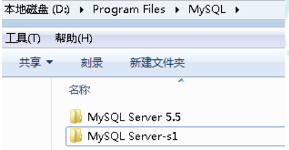
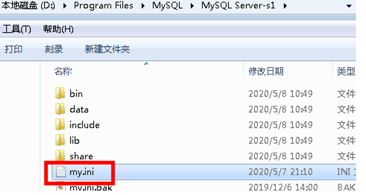
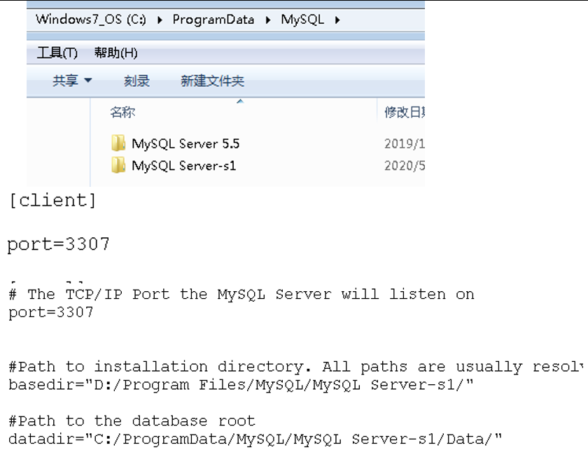
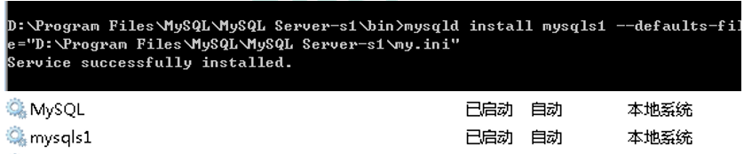
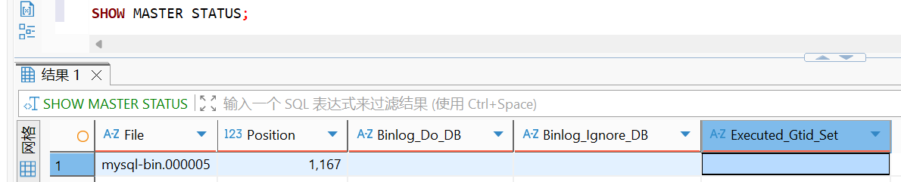
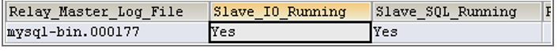

# Sharding-JDBC 读写分离示例

## 1. 项目概述

本模块演示了如何使用 Sharding-JDBC 实现读写分离功能。通过将数据库的读写操作分离到主库和从库，实现主库负责写操作，从库负责读操作，提升系统的读写性能和可用性。

**官方文档**：

- [ShardingSphere 官方文档](https://shardingsphere.apache.org/document/current/cn/)
- [ShardingSphere-JDBC 用户手册](https://shardingsphere.apache.org/document/current/cn/user-manual/shardingsphere-jdbc/)
- [读写分离配置文档](https://shardingsphere.apache.org/document/current/cn/user-manual/shardingsphere-jdbc/yaml-config/rules/sharding/)

**功能说明**：

- **读写分离**：通过 SQL 语句语义分析，实现读写分离过程
  - 写操作（INSERT、UPDATE、DELETE）路由到主库（master）
  - 读操作（SELECT）路由到从库（slave）
  - Sharding-JDBC 不会做数据同步，需要配置 MySQL 主从复制

**技术栈**：

- Spring Boot 2.2.1
- MyBatis Plus 3.0.5
- Sharding-JDBC 4.0.0-RC1
- Druid 连接池
- MySQL 5.7+ 或 MySQL 8.0+
- Lombok

## 2. 环境准备

**环境要求**：

- JDK 1.8+
- Maven 3.6+
- MySQL 5.7+ 或 MySQL 8.0+（需要配置主从复制）
- Spring Boot 2.2.1

**依赖配置**：

项目使用 Maven 进行依赖管理，主要依赖如下：

```xml
<dependencies>
    <dependency>
        <groupId>org.springframework.boot</groupId>
        <artifactId>spring-boot-starter</artifactId>
    </dependency>

    <dependency>
        <groupId>org.springframework.boot</groupId>
        <artifactId>spring-boot-starter-test</artifactId>
    </dependency>

    <dependency>
        <groupId>com.alibaba</groupId>
        <artifactId>druid-spring-boot-starter</artifactId>
    </dependency>
    <dependency>
        <groupId>mysql</groupId>
        <artifactId>mysql-connector-java</artifactId>
    </dependency>
    <dependency>
        <groupId>org.apache.shardingsphere</groupId>
        <artifactId>sharding-jdbc-spring-boot-starter</artifactId>
    </dependency>
    <dependency>
        <groupId>com.baomidou</groupId>
        <artifactId>mybatis-plus-boot-starter</artifactId>
    </dependency>

    <dependency>
        <groupId>org.projectlombok</groupId>
        <artifactId>lombok</artifactId>
    </dependency>
</dependencies>
```

## 3. 数据库准备

**创建数据库**：

执行 `src/main/resources/sql/init.sql` 脚本在主库创建数据库和表：

```sql
-- 在主库创建 user_db 数据库
CREATE DATABASE IF NOT EXISTS `user_db` DEFAULT CHARACTER SET utf8mb4 COLLATE utf8mb4_0900_ai_ci;

USE `user_db`;

-- 在主库创建 t_user 表
CREATE TABLE IF NOT EXISTS `t_user` (
  `user_id` BIGINT(20) NOT NULL COMMENT '用户ID',
  `username` VARCHAR(50) NOT NULL COMMENT '用户名',
  `ustatus` VARCHAR(50) NOT NULL COMMENT '用户状态',
  PRIMARY KEY (`user_id`)
) ENGINE=InnoDB DEFAULT CHARSET=utf8mb4 COMMENT='用户表（读写分离）';
```

**配置 MySQL 主从复制**：

读写分离需要配置 MySQL 主从复制，以下是配置步骤：

**第一步：创建两个 MySQL 数据库服务**

1.复制之前 MySQL 目录：复制原有mysql如：`D:\Program Files\MySQL\MySQL Server-5.5`(作为主库) -> `D:\Program Files\MySQL\MySQL Server-s1`(作为从库)



2.修改复制之后配置文件：修改从库的`my.ini`

```ini
[mysqld]
#设置3307端口 
port = 3307 
# 设置mysql的安装目录 
basedir=D:\D:\Program Files\MySQL\MySQL Server-s1
# 设置mysql数据库的数据的存放目录 
datadir=D:\Program Files\MySQL\MySQL Server-s1\data 
```



- 需要把数据文件目录再复制一份
- 修改端口号（从库使用 3307）
- 修改文件路径



3.把复制修改之后从数据库在 Windows 安装服务

使用命令：

```bash
# 然后将从库安装为windows服务，注意配置文件位置：
# 注意：命令需要管理员权限
# 需要在bin目录下执行命令
mysqld install mysqls1 --defaults-file="D:\Program Files\MySQL\MySQL Server-s1\my.ini"

# 如果安装存在问题可以先删除之后重新安装
# 删除服务命令
sc delete 服务名称
# sc delete mysqls1
```



> 由于从库是从主库复制过来的，因此里面的数据完全一致，可使用原来的账号、密码登录。 

**第二步：配置 MySQL 主从服务器**

**（1）在主服务器配置文件 my,ini（主库：localhost:3306）**

```ini
[mysqld]
#开启日志
log-bin = mysql-bin
#设置服务id，主从不能一致
server-id = 1
#设置需要同步的数据库
binlog-do-db=user_db
#屏蔽系统库同步
binlog-ignore-db=mysql
binlog-ignore-db=information_schema
binlog-ignore-db=performance_schema
```

**（2）在从服务器配置文件 my,ini（从库：localhost:3307）**

```ini
[mysqld]
#开启日志
log-bin = mysql-bin
#设置服务id，主从不能一致
server-id = 2
#设置需要同步的数据库
replicate_wild_do_table=user_db.%
#屏蔽系统库同步
replicate_wild_ignore_table=mysql.%
replicate_wild_ignore_table=information_schema.%
replicate_wild_ignore_table=performance_schema.%
```

**（3）重启主库和从库服务器**

```bash
net stop mysqls1
net start mysqls1
```

**第三步：创建用于主从复制的账号**

在主库执行：

```sql
#登录主库
mysql -h localhost -uroot -p

-- 创建用户db_sync，允许任意主机（%）访问，密码设置为db_sync
CREATE USER 'db_sync'@'%' IDENTIFIED BY 'db_sync';

#授权主备复制专用账号
-- 给db_sync用户授予主从复制所需的REPLICATION SLAVE权限（作用于所有库表*.*）
GRANT REPLICATION SLAVE ON *.* TO 'db_sync'@'%';

#刷新权限
FLUSH PRIVILEGES;

#确认位点，记录下文件名以及位点
# SHOW MASTER STATUS;
show master status;
+------------------+----------+--------------+------------------+-------------------+
| File             | Position | Binlog_Do_DB | Binlog_Ignore_DB | Executed_Gtid_Set |
+------------------+----------+--------------+------------------+-------------------+
| mysql-bin.000005 |     1167 |              |                  |                   |
+------------------+----------+--------------+------------------+-------------------+
```



**第四步：主从数据同步设置—— 设置从库向主库同步数据**

在从库执行：

```sql
cd /d D:/mysql8/mysql-8.0.39-winx64-slave1/bin
#登录从库（端口 3307）
mysql -h localhost -P3307 -uroot -p

#先停止同步
STOP SLAVE;

#修改从库指向到主库，使用上一步记录的文件名以及位点
CHANGE MASTER TO
master_host = 'localhost',
master_user = 'db_sync',
master_password = 'db_sync',
master_log_file = 'mysql-bin.000005',
master_log_pos = 1167;

#启动同步
START SLAVE;

#查看 Slave_IO_Running 和 Slave_SQL_Running 字段值都为 Yes，表示同步配置成功
SHOW SLAVE STATUS;
-- 注意：\G 用于格式化输出，更易查看（避免表格错乱）
SHOW SLAVE STATUS\G;
# 重点查看两个核心状态，若均为Yes，说明问题已解决，主从复制正常运行：
# Slave_IO_Running: Yes（IO 线程正常，能从主库获取二进制日志）
# Slave_SQL_Running: Yes（SQL 线程正常，能执行中继日志中的操作）
```



```sql
#注意 如果之前此从库已有主库指向 需要先执行以下命令清空 
STOP SLAVE IO_THREAD FOR CHANNEL '';
reset slave all;
```

第五步：验证主从数据同步

```sql
# 主库user_db中新建一张表并插入数据，查看从库是否同步生成，确认复制效果
-- 主库执行
USE user_db;
CREATE TABLE tb_test (id INT PRIMARY KEY AUTO_INCREMENT, name VARCHAR(20));
INSERT INTO tb_test (name) VALUES ('test_sync');
SELECT * FROM tb_test;


-- 从库执行，查看是否同步成功
USE user_db;
SELECT * FROM tb_test;
```

**配置数据库连接**：

修改 `application.properties` 中的数据库连接信息：

   - 主库地址：`localhost:3306`
   - 从库地址：`localhost:3307`
   - 数据库名：`user_db`
   - 用户名：`root`
   - 密码：`root`

**注意**：

- 从库的数据库和表会通过 MySQL 主从复制自动创建
- 配置主从复制后，主库的数据会自动同步到从库
- Sharding-JDBC 会自动将写操作路由到主库，读操作路由到从库

## 4. Sharding-JDBC 配置说明

**配置文件位置**：

Sharding-JDBC 的读写分离策略配置在 `src/main/resources/application.properties` 文件中。

**官方配置文档**：

- [ShardingSphere 官方文档](https://shardingsphere.apache.org/document/current/cn/)
- [ShardingSphere-JDBC 用户手册](https://shardingsphere.apache.org/document/current/cn/user-manual/shardingsphere-jdbc/)
- [读写分离配置文档](https://shardingsphere.apache.org/document/current/cn/user-manual/shardingsphere-jdbc/yaml-config/rules/sharding/)（推荐：详细的读写分离配置说明）
- [读写分离功能说明](https://shardingsphere.apache.org/document/current/cn/features/read-write-split/)（包含读写分离核心概念）

> **提示**：由于 ShardingSphere 版本更新较快，部分具体配置页面链接可能发生变化。建议从[官方文档首页](https://shardingsphere.apache.org/document/current/cn/)开始，导航到"用户手册" → "ShardingSphere-JDBC" → "配置手册"查找相关配置说明。

**完整配置内容**：

```properties
spring.application.name=SS-05-Read-Write-Separation

# shardingjdbc 读写分离策略
# 配置数据源，给数据源起名称,
# 读写分离，配置主库和从库
spring.shardingsphere.datasource.names=m0,s0
# 一个实体类对应两张表，覆盖
spring.main.allow-bean-definition-overriding=true

# 配置主库数据源具体内容，包含连接池，驱动，地址，用户名和密码
spring.shardingsphere.datasource.m0.type=com.alibaba.druid.pool.DruidDataSource
spring.shardingsphere.datasource.m0.driver-class-name=com.mysql.cj.jdbc.Driver
spring.shardingsphere.datasource.m0.url=jdbc:mysql://localhost:3306/user_db?serverTimezone=GMT%2B8
spring.shardingsphere.datasource.m0.username=root
spring.shardingsphere.datasource.m0.password=root

# 配置从库数据源具体内容，包含连接池，驱动，地址，用户名和密码
# 注意：从库端口为 3307（需要配置 MySQL 主从复制）
spring.shardingsphere.datasource.s0.type=com.alibaba.druid.pool.DruidDataSource
spring.shardingsphere.datasource.s0.driver-class-name=com.mysql.cj.jdbc.Driver
spring.shardingsphere.datasource.s0.url=jdbc:mysql://localhost:3307/user_db?serverTimezone=GMT%2B8
spring.shardingsphere.datasource.s0.username=root
spring.shardingsphere.datasource.s0.password=root

# 主库从库逻辑数据源定义 ds0 为user_db
spring.shardingsphere.sharding.master-slave-rules.ds0.master-data-source-name=m0
spring.shardingsphere.sharding.master-slave-rules.ds0.slave-data-source-names=s0

# 配置user_db 数据库里面t_user 专库专表
# t_user 分表策略，固定分配至ds0 的t_user 真实表
spring.shardingsphere.sharding.tables.t_user.actual-data-nodes=ds0.t_user
# 指定t_user 表里面主键user_id 生成策略  SNOWFLAKE
spring.shardingsphere.sharding.tables.t_user.key-generator.column=user_id
spring.shardingsphere.sharding.tables.t_user.key-generator.type=SNOWFLAKE

# 打开sql 输出日志
spring.shardingsphere.props.sql.show=true

# MyBatis Plus 配置
mybatis-plus.configuration.map-underscore-to-camel-case=true
mybatis-plus.mapper-locations=classpath*:/mapper/**/*.xml
```

**配置项说明**：

**数据源配置**：

```properties
# 配置数据源，给数据源起名称,
# 读写分离，配置主库和从库
spring.shardingsphere.datasource.names=m0,s0
```

- **作用**：定义数据源名称，本示例使用主库 `m0`（localhost:3306）和从库 `s0`（localhost:3307）

```properties
# 一个实体类对应两张表，覆盖
spring.main.allow-bean-definition-overriding=true
```

- **作用**：允许 Bean 定义覆盖，解决一个实体类对应多张表时的冲突问题

**主库数据源配置**：

```properties
# 配置主库数据源具体内容，包含连接池，驱动，地址，用户名和密码
spring.shardingsphere.datasource.m0.type=com.alibaba.druid.pool.DruidDataSource
spring.shardingsphere.datasource.m0.driver-class-name=com.mysql.cj.jdbc.Driver
spring.shardingsphere.datasource.m0.url=jdbc:mysql://localhost:3306/user_db?serverTimezone=GMT%2B8
spring.shardingsphere.datasource.m0.username=root
spring.shardingsphere.datasource.m0.password=root
```

- **作用**：配置主库 `m0` 的具体连接信息，指向 `localhost:3306` 的 `user_db` 数据库

**从库数据源配置**：

```properties
# 配置从库数据源具体内容，包含连接池，驱动，地址，用户名和密码
spring.shardingsphere.datasource.s0.type=com.alibaba.druid.pool.DruidDataSource
spring.shardingsphere.datasource.s0.driver-class-name=com.mysql.cj.jdbc.Driver
spring.shardingsphere.datasource.s0.url=jdbc:mysql://localhost:3307/user_db?serverTimezone=GMT%2B8
spring.shardingsphere.datasource.s0.username=root
spring.shardingsphere.datasource.s0.password=root
```

- **作用**：配置从库 `s0` 的具体连接信息，指向 `localhost:3307` 的 `user_db` 数据库

**读写分离规则配置**：

```properties
# 主库从库逻辑数据源定义 ds0 为user_db
spring.shardingsphere.sharding.master-slave-rules.ds0.master-data-source-name=m0
spring.shardingsphere.sharding.master-slave-rules.ds0.slave-data-source-names=s0
```

- **作用**：配置读写分离规则，定义逻辑数据源 `ds0`
- **说明**：
  - `master-data-source-name=m0`：指定主库为 `m0`
  - `slave-data-source-names=s0`：指定从库为 `s0`
  - 写操作（INSERT、UPDATE、DELETE）会路由到主库 `m0`
  - 读操作（SELECT）会路由到从库 `s0`

**表配置**：

```properties
# t_user 分表策略，固定分配至ds0 的t_user 真实表
spring.shardingsphere.sharding.tables.t_user.actual-data-nodes=ds0.t_user
```

- **作用**：指定 `t_user` 逻辑表对应的实际数据节点
- **说明**：`ds0.t_user` 表示逻辑数据源 `ds0` 下的 `t_user` 表

**主键生成策略**：

```properties
# 指定t_user 表里面主键user_id 生成策略  SNOWFLAKE
spring.shardingsphere.sharding.tables.t_user.key-generator.column=user_id
spring.shardingsphere.sharding.tables.t_user.key-generator.type=SNOWFLAKE
```

- **作用**：配置主键 `user_id` 的生成策略为雪花算法（SNOWFLAKE）
- **说明**：雪花算法可以生成全局唯一的 64 位长整型 ID，包含时间戳、机器 ID 和序列号

**SQL 日志配置**：

```properties
# 打开sql 输出日志
spring.shardingsphere.props.sql.show=true
```

- **作用**：开启 SQL 输出日志，方便调试和查看实际执行的 SQL 语句，可以验证读写分离是否生效

## 5. 代码实现

**项目结构**：

```
SS-05-Read-Write-Separation
├── src
│   ├── main
│   │   ├── java
│   │   │   └── com
│   │   │       └── action
│   │   │           └── shardingsphere
│   │   │               └── ss05readwriteseparation
│   │   │                   ├── entity
│   │   │                   │   └── User.java
│   │   │                   ├── mapper
│   │   │                   │   └── UserMapper.java
│   │   │                   └── Ss05ReadWriteSeparationApplication.java
│   │   └── resources
│   │       ├── application.properties
│   │       └── sql
│   │           └── init.sql
│   └── test
│       └── java
│           └── com
│               └── action
│                   └── shardingsphere
│                       └── ss05readwriteseparation
│                           └── Ss05ReadWriteSeparationApplicationTests.java
```

**实体类实现**：

User 实体类，位置：`src/main/java/com/action/shardingsphere/ss05readwriteseparation/entity/User.java`

```java
package com.action.shardingsphere.ss05readwriteseparation.entity;

import com.baomidou.mybatisplus.annotation.TableName;
import lombok.Data;

/**
 * User 实体类
 * 对应 t_user 表（读写分离）
 */
@Data
@TableName(value = "t_user")  //指定对应表
public class User {
    /**
     * 用户ID，使用雪花算法生成
     */
    private Long userId;

    /**
     * 用户名
     */
    private String username;

    /**
     * 用户状态
     */
    private String ustatus;
}
```

**说明**：
- 使用 `@Data` 注解（Lombok）自动生成 getter、setter 等方法
- 使用 `@TableName("t_user")` 指定对应的数据库表名
- `userId` 字段为主键，由 Sharding-JDBC 使用雪花算法自动生成

**Mapper 接口实现**：

UserMapper 接口，位置：`src/main/java/com/action/shardingsphere/ss05readwriteseparation/mapper/UserMapper.java`

```java
package com.action.shardingsphere.ss05readwriteseparation.mapper;

import com.action.shardingsphere.ss05readwriteseparation.entity.User;
import com.baomidou.mybatisplus.core.mapper.BaseMapper;
import org.springframework.stereotype.Repository;

/**
 * User Mapper 接口
 */
@Repository
public interface UserMapper extends BaseMapper<User> {

}
```

**说明**：

- 继承 MyBatis Plus 的 `BaseMapper<User>`，提供基础的 CRUD 操作
- 使用 `@Repository` 注解标识为数据访问层组件

**启动类实现**：

Ss05ReadWriteSeparationApplication 启动类，位置：`src/main/java/com/action/shardingsphere/ss05readwriteseparation/Ss05ReadWriteSeparationApplication.java`

```java
package com.action.shardingsphere.ss05readwriteseparation;

import org.mybatis.spring.annotation.MapperScan;
import org.springframework.boot.SpringApplication;
import org.springframework.boot.autoconfigure.SpringBootApplication;

@SpringBootApplication
@MapperScan("com.action.shardingsphere.ss05readwriteseparation.mapper")
public class Ss05ReadWriteSeparationApplication {

    public static void main(String[] args) {
        SpringApplication.run(Ss05ReadWriteSeparationApplication.class, args);
    }

}
```

**说明**：
- `@SpringBootApplication`：标识为 Spring Boot 应用
- `@MapperScan`：扫描指定包下的 Mapper 接口，自动注册为 Spring Bean

## 6. 测试代码实现

**测试类结构**：

位置：`src/test/java/com/action/shardingsphere/ss05readwriteseparation/Ss05ReadWriteSeparationApplicationTests.java`

**完整测试代码**：

```java
package com.action.shardingsphere.ss05readwriteseparation;

import com.action.shardingsphere.ss05readwriteseparation.entity.User;
import com.action.shardingsphere.ss05readwriteseparation.mapper.UserMapper;
import com.baomidou.mybatisplus.core.conditions.query.QueryWrapper;
import org.junit.Test;
import org.junit.runner.RunWith;
import org.springframework.beans.factory.annotation.Autowired;
import org.springframework.boot.test.context.SpringBootTest;
import org.springframework.test.context.junit4.SpringRunner;

@RunWith(SpringRunner.class)
@SpringBootTest
public class Ss05ReadWriteSeparationApplicationTests {

    //注入user 的mapper
    @Autowired
    private UserMapper userMapper;

    // 检查 Java 版本（用于验证运行时使用的 JDK 版本）
    static {
        String javaVersion = System.getProperty("java.version");
        String javaHome = System.getProperty("java.home");
        System.out.println("========================================");
        System.out.println("当前运行 Java 版本: " + javaVersion);
        System.out.println("当前 Java 路径: " + javaHome);
        System.out.println("========================================");
    }

    //======================测试读写分离==================
    //添加操作（会路由到主库）
    @Test
    public void addUserDb() {
        User user = new User();
        user.setUsername("lucymary");
        user.setUstatus("a");
        userMapper.insert(user);
        System.out.println("插入成功，生成的user_id: " + user.getUserId());
        System.out.println("注意：插入操作会路由到主库（m0）");
    }

    //查询操作（会路由到从库）
    @Test
    public void findUserDb() {
        QueryWrapper<User> wrapper = new QueryWrapper<>();
        //设置userid 值
        wrapper.eq("user_id", 465508031619137537L);
        User user = userMapper.selectOne(wrapper);
        System.out.println("查询结果: " + user);
        System.out.println("注意：查询操作会路由到从库（s0）");
    }

    //查询操作 - 查询所有用户（会路由到从库）
    @Test
    public void findAllUsers() {
        java.util.List<User> users = userMapper.selectList(null);
        System.out.println("查询所有用户，数量: " + users.size());
        for (User user : users) {
            System.out.println("  user_id=" + user.getUserId() + ", username=" + user.getUsername() + ", ustatus=" + user.getUstatus());
        }
        System.out.println("注意：查询操作会路由到从库（s0）");
    }

    //更新操作（会路由到主库）
    @Test
    public void updateUserDb() {
        User user = new User();
        user.setUserId(465508031619137537L);
        user.setUsername("lucymary_updated");
        user.setUstatus("b");
        int result = userMapper.updateById(user);
        System.out.println("更新结果: " + (result > 0 ? "成功" : "失败"));
        System.out.println("注意：更新操作会路由到主库（m0）");
    }

    //删除操作（会路由到主库）
    @Test
    public void deleteUserDb() {
        QueryWrapper<User> wrapper = new QueryWrapper<>();
        wrapper.eq("user_id", 465508031619137537L);
        int result = userMapper.delete(wrapper);
        System.out.println("删除结果: " + (result > 0 ? "成功" : "失败"));
        System.out.println("注意：删除操作会路由到主库（m0）");
    }
}
```

**测试方法说明**：

**addUserDb() 方法**：

**功能**：添加用户数据，验证读写分离功能

**实现逻辑**：

1. 创建 `User` 对象
2. 设置用户名和用户状态
3. 调用 `userMapper.insert(user)` 插入数据
4. Sharding-JDBC 会根据 SQL 语义分析，自动将写操作路由到主库 `m0`
5. `userId` 由 Sharding-JDBC 使用雪花算法自动生成

**注意事项**：
- `userId` 字段不需要手动设置，由 Sharding-JDBC 使用雪花算法自动生成
- 插入操作会路由到主库（m0），数据会通过 MySQL 主从复制同步到从库

**findUserDb() 方法**：

**功能**：根据 `user_id` 查询用户信息

**实现逻辑**：

1. 创建 `QueryWrapper` 查询条件
2. 设置查询条件：`user_id = 465508031619137537L`
3. 调用 `userMapper.selectOne(wrapper)` 查询数据
4. Sharding-JDBC 会根据 SQL 语义分析，自动将读操作路由到从库 `s0`

**注意事项**：
- 查询操作会路由到从库（s0），减轻主库压力
- 示例中的 `user_id` 值需要替换为实际插入数据后生成的 ID

**findAllUsers() 方法**：

**功能**：查询所有用户信息

**实现逻辑**：
1. 调用 `userMapper.selectList(null)` 查询所有用户
2. Sharding-JDBC 会根据 SQL 语义分析，自动将读操作路由到从库 `s0`
3. 遍历并输出所有用户信息

**注意事项**：
- 查询操作会路由到从库（s0），减轻主库压力

**updateUserDb() 方法**：

**功能**：更新用户信息

**实现逻辑**：
1. 创建 `User` 对象，设置 `userId` 和要更新的字段
2. 调用 `userMapper.updateById(user)` 更新数据
3. Sharding-JDBC 会根据 SQL 语义分析，自动将写操作路由到主库 `m0`

**注意事项**：
- 更新操作会路由到主库（m0），数据会通过 MySQL 主从复制同步到从库

**deleteUserDb() 方法**：

**功能**：删除用户信息

**实现逻辑**：

1. 创建 `QueryWrapper` 查询条件
2. 设置查询条件：`user_id = 465508031619137537L`
3. 调用 `userMapper.delete(wrapper)` 删除数据
4. Sharding-JDBC 会根据 SQL 语义分析，自动将写操作路由到主库 `m0`

**注意事项**：

- 删除操作会路由到主库（m0），数据会通过 MySQL 主从复制同步到从库

## 7. 运行测试

**前置条件**：

1. 确保 MySQL 主库和从库服务都已启动
2. 确保已配置 MySQL 主从复制
3. 确保已创建数据库 `user_db` 和表 `t_user`（在主库创建，从库会自动同步）
4. 确保 `application.properties` 中的数据库连接信息正确

**运行添加数据测试**：

1. 在 IDE 中打开 `Ss05ReadWriteSeparationApplicationTests` 类
2. 运行 `addUserDb()` 测试方法
3. 查看控制台输出的 SQL 日志，确认数据插入到主库（m0）
4. 在数据库中验证数据：
   - 查询主库 `user_db.t_user` 表，应该包含新插入的用户数据
   - 等待几秒钟后，查询从库 `user_db.t_user` 表，应该包含相同的用户数据（通过主从复制同步）

**运行查询数据测试**：

1. 先运行 `addUserDb()` 方法，获取生成的 `user_id` 值
2. 在数据库中查看生成的 `user_id`，选择一个 `user_id` 值
3. 修改 `findUserDb()` 方法中的 `user_id` 值为实际值
4. 运行 `findUserDb()` 测试方法
5. 查看控制台输出的 SQL 日志，确认查询操作路由到从库（s0）
6. 查看控制台输出，确认查询结果正确

**运行更新数据测试**：

1. 先运行 `addUserDb()` 方法，获取生成的 `user_id` 值
2. 修改 `updateUserDb()` 方法中的 `user_id` 值为实际值
3. 运行 `updateUserDb()` 测试方法
4. 查看控制台输出的 SQL 日志，确认更新操作路由到主库（m0）
5. 在数据库中验证数据：
   - 查询主库，应该看到更新后的数据
   - 等待几秒钟后，查询从库，应该看到更新后的数据（通过主从复制同步）

**运行删除数据测试**：

1. 先运行 `addUserDb()` 方法，获取生成的 `user_id` 值
2. 修改 `deleteUserDb()` 方法中的 `user_id` 值为实际值
3. 运行 `deleteUserDb()` 测试方法
4. 查看控制台输出的 SQL 日志，确认删除操作路由到主库（m0）
5. 在数据库中验证数据：
   - 查询主库，应该已删除对应数据
   - 等待几秒钟后，查询从库，应该已删除对应数据（通过主从复制同步）

**验证读写分离效果**：

查看主库数据：

```sql
-- 连接主库（localhost:3306）
USE user_db;
SELECT * FROM t_user;
```

查看从库数据：

```sql
-- 连接从库（localhost:3307）
USE user_db;
SELECT * FROM t_user;
```

**预期结果**：
- 主库和从库中的数据应该一致（通过主从复制同步）
- 写操作（INSERT、UPDATE、DELETE）会路由到主库
- 读操作（SELECT）会路由到从库

**验证读写分离路由**：

通过查看 SQL 日志验证：

1. 执行写操作（INSERT、UPDATE、DELETE）时，日志中应该显示路由到 `m0`（主库）
2. 执行读操作（SELECT）时，日志中应该显示路由到 `s0`（从库）

示例日志：

```
# 写操作日志
Actual SQL: m0 ::: INSERT INTO t_user (username, ustatus, user_id) VALUES (?, ?, ?)

# 读操作日志
Actual SQL: s0 ::: SELECT user_id, username, ustatus FROM t_user WHERE user_id = ?
```

## 8. 注意事项

**配置注意事项**：

1. **Bean 定义覆盖**：必须配置 `spring.main.allow-bean-definition-overriding=true`，解决一个实体类对应多张表时的冲突问题

2. **MySQL 主从复制**：读写分离需要配置 MySQL 主从复制，Sharding-JDBC 不会做数据同步

3. **主从同步延迟**：主从复制存在延迟，可能导致刚写入主库的数据在从库中查询不到

4. **主键生成**：`user_id` 由 Sharding-JDBC 使用雪花算法自动生成，无需手动设置

**开发注意事项**：

1. **数据库准备**：确保主库和从库都已创建，并且配置了主从复制，否则会报错

2. **SQL 日志**：开发阶段建议开启 `spring.shardingsphere.props.sql.show=true`，方便调试和查看实际执行的 SQL 语句，验证读写分离是否生效

3. **主从同步延迟**：需要注意主从同步延迟问题，如果业务对数据一致性要求很高，可以考虑强制读主库

4. **数据一致性**：读写分离场景下，主从数据可能存在短暂不一致，需要注意业务场景的适用性

**常见问题**：

**问题：启动时报 Bean 定义冲突**

**解决方案**：在 `application.properties` 中添加：
```properties
spring.main.allow-bean-definition-overriding=true
```

**问题：数据库连接失败**

**现象**：启动时报数据库连接错误

**解决方案**：
1. 检查 MySQL 主库和从库服务是否已启动
2. 检查数据库连接信息（URL、用户名、密码）是否正确
3. 检查主库和从库的端口是否正确（主库 3306，从库 3307）

**问题：主从复制未配置**

**现象**：写操作成功，但读操作查询不到数据

**解决方案**：
1. 检查 MySQL 主从复制是否已正确配置
2. 检查从库的 `SHOW SLAVE STATUS` 状态，确保 `Slave_IO_Running` 和 `Slave_SQL_Running` 都为 `Yes`
3. 检查主从复制的账号权限是否正确

**问题：主从同步延迟**

**现象**：写入主库后，立即查询从库，查询不到刚写入的数据

**解决方案**：
1. 这是正常现象，主从复制存在延迟
2. 如果业务对数据一致性要求很高，可以考虑：
   - 强制读主库（需要修改配置）
   - 等待几秒钟后再查询
   - 使用事务，在事务中强制读主库

**问题：读写分离未生效**

**现象**：所有操作都路由到主库或从库

**解决方案**：
1. 检查读写分离配置是否正确
2. 查看 SQL 日志，确认 SQL 语句类型
3. 确保写操作（INSERT、UPDATE、DELETE）路由到主库，读操作（SELECT）路由到从库

## 9. 总结

**核心要点**：

1. **读写分离**：通过 Sharding-JDBC 将数据库的读写操作分离到主库和从库，提升系统的读写性能

2. **SQL 语义分析**：Sharding-JDBC 通过 SQL 语句语义分析，自动识别写操作和读操作，实现读写分离

3. **主从复制**：Sharding-JDBC 不会做数据同步，需要配置 MySQL 主从复制来保证数据一致性

4. **透明操作**：业务代码无需关心读写分离逻辑，Sharding-JDBC 自动处理路由

**适用场景**：

- 读多写少的业务场景
- 需要提升数据库的读性能
- 需要减轻主库的压力
- 可以接受主从同步延迟的场景

**读写分离 vs 分库分表**：

- **读写分离**：将读写操作分离到主库和从库，提升读性能（本示例）
- **分库分表**：将数据分布到多个数据库或表中，提升存储和并发处理能力

**读写分离的优势**：

- **提升读性能**：读操作路由到从库，减轻主库压力
- **提升可用性**：从库可以作为主库的备份，提升系统可用性
- **扩展性强**：可以配置多个从库，进一步提升读性能

**读写分离的挑战**：

- **主从同步延迟**：主从复制存在延迟，可能导致数据不一致
- **数据一致性**：需要处理主从数据短暂不一致的问题
- **配置复杂**：需要配置 MySQL 主从复制

**扩展学习**：

- 水平分表：将单表拆分为多个物理表
- 水平分库：将数据分布到多个数据库中
- 垂直分库：按业务模块拆分数据库
- 公共表：广播表，数据在所有数据库中保持一致
- 分布式事务：跨分片事务处理

**参考资源**：

- [ShardingSphere 官方文档](https://shardingsphere.apache.org/document/current/cn/)
- [ShardingSphere GitHub](https://github.com/apache/shardingsphere)
- [ShardingSphere 社区](https://shardingsphere.apache.org/community/cn/)
- [读写分离功能说明](https://shardingsphere.apache.org/document/current/cn/features/read-write-split/)（包含读写分离最佳实践和注意事项）
