<!-- START doctoc generated TOC please keep comment here to allow auto update -->
<!-- DON'T EDIT THIS SECTION, INSTEAD RE-RUN doctoc TO UPDATE -->
**Table of Contents**  *generated with [DocToc](https://github.com/thlorenz/doctoc)*

- [1.ShardingSphere核心概念](#1shardingsphere%E6%A0%B8%E5%BF%83%E6%A6%82%E5%BF%B5)
  - [1.1 ShardingSphere简介](#11-shardingsphere%E7%AE%80%E4%BB%8B)
  - [1.2 分库分表](#12-%E5%88%86%E5%BA%93%E5%88%86%E8%A1%A8)
  - [1.3 分库分表的方式](#13-%E5%88%86%E5%BA%93%E5%88%86%E8%A1%A8%E7%9A%84%E6%96%B9%E5%BC%8F)
    - [1.3.1 垂直切分](#131-%E5%9E%82%E7%9B%B4%E5%88%87%E5%88%86)
    - [1.3.2 水平切分](#132-%E6%B0%B4%E5%B9%B3%E5%88%87%E5%88%86)
  - [1.4 分库分表应用和问题](#14-%E5%88%86%E5%BA%93%E5%88%86%E8%A1%A8%E5%BA%94%E7%94%A8%E5%92%8C%E9%97%AE%E9%A2%98)
      - [1.4.1 应用](#141-%E5%BA%94%E7%94%A8)
      - [1.4.2 分库分表问题](#142-%E5%88%86%E5%BA%93%E5%88%86%E8%A1%A8%E9%97%AE%E9%A2%98)
      - [1.4.3 分库分表的核心挑战与解决方案](#143-%E5%88%86%E5%BA%93%E5%88%86%E8%A1%A8%E7%9A%84%E6%A0%B8%E5%BF%83%E6%8C%91%E6%88%98%E4%B8%8E%E8%A7%A3%E5%86%B3%E6%96%B9%E6%A1%88)
        - [① 跨分片事务一致性](#%E2%91%A0-%E8%B7%A8%E5%88%86%E7%89%87%E4%BA%8B%E5%8A%A1%E4%B8%80%E8%87%B4%E6%80%A7)
        - [② 跨分片查询难题](#%E2%91%A1-%E8%B7%A8%E5%88%86%E7%89%87%E6%9F%A5%E8%AF%A2%E9%9A%BE%E9%A2%98)
        - [③ 数据迁移与扩容](#%E2%91%A2-%E6%95%B0%E6%8D%AE%E8%BF%81%E7%A7%BB%E4%B8%8E%E6%89%A9%E5%AE%B9)
        - [④ 全局唯一 ID](#%E2%91%A3-%E5%85%A8%E5%B1%80%E5%94%AF%E4%B8%80-id)
- [2.Sharding-JDBC](#2sharding-jdbc)
  - [2.1 Sharding-JDBC 简介](#21-sharding-jdbc-%E7%AE%80%E4%BB%8B)
  - [2.2 Sharding-JDBC 实现水平分表](#22-sharding-jdbc-%E5%AE%9E%E7%8E%B0%E6%B0%B4%E5%B9%B3%E5%88%86%E8%A1%A8)
  - [2.3 Sharding-JDBC 实现水平分库](#23-sharding-jdbc-%E5%AE%9E%E7%8E%B0%E6%B0%B4%E5%B9%B3%E5%88%86%E5%BA%93)
    - [2.3.1 需求分析](#231-%E9%9C%80%E6%B1%82%E5%88%86%E6%9E%90)
    - [2.3.2 配置数据库分片规则](#232-%E9%85%8D%E7%BD%AE%E6%95%B0%E6%8D%AE%E5%BA%93%E5%88%86%E7%89%87%E8%A7%84%E5%88%99)
    - [2.3.3 编写测试方法](#233-%E7%BC%96%E5%86%99%E6%B5%8B%E8%AF%95%E6%96%B9%E6%B3%95)
  - [2.4 Sharding-JDBC 实现垂直分库](#24-sharding-jdbc-%E5%AE%9E%E7%8E%B0%E5%9E%82%E7%9B%B4%E5%88%86%E5%BA%93)
    - [2.4.1 需求分析](#241-%E9%9C%80%E6%B1%82%E5%88%86%E6%9E%90)
    - [2.4.2 编写操作代码](#242-%E7%BC%96%E5%86%99%E6%93%8D%E4%BD%9C%E4%BB%A3%E7%A0%81)
  - [2.5 Sharding-JDBC 操作公共表](#25-sharding-jdbc-%E6%93%8D%E4%BD%9C%E5%85%AC%E5%85%B1%E8%A1%A8)
    - [2.5.1 公共表概念](#251-%E5%85%AC%E5%85%B1%E8%A1%A8%E6%A6%82%E5%BF%B5)
    - [2.5.2 创建公共表](#252-%E5%88%9B%E5%BB%BA%E5%85%AC%E5%85%B1%E8%A1%A8)
    - [2.5.3 配置公共表](#253-%E9%85%8D%E7%BD%AE%E5%85%AC%E5%85%B1%E8%A1%A8)
    - [2.5.4 编写测试代码](#254-%E7%BC%96%E5%86%99%E6%B5%8B%E8%AF%95%E4%BB%A3%E7%A0%81)
  - [2.6 Sharding-JDBC 实现读写分离](#26-sharding-jdbc-%E5%AE%9E%E7%8E%B0%E8%AF%BB%E5%86%99%E5%88%86%E7%A6%BB)
    - [2.6.1 读写分离核心原理](#261-%E8%AF%BB%E5%86%99%E5%88%86%E7%A6%BB%E6%A0%B8%E5%BF%83%E5%8E%9F%E7%90%86)
    - [2.6.2 MySQL 配置读写分离](#262-mysql-%E9%85%8D%E7%BD%AE%E8%AF%BB%E5%86%99%E5%88%86%E7%A6%BB)
    - [2.6.3 Sharding-JDBC 操作](#263-sharding-jdbc-%E6%93%8D%E4%BD%9C)
- [第 3 章 Sharding-Proxy](#%E7%AC%AC-3-%E7%AB%A0-sharding-proxy)
  - [3.1 Sharding-Proxy 简介](#31-sharding-proxy-%E7%AE%80%E4%BB%8B)
  - [3.2 安装](#32-%E5%AE%89%E8%A3%85)
  - [3.3 Sharding-Proxy 实现分表](#33-sharding-proxy-%E5%AE%9E%E7%8E%B0%E5%88%86%E8%A1%A8)
    - [3.3.1 创建数据库](#331-%E5%88%9B%E5%BB%BA%E6%95%B0%E6%8D%AE%E5%BA%93)
    - [3.3.2 配置分库规则](#332-%E9%85%8D%E7%BD%AE%E5%88%86%E5%BA%93%E8%A7%84%E5%88%99)
    - [3.3.3 启动和使用](#333-%E5%90%AF%E5%8A%A8%E5%92%8C%E4%BD%BF%E7%94%A8)
  - [3.4 Sharding-Proxy 配置（分库）](#34-sharding-proxy-%E9%85%8D%E7%BD%AE%E5%88%86%E5%BA%93)
    - [3.4.1 创建数据库](#341-%E5%88%9B%E5%BB%BA%E6%95%B0%E6%8D%AE%E5%BA%93)
    - [3.4.2 配置分库规则](#342-%E9%85%8D%E7%BD%AE%E5%88%86%E5%BA%93%E8%A7%84%E5%88%99)
    - [3.4.3 启动和使用](#343-%E5%90%AF%E5%8A%A8%E5%92%8C%E4%BD%BF%E7%94%A8)
  - [3.5 Sharding-Proxy 配置（读写分离）](#35-sharding-proxy-%E9%85%8D%E7%BD%AE%E8%AF%BB%E5%86%99%E5%88%86%E7%A6%BB)
    - [3.5.1 创建数据库](#351-%E5%88%9B%E5%BB%BA%E6%95%B0%E6%8D%AE%E5%BA%93)
    - [3.5.2 配置读写分离](#352-%E9%85%8D%E7%BD%AE%E8%AF%BB%E5%86%99%E5%88%86%E7%A6%BB)
    - [3.5.3 启动和使用](#353-%E5%90%AF%E5%8A%A8%E5%92%8C%E4%BD%BF%E7%94%A8)

<!-- END doctoc generated TOC please keep comment here to allow auto update -->


## 1.ShardingSphere核心概念

### 1.1 ShardingSphere简介

**ShardingSphere核心**：

- 一套开源的分布式数据库中间件解决方案
- 有三个产品：Sharding-JDBC、Sharding-Proxy、Sharding-Sidecar（规划中）
- 定位为关系型数据库中间件，合理在分布式环境下使用关系型数据库操作

**ShardingSphere(官网)**：

> 微内核&云原生&零侵入
>
> Apache ShardingSphere是一套开源的分布式数据库中间件解决方案组成的生态圈，它由Sharding-JDBC、Sharding-Proxy和Sharding-Sidecar（规划中）这3款相互独立，却又能够混合部署配合使用的产品组成。它们均提供标准化的数据分片、分布式事务和数据库治理功能，可适用于如Java同构、异构语言、云原生等各种多样化的应用场景。
>

>ShardingSphere定位为关系型数据库中间件，旨在充分合理地在分布式的场景下利用关系型数据库的计算和存储能力，而并非实现一个全新的关系型数据库。它通过关注不变，进而抓住事物本质。关系型数据库当今依然占有巨大市场，是各个公司核心业务的基石，未来也难于撼动，我们目前阶段更加关注在原有基础上的增量，而非颠覆。
>
ShardingSphere已经在2020年4月16日成为ApacheIe顶级项目(Apache官方发布从4.0.0版本开始)。

**Sharding-JDBC(官网)**：

> 定位为轻量级Java框架。在Java的JDBC层提供的额外服务。它使用客户端直连数据库，以jar包形式提供服务，无需额外部署和依赖，可理解为增强版的JDBC驱动，完全兼容JDBC和各种ORM框架。
>
> - 适用于任何基于JDBC的ORM框架，如：JPA，Hibernate，Mybatis，Spring JDBC Template或直接使用JDBC。
>
> - 支持任何第三方的数据库连接池，如：DBCP、C3P0、BoneCP、Druid、HikariCP等。
>
> - 支持任意实现JDBC规范的数据库。目前支持MySQL，Oracle，SQL Server，PostgreSQL以及任何遵循SQL92标准的数据库。

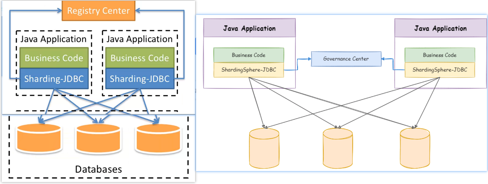

**ShardingSphere-Proxy(官网)**：

> ShardingSphere-Proxy 定位为透明化的数据库代理端，通过实现数据库二进制协议，对异构语言提供支持。 目前提供 MySQL 和
> PostgreSQL 协议，透明化数据库操作，对 DBA 更加友好。
>
> - 向应用程序完全透明，可直接当做 MySQL/PostgreSQL 使用；
> - 兼容 MariaDB 等基于 MySQL 协议的数据库，以及 openGauss 等基于 PostgreSQL 协议的数据库；
> - 适用于任何兼容 MySQL/PostgreSQL 协议的的客户端，如：MySQL Command Client, MySQL Workbench, Navicat 等。


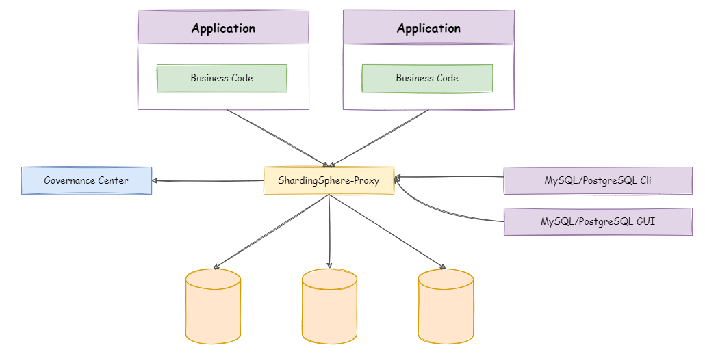

**ShardingSphere-JDBC 与 ShardingSphere-Proxy 对比：**

| 特性    | ShardingSphere-JDBC | ShardingSphere-Proxy |
|-------|---------------------|----------------------|
| 数据库   | 任意                  | MySQL/PostgreSQL     |
| 连接消耗数 | 高                   | 低                    |
| 异构语言  | 仅 Java              | 任意                   |
| 性能    | 损耗低                 | 损耗略高                 |
| 无中心化  | 是                   | 否                    |
| 静态入口  | 无                   | 有                    |

### 1.2 分库分表

**为什么需要分库分表？**

分库分表（Sharding）是**数据分片**的核心技术，通过将单库单表拆分为多个数据库和数据表，分散存储与访问压力，解决海量数据与高并发场景下的性能瓶颈。单库单表在数据量与并发量增长到一定规模时，会遇到以下
**不可逾越的瓶颈**：

| 瓶颈类型 |         具体表现          |               阈值参考                |
|:----:|:---------------------:|:---------------------------------:|
| 性能瓶颈 |    查询变慢、写入阻塞、事务超时     | MySQL 单表建议不超过**500 万行**，千万级以上明显变慢 |
| 存储瓶颈 |    磁盘空间不足、备份恢复时间过长    |      单库容量达**TB 级**时，运维风险显著增加      |
| 并发瓶颈 |      连接数耗尽、锁竞争激烈      | 单 MySQL 实例默认连接数上限约**151**，无法支撑高并发 |
| 扩展瓶颈 | 垂直扩容（升级硬件）性价比低，且有物理上限 |        摩尔定律放缓，硬件升级无法无限提升性能        |

数据库数据量不可控的，随着时间和业务发展，造成表里面数据越来越多，如果再去对数据库表curd 操作时候，造成性能问题。

分库分表：解决由于数据量过大而造成数据库性能降低问题。

解决方案：

- **方案1**：从硬件上
- **方案2**：分库分表


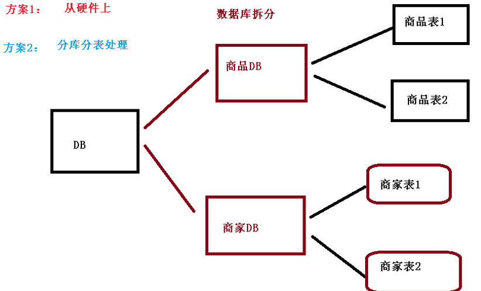

### 1.3 分库分表的方式

分库分表有两种方式：垂直切分和水平切分

#### 1.3.1 垂直切分

**垂直分表**：操作数据库中某张表，把这张表中一部分字段数据存到一张新表里面，再把这张表另一部分字段数据存到另外一张表里面。按字段拆分表，将大表拆分为小表，如用户表拆分为`user_base`（基础信息）和`user_extend`（扩展信息）。

- **适用场景**：表字段过多（如 100 + 字段）；字段访问频率差异大（如基础信息频繁查询，扩展信息极少访问）；Blob/Text 大字段影响查询性能。
- **优势**：减少 IO、提升查询速度；降低锁竞争；优化索引结构。
- **挑战**：关联查询需 JOIN 或多次查询；ALTER TABLE 操作仍有影响。

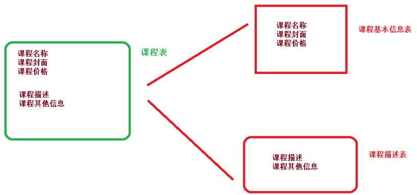

**垂直分库**：把单一数据库按照业务进行划分，专库专表。按业务拆分数据库，如电商系统拆分为用户库、订单库、商品库、支付库，各自独立部署。

- **适用场景**：业务模块清晰、耦合度低；核心业务需独立扩容；不同业务有不同数据安全需求。
- **优势**：降低耦合，便于独立维护与扩展；核心业务不受非核心业务影响。
- **挑战**：跨业务关联查询复杂（如用户订单查询需跨库）；事务一致性保障难度增加。

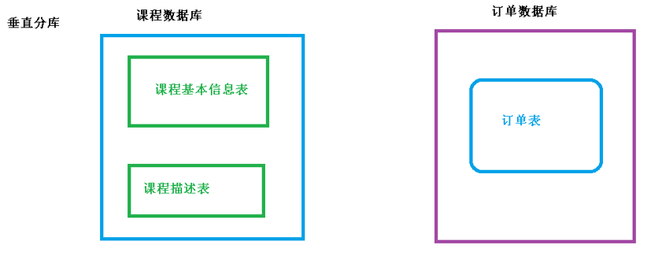

#### 1.3.2 水平切分

**水平分库**：跨库拆分，将表数据分散到多个数据库实例，如 16 张订单表分散到 4 个数据库。

- **适用场景**：高并发、海量数据场景，需同时解决存储与并发问题。
- **优势**：彻底突破单库限制，支持无限水平扩展；分散单点故障风险。
- **挑战**：路由复杂；跨库事务、分页、排序难度增加。

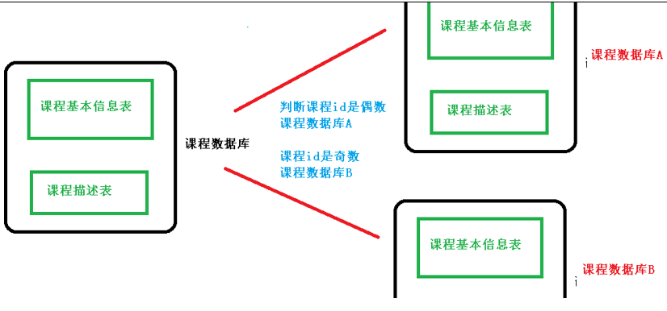

**水平分表**：同库内拆分多张表，如用户订单表拆分为 16 张表存于同一数据库。

- **适用场景**：单表数据量大，但并发量适中；快速解决查询性能问题。
- **优势**：无需跨库，实现简单；保持业务逻辑一致性。
- **局限**：无法解决单库的存储与并发瓶颈，仅为过渡方案。

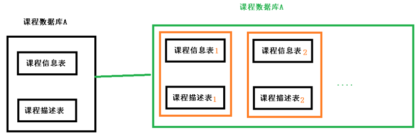

### 1.4 分库分表应用和问题

##### 1.4.1 应用

1. 在数据库设计时候考虑垂直分库和垂直分表

2. 随着数据库数据量增加，不要马上考虑做水平切分，首先考虑缓存处理，读写分离，使用索引等等方式，如果这些方式不能根本解决问题了，再考虑做水平分库和水平分表

##### 1.4.2 分库分表问题

1.跨节点连接查询问题（分页、排序）

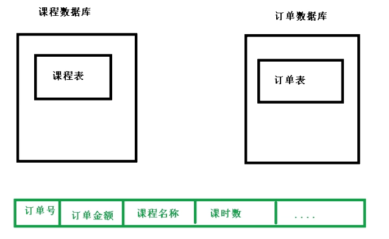

2.多数据源管理问题

##### 1.4.3 分库分表的核心挑战与解决方案

分库分表虽解决了性能问题，但引入新的技术挑战，需针对性解决：

###### ① 跨分片事务一致性

**问题**：跨库操作无法使用本地事务，数据一致性难以保障。

**解决方案**：

- **最终一致性方案**：采用**柔性事务**（SAGA、TCC），通过补偿机制保障数据最终一致。
- **强一致性方案**：使用**2PC/3PC**分布式事务协议（如 Seata），适合核心交易场景。
- **规避方案**：设计时尽量让事务操作落在**同一分片**（如通过分片键关联），避免跨分片事务。

###### ② 跨分片查询难题

|    查询类型     |                痛点                |                           解决方案                            |
|:-----------:|:--------------------------------:|:---------------------------------------------------------:|
|  **分页查询**   | LIMIT offset 过大时，需扫描所有分片并合并，性能极差 | 1. 分片键过滤，避免跨分片；2. 二次查询优化（先查 ID 再查详情）；3. 引入 ES 等搜索引擎预聚合数据  |
|  **关联查询**   |       JOIN 操作跨库，效率低下且逻辑复杂        |      1. 数据冗余（反范式设计）；2. 全局表（字典表等）；3. 应用层组装（多次查询后合并结果）      |
| **排序 / 聚合** |    跨分片排序、COUNT/SUM 等聚合函数计算复杂     | 1. 分片键排序，减少合并成本；2. 引入 OLAP 引擎（如 Presto）；3. 预计算结果（如每日统计存储） |

###### ③ 数据迁移与扩容

**问题**：分片规则变更或扩容时，需迁移大量数据，可能影响业务。

**解决方案**：

- **双写迁移**：新老分片同时写入，校验一致后切换读流量，最后停止老分片写入。
- **分片键升级**：设计时预留扩容空间（如按 2^n 分片，扩容时翻倍）。
- **工具辅助**：使用 ShardingSphere-Scaling、MyDumper 等工具，实现**不停机数据迁移**。

###### ④ 全局唯一 ID

**问题**：单库自增 ID 失效，跨分片 ID 冲突。

**解决方案**：

- **雪花算法（Snowflake）**：生成 64 位 ID，包含时间戳、机器 ID、序列号，适合分布式系统。
- **数据库号段模式**：从专门的 ID 生成服务获取连续号段，性能高且有序。
- **UUID**：简单但无序，影响索引性能，不推荐用于 MySQL 主键。

## 2.Sharding-JDBC

### 2.1 Sharding-JDBC 简介

- 是轻量级的java 框架，是增强版的JDBC 驱动
- Sharding-JDBC主要目的是：简化对分库分表之后数据相关操作
- Sharding-JDBC不是做分库分表。主要做两个功能：数据分片和读写分离

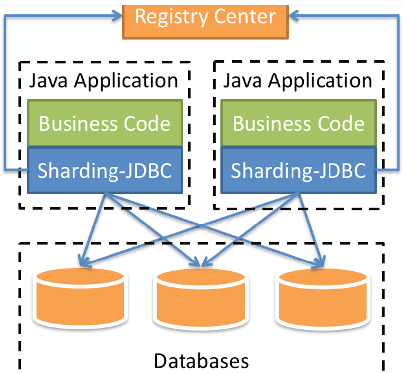

> ##### 一、基础概述
>
> 1.**核心定位**：Sharding-JDBC 是一款**轻量级的嵌入式 Java JDBC 框架**，并非独立部署的中间件，而是以 Jar 包形式集成在应用程序中，充当“JDBC 驱动的增强版”，实现对数据库操作的分片处理。它隶属于 Apache ShardingSphere 顶级项目（原当当网开源，后捐赠给 Apache），目前最新稳定版已支持多种数据库和主流 Java 技术生态。
>
> 2.**核心特性**
>
> - 「无中间件依赖」：无需部署独立的代理服务，与应用同进程运行，减少网络传输损耗和运维成本。
> - 「全 JDBC 规范兼容」：完美适配 JDBC 4.0+ 规范，对应用透明，无需修改核心业务代码，仅需配置即可实现分片。
> - 「多生态无缝集成」：支持 Spring Boot/Spring Cloud、MyBatis、Hibernate 等主流 Java 开发框架，集成成本极低。
> - 「功能全面」：不仅提供数据分片（分库分表），还支持读写分离、分布式事务、全局唯一 ID、数据加密、影子库测试等企业级功能。
>
> 3.**与其他分片方案的核心区别**
>
> - 相较于 MyCAT（代理层分片）、Vitess（云原生代理），Sharding-JDBC 的核心优势是**轻量级、低侵入、高性能**，无需额外部署中间件，适合中小型到中大型
> - Java 应用；劣势是仅支持 Java 语言应用，无法为非 Java 应用提供服务。
>
> ##### 二、核心架构与工作原理
>
> Sharding-JDBC 的核心工作流程是**对 SQL 进行 “解析→优化→路由→执行→结果合并”**，全程封装在 JDBC 接口层，对上层应用（如MyBatis）无感知。其整体架构和工作流程如下：
>
> 1.**核心架构（JDBC 规范封装）**
>
> Sharding-JDBC 实现了 JDBC 规范的核心接口，替代原生 JDBC 驱动，完成分片逻辑的注入，核心封装的接口包括：
>
> - `Driver`：自定义驱动类，接收数据源配置，初始化分片上下文。
> - `Connection`：封装多数据源连接，管理分片会话。
> - `PreparedStatement`：核心处理类，负责 SQL 解析、路由和执行。
> - `ResultSet`：封装多分片查询结果，完成结果合并与返回。
>
> 上层应用通过原生 JDBC 或 ORM 框架操作数据库时，实际调用的是 Sharding-JDBC 封装后的接口，分片逻辑在底层自动完成。
>
> 2.**完整工作流程（5 个核心步骤）**
>
> - 步骤 1：SQL 解析（SQL Parsing）
>
>   - 核心功能：将输入的 SQL 语句解析为**抽象语法树（AST）**，提取 SQL 中的关键信息（表名、查询条件、分片键、排序 / 分页 / 聚合条件等）。
>
>   - 实现方式：采用 ANTLR4（开源语法分析器）构建 SQL 语法规则，支持 MySQL、Oracle、PostgreSQL 等多种数据库的 SQL 方言。
>
>   - 作用：为后续的分片路由、SQL 优化提供数据支撑，是整个分片流程的基础。
>
>
> - 步骤 2：SQL 优化（SQL Optimization）
>
>   - 核心功能：对抽象语法树进行优化，剔除无效条件、简化关联查询、优化分片条件，提升后续执行效率。
>
>   - 典型场景：自动过滤无意义的分片条件、对单分片查询的 SQL 进行简化，避免不必要的计算。
>
>
> - 步骤 3：分片路由（Sharding Routing）
>
>   - 核心功能：根据预先配置的**分片规则（分片键 + 分片算法）**，从众多数据源（库 + 表）中筛选出本次 SQL 需要操作的目标库和目标表。
>   
>   
>     - 路由类型：
>       - 单分片路由：SQL 仅命中一个库 + 一个表，效率最高（如根据用户 ID 查询单条用户信息）。
>       - 多分片路由：SQL 命中多个库或多个表（如批量查询多个用户信息）。广播路由：SQL 需要在所有分片上执行（如查询全局字典表、更新全部分片的通用配置）。
>   
>   
>   
>     - 核心价值：决定数据的 “读写目的地”，是分库分表的核心环节，直接影响系统性能和数据一致性。
>   
>
>
> - 步骤 4：SQL 执行（SQL Execution）
>
>   - 核心功能：将优化后的 SQL 语句分发到步骤 3 筛选出的所有目标库 / 表中执行，支持同步执行和异步执行。
>   - 执行策略：
>     - 内存限制执行：控制并发执行的分片数量，避免内存溢出。
>     - 归并优先执行：对需要结果合并的查询（如分页、排序），优先执行关联分片，提升归并效率
>     - 底层实现：通过连接池管理多个数据源的连接，执行 SQL 并获取各分片的执行结果。
>
> - 步骤 5：结果合并（Result Merging）
>
>   - 核心功能：将各分片返回的执行结果进行汇总、合并、排序、分页，最终组装成符合上层应用预期的单一结果集，返回给调用方。
>   - 合并类型：
>     - 简单合并：无排序、无分页、无聚合函数的结果合并（如批量查询多条数据，直接拼接结果）。
>     - 排序合并：对各分片返回的结果按指定字段进行全局排序（需处理分片内排序 + 全局排序）。
>     - 分页合并：处理 `LIMIT offset, size` 分页请求，避免跨分片分页的性能问题。
>     - 聚合合并：处理 `COUNT`、`SUM`、`MAX` 等聚合函数，汇总各分片的聚合结果得到全局结果。
>     - 核心挑战：分页合并和聚合合并的性能优化，是 Sharding-JDBC 解决跨分片查询难题的关键。
>
>
> ##### 三、核心功能详解
>
> 1.**核心功能：数据分片（分库分表）**
>
> 这是 Sharding-JDBC 最基础的功能，完美支持垂直分片、水平分片及混合分片，核心亮点如下：
>
> - 支持多种分片算法：内置哈希分片（取模、一致性哈希）、范围分片、列表分片，也支持自定义分片算法（实现 `ShardingAlgorithm` 接口）。
> - 支持灵活的分片规则配置：可通过 YAML、Spring Boot 配置、Java API 三种方式配置分片规则，满足不同场景需求。
> - 支持分片键自动提取：从 SQL 中自动提取分片键值，无需手动传入，降低开发成本。
> - 支持单表与分片表共存：无需一次性将所有表分片，可渐进式完成分库分表改造。
>
> 2.**核心功能：读写分离**
>
> 与分库分表无缝结合，实现 “主库写入、从库读取”，提升系统读写吞吐量，核心特性：
> - 支持多种主从架构：一主一从、一主多从、多主多从。
> - 支持灵活的负载均衡策略：内置轮询、随机、权重负载均衡，支持自定义负载均衡算法。
> - 支持主从切换：可配置从库故障自动切换，提升系统可用性。
> - 支持读写分离策略定制：可指定某些 SQL 强制走主库（如核心交易查询、最新数据查询），解决主从同步延迟问题。
>
>
>  3.**企业级功能：分布式事务**
>
> 解决跨分片（跨库）事务一致性问题，支持多种事务模式，满足不同业务的一致性需求：
>
> - 「XA 事务」：基于 2PC 协议实现强一致性事务，支持 MySQL XA、Oracle XA 等，适合核心交易场景（如支付、订单创建）。
> - 「SAGA 事务」：基于补偿机制实现最终一致性事务，支持长事务，适合非核心业务场景（如物流状态更新、消息通知）。
> - 「BASE 事务」：支持柔性事务，兼顾可用性和一致性，适合高并发、对一致性要求不严格的场景。
>   - 无缝集成 Seata：可与 Seata 分布式事务框架集成，提升事务管理的灵活性和稳定性。
>
>
>   4.**辅助功能：全局唯一 ID**
>
> 解决分库分表后单库自增 ID 失效、跨分片 ID 冲突的问题，提供多种全局 ID 生成策略：
>
> - 雪花算法（Snowflake）：默认推荐，生成 64 位有序 ID，包含时间戳、机器 ID、序列号，高性能、无中心节点。
> - 数据库号段模式：从专门的 ID 生成表获取连续号段，ID 有序，适合需要有序 ID 的场景。
> - UUID 模式：生成 32 位无序 ID，简单但性能较差，不推荐作为主键。
> - 自定义 ID 生成器：支持实现 `KeyGenerator` 接口，自定义 ID 生成逻辑。
>
> 5.**其他实用功能**
>
> - 「数据加密」：对敏感数据（如手机号、身份证、银行卡号）进行加密存储，支持对称加密、非对称加密，无需修改业务代码。
> - 「影子库测试」：将测试流量路由到影子库，避免测试数据污染生产库，提升上线安全性。
> - 「审计日志」：记录所有数据库操作 SQL，支持审计规则定制，满足合规性要求。
> - 「监控告警」：与 Prometheus、Grafana 集成，监控分片性能、数据源状态，支持异常告警。

### 2.2 Sharding-JDBC 实现水平分表

1.**搭建环境**

- **技术栈**：SpringBoot 2.2.1 + MyBatisPlus + Sharding-JDBC + Druid 连接池

- **步骤**：
  1. 创建SpringBoot 工程
  1. 修改工程SpringBoot 版本 2.2.1
  1. 引入需要的依赖


- **依赖配置**：

```xml
<dependencies>
    <dependency>
        <groupId>org.springframework.boot</groupId>
        <artifactId>spring-boot-starter</artifactId>
    </dependency>
    <dependency>
        <groupId>org.springframework.boot</groupId>
        <artifactId>spring-boot-starter-test</artifactId>
    </dependency>
    <dependency>
        <groupId>com.alibaba</groupId>
        <artifactId>druid-spring-boot-starter</artifactId>
        <version>1.1.20</version>
    </dependency>
    <dependency>
        <groupId>mysql</groupId>
        <artifactId>mysql-connector-java</artifactId>
    </dependency>
    <dependency>
        <groupId>org.apache.shardingsphere</groupId>
        <artifactId>sharding-jdbc-spring-boot-starter</artifactId>
        <version>4.0.0-RC1</version>
    </dependency>
    <dependency>
        <groupId>com.baomidou</groupId>
        <artifactId>mybatis-plus-boot-starter</artifactId>
        <version>3.0.5</version>
    </dependency>
    <dependency>
        <groupId>org.projectlombok</groupId>
        <artifactId>lombok</artifactId>
    </dependency>
</dependencies>
```

2.**创建数据库和表**

> 按照水平分表的方式，创建数据库和数据库表：
>
> 1. 创建数据库 `course_db`
> 2. 在数据库创建两张表 `course_1` 和 `course_2`
> 3. 约定规则：如果添加课程id 是偶数把数据添加 `course_1`，如果奇数添加到 `course_2`

```sql
-- 创建数据库
CREATE DATABASE IF NOT EXISTS `course_db` DEFAULT CHARACTER SET utf8mb4 COLLATE utf8mb4_0900_ai_ci;

USE `course_db`;

-- 创建 course_1 表
CREATE TABLE IF NOT EXISTS `course_1` (
  `cid` BIGINT(20) NOT NULL COMMENT '课程ID',
  `cname` VARCHAR(50) NOT NULL COMMENT '课程名称',
  `user_id` BIGINT(20) NOT NULL COMMENT '用户ID',
  `cstatus` VARCHAR(50) NOT NULL COMMENT '课程状态',
  PRIMARY KEY (`cid`)
) ENGINE=InnoDB DEFAULT CHARSET=utf8mb4 COMMENT='课程表1';

-- 创建 course_2 表
CREATE TABLE IF NOT EXISTS `course_2` (
  `cid` BIGINT(20) NOT NULL COMMENT '课程ID',
  `cname` VARCHAR(50) NOT NULL COMMENT '课程名称',
  `user_id` BIGINT(20) NOT NULL COMMENT '用户ID',
  `cstatus` VARCHAR(50) NOT NULL COMMENT '课程状态',
  PRIMARY KEY (`cid`)
) ENGINE=InnoDB DEFAULT CHARSET=utf8mb4 COMMENT='课程表2';
```

3.**编写代码**

> 创建实体类，mapper

```java
package com.action.shardingsphere.ss01tablehorizontalsharding.entity;

import lombok.Data;

/**
 * Course 实体类
 * 对应 course_1 和 course_2 表
 */
@Data
public class Course {
    /**
     * 课程ID，使用雪花算法生成
     */
    private Long cid;

    /**
     * 课程名称
     */
    private String cname;

    /**
     * 用户ID
     */
    private Long userId;

    /**
     * 课程状态
     */
    private String cstatus;
}
```

```java
package com.action.shardingsphere.ss01tablehorizontalsharding.mapper;

import com.action.shardingsphere.ss01tablehorizontalsharding.entity.Course;
import com.baomidou.mybatisplus.core.mapper.BaseMapper;
import org.springframework.stereotype.Repository;

/**
 * Course Mapper 接口
 */
@Repository
public interface CourseMapper extends BaseMapper<Course> {

}
```

4.**配置Sharding-JDBC 分片策略**

>  数据分片配置官网示例：[数据分片 :: ShardingSphere](https://shardingsphere.apache.org/document/current/cn/user-manual/shardingsphere-jdbc/yaml-config/rules/sharding/)

> 在项目 `application.properties` 配置文件中进行配置：

```properties
# shardingjdbc 分片策略
# 配置数据源，给数据源起名称
spring.shardingsphere.datasource.names=m1
# 一个实体类对应两张表，覆盖
spring.main.allow-bean-definition-overriding=true
# 配置数据源具体内容，包含连接池，驱动，地址，用户名和密码
spring.shardingsphere.datasource.m1.type=com.alibaba.druid.pool.DruidDataSource
spring.shardingsphere.datasource.m1.driver-class-name=com.mysql.cj.jdbc.Driver
spring.shardingsphere.datasource.m1.url=jdbc:mysql://localhost:3306/course_db?serverTimezone=GMT%2B8
spring.shardingsphere.datasource.m1.username=root
spring.shardingsphere.datasource.m1.password=root
# 指定course 表分布情况，配置表在哪个数据库里面，表名称都是什么  m1.course_1 , m1.course_2
spring.shardingsphere.sharding.tables.course.actual-data-nodes=m1.course_$->{1..2}
# 指定course 表里面主键cid 生成策略  SNOWFLAKE
spring.shardingsphere.sharding.tables.course.key-generator.column=cid
spring.shardingsphere.sharding.tables.course.key-generator.type=SNOWFLAKE
# 指定分片策略  约定cid 值偶数添加到course_1 表，如果cid 是奇数添加到course_2 表
spring.shardingsphere.sharding.tables.course.table-strategy.inline.sharding-column=cid
spring.shardingsphere.sharding.tables.course.table-strategy.inline.algorithm-expression=course_$->{cid % 2 + 1}
# 打开sql 输出日志
spring.shardingsphere.props.sql.show=true
```

5.**编写测试代码**

```java
@RunWith(SpringRunner.class)
@SpringBootTest
public class ShardingjdbcdemoApplicationTests {

    //注入mapper
    @Autowired
    private CourseMapper courseMapper;

    //添加课程的方法
    @Test
    public void addCourse() {
        for (int i = 1; i <= 10; i++) {
            Course course = new Course();
            course.setCname("java" + i);
            course.setUserId(100L);
            course.setCstatus("Normal" + i);
            courseMapper.insert(course);
        }
    }

    //查询课程的方法
    @Test
    public void findCourse() {
        QueryWrapper<Course> wrapper = new QueryWrapper<>();
        wrapper.eq("cid", 465114665106538497L);
        Course course = courseMapper.selectOne(wrapper);
        System.out.println(course);
    }
}
```

**注意**：上面测试代码执行，报错了。解决方案，在配置文件中添加一行配置：

```properties
# 一个实体类对应两张表，覆盖
spring.main.allow-bean-definition-overriding=true
```

### 2.3 Sharding-JDBC 实现水平分库

#### 2.3.1 需求分析

1.需求分析

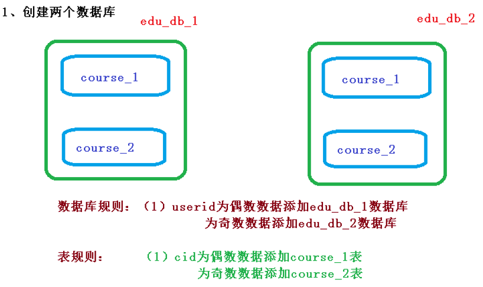

2.创建数据库和表


```sql
-- 创建数据库 edu_db_1
CREATE DATABASE IF NOT EXISTS `edu_db_1` DEFAULT CHARACTER SET utf8mb4 COLLATE utf8mb4_0900_ai_ci;

USE `edu_db_1`;

-- 创建 course_1 表
CREATE TABLE IF NOT EXISTS `course_1` (
  `cid` BIGINT(20) NOT NULL COMMENT '课程ID',
  `cname` VARCHAR(50) NOT NULL COMMENT '课程名称',
  `user_id` BIGINT(20) NOT NULL COMMENT '用户ID',
  `cstatus` VARCHAR(50) NOT NULL COMMENT '课程状态',
  PRIMARY KEY (`cid`)
) ENGINE=InnoDB DEFAULT CHARSET=utf8mb4 COMMENT='课程表1';

-- 创建 course_2 表
CREATE TABLE IF NOT EXISTS `course_2` (
  `cid` BIGINT(20) NOT NULL COMMENT '课程ID',
  `cname` VARCHAR(50) NOT NULL COMMENT '课程名称',
  `user_id` BIGINT(20) NOT NULL COMMENT '用户ID',
  `cstatus` VARCHAR(50) NOT NULL COMMENT '课程状态',
  PRIMARY KEY (`cid`)
) ENGINE=InnoDB DEFAULT CHARSET=utf8mb4 COMMENT='课程表2';

-- 创建数据库 edu_db_2
CREATE DATABASE IF NOT EXISTS `edu_db_2` DEFAULT CHARACTER SET utf8mb4 COLLATE utf8mb4_0900_ai_ci;

USE `edu_db_2`;

-- 创建 course_1 表
CREATE TABLE IF NOT EXISTS `course_1` (
  `cid` BIGINT(20) NOT NULL COMMENT '课程ID',
  `cname` VARCHAR(50) NOT NULL COMMENT '课程名称',
  `user_id` BIGINT(20) NOT NULL COMMENT '用户ID',
  `cstatus` VARCHAR(50) NOT NULL COMMENT '课程状态',
  PRIMARY KEY (`cid`)
) ENGINE=InnoDB DEFAULT CHARSET=utf8mb4 COMMENT='课程表1';

-- 创建 course_2 表
CREATE TABLE IF NOT EXISTS `course_2` (
  `cid` BIGINT(20) NOT NULL COMMENT '课程ID',
  `cname` VARCHAR(50) NOT NULL COMMENT '课程名称',
  `user_id` BIGINT(20) NOT NULL COMMENT '用户ID',
  `cstatus` VARCHAR(50) NOT NULL COMMENT '课程状态',
  PRIMARY KEY (`cid`)
) ENGINE=InnoDB DEFAULT CHARSET=utf8mb4 COMMENT='课程表2';
```

#### 2.3.2 配置数据库分片规则

在SpringBoot 配置文件配置数据库分片规则：

```properties
# shardingjdbc 分片策略
# 配置数据源，给数据源起名称,
# 水平分库，配置两个数据源
spring.shardingsphere.datasource.names=m1,m2
# 一个实体类对应两张表，覆盖
spring.main.allow-bean-definition-overriding=true
# 配置第一个数据源具体内容，包含连接池，驱动，地址，用户名和密码
spring.shardingsphere.datasource.m1.type=com.alibaba.druid.pool.DruidDataSource
spring.shardingsphere.datasource.m1.driver-class-name=com.mysql.cj.jdbc.Driver
spring.shardingsphere.datasource.m1.url=jdbc:mysql://localhost:3306/edu_db_1?serverTimezone=GMT%2B8
spring.shardingsphere.datasource.m1.username=root
spring.shardingsphere.datasource.m1.password=root
# 配置第二个数据源具体内容，包含连接池，驱动，地址，用户名和密码
spring.shardingsphere.datasource.m2.type=com.alibaba.druid.pool.DruidDataSource
spring.shardingsphere.datasource.m2.driver-class-name=com.mysql.cj.jdbc.Driver
spring.shardingsphere.datasource.m2.url=jdbc:mysql://localhost:3306/edu_db_2?serverTimezone=GMT%2B8
spring.shardingsphere.datasource.m2.username=root
spring.shardingsphere.datasource.m2.password=root
# 指定数据库分布情况，数据库里面表分布情况
# m1  m2    course_1 course_2
spring.shardingsphere.sharding.tables.course.actual-data-nodes=m$->{1..2}.course_$->{1..2}
# 指定course 表里面主键cid 生成策略  SNOWFLAKE
spring.shardingsphere.sharding.tables.course.key-generator.column=cid
spring.shardingsphere.sharding.tables.course.key-generator.type=SNOWFLAKE
# 指定表分片策略  约定cid 值偶数添加到course_1 表，如果cid 是奇数添加到course_2 表
spring.shardingsphere.sharding.tables.course.table-strategy.inline.sharding-column=cid
spring.shardingsphere.sharding.tables.course.table-strategy.inline.algorithm-expression=course_$->{cid % 2 + 1}
# 指定数据库分片策略 约定user_id 是偶数添加m1，是奇数添加m2
#spring.shardingsphere.sharding.default-database-strategy.inline.sharding-column=user_id
#spring.shardingsphere.sharding.default-database-strategy.inline.algorithm-expression=m$->{user_id % 2 + 1}
spring.shardingsphere.sharding.tables.course.database-strategy.inline..sharding-column=user_id
spring.shardingsphere.sharding.tables.course.database-strategy.inline.algorithm-expression=m$->{user_id % 2 + 1}
# 打开sql 输出日志
spring.shardingsphere.props.sql.show=true
```

#### 2.3.3 编写测试方法

```java
//======================测试水平分库=====================

//添加操作
@Test
public void addCourseDb() {
    Course course = new Course();
    course.setCname("javademo1");
    //分库根据user_id
    course.setUserId(111L);
    course.setCstatus("Normal1");
    courseMapper.insert(course);
}

//查询操作
@Test
public void findCourseDb() {
    QueryWrapper<Course> wrapper = new QueryWrapper<>();
    //设置userid 值
    wrapper.eq("user_id", 100L);
    //设置cid 值
    wrapper.eq("cid", 465162909769531393L);
    Course course = courseMapper.selectOne(wrapper);
    System.out.println(course);
}
```

### 2.4 Sharding-JDBC 实现垂直分库

#### 2.4.1 需求分析

1.需求分析

> 垂直分库：达到专库专表的目的

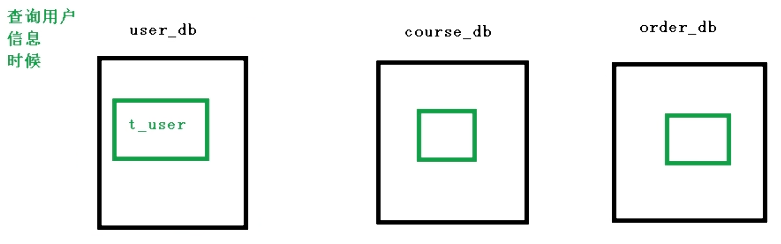

2.创建数据库和表

```sql
-- 创建数据库（垂直分库）
-- 注意：edu_db_1 和 edu_db_2 可能已存在，这里仅创建 user_db

-- 创建 user_db 数据库（专库专表）
CREATE DATABASE IF NOT EXISTS `user_db` DEFAULT CHARACTER SET utf8mb4 COLLATE utf8mb4_0900_ai_ci;

USE `user_db`;

-- 创建 t_user 表（垂直分库：专库专表）
CREATE TABLE IF NOT EXISTS `t_user` (
  `user_id` BIGINT(20) NOT NULL COMMENT '用户ID',
  `username` VARCHAR(50) NOT NULL COMMENT '用户名',
  `ustatus` VARCHAR(50) NOT NULL COMMENT '用户状态',
  PRIMARY KEY (`user_id`)
) ENGINE=InnoDB DEFAULT CHARSET=utf8mb4 COMMENT='用户表（垂直分库）';

-- 注意：
-- 1. edu_db_1 和 edu_db_2 数据库应该已经存在（来自其他模块）
-- 2. 垂直分库的目的是实现专库专表，t_user 表只存在于 user_db 数据库中
-- 3. 配置中 m0 数据源指向 user_db，m1 和 m2 分别指向 edu_db_1 和 edu_db_2
```

#### 2.4.2 编写操作代码

**（1）创建user 实体类和mapper**

```java
@Data
@TableName(value = "t_user")  //指定对应表
public class User {
    private Long userId;
    private String username;
    private String ustatus;
}
```

**（2）配置垂直分库策略**

在 `application.properties` 进行配置：

```properties
# shardingjdbc 分片策略
# 配置数据源，给数据源起名称,
# 水平分库，配置两个数据源
spring.shardingsphere.datasource.names=m1,m2,m0
# 一个实体类对应两张表，覆盖
spring.main.allow-bean-definition-overriding=true
# 配置第一个数据源具体内容，包含连接池，驱动，地址，用户名和密码
spring.shardingsphere.datasource.m1.type=com.alibaba.druid.pool.DruidDataSource
spring.shardingsphere.datasource.m1.driver-class-name=com.mysql.cj.jdbc.Driver
spring.shardingsphere.datasource.m1.url=jdbc:mysql://localhost:3306/edu_db_1?serverTimezone=GMT%2B8
spring.shardingsphere.datasource.m1.username=root
spring.shardingsphere.datasource.m1.password=root
# 配置第二个数据源具体内容，包含连接池，驱动，地址，用户名和密码
spring.shardingsphere.datasource.m2.type=com.alibaba.druid.pool.DruidDataSource
spring.shardingsphere.datasource.m2.driver-class-name=com.mysql.cj.jdbc.Driver
spring.shardingsphere.datasource.m2.url=jdbc:mysql://localhost:3306/edu_db_2?serverTimezone=GMT%2B8
spring.shardingsphere.datasource.m2.username=root
spring.shardingsphere.datasource.m2.password=root
# 配置第三个数据源具体内容，包含连接池，驱动，地址，用户名和密码
spring.shardingsphere.datasource.m0.type=com.alibaba.druid.pool.DruidDataSource
spring.shardingsphere.datasource.m0.driver-class-name=com.mysql.cj.jdbc.Driver
spring.shardingsphere.datasource.m0.url=jdbc:mysql://localhost:3306/user_db?serverTimezone=GMT%2B8
spring.shardingsphere.datasource.m0.username=root
spring.shardingsphere.datasource.m0.password=root
# 配置user_db 数据库里面t_user 专库专表
spring.shardingsphere.sharding.tables.t_user.actual-data-nodes=m$->{0}.t_user
# 指定course 表里面主键cid 生成策略  SNOWFLAKE
spring.shardingsphere.sharding.tables.t_user.key-generator.column=user_id
spring.shardingsphere.sharding.tables.t_user.key-generator.type=SNOWFLAKE
# 指定表分片策略  约定cid 值偶数添加到course_1 表，如果cid 是奇数添加到course_2 表
spring.shardingsphere.sharding.tables.t_user.table-strategy.inline.sharding-column=user_id
spring.shardingsphere.sharding.tables.t_user.table-strategy.inline.algorithm-expression=t_user
```

**（3）编写测试代码**

```java
//注入user 的mapper
@Autowired
private UserMapper userMapper;

//======================测试垂直分库==================
//添加操作
@Test
public void addUserDb() {
    User user = new User();
    user.setUsername("lucy");
    user.setUstatus("a");
    userMapper.insert(user);
}
```

**（4）日志打印**

```properties
2026-01-13 00:12:46.013  INFO 29480 --- [           main] ShardingSphere-SQL                       : Logic SQL: INSERT INTO t_user  ( username,
ustatus )  VALUES  ( ?,
? )
2026-01-13 00:12:46.014  INFO 29480 --- [           main] ShardingSphere-SQL                       : SQLStatement: InsertStatement(super=DMLStatement(super=AbstractSQLStatement(type=DML, tables=Tables(tables=[Table(name=t_user, alias=Optional.absent())]), routeConditions=Conditions(orCondition=OrCondition(andConditions=[AndCondition(conditions=[])])), encryptConditions=Conditions(orCondition=OrCondition(andConditions=[])), sqlTokens=[TableToken(tableName=t_user, quoteCharacter=NONE, schemaNameLength=0), SQLToken(startIndex=20)], parametersIndex=2, logicSQL=INSERT INTO t_user  ( username,
ustatus )  VALUES  ( ?,
? )), deleteStatement=false, updateTableAlias={}, updateColumnValues={}, whereStartIndex=0, whereStopIndex=0, whereParameterStartIndex=0, whereParameterEndIndex=0), columnNames=[username, ustatus], values=[InsertValue(columnValues=[org.apache.shardingsphere.core.parse.old.parser.expression.SQLPlaceholderExpression@2e3252, org.apache.shardingsphere.core.parse.old.parser.expression.SQLPlaceholderExpression@77cddc0c])])
2026-01-13 00:12:46.014  INFO 29480 --- [           main] ShardingSphere-SQL                       : Actual SQL: m0 ::: INSERT INTO t_user   (username, ustatus, user_id) VALUES (?, ?, ?) ::: [lucy, a, 1217626441143812097]
插入成功，生成的user_id: null
```

### 2.5 Sharding-JDBC 操作公共表

#### 2.5.1 公共表概念

**公共表**：

1. 存储固定数据的表，表数据很少发生变化，查询时候经常进行关联
2. 在每个数据库中创建出相同结构公共表

#### 2.5.2 创建公共表

在多个数据库都创建相同结构公共表

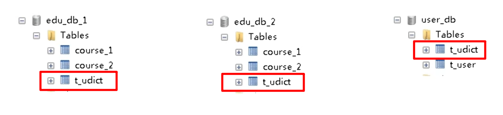

```sql
-- 创建数据库（公共表：广播表）
-- 注意：公共表需要在每个数据库中创建相同结构的表

-- 创建 edu_db_1 数据库（如果不存在）
CREATE DATABASE IF NOT EXISTS `edu_db_1` DEFAULT CHARACTER SET utf8mb4 COLLATE utf8mb4_0900_ai_ci;

USE `edu_db_1`;

-- 创建 t_udict 表（公共表：广播表）
CREATE TABLE IF NOT EXISTS `t_udict` (
  `dictid` BIGINT(20) NOT NULL COMMENT '字典ID',
  `ustatus` VARCHAR(50) NOT NULL COMMENT '状态',
  `uvalue` VARCHAR(50) NOT NULL COMMENT '值',
  PRIMARY KEY (`dictid`)
) ENGINE=InnoDB DEFAULT CHARSET=utf8mb4 COMMENT='字典表（公共表）';

-- 创建 edu_db_2 数据库（如果不存在）
CREATE DATABASE IF NOT EXISTS `edu_db_2` DEFAULT CHARACTER SET utf8mb4 COLLATE utf8mb4_0900_ai_ci;

USE `edu_db_2`;

-- 创建 t_udict 表（公共表：广播表）
CREATE TABLE IF NOT EXISTS `t_udict` (
  `dictid` BIGINT(20) NOT NULL COMMENT '字典ID',
  `ustatus` VARCHAR(50) NOT NULL COMMENT '状态',
  `uvalue` VARCHAR(50) NOT NULL COMMENT '值',
  PRIMARY KEY (`dictid`)
) ENGINE=InnoDB DEFAULT CHARSET=utf8mb4 COMMENT='字典表（公共表）';

-- 注意：
-- 1. 公共表（广播表）需要在每个数据库中创建相同结构的表
-- 2. 对公共表的任何操作（增删改查）都会同步到所有数据库中的该表
-- 3. 公共表适用于存储固定数据，如字典表、配置表等
```

#### 2.5.3 配置公共表

在项目配置文件 `application.properties` 进行公共表配置：

```properties
spring.application.name=SS-04-BroadCast-Table

# shardingjdbc 分片策略
# 配置数据源，给数据源起名称,
# 公共表，配置两个数据源（公共表需要在每个数据库中创建）
spring.shardingsphere.datasource.names=m1,m2
# 一个实体类对应两张表，覆盖
spring.main.allow-bean-definition-overriding=true

# 配置第一个数据源具体内容，包含连接池，驱动，地址，用户名和密码
spring.shardingsphere.datasource.m1.type=com.alibaba.druid.pool.DruidDataSource
spring.shardingsphere.datasource.m1.driver-class-name=com.mysql.cj.jdbc.Driver
spring.shardingsphere.datasource.m1.url=jdbc:mysql://localhost:3306/edu_db_1?serverTimezone=GMT%2B8
spring.shardingsphere.datasource.m1.username=root
spring.shardingsphere.datasource.m1.password=root

# 配置第二个数据源具体内容，包含连接池，驱动，地址，用户名和密码
spring.shardingsphere.datasource.m2.type=com.alibaba.druid.pool.DruidDataSource
spring.shardingsphere.datasource.m2.driver-class-name=com.mysql.cj.jdbc.Driver
spring.shardingsphere.datasource.m2.url=jdbc:mysql://localhost:3306/edu_db_2?serverTimezone=GMT%2B8
spring.shardingsphere.datasource.m2.username=root
spring.shardingsphere.datasource.m2.password=root

# 配置公共表（广播表）
spring.shardingsphere.sharding.broadcast-tables=t_udict
spring.shardingsphere.sharding.tables.t_udict.key-generator.column=dictid
spring.shardingsphere.sharding.tables.t_udict.key-generator.type=SNOWFLAKE

# 打开sql 输出日志
spring.shardingsphere.props.sql.show=true

# MyBatis Plus 配置
mybatis-plus.configuration.map-underscore-to-camel-case=true
mybatis-plus.mapper-locations=classpath*:/mapper/**/*.xml

```

#### 2.5.4 编写测试代码

**（1）创建新实体类和mapper**

```java

@Data
@TableName(value = "t_udict")
public class Udict {
    private Long dictid;
    private String ustatus;
    private String uvalue;
}
```

**（2）编写添加和删除方法进行测试**

```java

@Autowired
private UdictMapper udictMapper;

//======================测试公共表===================
//添加操作
@Test
public void addDict() {
    Udict udict = new Udict();
    udict.setUstatus("a");
    udict.setUvalue("已启用");
    udictMapper.insert(udict);
}

//删除操作
@Test
public void deleteDict() {
    QueryWrapper<Udict> wrapper = new QueryWrapper<>();
    //设置userid 值
    wrapper.eq("dictid", 465191484111454209L);
    udictMapper.delete(wrapper);
}
```

### 2.6 Sharding-JDBC 实现读写分离

#### 2.6.1 读写分离核心原理

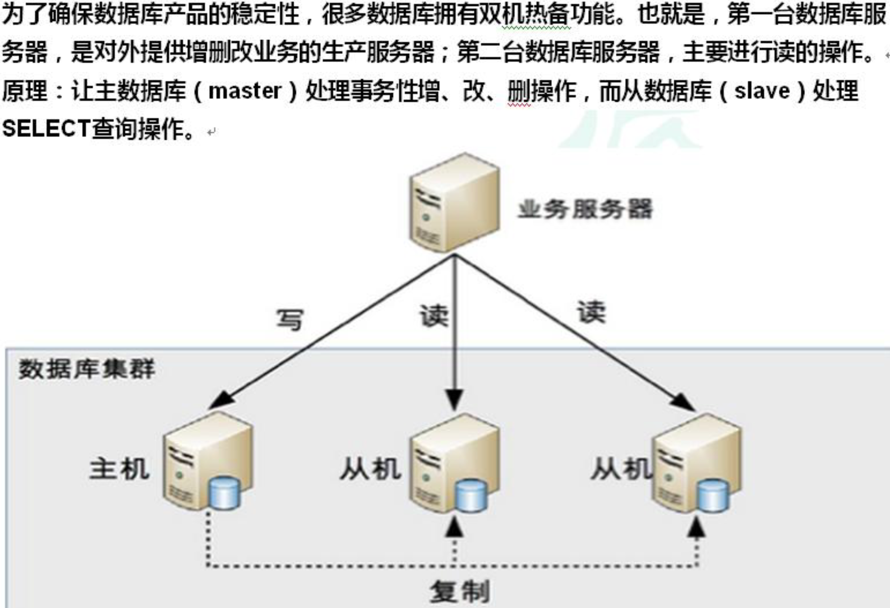

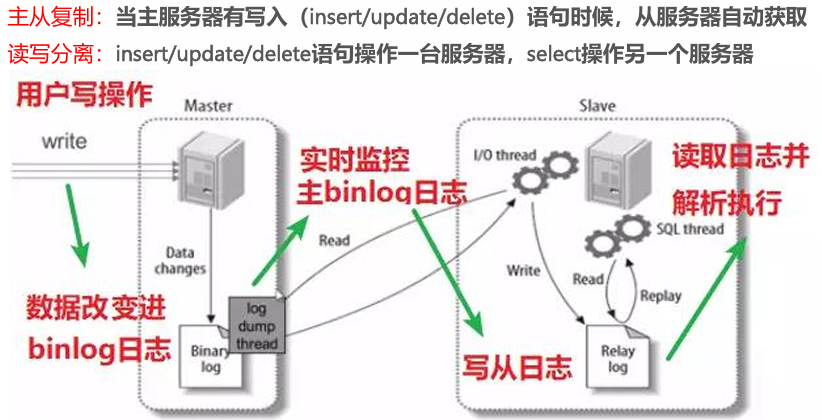

**Sharding-JDBC读写分离**：Sharding-JDBC读写分离是根据SQL语义的分析，将读操作和写操作分别路由至主库与从库。 它提供透明化读写分离，让使用方尽量像使用一个数据库一样使用主从数据库集群。Sharding-JDBC 通过sql 语句语义分析，实现读写分离过程。Sharding-JDBC不会做主从数据同步，主从数据同步还是需要依赖MySQL的主从复制机制

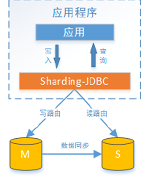

Sharding-JDBC提供一主多从的读写分离配置，可独立使用，也可配合分库分表使用，同一线程且同一数据库连接内，如有写入操作，以后的读操作均从主库读取，用于保证数据一致性。Sharding-JDBC不提供主从数据库的数据同步功能，需要采用其他机制支持。

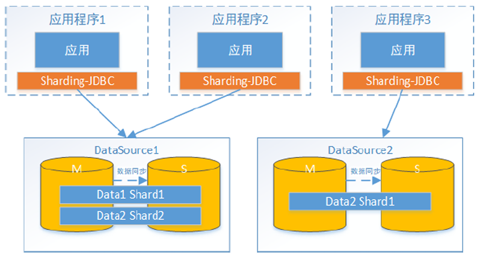


#### 2.6.2 MySQL 配置读写分离

**第一步：创建两个MySQL 数据库服务，并且启动两个MySQL 服务**

1. 复制之前MySQL 目录
2. 修改复制之后配置文件
    - 修改端口号，文件路径
    - 需要把数据文件目录再复制一份
3. 把复制修改之后从数据库在windows 安装服务

使用命令：

```bash
mysqld install mysqls1 --defaults-file="D:\Program Files\MySQL\MySQL Server-s1\my.ini"
```

**第二步：配置MySQL 主从服务器**

**（1）在主服务器配置文件**

```ini
[mysqld]
#开启日志
log‐bin = mysql‐bin
#设置服务id，主从不能一致
server‐id = 1
#设置需要同步的数据库
binlog‐do‐db=user_db
#屏蔽系统库同步
binlog‐ignore‐db=mysql
binlog‐ignore‐db=information_schema
binlog‐ignore‐db=performance_schema
```

**（2）在从服务器配置文件**

```ini
[mysqld]
#开启日志
log‐bin = mysql‐bin
#设置服务id，主从不能一致
server‐id = 2
#设置需要同步的数据库
replicate_wild_do_table=user_db.%
#屏蔽系统库同步
replicate_wild_ignore_table=mysql.%
replicate_wild_ignore_table=information_schema.%
replicate_wild_ignore_table=performance_schema.%
```

**（3）把主和从服务器重启**

**第三步：创建用于主从复制的账号**

```sql
#切换至主库bin目录
，
登录主库
mysql
‐h localhost
‐uroot
‐p

#授权主备复制专用账号
GRANT REPLICATION SLAVE ON *.* TO 'db_sync'@'%' IDENTIFIED BY 'db_sync';

#刷新权限
FLUSH PRIVILEGES;

#确认位点
记录下文件名以及位点
show master status;
```

**第四步：主从数据同步设置**

```sql
#切换至从库bin目录
，
登录从库
mysql
‐h localhost
‐P3307
‐uroot
‐p

#先停止同步
STOP SLAVE;

#修改从库指向到主库
，
使用上一步记录的文件名以及位点
CHANGE MASTER TO
master_host = 'localhost',
master_user = 'db_sync',
master_password = 'db_sync',
master_log_file = 'mysql-bin.000177',
master_log_pos = 107;

#启动同步
START SLAVE;

#查看Slave_IO_Runing和Slave_SQL_Runing字段值都为Yes
，
表示同步配置成功
。如果不为Yes
，请排查相关异常
。
show slave status
```

#### 2.6.3 Sharding-JDBC 操作

**（1）创建数据库**

```sql
-- 创建数据库（读写分离）
-- 注意：读写分离需要配置 MySQL 主从复制
-- 主库：localhost:3306
-- 从库：localhost:3307

-- 在主库创建 user_db 数据库
CREATE DATABASE IF NOT EXISTS `user_db` DEFAULT CHARACTER SET utf8mb4 COLLATE utf8mb4_0900_ai_ci;

USE `user_db`;

-- 在主库创建 t_user 表
CREATE TABLE IF NOT EXISTS `t_user` (
  `user_id` BIGINT(20) NOT NULL COMMENT '用户ID',
  `username` VARCHAR(50) NOT NULL COMMENT '用户名',
  `ustatus` VARCHAR(50) NOT NULL COMMENT '用户状态',
  PRIMARY KEY (`user_id`)
) ENGINE=InnoDB DEFAULT CHARSET=utf8mb4 COMMENT='用户表（读写分离）';

-- 注意：
-- 1. 从库的数据库和表会通过 MySQL 主从复制自动创建
-- 2. 需要在从库（localhost:3307）中配置主从复制
-- 3. 配置主从复制后，主库的数据会自动同步到从库
-- 4. Sharding-JDBC 会自动将写操作路由到主库，读操作路由到从库
```

**（2）配置读写分离策略**

```properties
# user_db 从服务器
spring.shardingsphere.datasource.s0.type=com.alibaba.druid.pool.DruidDataSource
spring.shardingsphere.datasource.s0.driver-class-name=com.mysql.cj.jdbc.Driver
spring.shardingsphere.datasource.s0.url=jdbc:mysql://localhost:3307/user_db?serverTimezone=GMT%2B8
spring.shardingsphere.datasource.s0.username=root
spring.shardingsphere.datasource.s0.password=root
# 主库从库逻辑数据源定义 ds0 为user_db
spring.shardingsphere.sharding.master-slave-rules.ds0.master-data-source-name=m0
spring.shardingsphere.sharding.master-slave-rules.ds0.slave-data-source-names=s0
# 配置user_db 数据库里面t_user 专库专表
#spring.shardingsphere.sharding.tables.t_user.actual-data-nodes=m$->{0}.t_user
# t_user 分表策略，固定分配至ds0 的t_user 真实表
spring.shardingsphere.sharding.tables.t_user.actual-data-nodes=ds0.t_user
```

**（3）编写测试代码**

```java
//添加操作
@Test
public void addUserDb() {
    User user = new User();
    user.setUsername("lucymary");
    user.setUstatus("a");
    userMapper.insert(user);
}

//查询操作
@Test
public void findUserDb() {
    QueryWrapper<User> wrapper = new QueryWrapper<>();
    //设置userid 值
    wrapper.eq("user_id", 465508031619137537L);
    User user = userMapper.selectOne(wrapper);
    System.out.println(user);
}
```

---

## 第 3 章 Sharding-Proxy

### 3.1 Sharding-Proxy 简介

> ShardingSphere-Proxy 的定位为透明化的数据库代理，理论上支持任何使用 MySQL、PostgreSQL、openGauss 协议的客户端操作数据，对异构语言、运维场景更友好。
>
> ShardingSphere-Proxy 定位为透明化的数据库代理端，提供封装了数据库二进制协议的服务端版本，用于完成对异构语言的支持。目前先提供MySQL/PostgreSQL版本，它可以使用任何兼容MySQL/PostgreSQL协议的访问客户端(如:MySQLCommand Client,MySQLWorkbench，Navicat等)操作数据，对DBA更加友好。
>
> - 向应用程序完全透明，可直接当做MySQL/PostgreSQL使用。
> - 适用于任何兼容MySQL/PostgreSQL协议的的客户端。

- 定位为透明的数据库代理端
- Sharding-Proxy 独立应用，需要安装服务，进行分库分表或者读写分离配置，启动使用

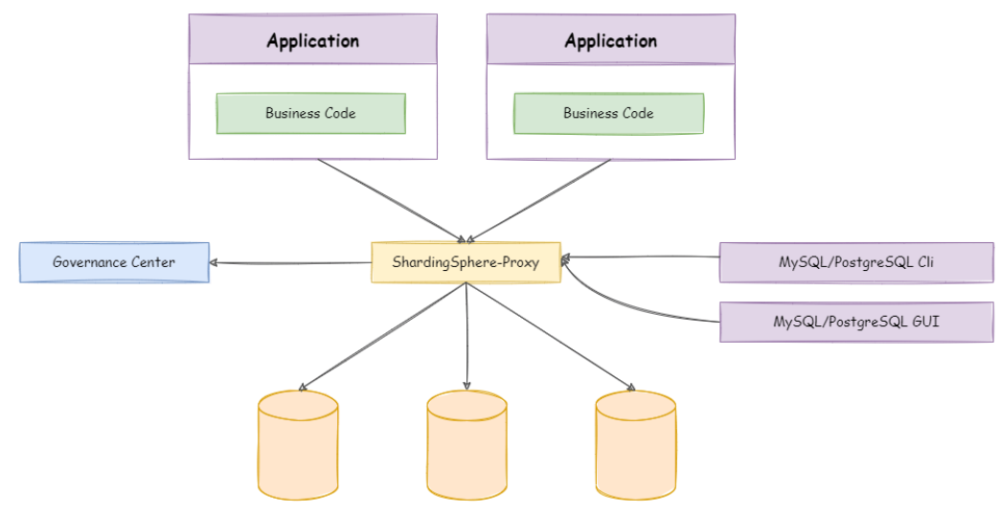

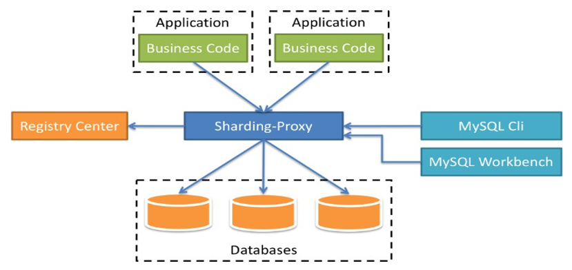

### 3.2 安装

> 官网安装包：[下载 :: ShardingSphere](https://shardingsphere.apache.org/document/4.1.0/cn/downloads/)
>
> 较高的版本：ShardingSphere 5.1.1 Proxy、地址：https://archive.apache.org/dist/shardingsphere/5.1.1/apache-shardingsphere-5.1.1-shardingsphere-proxy-bin.tar.gz
>
> Sharding-Proxy 4.0.1 版本 存在bug，可以考虑其他版本

1.下载安装软件（官网上找到安装包）

> ShardingSphere的发布版包括源码包及其对应的二进制包。由于下载内容分布在镜像服务器上，所以下载后应该进行GPG或SHA-512校验，以此来保证内容没有被篡改。

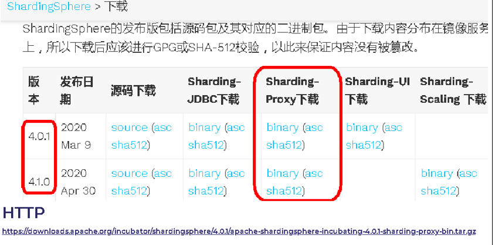

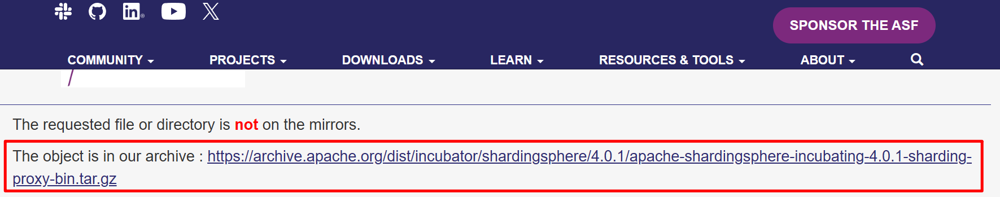

2.把下载之后压缩文件，解压，启动bin 目录启动文件就可以了

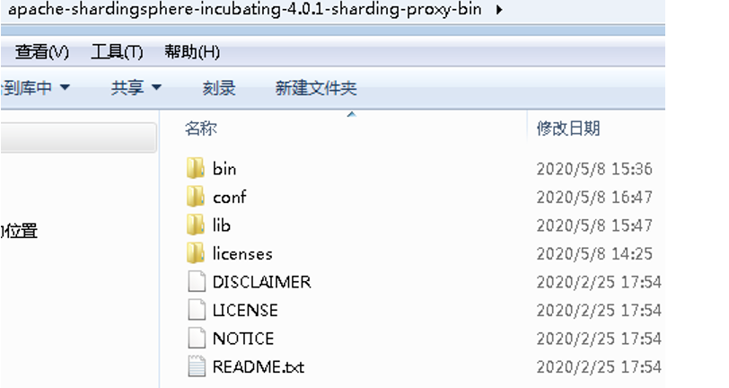

3.windows系统和Linux系统的安装都一样，只是启动的脚本不一样

>  Windows 系统操作：进入`bin` 目录，直接双击 `start.bat` 即可启动，或在 CMD/PowerShell 中执行`start.bat`
>
>  Linux 系统操作：进入 `bin` 目录，`nohup ./start.sh > /dev/null 2>&1 &` (后台启动（不占用当前终端）)

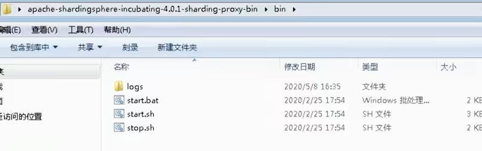

### 3.3 Sharding-Proxy 实现分表

#### 3.3.1 创建数据库

```sql
-- 创建名为 edu_1 的数据库，字符集建议使用 utf8mb4 兼容所有特殊字符
CREATE DATABASE IF NOT EXISTS edu_1 DEFAULT CHARACTER SET utf8mb4 COLLATE utf8mb4_general_ci;

-- 创建名为 edu_1 的数据库，字符集建议使用 utf8mb4 兼容所有特殊字符
CREATE DATABASE IF NOT EXISTS edu_2 DEFAULT CHARACTER SET utf8mb4 COLLATE utf8mb4_general_ci;
```

#### 3.3.2 配置分库规则

1.进入conf 目录，修改文件 `server.yaml`，打开如下内容注释（取消原有注释）

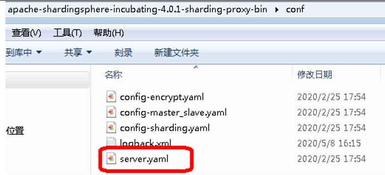

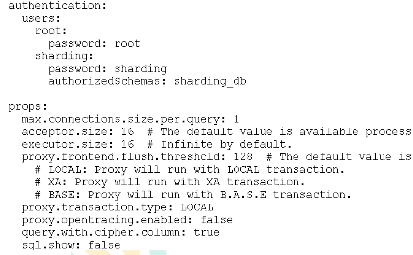

```yaml
authentication:
  users:
    root:
      password: 123456
    sharding:
      password: sharding
      authorizedSchemas: sharding_db

props:
  max.connections.size.per.query: 1
  acceptor.size: 16  # The default value is available processors count * 2.
  executor.size: 16  # Infinite by default.
  proxy.frontend.flush.threshold: 128  # The default value is 128.
  # LOCAL: Proxy will run with LOCAL transaction.
  # XA: Proxy will run with XA transaction.
  # BASE: Proxy will run with B.A.S.E transaction.
  proxy.transaction.type: LOCAL
  proxy.opentracing.enabled: false
  query.with.cipher.column: true
  sql.show: false
```

2.从本地maven仓库中找到mysql驱动jar包，复制mysql 驱动jar包到Sharding-Proxy的lib目录

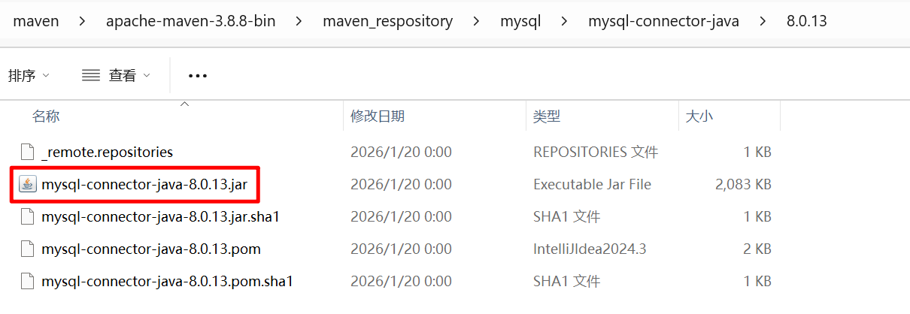

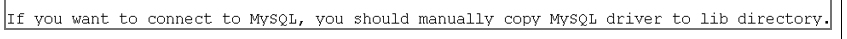

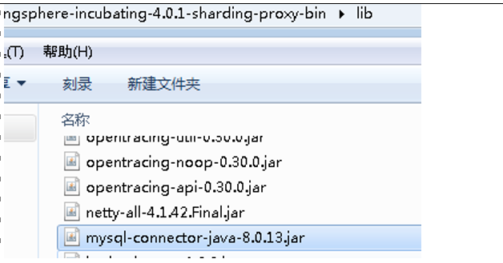

3.配置分库分表规则：进入 conf 目录，修改 `config-sharding.yaml`

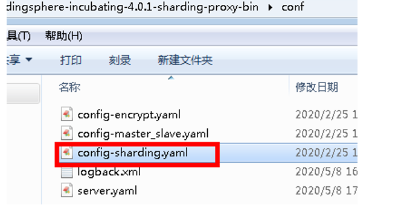

`config-sharding.yaml`配置示例：

```yaml
schemaName: sharding_db

dataSources:
  ds_0:
    url: jdbc:mysql://127.0.0.1:3306/edu_1?serverTimezone=UTC&useSSL=false
    username: root
    password: root
    connectionTimeoutMilliseconds: 30000
    idleTimeoutMilliseconds: 60000
    maxLifetimeMilliseconds: 1800000
    maxPoolSize: 50

shardingRule:
  tables:
    t_order:
      actualDataNodes: ds_${0}.t_order_${0..1}
      tableStrategy:
        inline:
          shardingColumn: order_id
          algorithmExpression: t_order_${order_id % 2}
      keyGenerator:
        type: SNOWFLAKE
        column: order_id
  bindingTables:
    - t_order
  defaultDatabaseStrategy:
    inline:
      shardingColumn: user_id
      algorithmExpression: ds_${0}
  defaultTableStrategy:
    none:
```

4.创建数据库

```sql
-- 创建名为 edu_1 的数据库，字符集建议使用 utf8mb4 兼容所有特殊字符
CREATE DATABASE IF NOT EXISTS edu_1 DEFAULT CHARACTER SET utf8mb4 COLLATE utf8mb4_general_ci;


-- 创建名为 edu_1 的数据库，字符集建议使用 utf8mb4 兼容所有特殊字符
CREATE DATABASE IF NOT EXISTS edu_2 DEFAULT CHARACTER SET utf8mb4 COLLATE utf8mb4_general_ci;
```

#### 3.3.3 启动和使用

1.启动Sharding-Proxy服务（Sharding-Proxy 默认端口号 3307）

> Windows 系统操作：进入`bin` 目录，直接双击 `start.bat` 即可启动，或在 CMD/PowerShell 中执行`start.bat`
>
> - 指定端口启动： .\start.bat 3308
>
> Linux 系统操作：进入 `bin` 目录，`nohup ./start.sh > /dev/null 2>&1 &` (后台启动（不占用当前终端）)

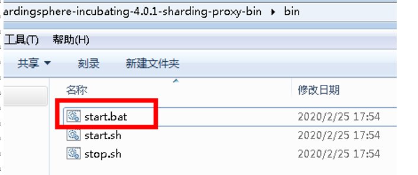

> 使用目录指定3308端口进行启动：.\start.bat 3308


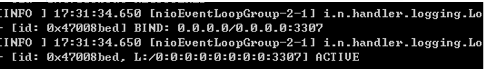

2.通过Sharding-Proxy 启动端口进行连接，进行数据库访问和修改查询

- 打开cmd 窗口连接Sharding-Proxy，连接方式和连接mysql 一样的

```sql
mysql -h127.0.0.1 -P3308 -uroot -p
```

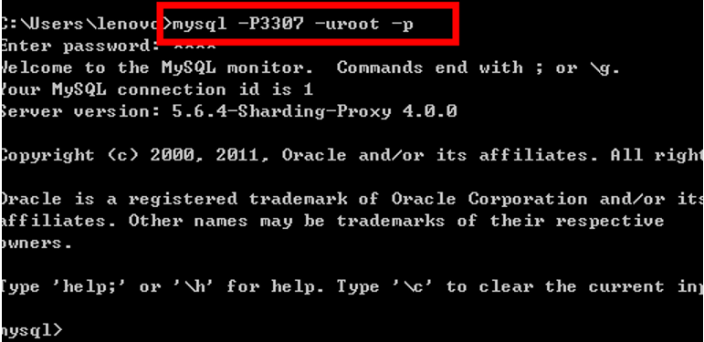

- 进行sql 命令操作看到只有一个库

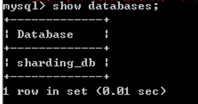

- 在sharding_db 数据库创建表

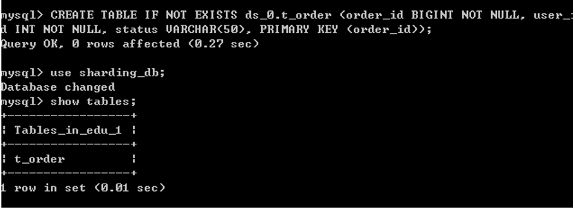

- 向表添加一条记录

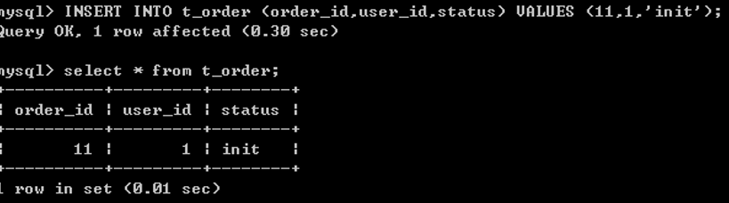

- 回到本地3306 端口实际数据库中，看到已经创建好了表和添加数据

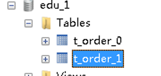

### 3.4 Sharding-Proxy 配置（分库）

#### 3.4.1 创建数据库

创建两个数据库

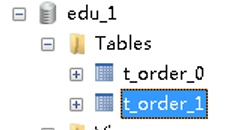

#### 3.4.2 配置分库规则

找到conf 目录，`config-sharding.yaml`：

```yaml
schemaName: sharding_db

dataSources:
  ds_0:
    url: jdbc:mysql://127.0.0.1:3306/edu_db_1?serverTimezone=UTC&useSSL=false
    username: root
    password: root
    connectionTimeoutMilliseconds: 30000
    idleTimeoutMilliseconds: 60000
    maxLifetimeMilliseconds: 1800000
    maxPoolSize: 50
  ds_1:
    url: jdbc:mysql://127.0.0.1:3306/edu_db_2?serverTimezone=UTC&useSSL=false
    username: root
    password: root
    connectionTimeoutMilliseconds: 30000
    idleTimeoutMilliseconds: 60000
    maxLifetimeMilliseconds: 1800000
    maxPoolSize: 50

shardingRule:
  tables:
    t_order:
      actualDataNodes: ds_${0..1}.t_order_${1..2}
      tableStrategy:
        inline:
          shardingColumn: order_id
          algorithmExpression: t_order_${order_id % 2 + 1}
      keyGenerator:
        type: SNOWFLAKE
        column: order_id
  bindingTables:
    - t_order
  defaultDatabaseStrategy:
    inline:
      shardingColumn: user_id
      algorithmExpression: ds_${user_id % 2}
  defaultTableStrategy:
    none:
```

#### 3.4.3 启动和使用

1.启动Sharding-Proxy 服务

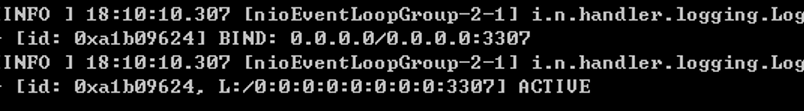

2.打开cmd 仓库，连接Sharding-Proxy 服务

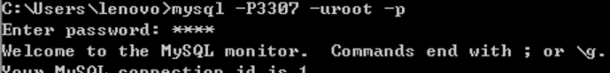

- 创建数据库表，向表添加记录

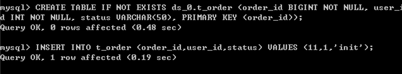

- 连接本地3306 的MySql 数据库服务器，表已经创建出来，表里面有数据

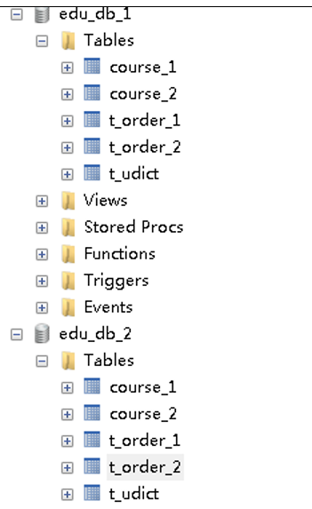

### 3.5 Sharding-Proxy 配置（读写分离）

#### 3.5.1 创建数据库

创建三个数据库

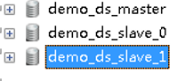

#### 3.5.2 配置读写分离

修改conf 里面配置文件，`config-master-slave.yaml`：

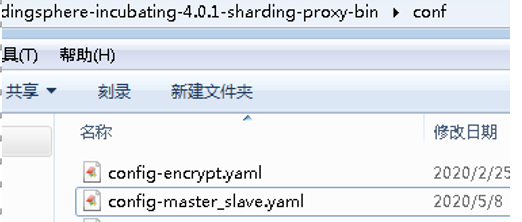

```yaml
schemaName: master_slave_db

dataSources:
  master_ds:
    url: jdbc:mysql://127.0.0.1:3306/demo_ds_master?serverTimezone=UTC&useSSL=false
    username: root
    password: root
    connectionTimeoutMilliseconds: 30000
    idleTimeoutMilliseconds: 60000
    maxLifetimeMilliseconds: 1800000
    maxPoolSize: 50
  slave_ds_0:
    url: jdbc:mysql://127.0.0.1:3306/demo_ds_slave_0?serverTimezone=UTC&useSSL=false
    username: root
    password: root
    connectionTimeoutMilliseconds: 30000
    idleTimeoutMilliseconds: 60000
    maxLifetimeMilliseconds: 1800000
    maxPoolSize: 50
  slave_ds_1:
    url: jdbc:mysql://127.0.0.1:3306/demo_ds_slave_1?serverTimezone=UTC&useSSL=false
    username: root
    password: root
    connectionTimeoutMilliseconds: 30000
    idleTimeoutMilliseconds: 60000
    maxLifetimeMilliseconds: 1800000
    maxPoolSize: 50

masterSlaveRule:
  name: ms_ds
  masterDataSourceName: master_ds
  slaveDataSourceNames:
    - slave_ds_0
    - slave_ds_1
```

#### 3.5.3 启动和使用

1.启动Sharding-Proxy 服务

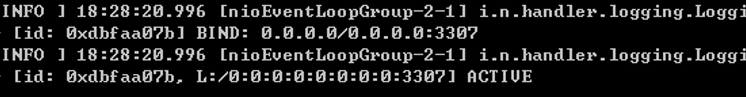

2.通过cmd 连接Sharding-Proxy，进行创建表和添加记录操作

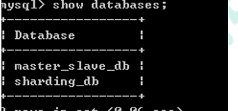

- 在主数据库和从数据库里面，都创建数据库表

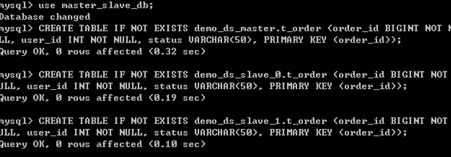

- 向表添加记录，不指定向哪个库添加
    - 把添加数据添加到主数据库里面

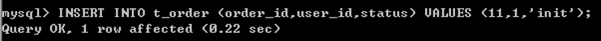

- 查询数据库表数据，不指定查询哪个库
    - 直接执行查询从库里面的数据

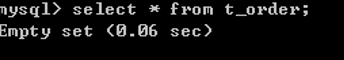


